cola Report for GDS4412
==================

**Date**: 2019-12-25 21:35:56 CET, **cola version**: 1.3.2

----------------------------------------------------------------

<style type='text/css'>

body, td, th {
   font-family: Arial,Helvetica,sans-serif;
   background-color: white;
   font-size: 13px;
  max-width: 800px;
  margin: auto;
  margin-left:210px;
  padding: 0px 10px 0px 10px;
  border-left: 1px solid #EEEEEE;
  line-height: 150%;
}

tt, code, pre {
   font-family: 'DejaVu Sans Mono', 'Droid Sans Mono', 'Lucida Console', Consolas, Monaco, 

monospace;
}

h1 {
   font-size:2.2em;
}

h2 {
   font-size:1.8em;
}

h3 {
   font-size:1.4em;
}

h4 {
   font-size:1.0em;
}

h5 {
   font-size:0.9em;
}

h6 {
   font-size:0.8em;
}

a {
  text-decoration: none;
  color: #0366d6;
}

a:hover {
  text-decoration: underline;
}

a:visited {
   color: #0366d6;
}

pre, img {
  max-width: 100%;
}
pre {
  overflow-x: auto;
}
pre code {
   display: block; padding: 0.5em;
}

code {
  font-size: 92%;
  border: 1px solid #ccc;
}

code[class] {
  background-color: #F8F8F8;
}

table, td, th {
  border: 1px solid #ccc;
}

blockquote {
   color:#666666;
   margin:0;
   padding-left: 1em;
   border-left: 0.5em #EEE solid;
}

hr {
   height: 0px;
   border-bottom: none;
   border-top-width: thin;
   border-top-style: dotted;
   border-top-color: #999999;
}

@media print {
   * {
      background: transparent !important;
      color: black !important;
      filter:none !important;
      -ms-filter: none !important;
   }

   body {
      font-size:12pt;
      max-width:100%;
   }

   a, a:visited {
      text-decoration: underline;
   }

   hr {
      visibility: hidden;
      page-break-before: always;
   }

   pre, blockquote {
      padding-right: 1em;
      page-break-inside: avoid;
   }

   tr, img {
      page-break-inside: avoid;
   }

   img {
      max-width: 100% !important;
   }

   @page :left {
      margin: 15mm 20mm 15mm 10mm;
   }

   @page :right {
      margin: 15mm 10mm 15mm 20mm;
   }

   p, h2, h3 {
      orphans: 3; widows: 3;
   }

   h2, h3 {
      page-break-after: avoid;
   }
}
</style>


## Summary


All available functions which can be applied to this `res_list` object:


```r
res_list
```

```
#> A 'ConsensusPartitionList' object with 24 methods.
#>   On a matrix with 31632 rows and 56 columns.
#>   Top rows are extracted by 'SD, CV, MAD, ATC' methods.
#>   Subgroups are detected by 'hclust, kmeans, skmeans, pam, mclust, NMF' method.
#>   Number of partitions are tried for k = 2, 3, 4, 5, 6.
#>   Performed in total 30000 partitions by row resampling.
#> 
#> Following methods can be applied to this 'ConsensusPartitionList' object:
#>  [1] "cola_report"           "collect_classes"       "collect_plots"         "collect_stats"        
#>  [5] "colnames"              "functional_enrichment" "get_anno_col"          "get_anno"             
#>  [9] "get_classes"           "get_matrix"            "get_membership"        "get_stats"            
#> [13] "is_best_k"             "is_stable_k"           "ncol"                  "nrow"                 
#> [17] "rownames"              "show"                  "suggest_best_k"        "test_to_known_factors"
#> [21] "top_rows_heatmap"      "top_rows_overlap"     
#> 
#> You can get result for a single method by, e.g. object["SD", "hclust"] or object["SD:hclust"]
#> or a subset of methods by object[c("SD", "CV")], c("hclust", "kmeans")]
```

The call of `run_all_consensus_partition_methods()` was:


```
#> run_all_consensus_partition_methods(data = mat, mc.cores = 4, anno = anno)
```

Dimension of the input matrix:


```r
mat = get_matrix(res_list)
dim(mat)
```

```
#> [1] 31632    56
```

### Density distribution

The density distribution for each sample is visualized as in one column in the
following heatmap. The clustering is based on the distance which is the
Kolmogorov-Smirnov statistic between two distributions.


```r
library(ComplexHeatmap)
densityHeatmap(mat, top_annotation = HeatmapAnnotation(df = get_anno(res_list), 
    col = get_anno_col(res_list)), ylab = "value", cluster_columns = TRUE, show_column_names = FALSE,
    mc.cores = 4)
```

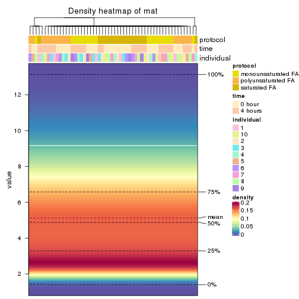


### Suggest the best k


Folowing table shows the best `k` (number of partitions) for each combination
of top-value methods and partition methods. Clicking on the method name in
the table goes to the section for a single combination of methods.

[The cola vignette](http://bioconductor.org/packages/devel/bioc/vignettes/cola/inst/doc/cola.html#toc_13)
explains the definition of the metrics used for determining the best
number of partitions.


```r
suggest_best_k(res_list)
```


|                            | The best k| 1-PAC| Mean silhouette| Concordance|   |Optional k |
|:---------------------------|----------:|-----:|---------------:|-----------:|:--|:----------|
|[SD:hclust](#SD-hclust)     |          2|     1|           1.000|       1.000|** |           |
|[SD:kmeans](#SD-kmeans)     |          2|     1|           0.985|       0.994|** |           |
|[SD:skmeans](#SD-skmeans)   |          2|     1|           1.000|       1.000|** |           |
|[SD:pam](#SD-pam)           |          2|     1|           0.983|       0.993|** |           |
|[SD:mclust](#SD-mclust)     |          2|     1|           0.999|       1.000|** |           |
|[SD:NMF](#SD-NMF)           |          2|     1|           0.978|       0.992|** |           |
|[CV:hclust](#CV-hclust)     |          2|     1|           0.992|       0.996|** |           |
|[CV:kmeans](#CV-kmeans)     |          2|     1|           0.996|       0.998|** |           |
|[CV:skmeans](#CV-skmeans)   |          3|     1|           0.974|       0.984|** |2          |
|[CV:pam](#CV-pam)           |          2|     1|           0.993|       0.997|** |           |
|[CV:mclust](#CV-mclust)     |          2|     1|           1.000|       1.000|** |           |
|[CV:NMF](#CV-NMF)           |          2|     1|           0.998|       0.999|** |           |
|[MAD:hclust](#MAD-hclust)   |          2|     1|           0.994|       0.997|** |           |
|[MAD:kmeans](#MAD-kmeans)   |          2|     1|           1.000|       1.000|** |           |
|[MAD:skmeans](#MAD-skmeans) |          3|     1|           0.966|       0.980|** |2          |
|[MAD:pam](#MAD-pam)         |          2|     1|           0.994|       0.997|** |           |
|[MAD:mclust](#MAD-mclust)   |          2|     1|           1.000|       1.000|** |           |
|[MAD:NMF](#MAD-NMF)         |          2|     1|           0.982|       0.993|** |           |
|[ATC:hclust](#ATC-hclust)   |          5|     1|           0.922|       0.979|** |4          |
|[ATC:kmeans](#ATC-kmeans)   |          2|     1|           0.991|       0.996|** |           |
|[ATC:skmeans](#ATC-skmeans) |          2|     1|           1.000|       1.000|** |           |
|[ATC:pam](#ATC-pam)         |          3|     1|           0.985|       0.994|** |2          |
|[ATC:mclust](#ATC-mclust)   |          2|     1|           0.997|       0.998|** |           |
|[ATC:NMF](#ATC-NMF)         |          2|     1|           0.981|       0.993|** |           |

\*\*: 1-PAC > 0.95, \*: 1-PAC > 0.9


### CDF of consensus matrices

Cumulative distribution function curves of consensus matrix for all methods.


```r
collect_plots(res_list, fun = plot_ecdf)
```

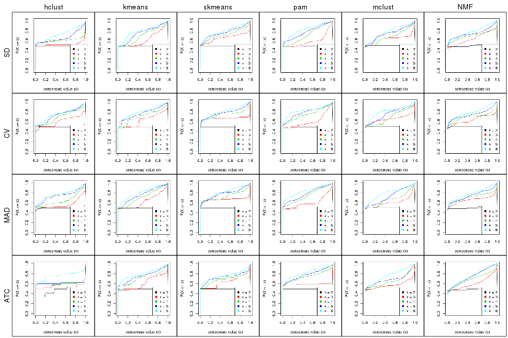


### Consensus heatmap

Consensus heatmaps for all methods. ([What is a consensus heatmap?](http://bioconductor.org/packages/devel/bioc/vignettes/cola/inst/doc/cola.html#toc_9))


<style type='text/css'>


.ui-helper-hidden {
	display: none;
}
.ui-helper-hidden-accessible {
	border: 0;
	clip: rect(0 0 0 0);
	height: 1px;
	margin: -1px;
	overflow: hidden;
	padding: 0;
	position: absolute;
	width: 1px;
}
.ui-helper-reset {
	margin: 0;
	padding: 0;
	border: 0;
	outline: 0;
	line-height: 1.3;
	text-decoration: none;
	font-size: 100%;
	list-style: none;
}
.ui-helper-clearfix:before,
.ui-helper-clearfix:after {
	content: "";
	display: table;
	border-collapse: collapse;
}
.ui-helper-clearfix:after {
	clear: both;
}
.ui-helper-zfix {
	width: 100%;
	height: 100%;
	top: 0;
	left: 0;
	position: absolute;
	opacity: 0;
	filter:Alpha(Opacity=0); 
}

.ui-front {
	z-index: 100;
}


.ui-state-disabled {
	cursor: default !important;
	pointer-events: none;
}


.ui-icon {
	display: inline-block;
	vertical-align: middle;
	margin-top: -.25em;
	position: relative;
	text-indent: -99999px;
	overflow: hidden;
	background-repeat: no-repeat;
}

.ui-widget-icon-block {
	left: 50%;
	margin-left: -8px;
	display: block;
}


.ui-widget-overlay {
	position: fixed;
	top: 0;
	left: 0;
	width: 100%;
	height: 100%;
}
.ui-accordion .ui-accordion-header {
	display: block;
	cursor: pointer;
	position: relative;
	margin: 2px 0 0 0;
	padding: .5em .5em .5em .7em;
	font-size: 100%;
}
.ui-accordion .ui-accordion-content {
	padding: 1em 2.2em;
	border-top: 0;
	overflow: auto;
}
.ui-autocomplete {
	position: absolute;
	top: 0;
	left: 0;
	cursor: default;
}
.ui-menu {
	list-style: none;
	padding: 0;
	margin: 0;
	display: block;
	outline: 0;
}
.ui-menu .ui-menu {
	position: absolute;
}
.ui-menu .ui-menu-item {
	margin: 0;
	cursor: pointer;
	
	list-style-image: url("data:image/gif;base64,R0lGODlhAQABAIAAAAAAAP///yH5BAEAAAAALAAAAAABAAEAAAIBRAA7");
}
.ui-menu .ui-menu-item-wrapper {
	position: relative;
	padding: 3px 1em 3px .4em;
}
.ui-menu .ui-menu-divider {
	margin: 5px 0;
	height: 0;
	font-size: 0;
	line-height: 0;
	border-width: 1px 0 0 0;
}
.ui-menu .ui-state-focus,
.ui-menu .ui-state-active {
	margin: -1px;
}


.ui-menu-icons {
	position: relative;
}
.ui-menu-icons .ui-menu-item-wrapper {
	padding-left: 2em;
}


.ui-menu .ui-icon {
	position: absolute;
	top: 0;
	bottom: 0;
	left: .2em;
	margin: auto 0;
}


.ui-menu .ui-menu-icon {
	left: auto;
	right: 0;
}
.ui-button {
	padding: .4em 1em;
	display: inline-block;
	position: relative;
	line-height: normal;
	margin-right: .1em;
	cursor: pointer;
	vertical-align: middle;
	text-align: center;
	-webkit-user-select: none;
	-moz-user-select: none;
	-ms-user-select: none;
	user-select: none;

	
	overflow: visible;
}

.ui-button,
.ui-button:link,
.ui-button:visited,
.ui-button:hover,
.ui-button:active {
	text-decoration: none;
}


.ui-button-icon-only {
	width: 2em;
	box-sizing: border-box;
	text-indent: -9999px;
	white-space: nowrap;
}


input.ui-button.ui-button-icon-only {
	text-indent: 0;
}


.ui-button-icon-only .ui-icon {
	position: absolute;
	top: 50%;
	left: 50%;
	margin-top: -8px;
	margin-left: -8px;
}

.ui-button.ui-icon-notext .ui-icon {
	padding: 0;
	width: 2.1em;
	height: 2.1em;
	text-indent: -9999px;
	white-space: nowrap;

}

input.ui-button.ui-icon-notext .ui-icon {
	width: auto;
	height: auto;
	text-indent: 0;
	white-space: normal;
	padding: .4em 1em;
}


input.ui-button::-moz-focus-inner,
button.ui-button::-moz-focus-inner {
	border: 0;
	padding: 0;
}
.ui-controlgroup {
	vertical-align: middle;
	display: inline-block;
}
.ui-controlgroup > .ui-controlgroup-item {
	float: left;
	margin-left: 0;
	margin-right: 0;
}
.ui-controlgroup > .ui-controlgroup-item:focus,
.ui-controlgroup > .ui-controlgroup-item.ui-visual-focus {
	z-index: 9999;
}
.ui-controlgroup-vertical > .ui-controlgroup-item {
	display: block;
	float: none;
	width: 100%;
	margin-top: 0;
	margin-bottom: 0;
	text-align: left;
}
.ui-controlgroup-vertical .ui-controlgroup-item {
	box-sizing: border-box;
}
.ui-controlgroup .ui-controlgroup-label {
	padding: .4em 1em;
}
.ui-controlgroup .ui-controlgroup-label span {
	font-size: 80%;
}
.ui-controlgroup-horizontal .ui-controlgroup-label + .ui-controlgroup-item {
	border-left: none;
}
.ui-controlgroup-vertical .ui-controlgroup-label + .ui-controlgroup-item {
	border-top: none;
}
.ui-controlgroup-horizontal .ui-controlgroup-label.ui-widget-content {
	border-right: none;
}
.ui-controlgroup-vertical .ui-controlgroup-label.ui-widget-content {
	border-bottom: none;
}


.ui-controlgroup-vertical .ui-spinner-input {

	
	width: 75%;
	width: calc( 100% - 2.4em );
}
.ui-controlgroup-vertical .ui-spinner .ui-spinner-up {
	border-top-style: solid;
}

.ui-checkboxradio-label .ui-icon-background {
	box-shadow: inset 1px 1px 1px #ccc;
	border-radius: .12em;
	border: none;
}
.ui-checkboxradio-radio-label .ui-icon-background {
	width: 16px;
	height: 16px;
	border-radius: 1em;
	overflow: visible;
	border: none;
}
.ui-checkboxradio-radio-label.ui-checkboxradio-checked .ui-icon,
.ui-checkboxradio-radio-label.ui-checkboxradio-checked:hover .ui-icon {
	background-image: none;
	width: 8px;
	height: 8px;
	border-width: 4px;
	border-style: solid;
}
.ui-checkboxradio-disabled {
	pointer-events: none;
}
.ui-datepicker {
	width: 17em;
	padding: .2em .2em 0;
	display: none;
}
.ui-datepicker .ui-datepicker-header {
	position: relative;
	padding: .2em 0;
}
.ui-datepicker .ui-datepicker-prev,
.ui-datepicker .ui-datepicker-next {
	position: absolute;
	top: 2px;
	width: 1.8em;
	height: 1.8em;
}
.ui-datepicker .ui-datepicker-prev-hover,
.ui-datepicker .ui-datepicker-next-hover {
	top: 1px;
}
.ui-datepicker .ui-datepicker-prev {
	left: 2px;
}
.ui-datepicker .ui-datepicker-next {
	right: 2px;
}
.ui-datepicker .ui-datepicker-prev-hover {
	left: 1px;
}
.ui-datepicker .ui-datepicker-next-hover {
	right: 1px;
}
.ui-datepicker .ui-datepicker-prev span,
.ui-datepicker .ui-datepicker-next span {
	display: block;
	position: absolute;
	left: 50%;
	margin-left: -8px;
	top: 50%;
	margin-top: -8px;
}
.ui-datepicker .ui-datepicker-title {
	margin: 0 2.3em;
	line-height: 1.8em;
	text-align: center;
}
.ui-datepicker .ui-datepicker-title select {
	font-size: 1em;
	margin: 1px 0;
}
.ui-datepicker select.ui-datepicker-month,
.ui-datepicker select.ui-datepicker-year {
	width: 45%;
}
.ui-datepicker table {
	width: 100%;
	font-size: .9em;
	border-collapse: collapse;
	margin: 0 0 .4em;
}
.ui-datepicker th {
	padding: .7em .3em;
	text-align: center;
	font-weight: bold;
	border: 0;
}
.ui-datepicker td {
	border: 0;
	padding: 1px;
}
.ui-datepicker td span,
.ui-datepicker td a {
	display: block;
	padding: .2em;
	text-align: right;
	text-decoration: none;
}
.ui-datepicker .ui-datepicker-buttonpane {
	background-image: none;
	margin: .7em 0 0 0;
	padding: 0 .2em;
	border-left: 0;
	border-right: 0;
	border-bottom: 0;
}
.ui-datepicker .ui-datepicker-buttonpane button {
	float: right;
	margin: .5em .2em .4em;
	cursor: pointer;
	padding: .2em .6em .3em .6em;
	width: auto;
	overflow: visible;
}
.ui-datepicker .ui-datepicker-buttonpane button.ui-datepicker-current {
	float: left;
}


.ui-datepicker.ui-datepicker-multi {
	width: auto;
}
.ui-datepicker-multi .ui-datepicker-group {
	float: left;
}
.ui-datepicker-multi .ui-datepicker-group table {
	width: 95%;
	margin: 0 auto .4em;
}
.ui-datepicker-multi-2 .ui-datepicker-group {
	width: 50%;
}
.ui-datepicker-multi-3 .ui-datepicker-group {
	width: 33.3%;
}
.ui-datepicker-multi-4 .ui-datepicker-group {
	width: 25%;
}
.ui-datepicker-multi .ui-datepicker-group-last .ui-datepicker-header,
.ui-datepicker-multi .ui-datepicker-group-middle .ui-datepicker-header {
	border-left-width: 0;
}
.ui-datepicker-multi .ui-datepicker-buttonpane {
	clear: left;
}
.ui-datepicker-row-break {
	clear: both;
	width: 100%;
	font-size: 0;
}


.ui-datepicker-rtl {
	direction: rtl;
}
.ui-datepicker-rtl .ui-datepicker-prev {
	right: 2px;
	left: auto;
}
.ui-datepicker-rtl .ui-datepicker-next {
	left: 2px;
	right: auto;
}
.ui-datepicker-rtl .ui-datepicker-prev:hover {
	right: 1px;
	left: auto;
}
.ui-datepicker-rtl .ui-datepicker-next:hover {
	left: 1px;
	right: auto;
}
.ui-datepicker-rtl .ui-datepicker-buttonpane {
	clear: right;
}
.ui-datepicker-rtl .ui-datepicker-buttonpane button {
	float: left;
}
.ui-datepicker-rtl .ui-datepicker-buttonpane button.ui-datepicker-current,
.ui-datepicker-rtl .ui-datepicker-group {
	float: right;
}
.ui-datepicker-rtl .ui-datepicker-group-last .ui-datepicker-header,
.ui-datepicker-rtl .ui-datepicker-group-middle .ui-datepicker-header {
	border-right-width: 0;
	border-left-width: 1px;
}


.ui-datepicker .ui-icon {
	display: block;
	text-indent: -99999px;
	overflow: hidden;
	background-repeat: no-repeat;
	left: .5em;
	top: .3em;
}
.ui-dialog {
	position: absolute;
	top: 0;
	left: 0;
	padding: .2em;
	outline: 0;
}
.ui-dialog .ui-dialog-titlebar {
	padding: .4em 1em;
	position: relative;
}
.ui-dialog .ui-dialog-title {
	float: left;
	margin: .1em 0;
	white-space: nowrap;
	width: 90%;
	overflow: hidden;
	text-overflow: ellipsis;
}
.ui-dialog .ui-dialog-titlebar-close {
	position: absolute;
	right: .3em;
	top: 50%;
	width: 20px;
	margin: -10px 0 0 0;
	padding: 1px;
	height: 20px;
}
.ui-dialog .ui-dialog-content {
	position: relative;
	border: 0;
	padding: .5em 1em;
	background: none;
	overflow: auto;
}
.ui-dialog .ui-dialog-buttonpane {
	text-align: left;
	border-width: 1px 0 0 0;
	background-image: none;
	margin-top: .5em;
	padding: .3em 1em .5em .4em;
}
.ui-dialog .ui-dialog-buttonpane .ui-dialog-buttonset {
	float: right;
}
.ui-dialog .ui-dialog-buttonpane button {
	margin: .5em .4em .5em 0;
	cursor: pointer;
}
.ui-dialog .ui-resizable-n {
	height: 2px;
	top: 0;
}
.ui-dialog .ui-resizable-e {
	width: 2px;
	right: 0;
}
.ui-dialog .ui-resizable-s {
	height: 2px;
	bottom: 0;
}
.ui-dialog .ui-resizable-w {
	width: 2px;
	left: 0;
}
.ui-dialog .ui-resizable-se,
.ui-dialog .ui-resizable-sw,
.ui-dialog .ui-resizable-ne,
.ui-dialog .ui-resizable-nw {
	width: 7px;
	height: 7px;
}
.ui-dialog .ui-resizable-se {
	right: 0;
	bottom: 0;
}
.ui-dialog .ui-resizable-sw {
	left: 0;
	bottom: 0;
}
.ui-dialog .ui-resizable-ne {
	right: 0;
	top: 0;
}
.ui-dialog .ui-resizable-nw {
	left: 0;
	top: 0;
}
.ui-draggable .ui-dialog-titlebar {
	cursor: move;
}
.ui-draggable-handle {
	-ms-touch-action: none;
	touch-action: none;
}
.ui-resizable {
	position: relative;
}
.ui-resizable-handle {
	position: absolute;
	font-size: 0.1px;
	display: block;
	-ms-touch-action: none;
	touch-action: none;
}
.ui-resizable-disabled .ui-resizable-handle,
.ui-resizable-autohide .ui-resizable-handle {
	display: none;
}
.ui-resizable-n {
	cursor: n-resize;
	height: 7px;
	width: 100%;
	top: -5px;
	left: 0;
}
.ui-resizable-s {
	cursor: s-resize;
	height: 7px;
	width: 100%;
	bottom: -5px;
	left: 0;
}
.ui-resizable-e {
	cursor: e-resize;
	width: 7px;
	right: -5px;
	top: 0;
	height: 100%;
}
.ui-resizable-w {
	cursor: w-resize;
	width: 7px;
	left: -5px;
	top: 0;
	height: 100%;
}
.ui-resizable-se {
	cursor: se-resize;
	width: 12px;
	height: 12px;
	right: 1px;
	bottom: 1px;
}
.ui-resizable-sw {
	cursor: sw-resize;
	width: 9px;
	height: 9px;
	left: -5px;
	bottom: -5px;
}
.ui-resizable-nw {
	cursor: nw-resize;
	width: 9px;
	height: 9px;
	left: -5px;
	top: -5px;
}
.ui-resizable-ne {
	cursor: ne-resize;
	width: 9px;
	height: 9px;
	right: -5px;
	top: -5px;
}
.ui-progressbar {
	height: 2em;
	text-align: left;
	overflow: hidden;
}
.ui-progressbar .ui-progressbar-value {
	margin: -1px;
	height: 100%;
}
.ui-progressbar .ui-progressbar-overlay {
	background: url("");
	height: 100%;
	filter: alpha(opacity=25); 
	opacity: 0.25;
}
.ui-progressbar-indeterminate .ui-progressbar-value {
	background-image: none;
}
.ui-selectable {
	-ms-touch-action: none;
	touch-action: none;
}
.ui-selectable-helper {
	position: absolute;
	z-index: 100;
	border: 1px dotted black;
}
.ui-selectmenu-menu {
	padding: 0;
	margin: 0;
	position: absolute;
	top: 0;
	left: 0;
	display: none;
}
.ui-selectmenu-menu .ui-menu {
	overflow: auto;
	overflow-x: hidden;
	padding-bottom: 1px;
}
.ui-selectmenu-menu .ui-menu .ui-selectmenu-optgroup {
	font-size: 1em;
	font-weight: bold;
	line-height: 1.5;
	padding: 2px 0.4em;
	margin: 0.5em 0 0 0;
	height: auto;
	border: 0;
}
.ui-selectmenu-open {
	display: block;
}
.ui-selectmenu-text {
	display: block;
	margin-right: 20px;
	overflow: hidden;
	text-overflow: ellipsis;
}
.ui-selectmenu-button.ui-button {
	text-align: left;
	white-space: nowrap;
	width: 14em;
}
.ui-selectmenu-icon.ui-icon {
	float: right;
	margin-top: 0;
}
.ui-slider {
	position: relative;
	text-align: left;
}
.ui-slider .ui-slider-handle {
	position: absolute;
	z-index: 2;
	width: 1.2em;
	height: 1.2em;
	cursor: default;
	-ms-touch-action: none;
	touch-action: none;
}
.ui-slider .ui-slider-range {
	position: absolute;
	z-index: 1;
	font-size: .7em;
	display: block;
	border: 0;
	background-position: 0 0;
}


.ui-slider.ui-state-disabled .ui-slider-handle,
.ui-slider.ui-state-disabled .ui-slider-range {
	filter: inherit;
}

.ui-slider-horizontal {
	height: .8em;
}
.ui-slider-horizontal .ui-slider-handle {
	top: -.3em;
	margin-left: -.6em;
}
.ui-slider-horizontal .ui-slider-range {
	top: 0;
	height: 100%;
}
.ui-slider-horizontal .ui-slider-range-min {
	left: 0;
}
.ui-slider-horizontal .ui-slider-range-max {
	right: 0;
}

.ui-slider-vertical {
	width: .8em;
	height: 100px;
}
.ui-slider-vertical .ui-slider-handle {
	left: -.3em;
	margin-left: 0;
	margin-bottom: -.6em;
}
.ui-slider-vertical .ui-slider-range {
	left: 0;
	width: 100%;
}
.ui-slider-vertical .ui-slider-range-min {
	bottom: 0;
}
.ui-slider-vertical .ui-slider-range-max {
	top: 0;
}
.ui-sortable-handle {
	-ms-touch-action: none;
	touch-action: none;
}
.ui-spinner {
	position: relative;
	display: inline-block;
	overflow: hidden;
	padding: 0;
	vertical-align: middle;
}
.ui-spinner-input {
	border: none;
	background: none;
	color: inherit;
	padding: .222em 0;
	margin: .2em 0;
	vertical-align: middle;
	margin-left: .4em;
	margin-right: 2em;
}
.ui-spinner-button {
	width: 1.6em;
	height: 50%;
	font-size: .5em;
	padding: 0;
	margin: 0;
	text-align: center;
	position: absolute;
	cursor: default;
	display: block;
	overflow: hidden;
	right: 0;
}

.ui-spinner a.ui-spinner-button {
	border-top-style: none;
	border-bottom-style: none;
	border-right-style: none;
}
.ui-spinner-up {
	top: 0;
}
.ui-spinner-down {
	bottom: 0;
}
.ui-tabs {
	position: relative;
	padding: .2em;
}
.ui-tabs .ui-tabs-nav {
	margin: 0;
	padding: .2em .2em 0;
}
.ui-tabs .ui-tabs-nav li {
	list-style: none;
	float: left;
	position: relative;
	top: 0;
	margin: 1px .2em 0 0;
	border-bottom-width: 0;
	padding: 0;
	white-space: nowrap;
}
.ui-tabs .ui-tabs-nav .ui-tabs-anchor {
	float: left;
	padding: .5em 1em;
	text-decoration: none;
}
.ui-tabs .ui-tabs-nav li.ui-tabs-active {
	margin-bottom: -1px;
	padding-bottom: 1px;
}
.ui-tabs .ui-tabs-nav li.ui-tabs-active .ui-tabs-anchor,
.ui-tabs .ui-tabs-nav li.ui-state-disabled .ui-tabs-anchor,
.ui-tabs .ui-tabs-nav li.ui-tabs-loading .ui-tabs-anchor {
	cursor: text;
}
.ui-tabs-collapsible .ui-tabs-nav li.ui-tabs-active .ui-tabs-anchor {
	cursor: pointer;
}
.ui-tabs .ui-tabs-panel {
	display: block;
	border-width: 0;
	padding: 1em 1.4em;
	background: none;
}
.ui-tooltip {
	padding: 8px;
	position: absolute;
	z-index: 9999;
	max-width: 300px;
}
body .ui-tooltip {
	border-width: 2px;
}

.ui-widget {
	font-family: Arial,Helvetica,sans-serif;
	font-size: 1em;
}
.ui-widget .ui-widget {
	font-size: 1em;
}
.ui-widget input,
.ui-widget select,
.ui-widget textarea,
.ui-widget button {
	font-family: Arial,Helvetica,sans-serif;
	font-size: 1em;
}
.ui-widget.ui-widget-content {
	border: 1px solid #c5c5c5;
}
.ui-widget-content {
	border: 1px solid #dddddd;
	background: #ffffff;
	color: #333333;
}
.ui-widget-content a {
	color: #333333;
}
.ui-widget-header {
	border: 1px solid #dddddd;
	background: #e9e9e9;
	color: #333333;
	font-weight: bold;
}
.ui-widget-header a {
	color: #333333;
}


.ui-state-default,
.ui-widget-content .ui-state-default,
.ui-widget-header .ui-state-default,
.ui-button,


html .ui-button.ui-state-disabled:hover,
html .ui-button.ui-state-disabled:active {
	border: 1px solid #c5c5c5;
	background: #f6f6f6;
	font-weight: normal;
	color: #454545;
}
.ui-state-default a,
.ui-state-default a:link,
.ui-state-default a:visited,
a.ui-button,
a:link.ui-button,
a:visited.ui-button,
.ui-button {
	color: #454545;
	text-decoration: none;
}
.ui-state-hover,
.ui-widget-content .ui-state-hover,
.ui-widget-header .ui-state-hover,
.ui-state-focus,
.ui-widget-content .ui-state-focus,
.ui-widget-header .ui-state-focus,
.ui-button:hover,
.ui-button:focus {
	border: 1px solid #cccccc;
	background: #ededed;
	font-weight: normal;
	color: #2b2b2b;
}
.ui-state-hover a,
.ui-state-hover a:hover,
.ui-state-hover a:link,
.ui-state-hover a:visited,
.ui-state-focus a,
.ui-state-focus a:hover,
.ui-state-focus a:link,
.ui-state-focus a:visited,
a.ui-button:hover,
a.ui-button:focus {
	color: #2b2b2b;
	text-decoration: none;
}

.ui-visual-focus {
	box-shadow: 0 0 3px 1px rgb(94, 158, 214);
}
.ui-state-active,
.ui-widget-content .ui-state-active,
.ui-widget-header .ui-state-active,
a.ui-button:active,
.ui-button:active,
.ui-button.ui-state-active:hover {
	border: 1px solid #003eff;
	background: #007fff;
	font-weight: normal;
	color: #ffffff;
}
.ui-icon-background,
.ui-state-active .ui-icon-background {
	border: #003eff;
	background-color: #ffffff;
}
.ui-state-active a,
.ui-state-active a:link,
.ui-state-active a:visited {
	color: #ffffff;
	text-decoration: none;
}


.ui-state-highlight,
.ui-widget-content .ui-state-highlight,
.ui-widget-header .ui-state-highlight {
	border: 1px solid #dad55e;
	background: #fffa90;
	color: #777620;
}
.ui-state-checked {
	border: 1px solid #dad55e;
	background: #fffa90;
}
.ui-state-highlight a,
.ui-widget-content .ui-state-highlight a,
.ui-widget-header .ui-state-highlight a {
	color: #777620;
}
.ui-state-error,
.ui-widget-content .ui-state-error,
.ui-widget-header .ui-state-error {
	border: 1px solid #f1a899;
	background: #fddfdf;
	color: #5f3f3f;
}
.ui-state-error a,
.ui-widget-content .ui-state-error a,
.ui-widget-header .ui-state-error a {
	color: #5f3f3f;
}
.ui-state-error-text,
.ui-widget-content .ui-state-error-text,
.ui-widget-header .ui-state-error-text {
	color: #5f3f3f;
}
.ui-priority-primary,
.ui-widget-content .ui-priority-primary,
.ui-widget-header .ui-priority-primary {
	font-weight: bold;
}
.ui-priority-secondary,
.ui-widget-content .ui-priority-secondary,
.ui-widget-header .ui-priority-secondary {
	opacity: .7;
	filter:Alpha(Opacity=70); 
	font-weight: normal;
}
.ui-state-disabled,
.ui-widget-content .ui-state-disabled,
.ui-widget-header .ui-state-disabled {
	opacity: .35;
	filter:Alpha(Opacity=35); 
	background-image: none;
}
.ui-state-disabled .ui-icon {
	filter:Alpha(Opacity=35); 
}


.ui-icon {
	width: 16px;
	height: 16px;
}
.ui-icon,
.ui-widget-content .ui-icon {
	background-image: url("images/ui-icons_444444_256x240.png");
}
.ui-widget-header .ui-icon {
	background-image: url("images/ui-icons_444444_256x240.png");
}
.ui-state-hover .ui-icon,
.ui-state-focus .ui-icon,
.ui-button:hover .ui-icon,
.ui-button:focus .ui-icon {
	background-image: url("images/ui-icons_555555_256x240.png");
}
.ui-state-active .ui-icon,
.ui-button:active .ui-icon {
	background-image: url("images/ui-icons_ffffff_256x240.png");
}
.ui-state-highlight .ui-icon,
.ui-button .ui-state-highlight.ui-icon {
	background-image: url("images/ui-icons_777620_256x240.png");
}
.ui-state-error .ui-icon,
.ui-state-error-text .ui-icon {
	background-image: url("images/ui-icons_cc0000_256x240.png");
}
.ui-button .ui-icon {
	background-image: url("images/ui-icons_777777_256x240.png");
}


.ui-icon-blank { background-position: 16px 16px; }
.ui-icon-caret-1-n { background-position: 0 0; }
.ui-icon-caret-1-ne { background-position: -16px 0; }
.ui-icon-caret-1-e { background-position: -32px 0; }
.ui-icon-caret-1-se { background-position: -48px 0; }
.ui-icon-caret-1-s { background-position: -65px 0; }
.ui-icon-caret-1-sw { background-position: -80px 0; }
.ui-icon-caret-1-w { background-position: -96px 0; }
.ui-icon-caret-1-nw { background-position: -112px 0; }
.ui-icon-caret-2-n-s { background-position: -128px 0; }
.ui-icon-caret-2-e-w { background-position: -144px 0; }
.ui-icon-triangle-1-n { background-position: 0 -16px; }
.ui-icon-triangle-1-ne { background-position: -16px -16px; }
.ui-icon-triangle-1-e { background-position: -32px -16px; }
.ui-icon-triangle-1-se { background-position: -48px -16px; }
.ui-icon-triangle-1-s { background-position: -65px -16px; }
.ui-icon-triangle-1-sw { background-position: -80px -16px; }
.ui-icon-triangle-1-w { background-position: -96px -16px; }
.ui-icon-triangle-1-nw { background-position: -112px -16px; }
.ui-icon-triangle-2-n-s { background-position: -128px -16px; }
.ui-icon-triangle-2-e-w { background-position: -144px -16px; }
.ui-icon-arrow-1-n { background-position: 0 -32px; }
.ui-icon-arrow-1-ne { background-position: -16px -32px; }
.ui-icon-arrow-1-e { background-position: -32px -32px; }
.ui-icon-arrow-1-se { background-position: -48px -32px; }
.ui-icon-arrow-1-s { background-position: -65px -32px; }
.ui-icon-arrow-1-sw { background-position: -80px -32px; }
.ui-icon-arrow-1-w { background-position: -96px -32px; }
.ui-icon-arrow-1-nw { background-position: -112px -32px; }
.ui-icon-arrow-2-n-s { background-position: -128px -32px; }
.ui-icon-arrow-2-ne-sw { background-position: -144px -32px; }
.ui-icon-arrow-2-e-w { background-position: -160px -32px; }
.ui-icon-arrow-2-se-nw { background-position: -176px -32px; }
.ui-icon-arrowstop-1-n { background-position: -192px -32px; }
.ui-icon-arrowstop-1-e { background-position: -208px -32px; }
.ui-icon-arrowstop-1-s { background-position: -224px -32px; }
.ui-icon-arrowstop-1-w { background-position: -240px -32px; }
.ui-icon-arrowthick-1-n { background-position: 1px -48px; }
.ui-icon-arrowthick-1-ne { background-position: -16px -48px; }
.ui-icon-arrowthick-1-e { background-position: -32px -48px; }
.ui-icon-arrowthick-1-se { background-position: -48px -48px; }
.ui-icon-arrowthick-1-s { background-position: -64px -48px; }
.ui-icon-arrowthick-1-sw { background-position: -80px -48px; }
.ui-icon-arrowthick-1-w { background-position: -96px -48px; }
.ui-icon-arrowthick-1-nw { background-position: -112px -48px; }
.ui-icon-arrowthick-2-n-s { background-position: -128px -48px; }
.ui-icon-arrowthick-2-ne-sw { background-position: -144px -48px; }
.ui-icon-arrowthick-2-e-w { background-position: -160px -48px; }
.ui-icon-arrowthick-2-se-nw { background-position: -176px -48px; }
.ui-icon-arrowthickstop-1-n { background-position: -192px -48px; }
.ui-icon-arrowthickstop-1-e { background-position: -208px -48px; }
.ui-icon-arrowthickstop-1-s { background-position: -224px -48px; }
.ui-icon-arrowthickstop-1-w { background-position: -240px -48px; }
.ui-icon-arrowreturnthick-1-w { background-position: 0 -64px; }
.ui-icon-arrowreturnthick-1-n { background-position: -16px -64px; }
.ui-icon-arrowreturnthick-1-e { background-position: -32px -64px; }
.ui-icon-arrowreturnthick-1-s { background-position: -48px -64px; }
.ui-icon-arrowreturn-1-w { background-position: -64px -64px; }
.ui-icon-arrowreturn-1-n { background-position: -80px -64px; }
.ui-icon-arrowreturn-1-e { background-position: -96px -64px; }
.ui-icon-arrowreturn-1-s { background-position: -112px -64px; }
.ui-icon-arrowrefresh-1-w { background-position: -128px -64px; }
.ui-icon-arrowrefresh-1-n { background-position: -144px -64px; }
.ui-icon-arrowrefresh-1-e { background-position: -160px -64px; }
.ui-icon-arrowrefresh-1-s { background-position: -176px -64px; }
.ui-icon-arrow-4 { background-position: 0 -80px; }
.ui-icon-arrow-4-diag { background-position: -16px -80px; }
.ui-icon-extlink { background-position: -32px -80px; }
.ui-icon-newwin { background-position: -48px -80px; }
.ui-icon-refresh { background-position: -64px -80px; }
.ui-icon-shuffle { background-position: -80px -80px; }
.ui-icon-transfer-e-w { background-position: -96px -80px; }
.ui-icon-transferthick-e-w { background-position: -112px -80px; }
.ui-icon-folder-collapsed { background-position: 0 -96px; }
.ui-icon-folder-open { background-position: -16px -96px; }
.ui-icon-document { background-position: -32px -96px; }
.ui-icon-document-b { background-position: -48px -96px; }
.ui-icon-note { background-position: -64px -96px; }
.ui-icon-mail-closed { background-position: -80px -96px; }
.ui-icon-mail-open { background-position: -96px -96px; }
.ui-icon-suitcase { background-position: -112px -96px; }
.ui-icon-comment { background-position: -128px -96px; }
.ui-icon-person { background-position: -144px -96px; }
.ui-icon-print { background-position: -160px -96px; }
.ui-icon-trash { background-position: -176px -96px; }
.ui-icon-locked { background-position: -192px -96px; }
.ui-icon-unlocked { background-position: -208px -96px; }
.ui-icon-bookmark { background-position: -224px -96px; }
.ui-icon-tag { background-position: -240px -96px; }
.ui-icon-home { background-position: 0 -112px; }
.ui-icon-flag { background-position: -16px -112px; }
.ui-icon-calendar { background-position: -32px -112px; }
.ui-icon-cart { background-position: -48px -112px; }
.ui-icon-pencil { background-position: -64px -112px; }
.ui-icon-clock { background-position: -80px -112px; }
.ui-icon-disk { background-position: -96px -112px; }
.ui-icon-calculator { background-position: -112px -112px; }
.ui-icon-zoomin { background-position: -128px -112px; }
.ui-icon-zoomout { background-position: -144px -112px; }
.ui-icon-search { background-position: -160px -112px; }
.ui-icon-wrench { background-position: -176px -112px; }
.ui-icon-gear { background-position: -192px -112px; }
.ui-icon-heart { background-position: -208px -112px; }
.ui-icon-star { background-position: -224px -112px; }
.ui-icon-link { background-position: -240px -112px; }
.ui-icon-cancel { background-position: 0 -128px; }
.ui-icon-plus { background-position: -16px -128px; }
.ui-icon-plusthick { background-position: -32px -128px; }
.ui-icon-minus { background-position: -48px -128px; }
.ui-icon-minusthick { background-position: -64px -128px; }
.ui-icon-close { background-position: -80px -128px; }
.ui-icon-closethick { background-position: -96px -128px; }
.ui-icon-key { background-position: -112px -128px; }
.ui-icon-lightbulb { background-position: -128px -128px; }
.ui-icon-scissors { background-position: -144px -128px; }
.ui-icon-clipboard { background-position: -160px -128px; }
.ui-icon-copy { background-position: -176px -128px; }
.ui-icon-contact { background-position: -192px -128px; }
.ui-icon-image { background-position: -208px -128px; }
.ui-icon-video { background-position: -224px -128px; }
.ui-icon-script { background-position: -240px -128px; }
.ui-icon-alert { background-position: 0 -144px; }
.ui-icon-info { background-position: -16px -144px; }
.ui-icon-notice { background-position: -32px -144px; }
.ui-icon-help { background-position: -48px -144px; }
.ui-icon-check { background-position: -64px -144px; }
.ui-icon-bullet { background-position: -80px -144px; }
.ui-icon-radio-on { background-position: -96px -144px; }
.ui-icon-radio-off { background-position: -112px -144px; }
.ui-icon-pin-w { background-position: -128px -144px; }
.ui-icon-pin-s { background-position: -144px -144px; }
.ui-icon-play { background-position: 0 -160px; }
.ui-icon-pause { background-position: -16px -160px; }
.ui-icon-seek-next { background-position: -32px -160px; }
.ui-icon-seek-prev { background-position: -48px -160px; }
.ui-icon-seek-end { background-position: -64px -160px; }
.ui-icon-seek-start { background-position: -80px -160px; }

.ui-icon-seek-first { background-position: -80px -160px; }
.ui-icon-stop { background-position: -96px -160px; }
.ui-icon-eject { background-position: -112px -160px; }
.ui-icon-volume-off { background-position: -128px -160px; }
.ui-icon-volume-on { background-position: -144px -160px; }
.ui-icon-power { background-position: 0 -176px; }
.ui-icon-signal-diag { background-position: -16px -176px; }
.ui-icon-signal { background-position: -32px -176px; }
.ui-icon-battery-0 { background-position: -48px -176px; }
.ui-icon-battery-1 { background-position: -64px -176px; }
.ui-icon-battery-2 { background-position: -80px -176px; }
.ui-icon-battery-3 { background-position: -96px -176px; }
.ui-icon-circle-plus { background-position: 0 -192px; }
.ui-icon-circle-minus { background-position: -16px -192px; }
.ui-icon-circle-close { background-position: -32px -192px; }
.ui-icon-circle-triangle-e { background-position: -48px -192px; }
.ui-icon-circle-triangle-s { background-position: -64px -192px; }
.ui-icon-circle-triangle-w { background-position: -80px -192px; }
.ui-icon-circle-triangle-n { background-position: -96px -192px; }
.ui-icon-circle-arrow-e { background-position: -112px -192px; }
.ui-icon-circle-arrow-s { background-position: -128px -192px; }
.ui-icon-circle-arrow-w { background-position: -144px -192px; }
.ui-icon-circle-arrow-n { background-position: -160px -192px; }
.ui-icon-circle-zoomin { background-position: -176px -192px; }
.ui-icon-circle-zoomout { background-position: -192px -192px; }
.ui-icon-circle-check { background-position: -208px -192px; }
.ui-icon-circlesmall-plus { background-position: 0 -208px; }
.ui-icon-circlesmall-minus { background-position: -16px -208px; }
.ui-icon-circlesmall-close { background-position: -32px -208px; }
.ui-icon-squaresmall-plus { background-position: -48px -208px; }
.ui-icon-squaresmall-minus { background-position: -64px -208px; }
.ui-icon-squaresmall-close { background-position: -80px -208px; }
.ui-icon-grip-dotted-vertical { background-position: 0 -224px; }
.ui-icon-grip-dotted-horizontal { background-position: -16px -224px; }
.ui-icon-grip-solid-vertical { background-position: -32px -224px; }
.ui-icon-grip-solid-horizontal { background-position: -48px -224px; }
.ui-icon-gripsmall-diagonal-se { background-position: -64px -224px; }
.ui-icon-grip-diagonal-se { background-position: -80px -224px; }


.ui-corner-all,
.ui-corner-top,
.ui-corner-left,
.ui-corner-tl {
	border-top-left-radius: 3px;
}
.ui-corner-all,
.ui-corner-top,
.ui-corner-right,
.ui-corner-tr {
	border-top-right-radius: 3px;
}
.ui-corner-all,
.ui-corner-bottom,
.ui-corner-left,
.ui-corner-bl {
	border-bottom-left-radius: 3px;
}
.ui-corner-all,
.ui-corner-bottom,
.ui-corner-right,
.ui-corner-br {
	border-bottom-right-radius: 3px;
}


.ui-widget-overlay {
	background: #aaaaaa;
	opacity: .3;
	filter: Alpha(Opacity=30); 
}
.ui-widget-shadow {
	-webkit-box-shadow: 0px 0px 5px #666666;
	box-shadow: 0px 0px 5px #666666;
} 
</style>
<script src='js/jquery-1.12.4.js'></script>
<script src='js/jquery-ui.js'></script>

<script>
$( function() {
	$( '#tabs-collect-consensus-heatmap' ).tabs();
} );
</script>
<div id='tabs-collect-consensus-heatmap'>
<ul>
<li><a href='#tab-collect-consensus-heatmap-1'>k = 2</a></li>
<li><a href='#tab-collect-consensus-heatmap-2'>k = 3</a></li>
<li><a href='#tab-collect-consensus-heatmap-3'>k = 4</a></li>
<li><a href='#tab-collect-consensus-heatmap-4'>k = 5</a></li>
<li><a href='#tab-collect-consensus-heatmap-5'>k = 6</a></li>
</ul>
<div id='tab-collect-consensus-heatmap-1'>
<pre><code class="r">collect_plots(res_list, k = 2, fun = consensus_heatmap, mc.cores = 4)
</code></pre>

<p>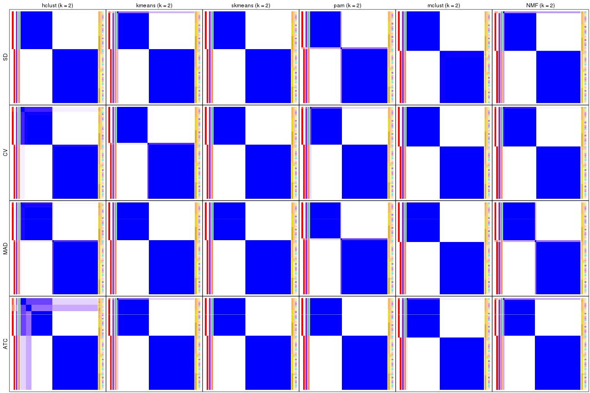</p>

</div>
<div id='tab-collect-consensus-heatmap-2'>
<pre><code class="r">collect_plots(res_list, k = 3, fun = consensus_heatmap, mc.cores = 4)
</code></pre>

<p>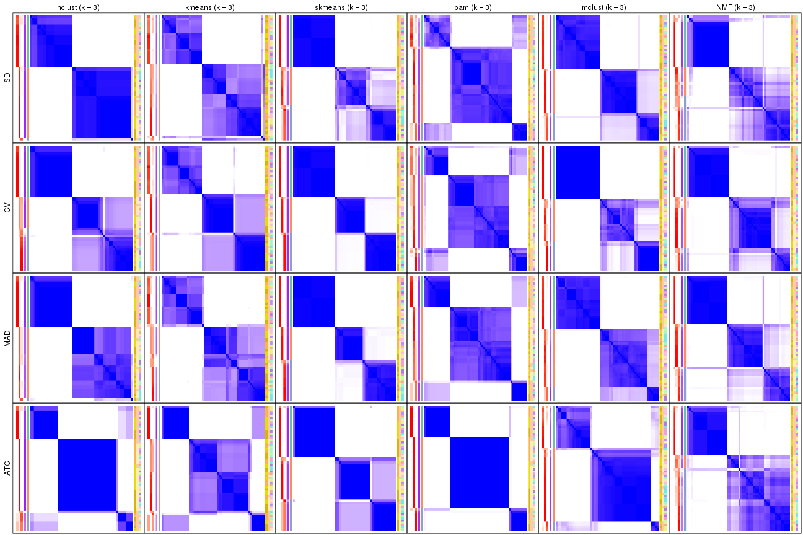</p>

</div>
<div id='tab-collect-consensus-heatmap-3'>
<pre><code class="r">collect_plots(res_list, k = 4, fun = consensus_heatmap, mc.cores = 4)
</code></pre>

<p>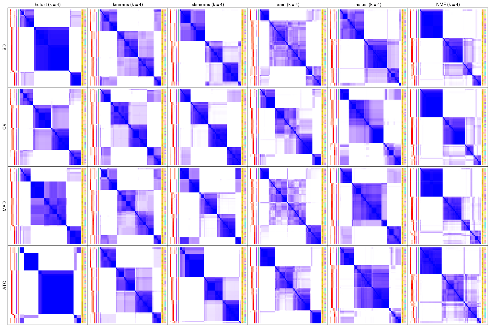</p>

</div>
<div id='tab-collect-consensus-heatmap-4'>
<pre><code class="r">collect_plots(res_list, k = 5, fun = consensus_heatmap, mc.cores = 4)
</code></pre>

<p>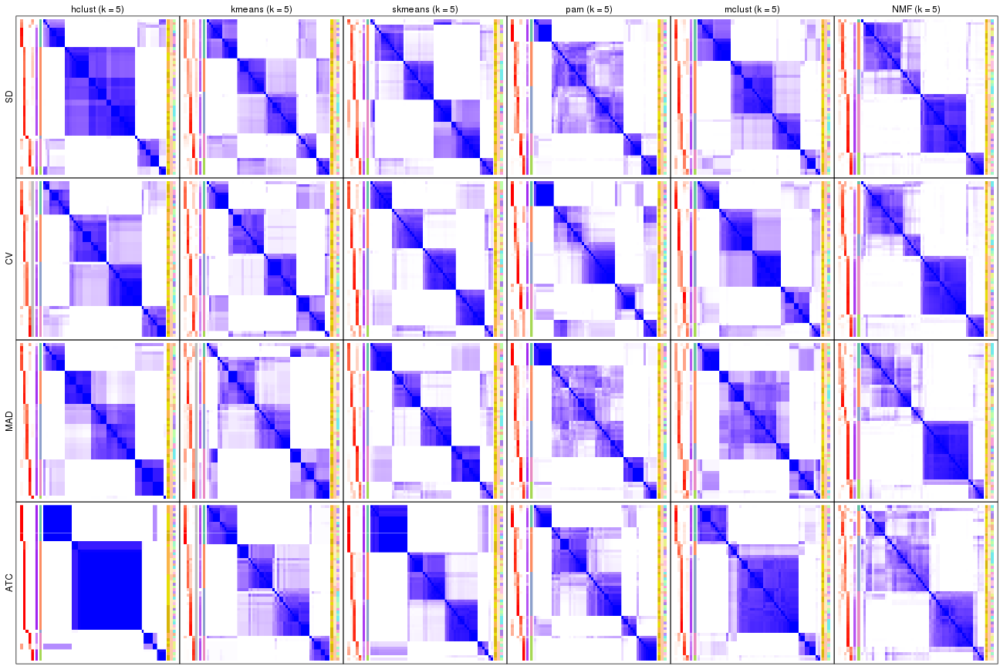</p>

</div>
<div id='tab-collect-consensus-heatmap-5'>
<pre><code class="r">collect_plots(res_list, k = 6, fun = consensus_heatmap, mc.cores = 4)
</code></pre>

<p>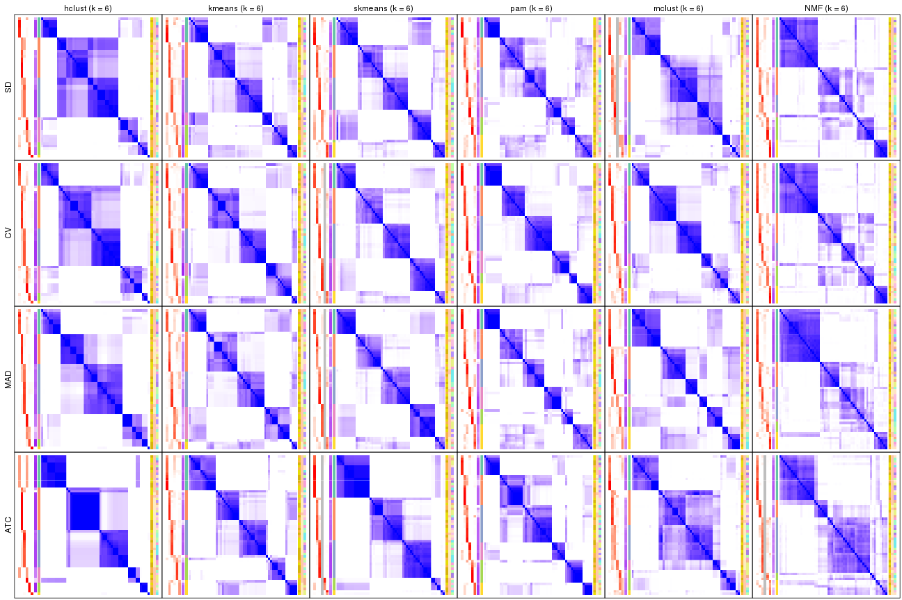</p>

</div>
</div>


### Membership heatmap

Membership heatmaps for all methods. ([What is a membership heatmap?](http://bioconductor.org/packages/devel/bioc/vignettes/cola/inst/doc/cola.html#toc_12))


<script>
$( function() {
	$( '#tabs-collect-membership-heatmap' ).tabs();
} );
</script>
<div id='tabs-collect-membership-heatmap'>
<ul>
<li><a href='#tab-collect-membership-heatmap-1'>k = 2</a></li>
<li><a href='#tab-collect-membership-heatmap-2'>k = 3</a></li>
<li><a href='#tab-collect-membership-heatmap-3'>k = 4</a></li>
<li><a href='#tab-collect-membership-heatmap-4'>k = 5</a></li>
<li><a href='#tab-collect-membership-heatmap-5'>k = 6</a></li>
</ul>
<div id='tab-collect-membership-heatmap-1'>
<pre><code class="r">collect_plots(res_list, k = 2, fun = membership_heatmap, mc.cores = 4)
</code></pre>

<p>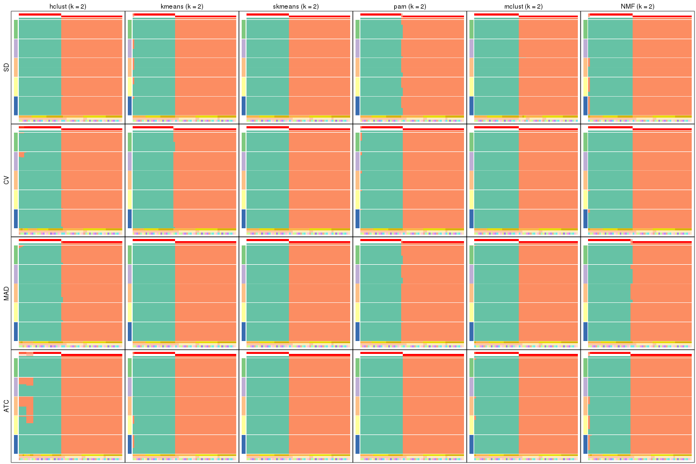</p>

</div>
<div id='tab-collect-membership-heatmap-2'>
<pre><code class="r">collect_plots(res_list, k = 3, fun = membership_heatmap, mc.cores = 4)
</code></pre>

<p>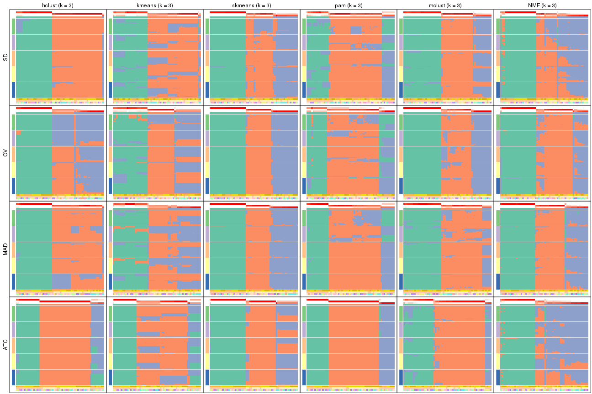</p>

</div>
<div id='tab-collect-membership-heatmap-3'>
<pre><code class="r">collect_plots(res_list, k = 4, fun = membership_heatmap, mc.cores = 4)
</code></pre>

<p>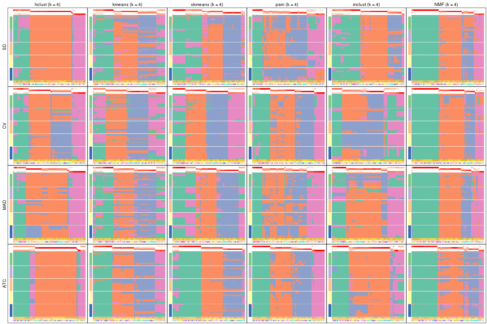</p>

</div>
<div id='tab-collect-membership-heatmap-4'>
<pre><code class="r">collect_plots(res_list, k = 5, fun = membership_heatmap, mc.cores = 4)
</code></pre>

<p>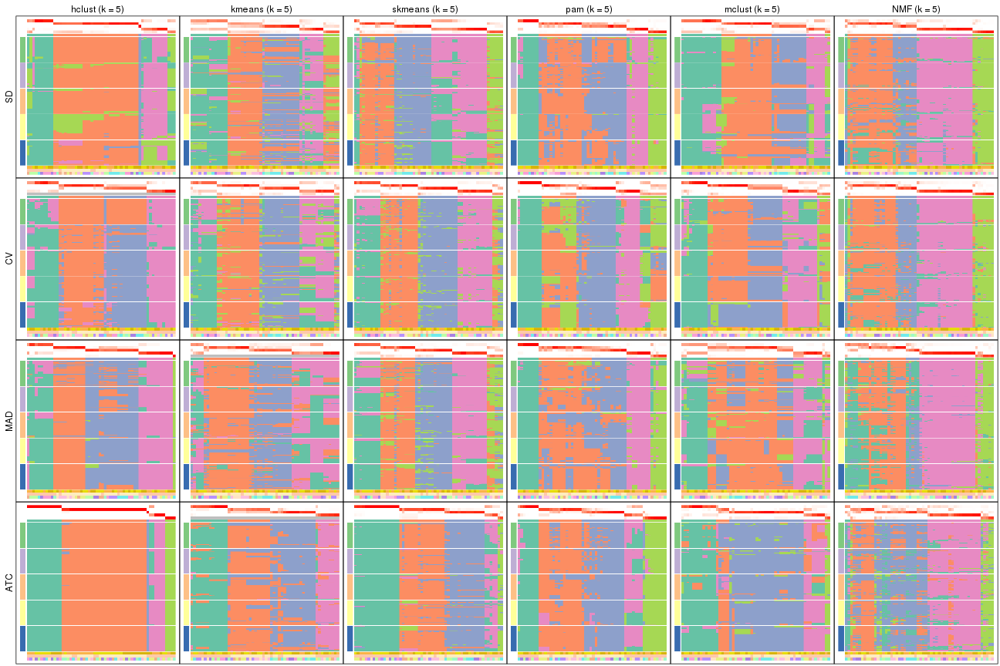</p>

</div>
<div id='tab-collect-membership-heatmap-5'>
<pre><code class="r">collect_plots(res_list, k = 6, fun = membership_heatmap, mc.cores = 4)
</code></pre>

<p>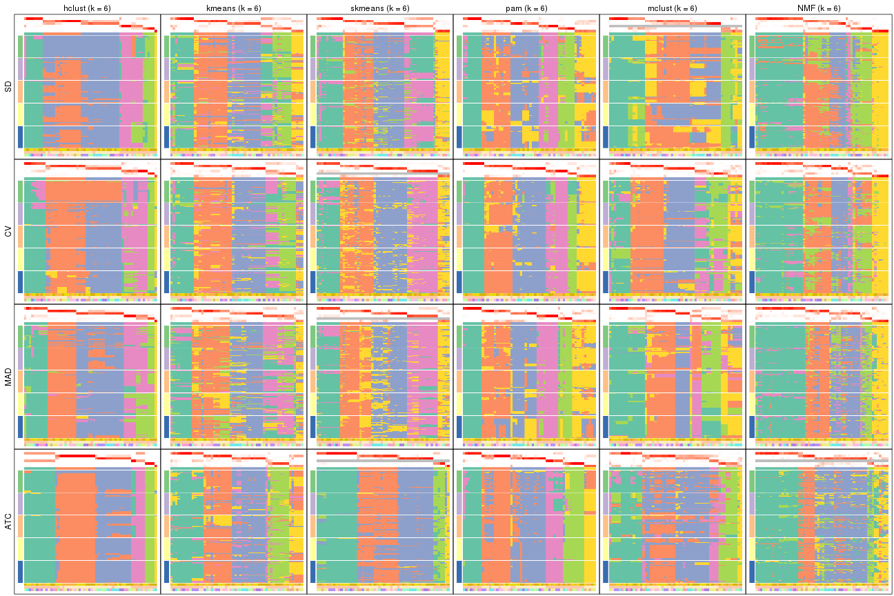</p>

</div>
</div>


### Signature heatmap

Signature heatmaps for all methods. ([What is a signature heatmap?](http://bioconductor.org/packages/devel/bioc/vignettes/cola/inst/doc/cola.html#toc_22))


Note in following heatmaps, rows are scaled.


<script>
$( function() {
	$( '#tabs-collect-get-signatures' ).tabs();
} );
</script>
<div id='tabs-collect-get-signatures'>
<ul>
<li><a href='#tab-collect-get-signatures-1'>k = 2</a></li>
<li><a href='#tab-collect-get-signatures-2'>k = 3</a></li>
<li><a href='#tab-collect-get-signatures-3'>k = 4</a></li>
<li><a href='#tab-collect-get-signatures-4'>k = 5</a></li>
<li><a href='#tab-collect-get-signatures-5'>k = 6</a></li>
</ul>
<div id='tab-collect-get-signatures-1'>
<pre><code class="r">collect_plots(res_list, k = 2, fun = get_signatures, mc.cores = 4)
</code></pre>

<p>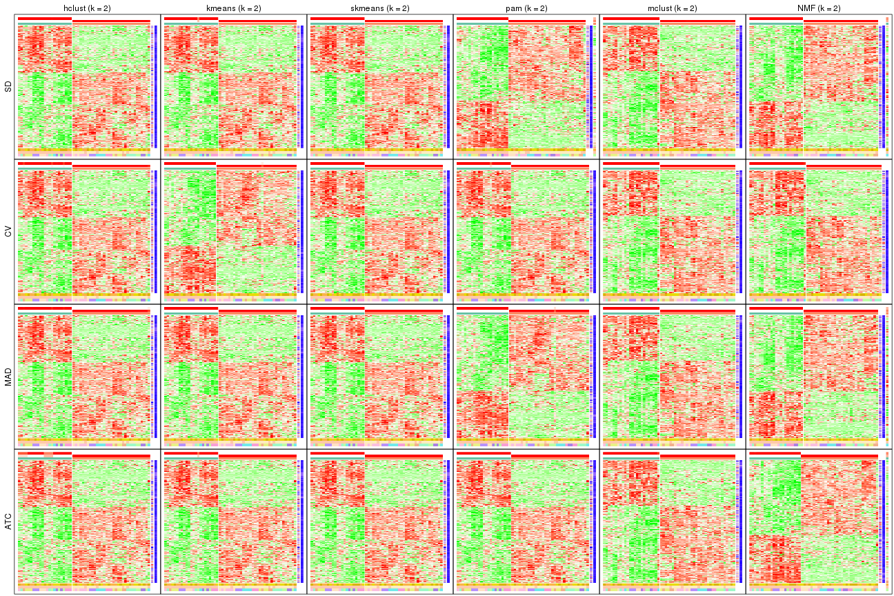</p>

</div>
<div id='tab-collect-get-signatures-2'>
<pre><code class="r">collect_plots(res_list, k = 3, fun = get_signatures, mc.cores = 4)
</code></pre>

<p>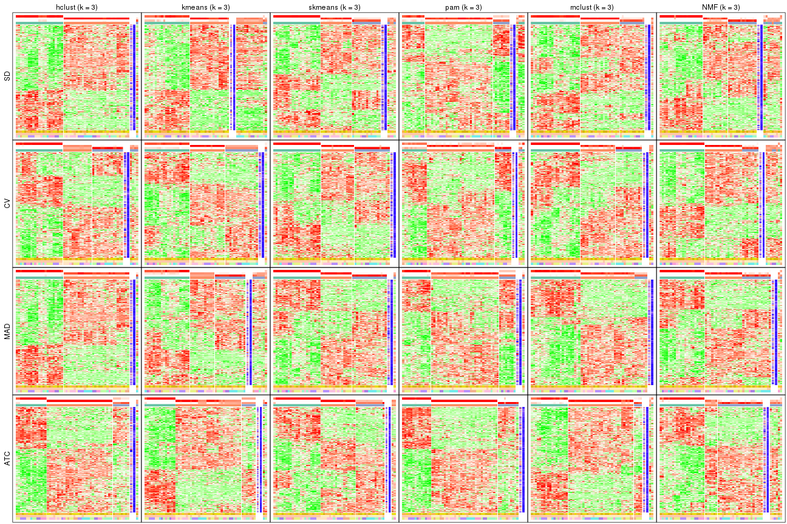</p>

</div>
<div id='tab-collect-get-signatures-3'>
<pre><code class="r">collect_plots(res_list, k = 4, fun = get_signatures, mc.cores = 4)
</code></pre>

<p>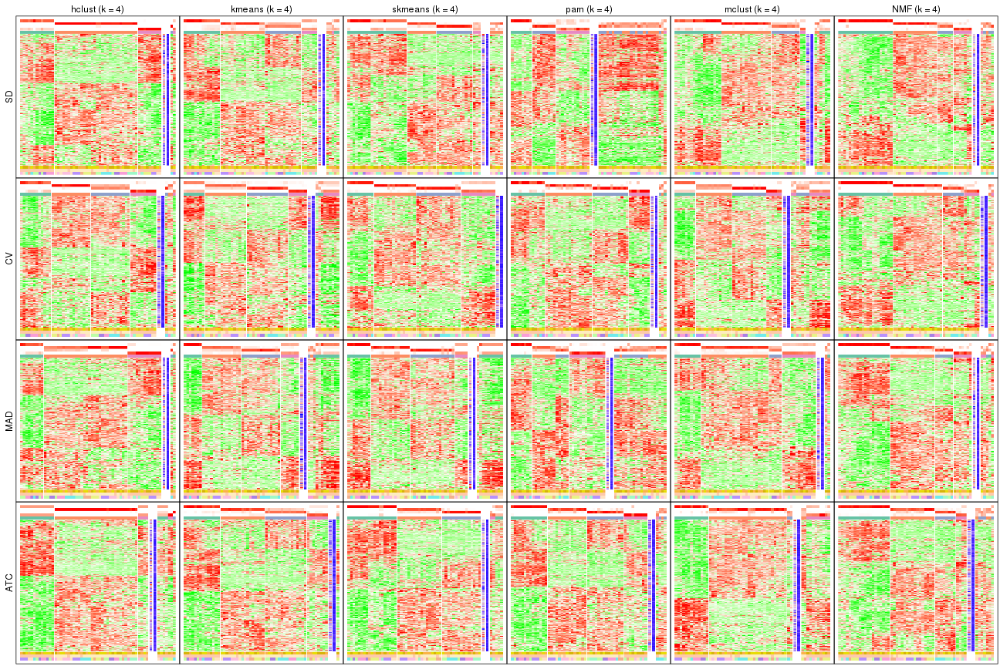</p>

</div>
<div id='tab-collect-get-signatures-4'>
<pre><code class="r">collect_plots(res_list, k = 5, fun = get_signatures, mc.cores = 4)
</code></pre>

<p>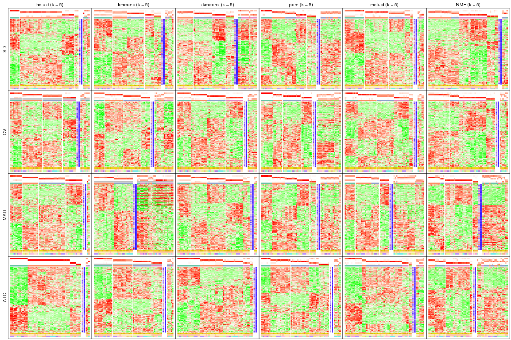</p>

</div>
<div id='tab-collect-get-signatures-5'>
<pre><code class="r">collect_plots(res_list, k = 6, fun = get_signatures, mc.cores = 4)
</code></pre>

<p>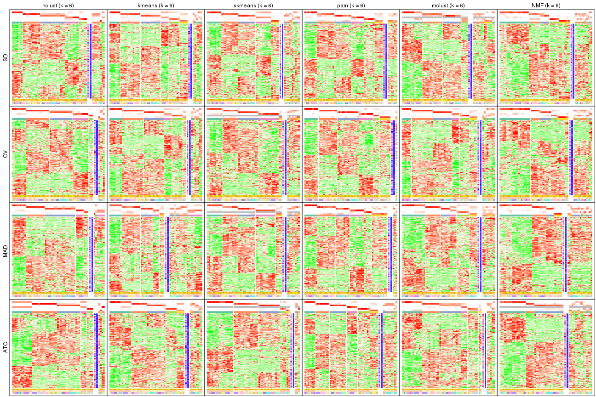</p>

</div>
</div>


### Statistics table

The statistics used for measuring the stability of consensus partitioning.
([How are they
defined?](http://bioconductor.org/packages/devel/bioc/vignettes/cola/inst/doc/cola.html#toc_13))


<script>
$( function() {
	$( '#tabs-get-stats-from-consensus-partition-list' ).tabs();
} );
</script>
<div id='tabs-get-stats-from-consensus-partition-list'>
<ul>
<li><a href='#tab-get-stats-from-consensus-partition-list-1'>k = 2</a></li>
<li><a href='#tab-get-stats-from-consensus-partition-list-2'>k = 3</a></li>
<li><a href='#tab-get-stats-from-consensus-partition-list-3'>k = 4</a></li>
<li><a href='#tab-get-stats-from-consensus-partition-list-4'>k = 5</a></li>
<li><a href='#tab-get-stats-from-consensus-partition-list-5'>k = 6</a></li>
</ul>
<div id='tab-get-stats-from-consensus-partition-list-1'>
<pre><code class="r">get_stats(res_list, k = 2)
</code></pre>

<pre><code>#&gt;             k 1-PAC mean_silhouette concordance area_increased  Rand Jaccard
#&gt; SD:NMF      2  1.00           0.978       0.992          0.497 0.501   0.501
#&gt; CV:NMF      2  1.00           0.998       0.999          0.499 0.501   0.501
#&gt; MAD:NMF     2  1.00           0.982       0.993          0.496 0.507   0.507
#&gt; ATC:NMF     2  1.00           0.981       0.993          0.491 0.507   0.507
#&gt; SD:skmeans  2  1.00           1.000       1.000          0.493 0.507   0.507
#&gt; CV:skmeans  2  1.00           1.000       1.000          0.493 0.507   0.507
#&gt; MAD:skmeans 2  1.00           1.000       1.000          0.493 0.507   0.507
#&gt; ATC:skmeans 2  1.00           1.000       1.000          0.493 0.507   0.507
#&gt; SD:mclust   2  1.00           0.999       1.000          0.499 0.501   0.501
#&gt; CV:mclust   2  1.00           1.000       1.000          0.499 0.501   0.501
#&gt; MAD:mclust  2  1.00           1.000       1.000          0.499 0.501   0.501
#&gt; ATC:mclust  2  1.00           0.997       0.998          0.499 0.501   0.501
#&gt; SD:kmeans   2  1.00           0.985       0.994          0.491 0.507   0.507
#&gt; CV:kmeans   2  1.00           0.996       0.998          0.487 0.514   0.514
#&gt; MAD:kmeans  2  1.00           1.000       1.000          0.493 0.507   0.507
#&gt; ATC:kmeans  2  1.00           0.991       0.996          0.492 0.507   0.507
#&gt; SD:pam      2  1.00           0.983       0.993          0.489 0.514   0.514
#&gt; CV:pam      2  1.00           0.993       0.997          0.492 0.507   0.507
#&gt; MAD:pam     2  1.00           0.994       0.997          0.487 0.514   0.514
#&gt; ATC:pam     2  1.00           1.000       1.000          0.493 0.507   0.507
#&gt; SD:hclust   2  1.00           1.000       1.000          0.493 0.507   0.507
#&gt; CV:hclust   2  1.00           0.992       0.996          0.492 0.507   0.507
#&gt; MAD:hclust  2  1.00           0.994       0.997          0.493 0.507   0.507
#&gt; ATC:hclust  2  0.74           0.927       0.961          0.469 0.507   0.507
</code></pre>

</div>
<div id='tab-get-stats-from-consensus-partition-list-2'>
<pre><code class="r">get_stats(res_list, k = 3)
</code></pre>

<pre><code>#&gt;             k 1-PAC mean_silhouette concordance area_increased  Rand Jaccard
#&gt; SD:NMF      3 0.682           0.707       0.864         0.2970 0.812   0.635
#&gt; CV:NMF      3 0.829           0.803       0.917         0.2810 0.845   0.694
#&gt; MAD:NMF     3 0.845           0.902       0.942         0.3245 0.804   0.620
#&gt; ATC:NMF     3 0.712           0.735       0.847         0.2359 0.863   0.739
#&gt; SD:skmeans  3 0.827           0.857       0.911         0.3340 0.823   0.652
#&gt; CV:skmeans  3 1.000           0.974       0.984         0.3545 0.823   0.652
#&gt; MAD:skmeans 3 1.000           0.966       0.980         0.3544 0.825   0.654
#&gt; ATC:skmeans 3 0.824           0.899       0.901         0.2599 0.827   0.659
#&gt; SD:mclust   3 0.848           0.938       0.934         0.2817 0.844   0.689
#&gt; CV:mclust   3 0.840           0.899       0.938         0.3087 0.840   0.680
#&gt; MAD:mclust  3 0.789           0.905       0.911         0.2171 0.899   0.798
#&gt; ATC:mclust  3 0.847           0.865       0.928         0.1522 0.915   0.837
#&gt; SD:kmeans   3 0.643           0.636       0.805         0.2561 0.964   0.930
#&gt; CV:kmeans   3 0.705           0.913       0.810         0.2922 0.812   0.635
#&gt; MAD:kmeans  3 0.646           0.655       0.740         0.2713 0.814   0.639
#&gt; ATC:kmeans  3 0.724           0.758       0.806         0.2558 0.896   0.797
#&gt; SD:pam      3 0.664           0.823       0.849         0.2013 0.927   0.859
#&gt; CV:pam      3 0.652           0.815       0.834         0.2230 0.916   0.834
#&gt; MAD:pam     3 0.692           0.896       0.869         0.2328 0.901   0.809
#&gt; ATC:pam     3 1.000           0.985       0.994         0.1933 0.892   0.789
#&gt; SD:hclust   3 0.934           0.945       0.973         0.0669 0.979   0.959
#&gt; CV:hclust   3 0.824           0.852       0.834         0.2404 0.827   0.659
#&gt; MAD:hclust  3 0.770           0.866       0.902         0.1439 0.979   0.959
#&gt; ATC:hclust  3 0.891           0.923       0.952         0.2042 0.896   0.797
</code></pre>

</div>
<div id='tab-get-stats-from-consensus-partition-list-3'>
<pre><code class="r">get_stats(res_list, k = 4)
</code></pre>

<pre><code>#&gt;             k 1-PAC mean_silhouette concordance area_increased  Rand Jaccard
#&gt; SD:NMF      4 0.769           0.845       0.904         0.0856 0.823   0.554
#&gt; CV:NMF      4 0.759           0.861       0.911         0.0882 0.874   0.675
#&gt; MAD:NMF     4 0.810           0.828       0.913         0.0859 0.809   0.518
#&gt; ATC:NMF     4 0.693           0.732       0.847         0.1418 0.784   0.528
#&gt; SD:skmeans  4 0.688           0.752       0.815         0.0945 0.970   0.910
#&gt; CV:skmeans  4 0.843           0.916       0.905         0.1067 0.916   0.745
#&gt; MAD:skmeans 4 0.774           0.574       0.795         0.0958 0.921   0.768
#&gt; ATC:skmeans 4 0.714           0.848       0.894         0.1080 0.938   0.823
#&gt; SD:mclust   4 0.612           0.759       0.837         0.0602 0.951   0.864
#&gt; CV:mclust   4 0.667           0.599       0.684         0.0445 0.829   0.554
#&gt; MAD:mclust  4 0.646           0.825       0.778         0.0905 0.887   0.729
#&gt; ATC:mclust  4 0.647           0.734       0.828         0.1323 0.912   0.813
#&gt; SD:kmeans   4 0.588           0.674       0.740         0.1291 0.764   0.514
#&gt; CV:kmeans   4 0.632           0.749       0.741         0.1289 0.887   0.670
#&gt; MAD:kmeans  4 0.557           0.641       0.738         0.1334 0.839   0.574
#&gt; ATC:kmeans  4 0.653           0.860       0.834         0.1425 0.819   0.574
#&gt; SD:pam      4 0.549           0.429       0.688         0.2160 0.829   0.612
#&gt; CV:pam      4 0.674           0.776       0.892         0.2380 0.784   0.518
#&gt; MAD:pam     4 0.618           0.608       0.787         0.2371 0.808   0.559
#&gt; ATC:pam     4 0.769           0.816       0.908         0.2636 0.834   0.595
#&gt; SD:hclust   4 0.870           0.895       0.937         0.1354 0.916   0.826
#&gt; CV:hclust   4 0.682           0.796       0.811         0.1356 0.856   0.601
#&gt; MAD:hclust  4 0.674           0.793       0.849         0.1405 0.916   0.826
#&gt; ATC:hclust  4 0.960           0.735       0.908         0.0619 0.929   0.842
</code></pre>

</div>
<div id='tab-get-stats-from-consensus-partition-list-4'>
<pre><code class="r">get_stats(res_list, k = 5)
</code></pre>

<pre><code>#&gt;             k 1-PAC mean_silhouette concordance area_increased  Rand Jaccard
#&gt; SD:NMF      5 0.728           0.750       0.843         0.0685 0.979   0.924
#&gt; CV:NMF      5 0.753           0.729       0.860         0.0782 0.962   0.875
#&gt; MAD:NMF     5 0.748           0.622       0.794         0.0462 0.932   0.765
#&gt; ATC:NMF     5 0.560           0.523       0.754         0.0692 0.850   0.584
#&gt; SD:skmeans  5 0.679           0.570       0.788         0.0636 0.942   0.811
#&gt; CV:skmeans  5 0.761           0.769       0.856         0.0543 0.960   0.838
#&gt; MAD:skmeans 5 0.725           0.787       0.837         0.0653 0.864   0.551
#&gt; ATC:skmeans 5 0.786           0.855       0.900         0.0610 0.945   0.820
#&gt; SD:mclust   5 0.612           0.723       0.800         0.0940 0.880   0.650
#&gt; CV:mclust   5 0.658           0.767       0.772         0.0955 0.906   0.662
#&gt; MAD:mclust  5 0.612           0.473       0.710         0.1029 0.958   0.870
#&gt; ATC:mclust  5 0.702           0.769       0.849         0.0571 0.919   0.798
#&gt; SD:kmeans   5 0.570           0.683       0.726         0.0738 0.905   0.661
#&gt; CV:kmeans   5 0.693           0.654       0.757         0.0785 0.981   0.921
#&gt; MAD:kmeans  5 0.592           0.485       0.667         0.0714 0.894   0.665
#&gt; ATC:kmeans  5 0.674           0.760       0.803         0.0735 0.965   0.869
#&gt; SD:pam      5 0.663           0.643       0.814         0.0867 0.818   0.454
#&gt; CV:pam      5 0.676           0.572       0.764         0.0552 0.897   0.628
#&gt; MAD:pam     5 0.689           0.637       0.801         0.0479 0.899   0.651
#&gt; ATC:pam     5 0.724           0.741       0.858         0.0498 0.959   0.835
#&gt; SD:hclust   5 0.698           0.746       0.834         0.1084 0.981   0.952
#&gt; CV:hclust   5 0.642           0.743       0.809         0.0588 1.000   1.000
#&gt; MAD:hclust  5 0.682           0.828       0.886         0.1524 0.844   0.612
#&gt; ATC:hclust  5 1.000           0.922       0.979         0.0178 0.966   0.920
</code></pre>

</div>
<div id='tab-get-stats-from-consensus-partition-list-5'>
<pre><code class="r">get_stats(res_list, k = 6)
</code></pre>

<pre><code>#&gt;             k 1-PAC mean_silhouette concordance area_increased  Rand Jaccard
#&gt; SD:NMF      6 0.679           0.617       0.775         0.0555 0.908   0.676
#&gt; CV:NMF      6 0.684           0.636       0.778         0.0580 0.922   0.723
#&gt; MAD:NMF     6 0.673           0.616       0.797         0.0488 0.948   0.802
#&gt; ATC:NMF     6 0.565           0.595       0.754         0.0235 0.901   0.697
#&gt; SD:skmeans  6 0.689           0.619       0.761         0.0405 0.910   0.663
#&gt; CV:skmeans  6 0.722           0.740       0.813         0.0379 0.988   0.945
#&gt; MAD:skmeans 6 0.719           0.681       0.782         0.0389 0.972   0.871
#&gt; ATC:skmeans 6 0.771           0.785       0.843         0.0421 1.000   1.000
#&gt; SD:mclust   6 0.633           0.564       0.656         0.0453 0.988   0.953
#&gt; CV:mclust   6 0.708           0.716       0.743         0.0783 0.932   0.697
#&gt; MAD:mclust  6 0.676           0.694       0.741         0.0859 0.785   0.367
#&gt; ATC:mclust  6 0.611           0.629       0.723         0.1182 0.862   0.581
#&gt; SD:kmeans   6 0.609           0.695       0.722         0.0618 0.931   0.695
#&gt; CV:kmeans   6 0.690           0.691       0.761         0.0445 0.964   0.840
#&gt; MAD:kmeans  6 0.687           0.547       0.679         0.0567 0.912   0.694
#&gt; ATC:kmeans  6 0.718           0.696       0.786         0.0593 0.925   0.709
#&gt; SD:pam      6 0.663           0.667       0.790         0.0623 0.917   0.637
#&gt; CV:pam      6 0.788           0.831       0.886         0.0438 0.920   0.641
#&gt; MAD:pam     6 0.742           0.698       0.821         0.0717 0.913   0.631
#&gt; ATC:pam     6 0.774           0.716       0.855         0.0501 0.956   0.796
#&gt; SD:hclust   6 0.682           0.649       0.791         0.1084 0.819   0.533
#&gt; CV:hclust   6 0.651           0.779       0.825         0.0295 0.973   0.889
#&gt; MAD:hclust  6 0.681           0.751       0.839         0.0433 0.981   0.921
#&gt; ATC:hclust  6 0.790           0.845       0.922         0.2395 0.834   0.571
</code></pre>

</div>
</div>

Following heatmap plots the partition for each combination of methods and the
lightness correspond to the silhouette scores for samples in each method. On
top the consensus subgroup is inferred from all methods by taking the mean
silhouette scores as weight.


<script>
$( function() {
	$( '#tabs-collect-stats-from-consensus-partition-list' ).tabs();
} );
</script>
<div id='tabs-collect-stats-from-consensus-partition-list'>
<ul>
<li><a href='#tab-collect-stats-from-consensus-partition-list-1'>k = 2</a></li>
<li><a href='#tab-collect-stats-from-consensus-partition-list-2'>k = 3</a></li>
<li><a href='#tab-collect-stats-from-consensus-partition-list-3'>k = 4</a></li>
<li><a href='#tab-collect-stats-from-consensus-partition-list-4'>k = 5</a></li>
<li><a href='#tab-collect-stats-from-consensus-partition-list-5'>k = 6</a></li>
</ul>
<div id='tab-collect-stats-from-consensus-partition-list-1'>
<pre><code class="r">collect_stats(res_list, k = 2)
</code></pre>

<p>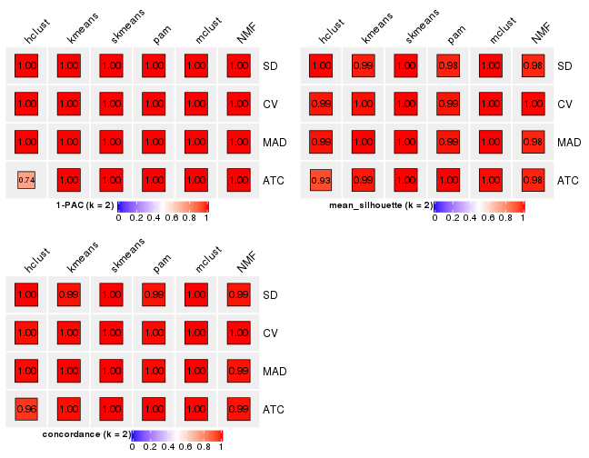</p>

</div>
<div id='tab-collect-stats-from-consensus-partition-list-2'>
<pre><code class="r">collect_stats(res_list, k = 3)
</code></pre>

<p>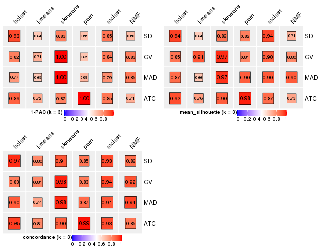</p>

</div>
<div id='tab-collect-stats-from-consensus-partition-list-3'>
<pre><code class="r">collect_stats(res_list, k = 4)
</code></pre>

<p>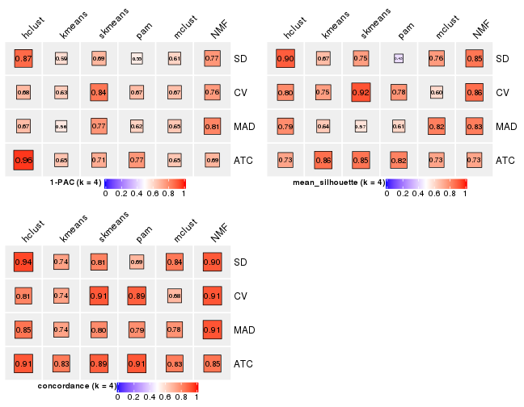</p>

</div>
<div id='tab-collect-stats-from-consensus-partition-list-4'>
<pre><code class="r">collect_stats(res_list, k = 5)
</code></pre>

<p>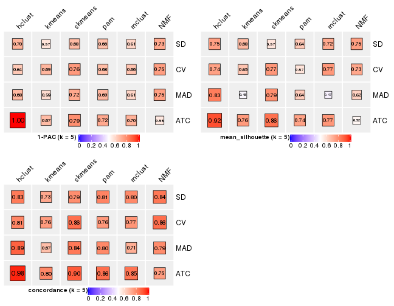</p>

</div>
<div id='tab-collect-stats-from-consensus-partition-list-5'>
<pre><code class="r">collect_stats(res_list, k = 6)
</code></pre>

<p>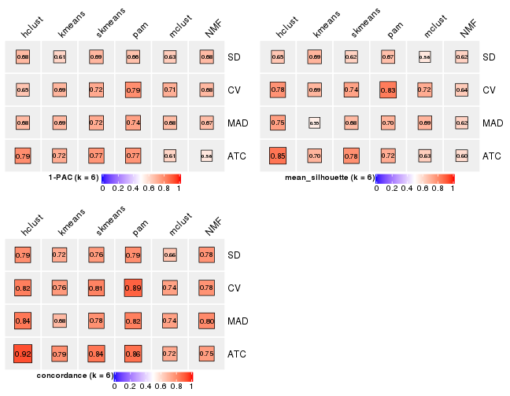</p>

</div>
</div>

### Partition from all methods


Collect partitions from all methods:


<script>
$( function() {
	$( '#tabs-collect-classes-from-consensus-partition-list' ).tabs();
} );
</script>
<div id='tabs-collect-classes-from-consensus-partition-list'>
<ul>
<li><a href='#tab-collect-classes-from-consensus-partition-list-1'>k = 2</a></li>
<li><a href='#tab-collect-classes-from-consensus-partition-list-2'>k = 3</a></li>
<li><a href='#tab-collect-classes-from-consensus-partition-list-3'>k = 4</a></li>
<li><a href='#tab-collect-classes-from-consensus-partition-list-4'>k = 5</a></li>
<li><a href='#tab-collect-classes-from-consensus-partition-list-5'>k = 6</a></li>
</ul>
<div id='tab-collect-classes-from-consensus-partition-list-1'>
<pre><code class="r">collect_classes(res_list, k = 2)
</code></pre>

<p>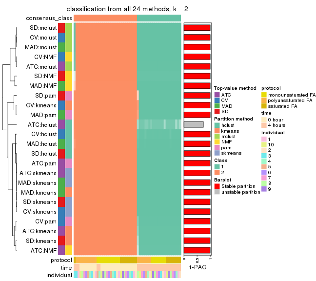</p>

</div>
<div id='tab-collect-classes-from-consensus-partition-list-2'>
<pre><code class="r">collect_classes(res_list, k = 3)
</code></pre>

<p>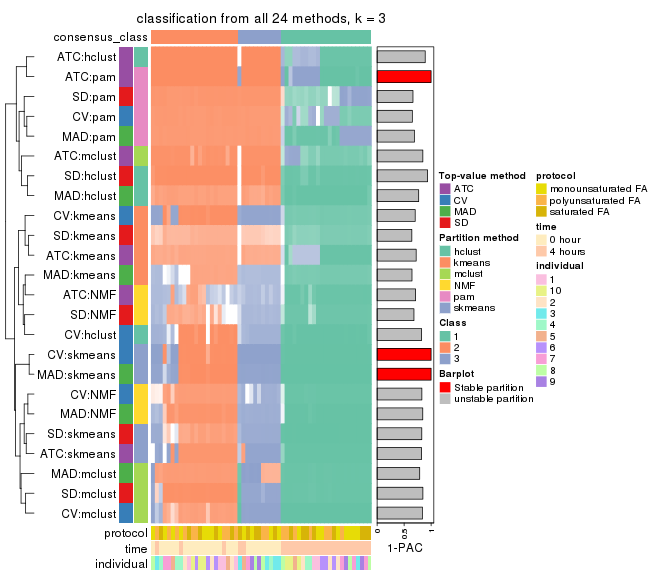</p>

</div>
<div id='tab-collect-classes-from-consensus-partition-list-3'>
<pre><code class="r">collect_classes(res_list, k = 4)
</code></pre>

<p>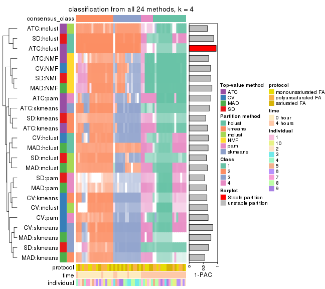</p>

</div>
<div id='tab-collect-classes-from-consensus-partition-list-4'>
<pre><code class="r">collect_classes(res_list, k = 5)
</code></pre>

<p>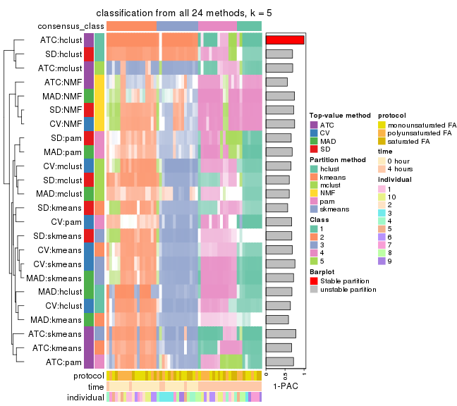</p>

</div>
<div id='tab-collect-classes-from-consensus-partition-list-5'>
<pre><code class="r">collect_classes(res_list, k = 6)
</code></pre>

<p>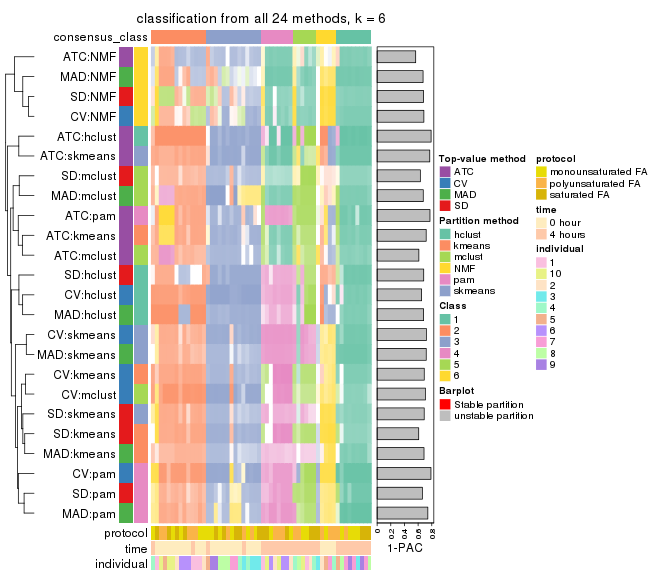</p>

</div>
</div>


### Top rows overlap


Overlap of top rows from different top-row methods:


<script>
$( function() {
	$( '#tabs-top-rows-overlap-by-euler' ).tabs();
} );
</script>
<div id='tabs-top-rows-overlap-by-euler'>
<ul>
<li><a href='#tab-top-rows-overlap-by-euler-1'>top_n = 1000</a></li>
<li><a href='#tab-top-rows-overlap-by-euler-2'>top_n = 2000</a></li>
<li><a href='#tab-top-rows-overlap-by-euler-3'>top_n = 3000</a></li>
<li><a href='#tab-top-rows-overlap-by-euler-4'>top_n = 4000</a></li>
<li><a href='#tab-top-rows-overlap-by-euler-5'>top_n = 5000</a></li>
</ul>
<div id='tab-top-rows-overlap-by-euler-1'>
<pre><code class="r">top_rows_overlap(res_list, top_n = 1000, method = &quot;euler&quot;)
</code></pre>

<p>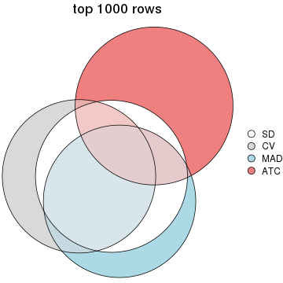</p>

</div>
<div id='tab-top-rows-overlap-by-euler-2'>
<pre><code class="r">top_rows_overlap(res_list, top_n = 2000, method = &quot;euler&quot;)
</code></pre>

<p>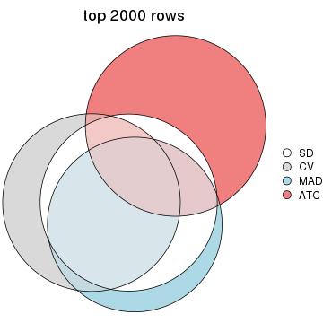</p>

</div>
<div id='tab-top-rows-overlap-by-euler-3'>
<pre><code class="r">top_rows_overlap(res_list, top_n = 3000, method = &quot;euler&quot;)
</code></pre>

<p>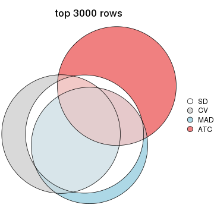</p>

</div>
<div id='tab-top-rows-overlap-by-euler-4'>
<pre><code class="r">top_rows_overlap(res_list, top_n = 4000, method = &quot;euler&quot;)
</code></pre>

<p>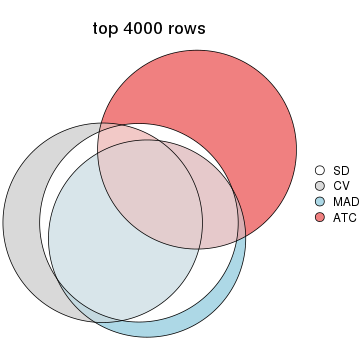</p>

</div>
<div id='tab-top-rows-overlap-by-euler-5'>
<pre><code class="r">top_rows_overlap(res_list, top_n = 5000, method = &quot;euler&quot;)
</code></pre>

<p>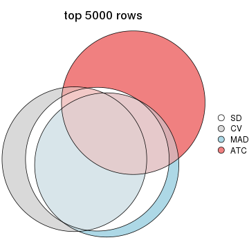</p>

</div>
</div>

Also visualize the correspondance of rankings between different top-row methods:


<script>
$( function() {
	$( '#tabs-top-rows-overlap-by-correspondance' ).tabs();
} );
</script>
<div id='tabs-top-rows-overlap-by-correspondance'>
<ul>
<li><a href='#tab-top-rows-overlap-by-correspondance-1'>top_n = 1000</a></li>
<li><a href='#tab-top-rows-overlap-by-correspondance-2'>top_n = 2000</a></li>
<li><a href='#tab-top-rows-overlap-by-correspondance-3'>top_n = 3000</a></li>
<li><a href='#tab-top-rows-overlap-by-correspondance-4'>top_n = 4000</a></li>
<li><a href='#tab-top-rows-overlap-by-correspondance-5'>top_n = 5000</a></li>
</ul>
<div id='tab-top-rows-overlap-by-correspondance-1'>
<pre><code class="r">top_rows_overlap(res_list, top_n = 1000, method = &quot;correspondance&quot;)
</code></pre>

<p>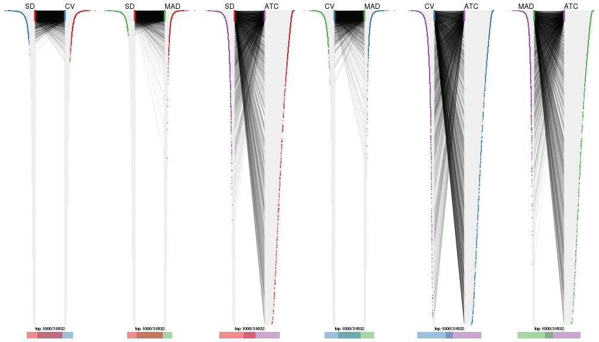</p>

</div>
<div id='tab-top-rows-overlap-by-correspondance-2'>
<pre><code class="r">top_rows_overlap(res_list, top_n = 2000, method = &quot;correspondance&quot;)
</code></pre>

<p>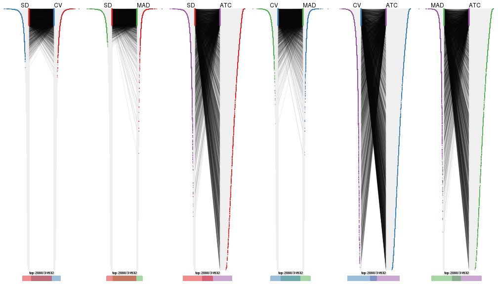</p>

</div>
<div id='tab-top-rows-overlap-by-correspondance-3'>
<pre><code class="r">top_rows_overlap(res_list, top_n = 3000, method = &quot;correspondance&quot;)
</code></pre>

<p>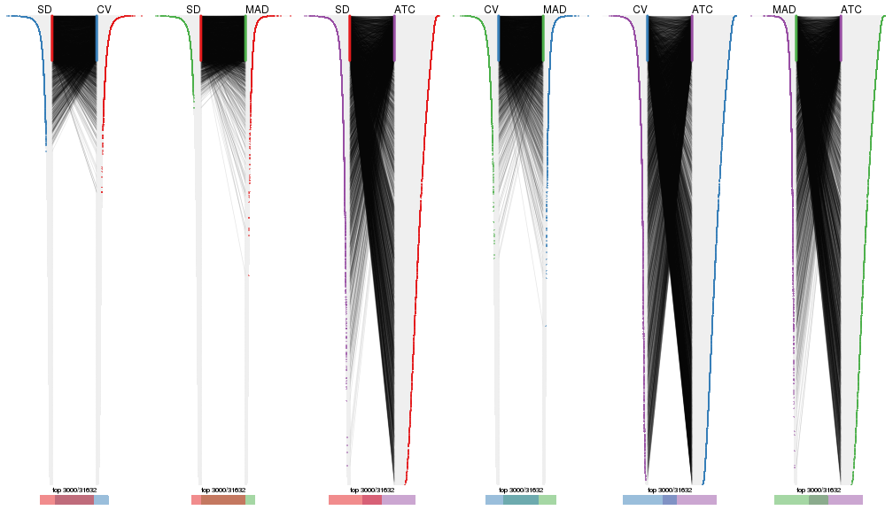</p>

</div>
<div id='tab-top-rows-overlap-by-correspondance-4'>
<pre><code class="r">top_rows_overlap(res_list, top_n = 4000, method = &quot;correspondance&quot;)
</code></pre>

<p>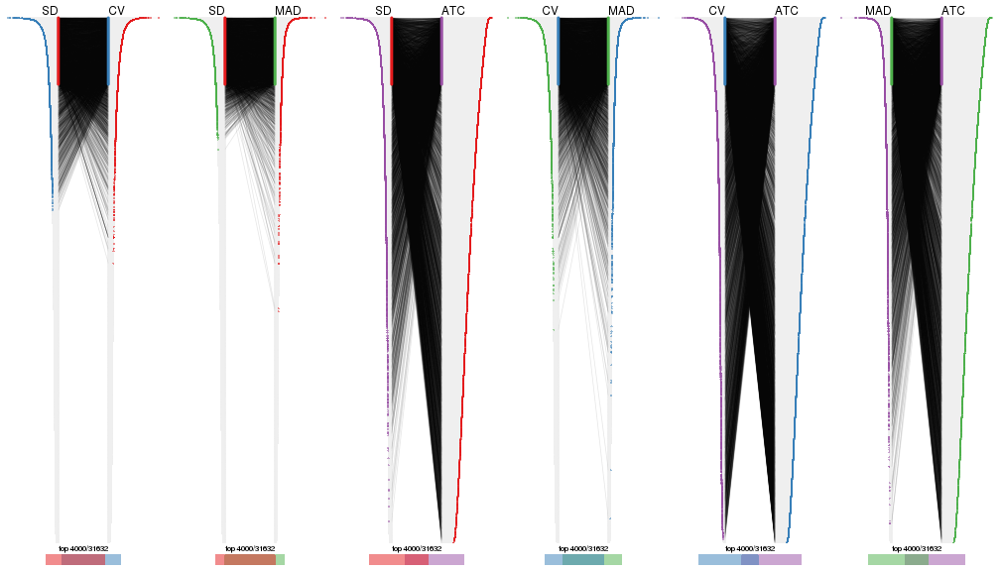</p>

</div>
<div id='tab-top-rows-overlap-by-correspondance-5'>
<pre><code class="r">top_rows_overlap(res_list, top_n = 5000, method = &quot;correspondance&quot;)
</code></pre>

<p>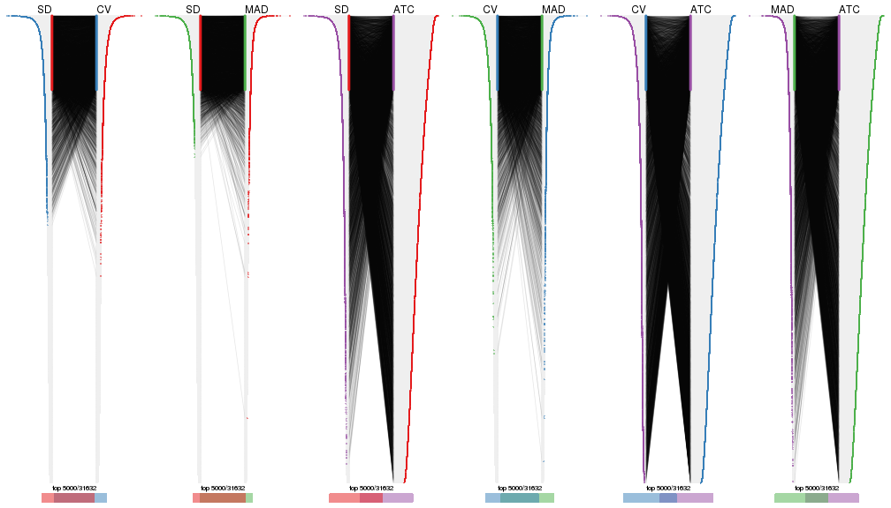</p>

</div>
</div>


Heatmaps of the top rows:


<script>
$( function() {
	$( '#tabs-top-rows-heatmap' ).tabs();
} );
</script>
<div id='tabs-top-rows-heatmap'>
<ul>
<li><a href='#tab-top-rows-heatmap-1'>top_n = 1000</a></li>
<li><a href='#tab-top-rows-heatmap-2'>top_n = 2000</a></li>
<li><a href='#tab-top-rows-heatmap-3'>top_n = 3000</a></li>
<li><a href='#tab-top-rows-heatmap-4'>top_n = 4000</a></li>
<li><a href='#tab-top-rows-heatmap-5'>top_n = 5000</a></li>
</ul>
<div id='tab-top-rows-heatmap-1'>
<pre><code class="r">top_rows_heatmap(res_list, top_n = 1000)
</code></pre>

<p>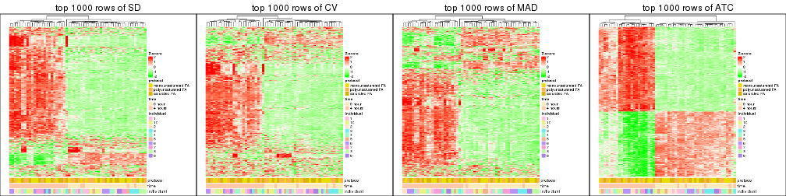</p>

</div>
<div id='tab-top-rows-heatmap-2'>
<pre><code class="r">top_rows_heatmap(res_list, top_n = 2000)
</code></pre>

<p>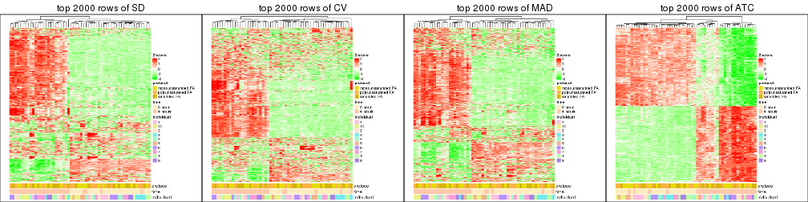</p>

</div>
<div id='tab-top-rows-heatmap-3'>
<pre><code class="r">top_rows_heatmap(res_list, top_n = 3000)
</code></pre>

<p>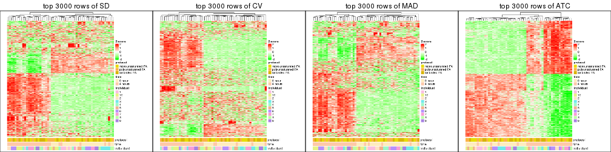</p>

</div>
<div id='tab-top-rows-heatmap-4'>
<pre><code class="r">top_rows_heatmap(res_list, top_n = 4000)
</code></pre>

<p>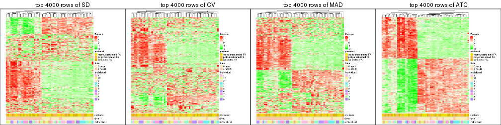</p>

</div>
<div id='tab-top-rows-heatmap-5'>
<pre><code class="r">top_rows_heatmap(res_list, top_n = 5000)
</code></pre>

<p>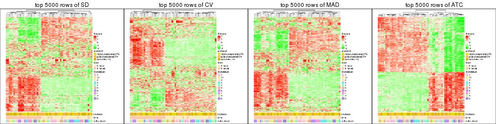</p>

</div>
</div>


### Test to known annotations


Test correlation between subgroups and known annotations. If the known
annotation is numeric, one-way ANOVA test is applied, and if the known
annotation is discrete, chi-squared contingency table test is applied.


<script>
$( function() {
	$( '#tabs-test-to-known-factors-from-consensus-partition-list' ).tabs();
} );
</script>
<div id='tabs-test-to-known-factors-from-consensus-partition-list'>
<ul>
<li><a href='#tab-test-to-known-factors-from-consensus-partition-list-1'>k = 2</a></li>
<li><a href='#tab-test-to-known-factors-from-consensus-partition-list-2'>k = 3</a></li>
<li><a href='#tab-test-to-known-factors-from-consensus-partition-list-3'>k = 4</a></li>
<li><a href='#tab-test-to-known-factors-from-consensus-partition-list-4'>k = 5</a></li>
<li><a href='#tab-test-to-known-factors-from-consensus-partition-list-5'>k = 6</a></li>
</ul>
<div id='tab-test-to-known-factors-from-consensus-partition-list-1'>
<pre><code class="r">test_to_known_factors(res_list, k = 2)
</code></pre>

<pre><code>#&gt;              n protocol(p)  time(p) individual(p) k
#&gt; SD:NMF      55       0.868 8.82e-10         0.974 2
#&gt; CV:NMF      56       0.757 5.27e-10         0.993 2
#&gt; MAD:NMF     55       0.868 8.82e-10         0.974 2
#&gt; ATC:NMF     55       0.859 3.84e-09         0.959 2
#&gt; SD:skmeans  56       0.937 2.29e-09         0.950 2
#&gt; CV:skmeans  56       0.937 2.29e-09         0.950 2
#&gt; MAD:skmeans 56       0.937 2.29e-09         0.950 2
#&gt; ATC:skmeans 56       0.937 2.29e-09         0.950 2
#&gt; SD:mclust   56       0.757 5.27e-10         0.993 2
#&gt; CV:mclust   56       0.757 5.27e-10         0.993 2
#&gt; MAD:mclust  56       0.757 5.27e-10         0.993 2
#&gt; ATC:mclust  56       0.757 5.27e-10         0.993 2
#&gt; SD:kmeans   56       0.937 2.29e-09         0.950 2
#&gt; CV:kmeans   56       0.790 9.14e-09         0.954 2
#&gt; MAD:kmeans  56       0.937 2.29e-09         0.950 2
#&gt; ATC:kmeans  56       0.937 2.29e-09         0.950 2
#&gt; SD:pam      55       0.859 3.84e-09         0.959 2
#&gt; CV:pam      56       0.937 2.29e-09         0.950 2
#&gt; MAD:pam     56       0.790 9.14e-09         0.954 2
#&gt; ATC:pam     56       0.937 2.29e-09         0.950 2
#&gt; SD:hclust   56       0.937 2.29e-09         0.950 2
#&gt; CV:hclust   56       0.937 2.29e-09         0.950 2
#&gt; MAD:hclust  56       0.937 2.29e-09         0.950 2
#&gt; ATC:hclust  56       0.937 2.29e-09         0.950 2
</code></pre>

</div>
<div id='tab-test-to-known-factors-from-consensus-partition-list-2'>
<pre><code class="r">test_to_known_factors(res_list, k = 3)
</code></pre>

<pre><code>#&gt;              n protocol(p)  time(p) individual(p) k
#&gt; SD:NMF      47       0.662 1.20e-08        0.2379 3
#&gt; CV:NMF      48       0.760 2.78e-08        0.0446 3
#&gt; MAD:NMF     54       0.615 7.34e-09        0.0554 3
#&gt; ATC:NMF     50       0.975 9.77e-09        0.3216 3
#&gt; SD:skmeans  52       0.849 1.92e-08        0.0379 3
#&gt; CV:skmeans  56       0.965 3.20e-09        0.0552 3
#&gt; MAD:skmeans 55       0.965 5.12e-09        0.0348 3
#&gt; ATC:skmeans 54       0.752 8.20e-09        0.0133 3
#&gt; SD:mclust   55       0.560 2.56e-10        0.2269 3
#&gt; CV:mclust   54       0.664 1.91e-09        0.1833 3
#&gt; MAD:mclust  56       0.320 7.39e-10        0.3676 3
#&gt; ATC:mclust  54       0.797 2.08e-09        0.0959 3
#&gt; SD:kmeans   41       0.479 4.23e-08        0.7386 3
#&gt; CV:kmeans   55       0.826 5.11e-09        0.0524 3
#&gt; MAD:kmeans  49       0.889 1.78e-08        0.0359 3
#&gt; ATC:kmeans  54       0.938 2.08e-09        0.5485 3
#&gt; SD:pam      52       0.761 2.60e-08        0.1515 3
#&gt; CV:pam      53       0.489 1.54e-08        0.5557 3
#&gt; MAD:pam     55       0.765 5.53e-09        0.0793 3
#&gt; ATC:pam     56       0.690 7.58e-10        0.6702 3
#&gt; SD:hclust   55       0.868 8.82e-10        0.9739 3
#&gt; CV:hclust   52       0.732 5.10e-09        0.0723 3
#&gt; MAD:hclust  55       0.868 8.82e-10        0.9739 3
#&gt; ATC:hclust  55       0.936 1.25e-09        0.6482 3
</code></pre>

</div>
<div id='tab-test-to-known-factors-from-consensus-partition-list-3'>
<pre><code class="r">test_to_known_factors(res_list, k = 4)
</code></pre>

<pre><code>#&gt;              n protocol(p)  time(p) individual(p) k
#&gt; SD:NMF      51       0.772 2.59e-08       0.02738 4
#&gt; CV:NMF      54       0.933 9.51e-08       0.07500 4
#&gt; MAD:NMF     51       0.972 1.35e-07       0.03905 4
#&gt; ATC:NMF     49       0.671 5.56e-07       0.01144 4
#&gt; SD:skmeans  51       0.777 2.98e-08       0.07658 4
#&gt; CV:skmeans  56       0.991 1.64e-08       0.00181 4
#&gt; MAD:skmeans 46       0.856 2.64e-06       0.00293 4
#&gt; ATC:skmeans 51       0.976 8.14e-09       0.01531 4
#&gt; SD:mclust   50       0.523 1.62e-08       0.25310 4
#&gt; CV:mclust   41       0.830 5.43e-06       0.01955 4
#&gt; MAD:mclust  54       0.654 9.74e-09       0.01931 4
#&gt; ATC:mclust  45       0.802 2.06e-07       0.66540 4
#&gt; SD:kmeans   51       0.800 1.55e-07       0.02583 4
#&gt; CV:kmeans   47       0.855 1.47e-06       0.00528 4
#&gt; MAD:kmeans  44       0.653 5.47e-06       0.00210 4
#&gt; ATC:kmeans  55       0.959 2.68e-08       0.00954 4
#&gt; SD:pam      30       0.725 2.97e-06       0.01281 4
#&gt; CV:pam      53       0.526 1.59e-07       0.03118 4
#&gt; MAD:pam     36       0.824 4.04e-07       0.00173 4
#&gt; ATC:pam     52       0.831 5.51e-09       0.06710 4
#&gt; SD:hclust   54       0.809 2.08e-09       0.36709 4
#&gt; CV:hclust   52       0.870 2.65e-08       0.01606 4
#&gt; MAD:hclust  54       0.920 2.08e-09       0.04556 4
#&gt; ATC:hclust  49       0.879 2.91e-08       0.51524 4
</code></pre>

</div>
<div id='tab-test-to-known-factors-from-consensus-partition-list-4'>
<pre><code class="r">test_to_known_factors(res_list, k = 5)
</code></pre>

<pre><code>#&gt;              n protocol(p)  time(p) individual(p) k
#&gt; SD:NMF      52       0.844 3.78e-08       0.01235 5
#&gt; CV:NMF      50       0.761 4.41e-08       0.16198 5
#&gt; MAD:NMF     37       0.722 1.77e-07       0.48647 5
#&gt; ATC:NMF     33       0.939 9.61e-06       0.17783 5
#&gt; SD:skmeans  42       0.854 2.37e-05       0.02143 5
#&gt; CV:skmeans  49       0.943 3.97e-07       0.00242 5
#&gt; MAD:skmeans 54       0.903 2.81e-08       0.00476 5
#&gt; ATC:skmeans 56       0.880 1.39e-08       0.01763 5
#&gt; SD:mclust   51       0.558 3.96e-08       0.28666 5
#&gt; CV:mclust   51       0.888 1.51e-07       0.01723 5
#&gt; MAD:mclust  33       0.478 4.20e-05       0.02918 5
#&gt; ATC:mclust  50       0.663 2.45e-07       0.00223 5
#&gt; SD:kmeans   50       0.925 5.29e-08       0.07973 5
#&gt; CV:kmeans   43       0.699 7.16e-06       0.05238 5
#&gt; MAD:kmeans  29       0.505 9.32e-01       0.00381 5
#&gt; ATC:kmeans  51       0.975 3.10e-10       0.01977 5
#&gt; SD:pam      41       0.955 1.24e-06       0.00281 5
#&gt; CV:pam      38       0.605 1.54e-05       0.02777 5
#&gt; MAD:pam     41       0.903 9.87e-06       0.00530 5
#&gt; ATC:pam     51       0.917 3.67e-08       0.00669 5
#&gt; SD:hclust   51       0.647 4.92e-08       0.25922 5
#&gt; CV:hclust   49       0.930 1.17e-07       0.00410 5
#&gt; MAD:hclust  54       0.966 1.01e-08       0.00139 5
#&gt; ATC:hclust  53       0.916 1.77e-08       0.70556 5
</code></pre>

</div>
<div id='tab-test-to-known-factors-from-consensus-partition-list-5'>
<pre><code class="r">test_to_known_factors(res_list, k = 6)
</code></pre>

<pre><code>#&gt;              n protocol(p)  time(p) individual(p) k
#&gt; SD:NMF      45       0.763 3.10e-07      0.023952 6
#&gt; CV:NMF      44       0.793 2.15e-06      0.026405 6
#&gt; MAD:NMF     40       0.915 3.08e-07      0.150914 6
#&gt; ATC:NMF     41       0.919 9.72e-07      0.011044 6
#&gt; SD:skmeans  46       0.957 3.18e-07      0.020163 6
#&gt; CV:skmeans  48       0.739 1.38e-07      0.007889 6
#&gt; MAD:skmeans 48       0.769 1.24e-07      0.004538 6
#&gt; ATC:skmeans 53       0.964 2.49e-09      0.021717 6
#&gt; SD:mclust   42       0.743 2.77e-06      0.132614 6
#&gt; CV:mclust   48       0.672 5.52e-07      0.027441 6
#&gt; MAD:mclust  48       0.870 1.60e-06      0.000257 6
#&gt; ATC:mclust  51       0.964 1.06e-07      0.000691 6
#&gt; SD:kmeans   50       0.833 1.99e-07      0.025106 6
#&gt; CV:kmeans   49       0.482 1.27e-06      0.029092 6
#&gt; MAD:kmeans  35       0.429 1.55e-05      0.035779 6
#&gt; ATC:kmeans  48       0.994 2.03e-08      0.000353 6
#&gt; SD:pam      50       0.940 4.63e-07      0.005697 6
#&gt; CV:pam      55       0.824 3.03e-07      0.019289 6
#&gt; MAD:pam     53       0.966 4.28e-07      0.001780 6
#&gt; ATC:pam     47       0.994 3.00e-08      0.000147 6
#&gt; SD:hclust   48       0.859 3.25e-08      0.031430 6
#&gt; CV:hclust   52       0.851 1.05e-07      0.011942 6
#&gt; MAD:hclust  49       0.895 5.00e-07      0.001304 6
#&gt; ATC:hclust  52       0.970 2.44e-08      0.045527 6
</code></pre>

</div>
</div>


 
## Results for each method


---------------------------------------------------


### SD:hclust**


The object with results only for a single top-value method and a single partition method 
can be extracted as:

```r
res = res_list["SD", "hclust"]
# you can also extract it by
# res = res_list["SD:hclust"]
```

A summary of `res` and all the functions that can be applied to it:

```r
res
```

```
#> A 'ConsensusPartition' object with k = 2, 3, 4, 5, 6.
#>   On a matrix with 31632 rows and 56 columns.
#>   Top rows (1000, 2000, 3000, 4000, 5000) are extracted by 'SD' method.
#>   Subgroups are detected by 'hclust' method.
#>   Performed in total 1250 partitions by row resampling.
#>   Best k for subgroups seems to be 2.
#> 
#> Following methods can be applied to this 'ConsensusPartition' object:
#>  [1] "cola_report"             "collect_classes"         "collect_plots"          
#>  [4] "collect_stats"           "colnames"                "compare_signatures"     
#>  [7] "consensus_heatmap"       "dimension_reduction"     "functional_enrichment"  
#> [10] "get_anno_col"            "get_anno"                "get_classes"            
#> [13] "get_consensus"           "get_matrix"              "get_membership"         
#> [16] "get_param"               "get_signatures"          "get_stats"              
#> [19] "is_best_k"               "is_stable_k"             "membership_heatmap"     
#> [22] "ncol"                    "nrow"                    "plot_ecdf"              
#> [25] "rownames"                "select_partition_number" "show"                   
#> [28] "suggest_best_k"          "test_to_known_factors"
```

`collect_plots()` function collects all the plots made from `res` for all `k` (number of partitions)
into one single page to provide an easy and fast comparison between different `k`.

```r
collect_plots(res)
```

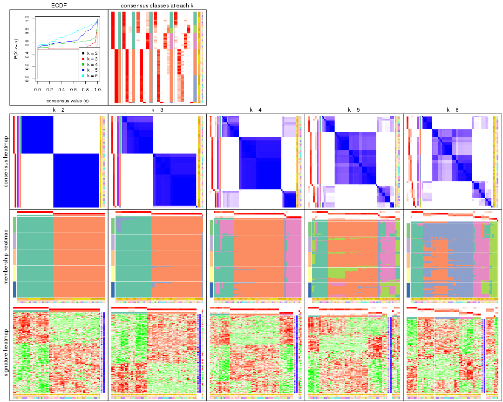

The plots are:

- The first row: a plot of the ECDF (empirical cumulative distribution
  function) curves of the consensus matrix for each `k` and the heatmap of
  predicted classes for each `k`.
- The second row: heatmaps of the consensus matrix for each `k`.
- The third row: heatmaps of the membership matrix for each `k`.
- The fouth row: heatmaps of the signatures for each `k`.

All the plots in panels can be made by individual functions and they are
plotted later in this section.

`select_partition_number()` produces several plots showing different
statistics for choosing "optimized" `k`. There are following statistics:

- ECDF curves of the consensus matrix for each `k`;
- 1-PAC. [The PAC
  score](https://en.wikipedia.org/wiki/Consensus_clustering#Over-interpretation_potential_of_consensus_clustering)
  measures the proportion of the ambiguous subgrouping.
- Mean silhouette score.
- Concordance. The mean probability of fiting the consensus class ids in all
  partitions.
- Area increased. Denote $A_k$ as the area under the ECDF curve for current
  `k`, the area increased is defined as $A_k - A_{k-1}$.
- Rand index. The percent of pairs of samples that are both in a same cluster
  or both are not in a same cluster in the partition of k and k-1.
- Jaccard index. The ratio of pairs of samples are both in a same cluster in
  the partition of k and k-1 and the pairs of samples are both in a same
  cluster in the partition k or k-1.

The detailed explanations of these statistics can be found in [the _cola_
vignette](http://bioconductor.org/packages/devel/bioc/vignettes/cola/inst/doc/cola.html#toc_13).

Generally speaking, lower PAC score, higher mean silhouette score or higher
concordance corresponds to better partition. Rand index and Jaccard index
measure how similar the current partition is compared to partition with `k-1`.
If they are too similar, we won't accept `k` is better than `k-1`.

```r
select_partition_number(res)
```

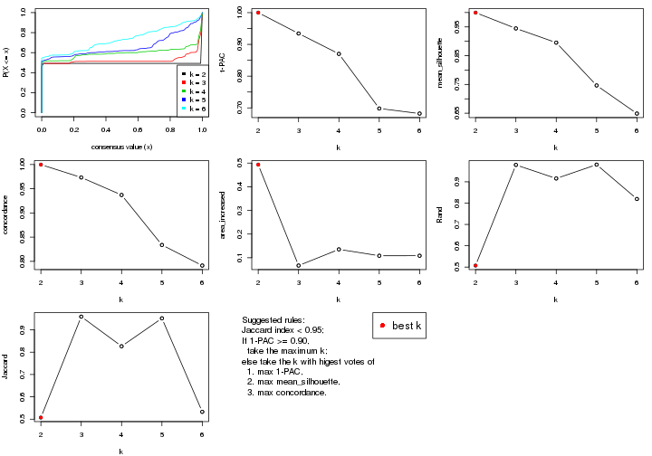

The numeric values for all these statistics can be obtained by `get_stats()`.

```r
get_stats(res)
```

```
#>   k 1-PAC mean_silhouette concordance area_increased  Rand Jaccard
#> 2 2 1.000           1.000       1.000         0.4934 0.507   0.507
#> 3 3 0.934           0.945       0.973         0.0669 0.979   0.959
#> 4 4 0.870           0.895       0.937         0.1354 0.916   0.826
#> 5 5 0.698           0.746       0.834         0.1084 0.981   0.952
#> 6 6 0.682           0.649       0.791         0.1084 0.819   0.533
```

`suggest_best_k()` suggests the best $k$ based on these statistics. The rules are as follows:

- All $k$ with Jaccard index larger than 0.95 are removed because increasing
  $k$ does not provide enough extra information. If all $k$ are removed, it is
  marked as no subgroup is detected.
- For all $k$ with 1-PAC score larger than 0.9, the maximal $k$ is taken as
  the best $k$, and other $k$ are marked as optional $k$.
- If it does not fit the second rule. The $k$ with the maximal vote of the
  highest 1-PAC score, highest mean silhouette, and highest concordance is
  taken as the best $k$.

```r
suggest_best_k(res)
```

```
#> [1] 2
```


Following shows the table of the partitions (You need to click the **show/hide
code output** link to see it). The membership matrix (columns with name `p*`)
is inferred by
[`clue::cl_consensus()`](https://www.rdocumentation.org/link/cl_consensus?package=clue)
function with the `SE` method. Basically the value in the membership matrix
represents the probability to belong to a certain group. The finall class
label for an item is determined with the group with highest probability it
belongs to.

In `get_classes()` function, the entropy is calculated from the membership
matrix and the silhouette score is calculated from the consensus matrix.


<script>
$( function() {
	$( '#tabs-SD-hclust-get-classes' ).tabs();
} );
</script>
<div id='tabs-SD-hclust-get-classes'>
<ul>
<li><a href='#tab-SD-hclust-get-classes-1'>k = 2</a></li>
<li><a href='#tab-SD-hclust-get-classes-2'>k = 3</a></li>
<li><a href='#tab-SD-hclust-get-classes-3'>k = 4</a></li>
<li><a href='#tab-SD-hclust-get-classes-4'>k = 5</a></li>
<li><a href='#tab-SD-hclust-get-classes-5'>k = 6</a></li>
</ul>

<div id='tab-SD-hclust-get-classes-1'>
<p><a id='tab-SD-hclust-get-classes-1-a' style='color:#0366d6' href='#'>show/hide code output</a></p>
<pre><code class="r">cbind(get_classes(res, k = 2), get_membership(res, k = 2))
</code></pre>

<pre><code>#&gt;           class entropy silhouette    p1    p2
#&gt; GSM790742     2  0.0000      1.000 0.000 1.000
#&gt; GSM790744     2  0.0000      1.000 0.000 1.000
#&gt; GSM790754     2  0.0000      1.000 0.000 1.000
#&gt; GSM790756     2  0.0000      1.000 0.000 1.000
#&gt; GSM790768     2  0.0000      1.000 0.000 1.000
#&gt; GSM790774     2  0.0000      1.000 0.000 1.000
#&gt; GSM790778     2  0.0000      1.000 0.000 1.000
#&gt; GSM790784     2  0.0000      1.000 0.000 1.000
#&gt; GSM790790     2  0.0000      1.000 0.000 1.000
#&gt; GSM790743     1  0.0000      1.000 1.000 0.000
#&gt; GSM790745     1  0.0000      1.000 1.000 0.000
#&gt; GSM790755     2  0.0672      0.992 0.008 0.992
#&gt; GSM790757     1  0.0000      1.000 1.000 0.000
#&gt; GSM790769     1  0.0000      1.000 1.000 0.000
#&gt; GSM790775     1  0.0000      1.000 1.000 0.000
#&gt; GSM790779     1  0.0000      1.000 1.000 0.000
#&gt; GSM790785     1  0.0000      1.000 1.000 0.000
#&gt; GSM790791     1  0.0000      1.000 1.000 0.000
#&gt; GSM790738     2  0.0000      1.000 0.000 1.000
#&gt; GSM790746     2  0.0000      1.000 0.000 1.000
#&gt; GSM790752     2  0.0000      1.000 0.000 1.000
#&gt; GSM790758     2  0.0000      1.000 0.000 1.000
#&gt; GSM790764     2  0.0000      1.000 0.000 1.000
#&gt; GSM790766     2  0.0000      1.000 0.000 1.000
#&gt; GSM790772     2  0.0000      1.000 0.000 1.000
#&gt; GSM790782     2  0.0000      1.000 0.000 1.000
#&gt; GSM790786     2  0.0000      1.000 0.000 1.000
#&gt; GSM790792     2  0.0000      1.000 0.000 1.000
#&gt; GSM790739     1  0.0000      1.000 1.000 0.000
#&gt; GSM790747     1  0.0000      1.000 1.000 0.000
#&gt; GSM790753     1  0.0000      1.000 1.000 0.000
#&gt; GSM790759     2  0.0000      1.000 0.000 1.000
#&gt; GSM790765     2  0.0000      1.000 0.000 1.000
#&gt; GSM790767     1  0.0000      1.000 1.000 0.000
#&gt; GSM790773     1  0.0000      1.000 1.000 0.000
#&gt; GSM790783     1  0.0000      1.000 1.000 0.000
#&gt; GSM790787     1  0.0000      1.000 1.000 0.000
#&gt; GSM790793     1  0.0000      1.000 1.000 0.000
#&gt; GSM790740     2  0.0000      1.000 0.000 1.000
#&gt; GSM790748     2  0.0000      1.000 0.000 1.000
#&gt; GSM790750     2  0.0000      1.000 0.000 1.000
#&gt; GSM790760     2  0.0000      1.000 0.000 1.000
#&gt; GSM790762     2  0.0000      1.000 0.000 1.000
#&gt; GSM790770     2  0.0000      1.000 0.000 1.000
#&gt; GSM790776     2  0.0000      1.000 0.000 1.000
#&gt; GSM790780     2  0.0000      1.000 0.000 1.000
#&gt; GSM790788     2  0.0000      1.000 0.000 1.000
#&gt; GSM790741     2  0.0000      1.000 0.000 1.000
#&gt; GSM790749     1  0.0000      1.000 1.000 0.000
#&gt; GSM790751     2  0.0000      1.000 0.000 1.000
#&gt; GSM790761     1  0.0000      1.000 1.000 0.000
#&gt; GSM790763     1  0.0000      1.000 1.000 0.000
#&gt; GSM790771     1  0.0000      1.000 1.000 0.000
#&gt; GSM790777     1  0.0000      1.000 1.000 0.000
#&gt; GSM790781     1  0.0376      0.996 0.996 0.004
#&gt; GSM790789     1  0.0000      1.000 1.000 0.000
</code></pre>

<script>
$('#tab-SD-hclust-get-classes-1-a').parent().next().next().hide();
$('#tab-SD-hclust-get-classes-1-a').click(function(){
  $('#tab-SD-hclust-get-classes-1-a').parent().next().next().toggle();
  return(false);
});
</script>
</div>

<div id='tab-SD-hclust-get-classes-2'>
<p><a id='tab-SD-hclust-get-classes-2-a' style='color:#0366d6' href='#'>show/hide code output</a></p>
<pre><code class="r">cbind(get_classes(res, k = 3), get_membership(res, k = 3))
</code></pre>

<pre><code>#&gt;           class entropy silhouette    p1    p2    p3
#&gt; GSM790742     2  0.0000      0.982 0.000 1.000 0.000
#&gt; GSM790744     2  0.0000      0.982 0.000 1.000 0.000
#&gt; GSM790754     2  0.0892      0.977 0.000 0.980 0.020
#&gt; GSM790756     2  0.1031      0.975 0.000 0.976 0.024
#&gt; GSM790768     2  0.0000      0.982 0.000 1.000 0.000
#&gt; GSM790774     2  0.1031      0.975 0.000 0.976 0.024
#&gt; GSM790778     2  0.1163      0.973 0.000 0.972 0.028
#&gt; GSM790784     2  0.1163      0.973 0.000 0.972 0.028
#&gt; GSM790790     2  0.0000      0.982 0.000 1.000 0.000
#&gt; GSM790743     1  0.0424      0.966 0.992 0.000 0.008
#&gt; GSM790745     1  0.4121      0.850 0.832 0.000 0.168
#&gt; GSM790755     3  0.4235      0.000 0.000 0.176 0.824
#&gt; GSM790757     1  0.4121      0.850 0.832 0.000 0.168
#&gt; GSM790769     1  0.0424      0.966 0.992 0.000 0.008
#&gt; GSM790775     1  0.0000      0.965 1.000 0.000 0.000
#&gt; GSM790779     1  0.1031      0.959 0.976 0.000 0.024
#&gt; GSM790785     1  0.0000      0.965 1.000 0.000 0.000
#&gt; GSM790791     1  0.0424      0.966 0.992 0.000 0.008
#&gt; GSM790738     2  0.0000      0.982 0.000 1.000 0.000
#&gt; GSM790746     2  0.0000      0.982 0.000 1.000 0.000
#&gt; GSM790752     2  0.0892      0.977 0.000 0.980 0.020
#&gt; GSM790758     2  0.1031      0.975 0.000 0.976 0.024
#&gt; GSM790764     2  0.0000      0.982 0.000 1.000 0.000
#&gt; GSM790766     2  0.0000      0.982 0.000 1.000 0.000
#&gt; GSM790772     2  0.1031      0.975 0.000 0.976 0.024
#&gt; GSM790782     2  0.3038      0.884 0.000 0.896 0.104
#&gt; GSM790786     2  0.1163      0.973 0.000 0.972 0.028
#&gt; GSM790792     2  0.0000      0.982 0.000 1.000 0.000
#&gt; GSM790739     1  0.3340      0.891 0.880 0.000 0.120
#&gt; GSM790747     1  0.0424      0.966 0.992 0.000 0.008
#&gt; GSM790753     1  0.0747      0.961 0.984 0.000 0.016
#&gt; GSM790759     2  0.0000      0.982 0.000 1.000 0.000
#&gt; GSM790765     2  0.0237      0.981 0.000 0.996 0.004
#&gt; GSM790767     1  0.0424      0.966 0.992 0.000 0.008
#&gt; GSM790773     1  0.0000      0.965 1.000 0.000 0.000
#&gt; GSM790783     1  0.0424      0.966 0.992 0.000 0.008
#&gt; GSM790787     1  0.0747      0.961 0.984 0.000 0.016
#&gt; GSM790793     1  0.1031      0.958 0.976 0.000 0.024
#&gt; GSM790740     2  0.0000      0.982 0.000 1.000 0.000
#&gt; GSM790748     2  0.0000      0.982 0.000 1.000 0.000
#&gt; GSM790750     2  0.0892      0.977 0.000 0.980 0.020
#&gt; GSM790760     2  0.0237      0.981 0.000 0.996 0.004
#&gt; GSM790762     2  0.0000      0.982 0.000 1.000 0.000
#&gt; GSM790770     2  0.0000      0.982 0.000 1.000 0.000
#&gt; GSM790776     2  0.0000      0.982 0.000 1.000 0.000
#&gt; GSM790780     2  0.3038      0.884 0.000 0.896 0.104
#&gt; GSM790788     2  0.0000      0.982 0.000 1.000 0.000
#&gt; GSM790741     2  0.0000      0.982 0.000 1.000 0.000
#&gt; GSM790749     1  0.0424      0.966 0.992 0.000 0.008
#&gt; GSM790751     2  0.0892      0.977 0.000 0.980 0.020
#&gt; GSM790761     1  0.0424      0.966 0.992 0.000 0.008
#&gt; GSM790763     1  0.1031      0.959 0.976 0.000 0.024
#&gt; GSM790771     1  0.0424      0.966 0.992 0.000 0.008
#&gt; GSM790777     1  0.0000      0.965 1.000 0.000 0.000
#&gt; GSM790781     1  0.4291      0.839 0.820 0.000 0.180
#&gt; GSM790789     1  0.0424      0.966 0.992 0.000 0.008
</code></pre>

<script>
$('#tab-SD-hclust-get-classes-2-a').parent().next().next().hide();
$('#tab-SD-hclust-get-classes-2-a').click(function(){
  $('#tab-SD-hclust-get-classes-2-a').parent().next().next().toggle();
  return(false);
});
</script>
</div>

<div id='tab-SD-hclust-get-classes-3'>
<p><a id='tab-SD-hclust-get-classes-3-a' style='color:#0366d6' href='#'>show/hide code output</a></p>
<pre><code class="r">cbind(get_classes(res, k = 4), get_membership(res, k = 4))
</code></pre>

<pre><code>#&gt;           class entropy silhouette    p1    p2    p3    p4
#&gt; GSM790742     2  0.0000      0.986 0.000 1.000 0.000 0.000
#&gt; GSM790744     2  0.0000      0.986 0.000 1.000 0.000 0.000
#&gt; GSM790754     2  0.0707      0.981 0.000 0.980 0.020 0.000
#&gt; GSM790756     2  0.0817      0.979 0.000 0.976 0.024 0.000
#&gt; GSM790768     2  0.0000      0.986 0.000 1.000 0.000 0.000
#&gt; GSM790774     2  0.0817      0.979 0.000 0.976 0.024 0.000
#&gt; GSM790778     2  0.0921      0.978 0.000 0.972 0.028 0.000
#&gt; GSM790784     2  0.0921      0.978 0.000 0.972 0.028 0.000
#&gt; GSM790790     2  0.0000      0.986 0.000 1.000 0.000 0.000
#&gt; GSM790743     4  0.0188      0.949 0.004 0.000 0.000 0.996
#&gt; GSM790745     1  0.3569      0.647 0.804 0.000 0.000 0.196
#&gt; GSM790755     3  0.0000      0.000 0.000 0.000 1.000 0.000
#&gt; GSM790757     1  0.3569      0.647 0.804 0.000 0.000 0.196
#&gt; GSM790769     4  0.0000      0.951 0.000 0.000 0.000 1.000
#&gt; GSM790775     1  0.3688      0.841 0.792 0.000 0.000 0.208
#&gt; GSM790779     1  0.3539      0.840 0.820 0.000 0.004 0.176
#&gt; GSM790785     1  0.3688      0.841 0.792 0.000 0.000 0.208
#&gt; GSM790791     4  0.0000      0.951 0.000 0.000 0.000 1.000
#&gt; GSM790738     2  0.0000      0.986 0.000 1.000 0.000 0.000
#&gt; GSM790746     2  0.0000      0.986 0.000 1.000 0.000 0.000
#&gt; GSM790752     2  0.0707      0.981 0.000 0.980 0.020 0.000
#&gt; GSM790758     2  0.0817      0.979 0.000 0.976 0.024 0.000
#&gt; GSM790764     2  0.0000      0.986 0.000 1.000 0.000 0.000
#&gt; GSM790766     2  0.0000      0.986 0.000 1.000 0.000 0.000
#&gt; GSM790772     2  0.0817      0.979 0.000 0.976 0.024 0.000
#&gt; GSM790782     2  0.2408      0.907 0.000 0.896 0.104 0.000
#&gt; GSM790786     2  0.0921      0.978 0.000 0.972 0.028 0.000
#&gt; GSM790792     2  0.0000      0.986 0.000 1.000 0.000 0.000
#&gt; GSM790739     1  0.4040      0.673 0.752 0.000 0.000 0.248
#&gt; GSM790747     4  0.0000      0.951 0.000 0.000 0.000 1.000
#&gt; GSM790753     1  0.3486      0.843 0.812 0.000 0.000 0.188
#&gt; GSM790759     2  0.0000      0.986 0.000 1.000 0.000 0.000
#&gt; GSM790765     2  0.0188      0.984 0.000 0.996 0.004 0.000
#&gt; GSM790767     4  0.4250      0.404 0.276 0.000 0.000 0.724
#&gt; GSM790773     1  0.3688      0.841 0.792 0.000 0.000 0.208
#&gt; GSM790783     1  0.4855      0.583 0.600 0.000 0.000 0.400
#&gt; GSM790787     1  0.3486      0.843 0.812 0.000 0.000 0.188
#&gt; GSM790793     4  0.1022      0.922 0.032 0.000 0.000 0.968
#&gt; GSM790740     2  0.0000      0.986 0.000 1.000 0.000 0.000
#&gt; GSM790748     2  0.0000      0.986 0.000 1.000 0.000 0.000
#&gt; GSM790750     2  0.0707      0.981 0.000 0.980 0.020 0.000
#&gt; GSM790760     2  0.0188      0.985 0.000 0.996 0.004 0.000
#&gt; GSM790762     2  0.0000      0.986 0.000 1.000 0.000 0.000
#&gt; GSM790770     2  0.0000      0.986 0.000 1.000 0.000 0.000
#&gt; GSM790776     2  0.0000      0.986 0.000 1.000 0.000 0.000
#&gt; GSM790780     2  0.2408      0.907 0.000 0.896 0.104 0.000
#&gt; GSM790788     2  0.0000      0.986 0.000 1.000 0.000 0.000
#&gt; GSM790741     2  0.0000      0.986 0.000 1.000 0.000 0.000
#&gt; GSM790749     4  0.0000      0.951 0.000 0.000 0.000 1.000
#&gt; GSM790751     2  0.0707      0.981 0.000 0.980 0.020 0.000
#&gt; GSM790761     4  0.0188      0.949 0.004 0.000 0.000 0.996
#&gt; GSM790763     1  0.4535      0.774 0.704 0.000 0.004 0.292
#&gt; GSM790771     4  0.0000      0.951 0.000 0.000 0.000 1.000
#&gt; GSM790777     1  0.3688      0.841 0.792 0.000 0.000 0.208
#&gt; GSM790781     1  0.0336      0.682 0.992 0.000 0.008 0.000
#&gt; GSM790789     4  0.0000      0.951 0.000 0.000 0.000 1.000
</code></pre>

<script>
$('#tab-SD-hclust-get-classes-3-a').parent().next().next().hide();
$('#tab-SD-hclust-get-classes-3-a').click(function(){
  $('#tab-SD-hclust-get-classes-3-a').parent().next().next().toggle();
  return(false);
});
</script>
</div>

<div id='tab-SD-hclust-get-classes-4'>
<p><a id='tab-SD-hclust-get-classes-4-a' style='color:#0366d6' href='#'>show/hide code output</a></p>
<pre><code class="r">cbind(get_classes(res, k = 5), get_membership(res, k = 5))
</code></pre>

<pre><code>#&gt;           class entropy silhouette    p1    p2    p3    p4    p5
#&gt; GSM790742     2  0.3684      0.801 0.000 0.720 0.000 0.000 0.280
#&gt; GSM790744     2  0.1671      0.879 0.000 0.924 0.000 0.000 0.076
#&gt; GSM790754     2  0.0404      0.874 0.000 0.988 0.012 0.000 0.000
#&gt; GSM790756     2  0.1106      0.866 0.000 0.964 0.012 0.000 0.024
#&gt; GSM790768     2  0.1121      0.880 0.000 0.956 0.000 0.000 0.044
#&gt; GSM790774     2  0.0912      0.869 0.000 0.972 0.012 0.000 0.016
#&gt; GSM790778     2  0.1018      0.868 0.000 0.968 0.016 0.000 0.016
#&gt; GSM790784     2  0.1018      0.868 0.000 0.968 0.016 0.000 0.016
#&gt; GSM790790     2  0.3684      0.801 0.000 0.720 0.000 0.000 0.280
#&gt; GSM790743     4  0.2891      0.735 0.000 0.000 0.000 0.824 0.176
#&gt; GSM790745     5  0.4797      0.941 0.296 0.000 0.000 0.044 0.660
#&gt; GSM790755     3  0.0000      0.000 0.000 0.000 1.000 0.000 0.000
#&gt; GSM790757     5  0.4797      0.941 0.296 0.000 0.000 0.044 0.660
#&gt; GSM790769     4  0.0794      0.782 0.028 0.000 0.000 0.972 0.000
#&gt; GSM790775     1  0.0794      0.765 0.972 0.000 0.000 0.028 0.000
#&gt; GSM790779     1  0.0162      0.748 0.996 0.000 0.000 0.000 0.004
#&gt; GSM790785     1  0.0794      0.765 0.972 0.000 0.000 0.028 0.000
#&gt; GSM790791     4  0.5136      0.726 0.180 0.000 0.000 0.692 0.128
#&gt; GSM790738     2  0.1671      0.879 0.000 0.924 0.000 0.000 0.076
#&gt; GSM790746     2  0.3612      0.808 0.000 0.732 0.000 0.000 0.268
#&gt; GSM790752     2  0.0404      0.874 0.000 0.988 0.012 0.000 0.000
#&gt; GSM790758     2  0.1106      0.866 0.000 0.964 0.012 0.000 0.024
#&gt; GSM790764     2  0.3612      0.808 0.000 0.732 0.000 0.000 0.268
#&gt; GSM790766     2  0.1121      0.880 0.000 0.956 0.000 0.000 0.044
#&gt; GSM790772     2  0.0912      0.869 0.000 0.972 0.012 0.000 0.016
#&gt; GSM790782     2  0.2694      0.806 0.000 0.884 0.076 0.000 0.040
#&gt; GSM790786     2  0.1018      0.868 0.000 0.968 0.016 0.000 0.016
#&gt; GSM790792     2  0.3684      0.801 0.000 0.720 0.000 0.000 0.280
#&gt; GSM790739     5  0.5043      0.873 0.356 0.000 0.000 0.044 0.600
#&gt; GSM790747     4  0.0794      0.782 0.028 0.000 0.000 0.972 0.000
#&gt; GSM790753     1  0.0290      0.759 0.992 0.000 0.000 0.008 0.000
#&gt; GSM790759     2  0.2074      0.874 0.000 0.896 0.000 0.000 0.104
#&gt; GSM790765     2  0.3550      0.821 0.000 0.760 0.004 0.000 0.236
#&gt; GSM790767     4  0.4268      0.267 0.444 0.000 0.000 0.556 0.000
#&gt; GSM790773     1  0.0794      0.765 0.972 0.000 0.000 0.028 0.000
#&gt; GSM790783     1  0.4101      0.291 0.628 0.000 0.000 0.372 0.000
#&gt; GSM790787     1  0.0290      0.759 0.992 0.000 0.000 0.008 0.000
#&gt; GSM790793     4  0.5345      0.706 0.196 0.000 0.000 0.668 0.136
#&gt; GSM790740     2  0.1671      0.879 0.000 0.924 0.000 0.000 0.076
#&gt; GSM790748     2  0.3684      0.801 0.000 0.720 0.000 0.000 0.280
#&gt; GSM790750     2  0.0404      0.874 0.000 0.988 0.012 0.000 0.000
#&gt; GSM790760     2  0.3242      0.838 0.000 0.784 0.000 0.000 0.216
#&gt; GSM790762     2  0.3684      0.801 0.000 0.720 0.000 0.000 0.280
#&gt; GSM790770     2  0.1197      0.881 0.000 0.952 0.000 0.000 0.048
#&gt; GSM790776     2  0.3003      0.846 0.000 0.812 0.000 0.000 0.188
#&gt; GSM790780     2  0.2694      0.806 0.000 0.884 0.076 0.000 0.040
#&gt; GSM790788     2  0.3684      0.801 0.000 0.720 0.000 0.000 0.280
#&gt; GSM790741     2  0.1671      0.879 0.000 0.924 0.000 0.000 0.076
#&gt; GSM790749     4  0.0794      0.782 0.028 0.000 0.000 0.972 0.000
#&gt; GSM790751     2  0.0404      0.874 0.000 0.988 0.012 0.000 0.000
#&gt; GSM790761     4  0.2891      0.735 0.000 0.000 0.000 0.824 0.176
#&gt; GSM790763     1  0.4921     -0.242 0.604 0.000 0.000 0.036 0.360
#&gt; GSM790771     4  0.0794      0.782 0.028 0.000 0.000 0.972 0.000
#&gt; GSM790777     1  0.0794      0.765 0.972 0.000 0.000 0.028 0.000
#&gt; GSM790781     1  0.4307     -0.493 0.504 0.000 0.000 0.000 0.496
#&gt; GSM790789     4  0.5136      0.726 0.180 0.000 0.000 0.692 0.128
</code></pre>

<script>
$('#tab-SD-hclust-get-classes-4-a').parent().next().next().hide();
$('#tab-SD-hclust-get-classes-4-a').click(function(){
  $('#tab-SD-hclust-get-classes-4-a').parent().next().next().toggle();
  return(false);
});
</script>
</div>

<div id='tab-SD-hclust-get-classes-5'>
<p><a id='tab-SD-hclust-get-classes-5-a' style='color:#0366d6' href='#'>show/hide code output</a></p>
<pre><code class="r">cbind(get_classes(res, k = 6), get_membership(res, k = 6))
</code></pre>

<pre><code>#&gt;           class entropy silhouette    p1    p2    p3    p4    p5    p6
#&gt; GSM790742     2  0.0000      0.708 0.000 1.000 0.000 0.000 0.000 0.000
#&gt; GSM790744     2  0.3804     -0.185 0.000 0.576 0.424 0.000 0.000 0.000
#&gt; GSM790754     3  0.3482      0.883 0.000 0.316 0.684 0.000 0.000 0.000
#&gt; GSM790756     3  0.3390      0.886 0.000 0.296 0.704 0.000 0.000 0.000
#&gt; GSM790768     3  0.3838      0.625 0.000 0.448 0.552 0.000 0.000 0.000
#&gt; GSM790774     3  0.3390      0.888 0.000 0.296 0.704 0.000 0.000 0.000
#&gt; GSM790778     3  0.3351      0.884 0.000 0.288 0.712 0.000 0.000 0.000
#&gt; GSM790784     3  0.3371      0.887 0.000 0.292 0.708 0.000 0.000 0.000
#&gt; GSM790790     2  0.0146      0.711 0.000 0.996 0.004 0.000 0.000 0.000
#&gt; GSM790743     4  0.5388      0.627 0.004 0.000 0.192 0.604 0.200 0.000
#&gt; GSM790745     5  0.0000      0.754 0.000 0.000 0.000 0.000 1.000 0.000
#&gt; GSM790755     6  0.0000      0.000 0.000 0.000 0.000 0.000 0.000 1.000
#&gt; GSM790757     5  0.0000      0.754 0.000 0.000 0.000 0.000 1.000 0.000
#&gt; GSM790769     4  0.0146      0.709 0.004 0.000 0.000 0.996 0.000 0.000
#&gt; GSM790775     1  0.1007      0.915 0.956 0.000 0.000 0.044 0.000 0.000
#&gt; GSM790779     1  0.0291      0.893 0.992 0.000 0.004 0.000 0.004 0.000
#&gt; GSM790785     1  0.1007      0.915 0.956 0.000 0.000 0.044 0.000 0.000
#&gt; GSM790791     4  0.4923      0.689 0.172 0.000 0.000 0.656 0.172 0.000
#&gt; GSM790738     2  0.3817     -0.216 0.000 0.568 0.432 0.000 0.000 0.000
#&gt; GSM790746     2  0.0790      0.705 0.000 0.968 0.032 0.000 0.000 0.000
#&gt; GSM790752     3  0.3482      0.883 0.000 0.316 0.684 0.000 0.000 0.000
#&gt; GSM790758     3  0.3390      0.886 0.000 0.296 0.704 0.000 0.000 0.000
#&gt; GSM790764     2  0.0937      0.698 0.000 0.960 0.040 0.000 0.000 0.000
#&gt; GSM790766     3  0.3838      0.625 0.000 0.448 0.552 0.000 0.000 0.000
#&gt; GSM790772     3  0.3390      0.888 0.000 0.296 0.704 0.000 0.000 0.000
#&gt; GSM790782     3  0.2902      0.751 0.000 0.196 0.800 0.000 0.000 0.004
#&gt; GSM790786     3  0.3371      0.887 0.000 0.292 0.708 0.000 0.000 0.000
#&gt; GSM790792     2  0.0146      0.711 0.000 0.996 0.004 0.000 0.000 0.000
#&gt; GSM790739     5  0.1267      0.752 0.060 0.000 0.000 0.000 0.940 0.000
#&gt; GSM790747     4  0.0146      0.709 0.004 0.000 0.000 0.996 0.000 0.000
#&gt; GSM790753     1  0.0405      0.904 0.988 0.000 0.000 0.008 0.004 0.000
#&gt; GSM790759     2  0.3659      0.075 0.000 0.636 0.364 0.000 0.000 0.000
#&gt; GSM790765     2  0.2178      0.638 0.000 0.868 0.132 0.000 0.000 0.000
#&gt; GSM790767     4  0.3810      0.210 0.428 0.000 0.000 0.572 0.000 0.000
#&gt; GSM790773     1  0.1007      0.915 0.956 0.000 0.000 0.044 0.000 0.000
#&gt; GSM790783     1  0.3747      0.412 0.604 0.000 0.000 0.396 0.000 0.000
#&gt; GSM790787     1  0.0405      0.904 0.988 0.000 0.000 0.008 0.004 0.000
#&gt; GSM790793     4  0.5148      0.668 0.180 0.000 0.000 0.624 0.196 0.000
#&gt; GSM790740     2  0.3817     -0.216 0.000 0.568 0.432 0.000 0.000 0.000
#&gt; GSM790748     2  0.0000      0.708 0.000 1.000 0.000 0.000 0.000 0.000
#&gt; GSM790750     3  0.3482      0.883 0.000 0.316 0.684 0.000 0.000 0.000
#&gt; GSM790760     2  0.2219      0.635 0.000 0.864 0.136 0.000 0.000 0.000
#&gt; GSM790762     2  0.0146      0.711 0.000 0.996 0.004 0.000 0.000 0.000
#&gt; GSM790770     3  0.3854      0.586 0.000 0.464 0.536 0.000 0.000 0.000
#&gt; GSM790776     2  0.2823      0.543 0.000 0.796 0.204 0.000 0.000 0.000
#&gt; GSM790780     3  0.2902      0.751 0.000 0.196 0.800 0.000 0.000 0.004
#&gt; GSM790788     2  0.0146      0.711 0.000 0.996 0.004 0.000 0.000 0.000
#&gt; GSM790741     2  0.3817     -0.216 0.000 0.568 0.432 0.000 0.000 0.000
#&gt; GSM790749     4  0.0146      0.709 0.004 0.000 0.000 0.996 0.000 0.000
#&gt; GSM790751     3  0.3482      0.883 0.000 0.316 0.684 0.000 0.000 0.000
#&gt; GSM790761     4  0.5388      0.627 0.004 0.000 0.192 0.604 0.200 0.000
#&gt; GSM790763     5  0.4139      0.553 0.336 0.000 0.000 0.024 0.640 0.000
#&gt; GSM790771     4  0.0146      0.709 0.004 0.000 0.000 0.996 0.000 0.000
#&gt; GSM790777     1  0.1007      0.915 0.956 0.000 0.000 0.044 0.000 0.000
#&gt; GSM790781     5  0.3271      0.603 0.232 0.000 0.008 0.000 0.760 0.000
#&gt; GSM790789     4  0.4923      0.689 0.172 0.000 0.000 0.656 0.172 0.000
</code></pre>

<script>
$('#tab-SD-hclust-get-classes-5-a').parent().next().next().hide();
$('#tab-SD-hclust-get-classes-5-a').click(function(){
  $('#tab-SD-hclust-get-classes-5-a').parent().next().next().toggle();
  return(false);
});
</script>
</div>
</div>

Heatmaps for the consensus matrix. It visualizes the probability of two
samples to be in a same group.


<script>
$( function() {
	$( '#tabs-SD-hclust-consensus-heatmap' ).tabs();
} );
</script>
<div id='tabs-SD-hclust-consensus-heatmap'>
<ul>
<li><a href='#tab-SD-hclust-consensus-heatmap-1'>k = 2</a></li>
<li><a href='#tab-SD-hclust-consensus-heatmap-2'>k = 3</a></li>
<li><a href='#tab-SD-hclust-consensus-heatmap-3'>k = 4</a></li>
<li><a href='#tab-SD-hclust-consensus-heatmap-4'>k = 5</a></li>
<li><a href='#tab-SD-hclust-consensus-heatmap-5'>k = 6</a></li>
</ul>
<div id='tab-SD-hclust-consensus-heatmap-1'>
<pre><code class="r">consensus_heatmap(res, k = 2)
</code></pre>

<p>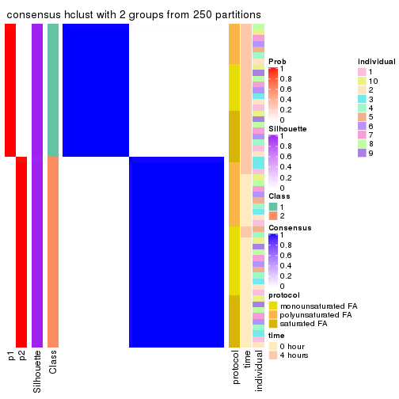</p>

</div>
<div id='tab-SD-hclust-consensus-heatmap-2'>
<pre><code class="r">consensus_heatmap(res, k = 3)
</code></pre>

<p>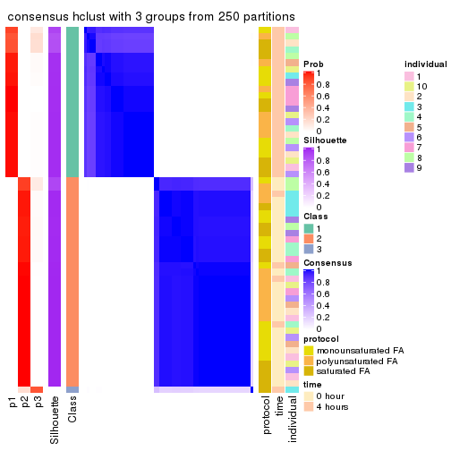</p>

</div>
<div id='tab-SD-hclust-consensus-heatmap-3'>
<pre><code class="r">consensus_heatmap(res, k = 4)
</code></pre>

<p>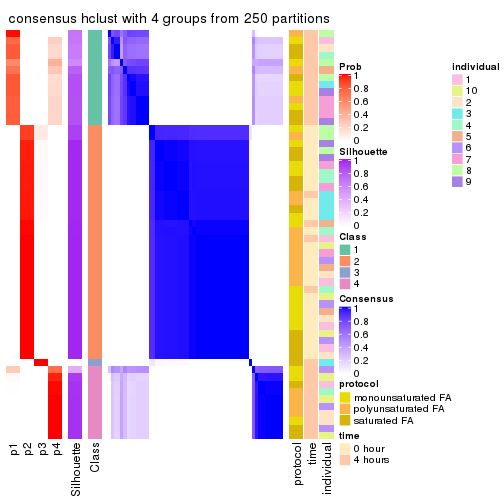</p>

</div>
<div id='tab-SD-hclust-consensus-heatmap-4'>
<pre><code class="r">consensus_heatmap(res, k = 5)
</code></pre>

<p>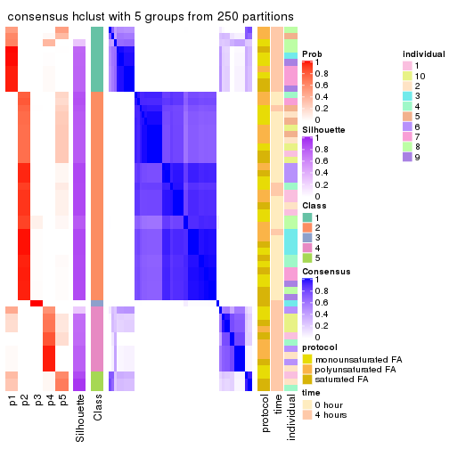</p>

</div>
<div id='tab-SD-hclust-consensus-heatmap-5'>
<pre><code class="r">consensus_heatmap(res, k = 6)
</code></pre>

<p>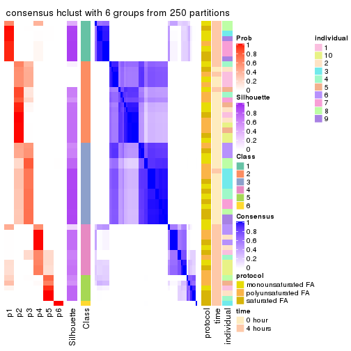</p>

</div>
</div>

Heatmaps for the membership of samples in all partitions to see how consistent they are:


<script>
$( function() {
	$( '#tabs-SD-hclust-membership-heatmap' ).tabs();
} );
</script>
<div id='tabs-SD-hclust-membership-heatmap'>
<ul>
<li><a href='#tab-SD-hclust-membership-heatmap-1'>k = 2</a></li>
<li><a href='#tab-SD-hclust-membership-heatmap-2'>k = 3</a></li>
<li><a href='#tab-SD-hclust-membership-heatmap-3'>k = 4</a></li>
<li><a href='#tab-SD-hclust-membership-heatmap-4'>k = 5</a></li>
<li><a href='#tab-SD-hclust-membership-heatmap-5'>k = 6</a></li>
</ul>
<div id='tab-SD-hclust-membership-heatmap-1'>
<pre><code class="r">membership_heatmap(res, k = 2)
</code></pre>

<p>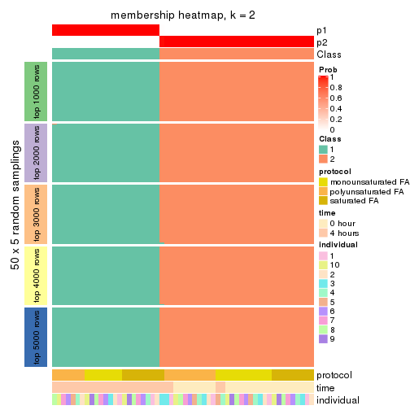</p>

</div>
<div id='tab-SD-hclust-membership-heatmap-2'>
<pre><code class="r">membership_heatmap(res, k = 3)
</code></pre>

<p>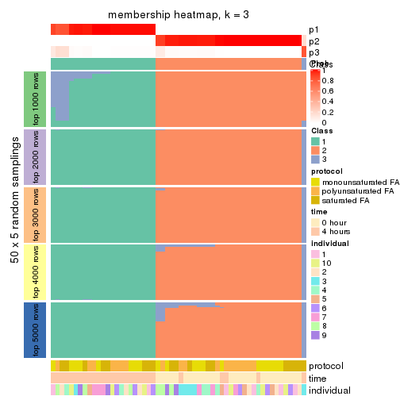</p>

</div>
<div id='tab-SD-hclust-membership-heatmap-3'>
<pre><code class="r">membership_heatmap(res, k = 4)
</code></pre>

<p>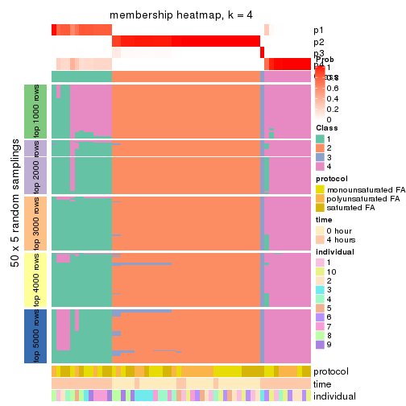</p>

</div>
<div id='tab-SD-hclust-membership-heatmap-4'>
<pre><code class="r">membership_heatmap(res, k = 5)
</code></pre>

<p>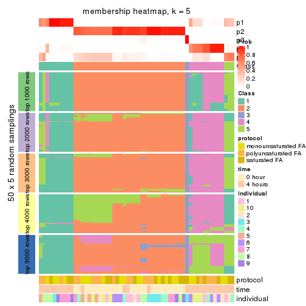</p>

</div>
<div id='tab-SD-hclust-membership-heatmap-5'>
<pre><code class="r">membership_heatmap(res, k = 6)
</code></pre>

<p>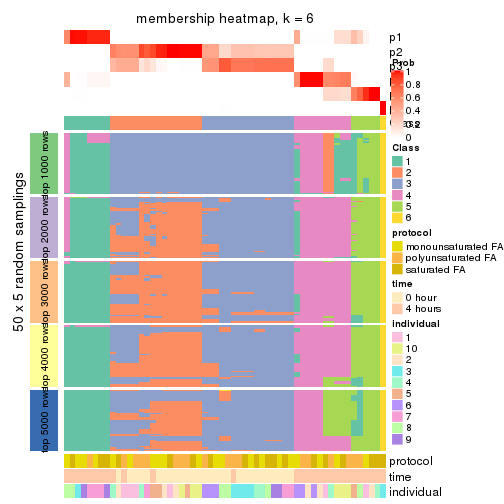</p>

</div>
</div>

As soon as we have had the classes for columns, we can look for signatures
which are significantly different between classes which can be candidate marks
for certain classes. Following are the heatmaps for signatures.


Signature heatmaps where rows are scaled:


<script>
$( function() {
	$( '#tabs-SD-hclust-get-signatures' ).tabs();
} );
</script>
<div id='tabs-SD-hclust-get-signatures'>
<ul>
<li><a href='#tab-SD-hclust-get-signatures-1'>k = 2</a></li>
<li><a href='#tab-SD-hclust-get-signatures-2'>k = 3</a></li>
<li><a href='#tab-SD-hclust-get-signatures-3'>k = 4</a></li>
<li><a href='#tab-SD-hclust-get-signatures-4'>k = 5</a></li>
<li><a href='#tab-SD-hclust-get-signatures-5'>k = 6</a></li>
</ul>
<div id='tab-SD-hclust-get-signatures-1'>
<pre><code class="r">get_signatures(res, k = 2)
</code></pre>

<p>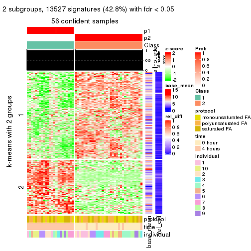</p>

</div>
<div id='tab-SD-hclust-get-signatures-2'>
<pre><code class="r">get_signatures(res, k = 3)
</code></pre>

<p>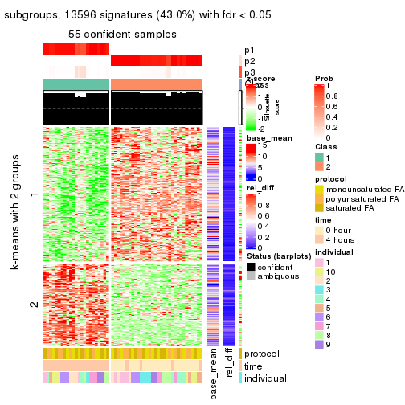</p>

</div>
<div id='tab-SD-hclust-get-signatures-3'>
<pre><code class="r">get_signatures(res, k = 4)
</code></pre>

<p>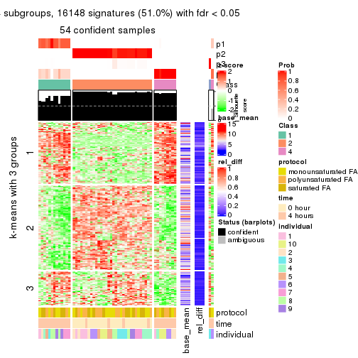</p>

</div>
<div id='tab-SD-hclust-get-signatures-4'>
<pre><code class="r">get_signatures(res, k = 5)
</code></pre>

<p>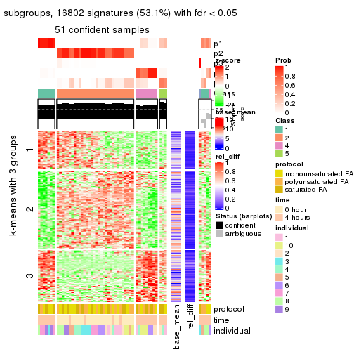</p>

</div>
<div id='tab-SD-hclust-get-signatures-5'>
<pre><code class="r">get_signatures(res, k = 6)
</code></pre>

<p>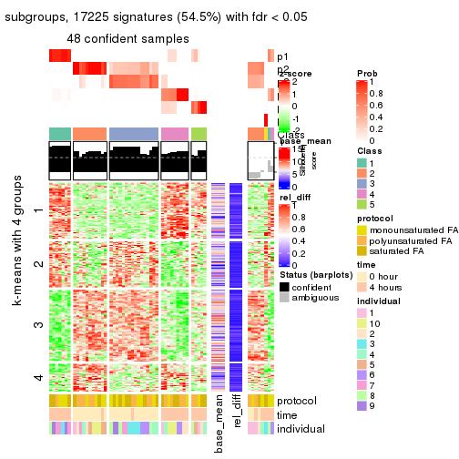</p>

</div>
</div>


Signature heatmaps where rows are not scaled:


<script>
$( function() {
	$( '#tabs-SD-hclust-get-signatures-no-scale' ).tabs();
} );
</script>
<div id='tabs-SD-hclust-get-signatures-no-scale'>
<ul>
<li><a href='#tab-SD-hclust-get-signatures-no-scale-1'>k = 2</a></li>
<li><a href='#tab-SD-hclust-get-signatures-no-scale-2'>k = 3</a></li>
<li><a href='#tab-SD-hclust-get-signatures-no-scale-3'>k = 4</a></li>
<li><a href='#tab-SD-hclust-get-signatures-no-scale-4'>k = 5</a></li>
<li><a href='#tab-SD-hclust-get-signatures-no-scale-5'>k = 6</a></li>
</ul>
<div id='tab-SD-hclust-get-signatures-no-scale-1'>
<pre><code class="r">get_signatures(res, k = 2, scale_rows = FALSE)
</code></pre>

<p>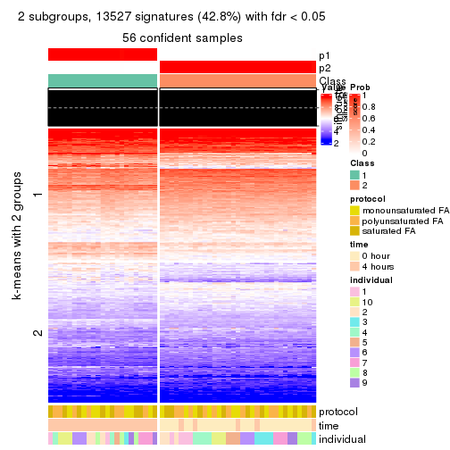</p>

</div>
<div id='tab-SD-hclust-get-signatures-no-scale-2'>
<pre><code class="r">get_signatures(res, k = 3, scale_rows = FALSE)
</code></pre>

<p>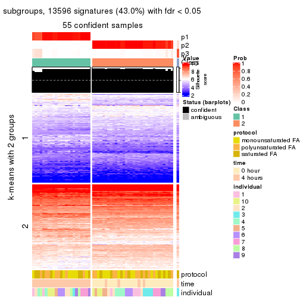</p>

</div>
<div id='tab-SD-hclust-get-signatures-no-scale-3'>
<pre><code class="r">get_signatures(res, k = 4, scale_rows = FALSE)
</code></pre>

<p>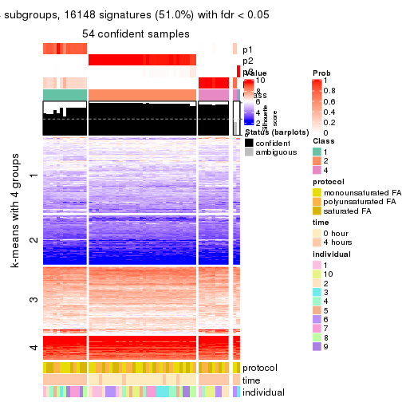</p>

</div>
<div id='tab-SD-hclust-get-signatures-no-scale-4'>
<pre><code class="r">get_signatures(res, k = 5, scale_rows = FALSE)
</code></pre>

<p>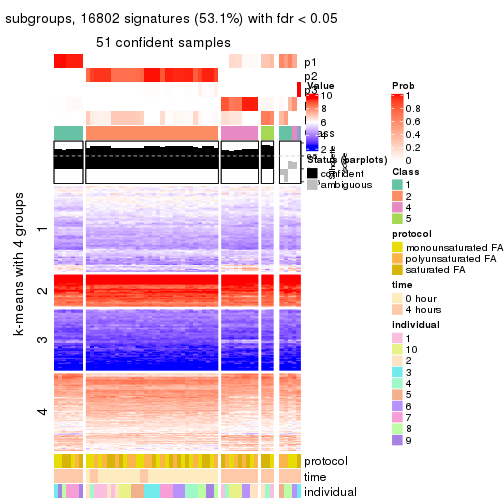</p>

</div>
<div id='tab-SD-hclust-get-signatures-no-scale-5'>
<pre><code class="r">get_signatures(res, k = 6, scale_rows = FALSE)
</code></pre>

<p>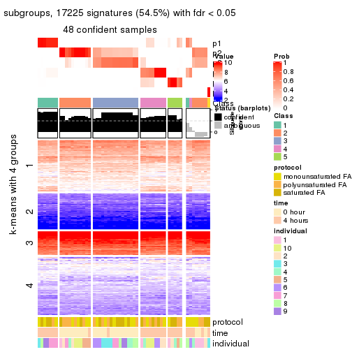</p>

</div>
</div>


Compare the overlap of signatures from different k:

```r
compare_signatures(res)
```

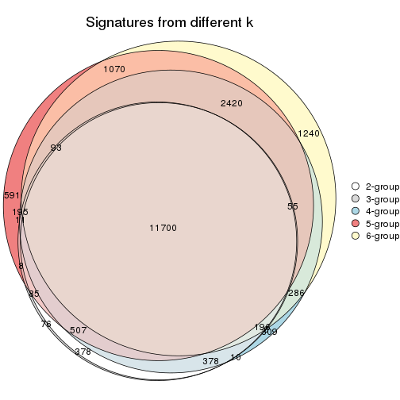

`get_signature()` returns a data frame invisibly. TO get the list of signatures, the function
call should be assigned to a variable explicitly. In following code, if `plot` argument is set
to `FALSE`, no heatmap is plotted while only the differential analysis is performed.

```r
# code only for demonstration
tb = get_signature(res, k = ..., plot = FALSE)
```

An example of the output of `tb` is:

```
#>   which_row         fdr    mean_1    mean_2 scaled_mean_1 scaled_mean_2 km
#> 1        38 0.042760348  8.373488  9.131774    -0.5533452     0.5164555  1
#> 2        40 0.018707592  7.106213  8.469186    -0.6173731     0.5762149  1
#> 3        55 0.019134737 10.221463 11.207825    -0.6159697     0.5749050  1
#> 4        59 0.006059896  5.921854  7.869574    -0.6899429     0.6439467  1
#> 5        60 0.018055526  8.928898 10.211722    -0.6204761     0.5791110  1
#> 6        98 0.009384629 15.714769 14.887706     0.6635654    -0.6193277  2
...
```

The columns in `tb` are:

1. `which_row`: row indices corresponding to the input matrix.
2. `fdr`: FDR for the differential test. 
3. `mean_x`: The mean value in group x.
4. `scaled_mean_x`: The mean value in group x after rows are scaled.
5. `km`: Row groups if k-means clustering is applied to rows.


UMAP plot which shows how samples are separated.


<script>
$( function() {
	$( '#tabs-SD-hclust-dimension-reduction' ).tabs();
} );
</script>
<div id='tabs-SD-hclust-dimension-reduction'>
<ul>
<li><a href='#tab-SD-hclust-dimension-reduction-1'>k = 2</a></li>
<li><a href='#tab-SD-hclust-dimension-reduction-2'>k = 3</a></li>
<li><a href='#tab-SD-hclust-dimension-reduction-3'>k = 4</a></li>
<li><a href='#tab-SD-hclust-dimension-reduction-4'>k = 5</a></li>
<li><a href='#tab-SD-hclust-dimension-reduction-5'>k = 6</a></li>
</ul>
<div id='tab-SD-hclust-dimension-reduction-1'>
<pre><code class="r">dimension_reduction(res, k = 2, method = &quot;UMAP&quot;)
</code></pre>

<p>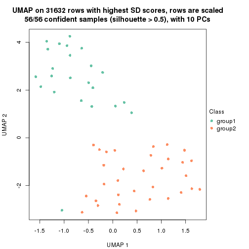</p>

</div>
<div id='tab-SD-hclust-dimension-reduction-2'>
<pre><code class="r">dimension_reduction(res, k = 3, method = &quot;UMAP&quot;)
</code></pre>

<p>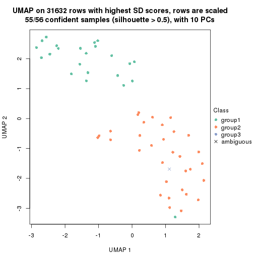</p>

</div>
<div id='tab-SD-hclust-dimension-reduction-3'>
<pre><code class="r">dimension_reduction(res, k = 4, method = &quot;UMAP&quot;)
</code></pre>

<p>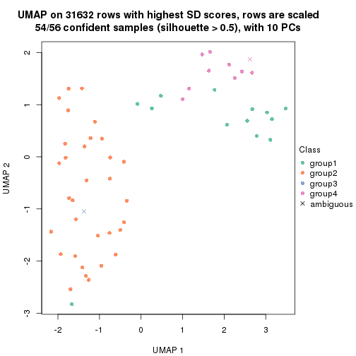</p>

</div>
<div id='tab-SD-hclust-dimension-reduction-4'>
<pre><code class="r">dimension_reduction(res, k = 5, method = &quot;UMAP&quot;)
</code></pre>

<p>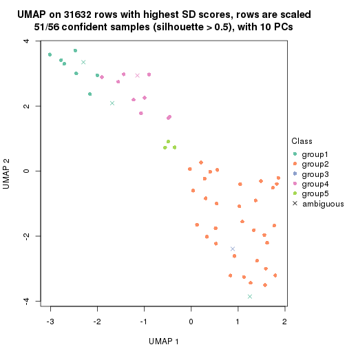</p>

</div>
<div id='tab-SD-hclust-dimension-reduction-5'>
<pre><code class="r">dimension_reduction(res, k = 6, method = &quot;UMAP&quot;)
</code></pre>

<p>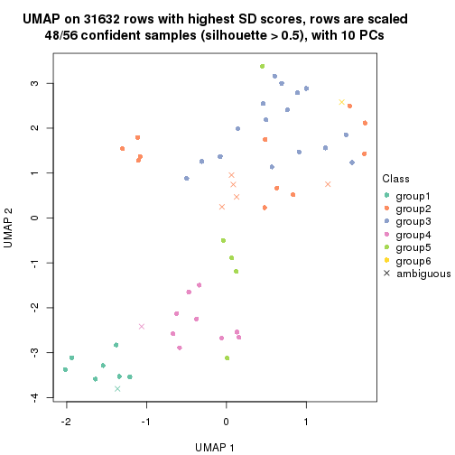</p>

</div>
</div>


Following heatmap shows how subgroups are split when increasing `k`:

```r
collect_classes(res)
```

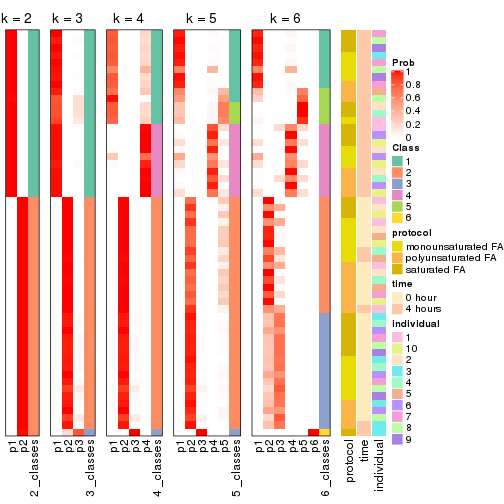


Test correlation between subgroups and known annotations. If the known
annotation is numeric, one-way ANOVA test is applied, and if the known
annotation is discrete, chi-squared contingency table test is applied.

```r
test_to_known_factors(res)
```

```
#>            n protocol(p)  time(p) individual(p) k
#> SD:hclust 56       0.937 2.29e-09        0.9502 2
#> SD:hclust 55       0.868 8.82e-10        0.9739 3
#> SD:hclust 54       0.809 2.08e-09        0.3671 4
#> SD:hclust 51       0.647 4.92e-08        0.2592 5
#> SD:hclust 48       0.859 3.25e-08        0.0314 6
```


If matrix rows can be associated to genes, consider to use `functional_enrichment(res,
...)` to perform function enrichment for the signature genes. See [this vignette](http://bioconductor.org/packages/devel/bioc/vignettes/cola/inst/doc/functional_enrichment.html) for more detailed explanations.


 

---------------------------------------------------


### SD:kmeans**


The object with results only for a single top-value method and a single partition method 
can be extracted as:

```r
res = res_list["SD", "kmeans"]
# you can also extract it by
# res = res_list["SD:kmeans"]
```

A summary of `res` and all the functions that can be applied to it:

```r
res
```

```
#> A 'ConsensusPartition' object with k = 2, 3, 4, 5, 6.
#>   On a matrix with 31632 rows and 56 columns.
#>   Top rows (1000, 2000, 3000, 4000, 5000) are extracted by 'SD' method.
#>   Subgroups are detected by 'kmeans' method.
#>   Performed in total 1250 partitions by row resampling.
#>   Best k for subgroups seems to be 2.
#> 
#> Following methods can be applied to this 'ConsensusPartition' object:
#>  [1] "cola_report"             "collect_classes"         "collect_plots"          
#>  [4] "collect_stats"           "colnames"                "compare_signatures"     
#>  [7] "consensus_heatmap"       "dimension_reduction"     "functional_enrichment"  
#> [10] "get_anno_col"            "get_anno"                "get_classes"            
#> [13] "get_consensus"           "get_matrix"              "get_membership"         
#> [16] "get_param"               "get_signatures"          "get_stats"              
#> [19] "is_best_k"               "is_stable_k"             "membership_heatmap"     
#> [22] "ncol"                    "nrow"                    "plot_ecdf"              
#> [25] "rownames"                "select_partition_number" "show"                   
#> [28] "suggest_best_k"          "test_to_known_factors"
```

`collect_plots()` function collects all the plots made from `res` for all `k` (number of partitions)
into one single page to provide an easy and fast comparison between different `k`.

```r
collect_plots(res)
```

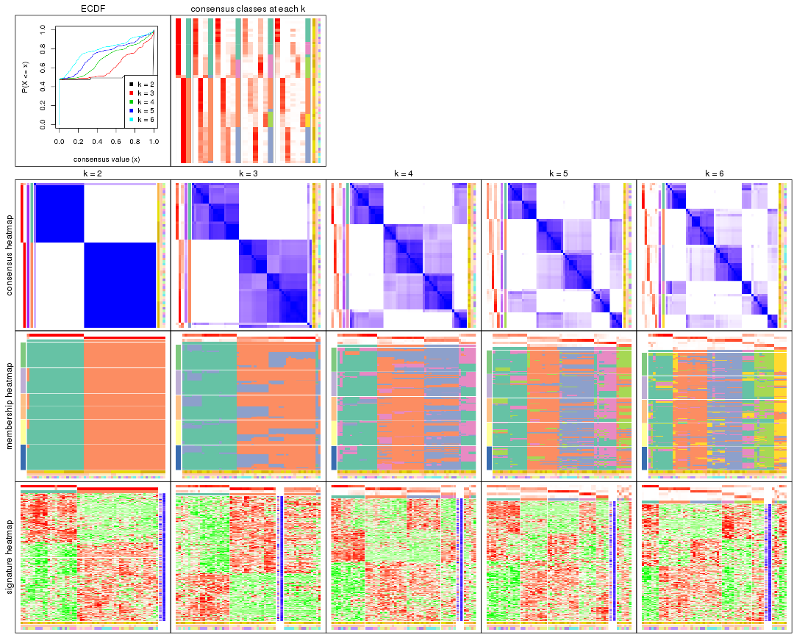

The plots are:

- The first row: a plot of the ECDF (empirical cumulative distribution
  function) curves of the consensus matrix for each `k` and the heatmap of
  predicted classes for each `k`.
- The second row: heatmaps of the consensus matrix for each `k`.
- The third row: heatmaps of the membership matrix for each `k`.
- The fouth row: heatmaps of the signatures for each `k`.

All the plots in panels can be made by individual functions and they are
plotted later in this section.

`select_partition_number()` produces several plots showing different
statistics for choosing "optimized" `k`. There are following statistics:

- ECDF curves of the consensus matrix for each `k`;
- 1-PAC. [The PAC
  score](https://en.wikipedia.org/wiki/Consensus_clustering#Over-interpretation_potential_of_consensus_clustering)
  measures the proportion of the ambiguous subgrouping.
- Mean silhouette score.
- Concordance. The mean probability of fiting the consensus class ids in all
  partitions.
- Area increased. Denote $A_k$ as the area under the ECDF curve for current
  `k`, the area increased is defined as $A_k - A_{k-1}$.
- Rand index. The percent of pairs of samples that are both in a same cluster
  or both are not in a same cluster in the partition of k and k-1.
- Jaccard index. The ratio of pairs of samples are both in a same cluster in
  the partition of k and k-1 and the pairs of samples are both in a same
  cluster in the partition k or k-1.

The detailed explanations of these statistics can be found in [the _cola_
vignette](http://bioconductor.org/packages/devel/bioc/vignettes/cola/inst/doc/cola.html#toc_13).

Generally speaking, lower PAC score, higher mean silhouette score or higher
concordance corresponds to better partition. Rand index and Jaccard index
measure how similar the current partition is compared to partition with `k-1`.
If they are too similar, we won't accept `k` is better than `k-1`.

```r
select_partition_number(res)
```

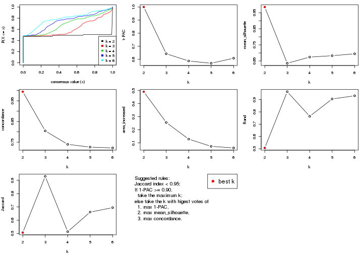

The numeric values for all these statistics can be obtained by `get_stats()`.

```r
get_stats(res)
```

```
#>   k 1-PAC mean_silhouette concordance area_increased  Rand Jaccard
#> 2 2 1.000           0.985       0.994         0.4910 0.507   0.507
#> 3 3 0.643           0.636       0.805         0.2561 0.964   0.930
#> 4 4 0.588           0.674       0.740         0.1291 0.764   0.514
#> 5 5 0.570           0.683       0.726         0.0738 0.905   0.661
#> 6 6 0.609           0.695       0.722         0.0618 0.931   0.695
```

`suggest_best_k()` suggests the best $k$ based on these statistics. The rules are as follows:

- All $k$ with Jaccard index larger than 0.95 are removed because increasing
  $k$ does not provide enough extra information. If all $k$ are removed, it is
  marked as no subgroup is detected.
- For all $k$ with 1-PAC score larger than 0.9, the maximal $k$ is taken as
  the best $k$, and other $k$ are marked as optional $k$.
- If it does not fit the second rule. The $k$ with the maximal vote of the
  highest 1-PAC score, highest mean silhouette, and highest concordance is
  taken as the best $k$.

```r
suggest_best_k(res)
```

```
#> [1] 2
```


Following shows the table of the partitions (You need to click the **show/hide
code output** link to see it). The membership matrix (columns with name `p*`)
is inferred by
[`clue::cl_consensus()`](https://www.rdocumentation.org/link/cl_consensus?package=clue)
function with the `SE` method. Basically the value in the membership matrix
represents the probability to belong to a certain group. The finall class
label for an item is determined with the group with highest probability it
belongs to.

In `get_classes()` function, the entropy is calculated from the membership
matrix and the silhouette score is calculated from the consensus matrix.


<script>
$( function() {
	$( '#tabs-SD-kmeans-get-classes' ).tabs();
} );
</script>
<div id='tabs-SD-kmeans-get-classes'>
<ul>
<li><a href='#tab-SD-kmeans-get-classes-1'>k = 2</a></li>
<li><a href='#tab-SD-kmeans-get-classes-2'>k = 3</a></li>
<li><a href='#tab-SD-kmeans-get-classes-3'>k = 4</a></li>
<li><a href='#tab-SD-kmeans-get-classes-4'>k = 5</a></li>
<li><a href='#tab-SD-kmeans-get-classes-5'>k = 6</a></li>
</ul>

<div id='tab-SD-kmeans-get-classes-1'>
<p><a id='tab-SD-kmeans-get-classes-1-a' style='color:#0366d6' href='#'>show/hide code output</a></p>
<pre><code class="r">cbind(get_classes(res, k = 2), get_membership(res, k = 2))
</code></pre>

<pre><code>#&gt;           class entropy silhouette    p1    p2
#&gt; GSM790742     2   0.000      1.000 0.000 1.000
#&gt; GSM790744     2   0.000      1.000 0.000 1.000
#&gt; GSM790754     2   0.000      1.000 0.000 1.000
#&gt; GSM790756     2   0.000      1.000 0.000 1.000
#&gt; GSM790768     2   0.000      1.000 0.000 1.000
#&gt; GSM790774     2   0.000      1.000 0.000 1.000
#&gt; GSM790778     2   0.000      1.000 0.000 1.000
#&gt; GSM790784     2   0.000      1.000 0.000 1.000
#&gt; GSM790790     2   0.000      1.000 0.000 1.000
#&gt; GSM790743     1   0.000      0.985 1.000 0.000
#&gt; GSM790745     1   0.000      0.985 1.000 0.000
#&gt; GSM790755     2   0.000      1.000 0.000 1.000
#&gt; GSM790757     1   0.000      0.985 1.000 0.000
#&gt; GSM790769     1   0.000      0.985 1.000 0.000
#&gt; GSM790775     1   0.000      0.985 1.000 0.000
#&gt; GSM790779     1   0.000      0.985 1.000 0.000
#&gt; GSM790785     1   0.000      0.985 1.000 0.000
#&gt; GSM790791     1   0.000      0.985 1.000 0.000
#&gt; GSM790738     2   0.000      1.000 0.000 1.000
#&gt; GSM790746     2   0.000      1.000 0.000 1.000
#&gt; GSM790752     2   0.000      1.000 0.000 1.000
#&gt; GSM790758     2   0.000      1.000 0.000 1.000
#&gt; GSM790764     2   0.000      1.000 0.000 1.000
#&gt; GSM790766     2   0.000      1.000 0.000 1.000
#&gt; GSM790772     2   0.000      1.000 0.000 1.000
#&gt; GSM790782     2   0.000      1.000 0.000 1.000
#&gt; GSM790786     2   0.000      1.000 0.000 1.000
#&gt; GSM790792     2   0.000      1.000 0.000 1.000
#&gt; GSM790739     1   0.000      0.985 1.000 0.000
#&gt; GSM790747     1   0.000      0.985 1.000 0.000
#&gt; GSM790753     1   0.000      0.985 1.000 0.000
#&gt; GSM790759     2   0.000      1.000 0.000 1.000
#&gt; GSM790765     2   0.000      1.000 0.000 1.000
#&gt; GSM790767     1   0.000      0.985 1.000 0.000
#&gt; GSM790773     1   0.000      0.985 1.000 0.000
#&gt; GSM790783     1   0.000      0.985 1.000 0.000
#&gt; GSM790787     1   0.000      0.985 1.000 0.000
#&gt; GSM790793     1   0.000      0.985 1.000 0.000
#&gt; GSM790740     2   0.000      1.000 0.000 1.000
#&gt; GSM790748     2   0.000      1.000 0.000 1.000
#&gt; GSM790750     2   0.000      1.000 0.000 1.000
#&gt; GSM790760     2   0.000      1.000 0.000 1.000
#&gt; GSM790762     2   0.000      1.000 0.000 1.000
#&gt; GSM790770     2   0.000      1.000 0.000 1.000
#&gt; GSM790776     2   0.000      1.000 0.000 1.000
#&gt; GSM790780     2   0.000      1.000 0.000 1.000
#&gt; GSM790788     2   0.000      1.000 0.000 1.000
#&gt; GSM790741     2   0.000      1.000 0.000 1.000
#&gt; GSM790749     1   0.000      0.985 1.000 0.000
#&gt; GSM790751     2   0.000      1.000 0.000 1.000
#&gt; GSM790761     1   0.000      0.985 1.000 0.000
#&gt; GSM790763     1   0.000      0.985 1.000 0.000
#&gt; GSM790771     1   0.000      0.985 1.000 0.000
#&gt; GSM790777     1   0.000      0.985 1.000 0.000
#&gt; GSM790781     1   0.917      0.503 0.668 0.332
#&gt; GSM790789     1   0.000      0.985 1.000 0.000
</code></pre>

<script>
$('#tab-SD-kmeans-get-classes-1-a').parent().next().next().hide();
$('#tab-SD-kmeans-get-classes-1-a').click(function(){
  $('#tab-SD-kmeans-get-classes-1-a').parent().next().next().toggle();
  return(false);
});
</script>
</div>

<div id='tab-SD-kmeans-get-classes-2'>
<p><a id='tab-SD-kmeans-get-classes-2-a' style='color:#0366d6' href='#'>show/hide code output</a></p>
<pre><code class="r">cbind(get_classes(res, k = 3), get_membership(res, k = 3))
</code></pre>

<pre><code>#&gt;           class entropy silhouette    p1    p2    p3
#&gt; GSM790742     2  0.4178      0.621 0.000 0.828 0.172
#&gt; GSM790744     2  0.0000      0.699 0.000 1.000 0.000
#&gt; GSM790754     2  0.6267      0.381 0.000 0.548 0.452
#&gt; GSM790756     2  0.6215      0.412 0.000 0.572 0.428
#&gt; GSM790768     2  0.0424      0.699 0.000 0.992 0.008
#&gt; GSM790774     2  0.5859      0.478 0.000 0.656 0.344
#&gt; GSM790778     2  0.5859      0.478 0.000 0.656 0.344
#&gt; GSM790784     2  0.5859      0.478 0.000 0.656 0.344
#&gt; GSM790790     2  0.0424      0.697 0.000 0.992 0.008
#&gt; GSM790743     1  0.5529      0.741 0.704 0.000 0.296
#&gt; GSM790745     1  0.5650      0.749 0.688 0.000 0.312
#&gt; GSM790755     3  0.6079     -0.431 0.000 0.388 0.612
#&gt; GSM790757     1  0.5650      0.749 0.688 0.000 0.312
#&gt; GSM790769     1  0.1163      0.845 0.972 0.000 0.028
#&gt; GSM790775     1  0.2625      0.848 0.916 0.000 0.084
#&gt; GSM790779     1  0.3686      0.819 0.860 0.000 0.140
#&gt; GSM790785     1  0.2625      0.848 0.916 0.000 0.084
#&gt; GSM790791     1  0.4062      0.808 0.836 0.000 0.164
#&gt; GSM790738     2  0.0237      0.700 0.000 0.996 0.004
#&gt; GSM790746     2  0.0000      0.699 0.000 1.000 0.000
#&gt; GSM790752     2  0.6267      0.381 0.000 0.548 0.452
#&gt; GSM790758     2  0.6286      0.361 0.000 0.536 0.464
#&gt; GSM790764     2  0.4555      0.618 0.000 0.800 0.200
#&gt; GSM790766     2  0.0892      0.698 0.000 0.980 0.020
#&gt; GSM790772     2  0.1031      0.699 0.000 0.976 0.024
#&gt; GSM790782     2  0.5859      0.478 0.000 0.656 0.344
#&gt; GSM790786     2  0.5859      0.478 0.000 0.656 0.344
#&gt; GSM790792     2  0.0424      0.697 0.000 0.992 0.008
#&gt; GSM790739     1  0.5650      0.749 0.688 0.000 0.312
#&gt; GSM790747     1  0.1163      0.845 0.972 0.000 0.028
#&gt; GSM790753     1  0.2625      0.848 0.916 0.000 0.084
#&gt; GSM790759     2  0.4062      0.627 0.000 0.836 0.164
#&gt; GSM790765     2  0.6008      0.462 0.000 0.628 0.372
#&gt; GSM790767     1  0.0237      0.850 0.996 0.000 0.004
#&gt; GSM790773     1  0.2625      0.848 0.916 0.000 0.084
#&gt; GSM790783     1  0.2356      0.843 0.928 0.000 0.072
#&gt; GSM790787     1  0.2625      0.848 0.916 0.000 0.084
#&gt; GSM790793     1  0.5465      0.750 0.712 0.000 0.288
#&gt; GSM790740     2  0.0424      0.700 0.000 0.992 0.008
#&gt; GSM790748     2  0.4178      0.621 0.000 0.828 0.172
#&gt; GSM790750     2  0.6267      0.381 0.000 0.548 0.452
#&gt; GSM790760     2  0.4504      0.619 0.000 0.804 0.196
#&gt; GSM790762     2  0.0237      0.698 0.000 0.996 0.004
#&gt; GSM790770     2  0.1964      0.668 0.000 0.944 0.056
#&gt; GSM790776     2  0.4399      0.621 0.000 0.812 0.188
#&gt; GSM790780     2  0.6079      0.434 0.000 0.612 0.388
#&gt; GSM790788     2  0.0424      0.697 0.000 0.992 0.008
#&gt; GSM790741     2  0.0424      0.700 0.000 0.992 0.008
#&gt; GSM790749     1  0.1289      0.845 0.968 0.000 0.032
#&gt; GSM790751     2  0.6267      0.381 0.000 0.548 0.452
#&gt; GSM790761     1  0.5431      0.744 0.716 0.000 0.284
#&gt; GSM790763     1  0.6140      0.695 0.596 0.000 0.404
#&gt; GSM790771     1  0.1289      0.845 0.968 0.000 0.032
#&gt; GSM790777     1  0.2625      0.848 0.916 0.000 0.084
#&gt; GSM790781     3  0.6099     -0.130 0.228 0.032 0.740
#&gt; GSM790789     1  0.1289      0.845 0.968 0.000 0.032
</code></pre>

<script>
$('#tab-SD-kmeans-get-classes-2-a').parent().next().next().hide();
$('#tab-SD-kmeans-get-classes-2-a').click(function(){
  $('#tab-SD-kmeans-get-classes-2-a').parent().next().next().toggle();
  return(false);
});
</script>
</div>

<div id='tab-SD-kmeans-get-classes-3'>
<p><a id='tab-SD-kmeans-get-classes-3-a' style='color:#0366d6' href='#'>show/hide code output</a></p>
<pre><code class="r">cbind(get_classes(res, k = 4), get_membership(res, k = 4))
</code></pre>

<pre><code>#&gt;           class entropy silhouette    p1    p2    p3    p4
#&gt; GSM790742     2  0.6618     0.5632 0.000 0.604 0.124 0.272
#&gt; GSM790744     2  0.1022     0.7658 0.000 0.968 0.032 0.000
#&gt; GSM790754     3  0.5149     0.8695 0.000 0.336 0.648 0.016
#&gt; GSM790756     3  0.6398     0.7971 0.000 0.344 0.576 0.080
#&gt; GSM790768     2  0.1022     0.7640 0.000 0.968 0.032 0.000
#&gt; GSM790774     3  0.4866     0.8577 0.000 0.404 0.596 0.000
#&gt; GSM790778     3  0.4804     0.8699 0.000 0.384 0.616 0.000
#&gt; GSM790784     3  0.4817     0.8685 0.000 0.388 0.612 0.000
#&gt; GSM790790     2  0.1489     0.7642 0.000 0.952 0.004 0.044
#&gt; GSM790743     4  0.6201     0.5581 0.376 0.000 0.060 0.564
#&gt; GSM790745     4  0.5295     0.6947 0.488 0.000 0.008 0.504
#&gt; GSM790755     3  0.5265     0.6354 0.000 0.160 0.748 0.092
#&gt; GSM790757     4  0.5295     0.6947 0.488 0.000 0.008 0.504
#&gt; GSM790769     1  0.5375     0.6572 0.744 0.000 0.116 0.140
#&gt; GSM790775     1  0.0000     0.7020 1.000 0.000 0.000 0.000
#&gt; GSM790779     1  0.1629     0.6572 0.952 0.000 0.024 0.024
#&gt; GSM790785     1  0.0000     0.7020 1.000 0.000 0.000 0.000
#&gt; GSM790791     1  0.5673    -0.0819 0.596 0.000 0.032 0.372
#&gt; GSM790738     2  0.1584     0.7652 0.000 0.952 0.036 0.012
#&gt; GSM790746     2  0.1388     0.7690 0.000 0.960 0.028 0.012
#&gt; GSM790752     3  0.5847     0.8428 0.000 0.320 0.628 0.052
#&gt; GSM790758     3  0.5972     0.8129 0.000 0.292 0.640 0.068
#&gt; GSM790764     2  0.7155     0.4821 0.000 0.540 0.168 0.292
#&gt; GSM790766     2  0.1792     0.7351 0.000 0.932 0.068 0.000
#&gt; GSM790772     2  0.2412     0.7175 0.000 0.908 0.084 0.008
#&gt; GSM790782     3  0.4817     0.8685 0.000 0.388 0.612 0.000
#&gt; GSM790786     3  0.4817     0.8685 0.000 0.388 0.612 0.000
#&gt; GSM790792     2  0.1489     0.7642 0.000 0.952 0.004 0.044
#&gt; GSM790739     4  0.5295     0.6947 0.488 0.000 0.008 0.504
#&gt; GSM790747     1  0.5375     0.6572 0.744 0.000 0.116 0.140
#&gt; GSM790753     1  0.0469     0.6947 0.988 0.000 0.012 0.000
#&gt; GSM790759     2  0.5507     0.6487 0.000 0.732 0.112 0.156
#&gt; GSM790765     3  0.4790     0.8724 0.000 0.380 0.620 0.000
#&gt; GSM790767     1  0.4635     0.6562 0.796 0.000 0.080 0.124
#&gt; GSM790773     1  0.0000     0.7020 1.000 0.000 0.000 0.000
#&gt; GSM790783     1  0.3601     0.6859 0.860 0.000 0.056 0.084
#&gt; GSM790787     1  0.0469     0.6947 0.988 0.000 0.012 0.000
#&gt; GSM790793     4  0.4977     0.6877 0.460 0.000 0.000 0.540
#&gt; GSM790740     2  0.1677     0.7626 0.000 0.948 0.040 0.012
#&gt; GSM790748     2  0.6641     0.5595 0.000 0.600 0.124 0.276
#&gt; GSM790750     3  0.5847     0.8428 0.000 0.320 0.628 0.052
#&gt; GSM790760     2  0.7166     0.4766 0.000 0.544 0.176 0.280
#&gt; GSM790762     2  0.1913     0.7627 0.000 0.940 0.020 0.040
#&gt; GSM790770     2  0.2670     0.7455 0.000 0.904 0.024 0.072
#&gt; GSM790776     2  0.6934     0.5279 0.000 0.572 0.152 0.276
#&gt; GSM790780     3  0.4781     0.8558 0.000 0.336 0.660 0.004
#&gt; GSM790788     2  0.1398     0.7645 0.000 0.956 0.004 0.040
#&gt; GSM790741     2  0.1677     0.7626 0.000 0.948 0.040 0.012
#&gt; GSM790749     1  0.5690     0.6369 0.716 0.000 0.116 0.168
#&gt; GSM790751     3  0.5149     0.8695 0.000 0.336 0.648 0.016
#&gt; GSM790761     4  0.6139     0.6095 0.404 0.000 0.052 0.544
#&gt; GSM790763     1  0.5685    -0.6278 0.516 0.000 0.024 0.460
#&gt; GSM790771     1  0.5690     0.6369 0.716 0.000 0.116 0.168
#&gt; GSM790777     1  0.0000     0.7020 1.000 0.000 0.000 0.000
#&gt; GSM790781     4  0.7847     0.2756 0.192 0.008 0.384 0.416
#&gt; GSM790789     1  0.5772     0.6286 0.708 0.000 0.116 0.176
</code></pre>

<script>
$('#tab-SD-kmeans-get-classes-3-a').parent().next().next().hide();
$('#tab-SD-kmeans-get-classes-3-a').click(function(){
  $('#tab-SD-kmeans-get-classes-3-a').parent().next().next().toggle();
  return(false);
});
</script>
</div>

<div id='tab-SD-kmeans-get-classes-4'>
<p><a id='tab-SD-kmeans-get-classes-4-a' style='color:#0366d6' href='#'>show/hide code output</a></p>
<pre><code class="r">cbind(get_classes(res, k = 5), get_membership(res, k = 5))
</code></pre>

<pre><code>#&gt;           class entropy silhouette    p1    p2    p3    p4    p5
#&gt; GSM790742     5  0.3944     0.7996 0.000 0.052 0.160 0.000 0.788
#&gt; GSM790744     2  0.6701     0.8275 0.004 0.468 0.288 0.000 0.240
#&gt; GSM790754     3  0.2943     0.8067 0.052 0.008 0.880 0.000 0.060
#&gt; GSM790756     3  0.3099     0.7693 0.012 0.008 0.848 0.000 0.132
#&gt; GSM790768     2  0.6417     0.8266 0.000 0.504 0.280 0.000 0.216
#&gt; GSM790774     3  0.1202     0.8046 0.004 0.032 0.960 0.000 0.004
#&gt; GSM790778     3  0.0833     0.8170 0.004 0.016 0.976 0.000 0.004
#&gt; GSM790784     3  0.0771     0.8157 0.004 0.020 0.976 0.000 0.000
#&gt; GSM790790     2  0.6886     0.7787 0.036 0.540 0.232 0.000 0.192
#&gt; GSM790743     4  0.5516     0.5968 0.120 0.104 0.000 0.720 0.056
#&gt; GSM790745     4  0.0451     0.7411 0.000 0.008 0.000 0.988 0.004
#&gt; GSM790755     3  0.7070     0.4612 0.172 0.084 0.568 0.000 0.176
#&gt; GSM790757     4  0.0451     0.7411 0.000 0.008 0.000 0.988 0.004
#&gt; GSM790769     1  0.6581     0.6427 0.520 0.220 0.000 0.252 0.008
#&gt; GSM790775     1  0.4030     0.7000 0.648 0.000 0.000 0.352 0.000
#&gt; GSM790779     1  0.5412     0.5753 0.604 0.032 0.000 0.340 0.024
#&gt; GSM790785     1  0.4030     0.7000 0.648 0.000 0.000 0.352 0.000
#&gt; GSM790791     4  0.5958     0.1302 0.256 0.104 0.000 0.620 0.020
#&gt; GSM790738     2  0.6810     0.8134 0.004 0.436 0.296 0.000 0.264
#&gt; GSM790746     2  0.6897     0.8153 0.008 0.440 0.288 0.000 0.264
#&gt; GSM790752     3  0.3372     0.7960 0.052 0.008 0.852 0.000 0.088
#&gt; GSM790758     3  0.2964     0.7853 0.024 0.000 0.856 0.000 0.120
#&gt; GSM790764     5  0.4384     0.7827 0.020 0.032 0.184 0.000 0.764
#&gt; GSM790766     2  0.6497     0.8018 0.000 0.472 0.320 0.000 0.208
#&gt; GSM790772     3  0.6588    -0.7125 0.004 0.380 0.436 0.000 0.180
#&gt; GSM790782     3  0.0932     0.8158 0.004 0.020 0.972 0.000 0.004
#&gt; GSM790786     3  0.0771     0.8157 0.004 0.020 0.976 0.000 0.000
#&gt; GSM790792     2  0.6886     0.7787 0.036 0.540 0.232 0.000 0.192
#&gt; GSM790739     4  0.0324     0.7406 0.000 0.004 0.000 0.992 0.004
#&gt; GSM790747     1  0.6365     0.6426 0.520 0.228 0.000 0.252 0.000
#&gt; GSM790753     1  0.4893     0.6743 0.612 0.012 0.000 0.360 0.016
#&gt; GSM790759     5  0.6278     0.0513 0.004 0.284 0.168 0.000 0.544
#&gt; GSM790765     3  0.2095     0.8162 0.028 0.020 0.928 0.000 0.024
#&gt; GSM790767     1  0.6535     0.6493 0.496 0.168 0.000 0.328 0.008
#&gt; GSM790773     1  0.4030     0.7000 0.648 0.000 0.000 0.352 0.000
#&gt; GSM790783     1  0.5037     0.6844 0.684 0.088 0.000 0.228 0.000
#&gt; GSM790787     1  0.4893     0.6743 0.612 0.012 0.000 0.360 0.016
#&gt; GSM790793     4  0.1710     0.7310 0.024 0.012 0.000 0.944 0.020
#&gt; GSM790740     2  0.6806     0.8119 0.004 0.436 0.300 0.000 0.260
#&gt; GSM790748     5  0.3804     0.8084 0.000 0.044 0.160 0.000 0.796
#&gt; GSM790750     3  0.3372     0.7960 0.052 0.008 0.852 0.000 0.088
#&gt; GSM790760     5  0.3300     0.7978 0.004 0.000 0.204 0.000 0.792
#&gt; GSM790762     2  0.6874     0.7856 0.036 0.540 0.240 0.000 0.184
#&gt; GSM790770     2  0.6475     0.4921 0.000 0.428 0.184 0.000 0.388
#&gt; GSM790776     5  0.3562     0.8184 0.000 0.016 0.196 0.000 0.788
#&gt; GSM790780     3  0.1757     0.8027 0.012 0.004 0.936 0.000 0.048
#&gt; GSM790788     2  0.6874     0.7856 0.036 0.540 0.240 0.000 0.184
#&gt; GSM790741     2  0.6806     0.8119 0.004 0.436 0.300 0.000 0.260
#&gt; GSM790749     1  0.6417     0.6329 0.508 0.228 0.000 0.264 0.000
#&gt; GSM790751     3  0.3247     0.8025 0.052 0.012 0.864 0.000 0.072
#&gt; GSM790761     4  0.5129     0.6301 0.092 0.100 0.000 0.752 0.056
#&gt; GSM790763     4  0.3812     0.6668 0.064 0.052 0.000 0.840 0.044
#&gt; GSM790771     1  0.6632     0.6328 0.508 0.220 0.000 0.264 0.008
#&gt; GSM790777     1  0.4030     0.7000 0.648 0.000 0.000 0.352 0.000
#&gt; GSM790781     4  0.7739     0.4493 0.148 0.060 0.156 0.568 0.068
#&gt; GSM790789     1  0.6858     0.6150 0.492 0.228 0.000 0.264 0.016
</code></pre>

<script>
$('#tab-SD-kmeans-get-classes-4-a').parent().next().next().hide();
$('#tab-SD-kmeans-get-classes-4-a').click(function(){
  $('#tab-SD-kmeans-get-classes-4-a').parent().next().next().toggle();
  return(false);
});
</script>
</div>

<div id='tab-SD-kmeans-get-classes-5'>
<p><a id='tab-SD-kmeans-get-classes-5-a' style='color:#0366d6' href='#'>show/hide code output</a></p>
<pre><code class="r">cbind(get_classes(res, k = 6), get_membership(res, k = 6))
</code></pre>

<pre><code>#&gt;           class entropy silhouette    p1    p2    p3    p4    p5    p6
#&gt; GSM790742     6  0.5071      0.847 0.000 0.304 0.032 0.016 0.020 0.628
#&gt; GSM790744     2  0.1793      0.781 0.000 0.932 0.040 0.008 0.004 0.016
#&gt; GSM790754     3  0.5113      0.797 0.000 0.080 0.728 0.108 0.012 0.072
#&gt; GSM790756     3  0.5669      0.721 0.000 0.104 0.656 0.028 0.024 0.188
#&gt; GSM790768     2  0.1605      0.778 0.000 0.940 0.032 0.016 0.012 0.000
#&gt; GSM790774     3  0.2584      0.819 0.000 0.144 0.848 0.004 0.004 0.000
#&gt; GSM790778     3  0.2420      0.827 0.000 0.128 0.864 0.004 0.004 0.000
#&gt; GSM790784     3  0.2320      0.827 0.000 0.132 0.864 0.000 0.004 0.000
#&gt; GSM790790     2  0.3283      0.722 0.000 0.828 0.004 0.132 0.024 0.012
#&gt; GSM790743     5  0.6637      0.649 0.132 0.000 0.020 0.172 0.580 0.096
#&gt; GSM790745     5  0.2854      0.800 0.208 0.000 0.000 0.000 0.792 0.000
#&gt; GSM790755     3  0.7206      0.384 0.000 0.016 0.488 0.220 0.112 0.164
#&gt; GSM790757     5  0.2854      0.800 0.208 0.000 0.000 0.000 0.792 0.000
#&gt; GSM790769     4  0.4396      0.939 0.456 0.000 0.000 0.520 0.024 0.000
#&gt; GSM790775     1  0.0000      0.719 1.000 0.000 0.000 0.000 0.000 0.000
#&gt; GSM790779     1  0.2295      0.640 0.912 0.000 0.008 0.032 0.028 0.020
#&gt; GSM790785     1  0.0000      0.719 1.000 0.000 0.000 0.000 0.000 0.000
#&gt; GSM790791     1  0.6840     -0.237 0.384 0.000 0.000 0.188 0.364 0.064
#&gt; GSM790738     2  0.2489      0.775 0.000 0.900 0.052 0.012 0.016 0.020
#&gt; GSM790746     2  0.3042      0.769 0.000 0.876 0.040 0.028 0.028 0.028
#&gt; GSM790752     3  0.5512      0.776 0.000 0.072 0.692 0.108 0.012 0.116
#&gt; GSM790758     3  0.5095      0.745 0.000 0.064 0.704 0.028 0.020 0.184
#&gt; GSM790764     6  0.4757      0.861 0.000 0.228 0.060 0.008 0.012 0.692
#&gt; GSM790766     2  0.2655      0.752 0.000 0.872 0.096 0.020 0.012 0.000
#&gt; GSM790772     2  0.3806      0.572 0.000 0.724 0.256 0.008 0.008 0.004
#&gt; GSM790782     3  0.2573      0.825 0.000 0.132 0.856 0.004 0.008 0.000
#&gt; GSM790786     3  0.2320      0.827 0.000 0.132 0.864 0.000 0.004 0.000
#&gt; GSM790792     2  0.3283      0.722 0.000 0.828 0.004 0.132 0.024 0.012
#&gt; GSM790739     5  0.2854      0.800 0.208 0.000 0.000 0.000 0.792 0.000
#&gt; GSM790747     4  0.4527      0.938 0.456 0.000 0.000 0.516 0.024 0.004
#&gt; GSM790753     1  0.0458      0.715 0.984 0.000 0.000 0.000 0.000 0.016
#&gt; GSM790759     2  0.5117     -0.164 0.000 0.572 0.032 0.016 0.012 0.368
#&gt; GSM790765     3  0.2820      0.826 0.000 0.112 0.860 0.008 0.008 0.012
#&gt; GSM790767     1  0.4610     -0.650 0.568 0.000 0.000 0.388 0.044 0.000
#&gt; GSM790773     1  0.0000      0.719 1.000 0.000 0.000 0.000 0.000 0.000
#&gt; GSM790783     1  0.3298      0.146 0.756 0.000 0.000 0.236 0.000 0.008
#&gt; GSM790787     1  0.0603      0.713 0.980 0.000 0.000 0.004 0.000 0.016
#&gt; GSM790793     5  0.4836      0.776 0.212 0.000 0.000 0.028 0.692 0.068
#&gt; GSM790740     2  0.2552      0.774 0.000 0.896 0.056 0.012 0.016 0.020
#&gt; GSM790748     6  0.5055      0.853 0.000 0.300 0.032 0.016 0.020 0.632
#&gt; GSM790750     3  0.5512      0.776 0.000 0.072 0.692 0.108 0.012 0.116
#&gt; GSM790760     6  0.4228      0.882 0.000 0.212 0.072 0.000 0.000 0.716
#&gt; GSM790762     2  0.3393      0.727 0.000 0.824 0.012 0.132 0.024 0.008
#&gt; GSM790770     2  0.3855      0.523 0.000 0.760 0.008 0.016 0.012 0.204
#&gt; GSM790776     6  0.4253      0.892 0.000 0.232 0.064 0.000 0.000 0.704
#&gt; GSM790780     3  0.2660      0.819 0.000 0.100 0.872 0.008 0.004 0.016
#&gt; GSM790788     2  0.3184      0.724 0.000 0.832 0.004 0.132 0.024 0.008
#&gt; GSM790741     2  0.2552      0.774 0.000 0.896 0.056 0.012 0.016 0.020
#&gt; GSM790749     4  0.4816      0.948 0.436 0.000 0.000 0.516 0.044 0.004
#&gt; GSM790751     3  0.5397      0.788 0.000 0.092 0.704 0.112 0.012 0.080
#&gt; GSM790761     5  0.6559      0.686 0.152 0.000 0.020 0.140 0.592 0.096
#&gt; GSM790763     5  0.6104      0.711 0.224 0.000 0.012 0.052 0.600 0.112
#&gt; GSM790771     4  0.4685      0.947 0.436 0.000 0.000 0.520 0.044 0.000
#&gt; GSM790777     1  0.0000      0.719 1.000 0.000 0.000 0.000 0.000 0.000
#&gt; GSM790781     5  0.6963      0.495 0.100 0.000 0.216 0.060 0.552 0.072
#&gt; GSM790789     4  0.5403      0.888 0.420 0.000 0.000 0.500 0.044 0.036
</code></pre>

<script>
$('#tab-SD-kmeans-get-classes-5-a').parent().next().next().hide();
$('#tab-SD-kmeans-get-classes-5-a').click(function(){
  $('#tab-SD-kmeans-get-classes-5-a').parent().next().next().toggle();
  return(false);
});
</script>
</div>
</div>

Heatmaps for the consensus matrix. It visualizes the probability of two
samples to be in a same group.


<script>
$( function() {
	$( '#tabs-SD-kmeans-consensus-heatmap' ).tabs();
} );
</script>
<div id='tabs-SD-kmeans-consensus-heatmap'>
<ul>
<li><a href='#tab-SD-kmeans-consensus-heatmap-1'>k = 2</a></li>
<li><a href='#tab-SD-kmeans-consensus-heatmap-2'>k = 3</a></li>
<li><a href='#tab-SD-kmeans-consensus-heatmap-3'>k = 4</a></li>
<li><a href='#tab-SD-kmeans-consensus-heatmap-4'>k = 5</a></li>
<li><a href='#tab-SD-kmeans-consensus-heatmap-5'>k = 6</a></li>
</ul>
<div id='tab-SD-kmeans-consensus-heatmap-1'>
<pre><code class="r">consensus_heatmap(res, k = 2)
</code></pre>

<p>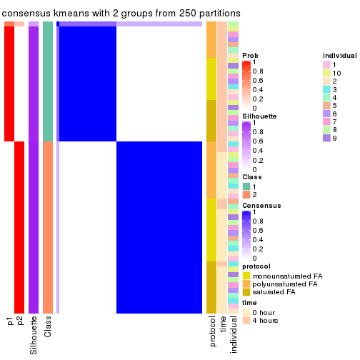</p>

</div>
<div id='tab-SD-kmeans-consensus-heatmap-2'>
<pre><code class="r">consensus_heatmap(res, k = 3)
</code></pre>

<p>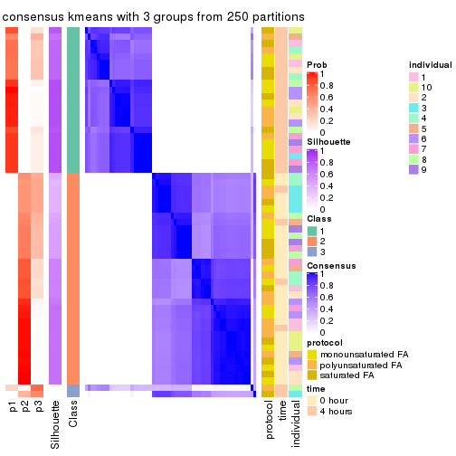</p>

</div>
<div id='tab-SD-kmeans-consensus-heatmap-3'>
<pre><code class="r">consensus_heatmap(res, k = 4)
</code></pre>

<p>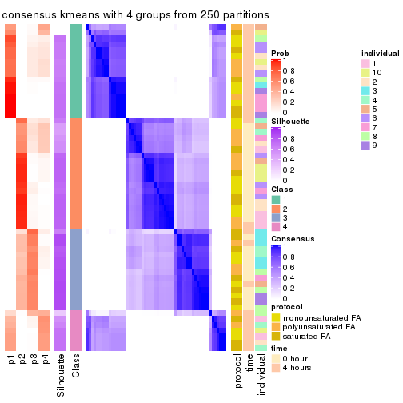</p>

</div>
<div id='tab-SD-kmeans-consensus-heatmap-4'>
<pre><code class="r">consensus_heatmap(res, k = 5)
</code></pre>

<p>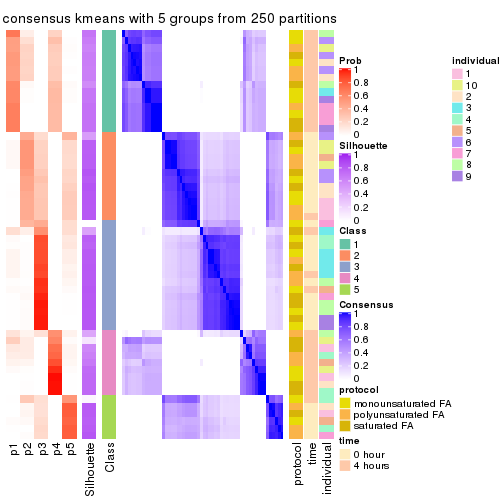</p>

</div>
<div id='tab-SD-kmeans-consensus-heatmap-5'>
<pre><code class="r">consensus_heatmap(res, k = 6)
</code></pre>

<p>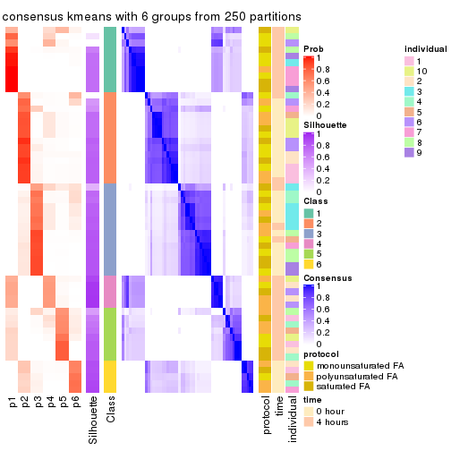</p>

</div>
</div>

Heatmaps for the membership of samples in all partitions to see how consistent they are:


<script>
$( function() {
	$( '#tabs-SD-kmeans-membership-heatmap' ).tabs();
} );
</script>
<div id='tabs-SD-kmeans-membership-heatmap'>
<ul>
<li><a href='#tab-SD-kmeans-membership-heatmap-1'>k = 2</a></li>
<li><a href='#tab-SD-kmeans-membership-heatmap-2'>k = 3</a></li>
<li><a href='#tab-SD-kmeans-membership-heatmap-3'>k = 4</a></li>
<li><a href='#tab-SD-kmeans-membership-heatmap-4'>k = 5</a></li>
<li><a href='#tab-SD-kmeans-membership-heatmap-5'>k = 6</a></li>
</ul>
<div id='tab-SD-kmeans-membership-heatmap-1'>
<pre><code class="r">membership_heatmap(res, k = 2)
</code></pre>

<p>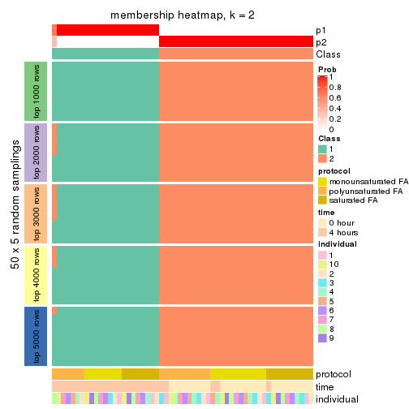</p>

</div>
<div id='tab-SD-kmeans-membership-heatmap-2'>
<pre><code class="r">membership_heatmap(res, k = 3)
</code></pre>

<p>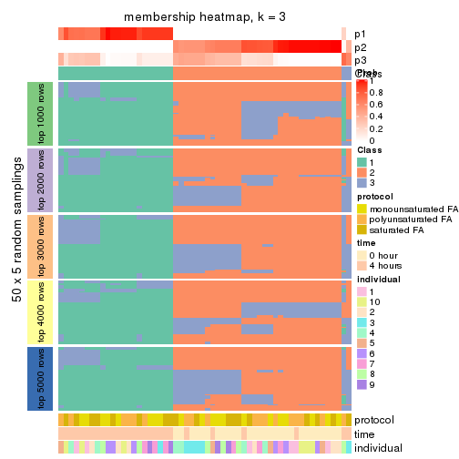</p>

</div>
<div id='tab-SD-kmeans-membership-heatmap-3'>
<pre><code class="r">membership_heatmap(res, k = 4)
</code></pre>

<p>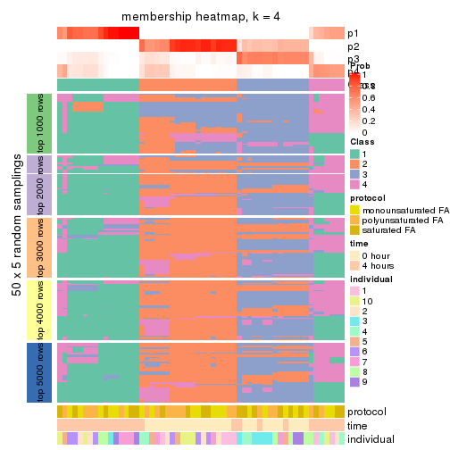</p>

</div>
<div id='tab-SD-kmeans-membership-heatmap-4'>
<pre><code class="r">membership_heatmap(res, k = 5)
</code></pre>

<p>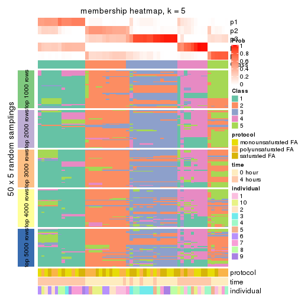</p>

</div>
<div id='tab-SD-kmeans-membership-heatmap-5'>
<pre><code class="r">membership_heatmap(res, k = 6)
</code></pre>

<p>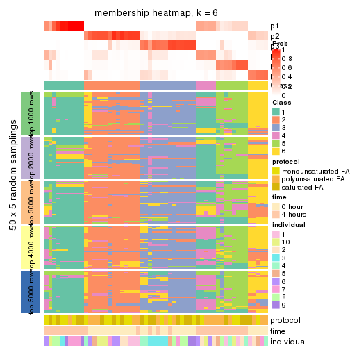</p>

</div>
</div>

As soon as we have had the classes for columns, we can look for signatures
which are significantly different between classes which can be candidate marks
for certain classes. Following are the heatmaps for signatures.


Signature heatmaps where rows are scaled:


<script>
$( function() {
	$( '#tabs-SD-kmeans-get-signatures' ).tabs();
} );
</script>
<div id='tabs-SD-kmeans-get-signatures'>
<ul>
<li><a href='#tab-SD-kmeans-get-signatures-1'>k = 2</a></li>
<li><a href='#tab-SD-kmeans-get-signatures-2'>k = 3</a></li>
<li><a href='#tab-SD-kmeans-get-signatures-3'>k = 4</a></li>
<li><a href='#tab-SD-kmeans-get-signatures-4'>k = 5</a></li>
<li><a href='#tab-SD-kmeans-get-signatures-5'>k = 6</a></li>
</ul>
<div id='tab-SD-kmeans-get-signatures-1'>
<pre><code class="r">get_signatures(res, k = 2)
</code></pre>

<p>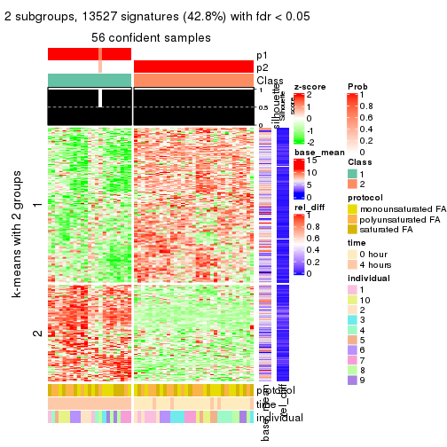</p>

</div>
<div id='tab-SD-kmeans-get-signatures-2'>
<pre><code class="r">get_signatures(res, k = 3)
</code></pre>

<p>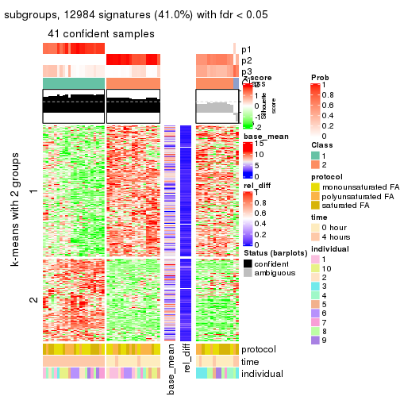</p>

</div>
<div id='tab-SD-kmeans-get-signatures-3'>
<pre><code class="r">get_signatures(res, k = 4)
</code></pre>

<p>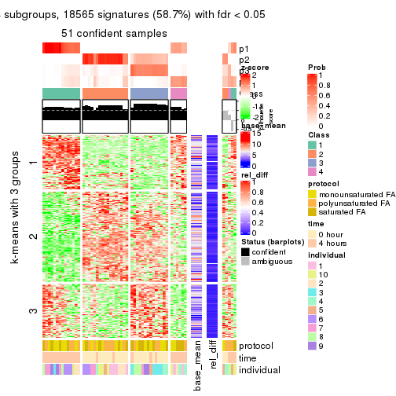</p>

</div>
<div id='tab-SD-kmeans-get-signatures-4'>
<pre><code class="r">get_signatures(res, k = 5)
</code></pre>

<p>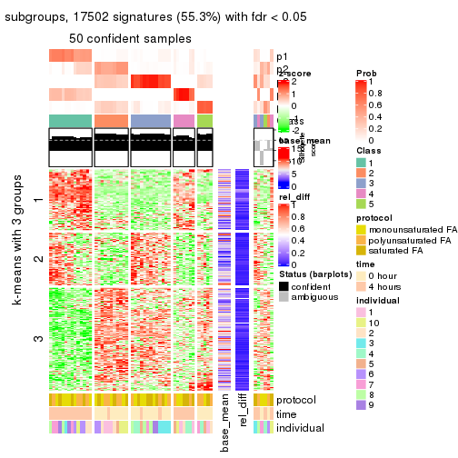</p>

</div>
<div id='tab-SD-kmeans-get-signatures-5'>
<pre><code class="r">get_signatures(res, k = 6)
</code></pre>

<p>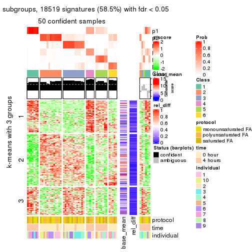</p>

</div>
</div>


Signature heatmaps where rows are not scaled:


<script>
$( function() {
	$( '#tabs-SD-kmeans-get-signatures-no-scale' ).tabs();
} );
</script>
<div id='tabs-SD-kmeans-get-signatures-no-scale'>
<ul>
<li><a href='#tab-SD-kmeans-get-signatures-no-scale-1'>k = 2</a></li>
<li><a href='#tab-SD-kmeans-get-signatures-no-scale-2'>k = 3</a></li>
<li><a href='#tab-SD-kmeans-get-signatures-no-scale-3'>k = 4</a></li>
<li><a href='#tab-SD-kmeans-get-signatures-no-scale-4'>k = 5</a></li>
<li><a href='#tab-SD-kmeans-get-signatures-no-scale-5'>k = 6</a></li>
</ul>
<div id='tab-SD-kmeans-get-signatures-no-scale-1'>
<pre><code class="r">get_signatures(res, k = 2, scale_rows = FALSE)
</code></pre>

<p>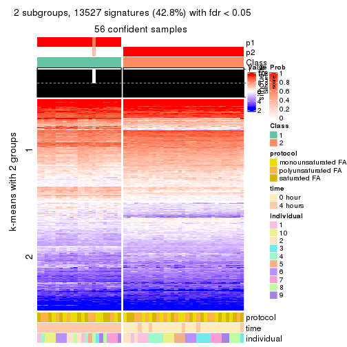</p>

</div>
<div id='tab-SD-kmeans-get-signatures-no-scale-2'>
<pre><code class="r">get_signatures(res, k = 3, scale_rows = FALSE)
</code></pre>

<p>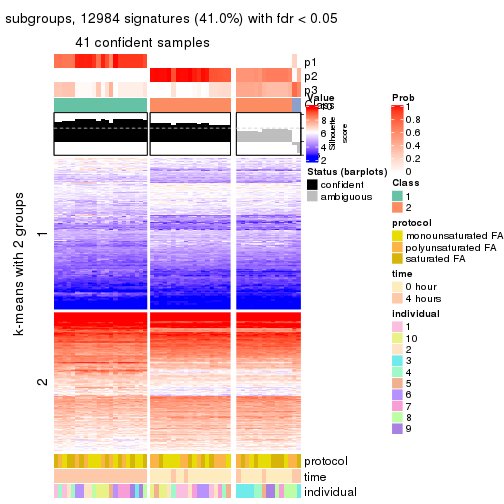</p>

</div>
<div id='tab-SD-kmeans-get-signatures-no-scale-3'>
<pre><code class="r">get_signatures(res, k = 4, scale_rows = FALSE)
</code></pre>

<p>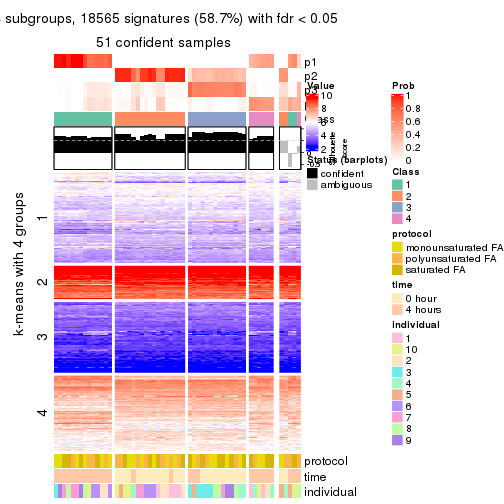</p>

</div>
<div id='tab-SD-kmeans-get-signatures-no-scale-4'>
<pre><code class="r">get_signatures(res, k = 5, scale_rows = FALSE)
</code></pre>

<p>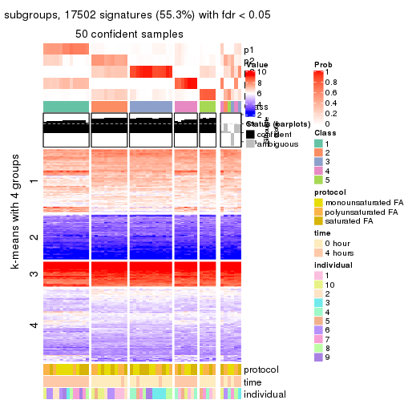</p>

</div>
<div id='tab-SD-kmeans-get-signatures-no-scale-5'>
<pre><code class="r">get_signatures(res, k = 6, scale_rows = FALSE)
</code></pre>

<p>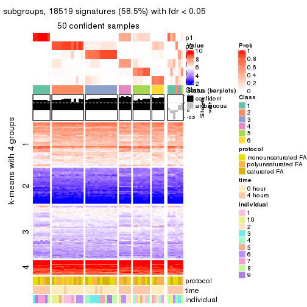</p>

</div>
</div>


Compare the overlap of signatures from different k:

```r
compare_signatures(res)
```

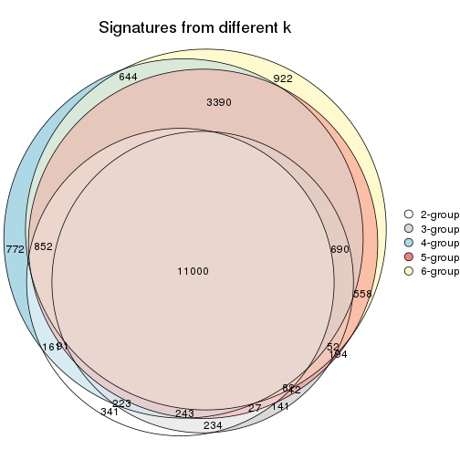

`get_signature()` returns a data frame invisibly. TO get the list of signatures, the function
call should be assigned to a variable explicitly. In following code, if `plot` argument is set
to `FALSE`, no heatmap is plotted while only the differential analysis is performed.

```r
# code only for demonstration
tb = get_signature(res, k = ..., plot = FALSE)
```

An example of the output of `tb` is:

```
#>   which_row         fdr    mean_1    mean_2 scaled_mean_1 scaled_mean_2 km
#> 1        38 0.042760348  8.373488  9.131774    -0.5533452     0.5164555  1
#> 2        40 0.018707592  7.106213  8.469186    -0.6173731     0.5762149  1
#> 3        55 0.019134737 10.221463 11.207825    -0.6159697     0.5749050  1
#> 4        59 0.006059896  5.921854  7.869574    -0.6899429     0.6439467  1
#> 5        60 0.018055526  8.928898 10.211722    -0.6204761     0.5791110  1
#> 6        98 0.009384629 15.714769 14.887706     0.6635654    -0.6193277  2
...
```

The columns in `tb` are:

1. `which_row`: row indices corresponding to the input matrix.
2. `fdr`: FDR for the differential test. 
3. `mean_x`: The mean value in group x.
4. `scaled_mean_x`: The mean value in group x after rows are scaled.
5. `km`: Row groups if k-means clustering is applied to rows.


UMAP plot which shows how samples are separated.


<script>
$( function() {
	$( '#tabs-SD-kmeans-dimension-reduction' ).tabs();
} );
</script>
<div id='tabs-SD-kmeans-dimension-reduction'>
<ul>
<li><a href='#tab-SD-kmeans-dimension-reduction-1'>k = 2</a></li>
<li><a href='#tab-SD-kmeans-dimension-reduction-2'>k = 3</a></li>
<li><a href='#tab-SD-kmeans-dimension-reduction-3'>k = 4</a></li>
<li><a href='#tab-SD-kmeans-dimension-reduction-4'>k = 5</a></li>
<li><a href='#tab-SD-kmeans-dimension-reduction-5'>k = 6</a></li>
</ul>
<div id='tab-SD-kmeans-dimension-reduction-1'>
<pre><code class="r">dimension_reduction(res, k = 2, method = &quot;UMAP&quot;)
</code></pre>

<p>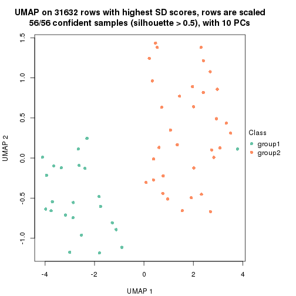</p>

</div>
<div id='tab-SD-kmeans-dimension-reduction-2'>
<pre><code class="r">dimension_reduction(res, k = 3, method = &quot;UMAP&quot;)
</code></pre>

<p>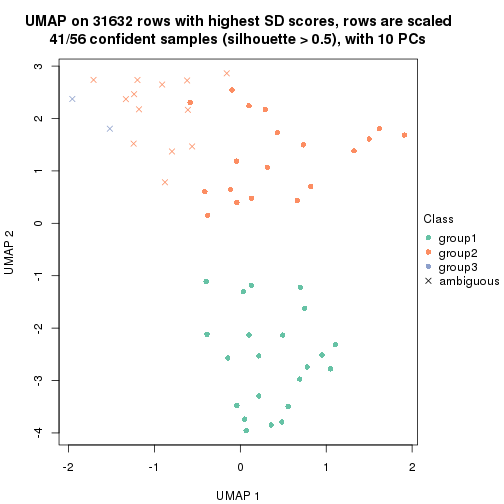</p>

</div>
<div id='tab-SD-kmeans-dimension-reduction-3'>
<pre><code class="r">dimension_reduction(res, k = 4, method = &quot;UMAP&quot;)
</code></pre>

<p>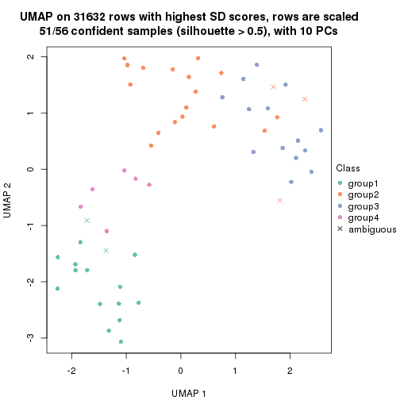</p>

</div>
<div id='tab-SD-kmeans-dimension-reduction-4'>
<pre><code class="r">dimension_reduction(res, k = 5, method = &quot;UMAP&quot;)
</code></pre>

<p>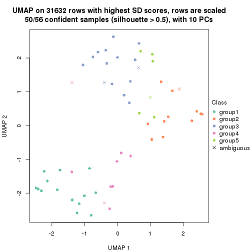</p>

</div>
<div id='tab-SD-kmeans-dimension-reduction-5'>
<pre><code class="r">dimension_reduction(res, k = 6, method = &quot;UMAP&quot;)
</code></pre>

<p>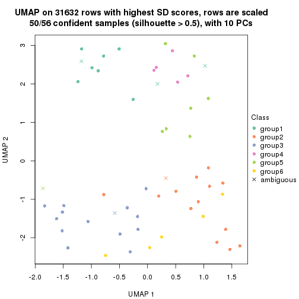</p>

</div>
</div>


Following heatmap shows how subgroups are split when increasing `k`:

```r
collect_classes(res)
```

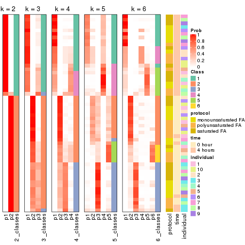


Test correlation between subgroups and known annotations. If the known
annotation is numeric, one-way ANOVA test is applied, and if the known
annotation is discrete, chi-squared contingency table test is applied.

```r
test_to_known_factors(res)
```

```
#>            n protocol(p)  time(p) individual(p) k
#> SD:kmeans 56       0.937 2.29e-09        0.9502 2
#> SD:kmeans 41       0.479 4.23e-08        0.7386 3
#> SD:kmeans 51       0.800 1.55e-07        0.0258 4
#> SD:kmeans 50       0.925 5.29e-08        0.0797 5
#> SD:kmeans 50       0.833 1.99e-07        0.0251 6
```


If matrix rows can be associated to genes, consider to use `functional_enrichment(res,
...)` to perform function enrichment for the signature genes. See [this vignette](http://bioconductor.org/packages/devel/bioc/vignettes/cola/inst/doc/functional_enrichment.html) for more detailed explanations.


 

---------------------------------------------------


### SD:skmeans**


The object with results only for a single top-value method and a single partition method 
can be extracted as:

```r
res = res_list["SD", "skmeans"]
# you can also extract it by
# res = res_list["SD:skmeans"]
```

A summary of `res` and all the functions that can be applied to it:

```r
res
```

```
#> A 'ConsensusPartition' object with k = 2, 3, 4, 5, 6.
#>   On a matrix with 31632 rows and 56 columns.
#>   Top rows (1000, 2000, 3000, 4000, 5000) are extracted by 'SD' method.
#>   Subgroups are detected by 'skmeans' method.
#>   Performed in total 1250 partitions by row resampling.
#>   Best k for subgroups seems to be 2.
#> 
#> Following methods can be applied to this 'ConsensusPartition' object:
#>  [1] "cola_report"             "collect_classes"         "collect_plots"          
#>  [4] "collect_stats"           "colnames"                "compare_signatures"     
#>  [7] "consensus_heatmap"       "dimension_reduction"     "functional_enrichment"  
#> [10] "get_anno_col"            "get_anno"                "get_classes"            
#> [13] "get_consensus"           "get_matrix"              "get_membership"         
#> [16] "get_param"               "get_signatures"          "get_stats"              
#> [19] "is_best_k"               "is_stable_k"             "membership_heatmap"     
#> [22] "ncol"                    "nrow"                    "plot_ecdf"              
#> [25] "rownames"                "select_partition_number" "show"                   
#> [28] "suggest_best_k"          "test_to_known_factors"
```

`collect_plots()` function collects all the plots made from `res` for all `k` (number of partitions)
into one single page to provide an easy and fast comparison between different `k`.

```r
collect_plots(res)
```

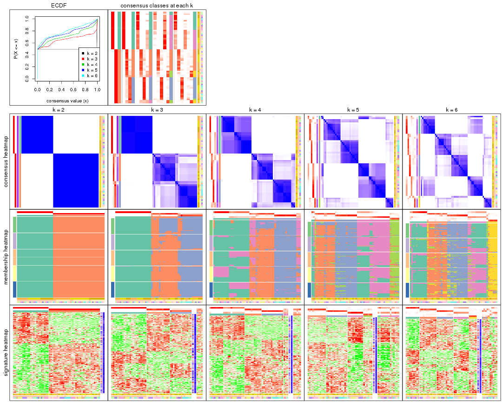

The plots are:

- The first row: a plot of the ECDF (empirical cumulative distribution
  function) curves of the consensus matrix for each `k` and the heatmap of
  predicted classes for each `k`.
- The second row: heatmaps of the consensus matrix for each `k`.
- The third row: heatmaps of the membership matrix for each `k`.
- The fouth row: heatmaps of the signatures for each `k`.

All the plots in panels can be made by individual functions and they are
plotted later in this section.

`select_partition_number()` produces several plots showing different
statistics for choosing "optimized" `k`. There are following statistics:

- ECDF curves of the consensus matrix for each `k`;
- 1-PAC. [The PAC
  score](https://en.wikipedia.org/wiki/Consensus_clustering#Over-interpretation_potential_of_consensus_clustering)
  measures the proportion of the ambiguous subgrouping.
- Mean silhouette score.
- Concordance. The mean probability of fiting the consensus class ids in all
  partitions.
- Area increased. Denote $A_k$ as the area under the ECDF curve for current
  `k`, the area increased is defined as $A_k - A_{k-1}$.
- Rand index. The percent of pairs of samples that are both in a same cluster
  or both are not in a same cluster in the partition of k and k-1.
- Jaccard index. The ratio of pairs of samples are both in a same cluster in
  the partition of k and k-1 and the pairs of samples are both in a same
  cluster in the partition k or k-1.

The detailed explanations of these statistics can be found in [the _cola_
vignette](http://bioconductor.org/packages/devel/bioc/vignettes/cola/inst/doc/cola.html#toc_13).

Generally speaking, lower PAC score, higher mean silhouette score or higher
concordance corresponds to better partition. Rand index and Jaccard index
measure how similar the current partition is compared to partition with `k-1`.
If they are too similar, we won't accept `k` is better than `k-1`.

```r
select_partition_number(res)
```

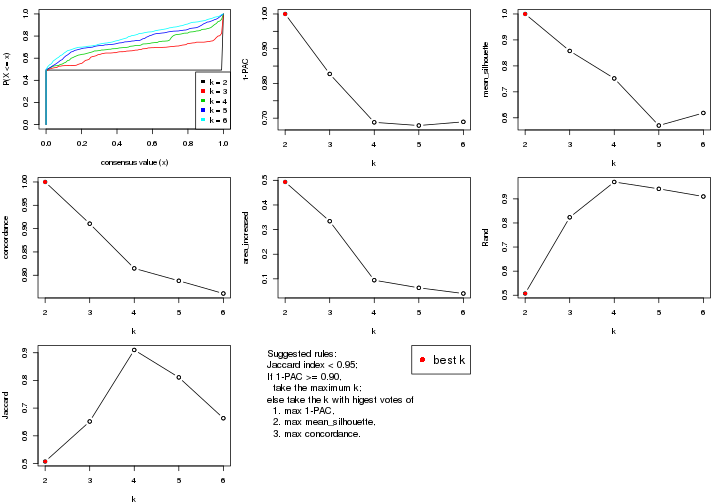

The numeric values for all these statistics can be obtained by `get_stats()`.

```r
get_stats(res)
```

```
#>   k 1-PAC mean_silhouette concordance area_increased  Rand Jaccard
#> 2 2 1.000           1.000       1.000         0.4934 0.507   0.507
#> 3 3 0.827           0.857       0.911         0.3340 0.823   0.652
#> 4 4 0.688           0.752       0.815         0.0945 0.970   0.910
#> 5 5 0.679           0.570       0.788         0.0636 0.942   0.811
#> 6 6 0.689           0.619       0.761         0.0405 0.910   0.663
```

`suggest_best_k()` suggests the best $k$ based on these statistics. The rules are as follows:

- All $k$ with Jaccard index larger than 0.95 are removed because increasing
  $k$ does not provide enough extra information. If all $k$ are removed, it is
  marked as no subgroup is detected.
- For all $k$ with 1-PAC score larger than 0.9, the maximal $k$ is taken as
  the best $k$, and other $k$ are marked as optional $k$.
- If it does not fit the second rule. The $k$ with the maximal vote of the
  highest 1-PAC score, highest mean silhouette, and highest concordance is
  taken as the best $k$.

```r
suggest_best_k(res)
```

```
#> [1] 2
```


Following shows the table of the partitions (You need to click the **show/hide
code output** link to see it). The membership matrix (columns with name `p*`)
is inferred by
[`clue::cl_consensus()`](https://www.rdocumentation.org/link/cl_consensus?package=clue)
function with the `SE` method. Basically the value in the membership matrix
represents the probability to belong to a certain group. The finall class
label for an item is determined with the group with highest probability it
belongs to.

In `get_classes()` function, the entropy is calculated from the membership
matrix and the silhouette score is calculated from the consensus matrix.


<script>
$( function() {
	$( '#tabs-SD-skmeans-get-classes' ).tabs();
} );
</script>
<div id='tabs-SD-skmeans-get-classes'>
<ul>
<li><a href='#tab-SD-skmeans-get-classes-1'>k = 2</a></li>
<li><a href='#tab-SD-skmeans-get-classes-2'>k = 3</a></li>
<li><a href='#tab-SD-skmeans-get-classes-3'>k = 4</a></li>
<li><a href='#tab-SD-skmeans-get-classes-4'>k = 5</a></li>
<li><a href='#tab-SD-skmeans-get-classes-5'>k = 6</a></li>
</ul>

<div id='tab-SD-skmeans-get-classes-1'>
<p><a id='tab-SD-skmeans-get-classes-1-a' style='color:#0366d6' href='#'>show/hide code output</a></p>
<pre><code class="r">cbind(get_classes(res, k = 2), get_membership(res, k = 2))
</code></pre>

<pre><code>#&gt;           class entropy silhouette p1 p2
#&gt; GSM790742     2       0          1  0  1
#&gt; GSM790744     2       0          1  0  1
#&gt; GSM790754     2       0          1  0  1
#&gt; GSM790756     2       0          1  0  1
#&gt; GSM790768     2       0          1  0  1
#&gt; GSM790774     2       0          1  0  1
#&gt; GSM790778     2       0          1  0  1
#&gt; GSM790784     2       0          1  0  1
#&gt; GSM790790     2       0          1  0  1
#&gt; GSM790743     1       0          1  1  0
#&gt; GSM790745     1       0          1  1  0
#&gt; GSM790755     2       0          1  0  1
#&gt; GSM790757     1       0          1  1  0
#&gt; GSM790769     1       0          1  1  0
#&gt; GSM790775     1       0          1  1  0
#&gt; GSM790779     1       0          1  1  0
#&gt; GSM790785     1       0          1  1  0
#&gt; GSM790791     1       0          1  1  0
#&gt; GSM790738     2       0          1  0  1
#&gt; GSM790746     2       0          1  0  1
#&gt; GSM790752     2       0          1  0  1
#&gt; GSM790758     2       0          1  0  1
#&gt; GSM790764     2       0          1  0  1
#&gt; GSM790766     2       0          1  0  1
#&gt; GSM790772     2       0          1  0  1
#&gt; GSM790782     2       0          1  0  1
#&gt; GSM790786     2       0          1  0  1
#&gt; GSM790792     2       0          1  0  1
#&gt; GSM790739     1       0          1  1  0
#&gt; GSM790747     1       0          1  1  0
#&gt; GSM790753     1       0          1  1  0
#&gt; GSM790759     2       0          1  0  1
#&gt; GSM790765     2       0          1  0  1
#&gt; GSM790767     1       0          1  1  0
#&gt; GSM790773     1       0          1  1  0
#&gt; GSM790783     1       0          1  1  0
#&gt; GSM790787     1       0          1  1  0
#&gt; GSM790793     1       0          1  1  0
#&gt; GSM790740     2       0          1  0  1
#&gt; GSM790748     2       0          1  0  1
#&gt; GSM790750     2       0          1  0  1
#&gt; GSM790760     2       0          1  0  1
#&gt; GSM790762     2       0          1  0  1
#&gt; GSM790770     2       0          1  0  1
#&gt; GSM790776     2       0          1  0  1
#&gt; GSM790780     2       0          1  0  1
#&gt; GSM790788     2       0          1  0  1
#&gt; GSM790741     2       0          1  0  1
#&gt; GSM790749     1       0          1  1  0
#&gt; GSM790751     2       0          1  0  1
#&gt; GSM790761     1       0          1  1  0
#&gt; GSM790763     1       0          1  1  0
#&gt; GSM790771     1       0          1  1  0
#&gt; GSM790777     1       0          1  1  0
#&gt; GSM790781     1       0          1  1  0
#&gt; GSM790789     1       0          1  1  0
</code></pre>

<script>
$('#tab-SD-skmeans-get-classes-1-a').parent().next().next().hide();
$('#tab-SD-skmeans-get-classes-1-a').click(function(){
  $('#tab-SD-skmeans-get-classes-1-a').parent().next().next().toggle();
  return(false);
});
</script>
</div>

<div id='tab-SD-skmeans-get-classes-2'>
<p><a id='tab-SD-skmeans-get-classes-2-a' style='color:#0366d6' href='#'>show/hide code output</a></p>
<pre><code class="r">cbind(get_classes(res, k = 3), get_membership(res, k = 3))
</code></pre>

<pre><code>#&gt;           class entropy silhouette    p1    p2    p3
#&gt; GSM790742     2  0.4452     0.7369 0.000 0.808 0.192
#&gt; GSM790744     2  0.1643     0.8452 0.000 0.956 0.044
#&gt; GSM790754     3  0.4002     0.8765 0.000 0.160 0.840
#&gt; GSM790756     3  0.4178     0.8751 0.000 0.172 0.828
#&gt; GSM790768     2  0.1860     0.8412 0.000 0.948 0.052
#&gt; GSM790774     3  0.4654     0.8728 0.000 0.208 0.792
#&gt; GSM790778     3  0.4654     0.8728 0.000 0.208 0.792
#&gt; GSM790784     3  0.4654     0.8728 0.000 0.208 0.792
#&gt; GSM790790     2  0.0592     0.8463 0.000 0.988 0.012
#&gt; GSM790743     1  0.0000     0.9969 1.000 0.000 0.000
#&gt; GSM790745     1  0.0000     0.9969 1.000 0.000 0.000
#&gt; GSM790755     3  0.0000     0.7210 0.000 0.000 1.000
#&gt; GSM790757     1  0.0000     0.9969 1.000 0.000 0.000
#&gt; GSM790769     1  0.0000     0.9969 1.000 0.000 0.000
#&gt; GSM790775     1  0.0424     0.9958 0.992 0.000 0.008
#&gt; GSM790779     1  0.0424     0.9958 0.992 0.000 0.008
#&gt; GSM790785     1  0.0424     0.9958 0.992 0.000 0.008
#&gt; GSM790791     1  0.0000     0.9969 1.000 0.000 0.000
#&gt; GSM790738     2  0.1643     0.8453 0.000 0.956 0.044
#&gt; GSM790746     2  0.1643     0.8452 0.000 0.956 0.044
#&gt; GSM790752     3  0.4002     0.8765 0.000 0.160 0.840
#&gt; GSM790758     3  0.3941     0.8739 0.000 0.156 0.844
#&gt; GSM790764     3  0.6204    -0.0693 0.000 0.424 0.576
#&gt; GSM790766     2  0.3267     0.7843 0.000 0.884 0.116
#&gt; GSM790772     2  0.5968     0.2261 0.000 0.636 0.364
#&gt; GSM790782     3  0.4654     0.8728 0.000 0.208 0.792
#&gt; GSM790786     3  0.4654     0.8728 0.000 0.208 0.792
#&gt; GSM790792     2  0.0592     0.8463 0.000 0.988 0.012
#&gt; GSM790739     1  0.0000     0.9969 1.000 0.000 0.000
#&gt; GSM790747     1  0.0000     0.9969 1.000 0.000 0.000
#&gt; GSM790753     1  0.0424     0.9958 0.992 0.000 0.008
#&gt; GSM790759     2  0.4121     0.7556 0.000 0.832 0.168
#&gt; GSM790765     3  0.4504     0.8759 0.000 0.196 0.804
#&gt; GSM790767     1  0.0000     0.9969 1.000 0.000 0.000
#&gt; GSM790773     1  0.0424     0.9958 0.992 0.000 0.008
#&gt; GSM790783     1  0.0424     0.9958 0.992 0.000 0.008
#&gt; GSM790787     1  0.0424     0.9958 0.992 0.000 0.008
#&gt; GSM790793     1  0.0000     0.9969 1.000 0.000 0.000
#&gt; GSM790740     2  0.2625     0.8174 0.000 0.916 0.084
#&gt; GSM790748     2  0.4452     0.7369 0.000 0.808 0.192
#&gt; GSM790750     3  0.4002     0.8765 0.000 0.160 0.840
#&gt; GSM790760     3  0.5785     0.2456 0.000 0.332 0.668
#&gt; GSM790762     2  0.1163     0.8471 0.000 0.972 0.028
#&gt; GSM790770     2  0.3686     0.7648 0.000 0.860 0.140
#&gt; GSM790776     2  0.6192     0.4565 0.000 0.580 0.420
#&gt; GSM790780     3  0.4605     0.8743 0.000 0.204 0.796
#&gt; GSM790788     2  0.0592     0.8463 0.000 0.988 0.012
#&gt; GSM790741     2  0.3038     0.7979 0.000 0.896 0.104
#&gt; GSM790749     1  0.0000     0.9969 1.000 0.000 0.000
#&gt; GSM790751     3  0.4002     0.8765 0.000 0.160 0.840
#&gt; GSM790761     1  0.0000     0.9969 1.000 0.000 0.000
#&gt; GSM790763     1  0.0424     0.9958 0.992 0.000 0.008
#&gt; GSM790771     1  0.0000     0.9969 1.000 0.000 0.000
#&gt; GSM790777     1  0.0424     0.9958 0.992 0.000 0.008
#&gt; GSM790781     1  0.0747     0.9912 0.984 0.000 0.016
#&gt; GSM790789     1  0.0000     0.9969 1.000 0.000 0.000
</code></pre>

<script>
$('#tab-SD-skmeans-get-classes-2-a').parent().next().next().hide();
$('#tab-SD-skmeans-get-classes-2-a').click(function(){
  $('#tab-SD-skmeans-get-classes-2-a').parent().next().next().toggle();
  return(false);
});
</script>
</div>

<div id='tab-SD-skmeans-get-classes-3'>
<p><a id='tab-SD-skmeans-get-classes-3-a' style='color:#0366d6' href='#'>show/hide code output</a></p>
<pre><code class="r">cbind(get_classes(res, k = 4), get_membership(res, k = 4))
</code></pre>

<pre><code>#&gt;           class entropy silhouette    p1    p2    p3    p4
#&gt; GSM790742     2  0.5592    -0.2800 0.000 0.572 0.024 0.404
#&gt; GSM790744     2  0.2589     0.7554 0.000 0.884 0.116 0.000
#&gt; GSM790754     3  0.0469     0.9459 0.000 0.000 0.988 0.012
#&gt; GSM790756     3  0.1975     0.9144 0.000 0.016 0.936 0.048
#&gt; GSM790768     2  0.2647     0.7538 0.000 0.880 0.120 0.000
#&gt; GSM790774     3  0.1940     0.8894 0.000 0.076 0.924 0.000
#&gt; GSM790778     3  0.0707     0.9478 0.000 0.020 0.980 0.000
#&gt; GSM790784     3  0.0921     0.9437 0.000 0.028 0.972 0.000
#&gt; GSM790790     2  0.2197     0.7480 0.000 0.916 0.080 0.004
#&gt; GSM790743     1  0.4730     0.8099 0.636 0.000 0.000 0.364
#&gt; GSM790745     1  0.4981     0.7451 0.536 0.000 0.000 0.464
#&gt; GSM790755     3  0.3335     0.7819 0.000 0.020 0.860 0.120
#&gt; GSM790757     1  0.4981     0.7451 0.536 0.000 0.000 0.464
#&gt; GSM790769     1  0.4382     0.8369 0.704 0.000 0.000 0.296
#&gt; GSM790775     1  0.0000     0.8003 1.000 0.000 0.000 0.000
#&gt; GSM790779     1  0.0336     0.7961 0.992 0.000 0.000 0.008
#&gt; GSM790785     1  0.0000     0.8003 1.000 0.000 0.000 0.000
#&gt; GSM790791     1  0.4382     0.8369 0.704 0.000 0.000 0.296
#&gt; GSM790738     2  0.2530     0.7570 0.000 0.888 0.112 0.000
#&gt; GSM790746     2  0.3047     0.7498 0.000 0.872 0.116 0.012
#&gt; GSM790752     3  0.0707     0.9442 0.000 0.000 0.980 0.020
#&gt; GSM790758     3  0.1118     0.9341 0.000 0.000 0.964 0.036
#&gt; GSM790764     4  0.7784     0.8287 0.000 0.336 0.252 0.412
#&gt; GSM790766     2  0.4008     0.6296 0.000 0.756 0.244 0.000
#&gt; GSM790772     2  0.4790     0.3365 0.000 0.620 0.380 0.000
#&gt; GSM790782     3  0.0707     0.9478 0.000 0.020 0.980 0.000
#&gt; GSM790786     3  0.0921     0.9437 0.000 0.028 0.972 0.000
#&gt; GSM790792     2  0.2053     0.7416 0.000 0.924 0.072 0.004
#&gt; GSM790739     1  0.4888     0.7842 0.588 0.000 0.000 0.412
#&gt; GSM790747     1  0.4382     0.8369 0.704 0.000 0.000 0.296
#&gt; GSM790753     1  0.0000     0.8003 1.000 0.000 0.000 0.000
#&gt; GSM790759     2  0.5578     0.0588 0.000 0.648 0.040 0.312
#&gt; GSM790765     3  0.0592     0.9489 0.000 0.016 0.984 0.000
#&gt; GSM790767     1  0.4356     0.8366 0.708 0.000 0.000 0.292
#&gt; GSM790773     1  0.0000     0.8003 1.000 0.000 0.000 0.000
#&gt; GSM790783     1  0.0707     0.8044 0.980 0.000 0.000 0.020
#&gt; GSM790787     1  0.0188     0.8006 0.996 0.000 0.000 0.004
#&gt; GSM790793     1  0.4382     0.8369 0.704 0.000 0.000 0.296
#&gt; GSM790740     2  0.2973     0.7407 0.000 0.856 0.144 0.000
#&gt; GSM790748     2  0.5611    -0.3051 0.000 0.564 0.024 0.412
#&gt; GSM790750     3  0.0707     0.9442 0.000 0.000 0.980 0.020
#&gt; GSM790760     4  0.7786     0.7701 0.000 0.256 0.328 0.416
#&gt; GSM790762     2  0.2408     0.7561 0.000 0.896 0.104 0.000
#&gt; GSM790770     2  0.3498     0.4598 0.000 0.832 0.008 0.160
#&gt; GSM790776     4  0.7523     0.7235 0.000 0.404 0.184 0.412
#&gt; GSM790780     3  0.0592     0.9491 0.000 0.016 0.984 0.000
#&gt; GSM790788     2  0.2197     0.7480 0.000 0.916 0.080 0.004
#&gt; GSM790741     2  0.3172     0.7270 0.000 0.840 0.160 0.000
#&gt; GSM790749     1  0.4382     0.8369 0.704 0.000 0.000 0.296
#&gt; GSM790751     3  0.0592     0.9454 0.000 0.000 0.984 0.016
#&gt; GSM790761     1  0.4730     0.8099 0.636 0.000 0.000 0.364
#&gt; GSM790763     1  0.0707     0.8026 0.980 0.000 0.000 0.020
#&gt; GSM790771     1  0.4382     0.8369 0.704 0.000 0.000 0.296
#&gt; GSM790777     1  0.0000     0.8003 1.000 0.000 0.000 0.000
#&gt; GSM790781     1  0.4327     0.6171 0.768 0.000 0.016 0.216
#&gt; GSM790789     1  0.4382     0.8369 0.704 0.000 0.000 0.296
</code></pre>

<script>
$('#tab-SD-skmeans-get-classes-3-a').parent().next().next().hide();
$('#tab-SD-skmeans-get-classes-3-a').click(function(){
  $('#tab-SD-skmeans-get-classes-3-a').parent().next().next().toggle();
  return(false);
});
</script>
</div>

<div id='tab-SD-skmeans-get-classes-4'>
<p><a id='tab-SD-skmeans-get-classes-4-a' style='color:#0366d6' href='#'>show/hide code output</a></p>
<pre><code class="r">cbind(get_classes(res, k = 5), get_membership(res, k = 5))
</code></pre>

<pre><code>#&gt;           class entropy silhouette    p1    p2    p3    p4    p5
#&gt; GSM790742     5  0.3010     0.8286 0.000 0.172 0.004 0.000 0.824
#&gt; GSM790744     2  0.2769     0.8340 0.000 0.876 0.092 0.000 0.032
#&gt; GSM790754     3  0.1774     0.9097 0.016 0.000 0.932 0.000 0.052
#&gt; GSM790756     3  0.3497     0.8387 0.012 0.020 0.828 0.000 0.140
#&gt; GSM790768     2  0.2249     0.8324 0.000 0.896 0.096 0.000 0.008
#&gt; GSM790774     3  0.2408     0.8635 0.008 0.096 0.892 0.000 0.004
#&gt; GSM790778     3  0.0898     0.9163 0.008 0.020 0.972 0.000 0.000
#&gt; GSM790784     3  0.1251     0.9139 0.008 0.036 0.956 0.000 0.000
#&gt; GSM790790     2  0.2419     0.7956 0.004 0.904 0.028 0.000 0.064
#&gt; GSM790743     4  0.2676     0.5281 0.080 0.000 0.000 0.884 0.036
#&gt; GSM790745     4  0.5534     0.2661 0.300 0.000 0.000 0.604 0.096
#&gt; GSM790755     3  0.5523     0.7080 0.168 0.064 0.708 0.000 0.060
#&gt; GSM790757     4  0.5568     0.2552 0.308 0.000 0.000 0.596 0.096
#&gt; GSM790769     4  0.0703     0.5760 0.024 0.000 0.000 0.976 0.000
#&gt; GSM790775     4  0.4291    -0.2568 0.464 0.000 0.000 0.536 0.000
#&gt; GSM790779     1  0.4300    -0.0692 0.524 0.000 0.000 0.476 0.000
#&gt; GSM790785     4  0.4294    -0.2703 0.468 0.000 0.000 0.532 0.000
#&gt; GSM790791     4  0.0162     0.5809 0.004 0.000 0.000 0.996 0.000
#&gt; GSM790738     2  0.3301     0.8281 0.008 0.856 0.088 0.000 0.048
#&gt; GSM790746     2  0.4229     0.7937 0.004 0.788 0.104 0.000 0.104
#&gt; GSM790752     3  0.1981     0.9078 0.016 0.000 0.920 0.000 0.064
#&gt; GSM790758     3  0.2392     0.8887 0.004 0.004 0.888 0.000 0.104
#&gt; GSM790764     5  0.3767     0.8405 0.000 0.120 0.068 0.000 0.812
#&gt; GSM790766     2  0.4404     0.6400 0.000 0.684 0.292 0.000 0.024
#&gt; GSM790772     2  0.4801     0.5208 0.004 0.604 0.372 0.000 0.020
#&gt; GSM790782     3  0.1168     0.9147 0.008 0.032 0.960 0.000 0.000
#&gt; GSM790786     3  0.1331     0.9120 0.008 0.040 0.952 0.000 0.000
#&gt; GSM790792     2  0.2569     0.7963 0.004 0.896 0.032 0.000 0.068
#&gt; GSM790739     4  0.3980     0.4653 0.128 0.000 0.000 0.796 0.076
#&gt; GSM790747     4  0.0609     0.5780 0.020 0.000 0.000 0.980 0.000
#&gt; GSM790753     4  0.4283    -0.2354 0.456 0.000 0.000 0.544 0.000
#&gt; GSM790759     5  0.5162     0.5340 0.012 0.344 0.032 0.000 0.612
#&gt; GSM790765     3  0.1153     0.9173 0.008 0.024 0.964 0.000 0.004
#&gt; GSM790767     4  0.0794     0.5766 0.028 0.000 0.000 0.972 0.000
#&gt; GSM790773     4  0.4291    -0.2568 0.464 0.000 0.000 0.536 0.000
#&gt; GSM790783     4  0.4182    -0.1054 0.400 0.000 0.000 0.600 0.000
#&gt; GSM790787     4  0.4262    -0.2083 0.440 0.000 0.000 0.560 0.000
#&gt; GSM790793     4  0.0162     0.5809 0.004 0.000 0.000 0.996 0.000
#&gt; GSM790740     2  0.3548     0.8234 0.008 0.836 0.112 0.000 0.044
#&gt; GSM790748     5  0.2890     0.8364 0.000 0.160 0.004 0.000 0.836
#&gt; GSM790750     3  0.1981     0.9081 0.016 0.000 0.920 0.000 0.064
#&gt; GSM790760     5  0.3255     0.8121 0.000 0.052 0.100 0.000 0.848
#&gt; GSM790762     2  0.2238     0.8233 0.004 0.912 0.064 0.000 0.020
#&gt; GSM790770     2  0.4066     0.3262 0.004 0.672 0.000 0.000 0.324
#&gt; GSM790776     5  0.3741     0.8471 0.000 0.108 0.076 0.000 0.816
#&gt; GSM790780     3  0.0566     0.9168 0.012 0.004 0.984 0.000 0.000
#&gt; GSM790788     2  0.2313     0.8130 0.004 0.912 0.044 0.000 0.040
#&gt; GSM790741     2  0.3831     0.8113 0.008 0.812 0.136 0.000 0.044
#&gt; GSM790749     4  0.0290     0.5815 0.008 0.000 0.000 0.992 0.000
#&gt; GSM790751     3  0.2367     0.9038 0.020 0.004 0.904 0.000 0.072
#&gt; GSM790761     4  0.2793     0.5226 0.088 0.000 0.000 0.876 0.036
#&gt; GSM790763     4  0.4242    -0.1850 0.428 0.000 0.000 0.572 0.000
#&gt; GSM790771     4  0.0290     0.5815 0.008 0.000 0.000 0.992 0.000
#&gt; GSM790777     4  0.4291    -0.2568 0.464 0.000 0.000 0.536 0.000
#&gt; GSM790781     1  0.3331     0.3458 0.840 0.004 0.020 0.132 0.004
#&gt; GSM790789     4  0.0000     0.5815 0.000 0.000 0.000 1.000 0.000
</code></pre>

<script>
$('#tab-SD-skmeans-get-classes-4-a').parent().next().next().hide();
$('#tab-SD-skmeans-get-classes-4-a').click(function(){
  $('#tab-SD-skmeans-get-classes-4-a').parent().next().next().toggle();
  return(false);
});
</script>
</div>

<div id='tab-SD-skmeans-get-classes-5'>
<p><a id='tab-SD-skmeans-get-classes-5-a' style='color:#0366d6' href='#'>show/hide code output</a></p>
<pre><code class="r">cbind(get_classes(res, k = 6), get_membership(res, k = 6))
</code></pre>

<pre><code>#&gt;           class entropy silhouette    p1    p2    p3    p4    p5    p6
#&gt; GSM790742     6  0.2056      0.829 0.000 0.080 0.000 0.004 0.012 0.904
#&gt; GSM790744     2  0.3092      0.761 0.000 0.864 0.072 0.008 0.032 0.024
#&gt; GSM790754     3  0.3048      0.629 0.000 0.004 0.824 0.000 0.152 0.020
#&gt; GSM790756     3  0.4985      0.417 0.000 0.040 0.688 0.000 0.068 0.204
#&gt; GSM790768     2  0.2253      0.762 0.000 0.896 0.084 0.012 0.004 0.004
#&gt; GSM790774     3  0.2367      0.638 0.000 0.088 0.888 0.000 0.016 0.008
#&gt; GSM790778     3  0.0692      0.742 0.000 0.020 0.976 0.000 0.004 0.000
#&gt; GSM790784     3  0.0632      0.742 0.000 0.024 0.976 0.000 0.000 0.000
#&gt; GSM790790     2  0.2923      0.726 0.000 0.872 0.008 0.016 0.072 0.032
#&gt; GSM790743     4  0.4775      0.641 0.304 0.004 0.000 0.640 0.036 0.016
#&gt; GSM790745     4  0.5449      0.325 0.164 0.000 0.000 0.624 0.196 0.016
#&gt; GSM790755     5  0.4289      0.000 0.000 0.000 0.424 0.000 0.556 0.020
#&gt; GSM790757     4  0.5414      0.315 0.156 0.000 0.000 0.628 0.200 0.016
#&gt; GSM790769     4  0.3866      0.636 0.484 0.000 0.000 0.516 0.000 0.000
#&gt; GSM790775     1  0.0146      0.763 0.996 0.000 0.000 0.004 0.000 0.000
#&gt; GSM790779     1  0.2001      0.696 0.912 0.000 0.000 0.048 0.040 0.000
#&gt; GSM790785     1  0.0146      0.763 0.996 0.000 0.000 0.004 0.000 0.000
#&gt; GSM790791     4  0.3961      0.682 0.440 0.000 0.000 0.556 0.004 0.000
#&gt; GSM790738     2  0.4204      0.747 0.000 0.796 0.088 0.012 0.064 0.040
#&gt; GSM790746     2  0.5367      0.678 0.000 0.696 0.092 0.008 0.064 0.140
#&gt; GSM790752     3  0.3703      0.614 0.000 0.004 0.792 0.000 0.132 0.072
#&gt; GSM790758     3  0.4282      0.494 0.000 0.004 0.732 0.000 0.084 0.180
#&gt; GSM790764     6  0.2981      0.810 0.000 0.040 0.052 0.004 0.032 0.872
#&gt; GSM790766     2  0.4364      0.534 0.000 0.652 0.316 0.004 0.020 0.008
#&gt; GSM790772     2  0.5410      0.284 0.000 0.492 0.436 0.008 0.036 0.028
#&gt; GSM790782     3  0.1334      0.734 0.000 0.032 0.948 0.000 0.020 0.000
#&gt; GSM790786     3  0.1049      0.736 0.000 0.032 0.960 0.000 0.008 0.000
#&gt; GSM790792     2  0.2996      0.724 0.000 0.868 0.008 0.016 0.072 0.036
#&gt; GSM790739     4  0.5184      0.544 0.284 0.000 0.000 0.608 0.100 0.008
#&gt; GSM790747     4  0.3857      0.662 0.468 0.000 0.000 0.532 0.000 0.000
#&gt; GSM790753     1  0.0363      0.762 0.988 0.000 0.000 0.012 0.000 0.000
#&gt; GSM790759     6  0.5500      0.435 0.000 0.292 0.028 0.008 0.068 0.604
#&gt; GSM790765     3  0.1929      0.723 0.000 0.016 0.924 0.004 0.048 0.008
#&gt; GSM790767     1  0.3867     -0.661 0.512 0.000 0.000 0.488 0.000 0.000
#&gt; GSM790773     1  0.0146      0.763 0.996 0.000 0.000 0.004 0.000 0.000
#&gt; GSM790783     1  0.2219      0.619 0.864 0.000 0.000 0.136 0.000 0.000
#&gt; GSM790787     1  0.1349      0.733 0.940 0.000 0.000 0.056 0.004 0.000
#&gt; GSM790793     4  0.3955      0.682 0.436 0.000 0.000 0.560 0.004 0.000
#&gt; GSM790740     2  0.4713      0.732 0.000 0.752 0.124 0.012 0.072 0.040
#&gt; GSM790748     6  0.1471      0.840 0.000 0.064 0.000 0.000 0.004 0.932
#&gt; GSM790750     3  0.3622      0.625 0.000 0.004 0.800 0.000 0.124 0.072
#&gt; GSM790760     6  0.1889      0.803 0.000 0.004 0.056 0.000 0.020 0.920
#&gt; GSM790762     2  0.2731      0.737 0.000 0.884 0.020 0.016 0.068 0.012
#&gt; GSM790770     2  0.4370      0.316 0.000 0.616 0.000 0.008 0.020 0.356
#&gt; GSM790776     6  0.2078      0.838 0.000 0.040 0.044 0.000 0.004 0.912
#&gt; GSM790780     3  0.1367      0.733 0.000 0.012 0.944 0.000 0.044 0.000
#&gt; GSM790788     2  0.2713      0.730 0.000 0.884 0.008 0.016 0.068 0.024
#&gt; GSM790741     2  0.5025      0.715 0.000 0.716 0.156 0.012 0.084 0.032
#&gt; GSM790749     4  0.3851      0.672 0.460 0.000 0.000 0.540 0.000 0.000
#&gt; GSM790751     3  0.3610      0.550 0.000 0.004 0.768 0.000 0.200 0.028
#&gt; GSM790761     4  0.4723      0.636 0.292 0.004 0.000 0.652 0.036 0.016
#&gt; GSM790763     1  0.2165      0.695 0.884 0.000 0.000 0.108 0.008 0.000
#&gt; GSM790771     4  0.3851      0.672 0.460 0.000 0.000 0.540 0.000 0.000
#&gt; GSM790777     1  0.0458      0.761 0.984 0.000 0.000 0.016 0.000 0.000
#&gt; GSM790781     1  0.6243      0.233 0.516 0.008 0.004 0.236 0.228 0.008
#&gt; GSM790789     4  0.3847      0.674 0.456 0.000 0.000 0.544 0.000 0.000
</code></pre>

<script>
$('#tab-SD-skmeans-get-classes-5-a').parent().next().next().hide();
$('#tab-SD-skmeans-get-classes-5-a').click(function(){
  $('#tab-SD-skmeans-get-classes-5-a').parent().next().next().toggle();
  return(false);
});
</script>
</div>
</div>

Heatmaps for the consensus matrix. It visualizes the probability of two
samples to be in a same group.


<script>
$( function() {
	$( '#tabs-SD-skmeans-consensus-heatmap' ).tabs();
} );
</script>
<div id='tabs-SD-skmeans-consensus-heatmap'>
<ul>
<li><a href='#tab-SD-skmeans-consensus-heatmap-1'>k = 2</a></li>
<li><a href='#tab-SD-skmeans-consensus-heatmap-2'>k = 3</a></li>
<li><a href='#tab-SD-skmeans-consensus-heatmap-3'>k = 4</a></li>
<li><a href='#tab-SD-skmeans-consensus-heatmap-4'>k = 5</a></li>
<li><a href='#tab-SD-skmeans-consensus-heatmap-5'>k = 6</a></li>
</ul>
<div id='tab-SD-skmeans-consensus-heatmap-1'>
<pre><code class="r">consensus_heatmap(res, k = 2)
</code></pre>

<p>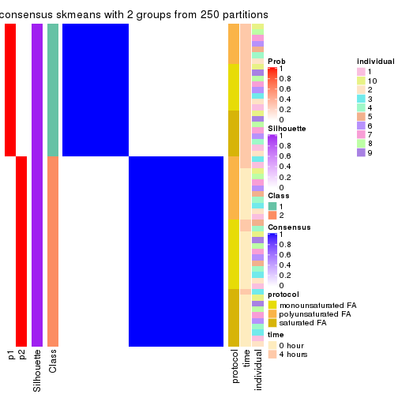</p>

</div>
<div id='tab-SD-skmeans-consensus-heatmap-2'>
<pre><code class="r">consensus_heatmap(res, k = 3)
</code></pre>

<p>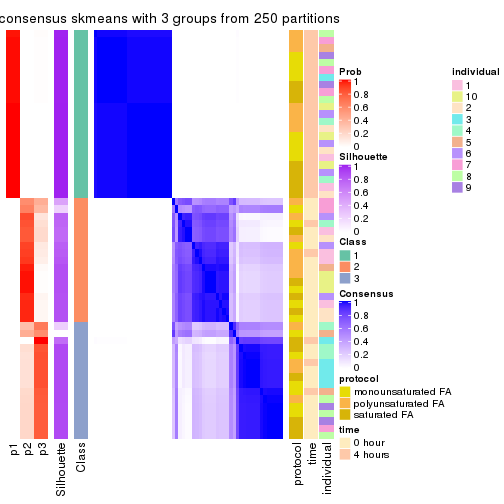</p>

</div>
<div id='tab-SD-skmeans-consensus-heatmap-3'>
<pre><code class="r">consensus_heatmap(res, k = 4)
</code></pre>

<p>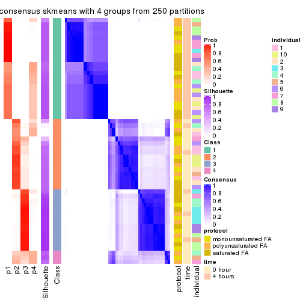</p>

</div>
<div id='tab-SD-skmeans-consensus-heatmap-4'>
<pre><code class="r">consensus_heatmap(res, k = 5)
</code></pre>

<p>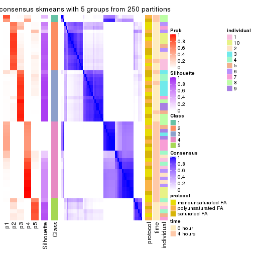</p>

</div>
<div id='tab-SD-skmeans-consensus-heatmap-5'>
<pre><code class="r">consensus_heatmap(res, k = 6)
</code></pre>

<p>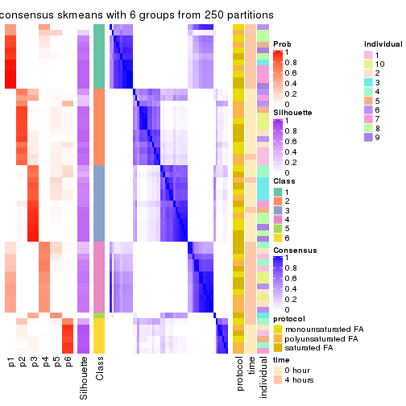</p>

</div>
</div>

Heatmaps for the membership of samples in all partitions to see how consistent they are:


<script>
$( function() {
	$( '#tabs-SD-skmeans-membership-heatmap' ).tabs();
} );
</script>
<div id='tabs-SD-skmeans-membership-heatmap'>
<ul>
<li><a href='#tab-SD-skmeans-membership-heatmap-1'>k = 2</a></li>
<li><a href='#tab-SD-skmeans-membership-heatmap-2'>k = 3</a></li>
<li><a href='#tab-SD-skmeans-membership-heatmap-3'>k = 4</a></li>
<li><a href='#tab-SD-skmeans-membership-heatmap-4'>k = 5</a></li>
<li><a href='#tab-SD-skmeans-membership-heatmap-5'>k = 6</a></li>
</ul>
<div id='tab-SD-skmeans-membership-heatmap-1'>
<pre><code class="r">membership_heatmap(res, k = 2)
</code></pre>

<p></p>

</div>
<div id='tab-SD-skmeans-membership-heatmap-2'>
<pre><code class="r">membership_heatmap(res, k = 3)
</code></pre>

<p>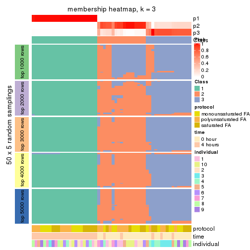</p>

</div>
<div id='tab-SD-skmeans-membership-heatmap-3'>
<pre><code class="r">membership_heatmap(res, k = 4)
</code></pre>

<p>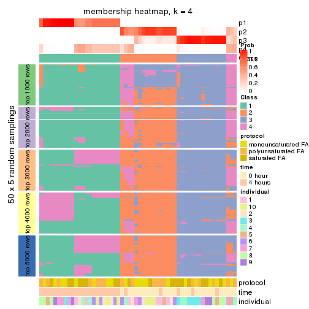</p>

</div>
<div id='tab-SD-skmeans-membership-heatmap-4'>
<pre><code class="r">membership_heatmap(res, k = 5)
</code></pre>

<p>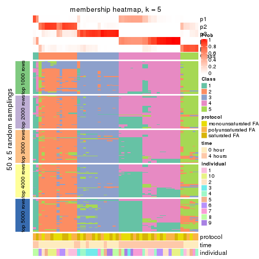</p>

</div>
<div id='tab-SD-skmeans-membership-heatmap-5'>
<pre><code class="r">membership_heatmap(res, k = 6)
</code></pre>

<p>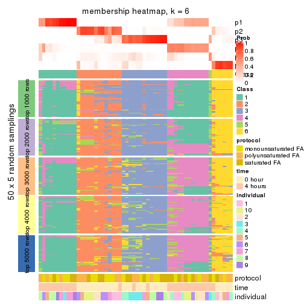</p>

</div>
</div>

As soon as we have had the classes for columns, we can look for signatures
which are significantly different between classes which can be candidate marks
for certain classes. Following are the heatmaps for signatures.


Signature heatmaps where rows are scaled:


<script>
$( function() {
	$( '#tabs-SD-skmeans-get-signatures' ).tabs();
} );
</script>
<div id='tabs-SD-skmeans-get-signatures'>
<ul>
<li><a href='#tab-SD-skmeans-get-signatures-1'>k = 2</a></li>
<li><a href='#tab-SD-skmeans-get-signatures-2'>k = 3</a></li>
<li><a href='#tab-SD-skmeans-get-signatures-3'>k = 4</a></li>
<li><a href='#tab-SD-skmeans-get-signatures-4'>k = 5</a></li>
<li><a href='#tab-SD-skmeans-get-signatures-5'>k = 6</a></li>
</ul>
<div id='tab-SD-skmeans-get-signatures-1'>
<pre><code class="r">get_signatures(res, k = 2)
</code></pre>

<p>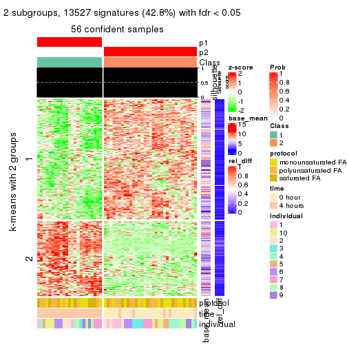</p>

</div>
<div id='tab-SD-skmeans-get-signatures-2'>
<pre><code class="r">get_signatures(res, k = 3)
</code></pre>

<p>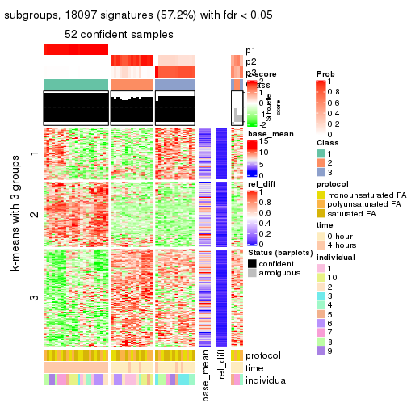</p>

</div>
<div id='tab-SD-skmeans-get-signatures-3'>
<pre><code class="r">get_signatures(res, k = 4)
</code></pre>

<p>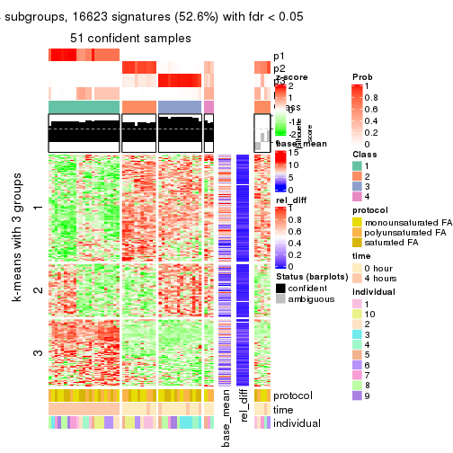</p>

</div>
<div id='tab-SD-skmeans-get-signatures-4'>
<pre><code class="r">get_signatures(res, k = 5)
</code></pre>

<p>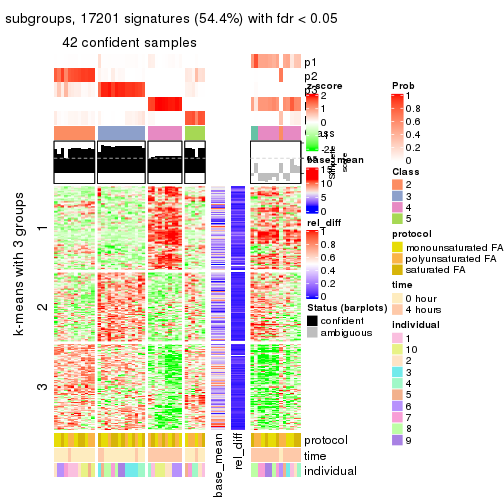</p>

</div>
<div id='tab-SD-skmeans-get-signatures-5'>
<pre><code class="r">get_signatures(res, k = 6)
</code></pre>

<p>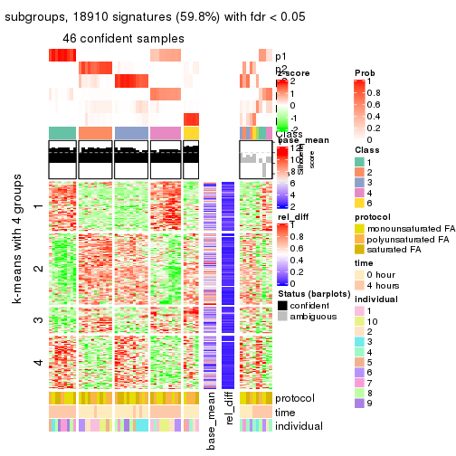</p>

</div>
</div>


Signature heatmaps where rows are not scaled:


<script>
$( function() {
	$( '#tabs-SD-skmeans-get-signatures-no-scale' ).tabs();
} );
</script>
<div id='tabs-SD-skmeans-get-signatures-no-scale'>
<ul>
<li><a href='#tab-SD-skmeans-get-signatures-no-scale-1'>k = 2</a></li>
<li><a href='#tab-SD-skmeans-get-signatures-no-scale-2'>k = 3</a></li>
<li><a href='#tab-SD-skmeans-get-signatures-no-scale-3'>k = 4</a></li>
<li><a href='#tab-SD-skmeans-get-signatures-no-scale-4'>k = 5</a></li>
<li><a href='#tab-SD-skmeans-get-signatures-no-scale-5'>k = 6</a></li>
</ul>
<div id='tab-SD-skmeans-get-signatures-no-scale-1'>
<pre><code class="r">get_signatures(res, k = 2, scale_rows = FALSE)
</code></pre>

<p></p>

</div>
<div id='tab-SD-skmeans-get-signatures-no-scale-2'>
<pre><code class="r">get_signatures(res, k = 3, scale_rows = FALSE)
</code></pre>

<p></p>

</div>
<div id='tab-SD-skmeans-get-signatures-no-scale-3'>
<pre><code class="r">get_signatures(res, k = 4, scale_rows = FALSE)
</code></pre>

<p>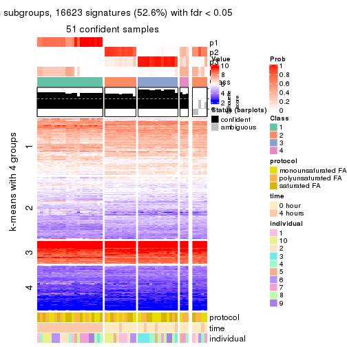</p>

</div>
<div id='tab-SD-skmeans-get-signatures-no-scale-4'>
<pre><code class="r">get_signatures(res, k = 5, scale_rows = FALSE)
</code></pre>

<p>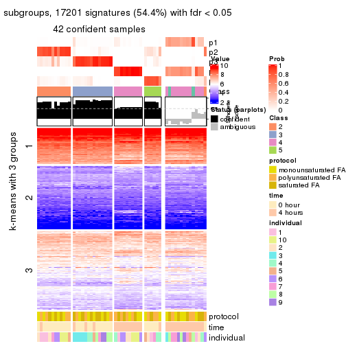</p>

</div>
<div id='tab-SD-skmeans-get-signatures-no-scale-5'>
<pre><code class="r">get_signatures(res, k = 6, scale_rows = FALSE)
</code></pre>

<p>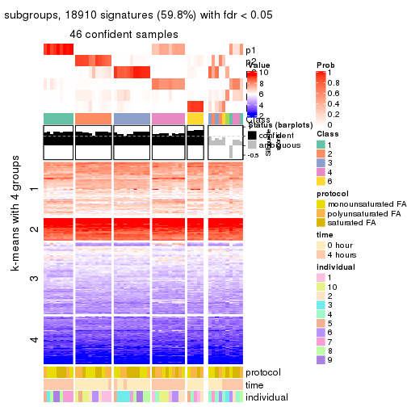</p>

</div>
</div>


Compare the overlap of signatures from different k:

```r
compare_signatures(res)
```

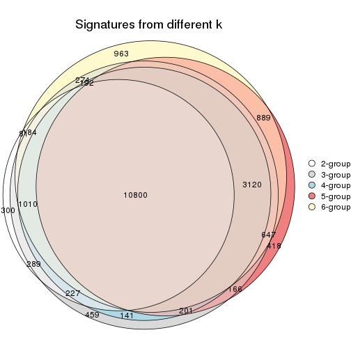

`get_signature()` returns a data frame invisibly. TO get the list of signatures, the function
call should be assigned to a variable explicitly. In following code, if `plot` argument is set
to `FALSE`, no heatmap is plotted while only the differential analysis is performed.

```r
# code only for demonstration
tb = get_signature(res, k = ..., plot = FALSE)
```

An example of the output of `tb` is:

```
#>   which_row         fdr    mean_1    mean_2 scaled_mean_1 scaled_mean_2 km
#> 1        38 0.042760348  8.373488  9.131774    -0.5533452     0.5164555  1
#> 2        40 0.018707592  7.106213  8.469186    -0.6173731     0.5762149  1
#> 3        55 0.019134737 10.221463 11.207825    -0.6159697     0.5749050  1
#> 4        59 0.006059896  5.921854  7.869574    -0.6899429     0.6439467  1
#> 5        60 0.018055526  8.928898 10.211722    -0.6204761     0.5791110  1
#> 6        98 0.009384629 15.714769 14.887706     0.6635654    -0.6193277  2
...
```

The columns in `tb` are:

1. `which_row`: row indices corresponding to the input matrix.
2. `fdr`: FDR for the differential test. 
3. `mean_x`: The mean value in group x.
4. `scaled_mean_x`: The mean value in group x after rows are scaled.
5. `km`: Row groups if k-means clustering is applied to rows.


UMAP plot which shows how samples are separated.


<script>
$( function() {
	$( '#tabs-SD-skmeans-dimension-reduction' ).tabs();
} );
</script>
<div id='tabs-SD-skmeans-dimension-reduction'>
<ul>
<li><a href='#tab-SD-skmeans-dimension-reduction-1'>k = 2</a></li>
<li><a href='#tab-SD-skmeans-dimension-reduction-2'>k = 3</a></li>
<li><a href='#tab-SD-skmeans-dimension-reduction-3'>k = 4</a></li>
<li><a href='#tab-SD-skmeans-dimension-reduction-4'>k = 5</a></li>
<li><a href='#tab-SD-skmeans-dimension-reduction-5'>k = 6</a></li>
</ul>
<div id='tab-SD-skmeans-dimension-reduction-1'>
<pre><code class="r">dimension_reduction(res, k = 2, method = &quot;UMAP&quot;)
</code></pre>

<p></p>

</div>
<div id='tab-SD-skmeans-dimension-reduction-2'>
<pre><code class="r">dimension_reduction(res, k = 3, method = &quot;UMAP&quot;)
</code></pre>

<p>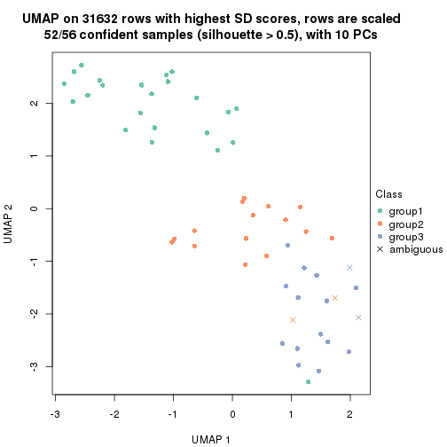</p>

</div>
<div id='tab-SD-skmeans-dimension-reduction-3'>
<pre><code class="r">dimension_reduction(res, k = 4, method = &quot;UMAP&quot;)
</code></pre>

<p>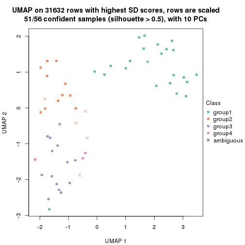</p>

</div>
<div id='tab-SD-skmeans-dimension-reduction-4'>
<pre><code class="r">dimension_reduction(res, k = 5, method = &quot;UMAP&quot;)
</code></pre>

<p>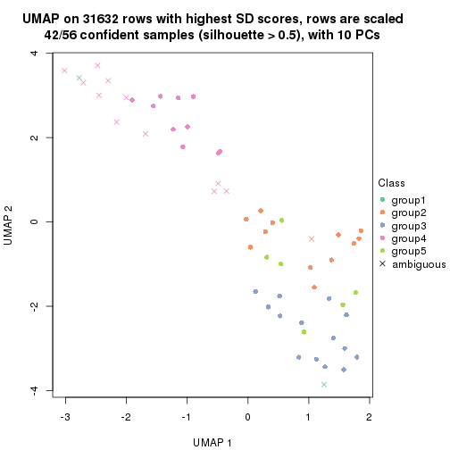</p>

</div>
<div id='tab-SD-skmeans-dimension-reduction-5'>
<pre><code class="r">dimension_reduction(res, k = 6, method = &quot;UMAP&quot;)
</code></pre>

<p>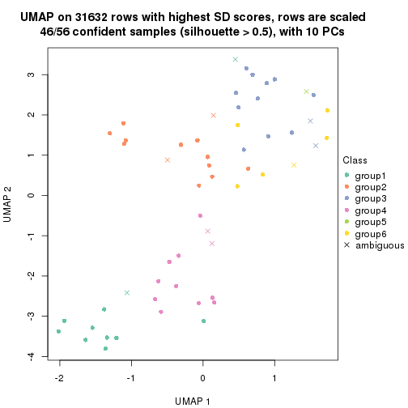</p>

</div>
</div>


Following heatmap shows how subgroups are split when increasing `k`:

```r
collect_classes(res)
```

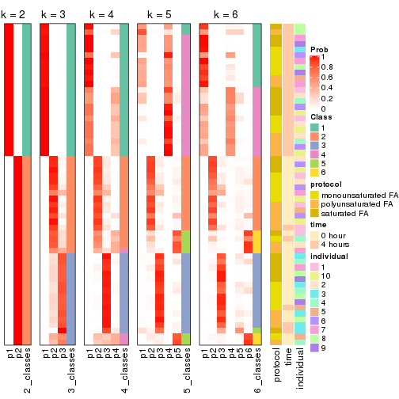


Test correlation between subgroups and known annotations. If the known
annotation is numeric, one-way ANOVA test is applied, and if the known
annotation is discrete, chi-squared contingency table test is applied.

```r
test_to_known_factors(res)
```

```
#>             n protocol(p)  time(p) individual(p) k
#> SD:skmeans 56       0.937 2.29e-09        0.9502 2
#> SD:skmeans 52       0.849 1.92e-08        0.0379 3
#> SD:skmeans 51       0.777 2.98e-08        0.0766 4
#> SD:skmeans 42       0.854 2.37e-05        0.0214 5
#> SD:skmeans 46       0.957 3.18e-07        0.0202 6
```


If matrix rows can be associated to genes, consider to use `functional_enrichment(res,
...)` to perform function enrichment for the signature genes. See [this vignette](http://bioconductor.org/packages/devel/bioc/vignettes/cola/inst/doc/functional_enrichment.html) for more detailed explanations.


 

---------------------------------------------------


### SD:pam**


The object with results only for a single top-value method and a single partition method 
can be extracted as:

```r
res = res_list["SD", "pam"]
# you can also extract it by
# res = res_list["SD:pam"]
```

A summary of `res` and all the functions that can be applied to it:

```r
res
```

```
#> A 'ConsensusPartition' object with k = 2, 3, 4, 5, 6.
#>   On a matrix with 31632 rows and 56 columns.
#>   Top rows (1000, 2000, 3000, 4000, 5000) are extracted by 'SD' method.
#>   Subgroups are detected by 'pam' method.
#>   Performed in total 1250 partitions by row resampling.
#>   Best k for subgroups seems to be 2.
#> 
#> Following methods can be applied to this 'ConsensusPartition' object:
#>  [1] "cola_report"             "collect_classes"         "collect_plots"          
#>  [4] "collect_stats"           "colnames"                "compare_signatures"     
#>  [7] "consensus_heatmap"       "dimension_reduction"     "functional_enrichment"  
#> [10] "get_anno_col"            "get_anno"                "get_classes"            
#> [13] "get_consensus"           "get_matrix"              "get_membership"         
#> [16] "get_param"               "get_signatures"          "get_stats"              
#> [19] "is_best_k"               "is_stable_k"             "membership_heatmap"     
#> [22] "ncol"                    "nrow"                    "plot_ecdf"              
#> [25] "rownames"                "select_partition_number" "show"                   
#> [28] "suggest_best_k"          "test_to_known_factors"
```

`collect_plots()` function collects all the plots made from `res` for all `k` (number of partitions)
into one single page to provide an easy and fast comparison between different `k`.

```r
collect_plots(res)
```

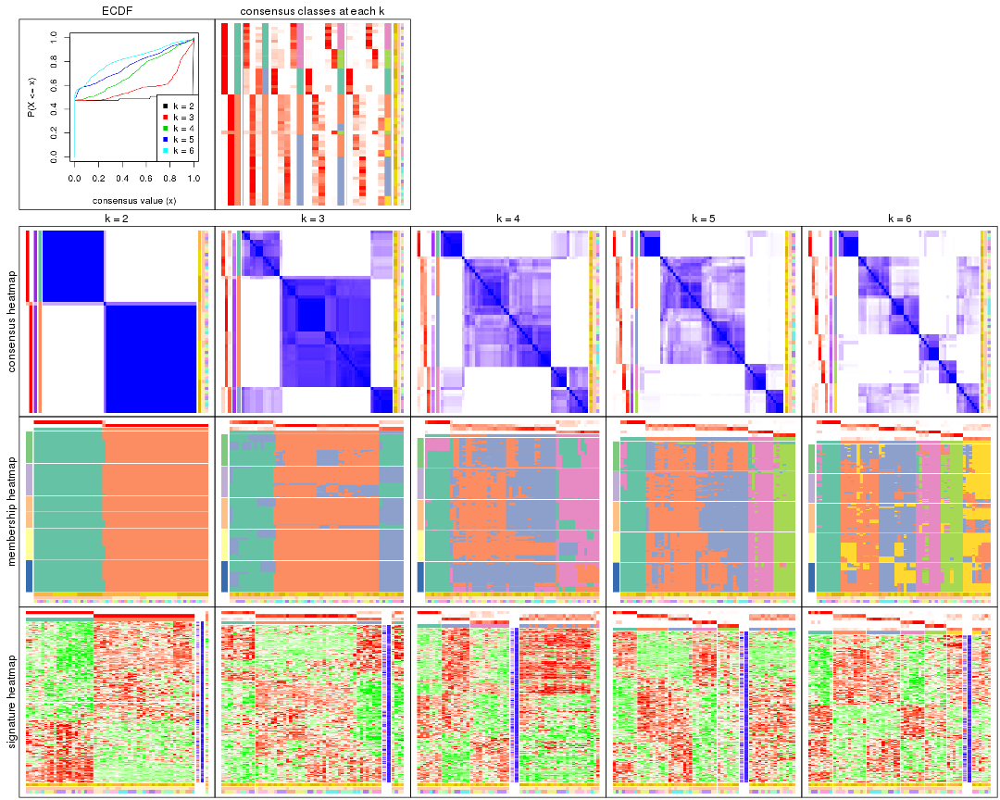

The plots are:

- The first row: a plot of the ECDF (empirical cumulative distribution
  function) curves of the consensus matrix for each `k` and the heatmap of
  predicted classes for each `k`.
- The second row: heatmaps of the consensus matrix for each `k`.
- The third row: heatmaps of the membership matrix for each `k`.
- The fouth row: heatmaps of the signatures for each `k`.

All the plots in panels can be made by individual functions and they are
plotted later in this section.

`select_partition_number()` produces several plots showing different
statistics for choosing "optimized" `k`. There are following statistics:

- ECDF curves of the consensus matrix for each `k`;
- 1-PAC. [The PAC
  score](https://en.wikipedia.org/wiki/Consensus_clustering#Over-interpretation_potential_of_consensus_clustering)
  measures the proportion of the ambiguous subgrouping.
- Mean silhouette score.
- Concordance. The mean probability of fiting the consensus class ids in all
  partitions.
- Area increased. Denote $A_k$ as the area under the ECDF curve for current
  `k`, the area increased is defined as $A_k - A_{k-1}$.
- Rand index. The percent of pairs of samples that are both in a same cluster
  or both are not in a same cluster in the partition of k and k-1.
- Jaccard index. The ratio of pairs of samples are both in a same cluster in
  the partition of k and k-1 and the pairs of samples are both in a same
  cluster in the partition k or k-1.

The detailed explanations of these statistics can be found in [the _cola_
vignette](http://bioconductor.org/packages/devel/bioc/vignettes/cola/inst/doc/cola.html#toc_13).

Generally speaking, lower PAC score, higher mean silhouette score or higher
concordance corresponds to better partition. Rand index and Jaccard index
measure how similar the current partition is compared to partition with `k-1`.
If they are too similar, we won't accept `k` is better than `k-1`.

```r
select_partition_number(res)
```

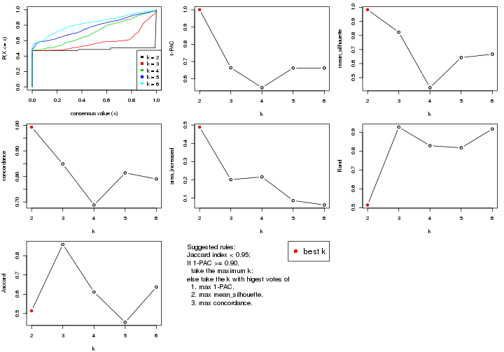

The numeric values for all these statistics can be obtained by `get_stats()`.

```r
get_stats(res)
```

```
#>   k 1-PAC mean_silhouette concordance area_increased  Rand Jaccard
#> 2 2 1.000           0.983       0.993         0.4889 0.514   0.514
#> 3 3 0.664           0.823       0.849         0.2013 0.927   0.859
#> 4 4 0.549           0.429       0.688         0.2160 0.829   0.612
#> 5 5 0.663           0.643       0.814         0.0867 0.818   0.454
#> 6 6 0.663           0.667       0.790         0.0623 0.917   0.637
```

`suggest_best_k()` suggests the best $k$ based on these statistics. The rules are as follows:

- All $k$ with Jaccard index larger than 0.95 are removed because increasing
  $k$ does not provide enough extra information. If all $k$ are removed, it is
  marked as no subgroup is detected.
- For all $k$ with 1-PAC score larger than 0.9, the maximal $k$ is taken as
  the best $k$, and other $k$ are marked as optional $k$.
- If it does not fit the second rule. The $k$ with the maximal vote of the
  highest 1-PAC score, highest mean silhouette, and highest concordance is
  taken as the best $k$.

```r
suggest_best_k(res)
```

```
#> [1] 2
```


Following shows the table of the partitions (You need to click the **show/hide
code output** link to see it). The membership matrix (columns with name `p*`)
is inferred by
[`clue::cl_consensus()`](https://www.rdocumentation.org/link/cl_consensus?package=clue)
function with the `SE` method. Basically the value in the membership matrix
represents the probability to belong to a certain group. The finall class
label for an item is determined with the group with highest probability it
belongs to.

In `get_classes()` function, the entropy is calculated from the membership
matrix and the silhouette score is calculated from the consensus matrix.


<script>
$( function() {
	$( '#tabs-SD-pam-get-classes' ).tabs();
} );
</script>
<div id='tabs-SD-pam-get-classes'>
<ul>
<li><a href='#tab-SD-pam-get-classes-1'>k = 2</a></li>
<li><a href='#tab-SD-pam-get-classes-2'>k = 3</a></li>
<li><a href='#tab-SD-pam-get-classes-3'>k = 4</a></li>
<li><a href='#tab-SD-pam-get-classes-4'>k = 5</a></li>
<li><a href='#tab-SD-pam-get-classes-5'>k = 6</a></li>
</ul>

<div id='tab-SD-pam-get-classes-1'>
<p><a id='tab-SD-pam-get-classes-1-a' style='color:#0366d6' href='#'>show/hide code output</a></p>
<pre><code class="r">cbind(get_classes(res, k = 2), get_membership(res, k = 2))
</code></pre>

<pre><code>#&gt;           class entropy silhouette    p1    p2
#&gt; GSM790742     2   0.000      0.989 0.000 1.000
#&gt; GSM790744     2   0.000      0.989 0.000 1.000
#&gt; GSM790754     2   0.000      0.989 0.000 1.000
#&gt; GSM790756     2   0.000      0.989 0.000 1.000
#&gt; GSM790768     2   0.000      0.989 0.000 1.000
#&gt; GSM790774     2   0.000      0.989 0.000 1.000
#&gt; GSM790778     2   0.000      0.989 0.000 1.000
#&gt; GSM790784     2   0.000      0.989 0.000 1.000
#&gt; GSM790790     2   0.000      0.989 0.000 1.000
#&gt; GSM790743     1   0.000      1.000 1.000 0.000
#&gt; GSM790745     1   0.000      1.000 1.000 0.000
#&gt; GSM790755     2   0.000      0.989 0.000 1.000
#&gt; GSM790757     1   0.000      1.000 1.000 0.000
#&gt; GSM790769     1   0.000      1.000 1.000 0.000
#&gt; GSM790775     1   0.000      1.000 1.000 0.000
#&gt; GSM790779     1   0.000      1.000 1.000 0.000
#&gt; GSM790785     1   0.000      1.000 1.000 0.000
#&gt; GSM790791     1   0.000      1.000 1.000 0.000
#&gt; GSM790738     2   0.000      0.989 0.000 1.000
#&gt; GSM790746     2   0.000      0.989 0.000 1.000
#&gt; GSM790752     2   0.000      0.989 0.000 1.000
#&gt; GSM790758     2   0.000      0.989 0.000 1.000
#&gt; GSM790764     2   0.000      0.989 0.000 1.000
#&gt; GSM790766     2   0.000      0.989 0.000 1.000
#&gt; GSM790772     2   0.000      0.989 0.000 1.000
#&gt; GSM790782     2   0.000      0.989 0.000 1.000
#&gt; GSM790786     2   0.000      0.989 0.000 1.000
#&gt; GSM790792     2   0.000      0.989 0.000 1.000
#&gt; GSM790739     1   0.000      1.000 1.000 0.000
#&gt; GSM790747     1   0.000      1.000 1.000 0.000
#&gt; GSM790753     1   0.000      1.000 1.000 0.000
#&gt; GSM790759     2   0.000      0.989 0.000 1.000
#&gt; GSM790765     2   0.000      0.989 0.000 1.000
#&gt; GSM790767     1   0.000      1.000 1.000 0.000
#&gt; GSM790773     1   0.000      1.000 1.000 0.000
#&gt; GSM790783     1   0.000      1.000 1.000 0.000
#&gt; GSM790787     1   0.000      1.000 1.000 0.000
#&gt; GSM790793     1   0.000      1.000 1.000 0.000
#&gt; GSM790740     2   0.000      0.989 0.000 1.000
#&gt; GSM790748     2   0.000      0.989 0.000 1.000
#&gt; GSM790750     2   0.000      0.989 0.000 1.000
#&gt; GSM790760     2   0.000      0.989 0.000 1.000
#&gt; GSM790762     2   0.000      0.989 0.000 1.000
#&gt; GSM790770     2   0.000      0.989 0.000 1.000
#&gt; GSM790776     2   0.000      0.989 0.000 1.000
#&gt; GSM790780     2   0.000      0.989 0.000 1.000
#&gt; GSM790788     2   0.000      0.989 0.000 1.000
#&gt; GSM790741     2   0.000      0.989 0.000 1.000
#&gt; GSM790749     1   0.000      1.000 1.000 0.000
#&gt; GSM790751     2   0.000      0.989 0.000 1.000
#&gt; GSM790761     1   0.000      1.000 1.000 0.000
#&gt; GSM790763     1   0.000      1.000 1.000 0.000
#&gt; GSM790771     1   0.000      1.000 1.000 0.000
#&gt; GSM790777     1   0.000      1.000 1.000 0.000
#&gt; GSM790781     2   0.952      0.408 0.372 0.628
#&gt; GSM790789     1   0.000      1.000 1.000 0.000
</code></pre>

<script>
$('#tab-SD-pam-get-classes-1-a').parent().next().next().hide();
$('#tab-SD-pam-get-classes-1-a').click(function(){
  $('#tab-SD-pam-get-classes-1-a').parent().next().next().toggle();
  return(false);
});
</script>
</div>

<div id='tab-SD-pam-get-classes-2'>
<p><a id='tab-SD-pam-get-classes-2-a' style='color:#0366d6' href='#'>show/hide code output</a></p>
<pre><code class="r">cbind(get_classes(res, k = 3), get_membership(res, k = 3))
</code></pre>

<pre><code>#&gt;           class entropy silhouette    p1    p2    p3
#&gt; GSM790742     2  0.4235      0.900 0.000 0.824 0.176
#&gt; GSM790744     2  0.3267      0.920 0.000 0.884 0.116
#&gt; GSM790754     2  0.0000      0.923 0.000 1.000 0.000
#&gt; GSM790756     2  0.1753      0.919 0.000 0.952 0.048
#&gt; GSM790768     2  0.3267      0.920 0.000 0.884 0.116
#&gt; GSM790774     2  0.2165      0.924 0.000 0.936 0.064
#&gt; GSM790778     2  0.0000      0.923 0.000 1.000 0.000
#&gt; GSM790784     2  0.0000      0.923 0.000 1.000 0.000
#&gt; GSM790790     2  0.3551      0.918 0.000 0.868 0.132
#&gt; GSM790743     1  0.0424      0.714 0.992 0.000 0.008
#&gt; GSM790745     1  0.4002      0.685 0.840 0.000 0.160
#&gt; GSM790755     2  0.2711      0.902 0.000 0.912 0.088
#&gt; GSM790757     1  0.4887      0.625 0.772 0.000 0.228
#&gt; GSM790769     1  0.5291      0.452 0.732 0.000 0.268
#&gt; GSM790775     3  0.4796      0.962 0.220 0.000 0.780
#&gt; GSM790779     3  0.4931      0.950 0.232 0.000 0.768
#&gt; GSM790785     3  0.4796      0.962 0.220 0.000 0.780
#&gt; GSM790791     1  0.1643      0.721 0.956 0.000 0.044
#&gt; GSM790738     2  0.3482      0.921 0.000 0.872 0.128
#&gt; GSM790746     2  0.3192      0.925 0.000 0.888 0.112
#&gt; GSM790752     2  0.0000      0.923 0.000 1.000 0.000
#&gt; GSM790758     2  0.0000      0.923 0.000 1.000 0.000
#&gt; GSM790764     2  0.3551      0.898 0.000 0.868 0.132
#&gt; GSM790766     2  0.3038      0.925 0.000 0.896 0.104
#&gt; GSM790772     2  0.3551      0.922 0.000 0.868 0.132
#&gt; GSM790782     2  0.0000      0.923 0.000 1.000 0.000
#&gt; GSM790786     2  0.0237      0.924 0.000 0.996 0.004
#&gt; GSM790792     2  0.3752      0.918 0.000 0.856 0.144
#&gt; GSM790739     1  0.4887      0.625 0.772 0.000 0.228
#&gt; GSM790747     1  0.5216      0.471 0.740 0.000 0.260
#&gt; GSM790753     3  0.4887      0.956 0.228 0.000 0.772
#&gt; GSM790759     2  0.4702      0.894 0.000 0.788 0.212
#&gt; GSM790765     2  0.0000      0.923 0.000 1.000 0.000
#&gt; GSM790767     1  0.3879      0.703 0.848 0.000 0.152
#&gt; GSM790773     3  0.4796      0.962 0.220 0.000 0.780
#&gt; GSM790783     3  0.5785      0.778 0.332 0.000 0.668
#&gt; GSM790787     3  0.4931      0.949 0.232 0.000 0.768
#&gt; GSM790793     1  0.4121      0.665 0.832 0.000 0.168
#&gt; GSM790740     2  0.2796      0.921 0.000 0.908 0.092
#&gt; GSM790748     2  0.4178      0.901 0.000 0.828 0.172
#&gt; GSM790750     2  0.0000      0.923 0.000 1.000 0.000
#&gt; GSM790760     2  0.3340      0.899 0.000 0.880 0.120
#&gt; GSM790762     2  0.3340      0.919 0.000 0.880 0.120
#&gt; GSM790770     2  0.4796      0.891 0.000 0.780 0.220
#&gt; GSM790776     2  0.3551      0.898 0.000 0.868 0.132
#&gt; GSM790780     2  0.0000      0.923 0.000 1.000 0.000
#&gt; GSM790788     2  0.3482      0.919 0.000 0.872 0.128
#&gt; GSM790741     2  0.3038      0.921 0.000 0.896 0.104
#&gt; GSM790749     1  0.6299     -0.342 0.524 0.000 0.476
#&gt; GSM790751     2  0.2261      0.911 0.000 0.932 0.068
#&gt; GSM790761     1  0.1860      0.719 0.948 0.000 0.052
#&gt; GSM790763     1  0.4887      0.625 0.772 0.000 0.228
#&gt; GSM790771     1  0.2711      0.702 0.912 0.000 0.088
#&gt; GSM790777     3  0.4796      0.962 0.220 0.000 0.780
#&gt; GSM790781     2  0.8937      0.334 0.184 0.564 0.252
#&gt; GSM790789     1  0.2711      0.702 0.912 0.000 0.088
</code></pre>

<script>
$('#tab-SD-pam-get-classes-2-a').parent().next().next().hide();
$('#tab-SD-pam-get-classes-2-a').click(function(){
  $('#tab-SD-pam-get-classes-2-a').parent().next().next().toggle();
  return(false);
});
</script>
</div>

<div id='tab-SD-pam-get-classes-3'>
<p><a id='tab-SD-pam-get-classes-3-a' style='color:#0366d6' href='#'>show/hide code output</a></p>
<pre><code class="r">cbind(get_classes(res, k = 4), get_membership(res, k = 4))
</code></pre>

<pre><code>#&gt;           class entropy silhouette    p1    p2    p3    p4
#&gt; GSM790742     2  0.4948   -0.05193 0.000 0.560 0.440 0.000
#&gt; GSM790744     3  0.4972   -0.42120 0.000 0.456 0.544 0.000
#&gt; GSM790754     3  0.2469    0.52530 0.000 0.108 0.892 0.000
#&gt; GSM790756     3  0.3172    0.43911 0.000 0.160 0.840 0.000
#&gt; GSM790768     3  0.4998   -0.46704 0.000 0.488 0.512 0.000
#&gt; GSM790774     3  0.4431   -0.06231 0.000 0.304 0.696 0.000
#&gt; GSM790778     3  0.2216    0.44572 0.000 0.092 0.908 0.000
#&gt; GSM790784     3  0.0921    0.51422 0.000 0.028 0.972 0.000
#&gt; GSM790790     2  0.4972    0.47461 0.000 0.544 0.456 0.000
#&gt; GSM790743     4  0.0336    0.67893 0.008 0.000 0.000 0.992
#&gt; GSM790745     4  0.7034    0.59992 0.220 0.204 0.000 0.576
#&gt; GSM790755     3  0.4040    0.42267 0.000 0.248 0.752 0.000
#&gt; GSM790757     4  0.7256    0.57114 0.256 0.204 0.000 0.540
#&gt; GSM790769     4  0.3444    0.59632 0.184 0.000 0.000 0.816
#&gt; GSM790775     1  0.0000    0.95603 1.000 0.000 0.000 0.000
#&gt; GSM790779     1  0.0592    0.94283 0.984 0.000 0.000 0.016
#&gt; GSM790785     1  0.0000    0.95603 1.000 0.000 0.000 0.000
#&gt; GSM790791     4  0.3972    0.68665 0.080 0.080 0.000 0.840
#&gt; GSM790738     2  0.4992    0.45558 0.000 0.524 0.476 0.000
#&gt; GSM790746     2  0.4999    0.18061 0.000 0.508 0.492 0.000
#&gt; GSM790752     3  0.2530    0.52596 0.000 0.112 0.888 0.000
#&gt; GSM790758     3  0.0592    0.52361 0.000 0.016 0.984 0.000
#&gt; GSM790764     3  0.4697    0.16095 0.000 0.356 0.644 0.000
#&gt; GSM790766     3  0.4948   -0.24379 0.000 0.440 0.560 0.000
#&gt; GSM790772     2  0.4999    0.41606 0.000 0.508 0.492 0.000
#&gt; GSM790782     3  0.1302    0.50514 0.000 0.044 0.956 0.000
#&gt; GSM790786     3  0.1211    0.50570 0.000 0.040 0.960 0.000
#&gt; GSM790792     2  0.4972    0.47570 0.000 0.544 0.456 0.000
#&gt; GSM790739     4  0.7256    0.57114 0.256 0.204 0.000 0.540
#&gt; GSM790747     4  0.3311    0.60827 0.172 0.000 0.000 0.828
#&gt; GSM790753     1  0.0336    0.95113 0.992 0.000 0.000 0.008
#&gt; GSM790759     2  0.3764    0.41224 0.000 0.784 0.216 0.000
#&gt; GSM790765     3  0.2081    0.53232 0.000 0.084 0.916 0.000
#&gt; GSM790767     4  0.3569    0.65115 0.196 0.000 0.000 0.804
#&gt; GSM790773     1  0.0000    0.95603 1.000 0.000 0.000 0.000
#&gt; GSM790783     1  0.3400    0.72246 0.820 0.000 0.000 0.180
#&gt; GSM790787     1  0.0592    0.94257 0.984 0.000 0.000 0.016
#&gt; GSM790793     4  0.6570    0.62012 0.164 0.204 0.000 0.632
#&gt; GSM790740     3  0.4933   -0.29521 0.000 0.432 0.568 0.000
#&gt; GSM790748     2  0.4746    0.18468 0.000 0.632 0.368 0.000
#&gt; GSM790750     3  0.2589    0.52582 0.000 0.116 0.884 0.000
#&gt; GSM790760     3  0.4790    0.26682 0.000 0.380 0.620 0.000
#&gt; GSM790762     3  0.4999   -0.47353 0.000 0.492 0.508 0.000
#&gt; GSM790770     2  0.4477    0.45070 0.000 0.688 0.312 0.000
#&gt; GSM790776     3  0.4941   -0.00965 0.000 0.436 0.564 0.000
#&gt; GSM790780     3  0.2469    0.52674 0.000 0.108 0.892 0.000
#&gt; GSM790788     2  0.4985    0.46758 0.000 0.532 0.468 0.000
#&gt; GSM790741     2  0.4998    0.24990 0.000 0.512 0.488 0.000
#&gt; GSM790749     4  0.4992   -0.06698 0.476 0.000 0.000 0.524
#&gt; GSM790751     3  0.3726    0.46077 0.000 0.212 0.788 0.000
#&gt; GSM790761     4  0.5798    0.65460 0.112 0.184 0.000 0.704
#&gt; GSM790763     4  0.7256    0.57114 0.256 0.204 0.000 0.540
#&gt; GSM790771     4  0.2281    0.65796 0.096 0.000 0.000 0.904
#&gt; GSM790777     1  0.0000    0.95603 1.000 0.000 0.000 0.000
#&gt; GSM790781     2  0.9303   -0.06150 0.256 0.392 0.256 0.096
#&gt; GSM790789     4  0.2973    0.66366 0.096 0.020 0.000 0.884
</code></pre>

<script>
$('#tab-SD-pam-get-classes-3-a').parent().next().next().hide();
$('#tab-SD-pam-get-classes-3-a').click(function(){
  $('#tab-SD-pam-get-classes-3-a').parent().next().next().toggle();
  return(false);
});
</script>
</div>

<div id='tab-SD-pam-get-classes-4'>
<p><a id='tab-SD-pam-get-classes-4-a' style='color:#0366d6' href='#'>show/hide code output</a></p>
<pre><code class="r">cbind(get_classes(res, k = 5), get_membership(res, k = 5))
</code></pre>

<pre><code>#&gt;           class entropy silhouette    p1    p2    p3    p4    p5
#&gt; GSM790742     3  0.4949     0.0813 0.000 0.396 0.572 0.000 0.032
#&gt; GSM790744     2  0.2179     0.6757 0.000 0.888 0.112 0.000 0.000
#&gt; GSM790754     3  0.2424     0.6115 0.000 0.132 0.868 0.000 0.000
#&gt; GSM790756     3  0.4930     0.4493 0.000 0.388 0.580 0.000 0.032
#&gt; GSM790768     2  0.1544     0.7024 0.000 0.932 0.068 0.000 0.000
#&gt; GSM790774     2  0.4309     0.3252 0.000 0.676 0.308 0.000 0.016
#&gt; GSM790778     3  0.4403     0.4088 0.000 0.436 0.560 0.000 0.004
#&gt; GSM790784     3  0.4299     0.4922 0.000 0.388 0.608 0.000 0.004
#&gt; GSM790790     2  0.0404     0.6984 0.000 0.988 0.000 0.000 0.012
#&gt; GSM790743     4  0.4058     0.6488 0.024 0.000 0.000 0.740 0.236
#&gt; GSM790745     5  0.1106     0.9422 0.024 0.000 0.000 0.012 0.964
#&gt; GSM790755     3  0.0162     0.5620 0.000 0.004 0.996 0.000 0.000
#&gt; GSM790757     5  0.1106     0.9422 0.024 0.000 0.000 0.012 0.964
#&gt; GSM790769     4  0.0000     0.8873 0.000 0.000 0.000 1.000 0.000
#&gt; GSM790775     1  0.0000     0.9238 1.000 0.000 0.000 0.000 0.000
#&gt; GSM790779     1  0.0000     0.9238 1.000 0.000 0.000 0.000 0.000
#&gt; GSM790785     1  0.0000     0.9238 1.000 0.000 0.000 0.000 0.000
#&gt; GSM790791     4  0.3690     0.7029 0.020 0.000 0.000 0.780 0.200
#&gt; GSM790738     2  0.1410     0.7107 0.000 0.940 0.060 0.000 0.000
#&gt; GSM790746     2  0.4410     0.2814 0.000 0.556 0.440 0.000 0.004
#&gt; GSM790752     3  0.2516     0.6136 0.000 0.140 0.860 0.000 0.000
#&gt; GSM790758     3  0.4084     0.5608 0.000 0.328 0.668 0.000 0.004
#&gt; GSM790764     3  0.5044     0.1134 0.000 0.464 0.504 0.000 0.032
#&gt; GSM790766     2  0.3774     0.4985 0.000 0.704 0.296 0.000 0.000
#&gt; GSM790772     2  0.2921     0.6563 0.000 0.856 0.124 0.000 0.020
#&gt; GSM790782     3  0.4383     0.4382 0.000 0.424 0.572 0.000 0.004
#&gt; GSM790786     3  0.4299     0.4817 0.000 0.388 0.608 0.000 0.004
#&gt; GSM790792     2  0.1341     0.7033 0.000 0.944 0.056 0.000 0.000
#&gt; GSM790739     5  0.1106     0.9422 0.024 0.000 0.000 0.012 0.964
#&gt; GSM790747     4  0.0000     0.8873 0.000 0.000 0.000 1.000 0.000
#&gt; GSM790753     1  0.0000     0.9238 1.000 0.000 0.000 0.000 0.000
#&gt; GSM790759     2  0.4602     0.4199 0.000 0.656 0.316 0.000 0.028
#&gt; GSM790765     3  0.3662     0.5862 0.000 0.252 0.744 0.000 0.004
#&gt; GSM790767     4  0.3074     0.7313 0.196 0.000 0.000 0.804 0.000
#&gt; GSM790773     1  0.0000     0.9238 1.000 0.000 0.000 0.000 0.000
#&gt; GSM790783     1  0.3561     0.6917 0.740 0.000 0.000 0.260 0.000
#&gt; GSM790787     1  0.3424     0.7174 0.760 0.000 0.000 0.240 0.000
#&gt; GSM790793     5  0.3081     0.8211 0.012 0.000 0.000 0.156 0.832
#&gt; GSM790740     2  0.3636     0.5316 0.000 0.728 0.272 0.000 0.000
#&gt; GSM790748     3  0.5028    -0.1006 0.000 0.444 0.524 0.000 0.032
#&gt; GSM790750     3  0.2561     0.6138 0.000 0.144 0.856 0.000 0.000
#&gt; GSM790760     3  0.4541     0.3509 0.000 0.288 0.680 0.000 0.032
#&gt; GSM790762     2  0.1341     0.7050 0.000 0.944 0.056 0.000 0.000
#&gt; GSM790770     2  0.2920     0.5829 0.000 0.852 0.132 0.000 0.016
#&gt; GSM790776     2  0.4966     0.0520 0.000 0.564 0.404 0.000 0.032
#&gt; GSM790780     3  0.3010     0.6052 0.000 0.172 0.824 0.000 0.004
#&gt; GSM790788     2  0.0609     0.7058 0.000 0.980 0.020 0.000 0.000
#&gt; GSM790741     2  0.4045     0.4345 0.000 0.644 0.356 0.000 0.000
#&gt; GSM790749     4  0.0404     0.8823 0.012 0.000 0.000 0.988 0.000
#&gt; GSM790751     3  0.1270     0.5868 0.000 0.052 0.948 0.000 0.000
#&gt; GSM790761     5  0.2209     0.9228 0.032 0.000 0.000 0.056 0.912
#&gt; GSM790763     5  0.2520     0.9165 0.056 0.000 0.000 0.048 0.896
#&gt; GSM790771     4  0.0000     0.8873 0.000 0.000 0.000 1.000 0.000
#&gt; GSM790777     1  0.0000     0.9238 1.000 0.000 0.000 0.000 0.000
#&gt; GSM790781     5  0.1913     0.9095 0.020 0.020 0.024 0.000 0.936
#&gt; GSM790789     4  0.0880     0.8763 0.000 0.000 0.000 0.968 0.032
</code></pre>

<script>
$('#tab-SD-pam-get-classes-4-a').parent().next().next().hide();
$('#tab-SD-pam-get-classes-4-a').click(function(){
  $('#tab-SD-pam-get-classes-4-a').parent().next().next().toggle();
  return(false);
});
</script>
</div>

<div id='tab-SD-pam-get-classes-5'>
<p><a id='tab-SD-pam-get-classes-5-a' style='color:#0366d6' href='#'>show/hide code output</a></p>
<pre><code class="r">cbind(get_classes(res, k = 6), get_membership(res, k = 6))
</code></pre>

<pre><code>#&gt;           class entropy silhouette    p1    p2    p3    p4    p5    p6
#&gt; GSM790742     6  0.4929     0.5733 0.000 0.300 0.092 0.000 0.000 0.608
#&gt; GSM790744     2  0.4410     0.6715 0.000 0.716 0.120 0.000 0.000 0.164
#&gt; GSM790754     3  0.0000     0.7214 0.000 0.000 1.000 0.000 0.000 0.000
#&gt; GSM790756     6  0.4317     0.3510 0.000 0.060 0.252 0.000 0.000 0.688
#&gt; GSM790768     2  0.3586     0.6940 0.000 0.796 0.124 0.000 0.000 0.080
#&gt; GSM790774     6  0.4990     0.2842 0.000 0.152 0.204 0.000 0.000 0.644
#&gt; GSM790778     3  0.4735     0.6111 0.000 0.076 0.628 0.000 0.000 0.296
#&gt; GSM790784     3  0.4970     0.5530 0.000 0.084 0.580 0.000 0.000 0.336
#&gt; GSM790790     2  0.3967     0.5162 0.000 0.760 0.092 0.000 0.000 0.148
#&gt; GSM790743     4  0.5305     0.5541 0.012 0.044 0.000 0.680 0.200 0.064
#&gt; GSM790745     5  0.0146     0.8594 0.004 0.000 0.000 0.000 0.996 0.000
#&gt; GSM790755     3  0.2009     0.6295 0.000 0.024 0.908 0.000 0.000 0.068
#&gt; GSM790757     5  0.0000     0.8587 0.000 0.000 0.000 0.000 1.000 0.000
#&gt; GSM790769     4  0.0000     0.8413 0.000 0.000 0.000 1.000 0.000 0.000
#&gt; GSM790775     1  0.0000     0.9157 1.000 0.000 0.000 0.000 0.000 0.000
#&gt; GSM790779     1  0.0000     0.9157 1.000 0.000 0.000 0.000 0.000 0.000
#&gt; GSM790785     1  0.0000     0.9157 1.000 0.000 0.000 0.000 0.000 0.000
#&gt; GSM790791     4  0.4856     0.5376 0.012 0.024 0.000 0.672 0.260 0.032
#&gt; GSM790738     2  0.4657     0.6745 0.000 0.688 0.136 0.000 0.000 0.176
#&gt; GSM790746     2  0.5549     0.5541 0.000 0.532 0.304 0.000 0.000 0.164
#&gt; GSM790752     3  0.0000     0.7214 0.000 0.000 1.000 0.000 0.000 0.000
#&gt; GSM790758     3  0.3907     0.6566 0.000 0.028 0.704 0.000 0.000 0.268
#&gt; GSM790764     6  0.5119     0.5725 0.000 0.308 0.108 0.000 0.000 0.584
#&gt; GSM790766     2  0.4516     0.5927 0.000 0.668 0.260 0.000 0.000 0.072
#&gt; GSM790772     6  0.4374     0.3518 0.000 0.192 0.096 0.000 0.000 0.712
#&gt; GSM790782     3  0.6100     0.0889 0.000 0.304 0.384 0.000 0.000 0.312
#&gt; GSM790786     3  0.3683     0.7191 0.000 0.048 0.768 0.000 0.000 0.184
#&gt; GSM790792     2  0.2852     0.6367 0.000 0.856 0.080 0.000 0.000 0.064
#&gt; GSM790739     5  0.0146     0.8594 0.004 0.000 0.000 0.000 0.996 0.000
#&gt; GSM790747     4  0.0000     0.8413 0.000 0.000 0.000 1.000 0.000 0.000
#&gt; GSM790753     1  0.0260     0.9121 0.992 0.008 0.000 0.000 0.000 0.000
#&gt; GSM790759     6  0.5202     0.4224 0.000 0.196 0.188 0.000 0.000 0.616
#&gt; GSM790765     3  0.3156     0.7282 0.000 0.020 0.800 0.000 0.000 0.180
#&gt; GSM790767     4  0.2948     0.7055 0.188 0.008 0.000 0.804 0.000 0.000
#&gt; GSM790773     1  0.0000     0.9157 1.000 0.000 0.000 0.000 0.000 0.000
#&gt; GSM790783     1  0.3198     0.6843 0.740 0.000 0.000 0.260 0.000 0.000
#&gt; GSM790787     1  0.3989     0.6584 0.716 0.024 0.000 0.252 0.000 0.008
#&gt; GSM790793     5  0.4156     0.7116 0.004 0.024 0.000 0.184 0.756 0.032
#&gt; GSM790740     2  0.5535     0.5767 0.000 0.532 0.308 0.000 0.000 0.160
#&gt; GSM790748     6  0.4926     0.5395 0.000 0.336 0.080 0.000 0.000 0.584
#&gt; GSM790750     3  0.0146     0.7196 0.000 0.000 0.996 0.000 0.000 0.004
#&gt; GSM790760     6  0.5079     0.6037 0.000 0.148 0.224 0.000 0.000 0.628
#&gt; GSM790762     2  0.2629     0.6913 0.000 0.868 0.092 0.000 0.000 0.040
#&gt; GSM790770     2  0.3428     0.3094 0.000 0.696 0.000 0.000 0.000 0.304
#&gt; GSM790776     6  0.4328     0.6111 0.000 0.164 0.112 0.000 0.000 0.724
#&gt; GSM790780     3  0.3176     0.7294 0.000 0.032 0.812 0.000 0.000 0.156
#&gt; GSM790788     2  0.1714     0.6788 0.000 0.908 0.092 0.000 0.000 0.000
#&gt; GSM790741     2  0.5544     0.5453 0.000 0.500 0.356 0.000 0.000 0.144
#&gt; GSM790749     4  0.0000     0.8413 0.000 0.000 0.000 1.000 0.000 0.000
#&gt; GSM790751     3  0.1219     0.6796 0.000 0.004 0.948 0.000 0.000 0.048
#&gt; GSM790761     5  0.5021     0.7511 0.008 0.068 0.000 0.096 0.732 0.096
#&gt; GSM790763     5  0.4132     0.7897 0.048 0.024 0.000 0.092 0.804 0.032
#&gt; GSM790771     4  0.0000     0.8413 0.000 0.000 0.000 1.000 0.000 0.000
#&gt; GSM790777     1  0.0000     0.9157 1.000 0.000 0.000 0.000 0.000 0.000
#&gt; GSM790781     5  0.2333     0.7706 0.004 0.000 0.004 0.000 0.872 0.120
#&gt; GSM790789     4  0.3381     0.7465 0.000 0.024 0.000 0.828 0.116 0.032
</code></pre>

<script>
$('#tab-SD-pam-get-classes-5-a').parent().next().next().hide();
$('#tab-SD-pam-get-classes-5-a').click(function(){
  $('#tab-SD-pam-get-classes-5-a').parent().next().next().toggle();
  return(false);
});
</script>
</div>
</div>

Heatmaps for the consensus matrix. It visualizes the probability of two
samples to be in a same group.


<script>
$( function() {
	$( '#tabs-SD-pam-consensus-heatmap' ).tabs();
} );
</script>
<div id='tabs-SD-pam-consensus-heatmap'>
<ul>
<li><a href='#tab-SD-pam-consensus-heatmap-1'>k = 2</a></li>
<li><a href='#tab-SD-pam-consensus-heatmap-2'>k = 3</a></li>
<li><a href='#tab-SD-pam-consensus-heatmap-3'>k = 4</a></li>
<li><a href='#tab-SD-pam-consensus-heatmap-4'>k = 5</a></li>
<li><a href='#tab-SD-pam-consensus-heatmap-5'>k = 6</a></li>
</ul>
<div id='tab-SD-pam-consensus-heatmap-1'>
<pre><code class="r">consensus_heatmap(res, k = 2)
</code></pre>

<p>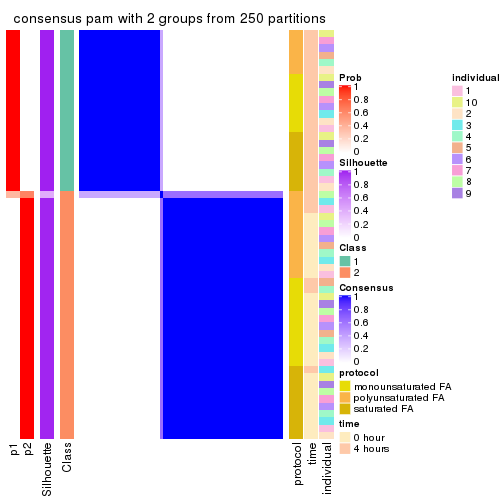</p>

</div>
<div id='tab-SD-pam-consensus-heatmap-2'>
<pre><code class="r">consensus_heatmap(res, k = 3)
</code></pre>

<p>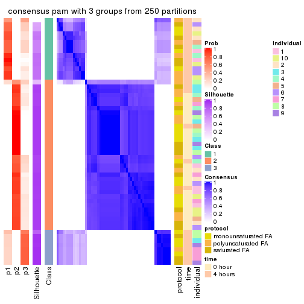</p>

</div>
<div id='tab-SD-pam-consensus-heatmap-3'>
<pre><code class="r">consensus_heatmap(res, k = 4)
</code></pre>

<p>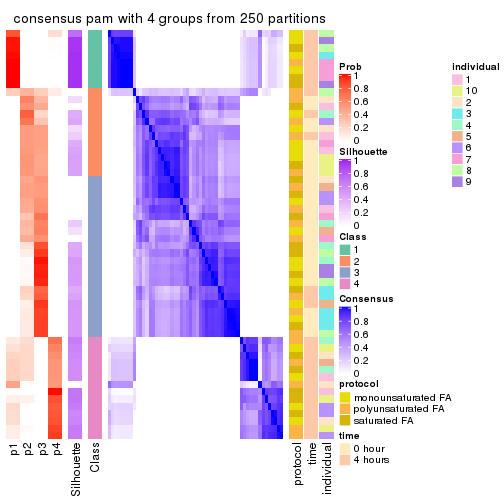</p>

</div>
<div id='tab-SD-pam-consensus-heatmap-4'>
<pre><code class="r">consensus_heatmap(res, k = 5)
</code></pre>

<p>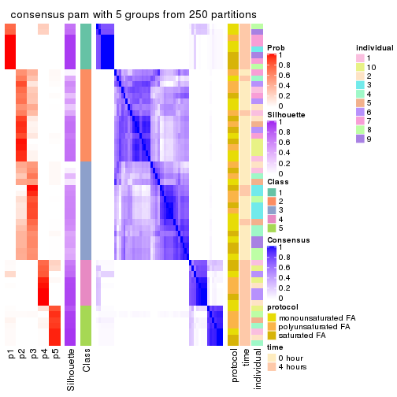</p>

</div>
<div id='tab-SD-pam-consensus-heatmap-5'>
<pre><code class="r">consensus_heatmap(res, k = 6)
</code></pre>

<p>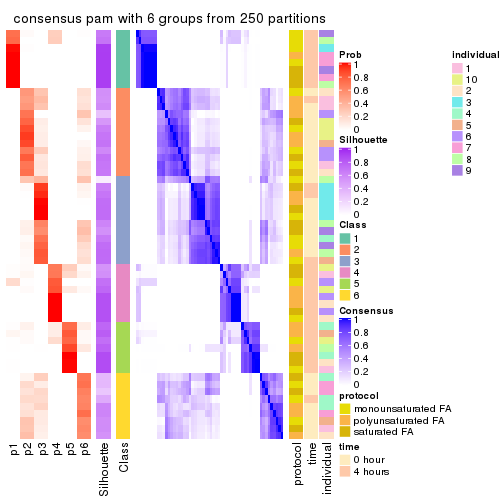</p>

</div>
</div>

Heatmaps for the membership of samples in all partitions to see how consistent they are:


<script>
$( function() {
	$( '#tabs-SD-pam-membership-heatmap' ).tabs();
} );
</script>
<div id='tabs-SD-pam-membership-heatmap'>
<ul>
<li><a href='#tab-SD-pam-membership-heatmap-1'>k = 2</a></li>
<li><a href='#tab-SD-pam-membership-heatmap-2'>k = 3</a></li>
<li><a href='#tab-SD-pam-membership-heatmap-3'>k = 4</a></li>
<li><a href='#tab-SD-pam-membership-heatmap-4'>k = 5</a></li>
<li><a href='#tab-SD-pam-membership-heatmap-5'>k = 6</a></li>
</ul>
<div id='tab-SD-pam-membership-heatmap-1'>
<pre><code class="r">membership_heatmap(res, k = 2)
</code></pre>

<p>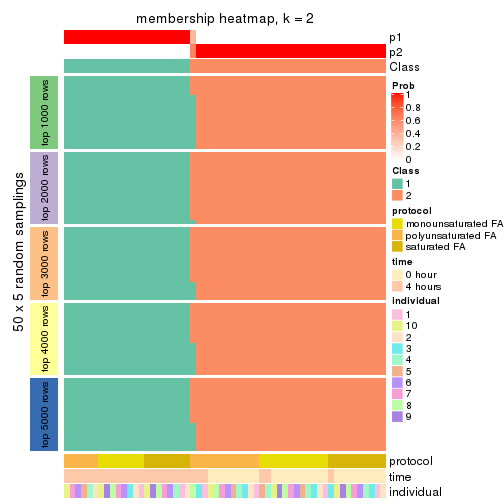</p>

</div>
<div id='tab-SD-pam-membership-heatmap-2'>
<pre><code class="r">membership_heatmap(res, k = 3)
</code></pre>

<p>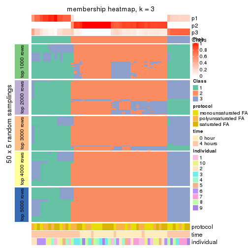</p>

</div>
<div id='tab-SD-pam-membership-heatmap-3'>
<pre><code class="r">membership_heatmap(res, k = 4)
</code></pre>

<p>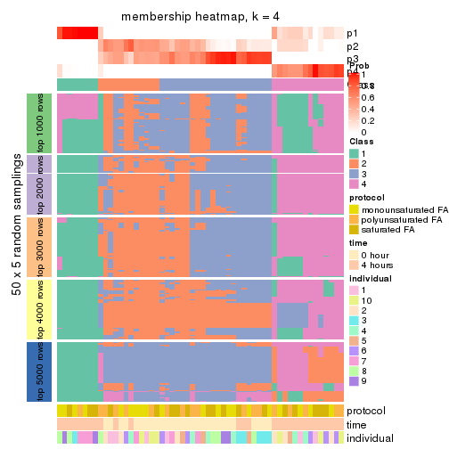</p>

</div>
<div id='tab-SD-pam-membership-heatmap-4'>
<pre><code class="r">membership_heatmap(res, k = 5)
</code></pre>

<p>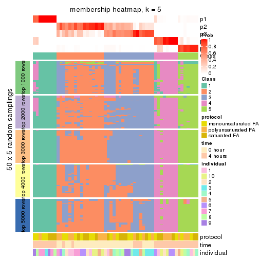</p>

</div>
<div id='tab-SD-pam-membership-heatmap-5'>
<pre><code class="r">membership_heatmap(res, k = 6)
</code></pre>

<p>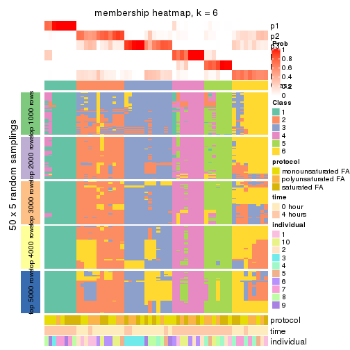</p>

</div>
</div>

As soon as we have had the classes for columns, we can look for signatures
which are significantly different between classes which can be candidate marks
for certain classes. Following are the heatmaps for signatures.


Signature heatmaps where rows are scaled:


<script>
$( function() {
	$( '#tabs-SD-pam-get-signatures' ).tabs();
} );
</script>
<div id='tabs-SD-pam-get-signatures'>
<ul>
<li><a href='#tab-SD-pam-get-signatures-1'>k = 2</a></li>
<li><a href='#tab-SD-pam-get-signatures-2'>k = 3</a></li>
<li><a href='#tab-SD-pam-get-signatures-3'>k = 4</a></li>
<li><a href='#tab-SD-pam-get-signatures-4'>k = 5</a></li>
<li><a href='#tab-SD-pam-get-signatures-5'>k = 6</a></li>
</ul>
<div id='tab-SD-pam-get-signatures-1'>
<pre><code class="r">get_signatures(res, k = 2)
</code></pre>

<p>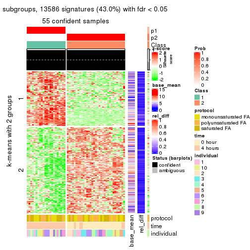</p>

</div>
<div id='tab-SD-pam-get-signatures-2'>
<pre><code class="r">get_signatures(res, k = 3)
</code></pre>

<p>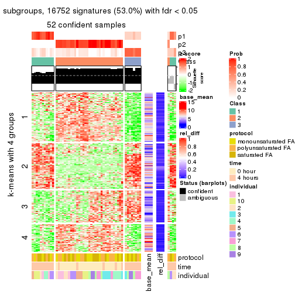</p>

</div>
<div id='tab-SD-pam-get-signatures-3'>
<pre><code class="r">get_signatures(res, k = 4)
</code></pre>

<p>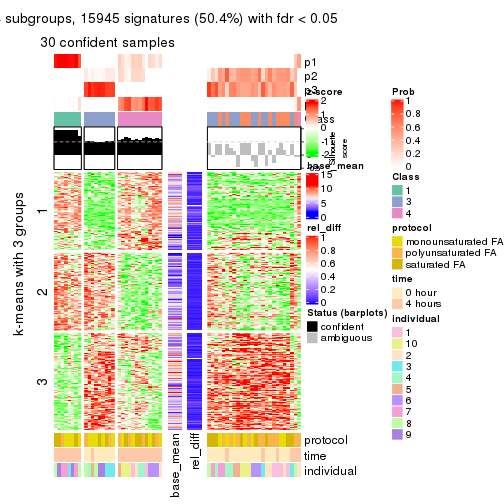</p>

</div>
<div id='tab-SD-pam-get-signatures-4'>
<pre><code class="r">get_signatures(res, k = 5)
</code></pre>

<p>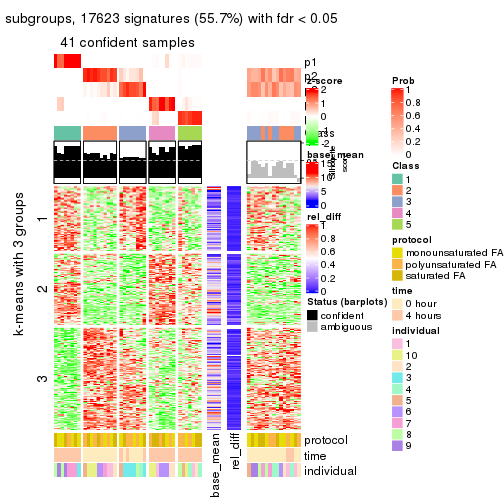</p>

</div>
<div id='tab-SD-pam-get-signatures-5'>
<pre><code class="r">get_signatures(res, k = 6)
</code></pre>

<p>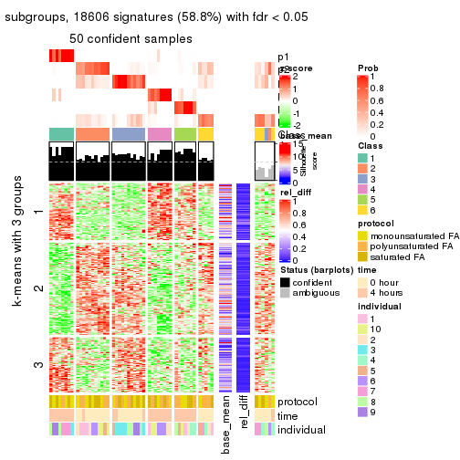</p>

</div>
</div>


Signature heatmaps where rows are not scaled:


<script>
$( function() {
	$( '#tabs-SD-pam-get-signatures-no-scale' ).tabs();
} );
</script>
<div id='tabs-SD-pam-get-signatures-no-scale'>
<ul>
<li><a href='#tab-SD-pam-get-signatures-no-scale-1'>k = 2</a></li>
<li><a href='#tab-SD-pam-get-signatures-no-scale-2'>k = 3</a></li>
<li><a href='#tab-SD-pam-get-signatures-no-scale-3'>k = 4</a></li>
<li><a href='#tab-SD-pam-get-signatures-no-scale-4'>k = 5</a></li>
<li><a href='#tab-SD-pam-get-signatures-no-scale-5'>k = 6</a></li>
</ul>
<div id='tab-SD-pam-get-signatures-no-scale-1'>
<pre><code class="r">get_signatures(res, k = 2, scale_rows = FALSE)
</code></pre>

<p>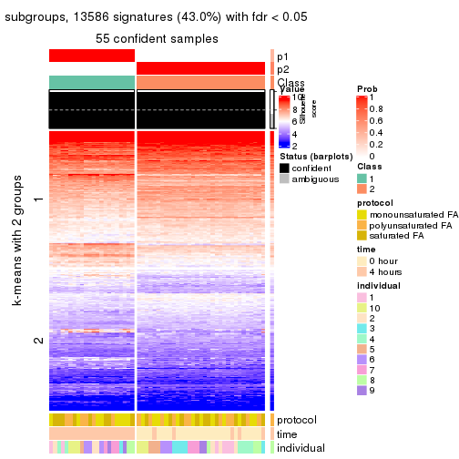</p>

</div>
<div id='tab-SD-pam-get-signatures-no-scale-2'>
<pre><code class="r">get_signatures(res, k = 3, scale_rows = FALSE)
</code></pre>

<p>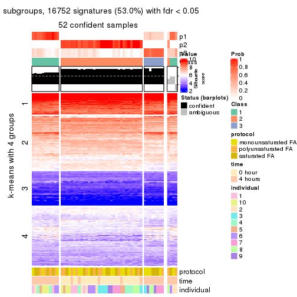</p>

</div>
<div id='tab-SD-pam-get-signatures-no-scale-3'>
<pre><code class="r">get_signatures(res, k = 4, scale_rows = FALSE)
</code></pre>

<p>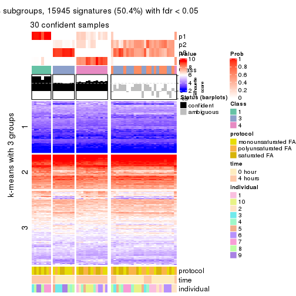</p>

</div>
<div id='tab-SD-pam-get-signatures-no-scale-4'>
<pre><code class="r">get_signatures(res, k = 5, scale_rows = FALSE)
</code></pre>

<p>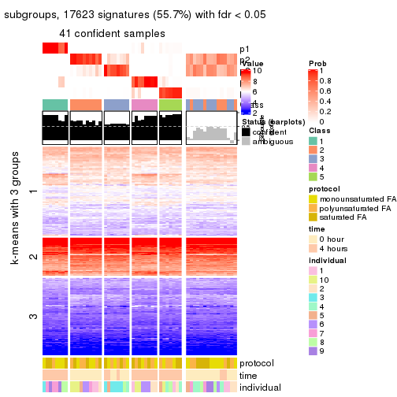</p>

</div>
<div id='tab-SD-pam-get-signatures-no-scale-5'>
<pre><code class="r">get_signatures(res, k = 6, scale_rows = FALSE)
</code></pre>

<p>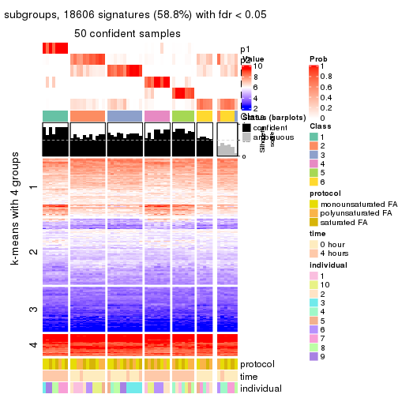</p>

</div>
</div>


Compare the overlap of signatures from different k:

```r
compare_signatures(res)
```

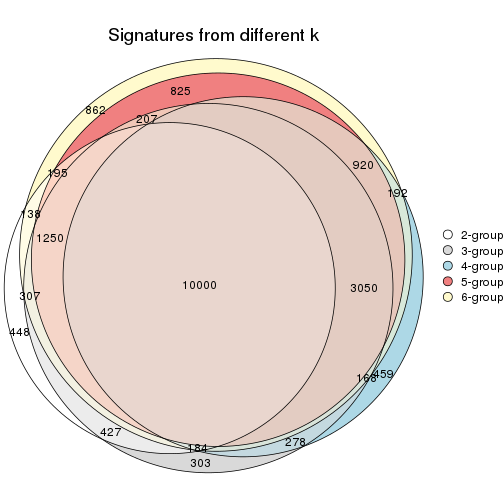

`get_signature()` returns a data frame invisibly. TO get the list of signatures, the function
call should be assigned to a variable explicitly. In following code, if `plot` argument is set
to `FALSE`, no heatmap is plotted while only the differential analysis is performed.

```r
# code only for demonstration
tb = get_signature(res, k = ..., plot = FALSE)
```

An example of the output of `tb` is:

```
#>   which_row         fdr    mean_1    mean_2 scaled_mean_1 scaled_mean_2 km
#> 1        38 0.042760348  8.373488  9.131774    -0.5533452     0.5164555  1
#> 2        40 0.018707592  7.106213  8.469186    -0.6173731     0.5762149  1
#> 3        55 0.019134737 10.221463 11.207825    -0.6159697     0.5749050  1
#> 4        59 0.006059896  5.921854  7.869574    -0.6899429     0.6439467  1
#> 5        60 0.018055526  8.928898 10.211722    -0.6204761     0.5791110  1
#> 6        98 0.009384629 15.714769 14.887706     0.6635654    -0.6193277  2
...
```

The columns in `tb` are:

1. `which_row`: row indices corresponding to the input matrix.
2. `fdr`: FDR for the differential test. 
3. `mean_x`: The mean value in group x.
4. `scaled_mean_x`: The mean value in group x after rows are scaled.
5. `km`: Row groups if k-means clustering is applied to rows.


UMAP plot which shows how samples are separated.


<script>
$( function() {
	$( '#tabs-SD-pam-dimension-reduction' ).tabs();
} );
</script>
<div id='tabs-SD-pam-dimension-reduction'>
<ul>
<li><a href='#tab-SD-pam-dimension-reduction-1'>k = 2</a></li>
<li><a href='#tab-SD-pam-dimension-reduction-2'>k = 3</a></li>
<li><a href='#tab-SD-pam-dimension-reduction-3'>k = 4</a></li>
<li><a href='#tab-SD-pam-dimension-reduction-4'>k = 5</a></li>
<li><a href='#tab-SD-pam-dimension-reduction-5'>k = 6</a></li>
</ul>
<div id='tab-SD-pam-dimension-reduction-1'>
<pre><code class="r">dimension_reduction(res, k = 2, method = &quot;UMAP&quot;)
</code></pre>

<p>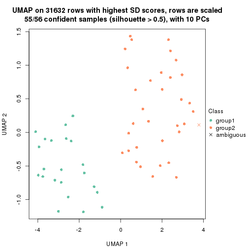</p>

</div>
<div id='tab-SD-pam-dimension-reduction-2'>
<pre><code class="r">dimension_reduction(res, k = 3, method = &quot;UMAP&quot;)
</code></pre>

<p>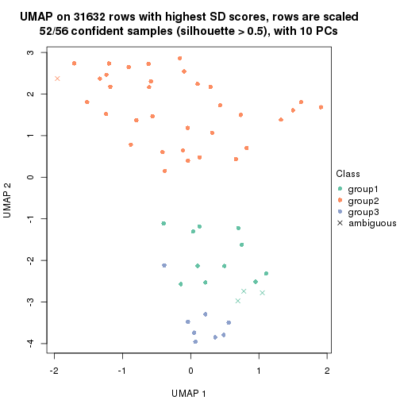</p>

</div>
<div id='tab-SD-pam-dimension-reduction-3'>
<pre><code class="r">dimension_reduction(res, k = 4, method = &quot;UMAP&quot;)
</code></pre>

<p>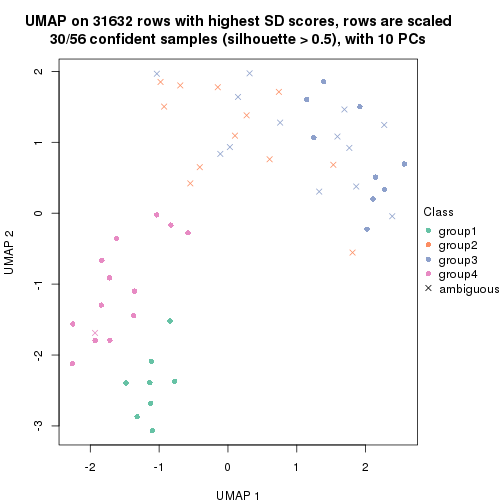</p>

</div>
<div id='tab-SD-pam-dimension-reduction-4'>
<pre><code class="r">dimension_reduction(res, k = 5, method = &quot;UMAP&quot;)
</code></pre>

<p>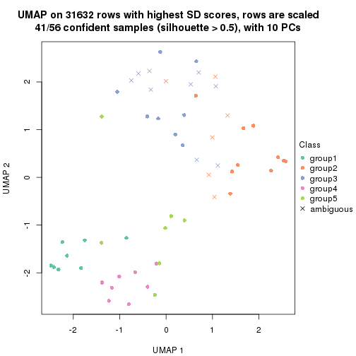</p>

</div>
<div id='tab-SD-pam-dimension-reduction-5'>
<pre><code class="r">dimension_reduction(res, k = 6, method = &quot;UMAP&quot;)
</code></pre>

<p>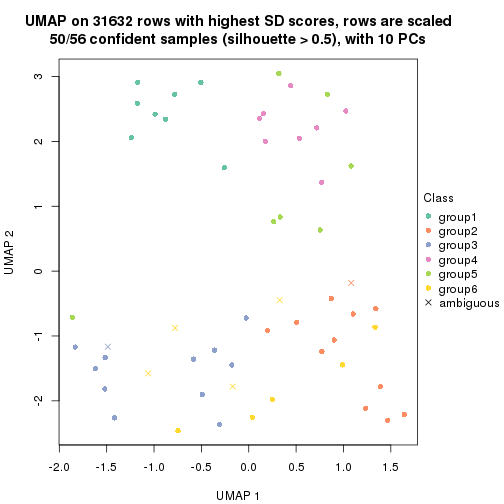</p>

</div>
</div>


Following heatmap shows how subgroups are split when increasing `k`:

```r
collect_classes(res)
```

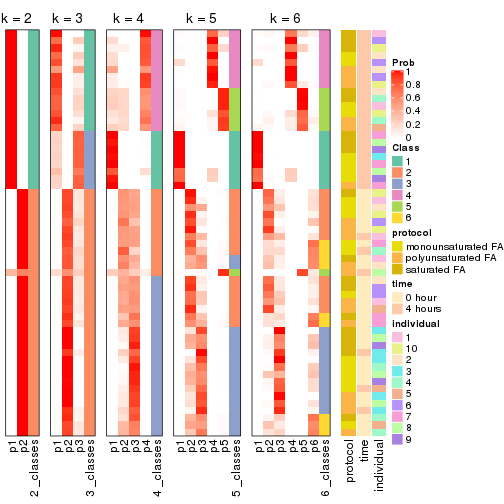


Test correlation between subgroups and known annotations. If the known
annotation is numeric, one-way ANOVA test is applied, and if the known
annotation is discrete, chi-squared contingency table test is applied.

```r
test_to_known_factors(res)
```

```
#>         n protocol(p)  time(p) individual(p) k
#> SD:pam 55       0.859 3.84e-09       0.95913 2
#> SD:pam 52       0.761 2.60e-08       0.15149 3
#> SD:pam 30       0.725 2.97e-06       0.01281 4
#> SD:pam 41       0.955 1.24e-06       0.00281 5
#> SD:pam 50       0.940 4.63e-07       0.00570 6
```


If matrix rows can be associated to genes, consider to use `functional_enrichment(res,
...)` to perform function enrichment for the signature genes. See [this vignette](http://bioconductor.org/packages/devel/bioc/vignettes/cola/inst/doc/functional_enrichment.html) for more detailed explanations.


 

---------------------------------------------------


### SD:mclust**


The object with results only for a single top-value method and a single partition method 
can be extracted as:

```r
res = res_list["SD", "mclust"]
# you can also extract it by
# res = res_list["SD:mclust"]
```

A summary of `res` and all the functions that can be applied to it:

```r
res
```

```
#> A 'ConsensusPartition' object with k = 2, 3, 4, 5, 6.
#>   On a matrix with 31632 rows and 56 columns.
#>   Top rows (1000, 2000, 3000, 4000, 5000) are extracted by 'SD' method.
#>   Subgroups are detected by 'mclust' method.
#>   Performed in total 1250 partitions by row resampling.
#>   Best k for subgroups seems to be 2.
#> 
#> Following methods can be applied to this 'ConsensusPartition' object:
#>  [1] "cola_report"             "collect_classes"         "collect_plots"          
#>  [4] "collect_stats"           "colnames"                "compare_signatures"     
#>  [7] "consensus_heatmap"       "dimension_reduction"     "functional_enrichment"  
#> [10] "get_anno_col"            "get_anno"                "get_classes"            
#> [13] "get_consensus"           "get_matrix"              "get_membership"         
#> [16] "get_param"               "get_signatures"          "get_stats"              
#> [19] "is_best_k"               "is_stable_k"             "membership_heatmap"     
#> [22] "ncol"                    "nrow"                    "plot_ecdf"              
#> [25] "rownames"                "select_partition_number" "show"                   
#> [28] "suggest_best_k"          "test_to_known_factors"
```

`collect_plots()` function collects all the plots made from `res` for all `k` (number of partitions)
into one single page to provide an easy and fast comparison between different `k`.

```r
collect_plots(res)
```

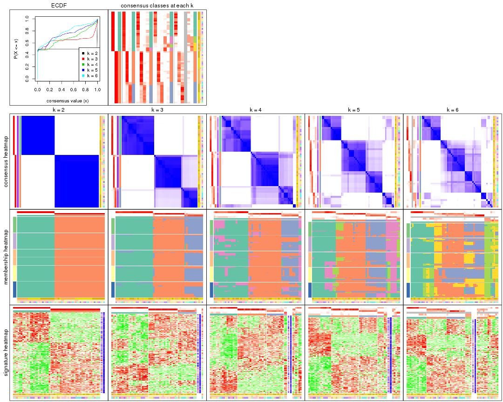

The plots are:

- The first row: a plot of the ECDF (empirical cumulative distribution
  function) curves of the consensus matrix for each `k` and the heatmap of
  predicted classes for each `k`.
- The second row: heatmaps of the consensus matrix for each `k`.
- The third row: heatmaps of the membership matrix for each `k`.
- The fouth row: heatmaps of the signatures for each `k`.

All the plots in panels can be made by individual functions and they are
plotted later in this section.

`select_partition_number()` produces several plots showing different
statistics for choosing "optimized" `k`. There are following statistics:

- ECDF curves of the consensus matrix for each `k`;
- 1-PAC. [The PAC
  score](https://en.wikipedia.org/wiki/Consensus_clustering#Over-interpretation_potential_of_consensus_clustering)
  measures the proportion of the ambiguous subgrouping.
- Mean silhouette score.
- Concordance. The mean probability of fiting the consensus class ids in all
  partitions.
- Area increased. Denote $A_k$ as the area under the ECDF curve for current
  `k`, the area increased is defined as $A_k - A_{k-1}$.
- Rand index. The percent of pairs of samples that are both in a same cluster
  or both are not in a same cluster in the partition of k and k-1.
- Jaccard index. The ratio of pairs of samples are both in a same cluster in
  the partition of k and k-1 and the pairs of samples are both in a same
  cluster in the partition k or k-1.

The detailed explanations of these statistics can be found in [the _cola_
vignette](http://bioconductor.org/packages/devel/bioc/vignettes/cola/inst/doc/cola.html#toc_13).

Generally speaking, lower PAC score, higher mean silhouette score or higher
concordance corresponds to better partition. Rand index and Jaccard index
measure how similar the current partition is compared to partition with `k-1`.
If they are too similar, we won't accept `k` is better than `k-1`.

```r
select_partition_number(res)
```

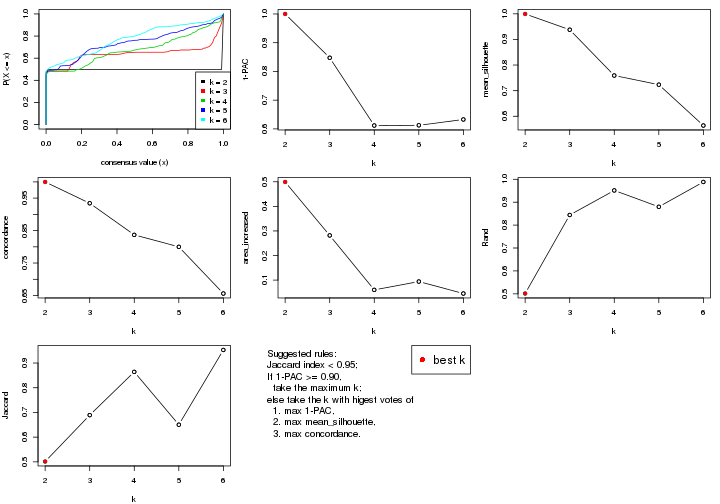

The numeric values for all these statistics can be obtained by `get_stats()`.

```r
get_stats(res)
```

```
#>   k 1-PAC mean_silhouette concordance area_increased  Rand Jaccard
#> 2 2 1.000           0.999       1.000         0.4992 0.501   0.501
#> 3 3 0.848           0.938       0.934         0.2817 0.844   0.689
#> 4 4 0.612           0.759       0.837         0.0602 0.951   0.864
#> 5 5 0.612           0.723       0.800         0.0940 0.880   0.650
#> 6 6 0.633           0.564       0.656         0.0453 0.988   0.953
```

`suggest_best_k()` suggests the best $k$ based on these statistics. The rules are as follows:

- All $k$ with Jaccard index larger than 0.95 are removed because increasing
  $k$ does not provide enough extra information. If all $k$ are removed, it is
  marked as no subgroup is detected.
- For all $k$ with 1-PAC score larger than 0.9, the maximal $k$ is taken as
  the best $k$, and other $k$ are marked as optional $k$.
- If it does not fit the second rule. The $k$ with the maximal vote of the
  highest 1-PAC score, highest mean silhouette, and highest concordance is
  taken as the best $k$.

```r
suggest_best_k(res)
```

```
#> [1] 2
```


Following shows the table of the partitions (You need to click the **show/hide
code output** link to see it). The membership matrix (columns with name `p*`)
is inferred by
[`clue::cl_consensus()`](https://www.rdocumentation.org/link/cl_consensus?package=clue)
function with the `SE` method. Basically the value in the membership matrix
represents the probability to belong to a certain group. The finall class
label for an item is determined with the group with highest probability it
belongs to.

In `get_classes()` function, the entropy is calculated from the membership
matrix and the silhouette score is calculated from the consensus matrix.


<script>
$( function() {
	$( '#tabs-SD-mclust-get-classes' ).tabs();
} );
</script>
<div id='tabs-SD-mclust-get-classes'>
<ul>
<li><a href='#tab-SD-mclust-get-classes-1'>k = 2</a></li>
<li><a href='#tab-SD-mclust-get-classes-2'>k = 3</a></li>
<li><a href='#tab-SD-mclust-get-classes-3'>k = 4</a></li>
<li><a href='#tab-SD-mclust-get-classes-4'>k = 5</a></li>
<li><a href='#tab-SD-mclust-get-classes-5'>k = 6</a></li>
</ul>

<div id='tab-SD-mclust-get-classes-1'>
<p><a id='tab-SD-mclust-get-classes-1-a' style='color:#0366d6' href='#'>show/hide code output</a></p>
<pre><code class="r">cbind(get_classes(res, k = 2), get_membership(res, k = 2))
</code></pre>

<pre><code>#&gt;           class entropy silhouette    p1    p2
#&gt; GSM790742     2  0.0376      0.996 0.004 0.996
#&gt; GSM790744     2  0.0000      0.999 0.000 1.000
#&gt; GSM790754     2  0.0000      0.999 0.000 1.000
#&gt; GSM790756     2  0.0000      0.999 0.000 1.000
#&gt; GSM790768     2  0.0000      0.999 0.000 1.000
#&gt; GSM790774     2  0.0000      0.999 0.000 1.000
#&gt; GSM790778     2  0.0000      0.999 0.000 1.000
#&gt; GSM790784     2  0.0000      0.999 0.000 1.000
#&gt; GSM790790     2  0.0000      0.999 0.000 1.000
#&gt; GSM790743     1  0.0000      1.000 1.000 0.000
#&gt; GSM790745     1  0.0000      1.000 1.000 0.000
#&gt; GSM790755     1  0.0000      1.000 1.000 0.000
#&gt; GSM790757     1  0.0000      1.000 1.000 0.000
#&gt; GSM790769     1  0.0000      1.000 1.000 0.000
#&gt; GSM790775     1  0.0000      1.000 1.000 0.000
#&gt; GSM790779     1  0.0000      1.000 1.000 0.000
#&gt; GSM790785     1  0.0000      1.000 1.000 0.000
#&gt; GSM790791     1  0.0000      1.000 1.000 0.000
#&gt; GSM790738     2  0.0000      0.999 0.000 1.000
#&gt; GSM790746     2  0.0000      0.999 0.000 1.000
#&gt; GSM790752     2  0.0000      0.999 0.000 1.000
#&gt; GSM790758     2  0.0000      0.999 0.000 1.000
#&gt; GSM790764     2  0.0376      0.996 0.004 0.996
#&gt; GSM790766     2  0.0000      0.999 0.000 1.000
#&gt; GSM790772     2  0.0000      0.999 0.000 1.000
#&gt; GSM790782     2  0.0000      0.999 0.000 1.000
#&gt; GSM790786     2  0.0000      0.999 0.000 1.000
#&gt; GSM790792     2  0.0000      0.999 0.000 1.000
#&gt; GSM790739     1  0.0000      1.000 1.000 0.000
#&gt; GSM790747     1  0.0000      1.000 1.000 0.000
#&gt; GSM790753     1  0.0000      1.000 1.000 0.000
#&gt; GSM790759     2  0.0000      0.999 0.000 1.000
#&gt; GSM790765     2  0.0000      0.999 0.000 1.000
#&gt; GSM790767     1  0.0000      1.000 1.000 0.000
#&gt; GSM790773     1  0.0000      1.000 1.000 0.000
#&gt; GSM790783     1  0.0000      1.000 1.000 0.000
#&gt; GSM790787     1  0.0000      1.000 1.000 0.000
#&gt; GSM790793     1  0.0000      1.000 1.000 0.000
#&gt; GSM790740     2  0.0000      0.999 0.000 1.000
#&gt; GSM790748     2  0.0376      0.996 0.004 0.996
#&gt; GSM790750     2  0.0000      0.999 0.000 1.000
#&gt; GSM790760     2  0.0376      0.996 0.004 0.996
#&gt; GSM790762     2  0.0000      0.999 0.000 1.000
#&gt; GSM790770     2  0.0000      0.999 0.000 1.000
#&gt; GSM790776     2  0.0000      0.999 0.000 1.000
#&gt; GSM790780     2  0.0000      0.999 0.000 1.000
#&gt; GSM790788     2  0.0000      0.999 0.000 1.000
#&gt; GSM790741     2  0.0000      0.999 0.000 1.000
#&gt; GSM790749     1  0.0000      1.000 1.000 0.000
#&gt; GSM790751     2  0.0000      0.999 0.000 1.000
#&gt; GSM790761     1  0.0000      1.000 1.000 0.000
#&gt; GSM790763     1  0.0000      1.000 1.000 0.000
#&gt; GSM790771     1  0.0000      1.000 1.000 0.000
#&gt; GSM790777     1  0.0000      1.000 1.000 0.000
#&gt; GSM790781     1  0.0000      1.000 1.000 0.000
#&gt; GSM790789     1  0.0000      1.000 1.000 0.000
</code></pre>

<script>
$('#tab-SD-mclust-get-classes-1-a').parent().next().next().hide();
$('#tab-SD-mclust-get-classes-1-a').click(function(){
  $('#tab-SD-mclust-get-classes-1-a').parent().next().next().toggle();
  return(false);
});
</script>
</div>

<div id='tab-SD-mclust-get-classes-2'>
<p><a id='tab-SD-mclust-get-classes-2-a' style='color:#0366d6' href='#'>show/hide code output</a></p>
<pre><code class="r">cbind(get_classes(res, k = 3), get_membership(res, k = 3))
</code></pre>

<pre><code>#&gt;           class entropy silhouette    p1    p2    p3
#&gt; GSM790742     2  0.0892      0.957 0.000 0.980 0.020
#&gt; GSM790744     2  0.0424      0.969 0.000 0.992 0.008
#&gt; GSM790754     3  0.4235      0.924 0.000 0.176 0.824
#&gt; GSM790756     3  0.6215      0.527 0.000 0.428 0.572
#&gt; GSM790768     2  0.0424      0.969 0.000 0.992 0.008
#&gt; GSM790774     3  0.3551      0.928 0.000 0.132 0.868
#&gt; GSM790778     3  0.3551      0.928 0.000 0.132 0.868
#&gt; GSM790784     3  0.3879      0.929 0.000 0.152 0.848
#&gt; GSM790790     2  0.0592      0.968 0.000 0.988 0.012
#&gt; GSM790743     1  0.2959      0.947 0.900 0.000 0.100
#&gt; GSM790745     1  0.1753      0.968 0.952 0.000 0.048
#&gt; GSM790755     1  0.2356      0.959 0.928 0.000 0.072
#&gt; GSM790757     1  0.1753      0.968 0.952 0.000 0.048
#&gt; GSM790769     1  0.0892      0.972 0.980 0.000 0.020
#&gt; GSM790775     1  0.0747      0.973 0.984 0.000 0.016
#&gt; GSM790779     1  0.0747      0.973 0.984 0.000 0.016
#&gt; GSM790785     1  0.0747      0.973 0.984 0.000 0.016
#&gt; GSM790791     1  0.0592      0.973 0.988 0.000 0.012
#&gt; GSM790738     2  0.0424      0.969 0.000 0.992 0.008
#&gt; GSM790746     2  0.0592      0.968 0.000 0.988 0.012
#&gt; GSM790752     3  0.4235      0.924 0.000 0.176 0.824
#&gt; GSM790758     3  0.4291      0.922 0.000 0.180 0.820
#&gt; GSM790764     2  0.0424      0.966 0.000 0.992 0.008
#&gt; GSM790766     2  0.1163      0.955 0.000 0.972 0.028
#&gt; GSM790772     2  0.0424      0.969 0.000 0.992 0.008
#&gt; GSM790782     3  0.3619      0.928 0.000 0.136 0.864
#&gt; GSM790786     3  0.3619      0.928 0.000 0.136 0.864
#&gt; GSM790792     2  0.0592      0.968 0.000 0.988 0.012
#&gt; GSM790739     1  0.1529      0.969 0.960 0.000 0.040
#&gt; GSM790747     1  0.1031      0.972 0.976 0.000 0.024
#&gt; GSM790753     1  0.0747      0.973 0.984 0.000 0.016
#&gt; GSM790759     2  0.0237      0.968 0.000 0.996 0.004
#&gt; GSM790765     3  0.3619      0.928 0.000 0.136 0.864
#&gt; GSM790767     1  0.0892      0.972 0.980 0.000 0.020
#&gt; GSM790773     1  0.0747      0.973 0.984 0.000 0.016
#&gt; GSM790783     1  0.0892      0.972 0.980 0.000 0.020
#&gt; GSM790787     1  0.0747      0.973 0.984 0.000 0.016
#&gt; GSM790793     1  0.1753      0.968 0.952 0.000 0.048
#&gt; GSM790740     2  0.1529      0.946 0.000 0.960 0.040
#&gt; GSM790748     2  0.0747      0.958 0.000 0.984 0.016
#&gt; GSM790750     3  0.4235      0.924 0.000 0.176 0.824
#&gt; GSM790760     2  0.0892      0.957 0.000 0.980 0.020
#&gt; GSM790762     2  0.0424      0.969 0.000 0.992 0.008
#&gt; GSM790770     2  0.0237      0.968 0.000 0.996 0.004
#&gt; GSM790776     2  0.0424      0.966 0.000 0.992 0.008
#&gt; GSM790780     3  0.7558      0.797 0.124 0.188 0.688
#&gt; GSM790788     2  0.0424      0.969 0.000 0.992 0.008
#&gt; GSM790741     2  0.0237      0.968 0.000 0.996 0.004
#&gt; GSM790749     1  0.2066      0.958 0.940 0.000 0.060
#&gt; GSM790751     2  0.5678      0.376 0.000 0.684 0.316
#&gt; GSM790761     1  0.2959      0.947 0.900 0.000 0.100
#&gt; GSM790763     1  0.1529      0.969 0.960 0.000 0.040
#&gt; GSM790771     1  0.1643      0.965 0.956 0.000 0.044
#&gt; GSM790777     1  0.0892      0.972 0.980 0.000 0.020
#&gt; GSM790781     1  0.1529      0.969 0.960 0.000 0.040
#&gt; GSM790789     1  0.0592      0.973 0.988 0.000 0.012
</code></pre>

<script>
$('#tab-SD-mclust-get-classes-2-a').parent().next().next().hide();
$('#tab-SD-mclust-get-classes-2-a').click(function(){
  $('#tab-SD-mclust-get-classes-2-a').parent().next().next().toggle();
  return(false);
});
</script>
</div>

<div id='tab-SD-mclust-get-classes-3'>
<p><a id='tab-SD-mclust-get-classes-3-a' style='color:#0366d6' href='#'>show/hide code output</a></p>
<pre><code class="r">cbind(get_classes(res, k = 4), get_membership(res, k = 4))
</code></pre>

<pre><code>#&gt;           class entropy silhouette    p1    p2    p3    p4
#&gt; GSM790742     2  0.4920      0.465 0.000 0.628 0.004 0.368
#&gt; GSM790744     2  0.0000      0.906 0.000 1.000 0.000 0.000
#&gt; GSM790754     3  0.5565      0.856 0.000 0.260 0.684 0.056
#&gt; GSM790756     2  0.4800      0.542 0.000 0.760 0.196 0.044
#&gt; GSM790768     2  0.0188      0.905 0.000 0.996 0.004 0.000
#&gt; GSM790774     3  0.3486      0.842 0.000 0.188 0.812 0.000
#&gt; GSM790778     3  0.3726      0.857 0.000 0.212 0.788 0.000
#&gt; GSM790784     3  0.4643      0.775 0.000 0.344 0.656 0.000
#&gt; GSM790790     2  0.0188      0.906 0.000 0.996 0.004 0.000
#&gt; GSM790743     4  0.3688      1.000 0.208 0.000 0.000 0.792
#&gt; GSM790745     1  0.5152      0.580 0.664 0.000 0.020 0.316
#&gt; GSM790755     1  0.7401      0.106 0.512 0.004 0.164 0.320
#&gt; GSM790757     1  0.5152      0.580 0.664 0.000 0.020 0.316
#&gt; GSM790769     1  0.3105      0.724 0.856 0.000 0.004 0.140
#&gt; GSM790775     1  0.0469      0.755 0.988 0.000 0.000 0.012
#&gt; GSM790779     1  0.1576      0.745 0.948 0.000 0.004 0.048
#&gt; GSM790785     1  0.0000      0.756 1.000 0.000 0.000 0.000
#&gt; GSM790791     1  0.3554      0.727 0.844 0.000 0.020 0.136
#&gt; GSM790738     2  0.0188      0.906 0.000 0.996 0.004 0.000
#&gt; GSM790746     2  0.0336      0.905 0.000 0.992 0.008 0.000
#&gt; GSM790752     3  0.5565      0.856 0.000 0.260 0.684 0.056
#&gt; GSM790758     3  0.5929      0.783 0.000 0.356 0.596 0.048
#&gt; GSM790764     2  0.1978      0.876 0.000 0.928 0.004 0.068
#&gt; GSM790766     2  0.2973      0.739 0.000 0.856 0.144 0.000
#&gt; GSM790772     2  0.0188      0.905 0.000 0.996 0.004 0.000
#&gt; GSM790782     3  0.3907      0.859 0.000 0.232 0.768 0.000
#&gt; GSM790786     3  0.4543      0.805 0.000 0.324 0.676 0.000
#&gt; GSM790792     2  0.0188      0.906 0.000 0.996 0.004 0.000
#&gt; GSM790739     1  0.5152      0.580 0.664 0.000 0.020 0.316
#&gt; GSM790747     1  0.3105      0.724 0.856 0.000 0.004 0.140
#&gt; GSM790753     1  0.0336      0.756 0.992 0.000 0.000 0.008
#&gt; GSM790759     2  0.0336      0.905 0.000 0.992 0.000 0.008
#&gt; GSM790765     3  0.3975      0.857 0.000 0.240 0.760 0.000
#&gt; GSM790767     1  0.2831      0.741 0.876 0.000 0.004 0.120
#&gt; GSM790773     1  0.0000      0.756 1.000 0.000 0.000 0.000
#&gt; GSM790783     1  0.0336      0.756 0.992 0.000 0.000 0.008
#&gt; GSM790787     1  0.0000      0.756 1.000 0.000 0.000 0.000
#&gt; GSM790793     1  0.5152      0.580 0.664 0.000 0.020 0.316
#&gt; GSM790740     2  0.0592      0.903 0.000 0.984 0.016 0.000
#&gt; GSM790748     2  0.2714      0.844 0.000 0.884 0.004 0.112
#&gt; GSM790750     3  0.5565      0.856 0.000 0.260 0.684 0.056
#&gt; GSM790760     2  0.2053      0.873 0.000 0.924 0.004 0.072
#&gt; GSM790762     2  0.0188      0.906 0.000 0.996 0.004 0.000
#&gt; GSM790770     2  0.0592      0.903 0.000 0.984 0.000 0.016
#&gt; GSM790776     2  0.2197      0.869 0.000 0.916 0.004 0.080
#&gt; GSM790780     3  0.8149      0.672 0.164 0.260 0.528 0.048
#&gt; GSM790788     2  0.0524      0.906 0.000 0.988 0.004 0.008
#&gt; GSM790741     2  0.0376      0.906 0.000 0.992 0.004 0.004
#&gt; GSM790749     1  0.4605      0.411 0.664 0.000 0.000 0.336
#&gt; GSM790751     2  0.5417      0.410 0.000 0.704 0.240 0.056
#&gt; GSM790761     4  0.3688      1.000 0.208 0.000 0.000 0.792
#&gt; GSM790763     1  0.3400      0.640 0.820 0.000 0.000 0.180
#&gt; GSM790771     1  0.4632      0.477 0.688 0.000 0.004 0.308
#&gt; GSM790777     1  0.0336      0.756 0.992 0.000 0.000 0.008
#&gt; GSM790781     1  0.5417      0.486 0.704 0.000 0.056 0.240
#&gt; GSM790789     1  0.3806      0.717 0.824 0.000 0.020 0.156
</code></pre>

<script>
$('#tab-SD-mclust-get-classes-3-a').parent().next().next().hide();
$('#tab-SD-mclust-get-classes-3-a').click(function(){
  $('#tab-SD-mclust-get-classes-3-a').parent().next().next().toggle();
  return(false);
});
</script>
</div>

<div id='tab-SD-mclust-get-classes-4'>
<p><a id='tab-SD-mclust-get-classes-4-a' style='color:#0366d6' href='#'>show/hide code output</a></p>
<pre><code class="r">cbind(get_classes(res, k = 5), get_membership(res, k = 5))
</code></pre>

<pre><code>#&gt;           class entropy silhouette    p1    p2    p3    p4    p5
#&gt; GSM790742     2  0.6496      0.406 0.000 0.504 0.004 0.300 0.192
#&gt; GSM790744     2  0.0510      0.871 0.000 0.984 0.016 0.000 0.000
#&gt; GSM790754     3  0.3456      0.869 0.000 0.204 0.788 0.004 0.004
#&gt; GSM790756     3  0.4524      0.620 0.000 0.420 0.572 0.004 0.004
#&gt; GSM790768     2  0.0510      0.870 0.000 0.984 0.016 0.000 0.000
#&gt; GSM790774     3  0.4613      0.877 0.000 0.200 0.728 0.000 0.072
#&gt; GSM790778     3  0.4372      0.870 0.000 0.172 0.756 0.000 0.072
#&gt; GSM790784     3  0.4707      0.878 0.000 0.212 0.716 0.000 0.072
#&gt; GSM790790     2  0.1444      0.858 0.000 0.948 0.040 0.000 0.012
#&gt; GSM790743     4  0.2813      0.293 0.004 0.000 0.084 0.880 0.032
#&gt; GSM790745     4  0.4211      0.625 0.360 0.000 0.004 0.636 0.000
#&gt; GSM790755     5  0.5617      0.766 0.072 0.000 0.052 0.180 0.696
#&gt; GSM790757     4  0.4211      0.625 0.360 0.000 0.004 0.636 0.000
#&gt; GSM790769     1  0.0510      0.677 0.984 0.000 0.000 0.016 0.000
#&gt; GSM790775     1  0.4025      0.735 0.700 0.000 0.000 0.008 0.292
#&gt; GSM790779     1  0.5087      0.669 0.644 0.000 0.000 0.064 0.292
#&gt; GSM790785     1  0.4025      0.735 0.700 0.000 0.000 0.008 0.292
#&gt; GSM790791     1  0.1952      0.611 0.912 0.000 0.004 0.084 0.000
#&gt; GSM790738     2  0.0290      0.871 0.000 0.992 0.008 0.000 0.000
#&gt; GSM790746     2  0.0510      0.871 0.000 0.984 0.016 0.000 0.000
#&gt; GSM790752     3  0.3647      0.870 0.000 0.228 0.764 0.004 0.004
#&gt; GSM790758     3  0.3647      0.870 0.000 0.228 0.764 0.004 0.004
#&gt; GSM790764     2  0.3266      0.778 0.000 0.796 0.004 0.000 0.200
#&gt; GSM790766     2  0.3039      0.667 0.000 0.808 0.192 0.000 0.000
#&gt; GSM790772     2  0.0703      0.868 0.000 0.976 0.024 0.000 0.000
#&gt; GSM790782     3  0.4479      0.878 0.000 0.184 0.744 0.000 0.072
#&gt; GSM790786     3  0.4547      0.878 0.000 0.192 0.736 0.000 0.072
#&gt; GSM790792     2  0.1444      0.858 0.000 0.948 0.040 0.000 0.012
#&gt; GSM790739     4  0.4074      0.623 0.364 0.000 0.000 0.636 0.000
#&gt; GSM790747     1  0.0404      0.679 0.988 0.000 0.000 0.012 0.000
#&gt; GSM790753     1  0.4130      0.734 0.696 0.000 0.000 0.012 0.292
#&gt; GSM790759     2  0.1124      0.867 0.000 0.960 0.004 0.000 0.036
#&gt; GSM790765     3  0.4444      0.877 0.000 0.180 0.748 0.000 0.072
#&gt; GSM790767     1  0.1124      0.657 0.960 0.000 0.004 0.036 0.000
#&gt; GSM790773     1  0.4025      0.735 0.700 0.000 0.000 0.008 0.292
#&gt; GSM790783     1  0.3906      0.733 0.704 0.000 0.000 0.004 0.292
#&gt; GSM790787     1  0.4130      0.734 0.696 0.000 0.000 0.012 0.292
#&gt; GSM790793     4  0.4211      0.625 0.360 0.000 0.004 0.636 0.000
#&gt; GSM790740     2  0.1270      0.854 0.000 0.948 0.052 0.000 0.000
#&gt; GSM790748     2  0.5314      0.645 0.000 0.672 0.000 0.136 0.192
#&gt; GSM790750     3  0.3585      0.871 0.000 0.220 0.772 0.004 0.004
#&gt; GSM790760     2  0.3422      0.775 0.000 0.792 0.004 0.004 0.200
#&gt; GSM790762     2  0.1444      0.858 0.000 0.948 0.040 0.000 0.012
#&gt; GSM790770     2  0.0771      0.872 0.000 0.976 0.004 0.000 0.020
#&gt; GSM790776     2  0.3231      0.781 0.000 0.800 0.004 0.000 0.196
#&gt; GSM790780     3  0.6254      0.749 0.068 0.204 0.640 0.000 0.088
#&gt; GSM790788     2  0.1597      0.853 0.000 0.940 0.048 0.000 0.012
#&gt; GSM790741     2  0.1124      0.864 0.000 0.960 0.036 0.000 0.004
#&gt; GSM790749     1  0.4199      0.594 0.764 0.000 0.056 0.180 0.000
#&gt; GSM790751     3  0.4567      0.496 0.000 0.448 0.544 0.004 0.004
#&gt; GSM790761     4  0.2813      0.293 0.004 0.000 0.084 0.880 0.032
#&gt; GSM790763     4  0.5804     -0.247 0.120 0.000 0.000 0.576 0.304
#&gt; GSM790771     1  0.3810      0.616 0.788 0.000 0.036 0.176 0.000
#&gt; GSM790777     1  0.4025      0.735 0.700 0.000 0.000 0.008 0.292
#&gt; GSM790781     5  0.6033      0.741 0.080 0.000 0.028 0.296 0.596
#&gt; GSM790789     1  0.1571      0.628 0.936 0.000 0.004 0.060 0.000
</code></pre>

<script>
$('#tab-SD-mclust-get-classes-4-a').parent().next().next().hide();
$('#tab-SD-mclust-get-classes-4-a').click(function(){
  $('#tab-SD-mclust-get-classes-4-a').parent().next().next().toggle();
  return(false);
});
</script>
</div>

<div id='tab-SD-mclust-get-classes-5'>
<p><a id='tab-SD-mclust-get-classes-5-a' style='color:#0366d6' href='#'>show/hide code output</a></p>
<pre><code class="r">cbind(get_classes(res, k = 6), get_membership(res, k = 6))
</code></pre>

<pre><code>#&gt;           class entropy silhouette    p1    p2    p3 p4    p5    p6
#&gt; GSM790742     2  0.8030    -0.0630 0.000 0.388 0.048 NA 0.244 0.132
#&gt; GSM790744     2  0.3309     0.6159 0.000 0.720 0.280 NA 0.000 0.000
#&gt; GSM790754     3  0.4384     0.6739 0.000 0.036 0.616 NA 0.000 0.000
#&gt; GSM790756     3  0.5999     0.2801 0.000 0.320 0.460 NA 0.004 0.000
#&gt; GSM790768     2  0.3309     0.6159 0.000 0.720 0.280 NA 0.000 0.000
#&gt; GSM790774     3  0.0260     0.7121 0.000 0.008 0.992 NA 0.000 0.000
#&gt; GSM790778     3  0.0146     0.7080 0.000 0.000 0.996 NA 0.000 0.004
#&gt; GSM790784     3  0.1327     0.6950 0.000 0.064 0.936 NA 0.000 0.000
#&gt; GSM790790     2  0.3619     0.6101 0.000 0.680 0.316 NA 0.000 0.000
#&gt; GSM790743     6  0.4351     0.3522 0.012 0.000 0.000 NA 0.008 0.564
#&gt; GSM790745     5  0.3868     0.9614 0.000 0.000 0.000 NA 0.504 0.496
#&gt; GSM790755     6  0.6250     0.3235 0.108 0.012 0.000 NA 0.408 0.444
#&gt; GSM790757     5  0.3868     0.9614 0.000 0.000 0.000 NA 0.504 0.496
#&gt; GSM790769     1  0.3810     0.5494 0.572 0.000 0.000 NA 0.428 0.000
#&gt; GSM790775     1  0.0291     0.7184 0.992 0.000 0.004 NA 0.000 0.004
#&gt; GSM790779     1  0.1951     0.6789 0.908 0.000 0.000 NA 0.016 0.076
#&gt; GSM790785     1  0.0260     0.7198 0.992 0.000 0.000 NA 0.008 0.000
#&gt; GSM790791     1  0.3950     0.5130 0.564 0.000 0.000 NA 0.432 0.004
#&gt; GSM790738     2  0.3482     0.6108 0.000 0.684 0.316 NA 0.000 0.000
#&gt; GSM790746     2  0.3607     0.5943 0.000 0.652 0.348 NA 0.000 0.000
#&gt; GSM790752     3  0.4736     0.6673 0.000 0.060 0.588 NA 0.000 0.000
#&gt; GSM790758     3  0.5015     0.6532 0.000 0.084 0.564 NA 0.000 0.000
#&gt; GSM790764     2  0.7373     0.2506 0.000 0.432 0.156 NA 0.224 0.004
#&gt; GSM790766     2  0.3860     0.2795 0.000 0.528 0.472 NA 0.000 0.000
#&gt; GSM790772     2  0.3351     0.6130 0.000 0.712 0.288 NA 0.000 0.000
#&gt; GSM790782     3  0.0363     0.7104 0.000 0.012 0.988 NA 0.000 0.000
#&gt; GSM790786     3  0.0790     0.7077 0.000 0.032 0.968 NA 0.000 0.000
#&gt; GSM790792     2  0.3619     0.6101 0.000 0.680 0.316 NA 0.000 0.000
#&gt; GSM790739     5  0.4532     0.9469 0.032 0.000 0.000 NA 0.500 0.468
#&gt; GSM790747     1  0.3810     0.5494 0.572 0.000 0.000 NA 0.428 0.000
#&gt; GSM790753     1  0.0458     0.7181 0.984 0.000 0.000 NA 0.016 0.000
#&gt; GSM790759     2  0.2865     0.5469 0.000 0.840 0.140 NA 0.008 0.000
#&gt; GSM790765     3  0.0146     0.7119 0.000 0.004 0.996 NA 0.000 0.000
#&gt; GSM790767     1  0.3797     0.5321 0.580 0.000 0.000 NA 0.420 0.000
#&gt; GSM790773     1  0.0000     0.7202 1.000 0.000 0.000 NA 0.000 0.000
#&gt; GSM790783     1  0.1007     0.7105 0.956 0.000 0.000 NA 0.044 0.000
#&gt; GSM790787     1  0.0458     0.7181 0.984 0.000 0.000 NA 0.016 0.000
#&gt; GSM790793     5  0.4405     0.9551 0.024 0.000 0.000 NA 0.504 0.472
#&gt; GSM790740     2  0.3727     0.5374 0.000 0.612 0.388 NA 0.000 0.000
#&gt; GSM790748     2  0.7768     0.0468 0.000 0.432 0.048 NA 0.232 0.100
#&gt; GSM790750     3  0.4458     0.6705 0.000 0.040 0.608 NA 0.000 0.000
#&gt; GSM790760     2  0.6541     0.2034 0.000 0.528 0.048 NA 0.232 0.008
#&gt; GSM790762     2  0.3738     0.6096 0.000 0.680 0.312 NA 0.000 0.004
#&gt; GSM790770     2  0.3791     0.6013 0.000 0.732 0.236 NA 0.000 0.000
#&gt; GSM790776     2  0.7163     0.2578 0.000 0.452 0.148 NA 0.220 0.000
#&gt; GSM790780     3  0.5957     0.5139 0.108 0.032 0.620 NA 0.216 0.024
#&gt; GSM790788     2  0.4600     0.6031 0.000 0.644 0.312 NA 0.028 0.008
#&gt; GSM790741     2  0.2632     0.5659 0.000 0.832 0.164 NA 0.000 0.000
#&gt; GSM790749     1  0.6321     0.4786 0.544 0.000 0.000 NA 0.100 0.092
#&gt; GSM790751     3  0.6404     0.5717 0.000 0.156 0.504 NA 0.052 0.000
#&gt; GSM790761     6  0.4351     0.3522 0.012 0.000 0.000 NA 0.008 0.564
#&gt; GSM790763     6  0.4815     0.1109 0.396 0.000 0.004 NA 0.048 0.552
#&gt; GSM790771     1  0.6427     0.5168 0.556 0.000 0.000 NA 0.144 0.092
#&gt; GSM790777     1  0.0146     0.7205 0.996 0.000 0.000 NA 0.004 0.000
#&gt; GSM790781     6  0.3720     0.2864 0.108 0.000 0.004 NA 0.060 0.812
#&gt; GSM790789     1  0.3857     0.4988 0.532 0.000 0.000 NA 0.468 0.000
</code></pre>

<script>
$('#tab-SD-mclust-get-classes-5-a').parent().next().next().hide();
$('#tab-SD-mclust-get-classes-5-a').click(function(){
  $('#tab-SD-mclust-get-classes-5-a').parent().next().next().toggle();
  return(false);
});
</script>
</div>
</div>

Heatmaps for the consensus matrix. It visualizes the probability of two
samples to be in a same group.


<script>
$( function() {
	$( '#tabs-SD-mclust-consensus-heatmap' ).tabs();
} );
</script>
<div id='tabs-SD-mclust-consensus-heatmap'>
<ul>
<li><a href='#tab-SD-mclust-consensus-heatmap-1'>k = 2</a></li>
<li><a href='#tab-SD-mclust-consensus-heatmap-2'>k = 3</a></li>
<li><a href='#tab-SD-mclust-consensus-heatmap-3'>k = 4</a></li>
<li><a href='#tab-SD-mclust-consensus-heatmap-4'>k = 5</a></li>
<li><a href='#tab-SD-mclust-consensus-heatmap-5'>k = 6</a></li>
</ul>
<div id='tab-SD-mclust-consensus-heatmap-1'>
<pre><code class="r">consensus_heatmap(res, k = 2)
</code></pre>

<p>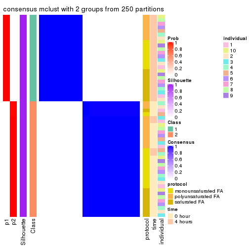</p>

</div>
<div id='tab-SD-mclust-consensus-heatmap-2'>
<pre><code class="r">consensus_heatmap(res, k = 3)
</code></pre>

<p>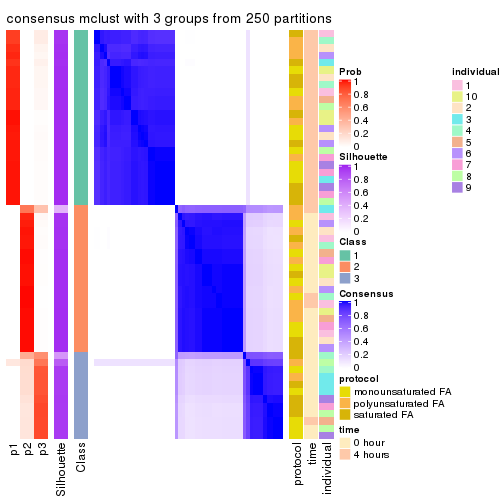</p>

</div>
<div id='tab-SD-mclust-consensus-heatmap-3'>
<pre><code class="r">consensus_heatmap(res, k = 4)
</code></pre>

<p>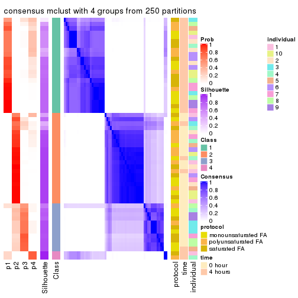</p>

</div>
<div id='tab-SD-mclust-consensus-heatmap-4'>
<pre><code class="r">consensus_heatmap(res, k = 5)
</code></pre>

<p>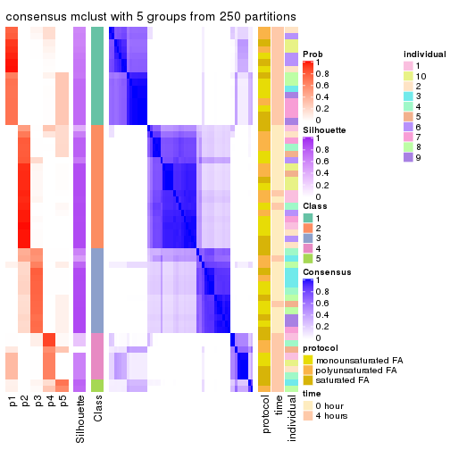</p>

</div>
<div id='tab-SD-mclust-consensus-heatmap-5'>
<pre><code class="r">consensus_heatmap(res, k = 6)
</code></pre>

<p>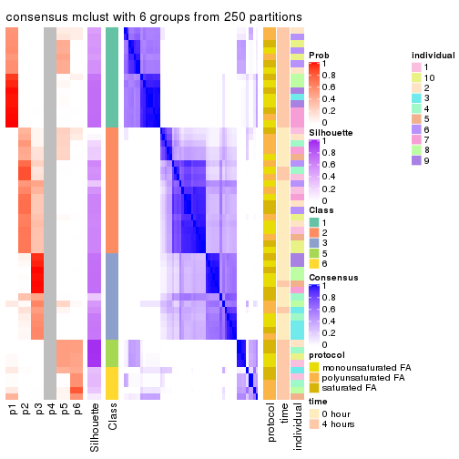</p>

</div>
</div>

Heatmaps for the membership of samples in all partitions to see how consistent they are:


<script>
$( function() {
	$( '#tabs-SD-mclust-membership-heatmap' ).tabs();
} );
</script>
<div id='tabs-SD-mclust-membership-heatmap'>
<ul>
<li><a href='#tab-SD-mclust-membership-heatmap-1'>k = 2</a></li>
<li><a href='#tab-SD-mclust-membership-heatmap-2'>k = 3</a></li>
<li><a href='#tab-SD-mclust-membership-heatmap-3'>k = 4</a></li>
<li><a href='#tab-SD-mclust-membership-heatmap-4'>k = 5</a></li>
<li><a href='#tab-SD-mclust-membership-heatmap-5'>k = 6</a></li>
</ul>
<div id='tab-SD-mclust-membership-heatmap-1'>
<pre><code class="r">membership_heatmap(res, k = 2)
</code></pre>

<p>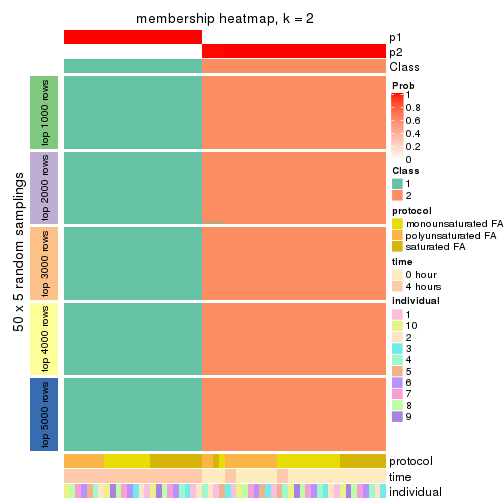</p>

</div>
<div id='tab-SD-mclust-membership-heatmap-2'>
<pre><code class="r">membership_heatmap(res, k = 3)
</code></pre>

<p>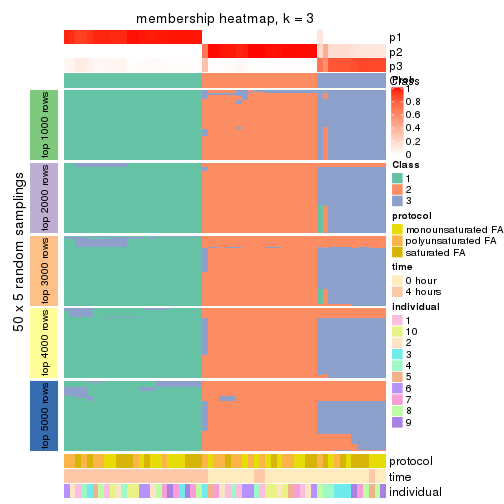</p>

</div>
<div id='tab-SD-mclust-membership-heatmap-3'>
<pre><code class="r">membership_heatmap(res, k = 4)
</code></pre>

<p>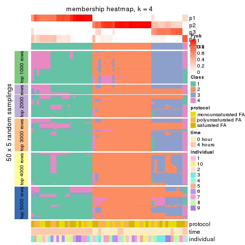</p>

</div>
<div id='tab-SD-mclust-membership-heatmap-4'>
<pre><code class="r">membership_heatmap(res, k = 5)
</code></pre>

<p>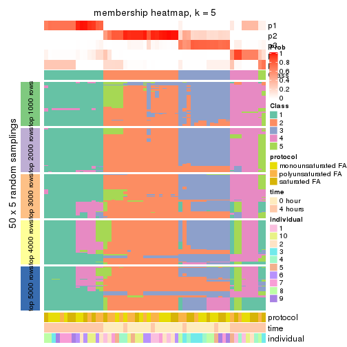</p>

</div>
<div id='tab-SD-mclust-membership-heatmap-5'>
<pre><code class="r">membership_heatmap(res, k = 6)
</code></pre>

<p>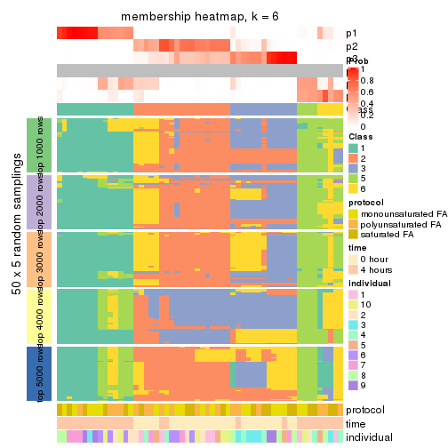</p>

</div>
</div>

As soon as we have had the classes for columns, we can look for signatures
which are significantly different between classes which can be candidate marks
for certain classes. Following are the heatmaps for signatures.


Signature heatmaps where rows are scaled:


<script>
$( function() {
	$( '#tabs-SD-mclust-get-signatures' ).tabs();
} );
</script>
<div id='tabs-SD-mclust-get-signatures'>
<ul>
<li><a href='#tab-SD-mclust-get-signatures-1'>k = 2</a></li>
<li><a href='#tab-SD-mclust-get-signatures-2'>k = 3</a></li>
<li><a href='#tab-SD-mclust-get-signatures-3'>k = 4</a></li>
<li><a href='#tab-SD-mclust-get-signatures-4'>k = 5</a></li>
<li><a href='#tab-SD-mclust-get-signatures-5'>k = 6</a></li>
</ul>
<div id='tab-SD-mclust-get-signatures-1'>
<pre><code class="r">get_signatures(res, k = 2)
</code></pre>

<p>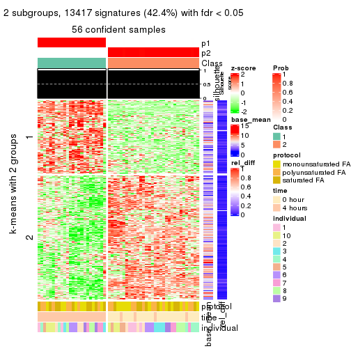</p>

</div>
<div id='tab-SD-mclust-get-signatures-2'>
<pre><code class="r">get_signatures(res, k = 3)
</code></pre>

<p>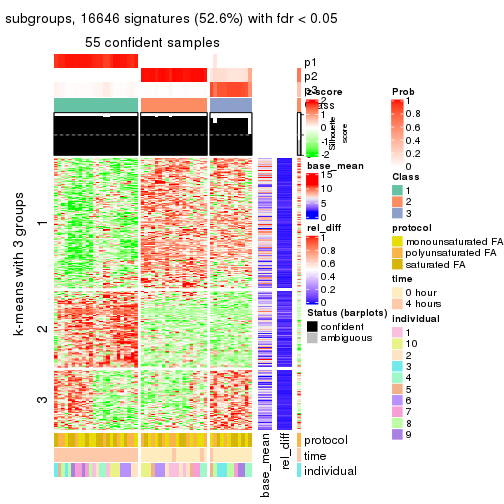</p>

</div>
<div id='tab-SD-mclust-get-signatures-3'>
<pre><code class="r">get_signatures(res, k = 4)
</code></pre>

<p>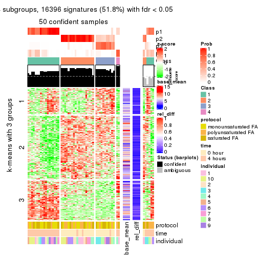</p>

</div>
<div id='tab-SD-mclust-get-signatures-4'>
<pre><code class="r">get_signatures(res, k = 5)
</code></pre>

<p>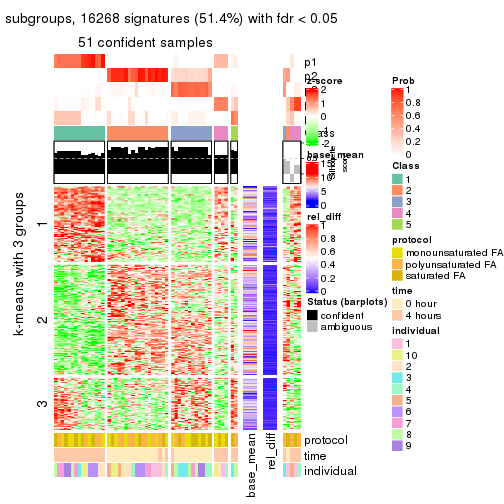</p>

</div>
<div id='tab-SD-mclust-get-signatures-5'>
<pre><code class="r">get_signatures(res, k = 6)
</code></pre>

<p>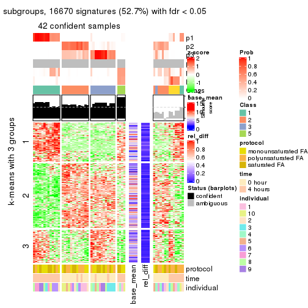</p>

</div>
</div>


Signature heatmaps where rows are not scaled:


<script>
$( function() {
	$( '#tabs-SD-mclust-get-signatures-no-scale' ).tabs();
} );
</script>
<div id='tabs-SD-mclust-get-signatures-no-scale'>
<ul>
<li><a href='#tab-SD-mclust-get-signatures-no-scale-1'>k = 2</a></li>
<li><a href='#tab-SD-mclust-get-signatures-no-scale-2'>k = 3</a></li>
<li><a href='#tab-SD-mclust-get-signatures-no-scale-3'>k = 4</a></li>
<li><a href='#tab-SD-mclust-get-signatures-no-scale-4'>k = 5</a></li>
<li><a href='#tab-SD-mclust-get-signatures-no-scale-5'>k = 6</a></li>
</ul>
<div id='tab-SD-mclust-get-signatures-no-scale-1'>
<pre><code class="r">get_signatures(res, k = 2, scale_rows = FALSE)
</code></pre>

<p>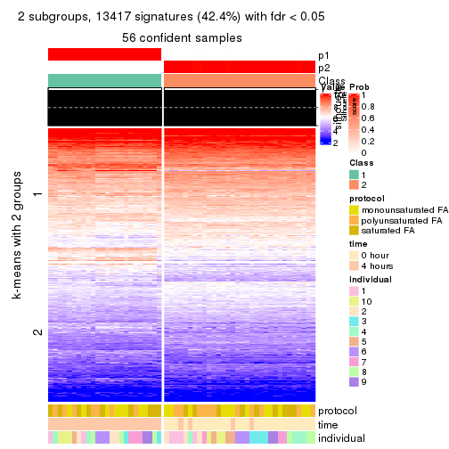</p>

</div>
<div id='tab-SD-mclust-get-signatures-no-scale-2'>
<pre><code class="r">get_signatures(res, k = 3, scale_rows = FALSE)
</code></pre>

<p>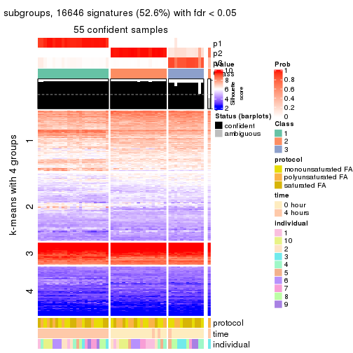</p>

</div>
<div id='tab-SD-mclust-get-signatures-no-scale-3'>
<pre><code class="r">get_signatures(res, k = 4, scale_rows = FALSE)
</code></pre>

<p>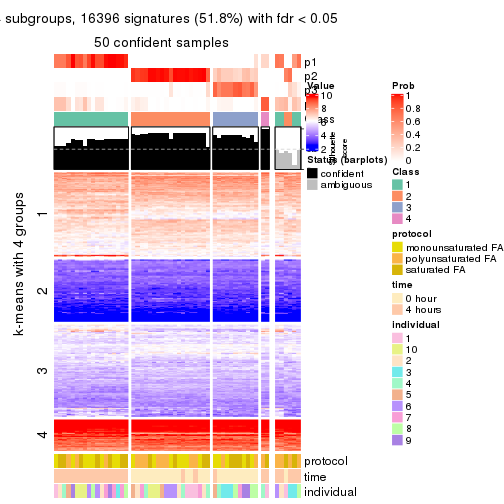</p>

</div>
<div id='tab-SD-mclust-get-signatures-no-scale-4'>
<pre><code class="r">get_signatures(res, k = 5, scale_rows = FALSE)
</code></pre>

<p>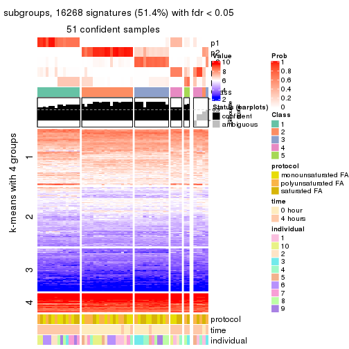</p>

</div>
<div id='tab-SD-mclust-get-signatures-no-scale-5'>
<pre><code class="r">get_signatures(res, k = 6, scale_rows = FALSE)
</code></pre>

<p>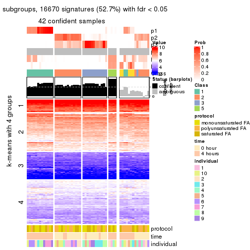</p>

</div>
</div>


Compare the overlap of signatures from different k:

```r
compare_signatures(res)
```

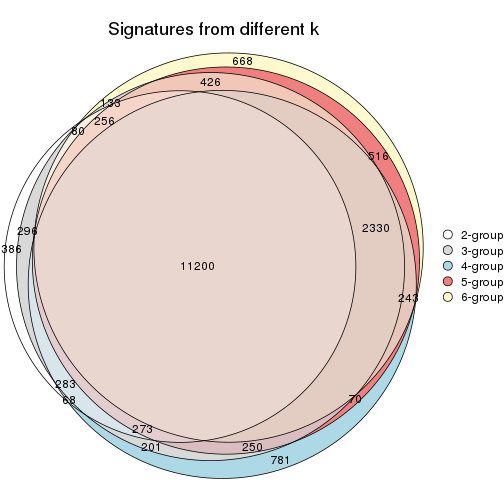

`get_signature()` returns a data frame invisibly. TO get the list of signatures, the function
call should be assigned to a variable explicitly. In following code, if `plot` argument is set
to `FALSE`, no heatmap is plotted while only the differential analysis is performed.

```r
# code only for demonstration
tb = get_signature(res, k = ..., plot = FALSE)
```

An example of the output of `tb` is:

```
#>   which_row         fdr    mean_1    mean_2 scaled_mean_1 scaled_mean_2 km
#> 1        38 0.042760348  8.373488  9.131774    -0.5533452     0.5164555  1
#> 2        40 0.018707592  7.106213  8.469186    -0.6173731     0.5762149  1
#> 3        55 0.019134737 10.221463 11.207825    -0.6159697     0.5749050  1
#> 4        59 0.006059896  5.921854  7.869574    -0.6899429     0.6439467  1
#> 5        60 0.018055526  8.928898 10.211722    -0.6204761     0.5791110  1
#> 6        98 0.009384629 15.714769 14.887706     0.6635654    -0.6193277  2
...
```

The columns in `tb` are:

1. `which_row`: row indices corresponding to the input matrix.
2. `fdr`: FDR for the differential test. 
3. `mean_x`: The mean value in group x.
4. `scaled_mean_x`: The mean value in group x after rows are scaled.
5. `km`: Row groups if k-means clustering is applied to rows.


UMAP plot which shows how samples are separated.


<script>
$( function() {
	$( '#tabs-SD-mclust-dimension-reduction' ).tabs();
} );
</script>
<div id='tabs-SD-mclust-dimension-reduction'>
<ul>
<li><a href='#tab-SD-mclust-dimension-reduction-1'>k = 2</a></li>
<li><a href='#tab-SD-mclust-dimension-reduction-2'>k = 3</a></li>
<li><a href='#tab-SD-mclust-dimension-reduction-3'>k = 4</a></li>
<li><a href='#tab-SD-mclust-dimension-reduction-4'>k = 5</a></li>
<li><a href='#tab-SD-mclust-dimension-reduction-5'>k = 6</a></li>
</ul>
<div id='tab-SD-mclust-dimension-reduction-1'>
<pre><code class="r">dimension_reduction(res, k = 2, method = &quot;UMAP&quot;)
</code></pre>

<p>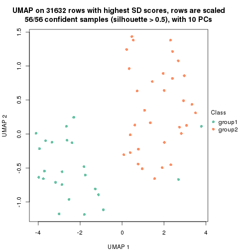</p>

</div>
<div id='tab-SD-mclust-dimension-reduction-2'>
<pre><code class="r">dimension_reduction(res, k = 3, method = &quot;UMAP&quot;)
</code></pre>

<p>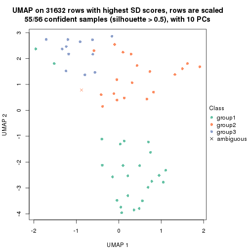</p>

</div>
<div id='tab-SD-mclust-dimension-reduction-3'>
<pre><code class="r">dimension_reduction(res, k = 4, method = &quot;UMAP&quot;)
</code></pre>

<p>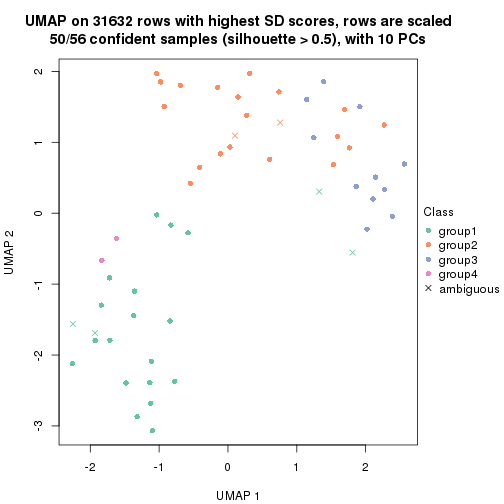</p>

</div>
<div id='tab-SD-mclust-dimension-reduction-4'>
<pre><code class="r">dimension_reduction(res, k = 5, method = &quot;UMAP&quot;)
</code></pre>

<p>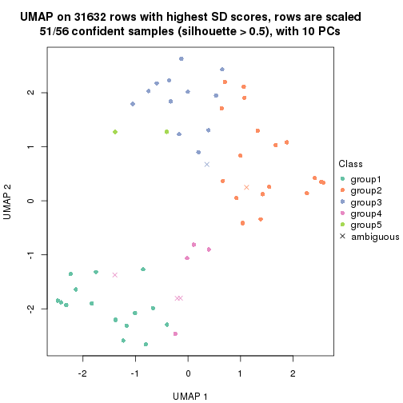</p>

</div>
<div id='tab-SD-mclust-dimension-reduction-5'>
<pre><code class="r">dimension_reduction(res, k = 6, method = &quot;UMAP&quot;)
</code></pre>

<p>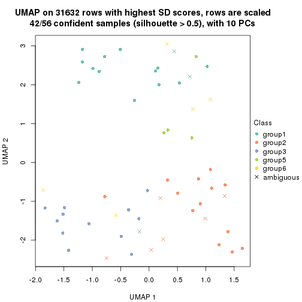</p>

</div>
</div>


Following heatmap shows how subgroups are split when increasing `k`:

```r
collect_classes(res)
```

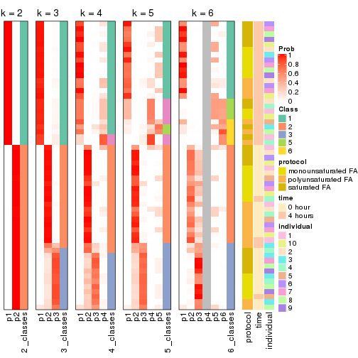


Test correlation between subgroups and known annotations. If the known
annotation is numeric, one-way ANOVA test is applied, and if the known
annotation is discrete, chi-squared contingency table test is applied.

```r
test_to_known_factors(res)
```

```
#>            n protocol(p)  time(p) individual(p) k
#> SD:mclust 56       0.757 5.27e-10         0.993 2
#> SD:mclust 55       0.560 2.56e-10         0.227 3
#> SD:mclust 50       0.523 1.62e-08         0.253 4
#> SD:mclust 51       0.558 3.96e-08         0.287 5
#> SD:mclust 42       0.743 2.77e-06         0.133 6
```


If matrix rows can be associated to genes, consider to use `functional_enrichment(res,
...)` to perform function enrichment for the signature genes. See [this vignette](http://bioconductor.org/packages/devel/bioc/vignettes/cola/inst/doc/functional_enrichment.html) for more detailed explanations.


 

---------------------------------------------------


### SD:NMF**


The object with results only for a single top-value method and a single partition method 
can be extracted as:

```r
res = res_list["SD", "NMF"]
# you can also extract it by
# res = res_list["SD:NMF"]
```

A summary of `res` and all the functions that can be applied to it:

```r
res
```

```
#> A 'ConsensusPartition' object with k = 2, 3, 4, 5, 6.
#>   On a matrix with 31632 rows and 56 columns.
#>   Top rows (1000, 2000, 3000, 4000, 5000) are extracted by 'SD' method.
#>   Subgroups are detected by 'NMF' method.
#>   Performed in total 1250 partitions by row resampling.
#>   Best k for subgroups seems to be 2.
#> 
#> Following methods can be applied to this 'ConsensusPartition' object:
#>  [1] "cola_report"             "collect_classes"         "collect_plots"          
#>  [4] "collect_stats"           "colnames"                "compare_signatures"     
#>  [7] "consensus_heatmap"       "dimension_reduction"     "functional_enrichment"  
#> [10] "get_anno_col"            "get_anno"                "get_classes"            
#> [13] "get_consensus"           "get_matrix"              "get_membership"         
#> [16] "get_param"               "get_signatures"          "get_stats"              
#> [19] "is_best_k"               "is_stable_k"             "membership_heatmap"     
#> [22] "ncol"                    "nrow"                    "plot_ecdf"              
#> [25] "rownames"                "select_partition_number" "show"                   
#> [28] "suggest_best_k"          "test_to_known_factors"
```

`collect_plots()` function collects all the plots made from `res` for all `k` (number of partitions)
into one single page to provide an easy and fast comparison between different `k`.

```r
collect_plots(res)
```

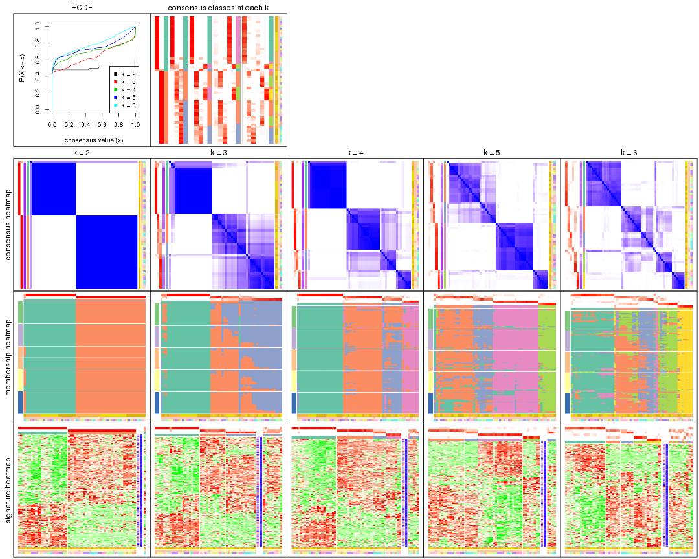

The plots are:

- The first row: a plot of the ECDF (empirical cumulative distribution
  function) curves of the consensus matrix for each `k` and the heatmap of
  predicted classes for each `k`.
- The second row: heatmaps of the consensus matrix for each `k`.
- The third row: heatmaps of the membership matrix for each `k`.
- The fouth row: heatmaps of the signatures for each `k`.

All the plots in panels can be made by individual functions and they are
plotted later in this section.

`select_partition_number()` produces several plots showing different
statistics for choosing "optimized" `k`. There are following statistics:

- ECDF curves of the consensus matrix for each `k`;
- 1-PAC. [The PAC
  score](https://en.wikipedia.org/wiki/Consensus_clustering#Over-interpretation_potential_of_consensus_clustering)
  measures the proportion of the ambiguous subgrouping.
- Mean silhouette score.
- Concordance. The mean probability of fiting the consensus class ids in all
  partitions.
- Area increased. Denote $A_k$ as the area under the ECDF curve for current
  `k`, the area increased is defined as $A_k - A_{k-1}$.
- Rand index. The percent of pairs of samples that are both in a same cluster
  or both are not in a same cluster in the partition of k and k-1.
- Jaccard index. The ratio of pairs of samples are both in a same cluster in
  the partition of k and k-1 and the pairs of samples are both in a same
  cluster in the partition k or k-1.

The detailed explanations of these statistics can be found in [the _cola_
vignette](http://bioconductor.org/packages/devel/bioc/vignettes/cola/inst/doc/cola.html#toc_13).

Generally speaking, lower PAC score, higher mean silhouette score or higher
concordance corresponds to better partition. Rand index and Jaccard index
measure how similar the current partition is compared to partition with `k-1`.
If they are too similar, we won't accept `k` is better than `k-1`.

```r
select_partition_number(res)
```

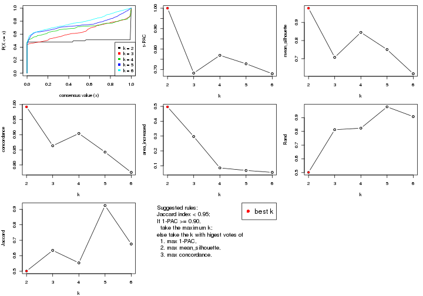

The numeric values for all these statistics can be obtained by `get_stats()`.

```r
get_stats(res)
```

```
#>   k 1-PAC mean_silhouette concordance area_increased  Rand Jaccard
#> 2 2 1.000           0.978       0.992         0.4967 0.501   0.501
#> 3 3 0.682           0.707       0.864         0.2970 0.812   0.635
#> 4 4 0.769           0.845       0.904         0.0856 0.823   0.554
#> 5 5 0.728           0.750       0.843         0.0685 0.979   0.924
#> 6 6 0.679           0.617       0.775         0.0555 0.908   0.676
```

`suggest_best_k()` suggests the best $k$ based on these statistics. The rules are as follows:

- All $k$ with Jaccard index larger than 0.95 are removed because increasing
  $k$ does not provide enough extra information. If all $k$ are removed, it is
  marked as no subgroup is detected.
- For all $k$ with 1-PAC score larger than 0.9, the maximal $k$ is taken as
  the best $k$, and other $k$ are marked as optional $k$.
- If it does not fit the second rule. The $k$ with the maximal vote of the
  highest 1-PAC score, highest mean silhouette, and highest concordance is
  taken as the best $k$.

```r
suggest_best_k(res)
```

```
#> [1] 2
```


Following shows the table of the partitions (You need to click the **show/hide
code output** link to see it). The membership matrix (columns with name `p*`)
is inferred by
[`clue::cl_consensus()`](https://www.rdocumentation.org/link/cl_consensus?package=clue)
function with the `SE` method. Basically the value in the membership matrix
represents the probability to belong to a certain group. The finall class
label for an item is determined with the group with highest probability it
belongs to.

In `get_classes()` function, the entropy is calculated from the membership
matrix and the silhouette score is calculated from the consensus matrix.


<script>
$( function() {
	$( '#tabs-SD-NMF-get-classes' ).tabs();
} );
</script>
<div id='tabs-SD-NMF-get-classes'>
<ul>
<li><a href='#tab-SD-NMF-get-classes-1'>k = 2</a></li>
<li><a href='#tab-SD-NMF-get-classes-2'>k = 3</a></li>
<li><a href='#tab-SD-NMF-get-classes-3'>k = 4</a></li>
<li><a href='#tab-SD-NMF-get-classes-4'>k = 5</a></li>
<li><a href='#tab-SD-NMF-get-classes-5'>k = 6</a></li>
</ul>

<div id='tab-SD-NMF-get-classes-1'>
<p><a id='tab-SD-NMF-get-classes-1-a' style='color:#0366d6' href='#'>show/hide code output</a></p>
<pre><code class="r">cbind(get_classes(res, k = 2), get_membership(res, k = 2))
</code></pre>

<pre><code>#&gt;           class entropy silhouette    p1    p2
#&gt; GSM790742     2   0.000      1.000 0.000 1.000
#&gt; GSM790744     2   0.000      1.000 0.000 1.000
#&gt; GSM790754     2   0.000      1.000 0.000 1.000
#&gt; GSM790756     2   0.000      1.000 0.000 1.000
#&gt; GSM790768     2   0.000      1.000 0.000 1.000
#&gt; GSM790774     2   0.000      1.000 0.000 1.000
#&gt; GSM790778     2   0.000      1.000 0.000 1.000
#&gt; GSM790784     2   0.000      1.000 0.000 1.000
#&gt; GSM790790     2   0.000      1.000 0.000 1.000
#&gt; GSM790743     1   0.000      0.981 1.000 0.000
#&gt; GSM790745     1   0.000      0.981 1.000 0.000
#&gt; GSM790755     1   0.988      0.227 0.564 0.436
#&gt; GSM790757     1   0.000      0.981 1.000 0.000
#&gt; GSM790769     1   0.000      0.981 1.000 0.000
#&gt; GSM790775     1   0.000      0.981 1.000 0.000
#&gt; GSM790779     1   0.000      0.981 1.000 0.000
#&gt; GSM790785     1   0.000      0.981 1.000 0.000
#&gt; GSM790791     1   0.000      0.981 1.000 0.000
#&gt; GSM790738     2   0.000      1.000 0.000 1.000
#&gt; GSM790746     2   0.000      1.000 0.000 1.000
#&gt; GSM790752     2   0.000      1.000 0.000 1.000
#&gt; GSM790758     2   0.000      1.000 0.000 1.000
#&gt; GSM790764     2   0.000      1.000 0.000 1.000
#&gt; GSM790766     2   0.000      1.000 0.000 1.000
#&gt; GSM790772     2   0.000      1.000 0.000 1.000
#&gt; GSM790782     2   0.000      1.000 0.000 1.000
#&gt; GSM790786     2   0.000      1.000 0.000 1.000
#&gt; GSM790792     2   0.000      1.000 0.000 1.000
#&gt; GSM790739     1   0.000      0.981 1.000 0.000
#&gt; GSM790747     1   0.000      0.981 1.000 0.000
#&gt; GSM790753     1   0.000      0.981 1.000 0.000
#&gt; GSM790759     2   0.000      1.000 0.000 1.000
#&gt; GSM790765     2   0.000      1.000 0.000 1.000
#&gt; GSM790767     1   0.000      0.981 1.000 0.000
#&gt; GSM790773     1   0.000      0.981 1.000 0.000
#&gt; GSM790783     1   0.000      0.981 1.000 0.000
#&gt; GSM790787     1   0.000      0.981 1.000 0.000
#&gt; GSM790793     1   0.000      0.981 1.000 0.000
#&gt; GSM790740     2   0.000      1.000 0.000 1.000
#&gt; GSM790748     2   0.000      1.000 0.000 1.000
#&gt; GSM790750     2   0.000      1.000 0.000 1.000
#&gt; GSM790760     2   0.000      1.000 0.000 1.000
#&gt; GSM790762     2   0.000      1.000 0.000 1.000
#&gt; GSM790770     2   0.000      1.000 0.000 1.000
#&gt; GSM790776     2   0.000      1.000 0.000 1.000
#&gt; GSM790780     2   0.000      1.000 0.000 1.000
#&gt; GSM790788     2   0.000      1.000 0.000 1.000
#&gt; GSM790741     2   0.000      1.000 0.000 1.000
#&gt; GSM790749     1   0.000      0.981 1.000 0.000
#&gt; GSM790751     2   0.000      1.000 0.000 1.000
#&gt; GSM790761     1   0.000      0.981 1.000 0.000
#&gt; GSM790763     1   0.000      0.981 1.000 0.000
#&gt; GSM790771     1   0.000      0.981 1.000 0.000
#&gt; GSM790777     1   0.000      0.981 1.000 0.000
#&gt; GSM790781     1   0.000      0.981 1.000 0.000
#&gt; GSM790789     1   0.000      0.981 1.000 0.000
</code></pre>

<script>
$('#tab-SD-NMF-get-classes-1-a').parent().next().next().hide();
$('#tab-SD-NMF-get-classes-1-a').click(function(){
  $('#tab-SD-NMF-get-classes-1-a').parent().next().next().toggle();
  return(false);
});
</script>
</div>

<div id='tab-SD-NMF-get-classes-2'>
<p><a id='tab-SD-NMF-get-classes-2-a' style='color:#0366d6' href='#'>show/hide code output</a></p>
<pre><code class="r">cbind(get_classes(res, k = 3), get_membership(res, k = 3))
</code></pre>

<pre><code>#&gt;           class entropy silhouette    p1    p2    p3
#&gt; GSM790742     2  0.0592     0.6842 0.000 0.988 0.012
#&gt; GSM790744     3  0.6299    -0.1164 0.000 0.476 0.524
#&gt; GSM790754     3  0.1163     0.7365 0.000 0.028 0.972
#&gt; GSM790756     3  0.3192     0.7248 0.000 0.112 0.888
#&gt; GSM790768     2  0.6295     0.2488 0.000 0.528 0.472
#&gt; GSM790774     3  0.2356     0.7472 0.000 0.072 0.928
#&gt; GSM790778     3  0.0747     0.7281 0.000 0.016 0.984
#&gt; GSM790784     3  0.2165     0.7482 0.000 0.064 0.936
#&gt; GSM790790     2  0.5650     0.6976 0.000 0.688 0.312
#&gt; GSM790743     1  0.5835     0.6088 0.660 0.340 0.000
#&gt; GSM790745     1  0.0000     0.9490 1.000 0.000 0.000
#&gt; GSM790755     3  0.7782     0.3369 0.208 0.124 0.668
#&gt; GSM790757     1  0.0000     0.9490 1.000 0.000 0.000
#&gt; GSM790769     1  0.0000     0.9490 1.000 0.000 0.000
#&gt; GSM790775     1  0.0000     0.9490 1.000 0.000 0.000
#&gt; GSM790779     1  0.0592     0.9412 0.988 0.012 0.000
#&gt; GSM790785     1  0.0000     0.9490 1.000 0.000 0.000
#&gt; GSM790791     1  0.0000     0.9490 1.000 0.000 0.000
#&gt; GSM790738     2  0.5859     0.6401 0.000 0.656 0.344
#&gt; GSM790746     2  0.5363     0.7433 0.000 0.724 0.276
#&gt; GSM790752     3  0.2356     0.7472 0.000 0.072 0.928
#&gt; GSM790758     3  0.0237     0.7192 0.000 0.004 0.996
#&gt; GSM790764     2  0.3752     0.7578 0.000 0.856 0.144
#&gt; GSM790766     3  0.6280    -0.0454 0.000 0.460 0.540
#&gt; GSM790772     3  0.5138     0.5516 0.000 0.252 0.748
#&gt; GSM790782     3  0.2537     0.7444 0.000 0.080 0.920
#&gt; GSM790786     3  0.2165     0.7482 0.000 0.064 0.936
#&gt; GSM790792     2  0.5254     0.7507 0.000 0.736 0.264
#&gt; GSM790739     1  0.0000     0.9490 1.000 0.000 0.000
#&gt; GSM790747     1  0.0000     0.9490 1.000 0.000 0.000
#&gt; GSM790753     1  0.0000     0.9490 1.000 0.000 0.000
#&gt; GSM790759     2  0.4702     0.7727 0.000 0.788 0.212
#&gt; GSM790765     3  0.1753     0.7456 0.000 0.048 0.952
#&gt; GSM790767     1  0.0000     0.9490 1.000 0.000 0.000
#&gt; GSM790773     1  0.0000     0.9490 1.000 0.000 0.000
#&gt; GSM790783     1  0.0000     0.9490 1.000 0.000 0.000
#&gt; GSM790787     1  0.0000     0.9490 1.000 0.000 0.000
#&gt; GSM790793     1  0.0000     0.9490 1.000 0.000 0.000
#&gt; GSM790740     3  0.6274    -0.0266 0.000 0.456 0.544
#&gt; GSM790748     2  0.0747     0.6883 0.000 0.984 0.016
#&gt; GSM790750     3  0.1753     0.7456 0.000 0.048 0.952
#&gt; GSM790760     2  0.2448     0.7166 0.000 0.924 0.076
#&gt; GSM790762     3  0.6309    -0.2053 0.000 0.496 0.504
#&gt; GSM790770     2  0.4178     0.7743 0.000 0.828 0.172
#&gt; GSM790776     2  0.3619     0.7606 0.000 0.864 0.136
#&gt; GSM790780     3  0.0592     0.7050 0.000 0.012 0.988
#&gt; GSM790788     2  0.5529     0.7195 0.000 0.704 0.296
#&gt; GSM790741     3  0.6111     0.2026 0.000 0.396 0.604
#&gt; GSM790749     1  0.0237     0.9465 0.996 0.004 0.000
#&gt; GSM790751     3  0.4062     0.6858 0.000 0.164 0.836
#&gt; GSM790761     1  0.6215     0.4470 0.572 0.428 0.000
#&gt; GSM790763     1  0.0000     0.9490 1.000 0.000 0.000
#&gt; GSM790771     1  0.0000     0.9490 1.000 0.000 0.000
#&gt; GSM790777     1  0.0000     0.9490 1.000 0.000 0.000
#&gt; GSM790781     1  0.6675     0.4026 0.584 0.012 0.404
#&gt; GSM790789     1  0.0000     0.9490 1.000 0.000 0.000
</code></pre>

<script>
$('#tab-SD-NMF-get-classes-2-a').parent().next().next().hide();
$('#tab-SD-NMF-get-classes-2-a').click(function(){
  $('#tab-SD-NMF-get-classes-2-a').parent().next().next().toggle();
  return(false);
});
</script>
</div>

<div id='tab-SD-NMF-get-classes-3'>
<p><a id='tab-SD-NMF-get-classes-3-a' style='color:#0366d6' href='#'>show/hide code output</a></p>
<pre><code class="r">cbind(get_classes(res, k = 4), get_membership(res, k = 4))
</code></pre>

<pre><code>#&gt;           class entropy silhouette    p1    p2    p3    p4
#&gt; GSM790742     4  0.1389      0.837 0.000 0.048 0.000 0.952
#&gt; GSM790744     2  0.0188      0.908 0.000 0.996 0.000 0.004
#&gt; GSM790754     3  0.3837      0.799 0.000 0.224 0.776 0.000
#&gt; GSM790756     3  0.4996      0.489 0.000 0.484 0.516 0.000
#&gt; GSM790768     2  0.0336      0.906 0.000 0.992 0.008 0.000
#&gt; GSM790774     2  0.2530      0.812 0.000 0.888 0.112 0.000
#&gt; GSM790778     3  0.4992      0.469 0.000 0.476 0.524 0.000
#&gt; GSM790784     2  0.3074      0.751 0.000 0.848 0.152 0.000
#&gt; GSM790790     2  0.0524      0.905 0.000 0.988 0.008 0.004
#&gt; GSM790743     4  0.1042      0.798 0.008 0.000 0.020 0.972
#&gt; GSM790745     1  0.0188      0.979 0.996 0.000 0.004 0.000
#&gt; GSM790755     3  0.2839      0.480 0.004 0.004 0.884 0.108
#&gt; GSM790757     1  0.0188      0.979 0.996 0.000 0.004 0.000
#&gt; GSM790769     1  0.0188      0.981 0.996 0.000 0.004 0.000
#&gt; GSM790775     1  0.0000      0.981 1.000 0.000 0.000 0.000
#&gt; GSM790779     1  0.0188      0.981 0.996 0.000 0.004 0.000
#&gt; GSM790785     1  0.0000      0.981 1.000 0.000 0.000 0.000
#&gt; GSM790791     1  0.0000      0.981 1.000 0.000 0.000 0.000
#&gt; GSM790738     2  0.0469      0.906 0.000 0.988 0.000 0.012
#&gt; GSM790746     2  0.1118      0.890 0.000 0.964 0.000 0.036
#&gt; GSM790752     3  0.4431      0.765 0.000 0.304 0.696 0.000
#&gt; GSM790758     3  0.3569      0.794 0.000 0.196 0.804 0.000
#&gt; GSM790764     4  0.3024      0.800 0.000 0.148 0.000 0.852
#&gt; GSM790766     2  0.0188      0.908 0.000 0.996 0.000 0.004
#&gt; GSM790772     2  0.0000      0.907 0.000 1.000 0.000 0.000
#&gt; GSM790782     2  0.2647      0.802 0.000 0.880 0.120 0.000
#&gt; GSM790786     2  0.2216      0.834 0.000 0.908 0.092 0.000
#&gt; GSM790792     2  0.1151      0.890 0.000 0.968 0.008 0.024
#&gt; GSM790739     1  0.0000      0.981 1.000 0.000 0.000 0.000
#&gt; GSM790747     1  0.0188      0.981 0.996 0.000 0.004 0.000
#&gt; GSM790753     1  0.0188      0.981 0.996 0.000 0.004 0.000
#&gt; GSM790759     4  0.4981      0.254 0.000 0.464 0.000 0.536
#&gt; GSM790765     2  0.4222      0.480 0.000 0.728 0.272 0.000
#&gt; GSM790767     1  0.0000      0.981 1.000 0.000 0.000 0.000
#&gt; GSM790773     1  0.0000      0.981 1.000 0.000 0.000 0.000
#&gt; GSM790783     1  0.0188      0.981 0.996 0.000 0.004 0.000
#&gt; GSM790787     1  0.0188      0.981 0.996 0.000 0.004 0.000
#&gt; GSM790793     1  0.0000      0.981 1.000 0.000 0.000 0.000
#&gt; GSM790740     2  0.0188      0.908 0.000 0.996 0.000 0.004
#&gt; GSM790748     4  0.1389      0.838 0.000 0.048 0.000 0.952
#&gt; GSM790750     3  0.4040      0.796 0.000 0.248 0.752 0.000
#&gt; GSM790760     4  0.1211      0.836 0.000 0.040 0.000 0.960
#&gt; GSM790762     2  0.0336      0.906 0.000 0.992 0.008 0.000
#&gt; GSM790770     2  0.3591      0.690 0.000 0.824 0.008 0.168
#&gt; GSM790776     4  0.3528      0.760 0.000 0.192 0.000 0.808
#&gt; GSM790780     3  0.3528      0.792 0.000 0.192 0.808 0.000
#&gt; GSM790788     2  0.0804      0.901 0.000 0.980 0.012 0.008
#&gt; GSM790741     2  0.0188      0.908 0.000 0.996 0.000 0.004
#&gt; GSM790749     1  0.1209      0.956 0.964 0.000 0.032 0.004
#&gt; GSM790751     3  0.6851      0.671 0.000 0.300 0.568 0.132
#&gt; GSM790761     4  0.2345      0.754 0.100 0.000 0.000 0.900
#&gt; GSM790763     1  0.0188      0.981 0.996 0.000 0.004 0.000
#&gt; GSM790771     1  0.0188      0.981 0.996 0.000 0.004 0.000
#&gt; GSM790777     1  0.0188      0.981 0.996 0.000 0.004 0.000
#&gt; GSM790781     1  0.4406      0.589 0.700 0.000 0.300 0.000
#&gt; GSM790789     1  0.0000      0.981 1.000 0.000 0.000 0.000
</code></pre>

<script>
$('#tab-SD-NMF-get-classes-3-a').parent().next().next().hide();
$('#tab-SD-NMF-get-classes-3-a').click(function(){
  $('#tab-SD-NMF-get-classes-3-a').parent().next().next().toggle();
  return(false);
});
</script>
</div>

<div id='tab-SD-NMF-get-classes-4'>
<p><a id='tab-SD-NMF-get-classes-4-a' style='color:#0366d6' href='#'>show/hide code output</a></p>
<pre><code class="r">cbind(get_classes(res, k = 5), get_membership(res, k = 5))
</code></pre>

<pre><code>#&gt;           class entropy silhouette    p1    p2    p3    p4    p5
#&gt; GSM790742     5  0.0693      0.862 0.012 0.008 0.000 0.000 0.980
#&gt; GSM790744     2  0.1329      0.773 0.032 0.956 0.004 0.000 0.008
#&gt; GSM790754     3  0.4114      0.651 0.024 0.244 0.732 0.000 0.000
#&gt; GSM790756     3  0.5683      0.604 0.032 0.276 0.636 0.000 0.056
#&gt; GSM790768     2  0.1671      0.778 0.076 0.924 0.000 0.000 0.000
#&gt; GSM790774     2  0.3278      0.673 0.020 0.824 0.156 0.000 0.000
#&gt; GSM790778     3  0.3790      0.602 0.004 0.272 0.724 0.000 0.000
#&gt; GSM790784     2  0.5237      0.583 0.100 0.664 0.236 0.000 0.000
#&gt; GSM790790     2  0.3616      0.722 0.224 0.768 0.004 0.000 0.004
#&gt; GSM790743     5  0.2729      0.793 0.084 0.000 0.004 0.028 0.884
#&gt; GSM790745     4  0.1730      0.905 0.044 0.008 0.004 0.940 0.004
#&gt; GSM790755     1  0.4994      0.000 0.524 0.012 0.452 0.000 0.012
#&gt; GSM790757     4  0.1365      0.915 0.040 0.000 0.004 0.952 0.004
#&gt; GSM790769     4  0.2286      0.913 0.108 0.000 0.000 0.888 0.004
#&gt; GSM790775     4  0.0727      0.924 0.012 0.000 0.004 0.980 0.004
#&gt; GSM790779     4  0.0579      0.926 0.008 0.000 0.008 0.984 0.000
#&gt; GSM790785     4  0.0727      0.924 0.012 0.000 0.004 0.980 0.004
#&gt; GSM790791     4  0.1484      0.927 0.048 0.000 0.008 0.944 0.000
#&gt; GSM790738     2  0.2513      0.746 0.060 0.904 0.016 0.000 0.020
#&gt; GSM790746     2  0.3731      0.700 0.060 0.844 0.036 0.000 0.060
#&gt; GSM790752     3  0.4929      0.663 0.028 0.256 0.692 0.000 0.024
#&gt; GSM790758     3  0.1612      0.298 0.012 0.024 0.948 0.000 0.016
#&gt; GSM790764     5  0.4288      0.668 0.180 0.052 0.004 0.000 0.764
#&gt; GSM790766     2  0.1281      0.773 0.032 0.956 0.012 0.000 0.000
#&gt; GSM790772     2  0.1557      0.765 0.008 0.940 0.052 0.000 0.000
#&gt; GSM790782     2  0.2753      0.690 0.008 0.856 0.136 0.000 0.000
#&gt; GSM790786     2  0.4127      0.737 0.136 0.784 0.080 0.000 0.000
#&gt; GSM790792     2  0.3551      0.722 0.220 0.772 0.000 0.000 0.008
#&gt; GSM790739     4  0.0771      0.930 0.020 0.000 0.000 0.976 0.004
#&gt; GSM790747     4  0.2230      0.910 0.116 0.000 0.000 0.884 0.000
#&gt; GSM790753     4  0.0000      0.928 0.000 0.000 0.000 1.000 0.000
#&gt; GSM790759     5  0.5177      0.512 0.076 0.232 0.008 0.000 0.684
#&gt; GSM790765     3  0.6506      0.282 0.216 0.308 0.476 0.000 0.000
#&gt; GSM790767     4  0.0771      0.929 0.020 0.000 0.000 0.976 0.004
#&gt; GSM790773     4  0.0566      0.924 0.012 0.000 0.004 0.984 0.000
#&gt; GSM790783     4  0.1732      0.922 0.080 0.000 0.000 0.920 0.000
#&gt; GSM790787     4  0.1341      0.927 0.056 0.000 0.000 0.944 0.000
#&gt; GSM790793     4  0.2911      0.886 0.136 0.004 0.008 0.852 0.000
#&gt; GSM790740     2  0.2674      0.741 0.060 0.896 0.032 0.000 0.012
#&gt; GSM790748     5  0.0404      0.862 0.000 0.012 0.000 0.000 0.988
#&gt; GSM790750     3  0.4736      0.661 0.024 0.252 0.704 0.000 0.020
#&gt; GSM790760     5  0.0579      0.862 0.008 0.008 0.000 0.000 0.984
#&gt; GSM790762     2  0.3366      0.719 0.232 0.768 0.000 0.000 0.000
#&gt; GSM790770     2  0.5740      0.579 0.216 0.620 0.000 0.000 0.164
#&gt; GSM790776     5  0.0794      0.859 0.000 0.028 0.000 0.000 0.972
#&gt; GSM790780     3  0.1341      0.381 0.000 0.056 0.944 0.000 0.000
#&gt; GSM790788     2  0.3521      0.716 0.232 0.764 0.004 0.000 0.000
#&gt; GSM790741     2  0.2868      0.737 0.072 0.884 0.032 0.000 0.012
#&gt; GSM790749     4  0.3855      0.790 0.240 0.000 0.004 0.748 0.008
#&gt; GSM790751     3  0.6645      0.516 0.104 0.360 0.500 0.000 0.036
#&gt; GSM790761     5  0.1547      0.837 0.016 0.000 0.004 0.032 0.948
#&gt; GSM790763     4  0.2127      0.914 0.108 0.000 0.000 0.892 0.000
#&gt; GSM790771     4  0.2597      0.907 0.120 0.000 0.004 0.872 0.004
#&gt; GSM790777     4  0.0404      0.928 0.012 0.000 0.000 0.988 0.000
#&gt; GSM790781     4  0.3596      0.714 0.016 0.000 0.200 0.784 0.000
#&gt; GSM790789     4  0.2179      0.915 0.100 0.000 0.004 0.896 0.000
</code></pre>

<script>
$('#tab-SD-NMF-get-classes-4-a').parent().next().next().hide();
$('#tab-SD-NMF-get-classes-4-a').click(function(){
  $('#tab-SD-NMF-get-classes-4-a').parent().next().next().toggle();
  return(false);
});
</script>
</div>

<div id='tab-SD-NMF-get-classes-5'>
<p><a id='tab-SD-NMF-get-classes-5-a' style='color:#0366d6' href='#'>show/hide code output</a></p>
<pre><code class="r">cbind(get_classes(res, k = 6), get_membership(res, k = 6))
</code></pre>

<pre><code>#&gt;           class entropy silhouette    p1    p2    p3    p4    p5    p6
#&gt; GSM790742     6  0.0458      0.914 0.000 0.016 0.000 0.000 0.000 0.984
#&gt; GSM790744     2  0.4138      0.649 0.000 0.620 0.008 0.008 0.364 0.000
#&gt; GSM790754     3  0.5019      0.582 0.000 0.364 0.572 0.048 0.016 0.000
#&gt; GSM790756     3  0.5090      0.427 0.000 0.428 0.520 0.012 0.024 0.016
#&gt; GSM790768     5  0.4002      0.116 0.000 0.320 0.000 0.020 0.660 0.000
#&gt; GSM790774     2  0.6090      0.262 0.000 0.448 0.268 0.004 0.280 0.000
#&gt; GSM790778     3  0.3159      0.635 0.000 0.108 0.836 0.004 0.052 0.000
#&gt; GSM790784     5  0.4491      0.395 0.000 0.036 0.388 0.000 0.576 0.000
#&gt; GSM790790     5  0.0405      0.729 0.000 0.004 0.008 0.000 0.988 0.000
#&gt; GSM790743     6  0.3759      0.717 0.024 0.008 0.000 0.216 0.000 0.752
#&gt; GSM790745     1  0.3062      0.720 0.824 0.144 0.000 0.032 0.000 0.000
#&gt; GSM790755     4  0.4810     -0.244 0.000 0.120 0.220 0.660 0.000 0.000
#&gt; GSM790757     1  0.2912      0.717 0.844 0.116 0.000 0.040 0.000 0.000
#&gt; GSM790769     1  0.3404      0.716 0.760 0.016 0.000 0.224 0.000 0.000
#&gt; GSM790775     1  0.1391      0.779 0.944 0.040 0.000 0.016 0.000 0.000
#&gt; GSM790779     1  0.1010      0.785 0.960 0.036 0.000 0.004 0.000 0.000
#&gt; GSM790785     1  0.0891      0.793 0.968 0.008 0.000 0.024 0.000 0.000
#&gt; GSM790791     1  0.2455      0.778 0.872 0.012 0.000 0.112 0.004 0.000
#&gt; GSM790738     2  0.3136      0.679 0.000 0.768 0.004 0.000 0.228 0.000
#&gt; GSM790746     2  0.3745      0.679 0.000 0.732 0.028 0.000 0.240 0.000
#&gt; GSM790752     3  0.4387      0.573 0.000 0.392 0.584 0.008 0.016 0.000
#&gt; GSM790758     3  0.0862      0.569 0.000 0.008 0.972 0.016 0.000 0.004
#&gt; GSM790764     6  0.2212      0.843 0.000 0.000 0.008 0.000 0.112 0.880
#&gt; GSM790766     2  0.4702      0.516 0.000 0.524 0.012 0.024 0.440 0.000
#&gt; GSM790772     2  0.4947      0.578 0.000 0.552 0.060 0.004 0.384 0.000
#&gt; GSM790782     2  0.5646      0.452 0.000 0.532 0.204 0.000 0.264 0.000
#&gt; GSM790786     5  0.4000      0.633 0.000 0.060 0.184 0.004 0.752 0.000
#&gt; GSM790792     5  0.0405      0.730 0.000 0.004 0.008 0.000 0.988 0.000
#&gt; GSM790739     1  0.3062      0.725 0.816 0.160 0.000 0.024 0.000 0.000
#&gt; GSM790747     1  0.3541      0.682 0.728 0.012 0.000 0.260 0.000 0.000
#&gt; GSM790753     1  0.0790      0.791 0.968 0.032 0.000 0.000 0.000 0.000
#&gt; GSM790759     2  0.5300      0.258 0.000 0.532 0.004 0.004 0.080 0.380
#&gt; GSM790765     5  0.3795      0.428 0.000 0.000 0.364 0.004 0.632 0.000
#&gt; GSM790767     1  0.1633      0.794 0.932 0.024 0.000 0.044 0.000 0.000
#&gt; GSM790773     1  0.1461      0.774 0.940 0.044 0.000 0.016 0.000 0.000
#&gt; GSM790783     1  0.2631      0.748 0.820 0.000 0.000 0.180 0.000 0.000
#&gt; GSM790787     1  0.2320      0.771 0.864 0.004 0.000 0.132 0.000 0.000
#&gt; GSM790793     1  0.5323      0.430 0.624 0.008 0.000 0.164 0.204 0.000
#&gt; GSM790740     2  0.3368      0.680 0.000 0.756 0.012 0.000 0.232 0.000
#&gt; GSM790748     6  0.0508      0.915 0.000 0.012 0.004 0.000 0.000 0.984
#&gt; GSM790750     3  0.4141      0.518 0.000 0.432 0.556 0.000 0.012 0.000
#&gt; GSM790760     6  0.0146      0.916 0.000 0.000 0.004 0.000 0.000 0.996
#&gt; GSM790762     5  0.0777      0.724 0.000 0.024 0.004 0.000 0.972 0.000
#&gt; GSM790770     5  0.3159      0.637 0.000 0.008 0.000 0.020 0.820 0.152
#&gt; GSM790776     6  0.0405      0.916 0.000 0.000 0.004 0.000 0.008 0.988
#&gt; GSM790780     3  0.1605      0.622 0.000 0.044 0.936 0.016 0.004 0.000
#&gt; GSM790788     5  0.0692      0.724 0.000 0.020 0.000 0.004 0.976 0.000
#&gt; GSM790741     2  0.3043      0.659 0.000 0.792 0.008 0.000 0.200 0.000
#&gt; GSM790749     4  0.3868     -0.475 0.496 0.000 0.000 0.504 0.000 0.000
#&gt; GSM790751     2  0.4785      0.164 0.000 0.696 0.196 0.092 0.016 0.000
#&gt; GSM790761     6  0.1718      0.877 0.044 0.008 0.000 0.016 0.000 0.932
#&gt; GSM790763     1  0.3190      0.717 0.772 0.008 0.000 0.220 0.000 0.000
#&gt; GSM790771     1  0.3720      0.703 0.736 0.028 0.000 0.236 0.000 0.000
#&gt; GSM790777     1  0.0405      0.793 0.988 0.004 0.000 0.008 0.000 0.000
#&gt; GSM790781     1  0.3820      0.622 0.796 0.056 0.128 0.020 0.000 0.000
#&gt; GSM790789     1  0.3171      0.724 0.784 0.012 0.000 0.204 0.000 0.000
</code></pre>

<script>
$('#tab-SD-NMF-get-classes-5-a').parent().next().next().hide();
$('#tab-SD-NMF-get-classes-5-a').click(function(){
  $('#tab-SD-NMF-get-classes-5-a').parent().next().next().toggle();
  return(false);
});
</script>
</div>
</div>

Heatmaps for the consensus matrix. It visualizes the probability of two
samples to be in a same group.


<script>
$( function() {
	$( '#tabs-SD-NMF-consensus-heatmap' ).tabs();
} );
</script>
<div id='tabs-SD-NMF-consensus-heatmap'>
<ul>
<li><a href='#tab-SD-NMF-consensus-heatmap-1'>k = 2</a></li>
<li><a href='#tab-SD-NMF-consensus-heatmap-2'>k = 3</a></li>
<li><a href='#tab-SD-NMF-consensus-heatmap-3'>k = 4</a></li>
<li><a href='#tab-SD-NMF-consensus-heatmap-4'>k = 5</a></li>
<li><a href='#tab-SD-NMF-consensus-heatmap-5'>k = 6</a></li>
</ul>
<div id='tab-SD-NMF-consensus-heatmap-1'>
<pre><code class="r">consensus_heatmap(res, k = 2)
</code></pre>

<p>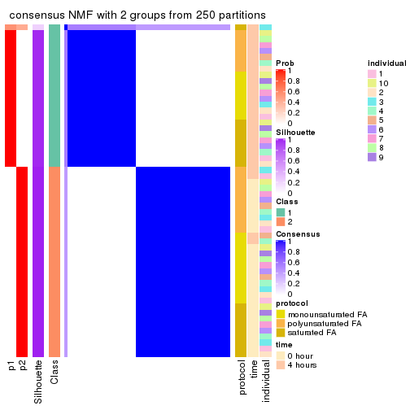</p>

</div>
<div id='tab-SD-NMF-consensus-heatmap-2'>
<pre><code class="r">consensus_heatmap(res, k = 3)
</code></pre>

<p>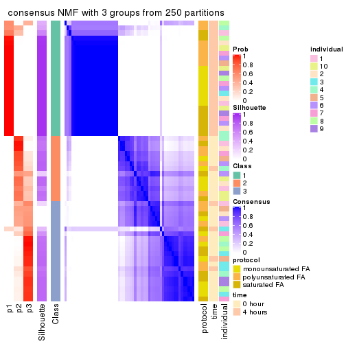</p>

</div>
<div id='tab-SD-NMF-consensus-heatmap-3'>
<pre><code class="r">consensus_heatmap(res, k = 4)
</code></pre>

<p>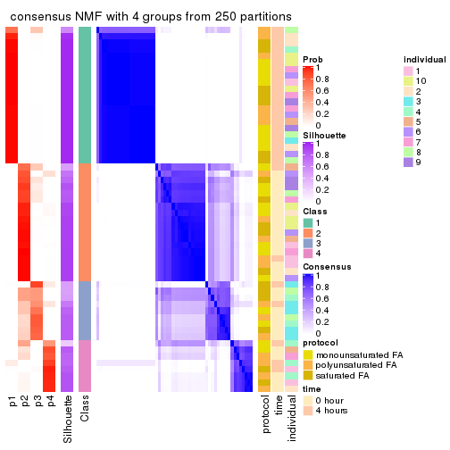</p>

</div>
<div id='tab-SD-NMF-consensus-heatmap-4'>
<pre><code class="r">consensus_heatmap(res, k = 5)
</code></pre>

<p>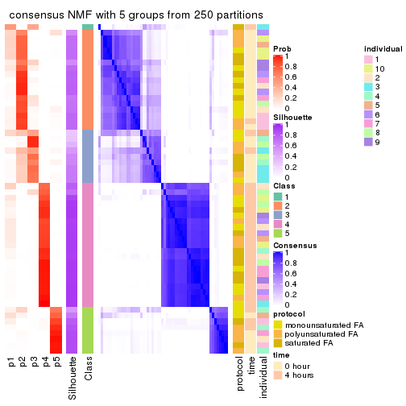</p>

</div>
<div id='tab-SD-NMF-consensus-heatmap-5'>
<pre><code class="r">consensus_heatmap(res, k = 6)
</code></pre>

<p>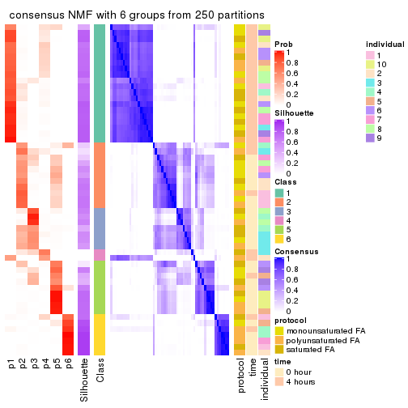</p>

</div>
</div>

Heatmaps for the membership of samples in all partitions to see how consistent they are:


<script>
$( function() {
	$( '#tabs-SD-NMF-membership-heatmap' ).tabs();
} );
</script>
<div id='tabs-SD-NMF-membership-heatmap'>
<ul>
<li><a href='#tab-SD-NMF-membership-heatmap-1'>k = 2</a></li>
<li><a href='#tab-SD-NMF-membership-heatmap-2'>k = 3</a></li>
<li><a href='#tab-SD-NMF-membership-heatmap-3'>k = 4</a></li>
<li><a href='#tab-SD-NMF-membership-heatmap-4'>k = 5</a></li>
<li><a href='#tab-SD-NMF-membership-heatmap-5'>k = 6</a></li>
</ul>
<div id='tab-SD-NMF-membership-heatmap-1'>
<pre><code class="r">membership_heatmap(res, k = 2)
</code></pre>

<p>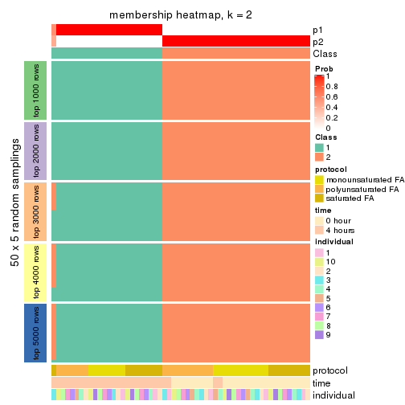</p>

</div>
<div id='tab-SD-NMF-membership-heatmap-2'>
<pre><code class="r">membership_heatmap(res, k = 3)
</code></pre>

<p>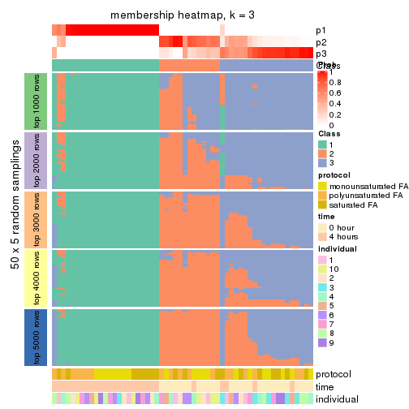</p>

</div>
<div id='tab-SD-NMF-membership-heatmap-3'>
<pre><code class="r">membership_heatmap(res, k = 4)
</code></pre>

<p>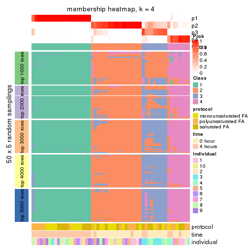</p>

</div>
<div id='tab-SD-NMF-membership-heatmap-4'>
<pre><code class="r">membership_heatmap(res, k = 5)
</code></pre>

<p>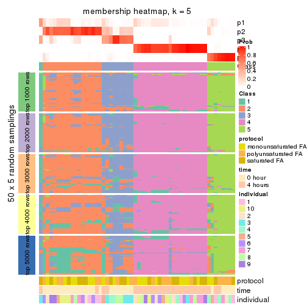</p>

</div>
<div id='tab-SD-NMF-membership-heatmap-5'>
<pre><code class="r">membership_heatmap(res, k = 6)
</code></pre>

<p>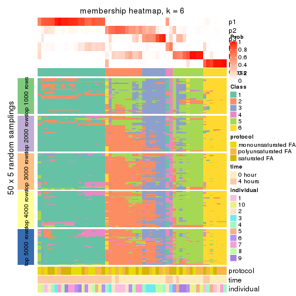</p>

</div>
</div>

As soon as we have had the classes for columns, we can look for signatures
which are significantly different between classes which can be candidate marks
for certain classes. Following are the heatmaps for signatures.


Signature heatmaps where rows are scaled:


<script>
$( function() {
	$( '#tabs-SD-NMF-get-signatures' ).tabs();
} );
</script>
<div id='tabs-SD-NMF-get-signatures'>
<ul>
<li><a href='#tab-SD-NMF-get-signatures-1'>k = 2</a></li>
<li><a href='#tab-SD-NMF-get-signatures-2'>k = 3</a></li>
<li><a href='#tab-SD-NMF-get-signatures-3'>k = 4</a></li>
<li><a href='#tab-SD-NMF-get-signatures-4'>k = 5</a></li>
<li><a href='#tab-SD-NMF-get-signatures-5'>k = 6</a></li>
</ul>
<div id='tab-SD-NMF-get-signatures-1'>
<pre><code class="r">get_signatures(res, k = 2)
</code></pre>

<p>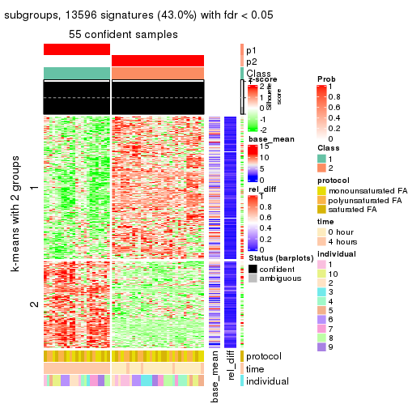</p>

</div>
<div id='tab-SD-NMF-get-signatures-2'>
<pre><code class="r">get_signatures(res, k = 3)
</code></pre>

<p>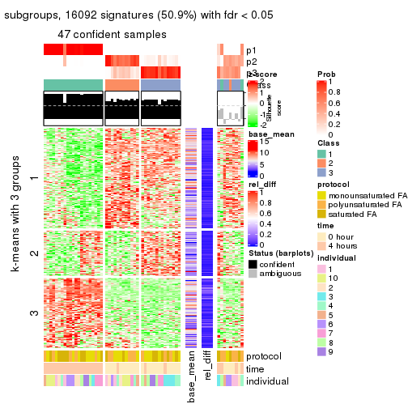</p>

</div>
<div id='tab-SD-NMF-get-signatures-3'>
<pre><code class="r">get_signatures(res, k = 4)
</code></pre>

<p>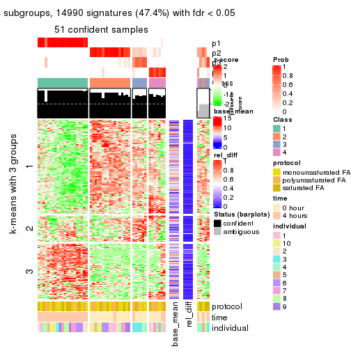</p>

</div>
<div id='tab-SD-NMF-get-signatures-4'>
<pre><code class="r">get_signatures(res, k = 5)
</code></pre>

<p>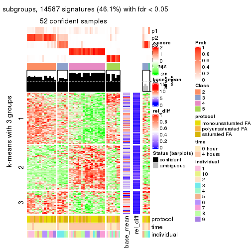</p>

</div>
<div id='tab-SD-NMF-get-signatures-5'>
<pre><code class="r">get_signatures(res, k = 6)
</code></pre>

<p>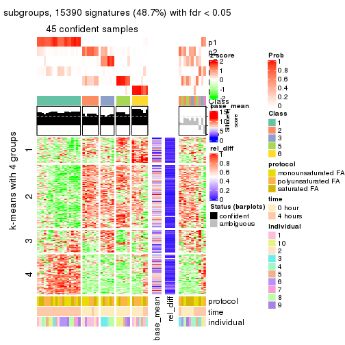</p>

</div>
</div>


Signature heatmaps where rows are not scaled:


<script>
$( function() {
	$( '#tabs-SD-NMF-get-signatures-no-scale' ).tabs();
} );
</script>
<div id='tabs-SD-NMF-get-signatures-no-scale'>
<ul>
<li><a href='#tab-SD-NMF-get-signatures-no-scale-1'>k = 2</a></li>
<li><a href='#tab-SD-NMF-get-signatures-no-scale-2'>k = 3</a></li>
<li><a href='#tab-SD-NMF-get-signatures-no-scale-3'>k = 4</a></li>
<li><a href='#tab-SD-NMF-get-signatures-no-scale-4'>k = 5</a></li>
<li><a href='#tab-SD-NMF-get-signatures-no-scale-5'>k = 6</a></li>
</ul>
<div id='tab-SD-NMF-get-signatures-no-scale-1'>
<pre><code class="r">get_signatures(res, k = 2, scale_rows = FALSE)
</code></pre>

<p>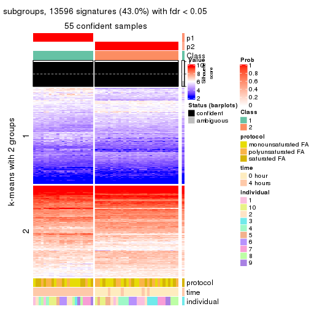</p>

</div>
<div id='tab-SD-NMF-get-signatures-no-scale-2'>
<pre><code class="r">get_signatures(res, k = 3, scale_rows = FALSE)
</code></pre>

<p>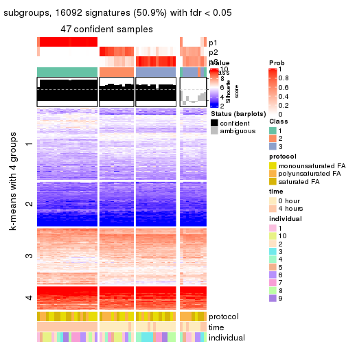</p>

</div>
<div id='tab-SD-NMF-get-signatures-no-scale-3'>
<pre><code class="r">get_signatures(res, k = 4, scale_rows = FALSE)
</code></pre>

<p>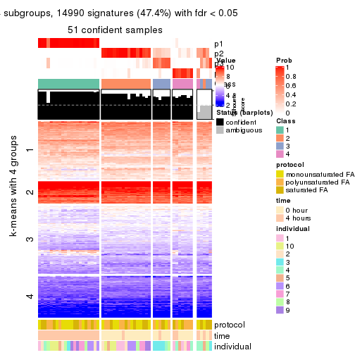</p>

</div>
<div id='tab-SD-NMF-get-signatures-no-scale-4'>
<pre><code class="r">get_signatures(res, k = 5, scale_rows = FALSE)
</code></pre>

<p>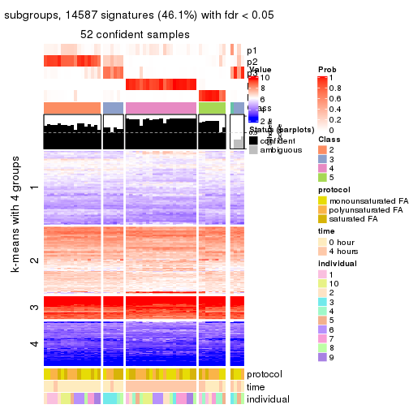</p>

</div>
<div id='tab-SD-NMF-get-signatures-no-scale-5'>
<pre><code class="r">get_signatures(res, k = 6, scale_rows = FALSE)
</code></pre>

<p>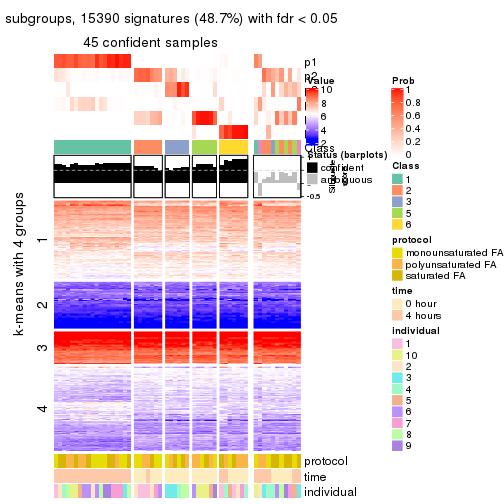</p>

</div>
</div>


Compare the overlap of signatures from different k:

```r
compare_signatures(res)
```

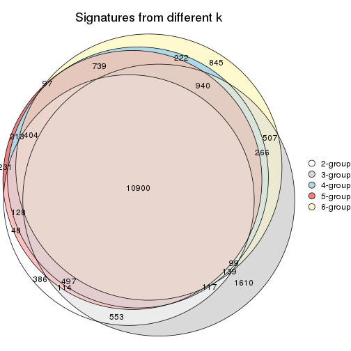

`get_signature()` returns a data frame invisibly. TO get the list of signatures, the function
call should be assigned to a variable explicitly. In following code, if `plot` argument is set
to `FALSE`, no heatmap is plotted while only the differential analysis is performed.

```r
# code only for demonstration
tb = get_signature(res, k = ..., plot = FALSE)
```

An example of the output of `tb` is:

```
#>   which_row         fdr    mean_1    mean_2 scaled_mean_1 scaled_mean_2 km
#> 1        38 0.042760348  8.373488  9.131774    -0.5533452     0.5164555  1
#> 2        40 0.018707592  7.106213  8.469186    -0.6173731     0.5762149  1
#> 3        55 0.019134737 10.221463 11.207825    -0.6159697     0.5749050  1
#> 4        59 0.006059896  5.921854  7.869574    -0.6899429     0.6439467  1
#> 5        60 0.018055526  8.928898 10.211722    -0.6204761     0.5791110  1
#> 6        98 0.009384629 15.714769 14.887706     0.6635654    -0.6193277  2
...
```

The columns in `tb` are:

1. `which_row`: row indices corresponding to the input matrix.
2. `fdr`: FDR for the differential test. 
3. `mean_x`: The mean value in group x.
4. `scaled_mean_x`: The mean value in group x after rows are scaled.
5. `km`: Row groups if k-means clustering is applied to rows.


UMAP plot which shows how samples are separated.


<script>
$( function() {
	$( '#tabs-SD-NMF-dimension-reduction' ).tabs();
} );
</script>
<div id='tabs-SD-NMF-dimension-reduction'>
<ul>
<li><a href='#tab-SD-NMF-dimension-reduction-1'>k = 2</a></li>
<li><a href='#tab-SD-NMF-dimension-reduction-2'>k = 3</a></li>
<li><a href='#tab-SD-NMF-dimension-reduction-3'>k = 4</a></li>
<li><a href='#tab-SD-NMF-dimension-reduction-4'>k = 5</a></li>
<li><a href='#tab-SD-NMF-dimension-reduction-5'>k = 6</a></li>
</ul>
<div id='tab-SD-NMF-dimension-reduction-1'>
<pre><code class="r">dimension_reduction(res, k = 2, method = &quot;UMAP&quot;)
</code></pre>

<p>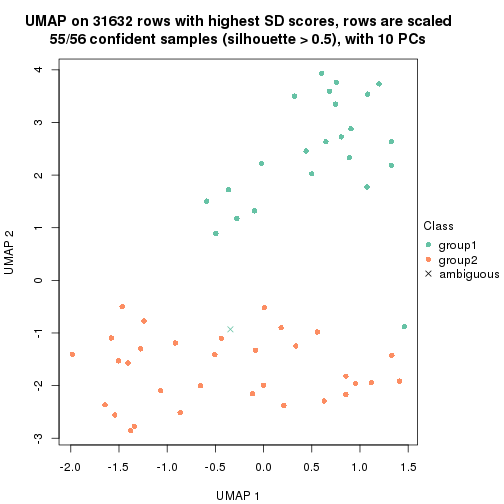</p>

</div>
<div id='tab-SD-NMF-dimension-reduction-2'>
<pre><code class="r">dimension_reduction(res, k = 3, method = &quot;UMAP&quot;)
</code></pre>

<p>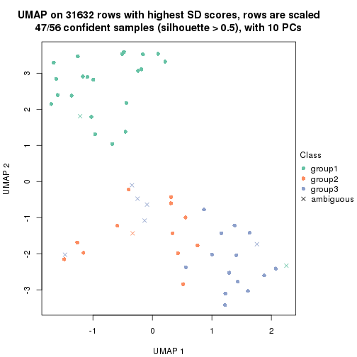</p>

</div>
<div id='tab-SD-NMF-dimension-reduction-3'>
<pre><code class="r">dimension_reduction(res, k = 4, method = &quot;UMAP&quot;)
</code></pre>

<p>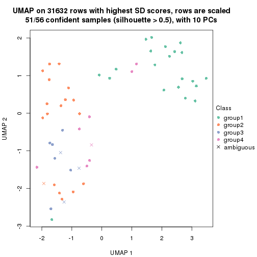</p>

</div>
<div id='tab-SD-NMF-dimension-reduction-4'>
<pre><code class="r">dimension_reduction(res, k = 5, method = &quot;UMAP&quot;)
</code></pre>

<p>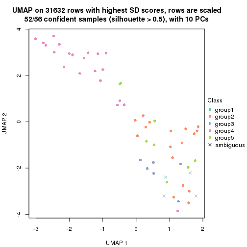</p>

</div>
<div id='tab-SD-NMF-dimension-reduction-5'>
<pre><code class="r">dimension_reduction(res, k = 6, method = &quot;UMAP&quot;)
</code></pre>

<p>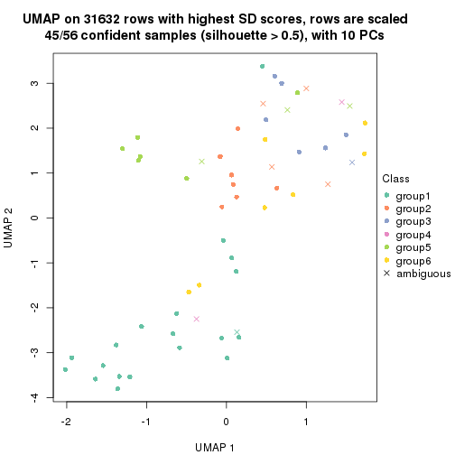</p>

</div>
</div>


Following heatmap shows how subgroups are split when increasing `k`:

```r
collect_classes(res)
```

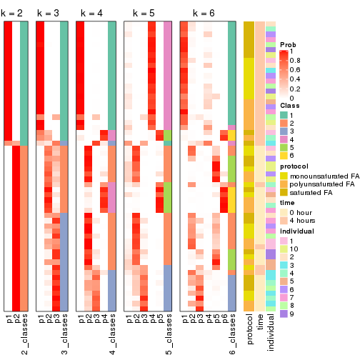


Test correlation between subgroups and known annotations. If the known
annotation is numeric, one-way ANOVA test is applied, and if the known
annotation is discrete, chi-squared contingency table test is applied.

```r
test_to_known_factors(res)
```

```
#>         n protocol(p)  time(p) individual(p) k
#> SD:NMF 55       0.868 8.82e-10        0.9739 2
#> SD:NMF 47       0.662 1.20e-08        0.2379 3
#> SD:NMF 51       0.772 2.59e-08        0.0274 4
#> SD:NMF 52       0.844 3.78e-08        0.0124 5
#> SD:NMF 45       0.763 3.10e-07        0.0240 6
```


If matrix rows can be associated to genes, consider to use `functional_enrichment(res,
...)` to perform function enrichment for the signature genes. See [this vignette](http://bioconductor.org/packages/devel/bioc/vignettes/cola/inst/doc/functional_enrichment.html) for more detailed explanations.


 

---------------------------------------------------


### CV:hclust**


The object with results only for a single top-value method and a single partition method 
can be extracted as:

```r
res = res_list["CV", "hclust"]
# you can also extract it by
# res = res_list["CV:hclust"]
```

A summary of `res` and all the functions that can be applied to it:

```r
res
```

```
#> A 'ConsensusPartition' object with k = 2, 3, 4, 5, 6.
#>   On a matrix with 31632 rows and 56 columns.
#>   Top rows (1000, 2000, 3000, 4000, 5000) are extracted by 'CV' method.
#>   Subgroups are detected by 'hclust' method.
#>   Performed in total 1250 partitions by row resampling.
#>   Best k for subgroups seems to be 2.
#> 
#> Following methods can be applied to this 'ConsensusPartition' object:
#>  [1] "cola_report"             "collect_classes"         "collect_plots"          
#>  [4] "collect_stats"           "colnames"                "compare_signatures"     
#>  [7] "consensus_heatmap"       "dimension_reduction"     "functional_enrichment"  
#> [10] "get_anno_col"            "get_anno"                "get_classes"            
#> [13] "get_consensus"           "get_matrix"              "get_membership"         
#> [16] "get_param"               "get_signatures"          "get_stats"              
#> [19] "is_best_k"               "is_stable_k"             "membership_heatmap"     
#> [22] "ncol"                    "nrow"                    "plot_ecdf"              
#> [25] "rownames"                "select_partition_number" "show"                   
#> [28] "suggest_best_k"          "test_to_known_factors"
```

`collect_plots()` function collects all the plots made from `res` for all `k` (number of partitions)
into one single page to provide an easy and fast comparison between different `k`.

```r
collect_plots(res)
```

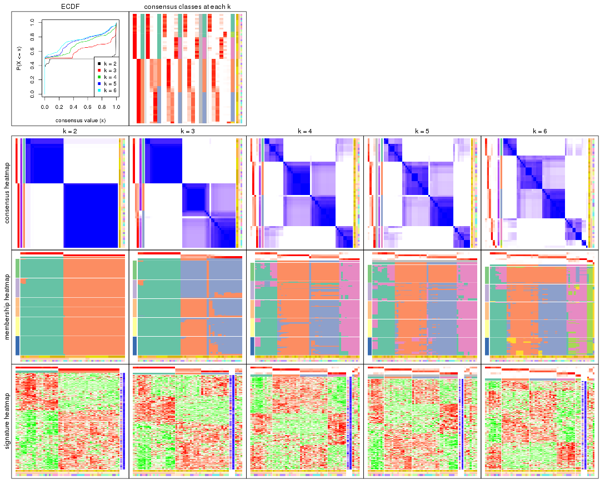

The plots are:

- The first row: a plot of the ECDF (empirical cumulative distribution
  function) curves of the consensus matrix for each `k` and the heatmap of
  predicted classes for each `k`.
- The second row: heatmaps of the consensus matrix for each `k`.
- The third row: heatmaps of the membership matrix for each `k`.
- The fouth row: heatmaps of the signatures for each `k`.

All the plots in panels can be made by individual functions and they are
plotted later in this section.

`select_partition_number()` produces several plots showing different
statistics for choosing "optimized" `k`. There are following statistics:

- ECDF curves of the consensus matrix for each `k`;
- 1-PAC. [The PAC
  score](https://en.wikipedia.org/wiki/Consensus_clustering#Over-interpretation_potential_of_consensus_clustering)
  measures the proportion of the ambiguous subgrouping.
- Mean silhouette score.
- Concordance. The mean probability of fiting the consensus class ids in all
  partitions.
- Area increased. Denote $A_k$ as the area under the ECDF curve for current
  `k`, the area increased is defined as $A_k - A_{k-1}$.
- Rand index. The percent of pairs of samples that are both in a same cluster
  or both are not in a same cluster in the partition of k and k-1.
- Jaccard index. The ratio of pairs of samples are both in a same cluster in
  the partition of k and k-1 and the pairs of samples are both in a same
  cluster in the partition k or k-1.

The detailed explanations of these statistics can be found in [the _cola_
vignette](http://bioconductor.org/packages/devel/bioc/vignettes/cola/inst/doc/cola.html#toc_13).

Generally speaking, lower PAC score, higher mean silhouette score or higher
concordance corresponds to better partition. Rand index and Jaccard index
measure how similar the current partition is compared to partition with `k-1`.
If they are too similar, we won't accept `k` is better than `k-1`.

```r
select_partition_number(res)
```

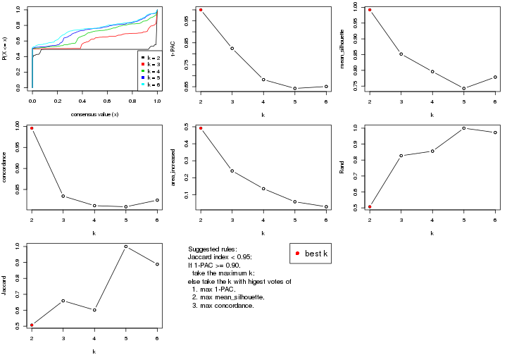

The numeric values for all these statistics can be obtained by `get_stats()`.

```r
get_stats(res)
```

```
#>   k 1-PAC mean_silhouette concordance area_increased  Rand Jaccard
#> 2 2 1.000           0.992       0.996         0.4918 0.507   0.507
#> 3 3 0.824           0.852       0.834         0.2404 0.827   0.659
#> 4 4 0.682           0.796       0.811         0.1356 0.856   0.601
#> 5 5 0.642           0.743       0.809         0.0588 1.000   1.000
#> 6 6 0.651           0.779       0.825         0.0295 0.973   0.889
```

`suggest_best_k()` suggests the best $k$ based on these statistics. The rules are as follows:

- All $k$ with Jaccard index larger than 0.95 are removed because increasing
  $k$ does not provide enough extra information. If all $k$ are removed, it is
  marked as no subgroup is detected.
- For all $k$ with 1-PAC score larger than 0.9, the maximal $k$ is taken as
  the best $k$, and other $k$ are marked as optional $k$.
- If it does not fit the second rule. The $k$ with the maximal vote of the
  highest 1-PAC score, highest mean silhouette, and highest concordance is
  taken as the best $k$.

```r
suggest_best_k(res)
```

```
#> [1] 2
```


Following shows the table of the partitions (You need to click the **show/hide
code output** link to see it). The membership matrix (columns with name `p*`)
is inferred by
[`clue::cl_consensus()`](https://www.rdocumentation.org/link/cl_consensus?package=clue)
function with the `SE` method. Basically the value in the membership matrix
represents the probability to belong to a certain group. The finall class
label for an item is determined with the group with highest probability it
belongs to.

In `get_classes()` function, the entropy is calculated from the membership
matrix and the silhouette score is calculated from the consensus matrix.


<script>
$( function() {
	$( '#tabs-CV-hclust-get-classes' ).tabs();
} );
</script>
<div id='tabs-CV-hclust-get-classes'>
<ul>
<li><a href='#tab-CV-hclust-get-classes-1'>k = 2</a></li>
<li><a href='#tab-CV-hclust-get-classes-2'>k = 3</a></li>
<li><a href='#tab-CV-hclust-get-classes-3'>k = 4</a></li>
<li><a href='#tab-CV-hclust-get-classes-4'>k = 5</a></li>
<li><a href='#tab-CV-hclust-get-classes-5'>k = 6</a></li>
</ul>

<div id='tab-CV-hclust-get-classes-1'>
<p><a id='tab-CV-hclust-get-classes-1-a' style='color:#0366d6' href='#'>show/hide code output</a></p>
<pre><code class="r">cbind(get_classes(res, k = 2), get_membership(res, k = 2))
</code></pre>

<pre><code>#&gt;           class entropy silhouette    p1    p2
#&gt; GSM790742     2  0.0000      0.999 0.000 1.000
#&gt; GSM790744     2  0.0000      0.999 0.000 1.000
#&gt; GSM790754     2  0.0000      0.999 0.000 1.000
#&gt; GSM790756     2  0.0000      0.999 0.000 1.000
#&gt; GSM790768     2  0.0000      0.999 0.000 1.000
#&gt; GSM790774     2  0.0000      0.999 0.000 1.000
#&gt; GSM790778     2  0.0000      0.999 0.000 1.000
#&gt; GSM790784     2  0.0000      0.999 0.000 1.000
#&gt; GSM790790     2  0.0000      0.999 0.000 1.000
#&gt; GSM790743     1  0.0000      0.991 1.000 0.000
#&gt; GSM790745     1  0.0000      0.991 1.000 0.000
#&gt; GSM790755     2  0.1843      0.971 0.028 0.972
#&gt; GSM790757     1  0.0000      0.991 1.000 0.000
#&gt; GSM790769     1  0.0000      0.991 1.000 0.000
#&gt; GSM790775     1  0.0000      0.991 1.000 0.000
#&gt; GSM790779     1  0.3584      0.934 0.932 0.068
#&gt; GSM790785     1  0.0000      0.991 1.000 0.000
#&gt; GSM790791     1  0.0000      0.991 1.000 0.000
#&gt; GSM790738     2  0.0000      0.999 0.000 1.000
#&gt; GSM790746     2  0.0000      0.999 0.000 1.000
#&gt; GSM790752     2  0.0000      0.999 0.000 1.000
#&gt; GSM790758     2  0.0000      0.999 0.000 1.000
#&gt; GSM790764     2  0.0000      0.999 0.000 1.000
#&gt; GSM790766     2  0.0000      0.999 0.000 1.000
#&gt; GSM790772     2  0.0000      0.999 0.000 1.000
#&gt; GSM790782     2  0.0000      0.999 0.000 1.000
#&gt; GSM790786     2  0.0000      0.999 0.000 1.000
#&gt; GSM790792     2  0.0000      0.999 0.000 1.000
#&gt; GSM790739     1  0.0000      0.991 1.000 0.000
#&gt; GSM790747     1  0.0000      0.991 1.000 0.000
#&gt; GSM790753     1  0.0376      0.988 0.996 0.004
#&gt; GSM790759     2  0.0000      0.999 0.000 1.000
#&gt; GSM790765     2  0.0000      0.999 0.000 1.000
#&gt; GSM790767     1  0.0000      0.991 1.000 0.000
#&gt; GSM790773     1  0.0000      0.991 1.000 0.000
#&gt; GSM790783     1  0.0000      0.991 1.000 0.000
#&gt; GSM790787     1  0.0672      0.985 0.992 0.008
#&gt; GSM790793     1  0.0000      0.991 1.000 0.000
#&gt; GSM790740     2  0.0000      0.999 0.000 1.000
#&gt; GSM790748     2  0.0000      0.999 0.000 1.000
#&gt; GSM790750     2  0.0000      0.999 0.000 1.000
#&gt; GSM790760     2  0.0000      0.999 0.000 1.000
#&gt; GSM790762     2  0.0000      0.999 0.000 1.000
#&gt; GSM790770     2  0.0000      0.999 0.000 1.000
#&gt; GSM790776     2  0.0000      0.999 0.000 1.000
#&gt; GSM790780     2  0.0000      0.999 0.000 1.000
#&gt; GSM790788     2  0.0000      0.999 0.000 1.000
#&gt; GSM790741     2  0.0000      0.999 0.000 1.000
#&gt; GSM790749     1  0.0000      0.991 1.000 0.000
#&gt; GSM790751     2  0.0000      0.999 0.000 1.000
#&gt; GSM790761     1  0.0000      0.991 1.000 0.000
#&gt; GSM790763     1  0.3274      0.942 0.940 0.060
#&gt; GSM790771     1  0.0000      0.991 1.000 0.000
#&gt; GSM790777     1  0.0000      0.991 1.000 0.000
#&gt; GSM790781     1  0.3584      0.934 0.932 0.068
#&gt; GSM790789     1  0.0000      0.991 1.000 0.000
</code></pre>

<script>
$('#tab-CV-hclust-get-classes-1-a').parent().next().next().hide();
$('#tab-CV-hclust-get-classes-1-a').click(function(){
  $('#tab-CV-hclust-get-classes-1-a').parent().next().next().toggle();
  return(false);
});
</script>
</div>

<div id='tab-CV-hclust-get-classes-2'>
<p><a id='tab-CV-hclust-get-classes-2-a' style='color:#0366d6' href='#'>show/hide code output</a></p>
<pre><code class="r">cbind(get_classes(res, k = 3), get_membership(res, k = 3))
</code></pre>

<pre><code>#&gt;           class entropy silhouette    p1    p2    p3
#&gt; GSM790742     2  0.6095      0.979 0.000 0.608 0.392
#&gt; GSM790744     2  0.6180      0.946 0.000 0.584 0.416
#&gt; GSM790754     3  0.0000      0.814 0.000 0.000 1.000
#&gt; GSM790756     3  0.1411      0.796 0.000 0.036 0.964
#&gt; GSM790768     2  0.6267      0.884 0.000 0.548 0.452
#&gt; GSM790774     3  0.2356      0.761 0.000 0.072 0.928
#&gt; GSM790778     3  0.0000      0.814 0.000 0.000 1.000
#&gt; GSM790784     3  0.0237      0.814 0.000 0.004 0.996
#&gt; GSM790790     2  0.6095      0.979 0.000 0.608 0.392
#&gt; GSM790743     1  0.0000      0.992 1.000 0.000 0.000
#&gt; GSM790745     1  0.0000      0.992 1.000 0.000 0.000
#&gt; GSM790755     3  0.6095      0.384 0.000 0.392 0.608
#&gt; GSM790757     1  0.0000      0.992 1.000 0.000 0.000
#&gt; GSM790769     1  0.0000      0.992 1.000 0.000 0.000
#&gt; GSM790775     1  0.0000      0.992 1.000 0.000 0.000
#&gt; GSM790779     1  0.2448      0.946 0.924 0.076 0.000
#&gt; GSM790785     1  0.0000      0.992 1.000 0.000 0.000
#&gt; GSM790791     1  0.0000      0.992 1.000 0.000 0.000
#&gt; GSM790738     2  0.6095      0.979 0.000 0.608 0.392
#&gt; GSM790746     2  0.6095      0.979 0.000 0.608 0.392
#&gt; GSM790752     3  0.0000      0.814 0.000 0.000 1.000
#&gt; GSM790758     3  0.0237      0.812 0.000 0.004 0.996
#&gt; GSM790764     3  0.3340      0.691 0.000 0.120 0.880
#&gt; GSM790766     3  0.6309     -0.777 0.000 0.496 0.504
#&gt; GSM790772     3  0.2356      0.761 0.000 0.072 0.928
#&gt; GSM790782     3  0.0237      0.812 0.000 0.004 0.996
#&gt; GSM790786     3  0.0237      0.814 0.000 0.004 0.996
#&gt; GSM790792     2  0.6095      0.979 0.000 0.608 0.392
#&gt; GSM790739     1  0.0000      0.992 1.000 0.000 0.000
#&gt; GSM790747     1  0.0000      0.992 1.000 0.000 0.000
#&gt; GSM790753     1  0.0237      0.990 0.996 0.004 0.000
#&gt; GSM790759     2  0.6095      0.979 0.000 0.608 0.392
#&gt; GSM790765     3  0.2711      0.737 0.000 0.088 0.912
#&gt; GSM790767     1  0.0000      0.992 1.000 0.000 0.000
#&gt; GSM790773     1  0.0000      0.992 1.000 0.000 0.000
#&gt; GSM790783     1  0.0000      0.992 1.000 0.000 0.000
#&gt; GSM790787     1  0.0592      0.986 0.988 0.012 0.000
#&gt; GSM790793     1  0.0000      0.992 1.000 0.000 0.000
#&gt; GSM790740     2  0.6095      0.979 0.000 0.608 0.392
#&gt; GSM790748     2  0.6095      0.979 0.000 0.608 0.392
#&gt; GSM790750     3  0.0000      0.814 0.000 0.000 1.000
#&gt; GSM790760     3  0.5760     -0.109 0.000 0.328 0.672
#&gt; GSM790762     2  0.6095      0.979 0.000 0.608 0.392
#&gt; GSM790770     2  0.6260      0.890 0.000 0.552 0.448
#&gt; GSM790776     3  0.5465      0.163 0.000 0.288 0.712
#&gt; GSM790780     3  0.0237      0.812 0.000 0.004 0.996
#&gt; GSM790788     2  0.6095      0.979 0.000 0.608 0.392
#&gt; GSM790741     2  0.6095      0.979 0.000 0.608 0.392
#&gt; GSM790749     1  0.0000      0.992 1.000 0.000 0.000
#&gt; GSM790751     3  0.0747      0.809 0.000 0.016 0.984
#&gt; GSM790761     1  0.0000      0.992 1.000 0.000 0.000
#&gt; GSM790763     1  0.2261      0.951 0.932 0.068 0.000
#&gt; GSM790771     1  0.0000      0.992 1.000 0.000 0.000
#&gt; GSM790777     1  0.0000      0.992 1.000 0.000 0.000
#&gt; GSM790781     1  0.2448      0.946 0.924 0.076 0.000
#&gt; GSM790789     1  0.0000      0.992 1.000 0.000 0.000
</code></pre>

<script>
$('#tab-CV-hclust-get-classes-2-a').parent().next().next().hide();
$('#tab-CV-hclust-get-classes-2-a').click(function(){
  $('#tab-CV-hclust-get-classes-2-a').parent().next().next().toggle();
  return(false);
});
</script>
</div>

<div id='tab-CV-hclust-get-classes-3'>
<p><a id='tab-CV-hclust-get-classes-3-a' style='color:#0366d6' href='#'>show/hide code output</a></p>
<pre><code class="r">cbind(get_classes(res, k = 4), get_membership(res, k = 4))
</code></pre>

<pre><code>#&gt;           class entropy silhouette    p1    p2    p3    p4
#&gt; GSM790742     2  0.0000     0.9051 0.000 1.000 0.000 0.000
#&gt; GSM790744     2  0.0817     0.8883 0.000 0.976 0.024 0.000
#&gt; GSM790754     3  0.4713     0.9035 0.000 0.360 0.640 0.000
#&gt; GSM790756     3  0.4855     0.8734 0.000 0.400 0.600 0.000
#&gt; GSM790768     2  0.1637     0.8527 0.000 0.940 0.060 0.000
#&gt; GSM790774     3  0.4941     0.8255 0.000 0.436 0.564 0.000
#&gt; GSM790778     3  0.4713     0.9035 0.000 0.360 0.640 0.000
#&gt; GSM790784     3  0.4730     0.9026 0.000 0.364 0.636 0.000
#&gt; GSM790790     2  0.0336     0.9018 0.000 0.992 0.008 0.000
#&gt; GSM790743     4  0.0592     0.8705 0.016 0.000 0.000 0.984
#&gt; GSM790745     1  0.4382     0.6091 0.704 0.000 0.000 0.296
#&gt; GSM790755     3  0.1211     0.4277 0.040 0.000 0.960 0.000
#&gt; GSM790757     1  0.4382     0.6091 0.704 0.000 0.000 0.296
#&gt; GSM790769     4  0.0336     0.8789 0.008 0.000 0.000 0.992
#&gt; GSM790775     1  0.3528     0.7852 0.808 0.000 0.000 0.192
#&gt; GSM790779     1  0.0921     0.7680 0.972 0.000 0.028 0.000
#&gt; GSM790785     1  0.3942     0.7576 0.764 0.000 0.000 0.236
#&gt; GSM790791     4  0.2469     0.8274 0.108 0.000 0.000 0.892
#&gt; GSM790738     2  0.0000     0.9051 0.000 1.000 0.000 0.000
#&gt; GSM790746     2  0.0336     0.9018 0.000 0.992 0.008 0.000
#&gt; GSM790752     3  0.4713     0.9035 0.000 0.360 0.640 0.000
#&gt; GSM790758     3  0.4697     0.9014 0.000 0.356 0.644 0.000
#&gt; GSM790764     3  0.4989     0.7392 0.000 0.472 0.528 0.000
#&gt; GSM790766     2  0.2704     0.7545 0.000 0.876 0.124 0.000
#&gt; GSM790772     3  0.4941     0.8255 0.000 0.436 0.564 0.000
#&gt; GSM790782     3  0.4697     0.9014 0.000 0.356 0.644 0.000
#&gt; GSM790786     3  0.4730     0.9026 0.000 0.364 0.636 0.000
#&gt; GSM790792     2  0.0336     0.9018 0.000 0.992 0.008 0.000
#&gt; GSM790739     1  0.4454     0.6008 0.692 0.000 0.000 0.308
#&gt; GSM790747     4  0.0336     0.8789 0.008 0.000 0.000 0.992
#&gt; GSM790753     1  0.2704     0.8034 0.876 0.000 0.000 0.124
#&gt; GSM790759     2  0.0000     0.9051 0.000 1.000 0.000 0.000
#&gt; GSM790765     3  0.4948     0.7989 0.000 0.440 0.560 0.000
#&gt; GSM790767     4  0.2760     0.8112 0.128 0.000 0.000 0.872
#&gt; GSM790773     1  0.3942     0.7576 0.764 0.000 0.000 0.236
#&gt; GSM790783     4  0.4746     0.2839 0.368 0.000 0.000 0.632
#&gt; GSM790787     1  0.2408     0.8027 0.896 0.000 0.000 0.104
#&gt; GSM790793     4  0.3907     0.6885 0.232 0.000 0.000 0.768
#&gt; GSM790740     2  0.0000     0.9051 0.000 1.000 0.000 0.000
#&gt; GSM790748     2  0.0000     0.9051 0.000 1.000 0.000 0.000
#&gt; GSM790750     3  0.4713     0.9035 0.000 0.360 0.640 0.000
#&gt; GSM790760     2  0.4277     0.2854 0.000 0.720 0.280 0.000
#&gt; GSM790762     2  0.0336     0.9018 0.000 0.992 0.008 0.000
#&gt; GSM790770     2  0.1557     0.8561 0.000 0.944 0.056 0.000
#&gt; GSM790776     2  0.4585    -0.0358 0.000 0.668 0.332 0.000
#&gt; GSM790780     3  0.4697     0.9014 0.000 0.356 0.644 0.000
#&gt; GSM790788     2  0.0336     0.9018 0.000 0.992 0.008 0.000
#&gt; GSM790741     2  0.0000     0.9051 0.000 1.000 0.000 0.000
#&gt; GSM790749     4  0.0336     0.8789 0.008 0.000 0.000 0.992
#&gt; GSM790751     3  0.4776     0.8949 0.000 0.376 0.624 0.000
#&gt; GSM790761     4  0.0592     0.8705 0.016 0.000 0.000 0.984
#&gt; GSM790763     1  0.1520     0.7788 0.956 0.000 0.024 0.020
#&gt; GSM790771     4  0.0336     0.8789 0.008 0.000 0.000 0.992
#&gt; GSM790777     1  0.3942     0.7576 0.764 0.000 0.000 0.236
#&gt; GSM790781     1  0.0921     0.7680 0.972 0.000 0.028 0.000
#&gt; GSM790789     4  0.1867     0.8573 0.072 0.000 0.000 0.928
</code></pre>

<script>
$('#tab-CV-hclust-get-classes-3-a').parent().next().next().hide();
$('#tab-CV-hclust-get-classes-3-a').click(function(){
  $('#tab-CV-hclust-get-classes-3-a').parent().next().next().toggle();
  return(false);
});
</script>
</div>

<div id='tab-CV-hclust-get-classes-4'>
<p><a id='tab-CV-hclust-get-classes-4-a' style='color:#0366d6' href='#'>show/hide code output</a></p>
<pre><code class="r">cbind(get_classes(res, k = 5), get_membership(res, k = 5))
</code></pre>

<pre><code>#&gt;           class entropy silhouette    p1    p2    p3    p4 p5
#&gt; GSM790742     2  0.2171     0.8476 0.000 0.912 0.024 0.000 NA
#&gt; GSM790744     2  0.1544     0.8446 0.000 0.932 0.068 0.000 NA
#&gt; GSM790754     3  0.3305     0.8999 0.000 0.224 0.776 0.000 NA
#&gt; GSM790756     3  0.3707     0.8542 0.000 0.284 0.716 0.000 NA
#&gt; GSM790768     2  0.2439     0.8000 0.000 0.876 0.120 0.000 NA
#&gt; GSM790774     3  0.3857     0.8247 0.000 0.312 0.688 0.000 NA
#&gt; GSM790778     3  0.3305     0.8999 0.000 0.224 0.776 0.000 NA
#&gt; GSM790784     3  0.3336     0.8990 0.000 0.228 0.772 0.000 NA
#&gt; GSM790790     2  0.1430     0.8429 0.000 0.944 0.004 0.000 NA
#&gt; GSM790743     4  0.3452     0.7073 0.000 0.000 0.000 0.756 NA
#&gt; GSM790745     1  0.6171     0.3929 0.488 0.000 0.000 0.140 NA
#&gt; GSM790755     3  0.5215     0.1410 0.056 0.000 0.592 0.000 NA
#&gt; GSM790757     1  0.6171     0.3929 0.488 0.000 0.000 0.140 NA
#&gt; GSM790769     4  0.0162     0.8159 0.004 0.000 0.000 0.996 NA
#&gt; GSM790775     1  0.3160     0.7239 0.808 0.000 0.000 0.188 NA
#&gt; GSM790779     1  0.0510     0.7297 0.984 0.000 0.000 0.000 NA
#&gt; GSM790785     1  0.3521     0.6962 0.764 0.000 0.000 0.232 NA
#&gt; GSM790791     4  0.3806     0.7685 0.084 0.000 0.000 0.812 NA
#&gt; GSM790738     2  0.1211     0.8602 0.000 0.960 0.024 0.000 NA
#&gt; GSM790746     2  0.2124     0.8465 0.000 0.916 0.028 0.000 NA
#&gt; GSM790752     3  0.3305     0.8999 0.000 0.224 0.776 0.000 NA
#&gt; GSM790758     3  0.3274     0.8983 0.000 0.220 0.780 0.000 NA
#&gt; GSM790764     3  0.5068     0.7662 0.000 0.300 0.640 0.000 NA
#&gt; GSM790766     2  0.3266     0.6890 0.000 0.796 0.200 0.000 NA
#&gt; GSM790772     3  0.3857     0.8247 0.000 0.312 0.688 0.000 NA
#&gt; GSM790782     3  0.3274     0.8983 0.000 0.220 0.780 0.000 NA
#&gt; GSM790786     3  0.3336     0.8990 0.000 0.228 0.772 0.000 NA
#&gt; GSM790792     2  0.1430     0.8429 0.000 0.944 0.004 0.000 NA
#&gt; GSM790739     1  0.6261     0.4026 0.488 0.000 0.000 0.156 NA
#&gt; GSM790747     4  0.0162     0.8159 0.004 0.000 0.000 0.996 NA
#&gt; GSM790753     1  0.2329     0.7462 0.876 0.000 0.000 0.124 NA
#&gt; GSM790759     2  0.1216     0.8599 0.000 0.960 0.020 0.000 NA
#&gt; GSM790765     3  0.4573     0.8303 0.000 0.256 0.700 0.000 NA
#&gt; GSM790767     4  0.3697     0.7565 0.100 0.000 0.000 0.820 NA
#&gt; GSM790773     1  0.3521     0.6962 0.764 0.000 0.000 0.232 NA
#&gt; GSM790783     4  0.4074     0.2518 0.364 0.000 0.000 0.636 NA
#&gt; GSM790787     1  0.2233     0.7479 0.892 0.000 0.000 0.104 NA
#&gt; GSM790793     4  0.5127     0.6631 0.184 0.000 0.000 0.692 NA
#&gt; GSM790740     2  0.1211     0.8602 0.000 0.960 0.024 0.000 NA
#&gt; GSM790748     2  0.2171     0.8476 0.000 0.912 0.024 0.000 NA
#&gt; GSM790750     3  0.3305     0.8999 0.000 0.224 0.776 0.000 NA
#&gt; GSM790760     2  0.5002     0.2697 0.000 0.612 0.344 0.000 NA
#&gt; GSM790762     2  0.1430     0.8429 0.000 0.944 0.004 0.000 NA
#&gt; GSM790770     2  0.2124     0.8176 0.000 0.900 0.096 0.000 NA
#&gt; GSM790776     2  0.5142    -0.0165 0.000 0.564 0.392 0.000 NA
#&gt; GSM790780     3  0.3274     0.8983 0.000 0.220 0.780 0.000 NA
#&gt; GSM790788     2  0.1430     0.8429 0.000 0.944 0.004 0.000 NA
#&gt; GSM790741     2  0.1211     0.8602 0.000 0.960 0.024 0.000 NA
#&gt; GSM790749     4  0.0162     0.8159 0.004 0.000 0.000 0.996 NA
#&gt; GSM790751     3  0.3424     0.8921 0.000 0.240 0.760 0.000 NA
#&gt; GSM790761     4  0.3452     0.7073 0.000 0.000 0.000 0.756 NA
#&gt; GSM790763     1  0.1012     0.7368 0.968 0.000 0.000 0.020 NA
#&gt; GSM790771     4  0.0162     0.8159 0.004 0.000 0.000 0.996 NA
#&gt; GSM790777     1  0.3521     0.6962 0.764 0.000 0.000 0.232 NA
#&gt; GSM790781     1  0.0510     0.7297 0.984 0.000 0.000 0.000 NA
#&gt; GSM790789     4  0.2795     0.7942 0.056 0.000 0.000 0.880 NA
</code></pre>

<script>
$('#tab-CV-hclust-get-classes-4-a').parent().next().next().hide();
$('#tab-CV-hclust-get-classes-4-a').click(function(){
  $('#tab-CV-hclust-get-classes-4-a').parent().next().next().toggle();
  return(false);
});
</script>
</div>

<div id='tab-CV-hclust-get-classes-5'>
<p><a id='tab-CV-hclust-get-classes-5-a' style='color:#0366d6' href='#'>show/hide code output</a></p>
<pre><code class="r">cbind(get_classes(res, k = 6), get_membership(res, k = 6))
</code></pre>

<pre><code>#&gt;           class entropy silhouette    p1    p2    p3    p4    p5    p6
#&gt; GSM790742     2  0.2351    0.84384 0.000 0.900 0.036 0.000 0.012 0.052
#&gt; GSM790744     2  0.1663    0.83694 0.000 0.912 0.088 0.000 0.000 0.000
#&gt; GSM790754     3  0.2597    0.94762 0.000 0.176 0.824 0.000 0.000 0.000
#&gt; GSM790756     3  0.3126    0.89769 0.000 0.248 0.752 0.000 0.000 0.000
#&gt; GSM790768     2  0.2442    0.78857 0.000 0.852 0.144 0.000 0.000 0.004
#&gt; GSM790774     3  0.3266    0.87199 0.000 0.272 0.728 0.000 0.000 0.000
#&gt; GSM790778     3  0.2597    0.94762 0.000 0.176 0.824 0.000 0.000 0.000
#&gt; GSM790784     3  0.2664    0.94727 0.000 0.184 0.816 0.000 0.000 0.000
#&gt; GSM790790     2  0.1408    0.83399 0.000 0.944 0.000 0.000 0.020 0.036
#&gt; GSM790743     4  0.5417    0.57583 0.008 0.000 0.160 0.676 0.120 0.036
#&gt; GSM790745     5  0.0935    0.90958 0.032 0.000 0.000 0.004 0.964 0.000
#&gt; GSM790755     6  0.2509    0.00000 0.036 0.000 0.088 0.000 0.000 0.876
#&gt; GSM790757     5  0.0935    0.90958 0.032 0.000 0.000 0.004 0.964 0.000
#&gt; GSM790769     4  0.0000    0.76097 0.000 0.000 0.000 1.000 0.000 0.000
#&gt; GSM790775     1  0.2871    0.85621 0.804 0.000 0.004 0.192 0.000 0.000
#&gt; GSM790779     1  0.0622    0.79259 0.980 0.000 0.008 0.000 0.012 0.000
#&gt; GSM790785     1  0.3189    0.83580 0.760 0.000 0.004 0.236 0.000 0.000
#&gt; GSM790791     4  0.3803    0.67037 0.020 0.000 0.004 0.724 0.252 0.000
#&gt; GSM790738     2  0.1461    0.85488 0.000 0.940 0.044 0.000 0.000 0.016
#&gt; GSM790746     2  0.2426    0.83970 0.000 0.896 0.048 0.000 0.012 0.044
#&gt; GSM790752     3  0.2597    0.94762 0.000 0.176 0.824 0.000 0.000 0.000
#&gt; GSM790758     3  0.2597    0.94716 0.000 0.176 0.824 0.000 0.000 0.000
#&gt; GSM790764     3  0.4657    0.81154 0.000 0.264 0.672 0.000 0.020 0.044
#&gt; GSM790766     2  0.3189    0.65991 0.000 0.760 0.236 0.000 0.000 0.004
#&gt; GSM790772     3  0.3266    0.87199 0.000 0.272 0.728 0.000 0.000 0.000
#&gt; GSM790782     3  0.2562    0.94528 0.000 0.172 0.828 0.000 0.000 0.000
#&gt; GSM790786     3  0.2664    0.94727 0.000 0.184 0.816 0.000 0.000 0.000
#&gt; GSM790792     2  0.1408    0.83399 0.000 0.944 0.000 0.000 0.020 0.036
#&gt; GSM790739     5  0.2932    0.81856 0.140 0.000 0.004 0.020 0.836 0.000
#&gt; GSM790747     4  0.0000    0.76097 0.000 0.000 0.000 1.000 0.000 0.000
#&gt; GSM790753     1  0.2420    0.86272 0.864 0.000 0.004 0.128 0.004 0.000
#&gt; GSM790759     2  0.1257    0.85345 0.000 0.952 0.028 0.000 0.000 0.020
#&gt; GSM790765     3  0.4074    0.88092 0.000 0.212 0.740 0.000 0.020 0.028
#&gt; GSM790767     4  0.3947    0.67665 0.036 0.000 0.004 0.732 0.228 0.000
#&gt; GSM790773     1  0.3189    0.83580 0.760 0.000 0.004 0.236 0.000 0.000
#&gt; GSM790783     4  0.3647    0.20092 0.360 0.000 0.000 0.640 0.000 0.000
#&gt; GSM790787     1  0.2053    0.85865 0.888 0.000 0.000 0.108 0.004 0.000
#&gt; GSM790793     4  0.5272    0.53445 0.124 0.000 0.004 0.596 0.276 0.000
#&gt; GSM790740     2  0.1461    0.85488 0.000 0.940 0.044 0.000 0.000 0.016
#&gt; GSM790748     2  0.2351    0.84384 0.000 0.900 0.036 0.000 0.012 0.052
#&gt; GSM790750     3  0.2631    0.94783 0.000 0.180 0.820 0.000 0.000 0.000
#&gt; GSM790760     2  0.4685    0.28775 0.000 0.596 0.360 0.000 0.012 0.032
#&gt; GSM790762     2  0.1408    0.83399 0.000 0.944 0.000 0.000 0.020 0.036
#&gt; GSM790770     2  0.2053    0.81478 0.000 0.888 0.108 0.000 0.000 0.004
#&gt; GSM790776     2  0.4792    0.00865 0.000 0.548 0.408 0.000 0.012 0.032
#&gt; GSM790780     3  0.2562    0.94528 0.000 0.172 0.828 0.000 0.000 0.000
#&gt; GSM790788     2  0.1408    0.83399 0.000 0.944 0.000 0.000 0.020 0.036
#&gt; GSM790741     2  0.1461    0.85488 0.000 0.940 0.044 0.000 0.000 0.016
#&gt; GSM790749     4  0.0000    0.76097 0.000 0.000 0.000 1.000 0.000 0.000
#&gt; GSM790751     3  0.2730    0.94213 0.000 0.192 0.808 0.000 0.000 0.000
#&gt; GSM790761     4  0.5417    0.57583 0.008 0.000 0.160 0.676 0.120 0.036
#&gt; GSM790763     1  0.1036    0.81283 0.964 0.000 0.008 0.024 0.004 0.000
#&gt; GSM790771     4  0.0000    0.76097 0.000 0.000 0.000 1.000 0.000 0.000
#&gt; GSM790777     1  0.3189    0.83580 0.760 0.000 0.004 0.236 0.000 0.000
#&gt; GSM790781     1  0.0622    0.79259 0.980 0.000 0.008 0.000 0.012 0.000
#&gt; GSM790789     4  0.3194    0.72072 0.020 0.000 0.004 0.808 0.168 0.000
</code></pre>

<script>
$('#tab-CV-hclust-get-classes-5-a').parent().next().next().hide();
$('#tab-CV-hclust-get-classes-5-a').click(function(){
  $('#tab-CV-hclust-get-classes-5-a').parent().next().next().toggle();
  return(false);
});
</script>
</div>
</div>

Heatmaps for the consensus matrix. It visualizes the probability of two
samples to be in a same group.


<script>
$( function() {
	$( '#tabs-CV-hclust-consensus-heatmap' ).tabs();
} );
</script>
<div id='tabs-CV-hclust-consensus-heatmap'>
<ul>
<li><a href='#tab-CV-hclust-consensus-heatmap-1'>k = 2</a></li>
<li><a href='#tab-CV-hclust-consensus-heatmap-2'>k = 3</a></li>
<li><a href='#tab-CV-hclust-consensus-heatmap-3'>k = 4</a></li>
<li><a href='#tab-CV-hclust-consensus-heatmap-4'>k = 5</a></li>
<li><a href='#tab-CV-hclust-consensus-heatmap-5'>k = 6</a></li>
</ul>
<div id='tab-CV-hclust-consensus-heatmap-1'>
<pre><code class="r">consensus_heatmap(res, k = 2)
</code></pre>

<p>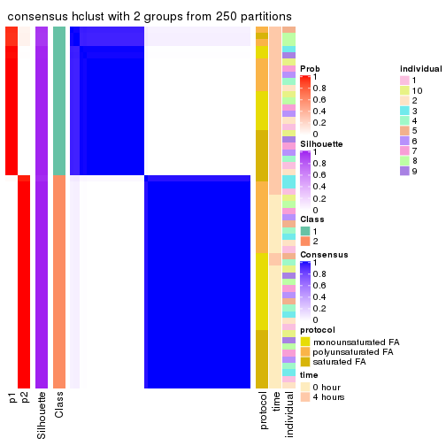</p>

</div>
<div id='tab-CV-hclust-consensus-heatmap-2'>
<pre><code class="r">consensus_heatmap(res, k = 3)
</code></pre>

<p>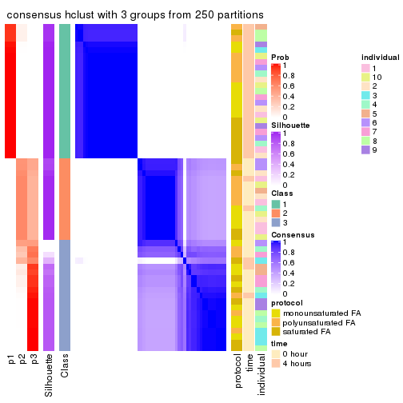</p>

</div>
<div id='tab-CV-hclust-consensus-heatmap-3'>
<pre><code class="r">consensus_heatmap(res, k = 4)
</code></pre>

<p>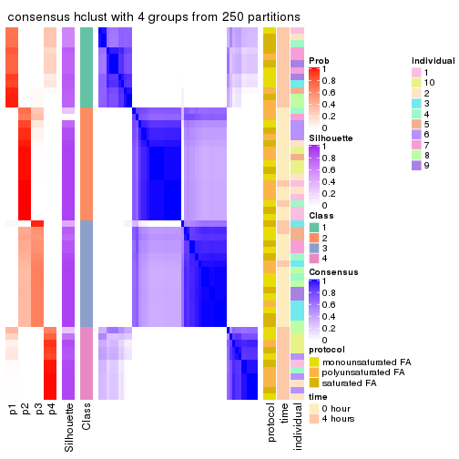</p>

</div>
<div id='tab-CV-hclust-consensus-heatmap-4'>
<pre><code class="r">consensus_heatmap(res, k = 5)
</code></pre>

<p>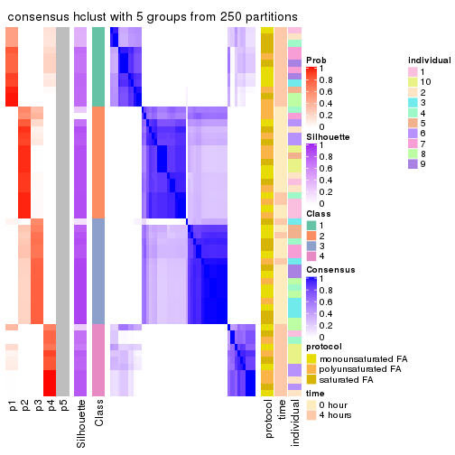</p>

</div>
<div id='tab-CV-hclust-consensus-heatmap-5'>
<pre><code class="r">consensus_heatmap(res, k = 6)
</code></pre>

<p>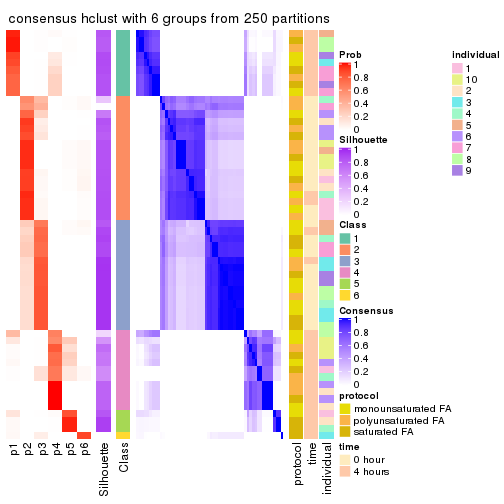</p>

</div>
</div>

Heatmaps for the membership of samples in all partitions to see how consistent they are:


<script>
$( function() {
	$( '#tabs-CV-hclust-membership-heatmap' ).tabs();
} );
</script>
<div id='tabs-CV-hclust-membership-heatmap'>
<ul>
<li><a href='#tab-CV-hclust-membership-heatmap-1'>k = 2</a></li>
<li><a href='#tab-CV-hclust-membership-heatmap-2'>k = 3</a></li>
<li><a href='#tab-CV-hclust-membership-heatmap-3'>k = 4</a></li>
<li><a href='#tab-CV-hclust-membership-heatmap-4'>k = 5</a></li>
<li><a href='#tab-CV-hclust-membership-heatmap-5'>k = 6</a></li>
</ul>
<div id='tab-CV-hclust-membership-heatmap-1'>
<pre><code class="r">membership_heatmap(res, k = 2)
</code></pre>

<p>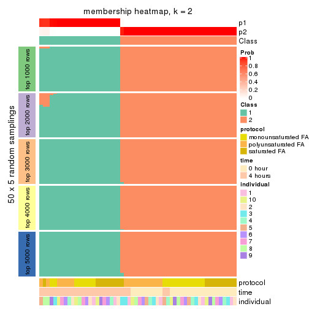</p>

</div>
<div id='tab-CV-hclust-membership-heatmap-2'>
<pre><code class="r">membership_heatmap(res, k = 3)
</code></pre>

<p>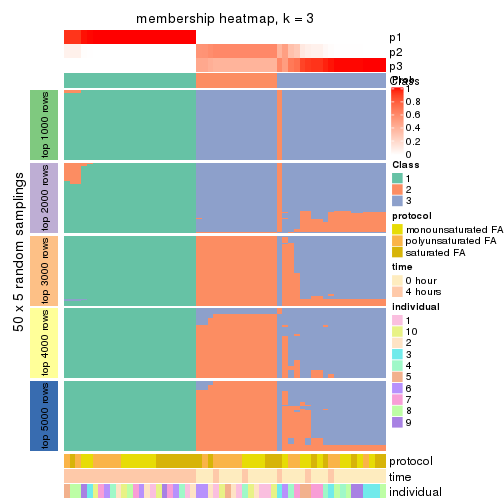</p>

</div>
<div id='tab-CV-hclust-membership-heatmap-3'>
<pre><code class="r">membership_heatmap(res, k = 4)
</code></pre>

<p>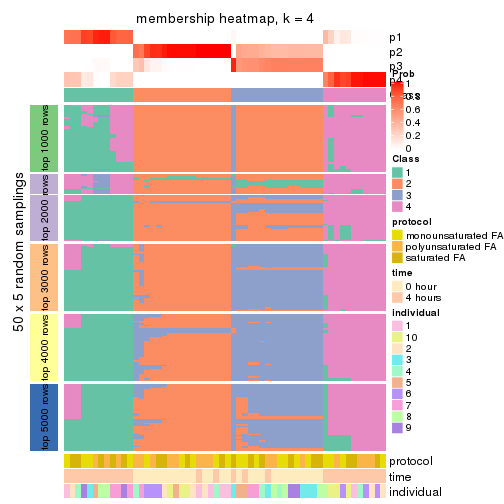</p>

</div>
<div id='tab-CV-hclust-membership-heatmap-4'>
<pre><code class="r">membership_heatmap(res, k = 5)
</code></pre>

<p>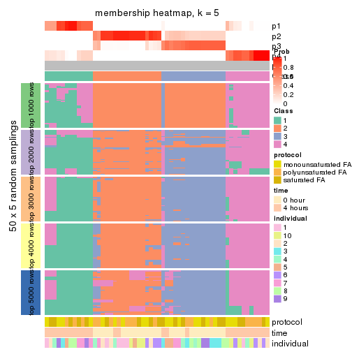</p>

</div>
<div id='tab-CV-hclust-membership-heatmap-5'>
<pre><code class="r">membership_heatmap(res, k = 6)
</code></pre>

<p>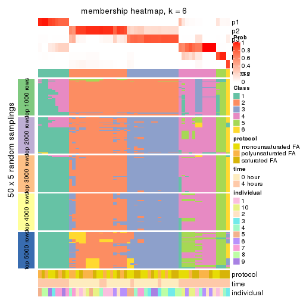</p>

</div>
</div>

As soon as we have had the classes for columns, we can look for signatures
which are significantly different between classes which can be candidate marks
for certain classes. Following are the heatmaps for signatures.


Signature heatmaps where rows are scaled:


<script>
$( function() {
	$( '#tabs-CV-hclust-get-signatures' ).tabs();
} );
</script>
<div id='tabs-CV-hclust-get-signatures'>
<ul>
<li><a href='#tab-CV-hclust-get-signatures-1'>k = 2</a></li>
<li><a href='#tab-CV-hclust-get-signatures-2'>k = 3</a></li>
<li><a href='#tab-CV-hclust-get-signatures-3'>k = 4</a></li>
<li><a href='#tab-CV-hclust-get-signatures-4'>k = 5</a></li>
<li><a href='#tab-CV-hclust-get-signatures-5'>k = 6</a></li>
</ul>
<div id='tab-CV-hclust-get-signatures-1'>
<pre><code class="r">get_signatures(res, k = 2)
</code></pre>

<p>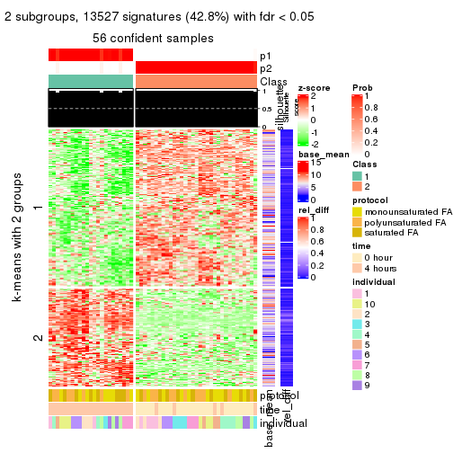</p>

</div>
<div id='tab-CV-hclust-get-signatures-2'>
<pre><code class="r">get_signatures(res, k = 3)
</code></pre>

<p>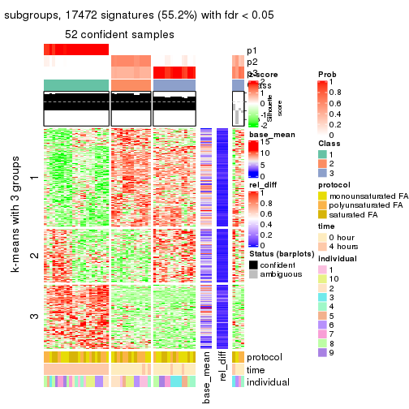</p>

</div>
<div id='tab-CV-hclust-get-signatures-3'>
<pre><code class="r">get_signatures(res, k = 4)
</code></pre>

<p>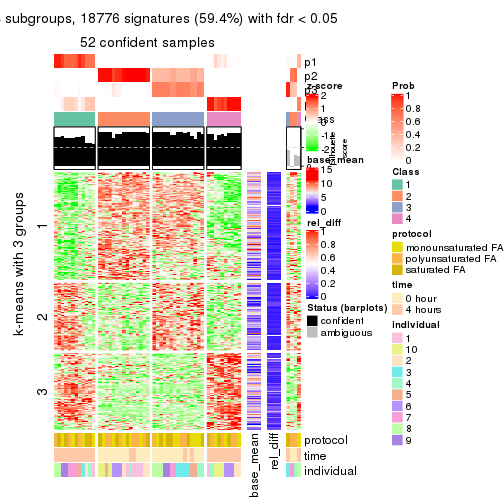</p>

</div>
<div id='tab-CV-hclust-get-signatures-4'>
<pre><code class="r">get_signatures(res, k = 5)
</code></pre>

<p>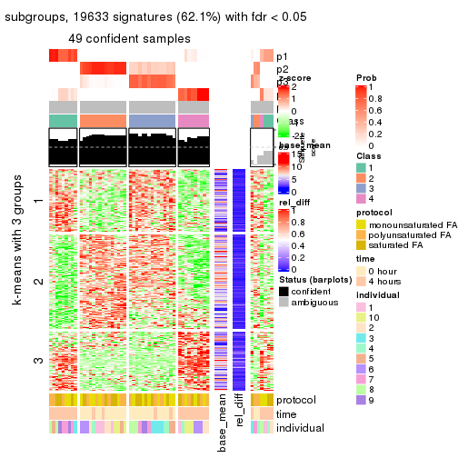</p>

</div>
<div id='tab-CV-hclust-get-signatures-5'>
<pre><code class="r">get_signatures(res, k = 6)
</code></pre>

<p>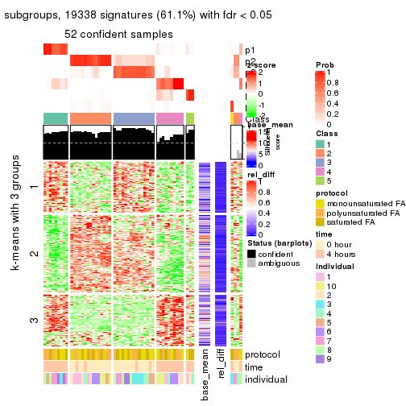</p>

</div>
</div>


Signature heatmaps where rows are not scaled:


<script>
$( function() {
	$( '#tabs-CV-hclust-get-signatures-no-scale' ).tabs();
} );
</script>
<div id='tabs-CV-hclust-get-signatures-no-scale'>
<ul>
<li><a href='#tab-CV-hclust-get-signatures-no-scale-1'>k = 2</a></li>
<li><a href='#tab-CV-hclust-get-signatures-no-scale-2'>k = 3</a></li>
<li><a href='#tab-CV-hclust-get-signatures-no-scale-3'>k = 4</a></li>
<li><a href='#tab-CV-hclust-get-signatures-no-scale-4'>k = 5</a></li>
<li><a href='#tab-CV-hclust-get-signatures-no-scale-5'>k = 6</a></li>
</ul>
<div id='tab-CV-hclust-get-signatures-no-scale-1'>
<pre><code class="r">get_signatures(res, k = 2, scale_rows = FALSE)
</code></pre>

<p>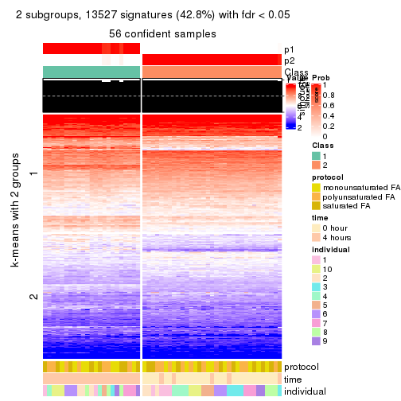</p>

</div>
<div id='tab-CV-hclust-get-signatures-no-scale-2'>
<pre><code class="r">get_signatures(res, k = 3, scale_rows = FALSE)
</code></pre>

<p>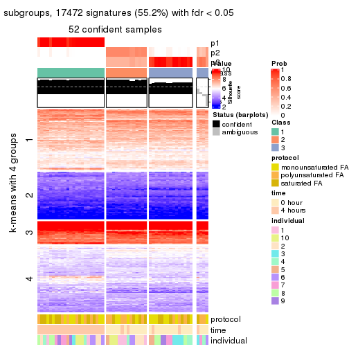</p>

</div>
<div id='tab-CV-hclust-get-signatures-no-scale-3'>
<pre><code class="r">get_signatures(res, k = 4, scale_rows = FALSE)
</code></pre>

<p>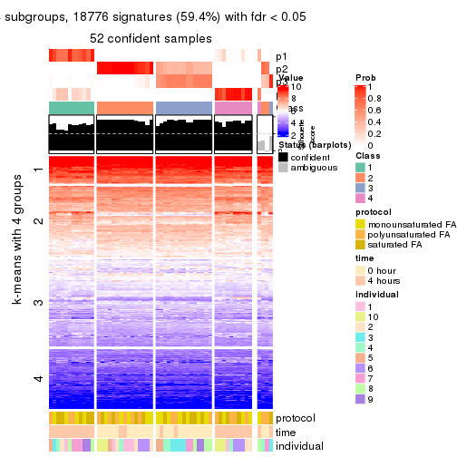</p>

</div>
<div id='tab-CV-hclust-get-signatures-no-scale-4'>
<pre><code class="r">get_signatures(res, k = 5, scale_rows = FALSE)
</code></pre>

<p>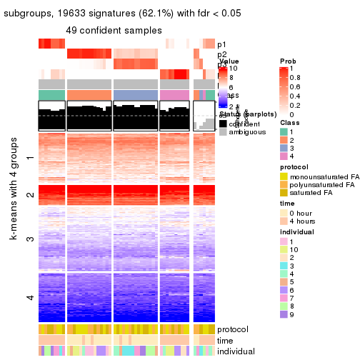</p>

</div>
<div id='tab-CV-hclust-get-signatures-no-scale-5'>
<pre><code class="r">get_signatures(res, k = 6, scale_rows = FALSE)
</code></pre>

<p>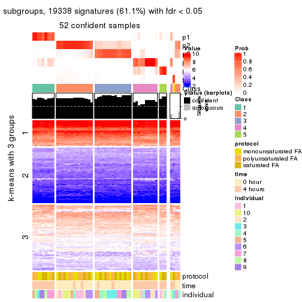</p>

</div>
</div>


Compare the overlap of signatures from different k:

```r
compare_signatures(res)
```

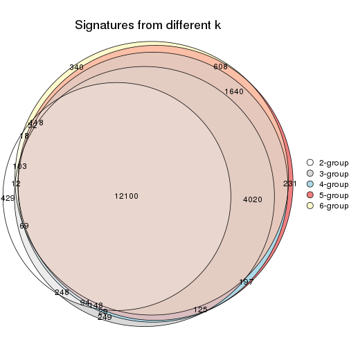

`get_signature()` returns a data frame invisibly. TO get the list of signatures, the function
call should be assigned to a variable explicitly. In following code, if `plot` argument is set
to `FALSE`, no heatmap is plotted while only the differential analysis is performed.

```r
# code only for demonstration
tb = get_signature(res, k = ..., plot = FALSE)
```

An example of the output of `tb` is:

```
#>   which_row         fdr    mean_1    mean_2 scaled_mean_1 scaled_mean_2 km
#> 1        38 0.042760348  8.373488  9.131774    -0.5533452     0.5164555  1
#> 2        40 0.018707592  7.106213  8.469186    -0.6173731     0.5762149  1
#> 3        55 0.019134737 10.221463 11.207825    -0.6159697     0.5749050  1
#> 4        59 0.006059896  5.921854  7.869574    -0.6899429     0.6439467  1
#> 5        60 0.018055526  8.928898 10.211722    -0.6204761     0.5791110  1
#> 6        98 0.009384629 15.714769 14.887706     0.6635654    -0.6193277  2
...
```

The columns in `tb` are:

1. `which_row`: row indices corresponding to the input matrix.
2. `fdr`: FDR for the differential test. 
3. `mean_x`: The mean value in group x.
4. `scaled_mean_x`: The mean value in group x after rows are scaled.
5. `km`: Row groups if k-means clustering is applied to rows.


UMAP plot which shows how samples are separated.


<script>
$( function() {
	$( '#tabs-CV-hclust-dimension-reduction' ).tabs();
} );
</script>
<div id='tabs-CV-hclust-dimension-reduction'>
<ul>
<li><a href='#tab-CV-hclust-dimension-reduction-1'>k = 2</a></li>
<li><a href='#tab-CV-hclust-dimension-reduction-2'>k = 3</a></li>
<li><a href='#tab-CV-hclust-dimension-reduction-3'>k = 4</a></li>
<li><a href='#tab-CV-hclust-dimension-reduction-4'>k = 5</a></li>
<li><a href='#tab-CV-hclust-dimension-reduction-5'>k = 6</a></li>
</ul>
<div id='tab-CV-hclust-dimension-reduction-1'>
<pre><code class="r">dimension_reduction(res, k = 2, method = &quot;UMAP&quot;)
</code></pre>

<p>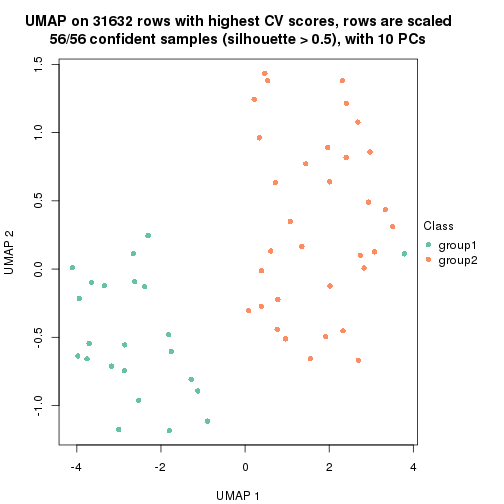</p>

</div>
<div id='tab-CV-hclust-dimension-reduction-2'>
<pre><code class="r">dimension_reduction(res, k = 3, method = &quot;UMAP&quot;)
</code></pre>

<p>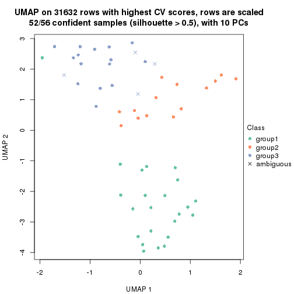</p>

</div>
<div id='tab-CV-hclust-dimension-reduction-3'>
<pre><code class="r">dimension_reduction(res, k = 4, method = &quot;UMAP&quot;)
</code></pre>

<p>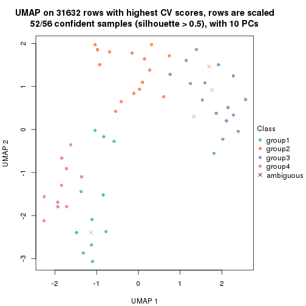</p>

</div>
<div id='tab-CV-hclust-dimension-reduction-4'>
<pre><code class="r">dimension_reduction(res, k = 5, method = &quot;UMAP&quot;)
</code></pre>

<p>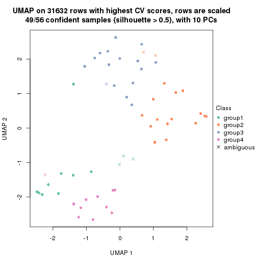</p>

</div>
<div id='tab-CV-hclust-dimension-reduction-5'>
<pre><code class="r">dimension_reduction(res, k = 6, method = &quot;UMAP&quot;)
</code></pre>

<p>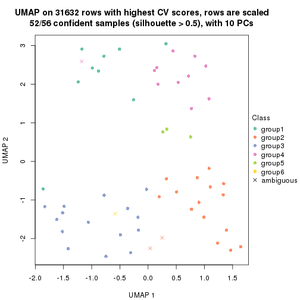</p>

</div>
</div>


Following heatmap shows how subgroups are split when increasing `k`:

```r
collect_classes(res)
```

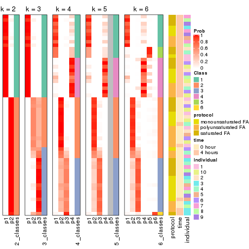


Test correlation between subgroups and known annotations. If the known
annotation is numeric, one-way ANOVA test is applied, and if the known
annotation is discrete, chi-squared contingency table test is applied.

```r
test_to_known_factors(res)
```

```
#>            n protocol(p)  time(p) individual(p) k
#> CV:hclust 56       0.937 2.29e-09        0.9502 2
#> CV:hclust 52       0.732 5.10e-09        0.0723 3
#> CV:hclust 52       0.870 2.65e-08        0.0161 4
#> CV:hclust 49       0.930 1.17e-07        0.0041 5
#> CV:hclust 52       0.851 1.05e-07        0.0119 6
```


If matrix rows can be associated to genes, consider to use `functional_enrichment(res,
...)` to perform function enrichment for the signature genes. See [this vignette](http://bioconductor.org/packages/devel/bioc/vignettes/cola/inst/doc/functional_enrichment.html) for more detailed explanations.


 

---------------------------------------------------


### CV:kmeans**


The object with results only for a single top-value method and a single partition method 
can be extracted as:

```r
res = res_list["CV", "kmeans"]
# you can also extract it by
# res = res_list["CV:kmeans"]
```

A summary of `res` and all the functions that can be applied to it:

```r
res
```

```
#> A 'ConsensusPartition' object with k = 2, 3, 4, 5, 6.
#>   On a matrix with 31632 rows and 56 columns.
#>   Top rows (1000, 2000, 3000, 4000, 5000) are extracted by 'CV' method.
#>   Subgroups are detected by 'kmeans' method.
#>   Performed in total 1250 partitions by row resampling.
#>   Best k for subgroups seems to be 2.
#> 
#> Following methods can be applied to this 'ConsensusPartition' object:
#>  [1] "cola_report"             "collect_classes"         "collect_plots"          
#>  [4] "collect_stats"           "colnames"                "compare_signatures"     
#>  [7] "consensus_heatmap"       "dimension_reduction"     "functional_enrichment"  
#> [10] "get_anno_col"            "get_anno"                "get_classes"            
#> [13] "get_consensus"           "get_matrix"              "get_membership"         
#> [16] "get_param"               "get_signatures"          "get_stats"              
#> [19] "is_best_k"               "is_stable_k"             "membership_heatmap"     
#> [22] "ncol"                    "nrow"                    "plot_ecdf"              
#> [25] "rownames"                "select_partition_number" "show"                   
#> [28] "suggest_best_k"          "test_to_known_factors"
```

`collect_plots()` function collects all the plots made from `res` for all `k` (number of partitions)
into one single page to provide an easy and fast comparison between different `k`.

```r
collect_plots(res)
```

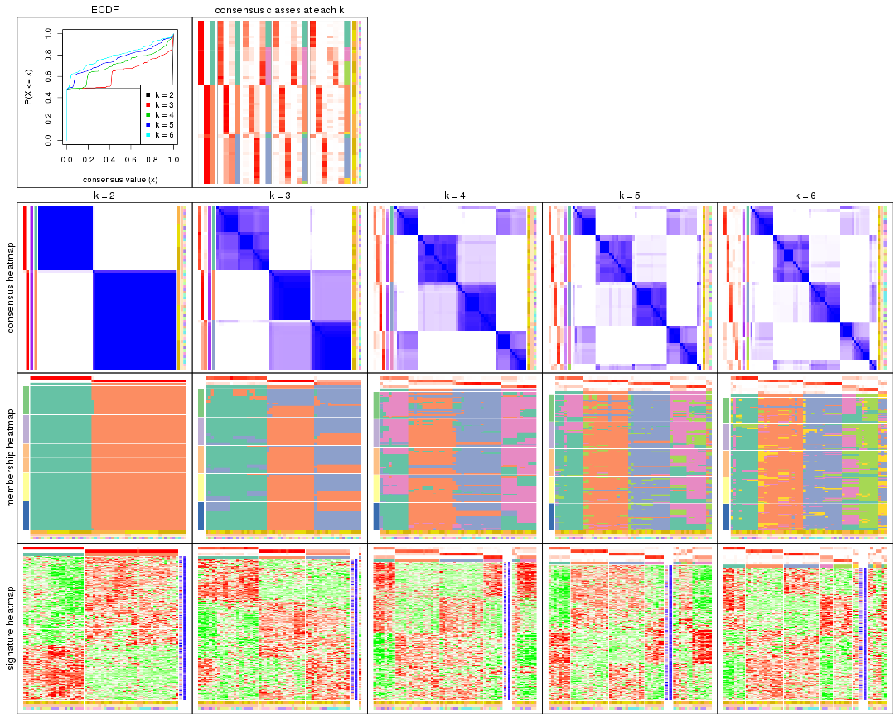

The plots are:

- The first row: a plot of the ECDF (empirical cumulative distribution
  function) curves of the consensus matrix for each `k` and the heatmap of
  predicted classes for each `k`.
- The second row: heatmaps of the consensus matrix for each `k`.
- The third row: heatmaps of the membership matrix for each `k`.
- The fouth row: heatmaps of the signatures for each `k`.

All the plots in panels can be made by individual functions and they are
plotted later in this section.

`select_partition_number()` produces several plots showing different
statistics for choosing "optimized" `k`. There are following statistics:

- ECDF curves of the consensus matrix for each `k`;
- 1-PAC. [The PAC
  score](https://en.wikipedia.org/wiki/Consensus_clustering#Over-interpretation_potential_of_consensus_clustering)
  measures the proportion of the ambiguous subgrouping.
- Mean silhouette score.
- Concordance. The mean probability of fiting the consensus class ids in all
  partitions.
- Area increased. Denote $A_k$ as the area under the ECDF curve for current
  `k`, the area increased is defined as $A_k - A_{k-1}$.
- Rand index. The percent of pairs of samples that are both in a same cluster
  or both are not in a same cluster in the partition of k and k-1.
- Jaccard index. The ratio of pairs of samples are both in a same cluster in
  the partition of k and k-1 and the pairs of samples are both in a same
  cluster in the partition k or k-1.

The detailed explanations of these statistics can be found in [the _cola_
vignette](http://bioconductor.org/packages/devel/bioc/vignettes/cola/inst/doc/cola.html#toc_13).

Generally speaking, lower PAC score, higher mean silhouette score or higher
concordance corresponds to better partition. Rand index and Jaccard index
measure how similar the current partition is compared to partition with `k-1`.
If they are too similar, we won't accept `k` is better than `k-1`.

```r
select_partition_number(res)
```

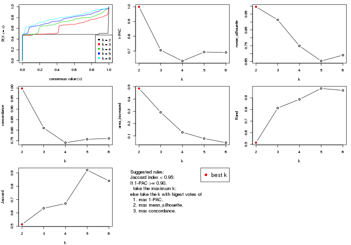

The numeric values for all these statistics can be obtained by `get_stats()`.

```r
get_stats(res)
```

```
#>   k 1-PAC mean_silhouette concordance area_increased  Rand Jaccard
#> 2 2 1.000           0.996       0.998         0.4870 0.514   0.514
#> 3 3 0.705           0.913       0.810         0.2922 0.812   0.635
#> 4 4 0.632           0.749       0.741         0.1289 0.887   0.670
#> 5 5 0.693           0.654       0.757         0.0785 0.981   0.921
#> 6 6 0.690           0.691       0.761         0.0445 0.964   0.840
```

`suggest_best_k()` suggests the best $k$ based on these statistics. The rules are as follows:

- All $k$ with Jaccard index larger than 0.95 are removed because increasing
  $k$ does not provide enough extra information. If all $k$ are removed, it is
  marked as no subgroup is detected.
- For all $k$ with 1-PAC score larger than 0.9, the maximal $k$ is taken as
  the best $k$, and other $k$ are marked as optional $k$.
- If it does not fit the second rule. The $k$ with the maximal vote of the
  highest 1-PAC score, highest mean silhouette, and highest concordance is
  taken as the best $k$.

```r
suggest_best_k(res)
```

```
#> [1] 2
```


Following shows the table of the partitions (You need to click the **show/hide
code output** link to see it). The membership matrix (columns with name `p*`)
is inferred by
[`clue::cl_consensus()`](https://www.rdocumentation.org/link/cl_consensus?package=clue)
function with the `SE` method. Basically the value in the membership matrix
represents the probability to belong to a certain group. The finall class
label for an item is determined with the group with highest probability it
belongs to.

In `get_classes()` function, the entropy is calculated from the membership
matrix and the silhouette score is calculated from the consensus matrix.


<script>
$( function() {
	$( '#tabs-CV-kmeans-get-classes' ).tabs();
} );
</script>
<div id='tabs-CV-kmeans-get-classes'>
<ul>
<li><a href='#tab-CV-kmeans-get-classes-1'>k = 2</a></li>
<li><a href='#tab-CV-kmeans-get-classes-2'>k = 3</a></li>
<li><a href='#tab-CV-kmeans-get-classes-3'>k = 4</a></li>
<li><a href='#tab-CV-kmeans-get-classes-4'>k = 5</a></li>
<li><a href='#tab-CV-kmeans-get-classes-5'>k = 6</a></li>
</ul>

<div id='tab-CV-kmeans-get-classes-1'>
<p><a id='tab-CV-kmeans-get-classes-1-a' style='color:#0366d6' href='#'>show/hide code output</a></p>
<pre><code class="r">cbind(get_classes(res, k = 2), get_membership(res, k = 2))
</code></pre>

<pre><code>#&gt;           class entropy silhouette    p1    p2
#&gt; GSM790742     2   0.000      0.997 0.000 1.000
#&gt; GSM790744     2   0.000      0.997 0.000 1.000
#&gt; GSM790754     2   0.000      0.997 0.000 1.000
#&gt; GSM790756     2   0.000      0.997 0.000 1.000
#&gt; GSM790768     2   0.000      0.997 0.000 1.000
#&gt; GSM790774     2   0.000      0.997 0.000 1.000
#&gt; GSM790778     2   0.000      0.997 0.000 1.000
#&gt; GSM790784     2   0.000      0.997 0.000 1.000
#&gt; GSM790790     2   0.000      0.997 0.000 1.000
#&gt; GSM790743     1   0.000      1.000 1.000 0.000
#&gt; GSM790745     1   0.000      1.000 1.000 0.000
#&gt; GSM790755     2   0.000      0.997 0.000 1.000
#&gt; GSM790757     1   0.000      1.000 1.000 0.000
#&gt; GSM790769     1   0.000      1.000 1.000 0.000
#&gt; GSM790775     1   0.000      1.000 1.000 0.000
#&gt; GSM790779     1   0.000      1.000 1.000 0.000
#&gt; GSM790785     1   0.000      1.000 1.000 0.000
#&gt; GSM790791     1   0.000      1.000 1.000 0.000
#&gt; GSM790738     2   0.000      0.997 0.000 1.000
#&gt; GSM790746     2   0.000      0.997 0.000 1.000
#&gt; GSM790752     2   0.000      0.997 0.000 1.000
#&gt; GSM790758     2   0.000      0.997 0.000 1.000
#&gt; GSM790764     2   0.000      0.997 0.000 1.000
#&gt; GSM790766     2   0.000      0.997 0.000 1.000
#&gt; GSM790772     2   0.000      0.997 0.000 1.000
#&gt; GSM790782     2   0.000      0.997 0.000 1.000
#&gt; GSM790786     2   0.000      0.997 0.000 1.000
#&gt; GSM790792     2   0.000      0.997 0.000 1.000
#&gt; GSM790739     1   0.000      1.000 1.000 0.000
#&gt; GSM790747     1   0.000      1.000 1.000 0.000
#&gt; GSM790753     1   0.000      1.000 1.000 0.000
#&gt; GSM790759     2   0.000      0.997 0.000 1.000
#&gt; GSM790765     2   0.000      0.997 0.000 1.000
#&gt; GSM790767     1   0.000      1.000 1.000 0.000
#&gt; GSM790773     1   0.000      1.000 1.000 0.000
#&gt; GSM790783     1   0.000      1.000 1.000 0.000
#&gt; GSM790787     1   0.000      1.000 1.000 0.000
#&gt; GSM790793     1   0.000      1.000 1.000 0.000
#&gt; GSM790740     2   0.000      0.997 0.000 1.000
#&gt; GSM790748     2   0.000      0.997 0.000 1.000
#&gt; GSM790750     2   0.000      0.997 0.000 1.000
#&gt; GSM790760     2   0.000      0.997 0.000 1.000
#&gt; GSM790762     2   0.000      0.997 0.000 1.000
#&gt; GSM790770     2   0.000      0.997 0.000 1.000
#&gt; GSM790776     2   0.000      0.997 0.000 1.000
#&gt; GSM790780     2   0.000      0.997 0.000 1.000
#&gt; GSM790788     2   0.000      0.997 0.000 1.000
#&gt; GSM790741     2   0.000      0.997 0.000 1.000
#&gt; GSM790749     1   0.000      1.000 1.000 0.000
#&gt; GSM790751     2   0.000      0.997 0.000 1.000
#&gt; GSM790761     1   0.000      1.000 1.000 0.000
#&gt; GSM790763     1   0.000      1.000 1.000 0.000
#&gt; GSM790771     1   0.000      1.000 1.000 0.000
#&gt; GSM790777     1   0.000      1.000 1.000 0.000
#&gt; GSM790781     2   0.506      0.874 0.112 0.888
#&gt; GSM790789     1   0.000      1.000 1.000 0.000
</code></pre>

<script>
$('#tab-CV-kmeans-get-classes-1-a').parent().next().next().hide();
$('#tab-CV-kmeans-get-classes-1-a').click(function(){
  $('#tab-CV-kmeans-get-classes-1-a').parent().next().next().toggle();
  return(false);
});
</script>
</div>

<div id='tab-CV-kmeans-get-classes-2'>
<p><a id='tab-CV-kmeans-get-classes-2-a' style='color:#0366d6' href='#'>show/hide code output</a></p>
<pre><code class="r">cbind(get_classes(res, k = 3), get_membership(res, k = 3))
</code></pre>

<pre><code>#&gt;           class entropy silhouette    p1    p2    p3
#&gt; GSM790742     2  0.0592      0.968 0.000 0.988 0.012
#&gt; GSM790744     2  0.0000      0.980 0.000 1.000 0.000
#&gt; GSM790754     3  0.6204      0.945 0.000 0.424 0.576
#&gt; GSM790756     3  0.6225      0.935 0.000 0.432 0.568
#&gt; GSM790768     2  0.0000      0.980 0.000 1.000 0.000
#&gt; GSM790774     3  0.6204      0.945 0.000 0.424 0.576
#&gt; GSM790778     3  0.6204      0.945 0.000 0.424 0.576
#&gt; GSM790784     3  0.6204      0.945 0.000 0.424 0.576
#&gt; GSM790790     2  0.0000      0.980 0.000 1.000 0.000
#&gt; GSM790743     1  0.4452      0.865 0.808 0.000 0.192
#&gt; GSM790745     1  0.3752      0.876 0.856 0.000 0.144
#&gt; GSM790755     3  0.5988      0.874 0.000 0.368 0.632
#&gt; GSM790757     1  0.3752      0.876 0.856 0.000 0.144
#&gt; GSM790769     1  0.2448      0.889 0.924 0.000 0.076
#&gt; GSM790775     1  0.4062      0.880 0.836 0.000 0.164
#&gt; GSM790779     1  0.4654      0.863 0.792 0.000 0.208
#&gt; GSM790785     1  0.4062      0.880 0.836 0.000 0.164
#&gt; GSM790791     1  0.3482      0.882 0.872 0.000 0.128
#&gt; GSM790738     2  0.0000      0.980 0.000 1.000 0.000
#&gt; GSM790746     2  0.0000      0.980 0.000 1.000 0.000
#&gt; GSM790752     3  0.6204      0.945 0.000 0.424 0.576
#&gt; GSM790758     3  0.6192      0.942 0.000 0.420 0.580
#&gt; GSM790764     3  0.6192      0.930 0.000 0.420 0.580
#&gt; GSM790766     2  0.1529      0.922 0.000 0.960 0.040
#&gt; GSM790772     2  0.0000      0.980 0.000 1.000 0.000
#&gt; GSM790782     3  0.6204      0.945 0.000 0.424 0.576
#&gt; GSM790786     3  0.6204      0.945 0.000 0.424 0.576
#&gt; GSM790792     2  0.0000      0.980 0.000 1.000 0.000
#&gt; GSM790739     1  0.3752      0.876 0.856 0.000 0.144
#&gt; GSM790747     1  0.2448      0.889 0.924 0.000 0.076
#&gt; GSM790753     1  0.4062      0.880 0.836 0.000 0.164
#&gt; GSM790759     2  0.0237      0.977 0.000 0.996 0.004
#&gt; GSM790765     3  0.6204      0.945 0.000 0.424 0.576
#&gt; GSM790767     1  0.0000      0.896 1.000 0.000 0.000
#&gt; GSM790773     1  0.4062      0.880 0.836 0.000 0.164
#&gt; GSM790783     1  0.4842      0.876 0.776 0.000 0.224
#&gt; GSM790787     1  0.4121      0.879 0.832 0.000 0.168
#&gt; GSM790793     1  0.3482      0.875 0.872 0.000 0.128
#&gt; GSM790740     2  0.0000      0.980 0.000 1.000 0.000
#&gt; GSM790748     2  0.0592      0.968 0.000 0.988 0.012
#&gt; GSM790750     3  0.6204      0.945 0.000 0.424 0.576
#&gt; GSM790760     3  0.6192      0.930 0.000 0.420 0.580
#&gt; GSM790762     2  0.0000      0.980 0.000 1.000 0.000
#&gt; GSM790770     2  0.0237      0.977 0.000 0.996 0.004
#&gt; GSM790776     2  0.3482      0.759 0.000 0.872 0.128
#&gt; GSM790780     3  0.6204      0.945 0.000 0.424 0.576
#&gt; GSM790788     2  0.0000      0.980 0.000 1.000 0.000
#&gt; GSM790741     2  0.0000      0.980 0.000 1.000 0.000
#&gt; GSM790749     1  0.2448      0.889 0.924 0.000 0.076
#&gt; GSM790751     3  0.6204      0.945 0.000 0.424 0.576
#&gt; GSM790761     1  0.4291      0.867 0.820 0.000 0.180
#&gt; GSM790763     1  0.5138      0.859 0.748 0.000 0.252
#&gt; GSM790771     1  0.2448      0.889 0.924 0.000 0.076
#&gt; GSM790777     1  0.4062      0.880 0.836 0.000 0.164
#&gt; GSM790781     3  0.5393      0.434 0.108 0.072 0.820
#&gt; GSM790789     1  0.2448      0.889 0.924 0.000 0.076
</code></pre>

<script>
$('#tab-CV-kmeans-get-classes-2-a').parent().next().next().hide();
$('#tab-CV-kmeans-get-classes-2-a').click(function(){
  $('#tab-CV-kmeans-get-classes-2-a').parent().next().next().toggle();
  return(false);
});
</script>
</div>

<div id='tab-CV-kmeans-get-classes-3'>
<p><a id='tab-CV-kmeans-get-classes-3-a' style='color:#0366d6' href='#'>show/hide code output</a></p>
<pre><code class="r">cbind(get_classes(res, k = 4), get_membership(res, k = 4))
</code></pre>

<pre><code>#&gt;           class entropy silhouette    p1    p2    p3    p4
#&gt; GSM790742     2  0.6049     0.8665 0.132 0.684 0.184 0.000
#&gt; GSM790744     2  0.4163     0.9430 0.020 0.792 0.188 0.000
#&gt; GSM790754     3  0.0188     0.9074 0.004 0.000 0.996 0.000
#&gt; GSM790756     3  0.2002     0.8986 0.044 0.020 0.936 0.000
#&gt; GSM790768     2  0.4163     0.9430 0.020 0.792 0.188 0.000
#&gt; GSM790774     3  0.1398     0.9055 0.040 0.004 0.956 0.000
#&gt; GSM790778     3  0.1398     0.9055 0.040 0.004 0.956 0.000
#&gt; GSM790784     3  0.1398     0.9055 0.040 0.004 0.956 0.000
#&gt; GSM790790     2  0.5102     0.9350 0.064 0.748 0.188 0.000
#&gt; GSM790743     4  0.2224     0.6321 0.032 0.040 0.000 0.928
#&gt; GSM790745     4  0.1661     0.6164 0.052 0.004 0.000 0.944
#&gt; GSM790755     3  0.3372     0.8288 0.096 0.036 0.868 0.000
#&gt; GSM790757     4  0.1661     0.6164 0.052 0.004 0.000 0.944
#&gt; GSM790769     4  0.6664     0.4818 0.272 0.128 0.000 0.600
#&gt; GSM790775     1  0.4776     0.7387 0.624 0.000 0.000 0.376
#&gt; GSM790779     1  0.4980     0.6681 0.680 0.016 0.000 0.304
#&gt; GSM790785     1  0.4776     0.7387 0.624 0.000 0.000 0.376
#&gt; GSM790791     4  0.1743     0.6398 0.056 0.004 0.000 0.940
#&gt; GSM790738     2  0.3668     0.9437 0.004 0.808 0.188 0.000
#&gt; GSM790746     2  0.4365     0.9424 0.028 0.784 0.188 0.000
#&gt; GSM790752     3  0.0707     0.9050 0.020 0.000 0.980 0.000
#&gt; GSM790758     3  0.0817     0.9044 0.024 0.000 0.976 0.000
#&gt; GSM790764     3  0.3479     0.8110 0.148 0.012 0.840 0.000
#&gt; GSM790766     2  0.5038     0.8371 0.020 0.684 0.296 0.000
#&gt; GSM790772     2  0.4098     0.9347 0.012 0.784 0.204 0.000
#&gt; GSM790782     3  0.1398     0.9055 0.040 0.004 0.956 0.000
#&gt; GSM790786     3  0.1398     0.9055 0.040 0.004 0.956 0.000
#&gt; GSM790792     2  0.5102     0.9350 0.064 0.748 0.188 0.000
#&gt; GSM790739     4  0.1661     0.6164 0.052 0.004 0.000 0.944
#&gt; GSM790747     4  0.6664     0.4818 0.272 0.128 0.000 0.600
#&gt; GSM790753     1  0.4950     0.7386 0.620 0.004 0.000 0.376
#&gt; GSM790759     2  0.4466     0.9326 0.036 0.784 0.180 0.000
#&gt; GSM790765     3  0.0469     0.9064 0.012 0.000 0.988 0.000
#&gt; GSM790767     4  0.6052     0.4148 0.284 0.076 0.000 0.640
#&gt; GSM790773     1  0.4776     0.7387 0.624 0.000 0.000 0.376
#&gt; GSM790783     1  0.6621     0.3922 0.508 0.084 0.000 0.408
#&gt; GSM790787     1  0.4950     0.7386 0.620 0.004 0.000 0.376
#&gt; GSM790793     4  0.1109     0.6301 0.028 0.004 0.000 0.968
#&gt; GSM790740     2  0.3668     0.9437 0.004 0.808 0.188 0.000
#&gt; GSM790748     2  0.6049     0.8665 0.132 0.684 0.184 0.000
#&gt; GSM790750     3  0.0469     0.9068 0.012 0.000 0.988 0.000
#&gt; GSM790760     3  0.4541     0.7594 0.144 0.060 0.796 0.000
#&gt; GSM790762     2  0.5102     0.9350 0.064 0.748 0.188 0.000
#&gt; GSM790770     2  0.5091     0.9299 0.068 0.752 0.180 0.000
#&gt; GSM790776     3  0.7210    -0.2885 0.140 0.404 0.456 0.000
#&gt; GSM790780     3  0.1661     0.9015 0.052 0.004 0.944 0.000
#&gt; GSM790788     2  0.5102     0.9350 0.064 0.748 0.188 0.000
#&gt; GSM790741     2  0.3668     0.9437 0.004 0.808 0.188 0.000
#&gt; GSM790749     4  0.6664     0.4818 0.272 0.128 0.000 0.600
#&gt; GSM790751     3  0.0188     0.9074 0.004 0.000 0.996 0.000
#&gt; GSM790761     4  0.0707     0.6347 0.000 0.020 0.000 0.980
#&gt; GSM790763     1  0.5289     0.6205 0.636 0.020 0.000 0.344
#&gt; GSM790771     4  0.6664     0.4818 0.272 0.128 0.000 0.600
#&gt; GSM790777     1  0.4776     0.7387 0.624 0.000 0.000 0.376
#&gt; GSM790781     1  0.7482    -0.0315 0.488 0.024 0.388 0.100
#&gt; GSM790789     4  0.6664     0.4818 0.272 0.128 0.000 0.600
</code></pre>

<script>
$('#tab-CV-kmeans-get-classes-3-a').parent().next().next().hide();
$('#tab-CV-kmeans-get-classes-3-a').click(function(){
  $('#tab-CV-kmeans-get-classes-3-a').parent().next().next().toggle();
  return(false);
});
</script>
</div>

<div id='tab-CV-kmeans-get-classes-4'>
<p><a id='tab-CV-kmeans-get-classes-4-a' style='color:#0366d6' href='#'>show/hide code output</a></p>
<pre><code class="r">cbind(get_classes(res, k = 5), get_membership(res, k = 5))
</code></pre>

<pre><code>#&gt;           class entropy silhouette    p1    p2    p3    p4    p5
#&gt; GSM790742     2  0.4965      0.362 0.016 0.588 0.012 0.000 0.384
#&gt; GSM790744     2  0.0404      0.822 0.000 0.988 0.012 0.000 0.000
#&gt; GSM790754     3  0.3605      0.814 0.016 0.060 0.844 0.000 0.080
#&gt; GSM790756     3  0.3520      0.773 0.004 0.080 0.840 0.000 0.076
#&gt; GSM790768     2  0.0693      0.821 0.008 0.980 0.012 0.000 0.000
#&gt; GSM790774     3  0.1638      0.823 0.004 0.064 0.932 0.000 0.000
#&gt; GSM790778     3  0.1638      0.823 0.004 0.064 0.932 0.000 0.000
#&gt; GSM790784     3  0.1638      0.823 0.004 0.064 0.932 0.000 0.000
#&gt; GSM790790     2  0.3065      0.791 0.048 0.872 0.008 0.000 0.072
#&gt; GSM790743     4  0.2935      0.610 0.012 0.000 0.024 0.876 0.088
#&gt; GSM790745     4  0.1608      0.605 0.072 0.000 0.000 0.928 0.000
#&gt; GSM790755     3  0.6070      0.403 0.136 0.020 0.624 0.000 0.220
#&gt; GSM790757     4  0.1608      0.605 0.072 0.000 0.000 0.928 0.000
#&gt; GSM790769     4  0.6425      0.485 0.248 0.000 0.000 0.508 0.244
#&gt; GSM790775     1  0.3452      0.758 0.756 0.000 0.000 0.244 0.000
#&gt; GSM790779     1  0.4335      0.646 0.776 0.000 0.008 0.152 0.064
#&gt; GSM790785     1  0.3452      0.758 0.756 0.000 0.000 0.244 0.000
#&gt; GSM790791     4  0.2464      0.622 0.096 0.000 0.000 0.888 0.016
#&gt; GSM790738     2  0.2100      0.820 0.016 0.924 0.012 0.000 0.048
#&gt; GSM790746     2  0.3766      0.784 0.056 0.828 0.012 0.000 0.104
#&gt; GSM790752     3  0.4065      0.788 0.016 0.056 0.808 0.000 0.120
#&gt; GSM790758     3  0.4291      0.771 0.016 0.056 0.788 0.000 0.140
#&gt; GSM790764     3  0.5945     -0.333 0.012 0.072 0.480 0.000 0.436
#&gt; GSM790766     2  0.2909      0.699 0.012 0.848 0.140 0.000 0.000
#&gt; GSM790772     2  0.2349      0.791 0.004 0.900 0.084 0.000 0.012
#&gt; GSM790782     3  0.1638      0.823 0.004 0.064 0.932 0.000 0.000
#&gt; GSM790786     3  0.1638      0.823 0.004 0.064 0.932 0.000 0.000
#&gt; GSM790792     2  0.3065      0.791 0.048 0.872 0.008 0.000 0.072
#&gt; GSM790739     4  0.1608      0.605 0.072 0.000 0.000 0.928 0.000
#&gt; GSM790747     4  0.6552      0.484 0.248 0.000 0.004 0.508 0.240
#&gt; GSM790753     1  0.3508      0.753 0.748 0.000 0.000 0.252 0.000
#&gt; GSM790759     2  0.3292      0.765 0.016 0.836 0.008 0.000 0.140
#&gt; GSM790765     3  0.3423      0.817 0.016 0.060 0.856 0.000 0.068
#&gt; GSM790767     4  0.5811      0.423 0.316 0.000 0.000 0.568 0.116
#&gt; GSM790773     1  0.3452      0.758 0.756 0.000 0.000 0.244 0.000
#&gt; GSM790783     1  0.6380      0.322 0.524 0.000 0.004 0.296 0.176
#&gt; GSM790787     1  0.3452      0.758 0.756 0.000 0.000 0.244 0.000
#&gt; GSM790793     4  0.1341      0.613 0.056 0.000 0.000 0.944 0.000
#&gt; GSM790740     2  0.2198      0.820 0.020 0.920 0.012 0.000 0.048
#&gt; GSM790748     2  0.5003      0.306 0.016 0.572 0.012 0.000 0.400
#&gt; GSM790750     3  0.3968      0.793 0.016 0.056 0.816 0.000 0.112
#&gt; GSM790760     5  0.6032      0.359 0.000 0.120 0.388 0.000 0.492
#&gt; GSM790762     2  0.3065      0.791 0.048 0.872 0.008 0.000 0.072
#&gt; GSM790770     2  0.2477      0.786 0.008 0.892 0.008 0.000 0.092
#&gt; GSM790776     5  0.6761      0.504 0.004 0.336 0.228 0.000 0.432
#&gt; GSM790780     3  0.1798      0.819 0.004 0.064 0.928 0.000 0.004
#&gt; GSM790788     2  0.3065      0.791 0.048 0.872 0.008 0.000 0.072
#&gt; GSM790741     2  0.2198      0.820 0.020 0.920 0.012 0.000 0.048
#&gt; GSM790749     4  0.6552      0.484 0.248 0.000 0.004 0.508 0.240
#&gt; GSM790751     3  0.3663      0.812 0.016 0.060 0.840 0.000 0.084
#&gt; GSM790761     4  0.1597      0.615 0.008 0.000 0.024 0.948 0.020
#&gt; GSM790763     1  0.5085      0.602 0.720 0.000 0.020 0.188 0.072
#&gt; GSM790771     4  0.6425      0.485 0.248 0.000 0.000 0.508 0.244
#&gt; GSM790777     1  0.3452      0.758 0.756 0.000 0.000 0.244 0.000
#&gt; GSM790781     1  0.6708      0.178 0.532 0.000 0.324 0.068 0.076
#&gt; GSM790789     4  0.6425      0.485 0.248 0.000 0.000 0.508 0.244
</code></pre>

<script>
$('#tab-CV-kmeans-get-classes-4-a').parent().next().next().hide();
$('#tab-CV-kmeans-get-classes-4-a').click(function(){
  $('#tab-CV-kmeans-get-classes-4-a').parent().next().next().toggle();
  return(false);
});
</script>
</div>

<div id='tab-CV-kmeans-get-classes-5'>
<p><a id='tab-CV-kmeans-get-classes-5-a' style='color:#0366d6' href='#'>show/hide code output</a></p>
<pre><code class="r">cbind(get_classes(res, k = 6), get_membership(res, k = 6))
</code></pre>

<pre><code>#&gt;           class entropy silhouette    p1    p2    p3    p4    p5    p6
#&gt; GSM790742     2  0.5516     0.4155 0.000 0.520 0.020 0.044 0.016 0.400
#&gt; GSM790744     2  0.0976     0.7952 0.000 0.968 0.016 0.008 0.000 0.008
#&gt; GSM790754     3  0.3631     0.7253 0.000 0.012 0.816 0.036 0.012 0.124
#&gt; GSM790756     3  0.3111     0.6738 0.000 0.032 0.836 0.000 0.008 0.124
#&gt; GSM790768     2  0.1262     0.7942 0.000 0.956 0.016 0.020 0.000 0.008
#&gt; GSM790774     3  0.0777     0.7521 0.000 0.024 0.972 0.000 0.004 0.000
#&gt; GSM790778     3  0.0692     0.7549 0.000 0.020 0.976 0.000 0.004 0.000
#&gt; GSM790784     3  0.0692     0.7549 0.000 0.020 0.976 0.000 0.004 0.000
#&gt; GSM790790     2  0.3998     0.7515 0.000 0.768 0.016 0.180 0.008 0.028
#&gt; GSM790743     5  0.5315     0.5382 0.080 0.000 0.000 0.144 0.688 0.088
#&gt; GSM790745     5  0.2320     0.7743 0.132 0.000 0.000 0.000 0.864 0.004
#&gt; GSM790755     3  0.6863     0.0409 0.028 0.000 0.436 0.208 0.020 0.308
#&gt; GSM790757     5  0.2320     0.7743 0.132 0.000 0.000 0.000 0.864 0.004
#&gt; GSM790769     4  0.5860     0.9916 0.248 0.000 0.000 0.484 0.268 0.000
#&gt; GSM790775     1  0.1168     0.8218 0.956 0.000 0.000 0.000 0.028 0.016
#&gt; GSM790779     1  0.2076     0.7720 0.920 0.004 0.000 0.040 0.016 0.020
#&gt; GSM790785     1  0.1313     0.8225 0.952 0.004 0.000 0.000 0.028 0.016
#&gt; GSM790791     5  0.4331     0.6550 0.188 0.004 0.000 0.036 0.744 0.028
#&gt; GSM790738     2  0.2496     0.7922 0.000 0.900 0.016 0.032 0.008 0.044
#&gt; GSM790746     2  0.4940     0.7146 0.000 0.732 0.008 0.108 0.044 0.108
#&gt; GSM790752     3  0.4103     0.6908 0.000 0.012 0.772 0.036 0.016 0.164
#&gt; GSM790758     3  0.4862     0.6005 0.000 0.012 0.708 0.064 0.020 0.196
#&gt; GSM790764     6  0.5520     0.4807 0.000 0.016 0.420 0.048 0.016 0.500
#&gt; GSM790766     2  0.3231     0.6580 0.000 0.800 0.180 0.012 0.000 0.008
#&gt; GSM790772     2  0.2773     0.7144 0.000 0.828 0.164 0.000 0.004 0.004
#&gt; GSM790782     3  0.0806     0.7536 0.000 0.020 0.972 0.000 0.008 0.000
#&gt; GSM790786     3  0.0692     0.7549 0.000 0.020 0.976 0.000 0.004 0.000
#&gt; GSM790792     2  0.3998     0.7515 0.000 0.768 0.016 0.180 0.008 0.028
#&gt; GSM790739     5  0.2320     0.7743 0.132 0.000 0.000 0.000 0.864 0.004
#&gt; GSM790747     4  0.5860     0.9916 0.248 0.000 0.000 0.484 0.268 0.000
#&gt; GSM790753     1  0.0790     0.8205 0.968 0.000 0.000 0.000 0.032 0.000
#&gt; GSM790759     2  0.3884     0.7510 0.000 0.800 0.020 0.044 0.008 0.128
#&gt; GSM790765     3  0.4225     0.6926 0.000 0.012 0.780 0.060 0.020 0.128
#&gt; GSM790767     5  0.6607    -0.4160 0.340 0.004 0.000 0.232 0.400 0.024
#&gt; GSM790773     1  0.1313     0.8225 0.952 0.004 0.000 0.000 0.028 0.016
#&gt; GSM790783     1  0.4882    -0.1331 0.576 0.000 0.000 0.352 0.072 0.000
#&gt; GSM790787     1  0.0713     0.8207 0.972 0.000 0.000 0.000 0.028 0.000
#&gt; GSM790793     5  0.2926     0.7641 0.124 0.004 0.000 0.000 0.844 0.028
#&gt; GSM790740     2  0.2496     0.7922 0.000 0.900 0.016 0.032 0.008 0.044
#&gt; GSM790748     2  0.5532     0.3912 0.000 0.508 0.020 0.044 0.016 0.412
#&gt; GSM790750     3  0.3959     0.7053 0.000 0.012 0.788 0.036 0.016 0.148
#&gt; GSM790760     6  0.4847     0.6471 0.000 0.064 0.376 0.000 0.000 0.560
#&gt; GSM790762     2  0.3998     0.7515 0.000 0.768 0.016 0.180 0.008 0.028
#&gt; GSM790770     2  0.2677     0.7808 0.000 0.876 0.024 0.016 0.000 0.084
#&gt; GSM790776     6  0.5815     0.5633 0.000 0.240 0.264 0.000 0.000 0.496
#&gt; GSM790780     3  0.1381     0.7411 0.000 0.020 0.952 0.004 0.004 0.020
#&gt; GSM790788     2  0.3998     0.7515 0.000 0.768 0.016 0.180 0.008 0.028
#&gt; GSM790741     2  0.2496     0.7922 0.000 0.900 0.016 0.032 0.008 0.044
#&gt; GSM790749     4  0.5860     0.9916 0.248 0.000 0.000 0.484 0.268 0.000
#&gt; GSM790751     3  0.3673     0.7233 0.000 0.012 0.812 0.036 0.012 0.128
#&gt; GSM790761     5  0.3803     0.7162 0.088 0.000 0.000 0.020 0.804 0.088
#&gt; GSM790763     1  0.3323     0.7284 0.852 0.000 0.004 0.048 0.044 0.052
#&gt; GSM790771     4  0.5860     0.9916 0.248 0.000 0.000 0.484 0.268 0.000
#&gt; GSM790777     1  0.1313     0.8225 0.952 0.004 0.000 0.000 0.028 0.016
#&gt; GSM790781     1  0.6871     0.4236 0.568 0.000 0.192 0.048 0.112 0.080
#&gt; GSM790789     4  0.6393     0.9658 0.248 0.000 0.000 0.460 0.268 0.024
</code></pre>

<script>
$('#tab-CV-kmeans-get-classes-5-a').parent().next().next().hide();
$('#tab-CV-kmeans-get-classes-5-a').click(function(){
  $('#tab-CV-kmeans-get-classes-5-a').parent().next().next().toggle();
  return(false);
});
</script>
</div>
</div>

Heatmaps for the consensus matrix. It visualizes the probability of two
samples to be in a same group.


<script>
$( function() {
	$( '#tabs-CV-kmeans-consensus-heatmap' ).tabs();
} );
</script>
<div id='tabs-CV-kmeans-consensus-heatmap'>
<ul>
<li><a href='#tab-CV-kmeans-consensus-heatmap-1'>k = 2</a></li>
<li><a href='#tab-CV-kmeans-consensus-heatmap-2'>k = 3</a></li>
<li><a href='#tab-CV-kmeans-consensus-heatmap-3'>k = 4</a></li>
<li><a href='#tab-CV-kmeans-consensus-heatmap-4'>k = 5</a></li>
<li><a href='#tab-CV-kmeans-consensus-heatmap-5'>k = 6</a></li>
</ul>
<div id='tab-CV-kmeans-consensus-heatmap-1'>
<pre><code class="r">consensus_heatmap(res, k = 2)
</code></pre>

<p>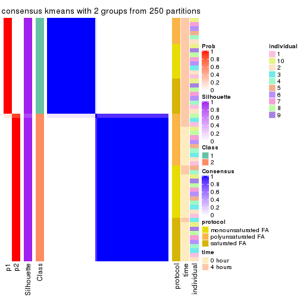</p>

</div>
<div id='tab-CV-kmeans-consensus-heatmap-2'>
<pre><code class="r">consensus_heatmap(res, k = 3)
</code></pre>

<p>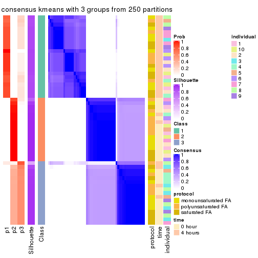</p>

</div>
<div id='tab-CV-kmeans-consensus-heatmap-3'>
<pre><code class="r">consensus_heatmap(res, k = 4)
</code></pre>

<p>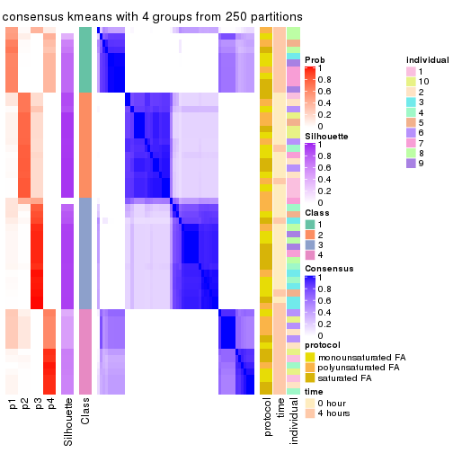</p>

</div>
<div id='tab-CV-kmeans-consensus-heatmap-4'>
<pre><code class="r">consensus_heatmap(res, k = 5)
</code></pre>

<p>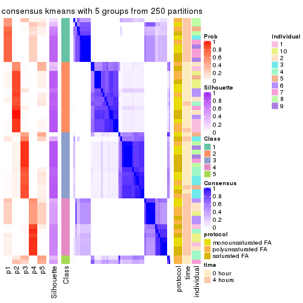</p>

</div>
<div id='tab-CV-kmeans-consensus-heatmap-5'>
<pre><code class="r">consensus_heatmap(res, k = 6)
</code></pre>

<p>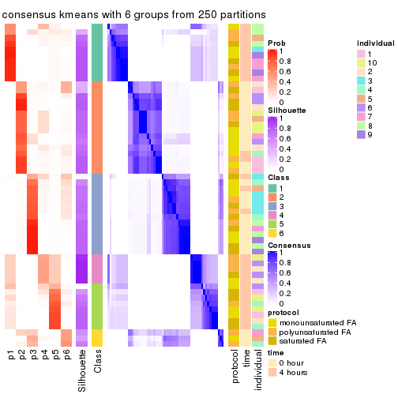</p>

</div>
</div>

Heatmaps for the membership of samples in all partitions to see how consistent they are:


<script>
$( function() {
	$( '#tabs-CV-kmeans-membership-heatmap' ).tabs();
} );
</script>
<div id='tabs-CV-kmeans-membership-heatmap'>
<ul>
<li><a href='#tab-CV-kmeans-membership-heatmap-1'>k = 2</a></li>
<li><a href='#tab-CV-kmeans-membership-heatmap-2'>k = 3</a></li>
<li><a href='#tab-CV-kmeans-membership-heatmap-3'>k = 4</a></li>
<li><a href='#tab-CV-kmeans-membership-heatmap-4'>k = 5</a></li>
<li><a href='#tab-CV-kmeans-membership-heatmap-5'>k = 6</a></li>
</ul>
<div id='tab-CV-kmeans-membership-heatmap-1'>
<pre><code class="r">membership_heatmap(res, k = 2)
</code></pre>

<p>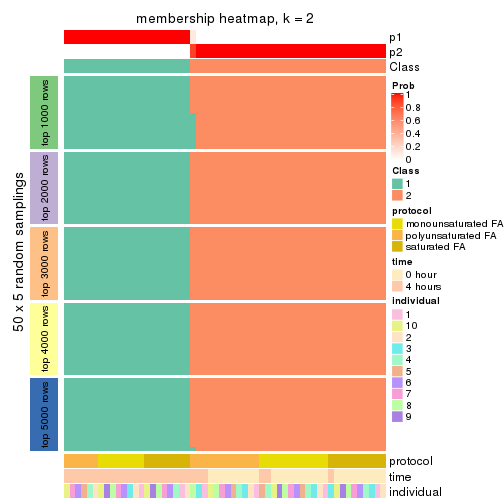</p>

</div>
<div id='tab-CV-kmeans-membership-heatmap-2'>
<pre><code class="r">membership_heatmap(res, k = 3)
</code></pre>

<p>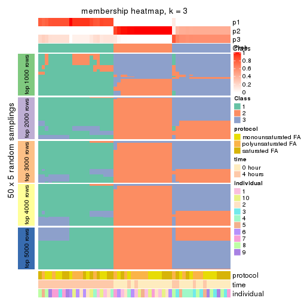</p>

</div>
<div id='tab-CV-kmeans-membership-heatmap-3'>
<pre><code class="r">membership_heatmap(res, k = 4)
</code></pre>

<p>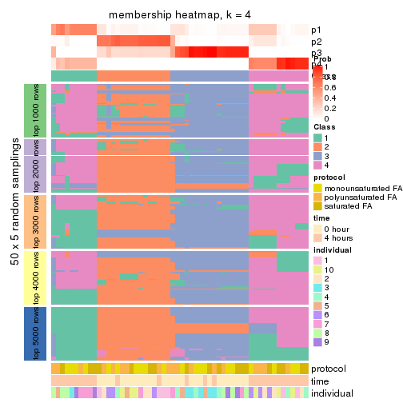</p>

</div>
<div id='tab-CV-kmeans-membership-heatmap-4'>
<pre><code class="r">membership_heatmap(res, k = 5)
</code></pre>

<p>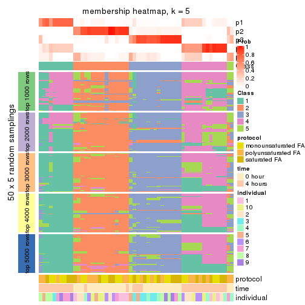</p>

</div>
<div id='tab-CV-kmeans-membership-heatmap-5'>
<pre><code class="r">membership_heatmap(res, k = 6)
</code></pre>

<p>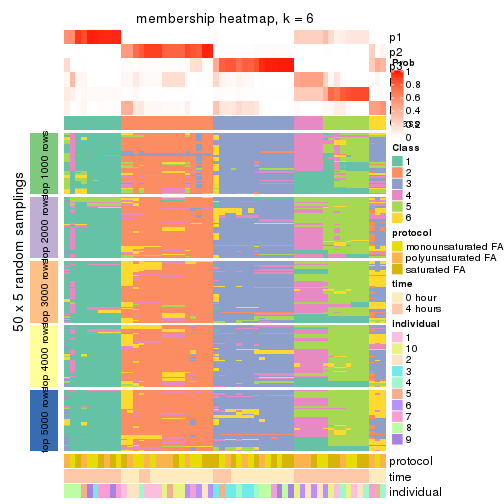</p>

</div>
</div>

As soon as we have had the classes for columns, we can look for signatures
which are significantly different between classes which can be candidate marks
for certain classes. Following are the heatmaps for signatures.


Signature heatmaps where rows are scaled:


<script>
$( function() {
	$( '#tabs-CV-kmeans-get-signatures' ).tabs();
} );
</script>
<div id='tabs-CV-kmeans-get-signatures'>
<ul>
<li><a href='#tab-CV-kmeans-get-signatures-1'>k = 2</a></li>
<li><a href='#tab-CV-kmeans-get-signatures-2'>k = 3</a></li>
<li><a href='#tab-CV-kmeans-get-signatures-3'>k = 4</a></li>
<li><a href='#tab-CV-kmeans-get-signatures-4'>k = 5</a></li>
<li><a href='#tab-CV-kmeans-get-signatures-5'>k = 6</a></li>
</ul>
<div id='tab-CV-kmeans-get-signatures-1'>
<pre><code class="r">get_signatures(res, k = 2)
</code></pre>

<p>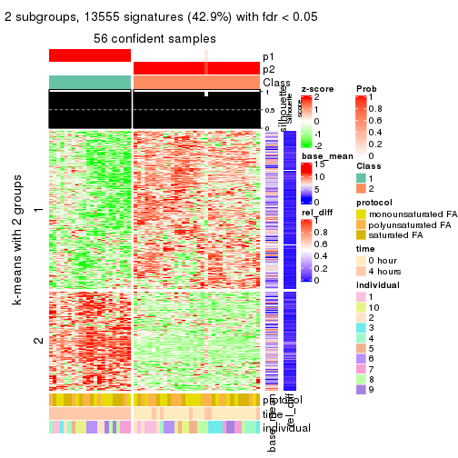</p>

</div>
<div id='tab-CV-kmeans-get-signatures-2'>
<pre><code class="r">get_signatures(res, k = 3)
</code></pre>

<p>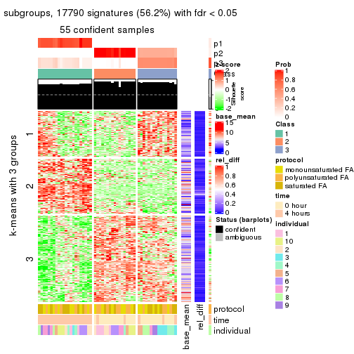</p>

</div>
<div id='tab-CV-kmeans-get-signatures-3'>
<pre><code class="r">get_signatures(res, k = 4)
</code></pre>

<p>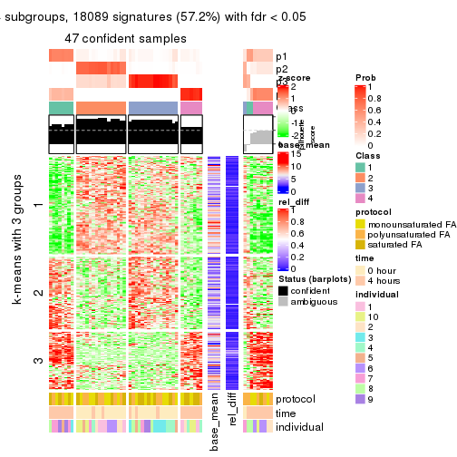</p>

</div>
<div id='tab-CV-kmeans-get-signatures-4'>
<pre><code class="r">get_signatures(res, k = 5)
</code></pre>

<p>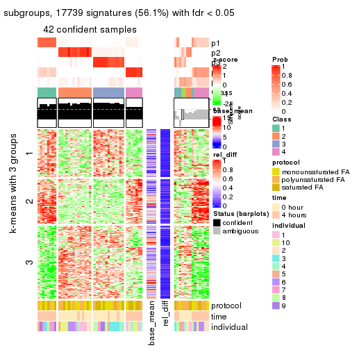</p>

</div>
<div id='tab-CV-kmeans-get-signatures-5'>
<pre><code class="r">get_signatures(res, k = 6)
</code></pre>

<p>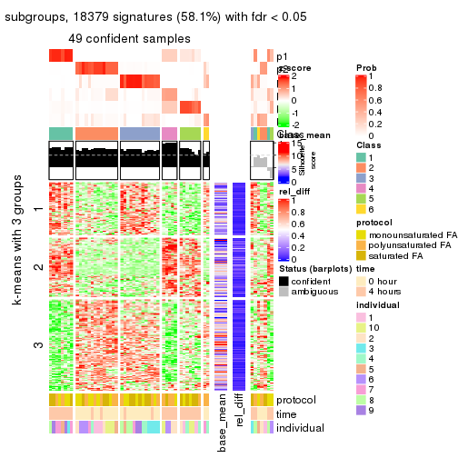</p>

</div>
</div>


Signature heatmaps where rows are not scaled:


<script>
$( function() {
	$( '#tabs-CV-kmeans-get-signatures-no-scale' ).tabs();
} );
</script>
<div id='tabs-CV-kmeans-get-signatures-no-scale'>
<ul>
<li><a href='#tab-CV-kmeans-get-signatures-no-scale-1'>k = 2</a></li>
<li><a href='#tab-CV-kmeans-get-signatures-no-scale-2'>k = 3</a></li>
<li><a href='#tab-CV-kmeans-get-signatures-no-scale-3'>k = 4</a></li>
<li><a href='#tab-CV-kmeans-get-signatures-no-scale-4'>k = 5</a></li>
<li><a href='#tab-CV-kmeans-get-signatures-no-scale-5'>k = 6</a></li>
</ul>
<div id='tab-CV-kmeans-get-signatures-no-scale-1'>
<pre><code class="r">get_signatures(res, k = 2, scale_rows = FALSE)
</code></pre>

<p>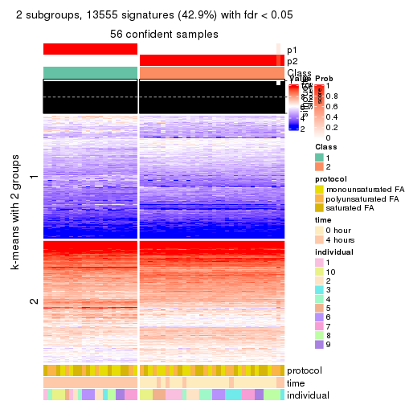</p>

</div>
<div id='tab-CV-kmeans-get-signatures-no-scale-2'>
<pre><code class="r">get_signatures(res, k = 3, scale_rows = FALSE)
</code></pre>

<p>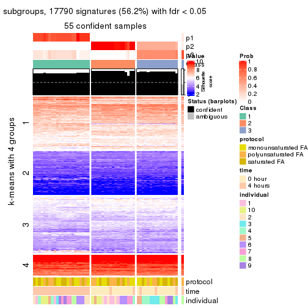</p>

</div>
<div id='tab-CV-kmeans-get-signatures-no-scale-3'>
<pre><code class="r">get_signatures(res, k = 4, scale_rows = FALSE)
</code></pre>

<p>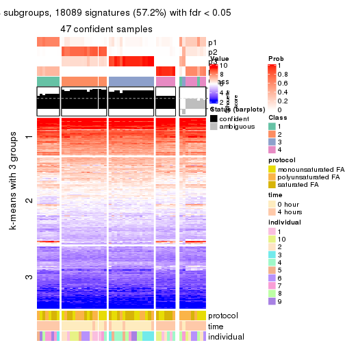</p>

</div>
<div id='tab-CV-kmeans-get-signatures-no-scale-4'>
<pre><code class="r">get_signatures(res, k = 5, scale_rows = FALSE)
</code></pre>

<p>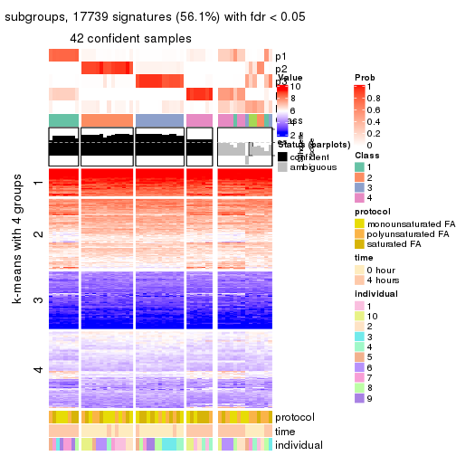</p>

</div>
<div id='tab-CV-kmeans-get-signatures-no-scale-5'>
<pre><code class="r">get_signatures(res, k = 6, scale_rows = FALSE)
</code></pre>

<p>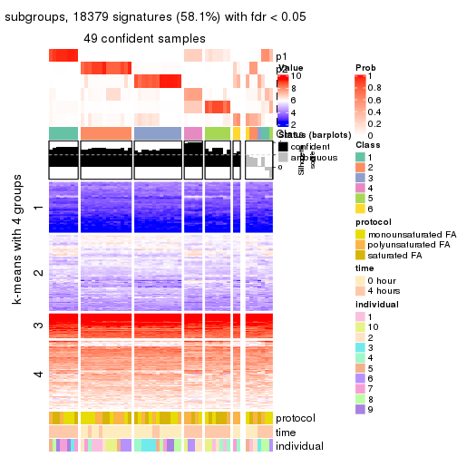</p>

</div>
</div>


Compare the overlap of signatures from different k:

```r
compare_signatures(res)
```

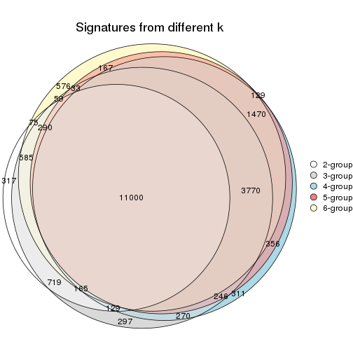

`get_signature()` returns a data frame invisibly. TO get the list of signatures, the function
call should be assigned to a variable explicitly. In following code, if `plot` argument is set
to `FALSE`, no heatmap is plotted while only the differential analysis is performed.

```r
# code only for demonstration
tb = get_signature(res, k = ..., plot = FALSE)
```

An example of the output of `tb` is:

```
#>   which_row         fdr    mean_1    mean_2 scaled_mean_1 scaled_mean_2 km
#> 1        38 0.042760348  8.373488  9.131774    -0.5533452     0.5164555  1
#> 2        40 0.018707592  7.106213  8.469186    -0.6173731     0.5762149  1
#> 3        55 0.019134737 10.221463 11.207825    -0.6159697     0.5749050  1
#> 4        59 0.006059896  5.921854  7.869574    -0.6899429     0.6439467  1
#> 5        60 0.018055526  8.928898 10.211722    -0.6204761     0.5791110  1
#> 6        98 0.009384629 15.714769 14.887706     0.6635654    -0.6193277  2
...
```

The columns in `tb` are:

1. `which_row`: row indices corresponding to the input matrix.
2. `fdr`: FDR for the differential test. 
3. `mean_x`: The mean value in group x.
4. `scaled_mean_x`: The mean value in group x after rows are scaled.
5. `km`: Row groups if k-means clustering is applied to rows.


UMAP plot which shows how samples are separated.


<script>
$( function() {
	$( '#tabs-CV-kmeans-dimension-reduction' ).tabs();
} );
</script>
<div id='tabs-CV-kmeans-dimension-reduction'>
<ul>
<li><a href='#tab-CV-kmeans-dimension-reduction-1'>k = 2</a></li>
<li><a href='#tab-CV-kmeans-dimension-reduction-2'>k = 3</a></li>
<li><a href='#tab-CV-kmeans-dimension-reduction-3'>k = 4</a></li>
<li><a href='#tab-CV-kmeans-dimension-reduction-4'>k = 5</a></li>
<li><a href='#tab-CV-kmeans-dimension-reduction-5'>k = 6</a></li>
</ul>
<div id='tab-CV-kmeans-dimension-reduction-1'>
<pre><code class="r">dimension_reduction(res, k = 2, method = &quot;UMAP&quot;)
</code></pre>

<p>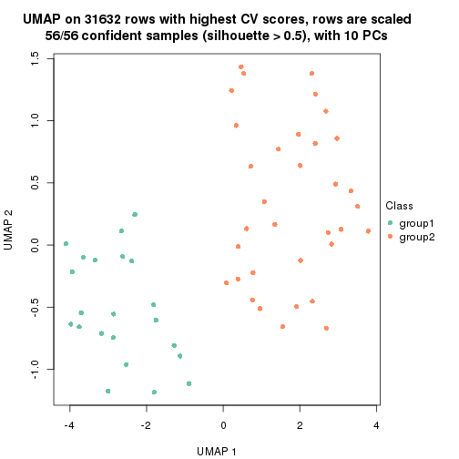</p>

</div>
<div id='tab-CV-kmeans-dimension-reduction-2'>
<pre><code class="r">dimension_reduction(res, k = 3, method = &quot;UMAP&quot;)
</code></pre>

<p>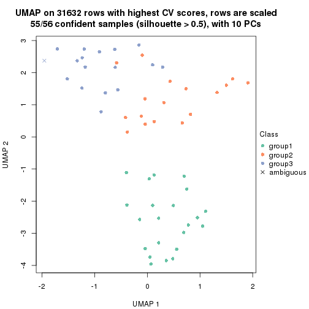</p>

</div>
<div id='tab-CV-kmeans-dimension-reduction-3'>
<pre><code class="r">dimension_reduction(res, k = 4, method = &quot;UMAP&quot;)
</code></pre>

<p>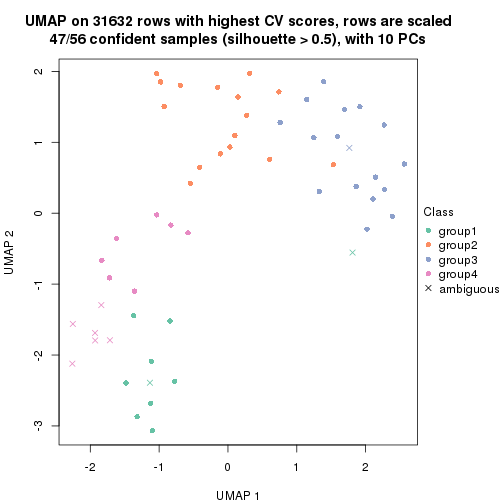</p>

</div>
<div id='tab-CV-kmeans-dimension-reduction-4'>
<pre><code class="r">dimension_reduction(res, k = 5, method = &quot;UMAP&quot;)
</code></pre>

<p></p>

</div>
<div id='tab-CV-kmeans-dimension-reduction-5'>
<pre><code class="r">dimension_reduction(res, k = 6, method = &quot;UMAP&quot;)
</code></pre>

<p>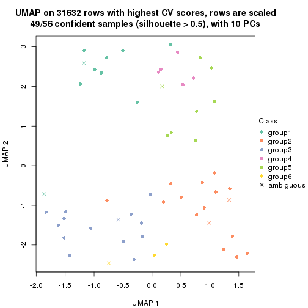</p>

</div>
</div>


Following heatmap shows how subgroups are split when increasing `k`:

```r
collect_classes(res)
```

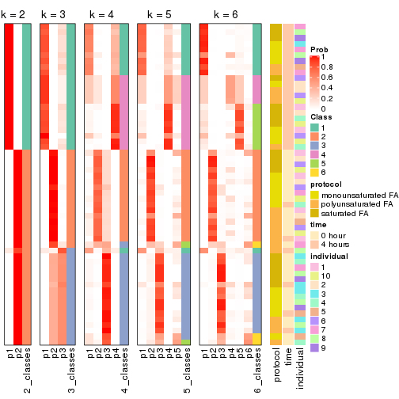


Test correlation between subgroups and known annotations. If the known
annotation is numeric, one-way ANOVA test is applied, and if the known
annotation is discrete, chi-squared contingency table test is applied.

```r
test_to_known_factors(res)
```

```
#>            n protocol(p)  time(p) individual(p) k
#> CV:kmeans 56       0.790 9.14e-09       0.95382 2
#> CV:kmeans 55       0.826 5.11e-09       0.05242 3
#> CV:kmeans 47       0.855 1.47e-06       0.00528 4
#> CV:kmeans 43       0.699 7.16e-06       0.05238 5
#> CV:kmeans 49       0.482 1.27e-06       0.02909 6
```


If matrix rows can be associated to genes, consider to use `functional_enrichment(res,
...)` to perform function enrichment for the signature genes. See [this vignette](http://bioconductor.org/packages/devel/bioc/vignettes/cola/inst/doc/functional_enrichment.html) for more detailed explanations.


 

---------------------------------------------------


### CV:skmeans**


The object with results only for a single top-value method and a single partition method 
can be extracted as:

```r
res = res_list["CV", "skmeans"]
# you can also extract it by
# res = res_list["CV:skmeans"]
```

A summary of `res` and all the functions that can be applied to it:

```r
res
```

```
#> A 'ConsensusPartition' object with k = 2, 3, 4, 5, 6.
#>   On a matrix with 31632 rows and 56 columns.
#>   Top rows (1000, 2000, 3000, 4000, 5000) are extracted by 'CV' method.
#>   Subgroups are detected by 'skmeans' method.
#>   Performed in total 1250 partitions by row resampling.
#>   Best k for subgroups seems to be 3.
#> 
#> Following methods can be applied to this 'ConsensusPartition' object:
#>  [1] "cola_report"             "collect_classes"         "collect_plots"          
#>  [4] "collect_stats"           "colnames"                "compare_signatures"     
#>  [7] "consensus_heatmap"       "dimension_reduction"     "functional_enrichment"  
#> [10] "get_anno_col"            "get_anno"                "get_classes"            
#> [13] "get_consensus"           "get_matrix"              "get_membership"         
#> [16] "get_param"               "get_signatures"          "get_stats"              
#> [19] "is_best_k"               "is_stable_k"             "membership_heatmap"     
#> [22] "ncol"                    "nrow"                    "plot_ecdf"              
#> [25] "rownames"                "select_partition_number" "show"                   
#> [28] "suggest_best_k"          "test_to_known_factors"
```

`collect_plots()` function collects all the plots made from `res` for all `k` (number of partitions)
into one single page to provide an easy and fast comparison between different `k`.

```r
collect_plots(res)
```

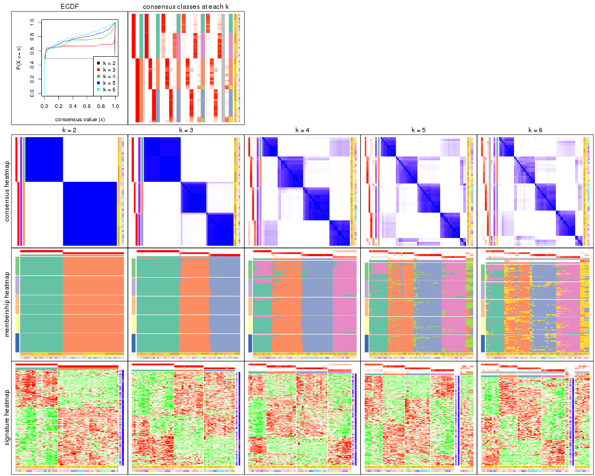

The plots are:

- The first row: a plot of the ECDF (empirical cumulative distribution
  function) curves of the consensus matrix for each `k` and the heatmap of
  predicted classes for each `k`.
- The second row: heatmaps of the consensus matrix for each `k`.
- The third row: heatmaps of the membership matrix for each `k`.
- The fouth row: heatmaps of the signatures for each `k`.

All the plots in panels can be made by individual functions and they are
plotted later in this section.

`select_partition_number()` produces several plots showing different
statistics for choosing "optimized" `k`. There are following statistics:

- ECDF curves of the consensus matrix for each `k`;
- 1-PAC. [The PAC
  score](https://en.wikipedia.org/wiki/Consensus_clustering#Over-interpretation_potential_of_consensus_clustering)
  measures the proportion of the ambiguous subgrouping.
- Mean silhouette score.
- Concordance. The mean probability of fiting the consensus class ids in all
  partitions.
- Area increased. Denote $A_k$ as the area under the ECDF curve for current
  `k`, the area increased is defined as $A_k - A_{k-1}$.
- Rand index. The percent of pairs of samples that are both in a same cluster
  or both are not in a same cluster in the partition of k and k-1.
- Jaccard index. The ratio of pairs of samples are both in a same cluster in
  the partition of k and k-1 and the pairs of samples are both in a same
  cluster in the partition k or k-1.

The detailed explanations of these statistics can be found in [the _cola_
vignette](http://bioconductor.org/packages/devel/bioc/vignettes/cola/inst/doc/cola.html#toc_13).

Generally speaking, lower PAC score, higher mean silhouette score or higher
concordance corresponds to better partition. Rand index and Jaccard index
measure how similar the current partition is compared to partition with `k-1`.
If they are too similar, we won't accept `k` is better than `k-1`.

```r
select_partition_number(res)
```

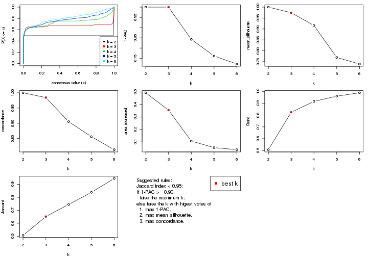

The numeric values for all these statistics can be obtained by `get_stats()`.

```r
get_stats(res)
```

```
#>   k 1-PAC mean_silhouette concordance area_increased  Rand Jaccard
#> 2 2 1.000           1.000       1.000         0.4934 0.507   0.507
#> 3 3 1.000           0.974       0.984         0.3545 0.823   0.652
#> 4 4 0.843           0.916       0.905         0.1067 0.916   0.745
#> 5 5 0.761           0.769       0.856         0.0543 0.960   0.838
#> 6 6 0.722           0.740       0.813         0.0379 0.988   0.945
```

`suggest_best_k()` suggests the best $k$ based on these statistics. The rules are as follows:

- All $k$ with Jaccard index larger than 0.95 are removed because increasing
  $k$ does not provide enough extra information. If all $k$ are removed, it is
  marked as no subgroup is detected.
- For all $k$ with 1-PAC score larger than 0.9, the maximal $k$ is taken as
  the best $k$, and other $k$ are marked as optional $k$.
- If it does not fit the second rule. The $k$ with the maximal vote of the
  highest 1-PAC score, highest mean silhouette, and highest concordance is
  taken as the best $k$.

```r
suggest_best_k(res)
```

```
#> [1] 3
#> attr(,"optional")
#> [1] 2
```

There is also optional best $k$ = 2 that is worth to check.

Following shows the table of the partitions (You need to click the **show/hide
code output** link to see it). The membership matrix (columns with name `p*`)
is inferred by
[`clue::cl_consensus()`](https://www.rdocumentation.org/link/cl_consensus?package=clue)
function with the `SE` method. Basically the value in the membership matrix
represents the probability to belong to a certain group. The finall class
label for an item is determined with the group with highest probability it
belongs to.

In `get_classes()` function, the entropy is calculated from the membership
matrix and the silhouette score is calculated from the consensus matrix.


<script>
$( function() {
	$( '#tabs-CV-skmeans-get-classes' ).tabs();
} );
</script>
<div id='tabs-CV-skmeans-get-classes'>
<ul>
<li><a href='#tab-CV-skmeans-get-classes-1'>k = 2</a></li>
<li><a href='#tab-CV-skmeans-get-classes-2'>k = 3</a></li>
<li><a href='#tab-CV-skmeans-get-classes-3'>k = 4</a></li>
<li><a href='#tab-CV-skmeans-get-classes-4'>k = 5</a></li>
<li><a href='#tab-CV-skmeans-get-classes-5'>k = 6</a></li>
</ul>

<div id='tab-CV-skmeans-get-classes-1'>
<p><a id='tab-CV-skmeans-get-classes-1-a' style='color:#0366d6' href='#'>show/hide code output</a></p>
<pre><code class="r">cbind(get_classes(res, k = 2), get_membership(res, k = 2))
</code></pre>

<pre><code>#&gt;           class entropy silhouette p1 p2
#&gt; GSM790742     2       0          1  0  1
#&gt; GSM790744     2       0          1  0  1
#&gt; GSM790754     2       0          1  0  1
#&gt; GSM790756     2       0          1  0  1
#&gt; GSM790768     2       0          1  0  1
#&gt; GSM790774     2       0          1  0  1
#&gt; GSM790778     2       0          1  0  1
#&gt; GSM790784     2       0          1  0  1
#&gt; GSM790790     2       0          1  0  1
#&gt; GSM790743     1       0          1  1  0
#&gt; GSM790745     1       0          1  1  0
#&gt; GSM790755     2       0          1  0  1
#&gt; GSM790757     1       0          1  1  0
#&gt; GSM790769     1       0          1  1  0
#&gt; GSM790775     1       0          1  1  0
#&gt; GSM790779     1       0          1  1  0
#&gt; GSM790785     1       0          1  1  0
#&gt; GSM790791     1       0          1  1  0
#&gt; GSM790738     2       0          1  0  1
#&gt; GSM790746     2       0          1  0  1
#&gt; GSM790752     2       0          1  0  1
#&gt; GSM790758     2       0          1  0  1
#&gt; GSM790764     2       0          1  0  1
#&gt; GSM790766     2       0          1  0  1
#&gt; GSM790772     2       0          1  0  1
#&gt; GSM790782     2       0          1  0  1
#&gt; GSM790786     2       0          1  0  1
#&gt; GSM790792     2       0          1  0  1
#&gt; GSM790739     1       0          1  1  0
#&gt; GSM790747     1       0          1  1  0
#&gt; GSM790753     1       0          1  1  0
#&gt; GSM790759     2       0          1  0  1
#&gt; GSM790765     2       0          1  0  1
#&gt; GSM790767     1       0          1  1  0
#&gt; GSM790773     1       0          1  1  0
#&gt; GSM790783     1       0          1  1  0
#&gt; GSM790787     1       0          1  1  0
#&gt; GSM790793     1       0          1  1  0
#&gt; GSM790740     2       0          1  0  1
#&gt; GSM790748     2       0          1  0  1
#&gt; GSM790750     2       0          1  0  1
#&gt; GSM790760     2       0          1  0  1
#&gt; GSM790762     2       0          1  0  1
#&gt; GSM790770     2       0          1  0  1
#&gt; GSM790776     2       0          1  0  1
#&gt; GSM790780     2       0          1  0  1
#&gt; GSM790788     2       0          1  0  1
#&gt; GSM790741     2       0          1  0  1
#&gt; GSM790749     1       0          1  1  0
#&gt; GSM790751     2       0          1  0  1
#&gt; GSM790761     1       0          1  1  0
#&gt; GSM790763     1       0          1  1  0
#&gt; GSM790771     1       0          1  1  0
#&gt; GSM790777     1       0          1  1  0
#&gt; GSM790781     1       0          1  1  0
#&gt; GSM790789     1       0          1  1  0
</code></pre>

<script>
$('#tab-CV-skmeans-get-classes-1-a').parent().next().next().hide();
$('#tab-CV-skmeans-get-classes-1-a').click(function(){
  $('#tab-CV-skmeans-get-classes-1-a').parent().next().next().toggle();
  return(false);
});
</script>
</div>

<div id='tab-CV-skmeans-get-classes-2'>
<p><a id='tab-CV-skmeans-get-classes-2-a' style='color:#0366d6' href='#'>show/hide code output</a></p>
<pre><code class="r">cbind(get_classes(res, k = 3), get_membership(res, k = 3))
</code></pre>

<pre><code>#&gt;           class entropy silhouette    p1    p2    p3
#&gt; GSM790742     2  0.0237      0.980 0.000 0.996 0.004
#&gt; GSM790744     2  0.0237      0.980 0.000 0.996 0.004
#&gt; GSM790754     3  0.0424      0.980 0.000 0.008 0.992
#&gt; GSM790756     3  0.0747      0.976 0.000 0.016 0.984
#&gt; GSM790768     2  0.0237      0.980 0.000 0.996 0.004
#&gt; GSM790774     3  0.0592      0.979 0.000 0.012 0.988
#&gt; GSM790778     3  0.0424      0.980 0.000 0.008 0.992
#&gt; GSM790784     3  0.0424      0.980 0.000 0.008 0.992
#&gt; GSM790790     2  0.0237      0.980 0.000 0.996 0.004
#&gt; GSM790743     1  0.0000      0.997 1.000 0.000 0.000
#&gt; GSM790745     1  0.0000      0.997 1.000 0.000 0.000
#&gt; GSM790755     3  0.0000      0.974 0.000 0.000 1.000
#&gt; GSM790757     1  0.0000      0.997 1.000 0.000 0.000
#&gt; GSM790769     1  0.0000      0.997 1.000 0.000 0.000
#&gt; GSM790775     1  0.0475      0.995 0.992 0.004 0.004
#&gt; GSM790779     1  0.0661      0.993 0.988 0.004 0.008
#&gt; GSM790785     1  0.0475      0.995 0.992 0.004 0.004
#&gt; GSM790791     1  0.0000      0.997 1.000 0.000 0.000
#&gt; GSM790738     2  0.0237      0.980 0.000 0.996 0.004
#&gt; GSM790746     2  0.0747      0.974 0.000 0.984 0.016
#&gt; GSM790752     3  0.0424      0.980 0.000 0.008 0.992
#&gt; GSM790758     3  0.0424      0.980 0.000 0.008 0.992
#&gt; GSM790764     3  0.0592      0.979 0.000 0.012 0.988
#&gt; GSM790766     2  0.4887      0.709 0.000 0.772 0.228
#&gt; GSM790772     2  0.1411      0.957 0.000 0.964 0.036
#&gt; GSM790782     3  0.0592      0.979 0.000 0.012 0.988
#&gt; GSM790786     3  0.0592      0.979 0.000 0.012 0.988
#&gt; GSM790792     2  0.0237      0.980 0.000 0.996 0.004
#&gt; GSM790739     1  0.0000      0.997 1.000 0.000 0.000
#&gt; GSM790747     1  0.0000      0.997 1.000 0.000 0.000
#&gt; GSM790753     1  0.0475      0.995 0.992 0.004 0.004
#&gt; GSM790759     2  0.0237      0.980 0.000 0.996 0.004
#&gt; GSM790765     3  0.0424      0.980 0.000 0.008 0.992
#&gt; GSM790767     1  0.0000      0.997 1.000 0.000 0.000
#&gt; GSM790773     1  0.0475      0.995 0.992 0.004 0.004
#&gt; GSM790783     1  0.0237      0.996 0.996 0.000 0.004
#&gt; GSM790787     1  0.0475      0.995 0.992 0.004 0.004
#&gt; GSM790793     1  0.0000      0.997 1.000 0.000 0.000
#&gt; GSM790740     2  0.0592      0.977 0.000 0.988 0.012
#&gt; GSM790748     2  0.0747      0.974 0.000 0.984 0.016
#&gt; GSM790750     3  0.0424      0.980 0.000 0.008 0.992
#&gt; GSM790760     3  0.0747      0.976 0.000 0.016 0.984
#&gt; GSM790762     2  0.0237      0.980 0.000 0.996 0.004
#&gt; GSM790770     2  0.0237      0.980 0.000 0.996 0.004
#&gt; GSM790776     3  0.5291      0.636 0.000 0.268 0.732
#&gt; GSM790780     3  0.0424      0.980 0.000 0.008 0.992
#&gt; GSM790788     2  0.0237      0.980 0.000 0.996 0.004
#&gt; GSM790741     2  0.0592      0.976 0.000 0.988 0.012
#&gt; GSM790749     1  0.0000      0.997 1.000 0.000 0.000
#&gt; GSM790751     3  0.0424      0.980 0.000 0.008 0.992
#&gt; GSM790761     1  0.0000      0.997 1.000 0.000 0.000
#&gt; GSM790763     1  0.0475      0.995 0.992 0.004 0.004
#&gt; GSM790771     1  0.0000      0.997 1.000 0.000 0.000
#&gt; GSM790777     1  0.0475      0.995 0.992 0.004 0.004
#&gt; GSM790781     1  0.1267      0.980 0.972 0.004 0.024
#&gt; GSM790789     1  0.0000      0.997 1.000 0.000 0.000
</code></pre>

<script>
$('#tab-CV-skmeans-get-classes-2-a').parent().next().next().hide();
$('#tab-CV-skmeans-get-classes-2-a').click(function(){
  $('#tab-CV-skmeans-get-classes-2-a').parent().next().next().toggle();
  return(false);
});
</script>
</div>

<div id='tab-CV-skmeans-get-classes-3'>
<p><a id='tab-CV-skmeans-get-classes-3-a' style='color:#0366d6' href='#'>show/hide code output</a></p>
<pre><code class="r">cbind(get_classes(res, k = 4), get_membership(res, k = 4))
</code></pre>

<pre><code>#&gt;           class entropy silhouette    p1    p2    p3    p4
#&gt; GSM790742     2  0.2760      0.894 0.000 0.872 0.000 0.128
#&gt; GSM790744     2  0.0657      0.938 0.000 0.984 0.012 0.004
#&gt; GSM790754     3  0.0376      0.954 0.000 0.004 0.992 0.004
#&gt; GSM790756     3  0.0937      0.951 0.000 0.012 0.976 0.012
#&gt; GSM790768     2  0.0524      0.939 0.000 0.988 0.008 0.004
#&gt; GSM790774     3  0.1151      0.948 0.000 0.024 0.968 0.008
#&gt; GSM790778     3  0.0524      0.953 0.000 0.004 0.988 0.008
#&gt; GSM790784     3  0.0672      0.953 0.000 0.008 0.984 0.008
#&gt; GSM790790     2  0.0188      0.938 0.000 0.996 0.004 0.000
#&gt; GSM790743     4  0.4193      0.941 0.268 0.000 0.000 0.732
#&gt; GSM790745     4  0.3726      0.890 0.212 0.000 0.000 0.788
#&gt; GSM790755     3  0.2099      0.920 0.020 0.004 0.936 0.040
#&gt; GSM790757     4  0.3688      0.885 0.208 0.000 0.000 0.792
#&gt; GSM790769     4  0.4585      0.932 0.332 0.000 0.000 0.668
#&gt; GSM790775     1  0.0817      0.943 0.976 0.000 0.000 0.024
#&gt; GSM790779     1  0.1211      0.896 0.960 0.000 0.000 0.040
#&gt; GSM790785     1  0.0707      0.945 0.980 0.000 0.000 0.020
#&gt; GSM790791     4  0.4356      0.949 0.292 0.000 0.000 0.708
#&gt; GSM790738     2  0.0524      0.938 0.000 0.988 0.008 0.004
#&gt; GSM790746     2  0.2197      0.930 0.000 0.928 0.024 0.048
#&gt; GSM790752     3  0.0376      0.954 0.000 0.004 0.992 0.004
#&gt; GSM790758     3  0.0524      0.954 0.000 0.004 0.988 0.008
#&gt; GSM790764     3  0.3048      0.892 0.000 0.016 0.876 0.108
#&gt; GSM790766     2  0.4673      0.624 0.000 0.700 0.292 0.008
#&gt; GSM790772     2  0.3355      0.817 0.000 0.836 0.160 0.004
#&gt; GSM790782     3  0.1042      0.949 0.000 0.020 0.972 0.008
#&gt; GSM790786     3  0.0672      0.953 0.000 0.008 0.984 0.008
#&gt; GSM790792     2  0.0376      0.938 0.000 0.992 0.004 0.004
#&gt; GSM790739     4  0.4072      0.932 0.252 0.000 0.000 0.748
#&gt; GSM790747     4  0.4522      0.943 0.320 0.000 0.000 0.680
#&gt; GSM790753     1  0.1118      0.934 0.964 0.000 0.000 0.036
#&gt; GSM790759     2  0.1824      0.924 0.000 0.936 0.004 0.060
#&gt; GSM790765     3  0.0524      0.954 0.000 0.004 0.988 0.008
#&gt; GSM790767     4  0.4564      0.936 0.328 0.000 0.000 0.672
#&gt; GSM790773     1  0.0707      0.945 0.980 0.000 0.000 0.020
#&gt; GSM790783     1  0.1867      0.888 0.928 0.000 0.000 0.072
#&gt; GSM790787     1  0.0707      0.945 0.980 0.000 0.000 0.020
#&gt; GSM790793     4  0.4454      0.950 0.308 0.000 0.000 0.692
#&gt; GSM790740     2  0.1109      0.935 0.000 0.968 0.028 0.004
#&gt; GSM790748     2  0.3606      0.880 0.000 0.844 0.024 0.132
#&gt; GSM790750     3  0.0376      0.954 0.000 0.004 0.992 0.004
#&gt; GSM790760     3  0.3842      0.861 0.000 0.036 0.836 0.128
#&gt; GSM790762     2  0.0336      0.938 0.000 0.992 0.008 0.000
#&gt; GSM790770     2  0.2011      0.916 0.000 0.920 0.000 0.080
#&gt; GSM790776     3  0.6551      0.541 0.000 0.240 0.624 0.136
#&gt; GSM790780     3  0.0524      0.953 0.000 0.004 0.988 0.008
#&gt; GSM790788     2  0.0188      0.938 0.000 0.996 0.004 0.000
#&gt; GSM790741     2  0.1109      0.935 0.000 0.968 0.028 0.004
#&gt; GSM790749     4  0.4477      0.948 0.312 0.000 0.000 0.688
#&gt; GSM790751     3  0.0524      0.954 0.000 0.004 0.988 0.008
#&gt; GSM790761     4  0.4134      0.937 0.260 0.000 0.000 0.740
#&gt; GSM790763     1  0.0707      0.932 0.980 0.000 0.000 0.020
#&gt; GSM790771     4  0.4431      0.950 0.304 0.000 0.000 0.696
#&gt; GSM790777     1  0.0707      0.945 0.980 0.000 0.000 0.020
#&gt; GSM790781     1  0.3991      0.756 0.832 0.000 0.048 0.120
#&gt; GSM790789     4  0.4477      0.949 0.312 0.000 0.000 0.688
</code></pre>

<script>
$('#tab-CV-skmeans-get-classes-3-a').parent().next().next().hide();
$('#tab-CV-skmeans-get-classes-3-a').click(function(){
  $('#tab-CV-skmeans-get-classes-3-a').parent().next().next().toggle();
  return(false);
});
</script>
</div>

<div id='tab-CV-skmeans-get-classes-4'>
<p><a id='tab-CV-skmeans-get-classes-4-a' style='color:#0366d6' href='#'>show/hide code output</a></p>
<pre><code class="r">cbind(get_classes(res, k = 5), get_membership(res, k = 5))
</code></pre>

<pre><code>#&gt;           class entropy silhouette    p1    p2    p3    p4    p5
#&gt; GSM790742     5  0.4446     0.0356 0.000 0.476 0.004 0.000 0.520
#&gt; GSM790744     2  0.1041     0.8193 0.000 0.964 0.004 0.000 0.032
#&gt; GSM790754     3  0.1043     0.8938 0.000 0.000 0.960 0.000 0.040
#&gt; GSM790756     3  0.2969     0.8046 0.000 0.020 0.852 0.000 0.128
#&gt; GSM790768     2  0.0566     0.8192 0.000 0.984 0.012 0.000 0.004
#&gt; GSM790774     3  0.0932     0.8907 0.004 0.004 0.972 0.000 0.020
#&gt; GSM790778     3  0.0324     0.8939 0.004 0.000 0.992 0.000 0.004
#&gt; GSM790784     3  0.0566     0.8942 0.004 0.000 0.984 0.000 0.012
#&gt; GSM790790     2  0.1041     0.8189 0.000 0.964 0.004 0.000 0.032
#&gt; GSM790743     4  0.0693     0.9023 0.012 0.000 0.000 0.980 0.008
#&gt; GSM790745     4  0.4114     0.7658 0.060 0.000 0.000 0.776 0.164
#&gt; GSM790755     3  0.4618     0.6647 0.068 0.000 0.724 0.000 0.208
#&gt; GSM790757     4  0.4114     0.7572 0.060 0.000 0.000 0.776 0.164
#&gt; GSM790769     4  0.1732     0.9051 0.080 0.000 0.000 0.920 0.000
#&gt; GSM790775     1  0.2773     0.9238 0.836 0.000 0.000 0.164 0.000
#&gt; GSM790779     1  0.2304     0.8921 0.892 0.000 0.000 0.100 0.008
#&gt; GSM790785     1  0.2648     0.9274 0.848 0.000 0.000 0.152 0.000
#&gt; GSM790791     4  0.1197     0.9132 0.048 0.000 0.000 0.952 0.000
#&gt; GSM790738     2  0.1502     0.8111 0.000 0.940 0.004 0.000 0.056
#&gt; GSM790746     2  0.3722     0.7209 0.004 0.812 0.040 0.000 0.144
#&gt; GSM790752     3  0.1410     0.8890 0.000 0.000 0.940 0.000 0.060
#&gt; GSM790758     3  0.1732     0.8770 0.000 0.000 0.920 0.000 0.080
#&gt; GSM790764     3  0.4437    -0.0167 0.000 0.004 0.532 0.000 0.464
#&gt; GSM790766     2  0.5192     0.1830 0.004 0.596 0.356 0.000 0.044
#&gt; GSM790772     2  0.4995     0.3989 0.000 0.668 0.264 0.000 0.068
#&gt; GSM790782     3  0.1074     0.8859 0.004 0.016 0.968 0.000 0.012
#&gt; GSM790786     3  0.0486     0.8938 0.004 0.004 0.988 0.000 0.004
#&gt; GSM790792     2  0.1205     0.8174 0.000 0.956 0.004 0.000 0.040
#&gt; GSM790739     4  0.2505     0.8613 0.020 0.000 0.000 0.888 0.092
#&gt; GSM790747     4  0.1671     0.9078 0.076 0.000 0.000 0.924 0.000
#&gt; GSM790753     1  0.2891     0.9176 0.824 0.000 0.000 0.176 0.000
#&gt; GSM790759     2  0.3741     0.5775 0.000 0.732 0.004 0.000 0.264
#&gt; GSM790765     3  0.1121     0.8919 0.000 0.000 0.956 0.000 0.044
#&gt; GSM790767     4  0.2411     0.8861 0.108 0.000 0.000 0.884 0.008
#&gt; GSM790773     1  0.2605     0.9264 0.852 0.000 0.000 0.148 0.000
#&gt; GSM790783     1  0.3895     0.7326 0.680 0.000 0.000 0.320 0.000
#&gt; GSM790787     1  0.2648     0.9273 0.848 0.000 0.000 0.152 0.000
#&gt; GSM790793     4  0.1740     0.9112 0.056 0.000 0.000 0.932 0.012
#&gt; GSM790740     2  0.2694     0.7932 0.000 0.884 0.040 0.000 0.076
#&gt; GSM790748     5  0.5142     0.2819 0.000 0.392 0.044 0.000 0.564
#&gt; GSM790750     3  0.1410     0.8894 0.000 0.000 0.940 0.000 0.060
#&gt; GSM790760     5  0.4610     0.1032 0.000 0.012 0.432 0.000 0.556
#&gt; GSM790762     2  0.0865     0.8181 0.000 0.972 0.004 0.000 0.024
#&gt; GSM790770     2  0.2690     0.7050 0.000 0.844 0.000 0.000 0.156
#&gt; GSM790776     5  0.5975     0.4090 0.000 0.124 0.344 0.000 0.532
#&gt; GSM790780     3  0.0671     0.8940 0.004 0.000 0.980 0.000 0.016
#&gt; GSM790788     2  0.0865     0.8181 0.000 0.972 0.004 0.000 0.024
#&gt; GSM790741     2  0.3171     0.7859 0.008 0.864 0.044 0.000 0.084
#&gt; GSM790749     4  0.1544     0.9116 0.068 0.000 0.000 0.932 0.000
#&gt; GSM790751     3  0.1571     0.8865 0.004 0.000 0.936 0.000 0.060
#&gt; GSM790761     4  0.0865     0.8933 0.004 0.000 0.000 0.972 0.024
#&gt; GSM790763     1  0.3318     0.9023 0.808 0.000 0.000 0.180 0.012
#&gt; GSM790771     4  0.1478     0.9125 0.064 0.000 0.000 0.936 0.000
#&gt; GSM790777     1  0.2648     0.9274 0.848 0.000 0.000 0.152 0.000
#&gt; GSM790781     1  0.2295     0.7268 0.900 0.000 0.004 0.008 0.088
#&gt; GSM790789     4  0.1544     0.9116 0.068 0.000 0.000 0.932 0.000
</code></pre>

<script>
$('#tab-CV-skmeans-get-classes-4-a').parent().next().next().hide();
$('#tab-CV-skmeans-get-classes-4-a').click(function(){
  $('#tab-CV-skmeans-get-classes-4-a').parent().next().next().toggle();
  return(false);
});
</script>
</div>

<div id='tab-CV-skmeans-get-classes-5'>
<p><a id='tab-CV-skmeans-get-classes-5-a' style='color:#0366d6' href='#'>show/hide code output</a></p>
<pre><code class="r">cbind(get_classes(res, k = 6), get_membership(res, k = 6))
</code></pre>

<pre><code>#&gt;           class entropy silhouette    p1    p2    p3    p4 p5    p6
#&gt; GSM790742     6  0.3394      0.410 0.000 0.200 0.000 0.000 NA 0.776
#&gt; GSM790744     2  0.2390      0.725 0.000 0.896 0.008 0.000 NA 0.044
#&gt; GSM790754     3  0.2250      0.860 0.000 0.000 0.896 0.000 NA 0.040
#&gt; GSM790756     3  0.4097      0.741 0.000 0.020 0.776 0.000 NA 0.128
#&gt; GSM790768     2  0.2375      0.722 0.000 0.896 0.008 0.000 NA 0.060
#&gt; GSM790774     3  0.2411      0.837 0.000 0.032 0.900 0.000 NA 0.024
#&gt; GSM790778     3  0.1003      0.866 0.000 0.004 0.964 0.000 NA 0.004
#&gt; GSM790784     3  0.1268      0.864 0.000 0.008 0.952 0.000 NA 0.004
#&gt; GSM790790     2  0.2146      0.712 0.000 0.908 0.004 0.000 NA 0.044
#&gt; GSM790743     4  0.2089      0.856 0.012 0.004 0.000 0.908 NA 0.004
#&gt; GSM790745     4  0.4538      0.654 0.048 0.000 0.000 0.612 NA 0.000
#&gt; GSM790755     3  0.5880      0.462 0.052 0.000 0.560 0.000 NA 0.088
#&gt; GSM790757     4  0.4587      0.645 0.048 0.000 0.000 0.596 NA 0.000
#&gt; GSM790769     4  0.1075      0.872 0.048 0.000 0.000 0.952 NA 0.000
#&gt; GSM790775     1  0.2340      0.896 0.852 0.000 0.000 0.148 NA 0.000
#&gt; GSM790779     1  0.1909      0.828 0.920 0.000 0.000 0.052 NA 0.004
#&gt; GSM790785     1  0.2178      0.897 0.868 0.000 0.000 0.132 NA 0.000
#&gt; GSM790791     4  0.1649      0.877 0.032 0.000 0.000 0.932 NA 0.000
#&gt; GSM790738     2  0.3845      0.695 0.000 0.788 0.008 0.000 NA 0.120
#&gt; GSM790746     2  0.5759      0.597 0.000 0.620 0.068 0.000 NA 0.220
#&gt; GSM790752     3  0.2962      0.841 0.000 0.000 0.848 0.000 NA 0.068
#&gt; GSM790758     3  0.3469      0.811 0.000 0.000 0.808 0.000 NA 0.088
#&gt; GSM790764     6  0.5137      0.394 0.000 0.000 0.352 0.000 NA 0.552
#&gt; GSM790766     2  0.6417      0.251 0.000 0.472 0.348 0.000 NA 0.112
#&gt; GSM790772     2  0.6293      0.351 0.000 0.512 0.316 0.000 NA 0.076
#&gt; GSM790782     3  0.1838      0.852 0.000 0.020 0.928 0.000 NA 0.012
#&gt; GSM790786     3  0.1065      0.863 0.000 0.008 0.964 0.000 NA 0.008
#&gt; GSM790792     2  0.2488      0.701 0.000 0.880 0.000 0.000 NA 0.076
#&gt; GSM790739     4  0.3229      0.806 0.020 0.000 0.000 0.804 NA 0.004
#&gt; GSM790747     4  0.1152      0.876 0.044 0.000 0.000 0.952 NA 0.000
#&gt; GSM790753     1  0.2562      0.887 0.828 0.000 0.000 0.172 NA 0.000
#&gt; GSM790759     2  0.5850      0.303 0.000 0.444 0.028 0.000 NA 0.432
#&gt; GSM790765     3  0.1720      0.866 0.000 0.000 0.928 0.000 NA 0.032
#&gt; GSM790767     4  0.1807      0.871 0.060 0.000 0.000 0.920 NA 0.000
#&gt; GSM790773     1  0.2219      0.898 0.864 0.000 0.000 0.136 NA 0.000
#&gt; GSM790783     1  0.3684      0.630 0.628 0.000 0.000 0.372 NA 0.000
#&gt; GSM790787     1  0.2340      0.896 0.852 0.000 0.000 0.148 NA 0.000
#&gt; GSM790793     4  0.2106      0.871 0.032 0.000 0.000 0.904 NA 0.000
#&gt; GSM790740     2  0.5413      0.661 0.000 0.680 0.080 0.000 NA 0.140
#&gt; GSM790748     6  0.3645      0.496 0.000 0.176 0.020 0.000 NA 0.784
#&gt; GSM790750     3  0.2390      0.856 0.000 0.000 0.888 0.000 NA 0.056
#&gt; GSM790760     6  0.4142      0.626 0.000 0.000 0.232 0.000 NA 0.712
#&gt; GSM790762     2  0.1477      0.717 0.000 0.940 0.004 0.000 NA 0.008
#&gt; GSM790770     2  0.4361      0.488 0.000 0.648 0.000 0.000 NA 0.308
#&gt; GSM790776     6  0.4886      0.662 0.000 0.056 0.204 0.000 NA 0.696
#&gt; GSM790780     3  0.0777      0.869 0.000 0.000 0.972 0.000 NA 0.004
#&gt; GSM790788     2  0.1442      0.716 0.000 0.944 0.004 0.000 NA 0.012
#&gt; GSM790741     2  0.5668      0.646 0.000 0.656 0.092 0.000 NA 0.144
#&gt; GSM790749     4  0.1010      0.877 0.036 0.000 0.000 0.960 NA 0.000
#&gt; GSM790751     3  0.3112      0.835 0.000 0.000 0.836 0.000 NA 0.068
#&gt; GSM790761     4  0.2404      0.845 0.008 0.004 0.000 0.880 NA 0.004
#&gt; GSM790763     1  0.3998      0.819 0.724 0.000 0.000 0.236 NA 0.004
#&gt; GSM790771     4  0.0790      0.878 0.032 0.000 0.000 0.968 NA 0.000
#&gt; GSM790777     1  0.2219      0.898 0.864 0.000 0.000 0.136 NA 0.000
#&gt; GSM790781     1  0.3161      0.660 0.820 0.000 0.008 0.004 NA 0.012
#&gt; GSM790789     4  0.0937      0.877 0.040 0.000 0.000 0.960 NA 0.000
</code></pre>

<script>
$('#tab-CV-skmeans-get-classes-5-a').parent().next().next().hide();
$('#tab-CV-skmeans-get-classes-5-a').click(function(){
  $('#tab-CV-skmeans-get-classes-5-a').parent().next().next().toggle();
  return(false);
});
</script>
</div>
</div>

Heatmaps for the consensus matrix. It visualizes the probability of two
samples to be in a same group.


<script>
$( function() {
	$( '#tabs-CV-skmeans-consensus-heatmap' ).tabs();
} );
</script>
<div id='tabs-CV-skmeans-consensus-heatmap'>
<ul>
<li><a href='#tab-CV-skmeans-consensus-heatmap-1'>k = 2</a></li>
<li><a href='#tab-CV-skmeans-consensus-heatmap-2'>k = 3</a></li>
<li><a href='#tab-CV-skmeans-consensus-heatmap-3'>k = 4</a></li>
<li><a href='#tab-CV-skmeans-consensus-heatmap-4'>k = 5</a></li>
<li><a href='#tab-CV-skmeans-consensus-heatmap-5'>k = 6</a></li>
</ul>
<div id='tab-CV-skmeans-consensus-heatmap-1'>
<pre><code class="r">consensus_heatmap(res, k = 2)
</code></pre>

<p></p>

</div>
<div id='tab-CV-skmeans-consensus-heatmap-2'>
<pre><code class="r">consensus_heatmap(res, k = 3)
</code></pre>

<p>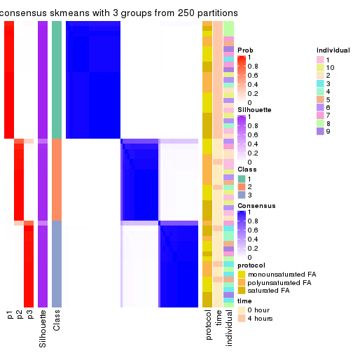</p>

</div>
<div id='tab-CV-skmeans-consensus-heatmap-3'>
<pre><code class="r">consensus_heatmap(res, k = 4)
</code></pre>

<p>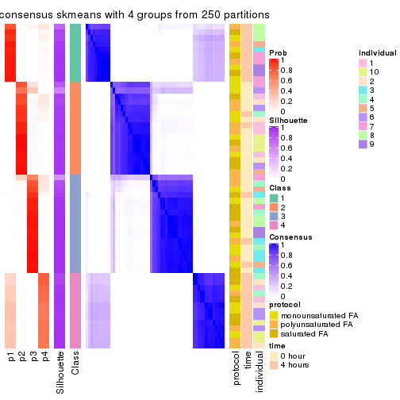</p>

</div>
<div id='tab-CV-skmeans-consensus-heatmap-4'>
<pre><code class="r">consensus_heatmap(res, k = 5)
</code></pre>

<p>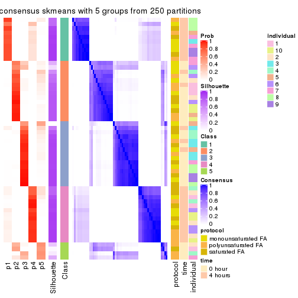</p>

</div>
<div id='tab-CV-skmeans-consensus-heatmap-5'>
<pre><code class="r">consensus_heatmap(res, k = 6)
</code></pre>

<p>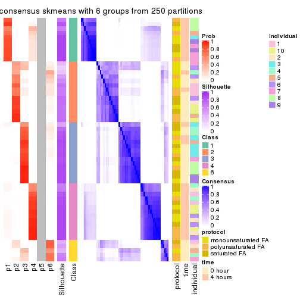</p>

</div>
</div>

Heatmaps for the membership of samples in all partitions to see how consistent they are:


<script>
$( function() {
	$( '#tabs-CV-skmeans-membership-heatmap' ).tabs();
} );
</script>
<div id='tabs-CV-skmeans-membership-heatmap'>
<ul>
<li><a href='#tab-CV-skmeans-membership-heatmap-1'>k = 2</a></li>
<li><a href='#tab-CV-skmeans-membership-heatmap-2'>k = 3</a></li>
<li><a href='#tab-CV-skmeans-membership-heatmap-3'>k = 4</a></li>
<li><a href='#tab-CV-skmeans-membership-heatmap-4'>k = 5</a></li>
<li><a href='#tab-CV-skmeans-membership-heatmap-5'>k = 6</a></li>
</ul>
<div id='tab-CV-skmeans-membership-heatmap-1'>
<pre><code class="r">membership_heatmap(res, k = 2)
</code></pre>

<p></p>

</div>
<div id='tab-CV-skmeans-membership-heatmap-2'>
<pre><code class="r">membership_heatmap(res, k = 3)
</code></pre>

<p>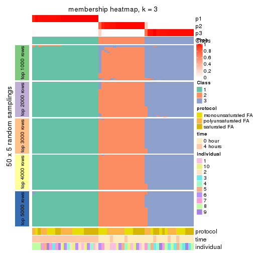</p>

</div>
<div id='tab-CV-skmeans-membership-heatmap-3'>
<pre><code class="r">membership_heatmap(res, k = 4)
</code></pre>

<p>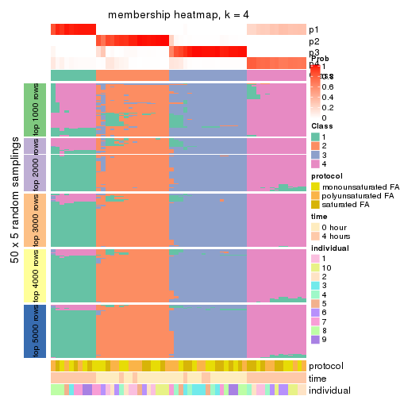</p>

</div>
<div id='tab-CV-skmeans-membership-heatmap-4'>
<pre><code class="r">membership_heatmap(res, k = 5)
</code></pre>

<p>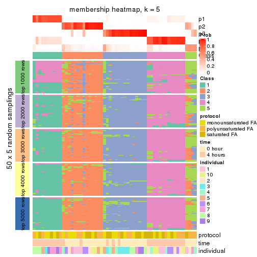</p>

</div>
<div id='tab-CV-skmeans-membership-heatmap-5'>
<pre><code class="r">membership_heatmap(res, k = 6)
</code></pre>

<p>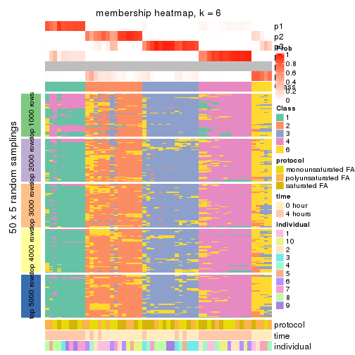</p>

</div>
</div>

As soon as we have had the classes for columns, we can look for signatures
which are significantly different between classes which can be candidate marks
for certain classes. Following are the heatmaps for signatures.


Signature heatmaps where rows are scaled:


<script>
$( function() {
	$( '#tabs-CV-skmeans-get-signatures' ).tabs();
} );
</script>
<div id='tabs-CV-skmeans-get-signatures'>
<ul>
<li><a href='#tab-CV-skmeans-get-signatures-1'>k = 2</a></li>
<li><a href='#tab-CV-skmeans-get-signatures-2'>k = 3</a></li>
<li><a href='#tab-CV-skmeans-get-signatures-3'>k = 4</a></li>
<li><a href='#tab-CV-skmeans-get-signatures-4'>k = 5</a></li>
<li><a href='#tab-CV-skmeans-get-signatures-5'>k = 6</a></li>
</ul>
<div id='tab-CV-skmeans-get-signatures-1'>
<pre><code class="r">get_signatures(res, k = 2)
</code></pre>

<p></p>

</div>
<div id='tab-CV-skmeans-get-signatures-2'>
<pre><code class="r">get_signatures(res, k = 3)
</code></pre>

<p>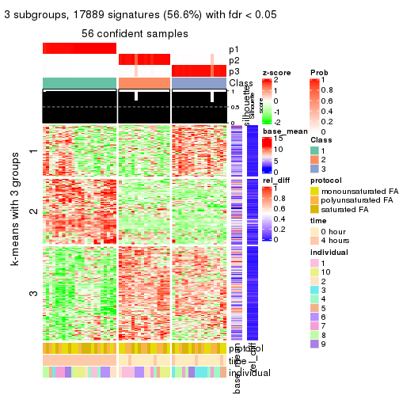</p>

</div>
<div id='tab-CV-skmeans-get-signatures-3'>
<pre><code class="r">get_signatures(res, k = 4)
</code></pre>

<p>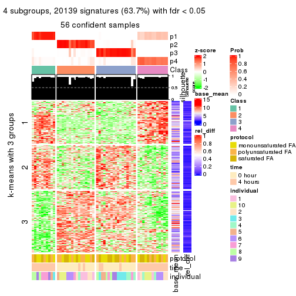</p>

</div>
<div id='tab-CV-skmeans-get-signatures-4'>
<pre><code class="r">get_signatures(res, k = 5)
</code></pre>

<p>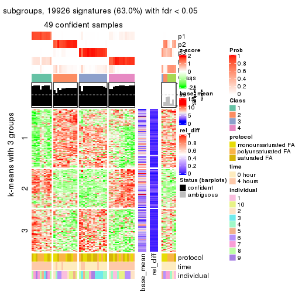</p>

</div>
<div id='tab-CV-skmeans-get-signatures-5'>
<pre><code class="r">get_signatures(res, k = 6)
</code></pre>

<p>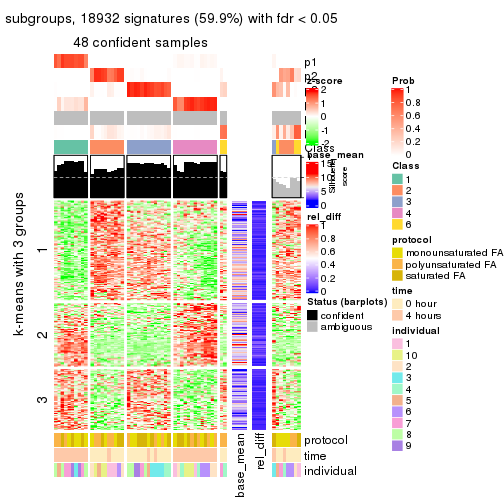</p>

</div>
</div>


Signature heatmaps where rows are not scaled:


<script>
$( function() {
	$( '#tabs-CV-skmeans-get-signatures-no-scale' ).tabs();
} );
</script>
<div id='tabs-CV-skmeans-get-signatures-no-scale'>
<ul>
<li><a href='#tab-CV-skmeans-get-signatures-no-scale-1'>k = 2</a></li>
<li><a href='#tab-CV-skmeans-get-signatures-no-scale-2'>k = 3</a></li>
<li><a href='#tab-CV-skmeans-get-signatures-no-scale-3'>k = 4</a></li>
<li><a href='#tab-CV-skmeans-get-signatures-no-scale-4'>k = 5</a></li>
<li><a href='#tab-CV-skmeans-get-signatures-no-scale-5'>k = 6</a></li>
</ul>
<div id='tab-CV-skmeans-get-signatures-no-scale-1'>
<pre><code class="r">get_signatures(res, k = 2, scale_rows = FALSE)
</code></pre>

<p></p>

</div>
<div id='tab-CV-skmeans-get-signatures-no-scale-2'>
<pre><code class="r">get_signatures(res, k = 3, scale_rows = FALSE)
</code></pre>

<p>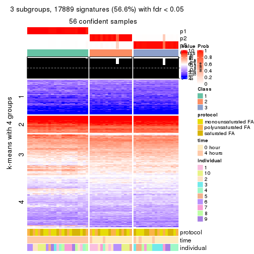</p>

</div>
<div id='tab-CV-skmeans-get-signatures-no-scale-3'>
<pre><code class="r">get_signatures(res, k = 4, scale_rows = FALSE)
</code></pre>

<p>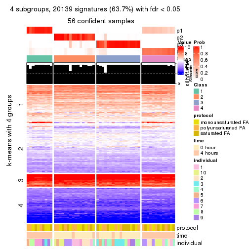</p>

</div>
<div id='tab-CV-skmeans-get-signatures-no-scale-4'>
<pre><code class="r">get_signatures(res, k = 5, scale_rows = FALSE)
</code></pre>

<p>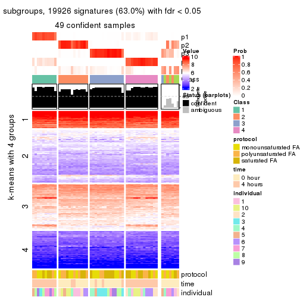</p>

</div>
<div id='tab-CV-skmeans-get-signatures-no-scale-5'>
<pre><code class="r">get_signatures(res, k = 6, scale_rows = FALSE)
</code></pre>

<p>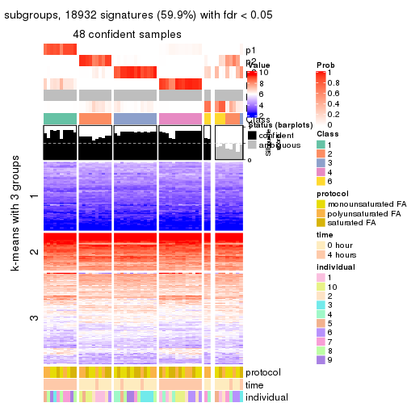</p>

</div>
</div>


Compare the overlap of signatures from different k:

```r
compare_signatures(res)
```

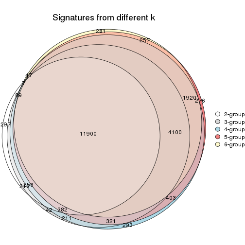

`get_signature()` returns a data frame invisibly. TO get the list of signatures, the function
call should be assigned to a variable explicitly. In following code, if `plot` argument is set
to `FALSE`, no heatmap is plotted while only the differential analysis is performed.

```r
# code only for demonstration
tb = get_signature(res, k = ..., plot = FALSE)
```

An example of the output of `tb` is:

```
#>   which_row         fdr    mean_1    mean_2 scaled_mean_1 scaled_mean_2 km
#> 1        38 0.042760348  8.373488  9.131774    -0.5533452     0.5164555  1
#> 2        40 0.018707592  7.106213  8.469186    -0.6173731     0.5762149  1
#> 3        55 0.019134737 10.221463 11.207825    -0.6159697     0.5749050  1
#> 4        59 0.006059896  5.921854  7.869574    -0.6899429     0.6439467  1
#> 5        60 0.018055526  8.928898 10.211722    -0.6204761     0.5791110  1
#> 6        98 0.009384629 15.714769 14.887706     0.6635654    -0.6193277  2
...
```

The columns in `tb` are:

1. `which_row`: row indices corresponding to the input matrix.
2. `fdr`: FDR for the differential test. 
3. `mean_x`: The mean value in group x.
4. `scaled_mean_x`: The mean value in group x after rows are scaled.
5. `km`: Row groups if k-means clustering is applied to rows.


UMAP plot which shows how samples are separated.


<script>
$( function() {
	$( '#tabs-CV-skmeans-dimension-reduction' ).tabs();
} );
</script>
<div id='tabs-CV-skmeans-dimension-reduction'>
<ul>
<li><a href='#tab-CV-skmeans-dimension-reduction-1'>k = 2</a></li>
<li><a href='#tab-CV-skmeans-dimension-reduction-2'>k = 3</a></li>
<li><a href='#tab-CV-skmeans-dimension-reduction-3'>k = 4</a></li>
<li><a href='#tab-CV-skmeans-dimension-reduction-4'>k = 5</a></li>
<li><a href='#tab-CV-skmeans-dimension-reduction-5'>k = 6</a></li>
</ul>
<div id='tab-CV-skmeans-dimension-reduction-1'>
<pre><code class="r">dimension_reduction(res, k = 2, method = &quot;UMAP&quot;)
</code></pre>

<p>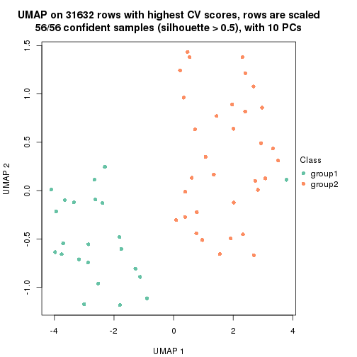</p>

</div>
<div id='tab-CV-skmeans-dimension-reduction-2'>
<pre><code class="r">dimension_reduction(res, k = 3, method = &quot;UMAP&quot;)
</code></pre>

<p>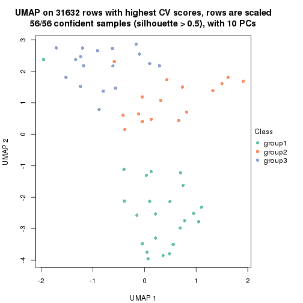</p>

</div>
<div id='tab-CV-skmeans-dimension-reduction-3'>
<pre><code class="r">dimension_reduction(res, k = 4, method = &quot;UMAP&quot;)
</code></pre>

<p>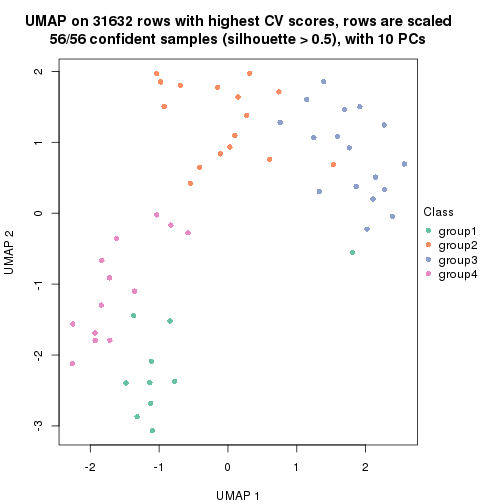</p>

</div>
<div id='tab-CV-skmeans-dimension-reduction-4'>
<pre><code class="r">dimension_reduction(res, k = 5, method = &quot;UMAP&quot;)
</code></pre>

<p>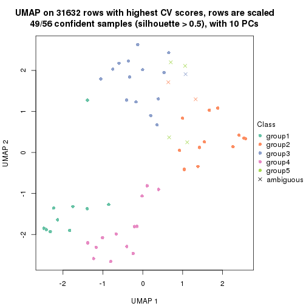</p>

</div>
<div id='tab-CV-skmeans-dimension-reduction-5'>
<pre><code class="r">dimension_reduction(res, k = 6, method = &quot;UMAP&quot;)
</code></pre>

<p>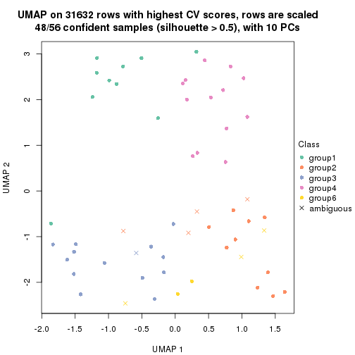</p>

</div>
</div>


Following heatmap shows how subgroups are split when increasing `k`:

```r
collect_classes(res)
```

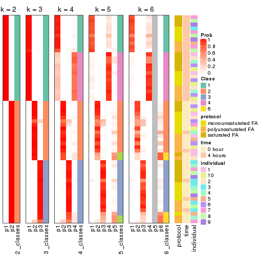


Test correlation between subgroups and known annotations. If the known
annotation is numeric, one-way ANOVA test is applied, and if the known
annotation is discrete, chi-squared contingency table test is applied.

```r
test_to_known_factors(res)
```

```
#>             n protocol(p)  time(p) individual(p) k
#> CV:skmeans 56       0.937 2.29e-09       0.95024 2
#> CV:skmeans 56       0.965 3.20e-09       0.05520 3
#> CV:skmeans 56       0.991 1.64e-08       0.00181 4
#> CV:skmeans 49       0.943 3.97e-07       0.00242 5
#> CV:skmeans 48       0.739 1.38e-07       0.00789 6
```


If matrix rows can be associated to genes, consider to use `functional_enrichment(res,
...)` to perform function enrichment for the signature genes. See [this vignette](http://bioconductor.org/packages/devel/bioc/vignettes/cola/inst/doc/functional_enrichment.html) for more detailed explanations.


 

---------------------------------------------------


### CV:pam**


The object with results only for a single top-value method and a single partition method 
can be extracted as:

```r
res = res_list["CV", "pam"]
# you can also extract it by
# res = res_list["CV:pam"]
```

A summary of `res` and all the functions that can be applied to it:

```r
res
```

```
#> A 'ConsensusPartition' object with k = 2, 3, 4, 5, 6.
#>   On a matrix with 31632 rows and 56 columns.
#>   Top rows (1000, 2000, 3000, 4000, 5000) are extracted by 'CV' method.
#>   Subgroups are detected by 'pam' method.
#>   Performed in total 1250 partitions by row resampling.
#>   Best k for subgroups seems to be 2.
#> 
#> Following methods can be applied to this 'ConsensusPartition' object:
#>  [1] "cola_report"             "collect_classes"         "collect_plots"          
#>  [4] "collect_stats"           "colnames"                "compare_signatures"     
#>  [7] "consensus_heatmap"       "dimension_reduction"     "functional_enrichment"  
#> [10] "get_anno_col"            "get_anno"                "get_classes"            
#> [13] "get_consensus"           "get_matrix"              "get_membership"         
#> [16] "get_param"               "get_signatures"          "get_stats"              
#> [19] "is_best_k"               "is_stable_k"             "membership_heatmap"     
#> [22] "ncol"                    "nrow"                    "plot_ecdf"              
#> [25] "rownames"                "select_partition_number" "show"                   
#> [28] "suggest_best_k"          "test_to_known_factors"
```

`collect_plots()` function collects all the plots made from `res` for all `k` (number of partitions)
into one single page to provide an easy and fast comparison between different `k`.

```r
collect_plots(res)
```

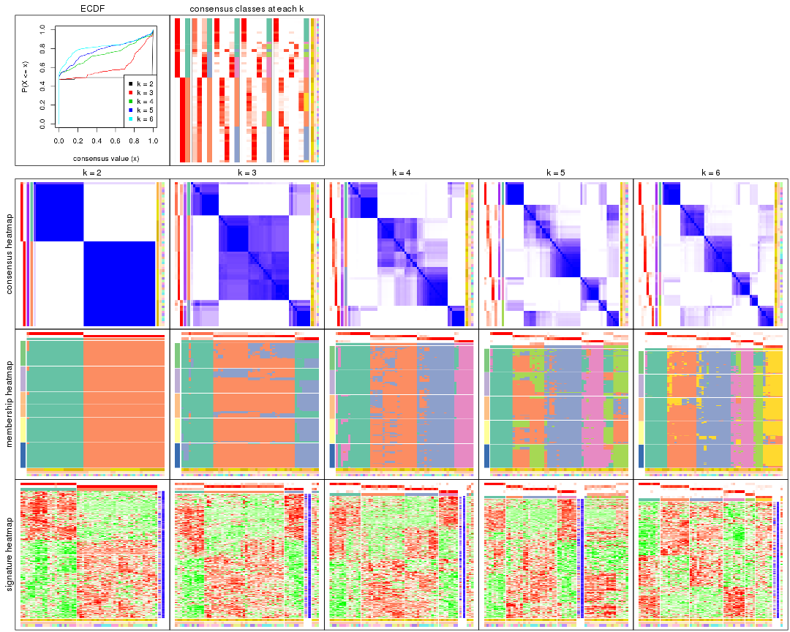

The plots are:

- The first row: a plot of the ECDF (empirical cumulative distribution
  function) curves of the consensus matrix for each `k` and the heatmap of
  predicted classes for each `k`.
- The second row: heatmaps of the consensus matrix for each `k`.
- The third row: heatmaps of the membership matrix for each `k`.
- The fouth row: heatmaps of the signatures for each `k`.

All the plots in panels can be made by individual functions and they are
plotted later in this section.

`select_partition_number()` produces several plots showing different
statistics for choosing "optimized" `k`. There are following statistics:

- ECDF curves of the consensus matrix for each `k`;
- 1-PAC. [The PAC
  score](https://en.wikipedia.org/wiki/Consensus_clustering#Over-interpretation_potential_of_consensus_clustering)
  measures the proportion of the ambiguous subgrouping.
- Mean silhouette score.
- Concordance. The mean probability of fiting the consensus class ids in all
  partitions.
- Area increased. Denote $A_k$ as the area under the ECDF curve for current
  `k`, the area increased is defined as $A_k - A_{k-1}$.
- Rand index. The percent of pairs of samples that are both in a same cluster
  or both are not in a same cluster in the partition of k and k-1.
- Jaccard index. The ratio of pairs of samples are both in a same cluster in
  the partition of k and k-1 and the pairs of samples are both in a same
  cluster in the partition k or k-1.

The detailed explanations of these statistics can be found in [the _cola_
vignette](http://bioconductor.org/packages/devel/bioc/vignettes/cola/inst/doc/cola.html#toc_13).

Generally speaking, lower PAC score, higher mean silhouette score or higher
concordance corresponds to better partition. Rand index and Jaccard index
measure how similar the current partition is compared to partition with `k-1`.
If they are too similar, we won't accept `k` is better than `k-1`.

```r
select_partition_number(res)
```

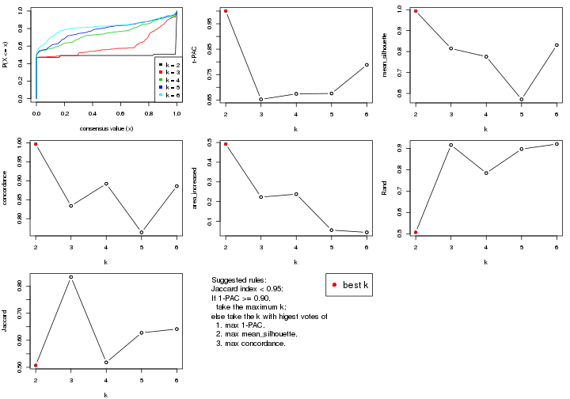

The numeric values for all these statistics can be obtained by `get_stats()`.

```r
get_stats(res)
```

```
#>   k 1-PAC mean_silhouette concordance area_increased  Rand Jaccard
#> 2 2 1.000           0.993       0.997         0.4922 0.507   0.507
#> 3 3 0.652           0.815       0.834         0.2230 0.916   0.834
#> 4 4 0.674           0.776       0.892         0.2380 0.784   0.518
#> 5 5 0.676           0.572       0.764         0.0552 0.897   0.628
#> 6 6 0.788           0.831       0.886         0.0438 0.920   0.641
```

`suggest_best_k()` suggests the best $k$ based on these statistics. The rules are as follows:

- All $k$ with Jaccard index larger than 0.95 are removed because increasing
  $k$ does not provide enough extra information. If all $k$ are removed, it is
  marked as no subgroup is detected.
- For all $k$ with 1-PAC score larger than 0.9, the maximal $k$ is taken as
  the best $k$, and other $k$ are marked as optional $k$.
- If it does not fit the second rule. The $k$ with the maximal vote of the
  highest 1-PAC score, highest mean silhouette, and highest concordance is
  taken as the best $k$.

```r
suggest_best_k(res)
```

```
#> [1] 2
```


Following shows the table of the partitions (You need to click the **show/hide
code output** link to see it). The membership matrix (columns with name `p*`)
is inferred by
[`clue::cl_consensus()`](https://www.rdocumentation.org/link/cl_consensus?package=clue)
function with the `SE` method. Basically the value in the membership matrix
represents the probability to belong to a certain group. The finall class
label for an item is determined with the group with highest probability it
belongs to.

In `get_classes()` function, the entropy is calculated from the membership
matrix and the silhouette score is calculated from the consensus matrix.


<script>
$( function() {
	$( '#tabs-CV-pam-get-classes' ).tabs();
} );
</script>
<div id='tabs-CV-pam-get-classes'>
<ul>
<li><a href='#tab-CV-pam-get-classes-1'>k = 2</a></li>
<li><a href='#tab-CV-pam-get-classes-2'>k = 3</a></li>
<li><a href='#tab-CV-pam-get-classes-3'>k = 4</a></li>
<li><a href='#tab-CV-pam-get-classes-4'>k = 5</a></li>
<li><a href='#tab-CV-pam-get-classes-5'>k = 6</a></li>
</ul>

<div id='tab-CV-pam-get-classes-1'>
<p><a id='tab-CV-pam-get-classes-1-a' style='color:#0366d6' href='#'>show/hide code output</a></p>
<pre><code class="r">cbind(get_classes(res, k = 2), get_membership(res, k = 2))
</code></pre>

<pre><code>#&gt;           class entropy silhouette    p1    p2
#&gt; GSM790742     2   0.000      1.000 0.000 1.000
#&gt; GSM790744     2   0.000      1.000 0.000 1.000
#&gt; GSM790754     2   0.000      1.000 0.000 1.000
#&gt; GSM790756     2   0.000      1.000 0.000 1.000
#&gt; GSM790768     2   0.000      1.000 0.000 1.000
#&gt; GSM790774     2   0.000      1.000 0.000 1.000
#&gt; GSM790778     2   0.000      1.000 0.000 1.000
#&gt; GSM790784     2   0.000      1.000 0.000 1.000
#&gt; GSM790790     2   0.000      1.000 0.000 1.000
#&gt; GSM790743     1   0.000      0.992 1.000 0.000
#&gt; GSM790745     1   0.000      0.992 1.000 0.000
#&gt; GSM790755     2   0.000      1.000 0.000 1.000
#&gt; GSM790757     1   0.000      0.992 1.000 0.000
#&gt; GSM790769     1   0.000      0.992 1.000 0.000
#&gt; GSM790775     1   0.000      0.992 1.000 0.000
#&gt; GSM790779     1   0.000      0.992 1.000 0.000
#&gt; GSM790785     1   0.000      0.992 1.000 0.000
#&gt; GSM790791     1   0.000      0.992 1.000 0.000
#&gt; GSM790738     2   0.000      1.000 0.000 1.000
#&gt; GSM790746     2   0.000      1.000 0.000 1.000
#&gt; GSM790752     2   0.000      1.000 0.000 1.000
#&gt; GSM790758     2   0.000      1.000 0.000 1.000
#&gt; GSM790764     2   0.000      1.000 0.000 1.000
#&gt; GSM790766     2   0.000      1.000 0.000 1.000
#&gt; GSM790772     2   0.000      1.000 0.000 1.000
#&gt; GSM790782     2   0.000      1.000 0.000 1.000
#&gt; GSM790786     2   0.000      1.000 0.000 1.000
#&gt; GSM790792     2   0.000      1.000 0.000 1.000
#&gt; GSM790739     1   0.000      0.992 1.000 0.000
#&gt; GSM790747     1   0.000      0.992 1.000 0.000
#&gt; GSM790753     1   0.000      0.992 1.000 0.000
#&gt; GSM790759     2   0.000      1.000 0.000 1.000
#&gt; GSM790765     2   0.000      1.000 0.000 1.000
#&gt; GSM790767     1   0.000      0.992 1.000 0.000
#&gt; GSM790773     1   0.000      0.992 1.000 0.000
#&gt; GSM790783     1   0.000      0.992 1.000 0.000
#&gt; GSM790787     1   0.000      0.992 1.000 0.000
#&gt; GSM790793     1   0.000      0.992 1.000 0.000
#&gt; GSM790740     2   0.000      1.000 0.000 1.000
#&gt; GSM790748     2   0.000      1.000 0.000 1.000
#&gt; GSM790750     2   0.000      1.000 0.000 1.000
#&gt; GSM790760     2   0.000      1.000 0.000 1.000
#&gt; GSM790762     2   0.000      1.000 0.000 1.000
#&gt; GSM790770     2   0.000      1.000 0.000 1.000
#&gt; GSM790776     2   0.000      1.000 0.000 1.000
#&gt; GSM790780     2   0.000      1.000 0.000 1.000
#&gt; GSM790788     2   0.000      1.000 0.000 1.000
#&gt; GSM790741     2   0.000      1.000 0.000 1.000
#&gt; GSM790749     1   0.000      0.992 1.000 0.000
#&gt; GSM790751     2   0.000      1.000 0.000 1.000
#&gt; GSM790761     1   0.000      0.992 1.000 0.000
#&gt; GSM790763     1   0.000      0.992 1.000 0.000
#&gt; GSM790771     1   0.000      0.992 1.000 0.000
#&gt; GSM790777     1   0.000      0.992 1.000 0.000
#&gt; GSM790781     1   0.653      0.798 0.832 0.168
#&gt; GSM790789     1   0.000      0.992 1.000 0.000
</code></pre>

<script>
$('#tab-CV-pam-get-classes-1-a').parent().next().next().hide();
$('#tab-CV-pam-get-classes-1-a').click(function(){
  $('#tab-CV-pam-get-classes-1-a').parent().next().next().toggle();
  return(false);
});
</script>
</div>

<div id='tab-CV-pam-get-classes-2'>
<p><a id='tab-CV-pam-get-classes-2-a' style='color:#0366d6' href='#'>show/hide code output</a></p>
<pre><code class="r">cbind(get_classes(res, k = 3), get_membership(res, k = 3))
</code></pre>

<pre><code>#&gt;           class entropy silhouette    p1    p2    p3
#&gt; GSM790742     2  0.0424      0.877 0.008 0.992 0.000
#&gt; GSM790744     2  0.2625      0.896 0.084 0.916 0.000
#&gt; GSM790754     2  0.5465      0.879 0.288 0.712 0.000
#&gt; GSM790756     2  0.4346      0.895 0.184 0.816 0.000
#&gt; GSM790768     2  0.1031      0.887 0.024 0.976 0.000
#&gt; GSM790774     2  0.4750      0.891 0.216 0.784 0.000
#&gt; GSM790778     2  0.5465      0.879 0.288 0.712 0.000
#&gt; GSM790784     2  0.5465      0.879 0.288 0.712 0.000
#&gt; GSM790790     2  0.0237      0.879 0.004 0.996 0.000
#&gt; GSM790743     3  0.0000      0.837 0.000 0.000 1.000
#&gt; GSM790745     1  0.6274      0.612 0.544 0.000 0.456
#&gt; GSM790755     2  0.5178      0.887 0.256 0.744 0.000
#&gt; GSM790757     1  0.6274      0.612 0.544 0.000 0.456
#&gt; GSM790769     3  0.0000      0.837 0.000 0.000 1.000
#&gt; GSM790775     1  0.5529      0.857 0.704 0.000 0.296
#&gt; GSM790779     1  0.5529      0.857 0.704 0.000 0.296
#&gt; GSM790785     1  0.5529      0.857 0.704 0.000 0.296
#&gt; GSM790791     3  0.3412      0.728 0.124 0.000 0.876
#&gt; GSM790738     2  0.0424      0.881 0.008 0.992 0.000
#&gt; GSM790746     2  0.2796      0.901 0.092 0.908 0.000
#&gt; GSM790752     2  0.5465      0.879 0.288 0.712 0.000
#&gt; GSM790758     2  0.5465      0.879 0.288 0.712 0.000
#&gt; GSM790764     2  0.3192      0.897 0.112 0.888 0.000
#&gt; GSM790766     2  0.2796      0.898 0.092 0.908 0.000
#&gt; GSM790772     2  0.2448      0.901 0.076 0.924 0.000
#&gt; GSM790782     2  0.5465      0.879 0.288 0.712 0.000
#&gt; GSM790786     2  0.5465      0.879 0.288 0.712 0.000
#&gt; GSM790792     2  0.0000      0.880 0.000 1.000 0.000
#&gt; GSM790739     3  0.6299     -0.484 0.476 0.000 0.524
#&gt; GSM790747     3  0.0000      0.837 0.000 0.000 1.000
#&gt; GSM790753     1  0.5529      0.857 0.704 0.000 0.296
#&gt; GSM790759     2  0.0424      0.877 0.008 0.992 0.000
#&gt; GSM790765     2  0.5465      0.879 0.288 0.712 0.000
#&gt; GSM790767     1  0.6225      0.673 0.568 0.000 0.432
#&gt; GSM790773     1  0.5529      0.857 0.704 0.000 0.296
#&gt; GSM790783     1  0.5988      0.772 0.632 0.000 0.368
#&gt; GSM790787     1  0.5529      0.857 0.704 0.000 0.296
#&gt; GSM790793     3  0.5254      0.428 0.264 0.000 0.736
#&gt; GSM790740     2  0.2711      0.897 0.088 0.912 0.000
#&gt; GSM790748     2  0.2165      0.893 0.064 0.936 0.000
#&gt; GSM790750     2  0.5465      0.879 0.288 0.712 0.000
#&gt; GSM790760     2  0.3192      0.897 0.112 0.888 0.000
#&gt; GSM790762     2  0.2796      0.896 0.092 0.908 0.000
#&gt; GSM790770     2  0.0424      0.877 0.008 0.992 0.000
#&gt; GSM790776     2  0.2537      0.895 0.080 0.920 0.000
#&gt; GSM790780     2  0.5431      0.880 0.284 0.716 0.000
#&gt; GSM790788     2  0.0892      0.886 0.020 0.980 0.000
#&gt; GSM790741     2  0.3116      0.895 0.108 0.892 0.000
#&gt; GSM790749     3  0.0000      0.837 0.000 0.000 1.000
#&gt; GSM790751     2  0.5016      0.891 0.240 0.760 0.000
#&gt; GSM790761     3  0.2356      0.787 0.072 0.000 0.928
#&gt; GSM790763     1  0.5529      0.857 0.704 0.000 0.296
#&gt; GSM790771     3  0.0000      0.837 0.000 0.000 1.000
#&gt; GSM790777     1  0.5529      0.857 0.704 0.000 0.296
#&gt; GSM790781     1  0.3183      0.346 0.908 0.076 0.016
#&gt; GSM790789     3  0.0000      0.837 0.000 0.000 1.000
</code></pre>

<script>
$('#tab-CV-pam-get-classes-2-a').parent().next().next().hide();
$('#tab-CV-pam-get-classes-2-a').click(function(){
  $('#tab-CV-pam-get-classes-2-a').parent().next().next().toggle();
  return(false);
});
</script>
</div>

<div id='tab-CV-pam-get-classes-3'>
<p><a id='tab-CV-pam-get-classes-3-a' style='color:#0366d6' href='#'>show/hide code output</a></p>
<pre><code class="r">cbind(get_classes(res, k = 4), get_membership(res, k = 4))
</code></pre>

<pre><code>#&gt;           class entropy silhouette    p1    p2    p3    p4
#&gt; GSM790742     2  0.0000     0.8068 0.000 1.000 0.000 0.000
#&gt; GSM790744     2  0.4331     0.6667 0.000 0.712 0.288 0.000
#&gt; GSM790754     3  0.0000     0.8954 0.000 0.000 1.000 0.000
#&gt; GSM790756     3  0.4624     0.4905 0.000 0.340 0.660 0.000
#&gt; GSM790768     2  0.1867     0.8077 0.000 0.928 0.072 0.000
#&gt; GSM790774     3  0.4164     0.6314 0.000 0.264 0.736 0.000
#&gt; GSM790778     3  0.0000     0.8954 0.000 0.000 1.000 0.000
#&gt; GSM790784     3  0.0188     0.8958 0.000 0.004 0.996 0.000
#&gt; GSM790790     2  0.0469     0.8088 0.000 0.988 0.012 0.000
#&gt; GSM790743     4  0.0000     0.9149 0.000 0.000 0.000 1.000
#&gt; GSM790745     1  0.3718     0.7725 0.820 0.012 0.000 0.168
#&gt; GSM790755     3  0.2704     0.8100 0.000 0.124 0.876 0.000
#&gt; GSM790757     1  0.3400     0.7673 0.820 0.000 0.000 0.180
#&gt; GSM790769     4  0.0000     0.9149 0.000 0.000 0.000 1.000
#&gt; GSM790775     1  0.0000     0.8733 1.000 0.000 0.000 0.000
#&gt; GSM790779     1  0.0000     0.8733 1.000 0.000 0.000 0.000
#&gt; GSM790785     1  0.0000     0.8733 1.000 0.000 0.000 0.000
#&gt; GSM790791     4  0.4454     0.5036 0.308 0.000 0.000 0.692
#&gt; GSM790738     2  0.0336     0.8088 0.000 0.992 0.008 0.000
#&gt; GSM790746     2  0.3444     0.7396 0.000 0.816 0.184 0.000
#&gt; GSM790752     3  0.0188     0.8960 0.000 0.004 0.996 0.000
#&gt; GSM790758     3  0.0336     0.8947 0.000 0.008 0.992 0.000
#&gt; GSM790764     2  0.4222     0.6166 0.000 0.728 0.272 0.000
#&gt; GSM790766     2  0.4222     0.6801 0.000 0.728 0.272 0.000
#&gt; GSM790772     2  0.4543     0.4714 0.000 0.676 0.324 0.000
#&gt; GSM790782     3  0.0336     0.8951 0.000 0.008 0.992 0.000
#&gt; GSM790786     3  0.0336     0.8945 0.000 0.008 0.992 0.000
#&gt; GSM790792     2  0.0336     0.8083 0.000 0.992 0.008 0.000
#&gt; GSM790739     1  0.4008     0.6880 0.756 0.000 0.000 0.244
#&gt; GSM790747     4  0.0000     0.9149 0.000 0.000 0.000 1.000
#&gt; GSM790753     1  0.0000     0.8733 1.000 0.000 0.000 0.000
#&gt; GSM790759     2  0.0000     0.8068 0.000 1.000 0.000 0.000
#&gt; GSM790765     3  0.0000     0.8954 0.000 0.000 1.000 0.000
#&gt; GSM790767     1  0.3172     0.7791 0.840 0.000 0.000 0.160
#&gt; GSM790773     1  0.0000     0.8733 1.000 0.000 0.000 0.000
#&gt; GSM790783     1  0.3311     0.7249 0.828 0.000 0.000 0.172
#&gt; GSM790787     1  0.0000     0.8733 1.000 0.000 0.000 0.000
#&gt; GSM790793     1  0.5000     0.0035 0.500 0.000 0.000 0.500
#&gt; GSM790740     2  0.3569     0.7519 0.000 0.804 0.196 0.000
#&gt; GSM790748     2  0.2704     0.7721 0.000 0.876 0.124 0.000
#&gt; GSM790750     3  0.1022     0.8815 0.000 0.032 0.968 0.000
#&gt; GSM790760     2  0.4193     0.6250 0.000 0.732 0.268 0.000
#&gt; GSM790762     2  0.4477     0.6320 0.000 0.688 0.312 0.000
#&gt; GSM790770     2  0.0000     0.8068 0.000 1.000 0.000 0.000
#&gt; GSM790776     2  0.2921     0.7607 0.000 0.860 0.140 0.000
#&gt; GSM790780     3  0.0188     0.8955 0.000 0.004 0.996 0.000
#&gt; GSM790788     2  0.2408     0.7981 0.000 0.896 0.104 0.000
#&gt; GSM790741     2  0.4605     0.5982 0.000 0.664 0.336 0.000
#&gt; GSM790749     4  0.0000     0.9149 0.000 0.000 0.000 1.000
#&gt; GSM790751     3  0.4477     0.5080 0.000 0.312 0.688 0.000
#&gt; GSM790761     4  0.3400     0.7397 0.180 0.000 0.000 0.820
#&gt; GSM790763     1  0.0000     0.8733 1.000 0.000 0.000 0.000
#&gt; GSM790771     4  0.0000     0.9149 0.000 0.000 0.000 1.000
#&gt; GSM790777     1  0.0000     0.8733 1.000 0.000 0.000 0.000
#&gt; GSM790781     3  0.2450     0.8302 0.072 0.016 0.912 0.000
#&gt; GSM790789     4  0.0000     0.9149 0.000 0.000 0.000 1.000
</code></pre>

<script>
$('#tab-CV-pam-get-classes-3-a').parent().next().next().hide();
$('#tab-CV-pam-get-classes-3-a').click(function(){
  $('#tab-CV-pam-get-classes-3-a').parent().next().next().toggle();
  return(false);
});
</script>
</div>

<div id='tab-CV-pam-get-classes-4'>
<p><a id='tab-CV-pam-get-classes-4-a' style='color:#0366d6' href='#'>show/hide code output</a></p>
<pre><code class="r">cbind(get_classes(res, k = 5), get_membership(res, k = 5))
</code></pre>

<pre><code>#&gt;           class entropy silhouette    p1    p2    p3    p4    p5
#&gt; GSM790742     2  0.0000     0.5831 0.000 1.000 0.000 0.000 0.000
#&gt; GSM790744     5  0.6463     0.0312 0.000 0.344 0.192 0.000 0.464
#&gt; GSM790754     3  0.0000     0.8851 0.000 0.000 1.000 0.000 0.000
#&gt; GSM790756     3  0.3999     0.5133 0.000 0.344 0.656 0.000 0.000
#&gt; GSM790768     2  0.4974     0.2631 0.000 0.508 0.028 0.000 0.464
#&gt; GSM790774     3  0.4090     0.6239 0.000 0.268 0.716 0.000 0.016
#&gt; GSM790778     3  0.0000     0.8851 0.000 0.000 1.000 0.000 0.000
#&gt; GSM790784     3  0.0609     0.8829 0.000 0.020 0.980 0.000 0.000
#&gt; GSM790790     2  0.4371     0.4334 0.000 0.644 0.012 0.000 0.344
#&gt; GSM790743     4  0.1831     0.8346 0.004 0.000 0.000 0.920 0.076
#&gt; GSM790745     5  0.5036    -0.1966 0.404 0.000 0.000 0.036 0.560
#&gt; GSM790755     3  0.2329     0.8169 0.000 0.124 0.876 0.000 0.000
#&gt; GSM790757     5  0.6012    -0.2111 0.400 0.000 0.000 0.116 0.484
#&gt; GSM790769     4  0.0000     0.8573 0.000 0.000 0.000 1.000 0.000
#&gt; GSM790775     1  0.0000     0.9740 1.000 0.000 0.000 0.000 0.000
#&gt; GSM790779     1  0.0000     0.9740 1.000 0.000 0.000 0.000 0.000
#&gt; GSM790785     1  0.0000     0.9740 1.000 0.000 0.000 0.000 0.000
#&gt; GSM790791     4  0.3659     0.6976 0.220 0.000 0.000 0.768 0.012
#&gt; GSM790738     2  0.4437     0.3042 0.000 0.532 0.004 0.000 0.464
#&gt; GSM790746     2  0.5896     0.2787 0.000 0.452 0.100 0.000 0.448
#&gt; GSM790752     3  0.0162     0.8853 0.000 0.004 0.996 0.000 0.000
#&gt; GSM790758     3  0.0000     0.8851 0.000 0.000 1.000 0.000 0.000
#&gt; GSM790764     2  0.2891     0.5269 0.000 0.824 0.176 0.000 0.000
#&gt; GSM790766     5  0.6401    -0.0240 0.000 0.380 0.172 0.000 0.448
#&gt; GSM790772     2  0.3319     0.5164 0.000 0.820 0.160 0.000 0.020
#&gt; GSM790782     3  0.0794     0.8797 0.000 0.028 0.972 0.000 0.000
#&gt; GSM790786     3  0.0290     0.8835 0.000 0.008 0.992 0.000 0.000
#&gt; GSM790792     2  0.4522     0.3325 0.000 0.552 0.008 0.000 0.440
#&gt; GSM790739     5  0.6254    -0.1688 0.368 0.000 0.000 0.152 0.480
#&gt; GSM790747     4  0.0000     0.8573 0.000 0.000 0.000 1.000 0.000
#&gt; GSM790753     1  0.0000     0.9740 1.000 0.000 0.000 0.000 0.000
#&gt; GSM790759     2  0.0404     0.5829 0.000 0.988 0.000 0.000 0.012
#&gt; GSM790765     3  0.0000     0.8851 0.000 0.000 1.000 0.000 0.000
#&gt; GSM790767     4  0.4306     0.1362 0.492 0.000 0.000 0.508 0.000
#&gt; GSM790773     1  0.0000     0.9740 1.000 0.000 0.000 0.000 0.000
#&gt; GSM790783     1  0.2813     0.7619 0.832 0.000 0.000 0.168 0.000
#&gt; GSM790787     1  0.0000     0.9740 1.000 0.000 0.000 0.000 0.000
#&gt; GSM790793     5  0.6750    -0.2429 0.292 0.000 0.000 0.300 0.408
#&gt; GSM790740     5  0.6320    -0.0817 0.000 0.404 0.156 0.000 0.440
#&gt; GSM790748     2  0.1851     0.5798 0.000 0.912 0.088 0.000 0.000
#&gt; GSM790750     3  0.1608     0.8554 0.000 0.072 0.928 0.000 0.000
#&gt; GSM790760     2  0.2852     0.5307 0.000 0.828 0.172 0.000 0.000
#&gt; GSM790762     5  0.6515     0.0536 0.000 0.328 0.208 0.000 0.464
#&gt; GSM790770     2  0.3966     0.4447 0.000 0.664 0.000 0.000 0.336
#&gt; GSM790776     2  0.1965     0.5768 0.000 0.904 0.096 0.000 0.000
#&gt; GSM790780     3  0.0162     0.8847 0.000 0.000 0.996 0.000 0.004
#&gt; GSM790788     5  0.5737    -0.2461 0.000 0.452 0.084 0.000 0.464
#&gt; GSM790741     5  0.6503     0.0507 0.000 0.332 0.204 0.000 0.464
#&gt; GSM790749     4  0.0000     0.8573 0.000 0.000 0.000 1.000 0.000
#&gt; GSM790751     3  0.4696     0.2944 0.000 0.428 0.556 0.000 0.016
#&gt; GSM790761     4  0.4844     0.7269 0.108 0.000 0.000 0.720 0.172
#&gt; GSM790763     1  0.0000     0.9740 1.000 0.000 0.000 0.000 0.000
#&gt; GSM790771     4  0.0000     0.8573 0.000 0.000 0.000 1.000 0.000
#&gt; GSM790777     1  0.0000     0.9740 1.000 0.000 0.000 0.000 0.000
#&gt; GSM790781     3  0.2899     0.8074 0.076 0.008 0.880 0.000 0.036
#&gt; GSM790789     4  0.0404     0.8547 0.000 0.000 0.000 0.988 0.012
</code></pre>

<script>
$('#tab-CV-pam-get-classes-4-a').parent().next().next().hide();
$('#tab-CV-pam-get-classes-4-a').click(function(){
  $('#tab-CV-pam-get-classes-4-a').parent().next().next().toggle();
  return(false);
});
</script>
</div>

<div id='tab-CV-pam-get-classes-5'>
<p><a id='tab-CV-pam-get-classes-5-a' style='color:#0366d6' href='#'>show/hide code output</a></p>
<pre><code class="r">cbind(get_classes(res, k = 6), get_membership(res, k = 6))
</code></pre>

<pre><code>#&gt;           class entropy silhouette    p1    p2    p3    p4    p5    p6
#&gt; GSM790742     6  0.2135      0.852 0.000 0.128 0.000 0.000 0.000 0.872
#&gt; GSM790744     2  0.1556      0.869 0.000 0.920 0.080 0.000 0.000 0.000
#&gt; GSM790754     3  0.0713      0.900 0.000 0.000 0.972 0.000 0.000 0.028
#&gt; GSM790756     3  0.3690      0.586 0.000 0.008 0.684 0.000 0.000 0.308
#&gt; GSM790768     2  0.1757      0.872 0.000 0.916 0.008 0.000 0.000 0.076
#&gt; GSM790774     3  0.3924      0.667 0.000 0.052 0.740 0.000 0.000 0.208
#&gt; GSM790778     3  0.0000      0.904 0.000 0.000 1.000 0.000 0.000 0.000
#&gt; GSM790784     3  0.0692      0.902 0.000 0.004 0.976 0.000 0.000 0.020
#&gt; GSM790790     2  0.3615      0.597 0.000 0.700 0.008 0.000 0.000 0.292
#&gt; GSM790743     4  0.5488      0.689 0.020 0.052 0.000 0.692 0.148 0.088
#&gt; GSM790745     5  0.2178      0.925 0.132 0.000 0.000 0.000 0.868 0.000
#&gt; GSM790755     3  0.2841      0.798 0.000 0.012 0.824 0.000 0.000 0.164
#&gt; GSM790757     5  0.2092      0.921 0.124 0.000 0.000 0.000 0.876 0.000
#&gt; GSM790769     4  0.0000      0.839 0.000 0.000 0.000 1.000 0.000 0.000
#&gt; GSM790775     1  0.0000      0.969 1.000 0.000 0.000 0.000 0.000 0.000
#&gt; GSM790779     1  0.0405      0.962 0.988 0.000 0.000 0.000 0.004 0.008
#&gt; GSM790785     1  0.0000      0.969 1.000 0.000 0.000 0.000 0.000 0.000
#&gt; GSM790791     4  0.2909      0.732 0.136 0.000 0.000 0.836 0.028 0.000
#&gt; GSM790738     2  0.1444      0.870 0.000 0.928 0.000 0.000 0.000 0.072
#&gt; GSM790746     2  0.3123      0.834 0.000 0.832 0.056 0.000 0.000 0.112
#&gt; GSM790752     3  0.0790      0.901 0.000 0.000 0.968 0.000 0.000 0.032
#&gt; GSM790758     3  0.0547      0.902 0.000 0.000 0.980 0.000 0.000 0.020
#&gt; GSM790764     6  0.2250      0.844 0.000 0.064 0.040 0.000 0.000 0.896
#&gt; GSM790766     2  0.2554      0.868 0.000 0.876 0.076 0.000 0.000 0.048
#&gt; GSM790772     6  0.3567      0.794 0.000 0.100 0.100 0.000 0.000 0.800
#&gt; GSM790782     3  0.1225      0.893 0.000 0.012 0.952 0.000 0.000 0.036
#&gt; GSM790786     3  0.0260      0.903 0.000 0.008 0.992 0.000 0.000 0.000
#&gt; GSM790792     2  0.2006      0.858 0.000 0.892 0.004 0.000 0.000 0.104
#&gt; GSM790739     5  0.2178      0.925 0.132 0.000 0.000 0.000 0.868 0.000
#&gt; GSM790747     4  0.0000      0.839 0.000 0.000 0.000 1.000 0.000 0.000
#&gt; GSM790753     1  0.0000      0.969 1.000 0.000 0.000 0.000 0.000 0.000
#&gt; GSM790759     6  0.2491      0.829 0.000 0.164 0.000 0.000 0.000 0.836
#&gt; GSM790765     3  0.0000      0.904 0.000 0.000 1.000 0.000 0.000 0.000
#&gt; GSM790767     4  0.3309      0.602 0.280 0.000 0.000 0.720 0.000 0.000
#&gt; GSM790773     1  0.0000      0.969 1.000 0.000 0.000 0.000 0.000 0.000
#&gt; GSM790783     1  0.2527      0.766 0.832 0.000 0.000 0.168 0.000 0.000
#&gt; GSM790787     1  0.0000      0.969 1.000 0.000 0.000 0.000 0.000 0.000
#&gt; GSM790793     5  0.4752      0.746 0.140 0.000 0.000 0.184 0.676 0.000
#&gt; GSM790740     2  0.2420      0.872 0.000 0.884 0.076 0.000 0.000 0.040
#&gt; GSM790748     6  0.2135      0.852 0.000 0.128 0.000 0.000 0.000 0.872
#&gt; GSM790750     3  0.1863      0.863 0.000 0.000 0.896 0.000 0.000 0.104
#&gt; GSM790760     6  0.2237      0.846 0.000 0.068 0.036 0.000 0.000 0.896
#&gt; GSM790762     2  0.1501      0.871 0.000 0.924 0.076 0.000 0.000 0.000
#&gt; GSM790770     2  0.3428      0.629 0.000 0.696 0.000 0.000 0.000 0.304
#&gt; GSM790776     6  0.2178      0.852 0.000 0.132 0.000 0.000 0.000 0.868
#&gt; GSM790780     3  0.0146      0.904 0.000 0.004 0.996 0.000 0.000 0.000
#&gt; GSM790788     2  0.1572      0.879 0.000 0.936 0.028 0.000 0.000 0.036
#&gt; GSM790741     2  0.1714      0.865 0.000 0.908 0.092 0.000 0.000 0.000
#&gt; GSM790749     4  0.0000      0.839 0.000 0.000 0.000 1.000 0.000 0.000
#&gt; GSM790751     6  0.4609      0.213 0.000 0.040 0.420 0.000 0.000 0.540
#&gt; GSM790761     4  0.6039      0.519 0.004 0.052 0.000 0.548 0.308 0.088
#&gt; GSM790763     1  0.0405      0.962 0.988 0.000 0.000 0.000 0.004 0.008
#&gt; GSM790771     4  0.0000      0.839 0.000 0.000 0.000 1.000 0.000 0.000
#&gt; GSM790777     1  0.0000      0.969 1.000 0.000 0.000 0.000 0.000 0.000
#&gt; GSM790781     3  0.3684      0.797 0.044 0.036 0.828 0.000 0.084 0.008
#&gt; GSM790789     4  0.0713      0.828 0.000 0.000 0.000 0.972 0.028 0.000
</code></pre>

<script>
$('#tab-CV-pam-get-classes-5-a').parent().next().next().hide();
$('#tab-CV-pam-get-classes-5-a').click(function(){
  $('#tab-CV-pam-get-classes-5-a').parent().next().next().toggle();
  return(false);
});
</script>
</div>
</div>

Heatmaps for the consensus matrix. It visualizes the probability of two
samples to be in a same group.


<script>
$( function() {
	$( '#tabs-CV-pam-consensus-heatmap' ).tabs();
} );
</script>
<div id='tabs-CV-pam-consensus-heatmap'>
<ul>
<li><a href='#tab-CV-pam-consensus-heatmap-1'>k = 2</a></li>
<li><a href='#tab-CV-pam-consensus-heatmap-2'>k = 3</a></li>
<li><a href='#tab-CV-pam-consensus-heatmap-3'>k = 4</a></li>
<li><a href='#tab-CV-pam-consensus-heatmap-4'>k = 5</a></li>
<li><a href='#tab-CV-pam-consensus-heatmap-5'>k = 6</a></li>
</ul>
<div id='tab-CV-pam-consensus-heatmap-1'>
<pre><code class="r">consensus_heatmap(res, k = 2)
</code></pre>

<p>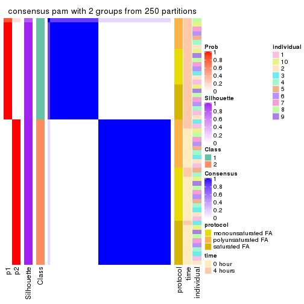</p>

</div>
<div id='tab-CV-pam-consensus-heatmap-2'>
<pre><code class="r">consensus_heatmap(res, k = 3)
</code></pre>

<p>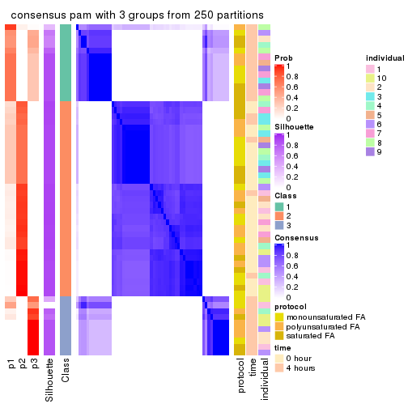</p>

</div>
<div id='tab-CV-pam-consensus-heatmap-3'>
<pre><code class="r">consensus_heatmap(res, k = 4)
</code></pre>

<p>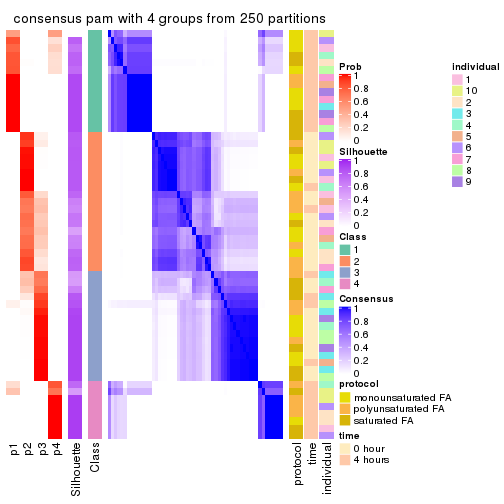</p>

</div>
<div id='tab-CV-pam-consensus-heatmap-4'>
<pre><code class="r">consensus_heatmap(res, k = 5)
</code></pre>

<p>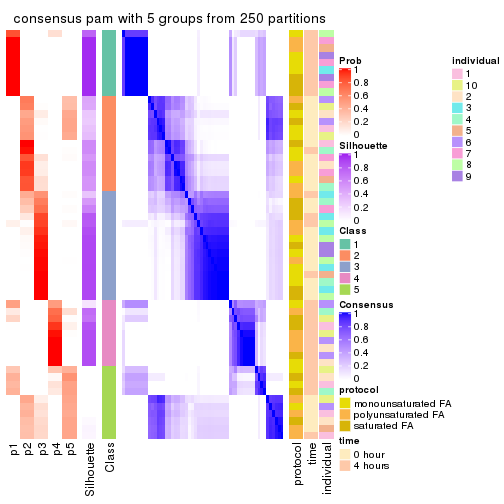</p>

</div>
<div id='tab-CV-pam-consensus-heatmap-5'>
<pre><code class="r">consensus_heatmap(res, k = 6)
</code></pre>

<p>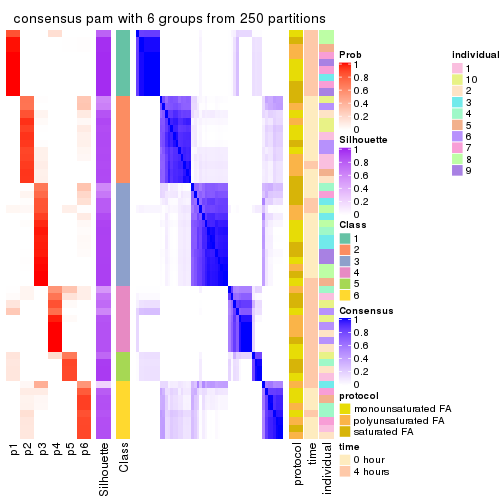</p>

</div>
</div>

Heatmaps for the membership of samples in all partitions to see how consistent they are:


<script>
$( function() {
	$( '#tabs-CV-pam-membership-heatmap' ).tabs();
} );
</script>
<div id='tabs-CV-pam-membership-heatmap'>
<ul>
<li><a href='#tab-CV-pam-membership-heatmap-1'>k = 2</a></li>
<li><a href='#tab-CV-pam-membership-heatmap-2'>k = 3</a></li>
<li><a href='#tab-CV-pam-membership-heatmap-3'>k = 4</a></li>
<li><a href='#tab-CV-pam-membership-heatmap-4'>k = 5</a></li>
<li><a href='#tab-CV-pam-membership-heatmap-5'>k = 6</a></li>
</ul>
<div id='tab-CV-pam-membership-heatmap-1'>
<pre><code class="r">membership_heatmap(res, k = 2)
</code></pre>

<p>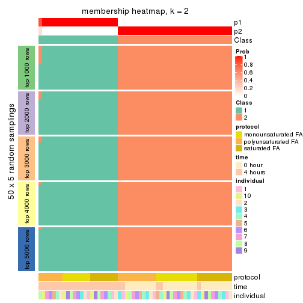</p>

</div>
<div id='tab-CV-pam-membership-heatmap-2'>
<pre><code class="r">membership_heatmap(res, k = 3)
</code></pre>

<p>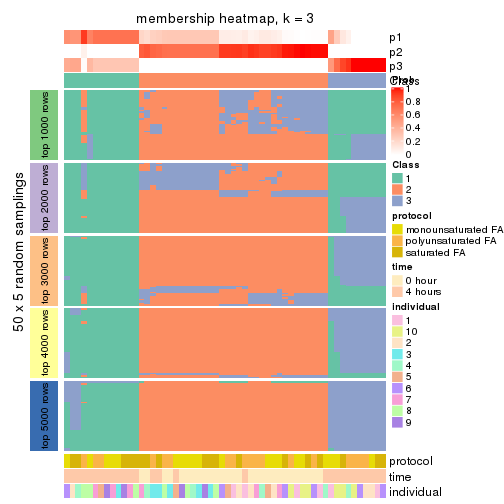</p>

</div>
<div id='tab-CV-pam-membership-heatmap-3'>
<pre><code class="r">membership_heatmap(res, k = 4)
</code></pre>

<p>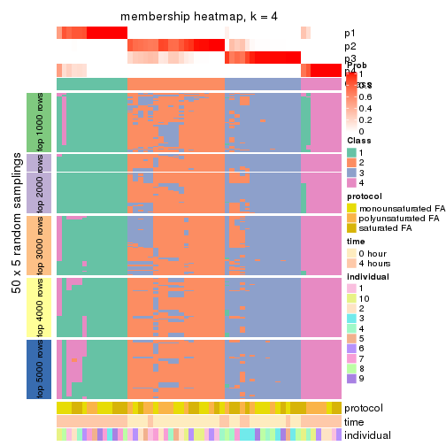</p>

</div>
<div id='tab-CV-pam-membership-heatmap-4'>
<pre><code class="r">membership_heatmap(res, k = 5)
</code></pre>

<p>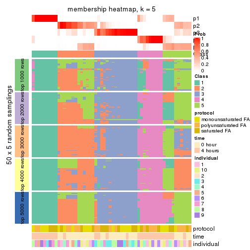</p>

</div>
<div id='tab-CV-pam-membership-heatmap-5'>
<pre><code class="r">membership_heatmap(res, k = 6)
</code></pre>

<p>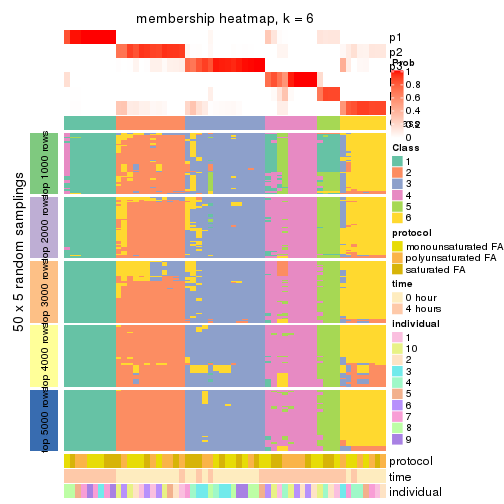</p>

</div>
</div>

As soon as we have had the classes for columns, we can look for signatures
which are significantly different between classes which can be candidate marks
for certain classes. Following are the heatmaps for signatures.


Signature heatmaps where rows are scaled:


<script>
$( function() {
	$( '#tabs-CV-pam-get-signatures' ).tabs();
} );
</script>
<div id='tabs-CV-pam-get-signatures'>
<ul>
<li><a href='#tab-CV-pam-get-signatures-1'>k = 2</a></li>
<li><a href='#tab-CV-pam-get-signatures-2'>k = 3</a></li>
<li><a href='#tab-CV-pam-get-signatures-3'>k = 4</a></li>
<li><a href='#tab-CV-pam-get-signatures-4'>k = 5</a></li>
<li><a href='#tab-CV-pam-get-signatures-5'>k = 6</a></li>
</ul>
<div id='tab-CV-pam-get-signatures-1'>
<pre><code class="r">get_signatures(res, k = 2)
</code></pre>

<p>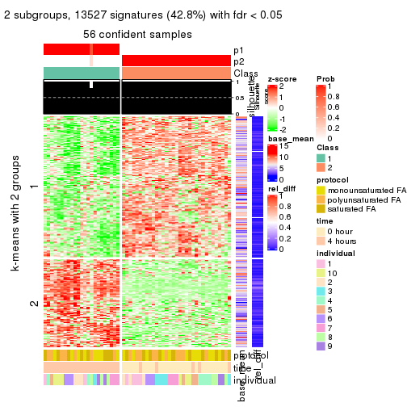</p>

</div>
<div id='tab-CV-pam-get-signatures-2'>
<pre><code class="r">get_signatures(res, k = 3)
</code></pre>

<p>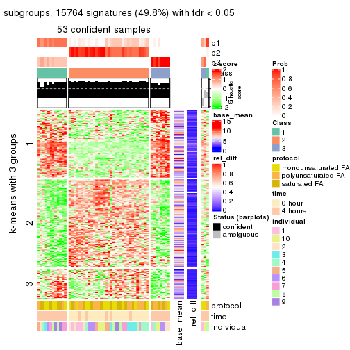</p>

</div>
<div id='tab-CV-pam-get-signatures-3'>
<pre><code class="r">get_signatures(res, k = 4)
</code></pre>

<p>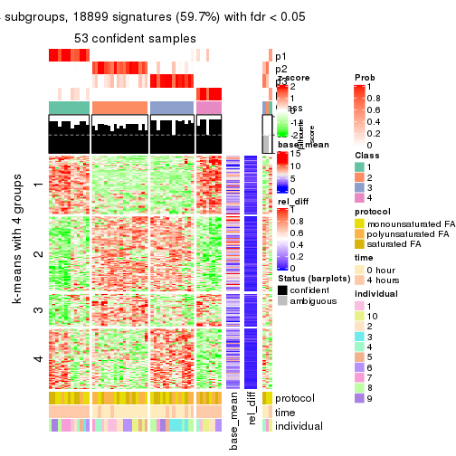</p>

</div>
<div id='tab-CV-pam-get-signatures-4'>
<pre><code class="r">get_signatures(res, k = 5)
</code></pre>

<p>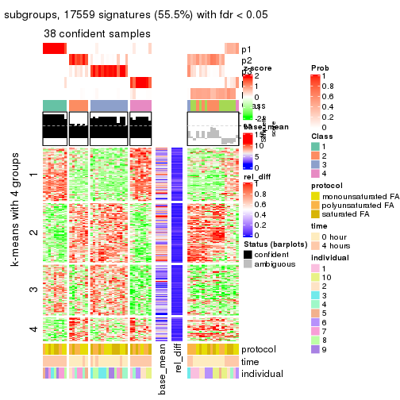</p>

</div>
<div id='tab-CV-pam-get-signatures-5'>
<pre><code class="r">get_signatures(res, k = 6)
</code></pre>

<p>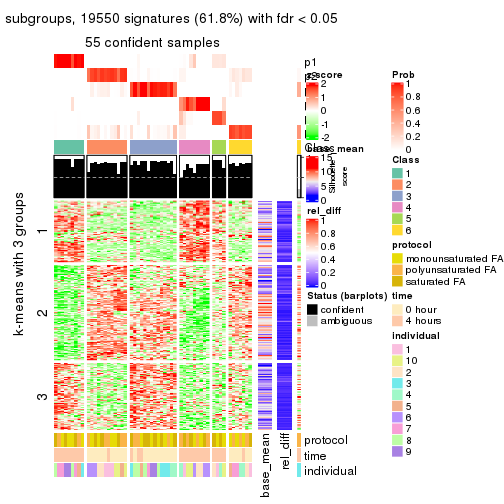</p>

</div>
</div>


Signature heatmaps where rows are not scaled:


<script>
$( function() {
	$( '#tabs-CV-pam-get-signatures-no-scale' ).tabs();
} );
</script>
<div id='tabs-CV-pam-get-signatures-no-scale'>
<ul>
<li><a href='#tab-CV-pam-get-signatures-no-scale-1'>k = 2</a></li>
<li><a href='#tab-CV-pam-get-signatures-no-scale-2'>k = 3</a></li>
<li><a href='#tab-CV-pam-get-signatures-no-scale-3'>k = 4</a></li>
<li><a href='#tab-CV-pam-get-signatures-no-scale-4'>k = 5</a></li>
<li><a href='#tab-CV-pam-get-signatures-no-scale-5'>k = 6</a></li>
</ul>
<div id='tab-CV-pam-get-signatures-no-scale-1'>
<pre><code class="r">get_signatures(res, k = 2, scale_rows = FALSE)
</code></pre>

<p>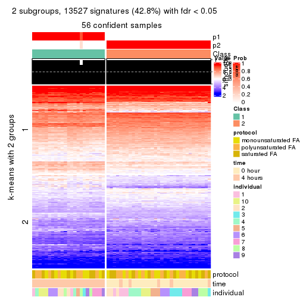</p>

</div>
<div id='tab-CV-pam-get-signatures-no-scale-2'>
<pre><code class="r">get_signatures(res, k = 3, scale_rows = FALSE)
</code></pre>

<p>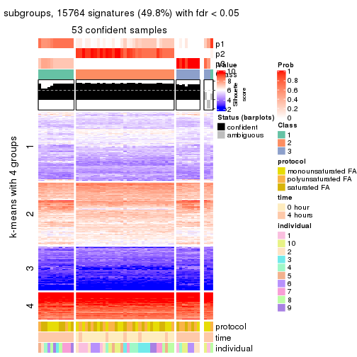</p>

</div>
<div id='tab-CV-pam-get-signatures-no-scale-3'>
<pre><code class="r">get_signatures(res, k = 4, scale_rows = FALSE)
</code></pre>

<p>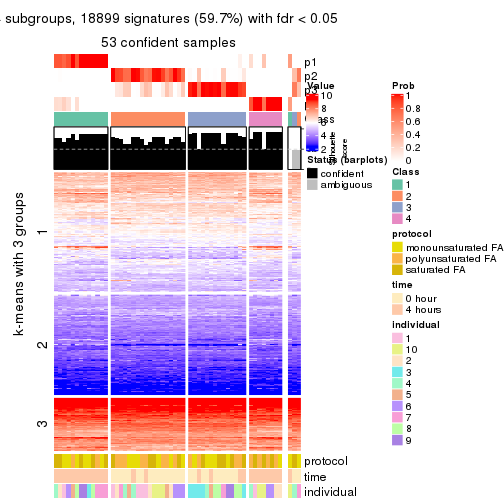</p>

</div>
<div id='tab-CV-pam-get-signatures-no-scale-4'>
<pre><code class="r">get_signatures(res, k = 5, scale_rows = FALSE)
</code></pre>

<p>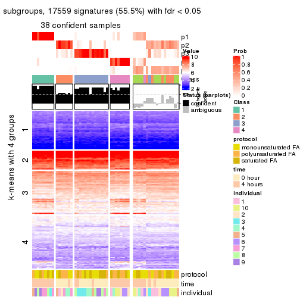</p>

</div>
<div id='tab-CV-pam-get-signatures-no-scale-5'>
<pre><code class="r">get_signatures(res, k = 6, scale_rows = FALSE)
</code></pre>

<p>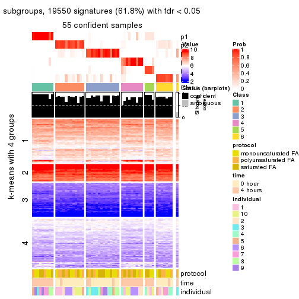</p>

</div>
</div>


Compare the overlap of signatures from different k:

```r
compare_signatures(res)
```

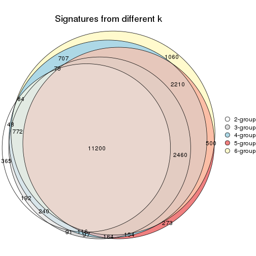

`get_signature()` returns a data frame invisibly. TO get the list of signatures, the function
call should be assigned to a variable explicitly. In following code, if `plot` argument is set
to `FALSE`, no heatmap is plotted while only the differential analysis is performed.

```r
# code only for demonstration
tb = get_signature(res, k = ..., plot = FALSE)
```

An example of the output of `tb` is:

```
#>   which_row         fdr    mean_1    mean_2 scaled_mean_1 scaled_mean_2 km
#> 1        38 0.042760348  8.373488  9.131774    -0.5533452     0.5164555  1
#> 2        40 0.018707592  7.106213  8.469186    -0.6173731     0.5762149  1
#> 3        55 0.019134737 10.221463 11.207825    -0.6159697     0.5749050  1
#> 4        59 0.006059896  5.921854  7.869574    -0.6899429     0.6439467  1
#> 5        60 0.018055526  8.928898 10.211722    -0.6204761     0.5791110  1
#> 6        98 0.009384629 15.714769 14.887706     0.6635654    -0.6193277  2
...
```

The columns in `tb` are:

1. `which_row`: row indices corresponding to the input matrix.
2. `fdr`: FDR for the differential test. 
3. `mean_x`: The mean value in group x.
4. `scaled_mean_x`: The mean value in group x after rows are scaled.
5. `km`: Row groups if k-means clustering is applied to rows.


UMAP plot which shows how samples are separated.


<script>
$( function() {
	$( '#tabs-CV-pam-dimension-reduction' ).tabs();
} );
</script>
<div id='tabs-CV-pam-dimension-reduction'>
<ul>
<li><a href='#tab-CV-pam-dimension-reduction-1'>k = 2</a></li>
<li><a href='#tab-CV-pam-dimension-reduction-2'>k = 3</a></li>
<li><a href='#tab-CV-pam-dimension-reduction-3'>k = 4</a></li>
<li><a href='#tab-CV-pam-dimension-reduction-4'>k = 5</a></li>
<li><a href='#tab-CV-pam-dimension-reduction-5'>k = 6</a></li>
</ul>
<div id='tab-CV-pam-dimension-reduction-1'>
<pre><code class="r">dimension_reduction(res, k = 2, method = &quot;UMAP&quot;)
</code></pre>

<p></p>

</div>
<div id='tab-CV-pam-dimension-reduction-2'>
<pre><code class="r">dimension_reduction(res, k = 3, method = &quot;UMAP&quot;)
</code></pre>

<p>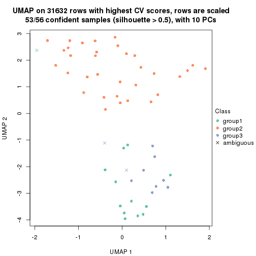</p>

</div>
<div id='tab-CV-pam-dimension-reduction-3'>
<pre><code class="r">dimension_reduction(res, k = 4, method = &quot;UMAP&quot;)
</code></pre>

<p>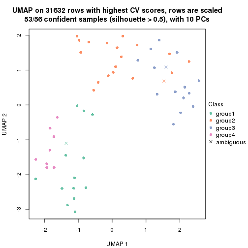</p>

</div>
<div id='tab-CV-pam-dimension-reduction-4'>
<pre><code class="r">dimension_reduction(res, k = 5, method = &quot;UMAP&quot;)
</code></pre>

<p>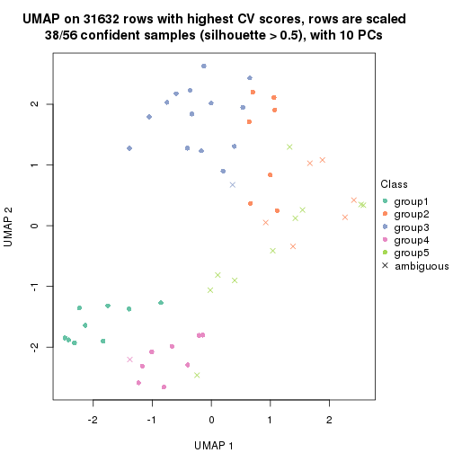</p>

</div>
<div id='tab-CV-pam-dimension-reduction-5'>
<pre><code class="r">dimension_reduction(res, k = 6, method = &quot;UMAP&quot;)
</code></pre>

<p>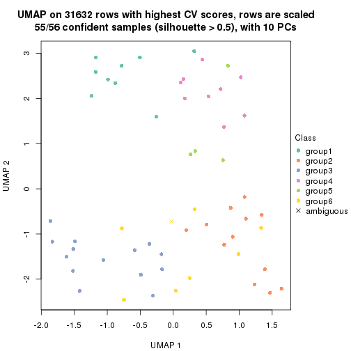</p>

</div>
</div>


Following heatmap shows how subgroups are split when increasing `k`:

```r
collect_classes(res)
```

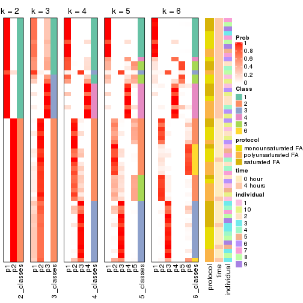


Test correlation between subgroups and known annotations. If the known
annotation is numeric, one-way ANOVA test is applied, and if the known
annotation is discrete, chi-squared contingency table test is applied.

```r
test_to_known_factors(res)
```

```
#>         n protocol(p)  time(p) individual(p) k
#> CV:pam 56       0.937 2.29e-09        0.9502 2
#> CV:pam 53       0.489 1.54e-08        0.5557 3
#> CV:pam 53       0.526 1.59e-07        0.0312 4
#> CV:pam 38       0.605 1.54e-05        0.0278 5
#> CV:pam 55       0.824 3.03e-07        0.0193 6
```


If matrix rows can be associated to genes, consider to use `functional_enrichment(res,
...)` to perform function enrichment for the signature genes. See [this vignette](http://bioconductor.org/packages/devel/bioc/vignettes/cola/inst/doc/functional_enrichment.html) for more detailed explanations.


 

---------------------------------------------------


### CV:mclust**


The object with results only for a single top-value method and a single partition method 
can be extracted as:

```r
res = res_list["CV", "mclust"]
# you can also extract it by
# res = res_list["CV:mclust"]
```

A summary of `res` and all the functions that can be applied to it:

```r
res
```

```
#> A 'ConsensusPartition' object with k = 2, 3, 4, 5, 6.
#>   On a matrix with 31632 rows and 56 columns.
#>   Top rows (1000, 2000, 3000, 4000, 5000) are extracted by 'CV' method.
#>   Subgroups are detected by 'mclust' method.
#>   Performed in total 1250 partitions by row resampling.
#>   Best k for subgroups seems to be 2.
#> 
#> Following methods can be applied to this 'ConsensusPartition' object:
#>  [1] "cola_report"             "collect_classes"         "collect_plots"          
#>  [4] "collect_stats"           "colnames"                "compare_signatures"     
#>  [7] "consensus_heatmap"       "dimension_reduction"     "functional_enrichment"  
#> [10] "get_anno_col"            "get_anno"                "get_classes"            
#> [13] "get_consensus"           "get_matrix"              "get_membership"         
#> [16] "get_param"               "get_signatures"          "get_stats"              
#> [19] "is_best_k"               "is_stable_k"             "membership_heatmap"     
#> [22] "ncol"                    "nrow"                    "plot_ecdf"              
#> [25] "rownames"                "select_partition_number" "show"                   
#> [28] "suggest_best_k"          "test_to_known_factors"
```

`collect_plots()` function collects all the plots made from `res` for all `k` (number of partitions)
into one single page to provide an easy and fast comparison between different `k`.

```r
collect_plots(res)
```

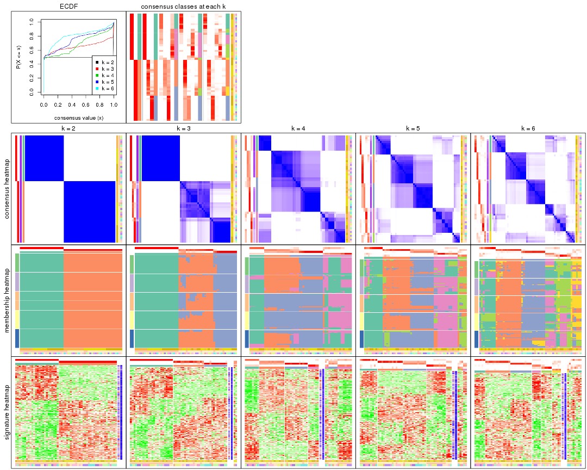

The plots are:

- The first row: a plot of the ECDF (empirical cumulative distribution
  function) curves of the consensus matrix for each `k` and the heatmap of
  predicted classes for each `k`.
- The second row: heatmaps of the consensus matrix for each `k`.
- The third row: heatmaps of the membership matrix for each `k`.
- The fouth row: heatmaps of the signatures for each `k`.

All the plots in panels can be made by individual functions and they are
plotted later in this section.

`select_partition_number()` produces several plots showing different
statistics for choosing "optimized" `k`. There are following statistics:

- ECDF curves of the consensus matrix for each `k`;
- 1-PAC. [The PAC
  score](https://en.wikipedia.org/wiki/Consensus_clustering#Over-interpretation_potential_of_consensus_clustering)
  measures the proportion of the ambiguous subgrouping.
- Mean silhouette score.
- Concordance. The mean probability of fiting the consensus class ids in all
  partitions.
- Area increased. Denote $A_k$ as the area under the ECDF curve for current
  `k`, the area increased is defined as $A_k - A_{k-1}$.
- Rand index. The percent of pairs of samples that are both in a same cluster
  or both are not in a same cluster in the partition of k and k-1.
- Jaccard index. The ratio of pairs of samples are both in a same cluster in
  the partition of k and k-1 and the pairs of samples are both in a same
  cluster in the partition k or k-1.

The detailed explanations of these statistics can be found in [the _cola_
vignette](http://bioconductor.org/packages/devel/bioc/vignettes/cola/inst/doc/cola.html#toc_13).

Generally speaking, lower PAC score, higher mean silhouette score or higher
concordance corresponds to better partition. Rand index and Jaccard index
measure how similar the current partition is compared to partition with `k-1`.
If they are too similar, we won't accept `k` is better than `k-1`.

```r
select_partition_number(res)
```

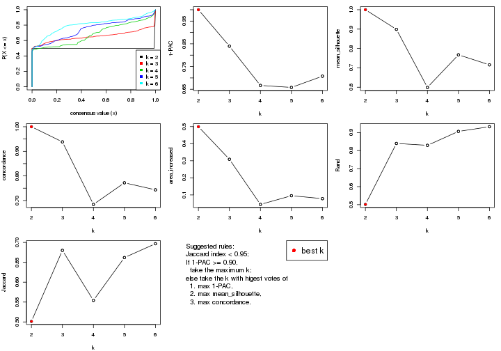

The numeric values for all these statistics can be obtained by `get_stats()`.

```r
get_stats(res)
```

```
#>   k 1-PAC mean_silhouette concordance area_increased  Rand Jaccard
#> 2 2 1.000           1.000       1.000         0.4992 0.501   0.501
#> 3 3 0.840           0.899       0.938         0.3087 0.840   0.680
#> 4 4 0.667           0.599       0.684         0.0445 0.829   0.554
#> 5 5 0.658           0.767       0.772         0.0955 0.906   0.662
#> 6 6 0.708           0.716       0.743         0.0783 0.932   0.697
```

`suggest_best_k()` suggests the best $k$ based on these statistics. The rules are as follows:

- All $k$ with Jaccard index larger than 0.95 are removed because increasing
  $k$ does not provide enough extra information. If all $k$ are removed, it is
  marked as no subgroup is detected.
- For all $k$ with 1-PAC score larger than 0.9, the maximal $k$ is taken as
  the best $k$, and other $k$ are marked as optional $k$.
- If it does not fit the second rule. The $k$ with the maximal vote of the
  highest 1-PAC score, highest mean silhouette, and highest concordance is
  taken as the best $k$.

```r
suggest_best_k(res)
```

```
#> [1] 2
```


Following shows the table of the partitions (You need to click the **show/hide
code output** link to see it). The membership matrix (columns with name `p*`)
is inferred by
[`clue::cl_consensus()`](https://www.rdocumentation.org/link/cl_consensus?package=clue)
function with the `SE` method. Basically the value in the membership matrix
represents the probability to belong to a certain group. The finall class
label for an item is determined with the group with highest probability it
belongs to.

In `get_classes()` function, the entropy is calculated from the membership
matrix and the silhouette score is calculated from the consensus matrix.


<script>
$( function() {
	$( '#tabs-CV-mclust-get-classes' ).tabs();
} );
</script>
<div id='tabs-CV-mclust-get-classes'>
<ul>
<li><a href='#tab-CV-mclust-get-classes-1'>k = 2</a></li>
<li><a href='#tab-CV-mclust-get-classes-2'>k = 3</a></li>
<li><a href='#tab-CV-mclust-get-classes-3'>k = 4</a></li>
<li><a href='#tab-CV-mclust-get-classes-4'>k = 5</a></li>
<li><a href='#tab-CV-mclust-get-classes-5'>k = 6</a></li>
</ul>

<div id='tab-CV-mclust-get-classes-1'>
<p><a id='tab-CV-mclust-get-classes-1-a' style='color:#0366d6' href='#'>show/hide code output</a></p>
<pre><code class="r">cbind(get_classes(res, k = 2), get_membership(res, k = 2))
</code></pre>

<pre><code>#&gt;           class entropy silhouette p1 p2
#&gt; GSM790742     2       0          1  0  1
#&gt; GSM790744     2       0          1  0  1
#&gt; GSM790754     2       0          1  0  1
#&gt; GSM790756     2       0          1  0  1
#&gt; GSM790768     2       0          1  0  1
#&gt; GSM790774     2       0          1  0  1
#&gt; GSM790778     2       0          1  0  1
#&gt; GSM790784     2       0          1  0  1
#&gt; GSM790790     2       0          1  0  1
#&gt; GSM790743     1       0          1  1  0
#&gt; GSM790745     1       0          1  1  0
#&gt; GSM790755     1       0          1  1  0
#&gt; GSM790757     1       0          1  1  0
#&gt; GSM790769     1       0          1  1  0
#&gt; GSM790775     1       0          1  1  0
#&gt; GSM790779     1       0          1  1  0
#&gt; GSM790785     1       0          1  1  0
#&gt; GSM790791     1       0          1  1  0
#&gt; GSM790738     2       0          1  0  1
#&gt; GSM790746     2       0          1  0  1
#&gt; GSM790752     2       0          1  0  1
#&gt; GSM790758     2       0          1  0  1
#&gt; GSM790764     2       0          1  0  1
#&gt; GSM790766     2       0          1  0  1
#&gt; GSM790772     2       0          1  0  1
#&gt; GSM790782     2       0          1  0  1
#&gt; GSM790786     2       0          1  0  1
#&gt; GSM790792     2       0          1  0  1
#&gt; GSM790739     1       0          1  1  0
#&gt; GSM790747     1       0          1  1  0
#&gt; GSM790753     1       0          1  1  0
#&gt; GSM790759     2       0          1  0  1
#&gt; GSM790765     2       0          1  0  1
#&gt; GSM790767     1       0          1  1  0
#&gt; GSM790773     1       0          1  1  0
#&gt; GSM790783     1       0          1  1  0
#&gt; GSM790787     1       0          1  1  0
#&gt; GSM790793     1       0          1  1  0
#&gt; GSM790740     2       0          1  0  1
#&gt; GSM790748     2       0          1  0  1
#&gt; GSM790750     2       0          1  0  1
#&gt; GSM790760     2       0          1  0  1
#&gt; GSM790762     2       0          1  0  1
#&gt; GSM790770     2       0          1  0  1
#&gt; GSM790776     2       0          1  0  1
#&gt; GSM790780     2       0          1  0  1
#&gt; GSM790788     2       0          1  0  1
#&gt; GSM790741     2       0          1  0  1
#&gt; GSM790749     1       0          1  1  0
#&gt; GSM790751     2       0          1  0  1
#&gt; GSM790761     1       0          1  1  0
#&gt; GSM790763     1       0          1  1  0
#&gt; GSM790771     1       0          1  1  0
#&gt; GSM790777     1       0          1  1  0
#&gt; GSM790781     1       0          1  1  0
#&gt; GSM790789     1       0          1  1  0
</code></pre>

<script>
$('#tab-CV-mclust-get-classes-1-a').parent().next().next().hide();
$('#tab-CV-mclust-get-classes-1-a').click(function(){
  $('#tab-CV-mclust-get-classes-1-a').parent().next().next().toggle();
  return(false);
});
</script>
</div>

<div id='tab-CV-mclust-get-classes-2'>
<p><a id='tab-CV-mclust-get-classes-2-a' style='color:#0366d6' href='#'>show/hide code output</a></p>
<pre><code class="r">cbind(get_classes(res, k = 3), get_membership(res, k = 3))
</code></pre>

<pre><code>#&gt;           class entropy silhouette p1    p2    p3
#&gt; GSM790742     2  0.4062      0.828  0 0.836 0.164
#&gt; GSM790744     2  0.2625      0.847  0 0.916 0.084
#&gt; GSM790754     3  0.0000      0.956  0 0.000 1.000
#&gt; GSM790756     3  0.3619      0.791  0 0.136 0.864
#&gt; GSM790768     2  0.2959      0.848  0 0.900 0.100
#&gt; GSM790774     3  0.0592      0.945  0 0.012 0.988
#&gt; GSM790778     3  0.0000      0.956  0 0.000 1.000
#&gt; GSM790784     3  0.0000      0.956  0 0.000 1.000
#&gt; GSM790790     2  0.0424      0.828  0 0.992 0.008
#&gt; GSM790743     1  0.0000      1.000  1 0.000 0.000
#&gt; GSM790745     1  0.0000      1.000  1 0.000 0.000
#&gt; GSM790755     1  0.0000      1.000  1 0.000 0.000
#&gt; GSM790757     1  0.0000      1.000  1 0.000 0.000
#&gt; GSM790769     1  0.0000      1.000  1 0.000 0.000
#&gt; GSM790775     1  0.0000      1.000  1 0.000 0.000
#&gt; GSM790779     1  0.0000      1.000  1 0.000 0.000
#&gt; GSM790785     1  0.0000      1.000  1 0.000 0.000
#&gt; GSM790791     1  0.0000      1.000  1 0.000 0.000
#&gt; GSM790738     2  0.0747      0.832  0 0.984 0.016
#&gt; GSM790746     2  0.2448      0.846  0 0.924 0.076
#&gt; GSM790752     3  0.0000      0.956  0 0.000 1.000
#&gt; GSM790758     3  0.0000      0.956  0 0.000 1.000
#&gt; GSM790764     2  0.6309      0.313  0 0.504 0.496
#&gt; GSM790766     2  0.6235      0.483  0 0.564 0.436
#&gt; GSM790772     2  0.4842      0.777  0 0.776 0.224
#&gt; GSM790782     3  0.0000      0.956  0 0.000 1.000
#&gt; GSM790786     3  0.0000      0.956  0 0.000 1.000
#&gt; GSM790792     2  0.0592      0.830  0 0.988 0.012
#&gt; GSM790739     1  0.0000      1.000  1 0.000 0.000
#&gt; GSM790747     1  0.0000      1.000  1 0.000 0.000
#&gt; GSM790753     1  0.0000      1.000  1 0.000 0.000
#&gt; GSM790759     2  0.2625      0.847  0 0.916 0.084
#&gt; GSM790765     3  0.0000      0.956  0 0.000 1.000
#&gt; GSM790767     1  0.0000      1.000  1 0.000 0.000
#&gt; GSM790773     1  0.0000      1.000  1 0.000 0.000
#&gt; GSM790783     1  0.0000      1.000  1 0.000 0.000
#&gt; GSM790787     1  0.0000      1.000  1 0.000 0.000
#&gt; GSM790793     1  0.0000      1.000  1 0.000 0.000
#&gt; GSM790740     2  0.0592      0.830  0 0.988 0.012
#&gt; GSM790748     2  0.4504      0.815  0 0.804 0.196
#&gt; GSM790750     3  0.0000      0.956  0 0.000 1.000
#&gt; GSM790760     2  0.6168      0.531  0 0.588 0.412
#&gt; GSM790762     2  0.1643      0.839  0 0.956 0.044
#&gt; GSM790770     2  0.3412      0.848  0 0.876 0.124
#&gt; GSM790776     2  0.5706      0.687  0 0.680 0.320
#&gt; GSM790780     3  0.0000      0.956  0 0.000 1.000
#&gt; GSM790788     2  0.3116      0.840  0 0.892 0.108
#&gt; GSM790741     2  0.3619      0.828  0 0.864 0.136
#&gt; GSM790749     1  0.0000      1.000  1 0.000 0.000
#&gt; GSM790751     3  0.5138      0.537  0 0.252 0.748
#&gt; GSM790761     1  0.0000      1.000  1 0.000 0.000
#&gt; GSM790763     1  0.0000      1.000  1 0.000 0.000
#&gt; GSM790771     1  0.0000      1.000  1 0.000 0.000
#&gt; GSM790777     1  0.0000      1.000  1 0.000 0.000
#&gt; GSM790781     1  0.0000      1.000  1 0.000 0.000
#&gt; GSM790789     1  0.0000      1.000  1 0.000 0.000
</code></pre>

<script>
$('#tab-CV-mclust-get-classes-2-a').parent().next().next().hide();
$('#tab-CV-mclust-get-classes-2-a').click(function(){
  $('#tab-CV-mclust-get-classes-2-a').parent().next().next().toggle();
  return(false);
});
</script>
</div>

<div id='tab-CV-mclust-get-classes-3'>
<p><a id='tab-CV-mclust-get-classes-3-a' style='color:#0366d6' href='#'>show/hide code output</a></p>
<pre><code class="r">cbind(get_classes(res, k = 4), get_membership(res, k = 4))
</code></pre>

<pre><code>#&gt;           class entropy silhouette    p1    p2    p3    p4
#&gt; GSM790742     3  0.7679    -0.4569 0.176 0.340 0.476 0.008
#&gt; GSM790744     2  0.4933     0.9120 0.000 0.568 0.432 0.000
#&gt; GSM790754     3  0.0000     0.7426 0.000 0.000 1.000 0.000
#&gt; GSM790756     3  0.2868     0.5628 0.000 0.136 0.864 0.000
#&gt; GSM790768     2  0.4933     0.9120 0.000 0.568 0.432 0.000
#&gt; GSM790774     3  0.0921     0.7200 0.000 0.028 0.972 0.000
#&gt; GSM790778     3  0.0000     0.7426 0.000 0.000 1.000 0.000
#&gt; GSM790784     3  0.0000     0.7426 0.000 0.000 1.000 0.000
#&gt; GSM790790     2  0.4761     0.8989 0.000 0.628 0.372 0.000
#&gt; GSM790743     4  0.3444     0.5089 0.184 0.000 0.000 0.816
#&gt; GSM790745     4  0.0469     0.5638 0.012 0.000 0.000 0.988
#&gt; GSM790755     4  0.7774     0.2489 0.240 0.372 0.000 0.388
#&gt; GSM790757     4  0.0469     0.5638 0.012 0.000 0.000 0.988
#&gt; GSM790769     4  0.4585     0.3705 0.332 0.000 0.000 0.668
#&gt; GSM790775     1  0.3801     0.9880 0.780 0.000 0.000 0.220
#&gt; GSM790779     1  0.3801     0.9880 0.780 0.000 0.000 0.220
#&gt; GSM790785     1  0.3801     0.9880 0.780 0.000 0.000 0.220
#&gt; GSM790791     4  0.4605     0.3715 0.336 0.000 0.000 0.664
#&gt; GSM790738     2  0.4761     0.8989 0.000 0.628 0.372 0.000
#&gt; GSM790746     2  0.5039     0.9142 0.004 0.592 0.404 0.000
#&gt; GSM790752     3  0.0000     0.7426 0.000 0.000 1.000 0.000
#&gt; GSM790758     3  0.0000     0.7426 0.000 0.000 1.000 0.000
#&gt; GSM790764     3  0.6170    -0.2984 0.068 0.332 0.600 0.000
#&gt; GSM790766     2  0.5273     0.8808 0.008 0.536 0.456 0.000
#&gt; GSM790772     2  0.4977     0.8798 0.000 0.540 0.460 0.000
#&gt; GSM790782     3  0.0000     0.7426 0.000 0.000 1.000 0.000
#&gt; GSM790786     3  0.0000     0.7426 0.000 0.000 1.000 0.000
#&gt; GSM790792     2  0.4761     0.8989 0.000 0.628 0.372 0.000
#&gt; GSM790739     4  0.0336     0.5640 0.008 0.000 0.000 0.992
#&gt; GSM790747     4  0.4605     0.3689 0.336 0.000 0.000 0.664
#&gt; GSM790753     1  0.3873     0.9827 0.772 0.000 0.000 0.228
#&gt; GSM790759     2  0.4972     0.8864 0.000 0.544 0.456 0.000
#&gt; GSM790765     3  0.0000     0.7426 0.000 0.000 1.000 0.000
#&gt; GSM790767     4  0.4643     0.3589 0.344 0.000 0.000 0.656
#&gt; GSM790773     1  0.3801     0.9880 0.780 0.000 0.000 0.220
#&gt; GSM790783     1  0.4220     0.9579 0.748 0.004 0.000 0.248
#&gt; GSM790787     1  0.3801     0.9880 0.780 0.000 0.000 0.220
#&gt; GSM790793     4  0.0469     0.5638 0.012 0.000 0.000 0.988
#&gt; GSM790740     2  0.4817     0.9093 0.000 0.612 0.388 0.000
#&gt; GSM790748     3  0.7335    -0.4671 0.168 0.344 0.488 0.000
#&gt; GSM790750     3  0.0000     0.7426 0.000 0.000 1.000 0.000
#&gt; GSM790760     3  0.7375    -0.4517 0.176 0.336 0.488 0.000
#&gt; GSM790762     2  0.4761     0.8989 0.000 0.628 0.372 0.000
#&gt; GSM790770     2  0.4941     0.9086 0.000 0.564 0.436 0.000
#&gt; GSM790776     3  0.6121    -0.5281 0.052 0.396 0.552 0.000
#&gt; GSM790780     3  0.0000     0.7426 0.000 0.000 1.000 0.000
#&gt; GSM790788     2  0.5846     0.8706 0.032 0.592 0.372 0.004
#&gt; GSM790741     2  0.4967     0.8924 0.000 0.548 0.452 0.000
#&gt; GSM790749     4  0.4994     0.3707 0.480 0.000 0.000 0.520
#&gt; GSM790751     3  0.2222     0.6746 0.016 0.060 0.924 0.000
#&gt; GSM790761     4  0.3266     0.5164 0.168 0.000 0.000 0.832
#&gt; GSM790763     4  0.4866    -0.1075 0.404 0.000 0.000 0.596
#&gt; GSM790771     4  0.4661     0.3576 0.348 0.000 0.000 0.652
#&gt; GSM790777     1  0.3907     0.9788 0.768 0.000 0.000 0.232
#&gt; GSM790781     4  0.5398    -0.0457 0.404 0.016 0.000 0.580
#&gt; GSM790789     4  0.4585     0.3729 0.332 0.000 0.000 0.668
</code></pre>

<script>
$('#tab-CV-mclust-get-classes-3-a').parent().next().next().hide();
$('#tab-CV-mclust-get-classes-3-a').click(function(){
  $('#tab-CV-mclust-get-classes-3-a').parent().next().next().toggle();
  return(false);
});
</script>
</div>

<div id='tab-CV-mclust-get-classes-4'>
<p><a id='tab-CV-mclust-get-classes-4-a' style='color:#0366d6' href='#'>show/hide code output</a></p>
<pre><code class="r">cbind(get_classes(res, k = 5), get_membership(res, k = 5))
</code></pre>

<pre><code>#&gt;           class entropy silhouette    p1    p2    p3    p4    p5
#&gt; GSM790742     5  0.4443     0.6700 0.000 0.300 0.008 0.012 0.680
#&gt; GSM790744     2  0.0671     0.8642 0.000 0.980 0.016 0.000 0.004
#&gt; GSM790754     3  0.4126     0.9537 0.000 0.380 0.620 0.000 0.000
#&gt; GSM790756     3  0.4305     0.7813 0.000 0.488 0.512 0.000 0.000
#&gt; GSM790768     2  0.0404     0.8657 0.000 0.988 0.012 0.000 0.000
#&gt; GSM790774     3  0.4150     0.9548 0.000 0.388 0.612 0.000 0.000
#&gt; GSM790778     3  0.4138     0.9557 0.000 0.384 0.616 0.000 0.000
#&gt; GSM790784     3  0.4138     0.9546 0.000 0.384 0.616 0.000 0.000
#&gt; GSM790790     2  0.0162     0.8729 0.000 0.996 0.000 0.000 0.004
#&gt; GSM790743     4  0.6141     0.4359 0.008 0.000 0.368 0.516 0.108
#&gt; GSM790745     4  0.0000     0.7557 0.000 0.000 0.000 1.000 0.000
#&gt; GSM790755     5  0.5757     0.2691 0.008 0.000 0.216 0.136 0.640
#&gt; GSM790757     4  0.0000     0.7557 0.000 0.000 0.000 1.000 0.000
#&gt; GSM790769     4  0.4879     0.7695 0.156 0.000 0.012 0.740 0.092
#&gt; GSM790775     1  0.0955     0.8567 0.968 0.000 0.000 0.028 0.004
#&gt; GSM790779     1  0.2351     0.8277 0.896 0.000 0.000 0.088 0.016
#&gt; GSM790785     1  0.0404     0.8622 0.988 0.000 0.000 0.012 0.000
#&gt; GSM790791     4  0.3759     0.7486 0.220 0.000 0.000 0.764 0.016
#&gt; GSM790738     2  0.0162     0.8729 0.000 0.996 0.000 0.000 0.004
#&gt; GSM790746     2  0.0609     0.8665 0.000 0.980 0.000 0.000 0.020
#&gt; GSM790752     3  0.4150     0.9540 0.000 0.388 0.612 0.000 0.000
#&gt; GSM790758     3  0.4114     0.9525 0.000 0.376 0.624 0.000 0.000
#&gt; GSM790764     5  0.6492     0.3796 0.000 0.348 0.196 0.000 0.456
#&gt; GSM790766     2  0.2278     0.7933 0.000 0.908 0.060 0.000 0.032
#&gt; GSM790772     2  0.1043     0.8396 0.000 0.960 0.040 0.000 0.000
#&gt; GSM790782     3  0.4150     0.9548 0.000 0.388 0.612 0.000 0.000
#&gt; GSM790786     3  0.4138     0.9546 0.000 0.384 0.616 0.000 0.000
#&gt; GSM790792     2  0.0162     0.8729 0.000 0.996 0.000 0.000 0.004
#&gt; GSM790739     4  0.0451     0.7569 0.004 0.000 0.000 0.988 0.008
#&gt; GSM790747     4  0.4773     0.7705 0.156 0.000 0.012 0.748 0.084
#&gt; GSM790753     1  0.0324     0.8614 0.992 0.000 0.000 0.004 0.004
#&gt; GSM790759     2  0.3596     0.5369 0.000 0.776 0.012 0.000 0.212
#&gt; GSM790765     3  0.4114     0.9525 0.000 0.376 0.624 0.000 0.000
#&gt; GSM790767     4  0.3759     0.7486 0.220 0.000 0.000 0.764 0.016
#&gt; GSM790773     1  0.0566     0.8616 0.984 0.000 0.000 0.012 0.004
#&gt; GSM790783     1  0.4535     0.6580 0.748 0.000 0.000 0.160 0.092
#&gt; GSM790787     1  0.0324     0.8614 0.992 0.000 0.000 0.004 0.004
#&gt; GSM790793     4  0.0579     0.7578 0.008 0.000 0.000 0.984 0.008
#&gt; GSM790740     2  0.0162     0.8729 0.000 0.996 0.000 0.000 0.004
#&gt; GSM790748     5  0.4029     0.6630 0.000 0.316 0.004 0.000 0.680
#&gt; GSM790750     3  0.4138     0.9557 0.000 0.384 0.616 0.000 0.000
#&gt; GSM790760     5  0.4989     0.6557 0.000 0.296 0.056 0.000 0.648
#&gt; GSM790762     2  0.0162     0.8729 0.000 0.996 0.000 0.000 0.004
#&gt; GSM790770     2  0.0510     0.8657 0.000 0.984 0.000 0.000 0.016
#&gt; GSM790776     2  0.5353     0.0558 0.000 0.576 0.064 0.000 0.360
#&gt; GSM790780     3  0.4114     0.9496 0.000 0.376 0.624 0.000 0.000
#&gt; GSM790788     2  0.2674     0.7429 0.000 0.868 0.000 0.012 0.120
#&gt; GSM790741     2  0.3988     0.5774 0.000 0.768 0.036 0.000 0.196
#&gt; GSM790749     4  0.6414     0.7427 0.156 0.000 0.112 0.644 0.088
#&gt; GSM790751     3  0.5115     0.6946 0.000 0.480 0.484 0.000 0.036
#&gt; GSM790761     4  0.6005     0.4887 0.008 0.000 0.332 0.556 0.104
#&gt; GSM790763     1  0.4380     0.5500 0.616 0.000 0.000 0.376 0.008
#&gt; GSM790771     4  0.6414     0.7427 0.156 0.000 0.112 0.644 0.088
#&gt; GSM790777     1  0.0324     0.8614 0.992 0.000 0.000 0.004 0.004
#&gt; GSM790781     1  0.6026     0.5466 0.580 0.000 0.000 0.228 0.192
#&gt; GSM790789     4  0.4718     0.7709 0.156 0.000 0.012 0.752 0.080
</code></pre>

<script>
$('#tab-CV-mclust-get-classes-4-a').parent().next().next().hide();
$('#tab-CV-mclust-get-classes-4-a').click(function(){
  $('#tab-CV-mclust-get-classes-4-a').parent().next().next().toggle();
  return(false);
});
</script>
</div>

<div id='tab-CV-mclust-get-classes-5'>
<p><a id='tab-CV-mclust-get-classes-5-a' style='color:#0366d6' href='#'>show/hide code output</a></p>
<pre><code class="r">cbind(get_classes(res, k = 6), get_membership(res, k = 6))
</code></pre>

<pre><code>#&gt;           class entropy silhouette    p1    p2    p3    p4    p5    p6
#&gt; GSM790742     6  0.6614     0.5954 0.000 0.272 0.016 0.124 0.060 0.528
#&gt; GSM790744     2  0.1327     0.9138 0.000 0.936 0.064 0.000 0.000 0.000
#&gt; GSM790754     3  0.1807     0.8984 0.000 0.020 0.920 0.060 0.000 0.000
#&gt; GSM790756     3  0.3486     0.7823 0.000 0.128 0.812 0.052 0.000 0.008
#&gt; GSM790768     2  0.1387     0.9131 0.000 0.932 0.068 0.000 0.000 0.000
#&gt; GSM790774     3  0.1485     0.9033 0.000 0.028 0.944 0.024 0.000 0.004
#&gt; GSM790778     3  0.1261     0.9065 0.000 0.024 0.952 0.024 0.000 0.000
#&gt; GSM790784     3  0.1003     0.9113 0.000 0.028 0.964 0.004 0.000 0.004
#&gt; GSM790790     2  0.1141     0.9137 0.000 0.948 0.052 0.000 0.000 0.000
#&gt; GSM790743     5  0.5594     0.5908 0.004 0.024 0.004 0.252 0.620 0.096
#&gt; GSM790745     5  0.0000     0.6456 0.000 0.000 0.000 0.000 1.000 0.000
#&gt; GSM790755     6  0.5638     0.1950 0.008 0.012 0.008 0.184 0.148 0.640
#&gt; GSM790757     5  0.0260     0.6444 0.000 0.000 0.000 0.008 0.992 0.000
#&gt; GSM790769     4  0.5079     0.9423 0.148 0.000 0.000 0.628 0.224 0.000
#&gt; GSM790775     1  0.2981     0.7096 0.856 0.008 0.000 0.100 0.032 0.004
#&gt; GSM790779     1  0.4203     0.4321 0.720 0.000 0.000 0.056 0.220 0.004
#&gt; GSM790785     1  0.1493     0.7516 0.936 0.004 0.000 0.056 0.000 0.004
#&gt; GSM790791     5  0.6052    -0.4234 0.364 0.000 0.000 0.256 0.380 0.000
#&gt; GSM790738     2  0.1141     0.9137 0.000 0.948 0.052 0.000 0.000 0.000
#&gt; GSM790746     2  0.2905     0.8783 0.000 0.852 0.084 0.000 0.000 0.064
#&gt; GSM790752     3  0.1668     0.8934 0.000 0.008 0.928 0.060 0.000 0.004
#&gt; GSM790758     3  0.1757     0.8939 0.000 0.012 0.928 0.052 0.000 0.008
#&gt; GSM790764     6  0.5534     0.5144 0.000 0.072 0.300 0.040 0.000 0.588
#&gt; GSM790766     2  0.4283     0.7125 0.000 0.724 0.180 0.000 0.000 0.096
#&gt; GSM790772     2  0.2234     0.8786 0.000 0.872 0.124 0.004 0.000 0.000
#&gt; GSM790782     3  0.1405     0.9053 0.000 0.024 0.948 0.024 0.000 0.004
#&gt; GSM790786     3  0.1321     0.9069 0.000 0.024 0.952 0.020 0.000 0.004
#&gt; GSM790792     2  0.1141     0.9137 0.000 0.948 0.052 0.000 0.000 0.000
#&gt; GSM790739     5  0.1644     0.6348 0.028 0.000 0.000 0.040 0.932 0.000
#&gt; GSM790747     4  0.5056     0.9429 0.148 0.000 0.000 0.632 0.220 0.000
#&gt; GSM790753     1  0.0260     0.7547 0.992 0.000 0.000 0.008 0.000 0.000
#&gt; GSM790759     2  0.3211     0.7923 0.000 0.824 0.056 0.000 0.000 0.120
#&gt; GSM790765     3  0.1168     0.9109 0.000 0.028 0.956 0.016 0.000 0.000
#&gt; GSM790767     1  0.6068    -0.2870 0.456 0.004 0.000 0.272 0.268 0.000
#&gt; GSM790773     1  0.1897     0.7440 0.908 0.004 0.000 0.084 0.000 0.004
#&gt; GSM790783     1  0.4780     0.0686 0.552 0.000 0.000 0.392 0.056 0.000
#&gt; GSM790787     1  0.0000     0.7550 1.000 0.000 0.000 0.000 0.000 0.000
#&gt; GSM790793     5  0.1644     0.6348 0.028 0.000 0.000 0.040 0.932 0.000
#&gt; GSM790740     2  0.1858     0.9028 0.000 0.904 0.092 0.000 0.000 0.004
#&gt; GSM790748     6  0.4227     0.6499 0.000 0.256 0.052 0.000 0.000 0.692
#&gt; GSM790750     3  0.1625     0.8957 0.000 0.012 0.928 0.060 0.000 0.000
#&gt; GSM790760     6  0.4425     0.6937 0.000 0.132 0.152 0.000 0.000 0.716
#&gt; GSM790762     2  0.1141     0.9137 0.000 0.948 0.052 0.000 0.000 0.000
#&gt; GSM790770     2  0.1682     0.9099 0.000 0.928 0.052 0.000 0.000 0.020
#&gt; GSM790776     6  0.6263     0.6055 0.000 0.236 0.192 0.040 0.000 0.532
#&gt; GSM790780     3  0.1426     0.9098 0.000 0.028 0.948 0.008 0.000 0.016
#&gt; GSM790788     2  0.4631     0.7632 0.000 0.780 0.052 0.064 0.044 0.060
#&gt; GSM790741     2  0.2361     0.8879 0.000 0.884 0.088 0.000 0.000 0.028
#&gt; GSM790749     4  0.5072     0.9093 0.140 0.008 0.000 0.672 0.176 0.004
#&gt; GSM790751     3  0.5214     0.4565 0.000 0.056 0.660 0.056 0.000 0.228
#&gt; GSM790761     5  0.5572     0.5901 0.004 0.024 0.004 0.256 0.620 0.092
#&gt; GSM790763     5  0.5042     0.4728 0.288 0.000 0.000 0.108 0.604 0.000
#&gt; GSM790771     4  0.4701     0.9179 0.148 0.000 0.000 0.684 0.168 0.000
#&gt; GSM790777     1  0.0547     0.7574 0.980 0.000 0.000 0.020 0.000 0.000
#&gt; GSM790781     5  0.7358     0.3170 0.240 0.008 0.000 0.112 0.428 0.212
#&gt; GSM790789     4  0.5080     0.9346 0.140 0.000 0.000 0.624 0.236 0.000
</code></pre>

<script>
$('#tab-CV-mclust-get-classes-5-a').parent().next().next().hide();
$('#tab-CV-mclust-get-classes-5-a').click(function(){
  $('#tab-CV-mclust-get-classes-5-a').parent().next().next().toggle();
  return(false);
});
</script>
</div>
</div>

Heatmaps for the consensus matrix. It visualizes the probability of two
samples to be in a same group.


<script>
$( function() {
	$( '#tabs-CV-mclust-consensus-heatmap' ).tabs();
} );
</script>
<div id='tabs-CV-mclust-consensus-heatmap'>
<ul>
<li><a href='#tab-CV-mclust-consensus-heatmap-1'>k = 2</a></li>
<li><a href='#tab-CV-mclust-consensus-heatmap-2'>k = 3</a></li>
<li><a href='#tab-CV-mclust-consensus-heatmap-3'>k = 4</a></li>
<li><a href='#tab-CV-mclust-consensus-heatmap-4'>k = 5</a></li>
<li><a href='#tab-CV-mclust-consensus-heatmap-5'>k = 6</a></li>
</ul>
<div id='tab-CV-mclust-consensus-heatmap-1'>
<pre><code class="r">consensus_heatmap(res, k = 2)
</code></pre>

<p>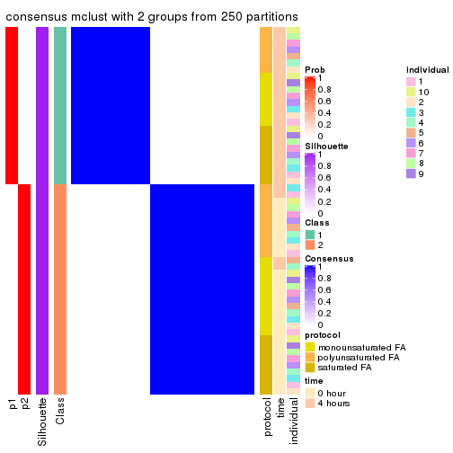</p>

</div>
<div id='tab-CV-mclust-consensus-heatmap-2'>
<pre><code class="r">consensus_heatmap(res, k = 3)
</code></pre>

<p>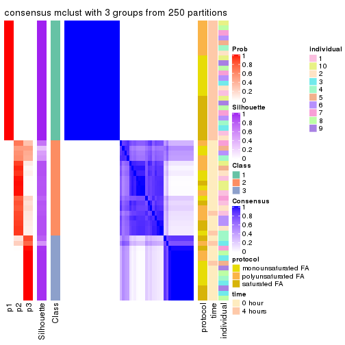</p>

</div>
<div id='tab-CV-mclust-consensus-heatmap-3'>
<pre><code class="r">consensus_heatmap(res, k = 4)
</code></pre>

<p>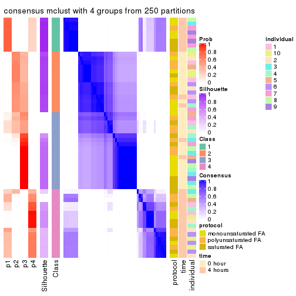</p>

</div>
<div id='tab-CV-mclust-consensus-heatmap-4'>
<pre><code class="r">consensus_heatmap(res, k = 5)
</code></pre>

<p>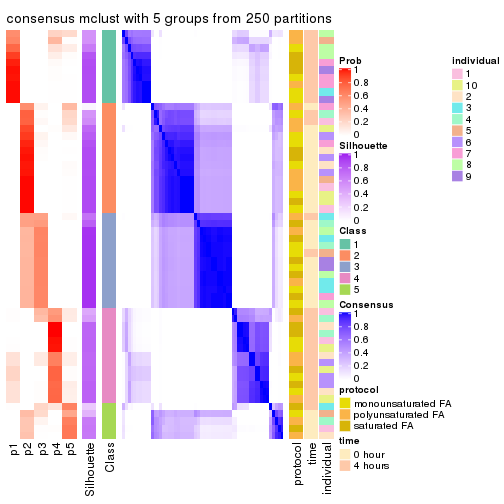</p>

</div>
<div id='tab-CV-mclust-consensus-heatmap-5'>
<pre><code class="r">consensus_heatmap(res, k = 6)
</code></pre>

<p>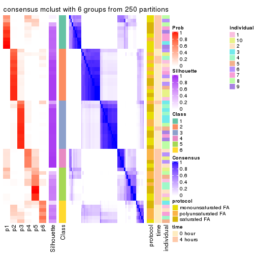</p>

</div>
</div>

Heatmaps for the membership of samples in all partitions to see how consistent they are:


<script>
$( function() {
	$( '#tabs-CV-mclust-membership-heatmap' ).tabs();
} );
</script>
<div id='tabs-CV-mclust-membership-heatmap'>
<ul>
<li><a href='#tab-CV-mclust-membership-heatmap-1'>k = 2</a></li>
<li><a href='#tab-CV-mclust-membership-heatmap-2'>k = 3</a></li>
<li><a href='#tab-CV-mclust-membership-heatmap-3'>k = 4</a></li>
<li><a href='#tab-CV-mclust-membership-heatmap-4'>k = 5</a></li>
<li><a href='#tab-CV-mclust-membership-heatmap-5'>k = 6</a></li>
</ul>
<div id='tab-CV-mclust-membership-heatmap-1'>
<pre><code class="r">membership_heatmap(res, k = 2)
</code></pre>

<p>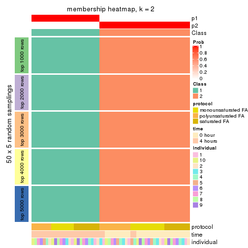</p>

</div>
<div id='tab-CV-mclust-membership-heatmap-2'>
<pre><code class="r">membership_heatmap(res, k = 3)
</code></pre>

<p>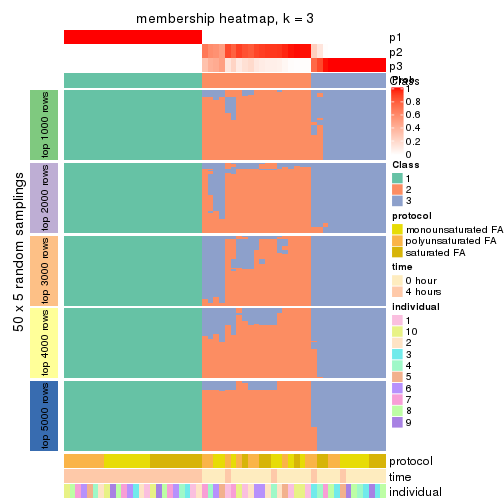</p>

</div>
<div id='tab-CV-mclust-membership-heatmap-3'>
<pre><code class="r">membership_heatmap(res, k = 4)
</code></pre>

<p>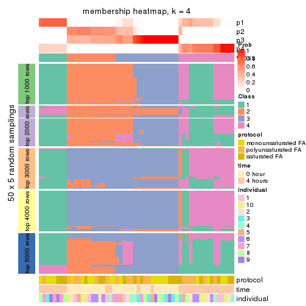</p>

</div>
<div id='tab-CV-mclust-membership-heatmap-4'>
<pre><code class="r">membership_heatmap(res, k = 5)
</code></pre>

<p>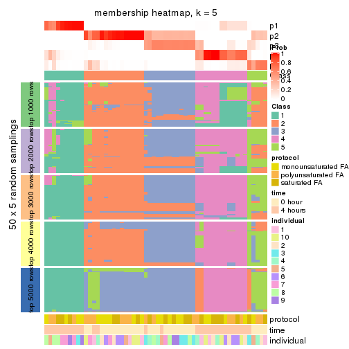</p>

</div>
<div id='tab-CV-mclust-membership-heatmap-5'>
<pre><code class="r">membership_heatmap(res, k = 6)
</code></pre>

<p>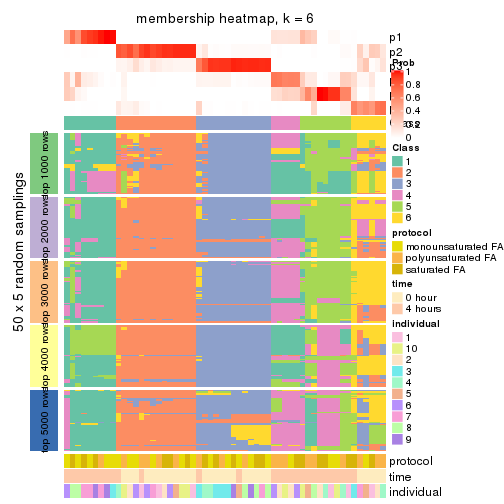</p>

</div>
</div>

As soon as we have had the classes for columns, we can look for signatures
which are significantly different between classes which can be candidate marks
for certain classes. Following are the heatmaps for signatures.


Signature heatmaps where rows are scaled:


<script>
$( function() {
	$( '#tabs-CV-mclust-get-signatures' ).tabs();
} );
</script>
<div id='tabs-CV-mclust-get-signatures'>
<ul>
<li><a href='#tab-CV-mclust-get-signatures-1'>k = 2</a></li>
<li><a href='#tab-CV-mclust-get-signatures-2'>k = 3</a></li>
<li><a href='#tab-CV-mclust-get-signatures-3'>k = 4</a></li>
<li><a href='#tab-CV-mclust-get-signatures-4'>k = 5</a></li>
<li><a href='#tab-CV-mclust-get-signatures-5'>k = 6</a></li>
</ul>
<div id='tab-CV-mclust-get-signatures-1'>
<pre><code class="r">get_signatures(res, k = 2)
</code></pre>

<p>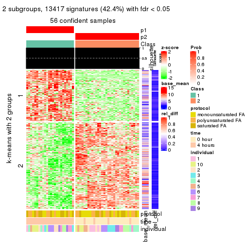</p>

</div>
<div id='tab-CV-mclust-get-signatures-2'>
<pre><code class="r">get_signatures(res, k = 3)
</code></pre>

<p>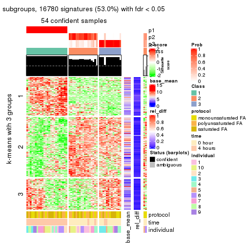</p>

</div>
<div id='tab-CV-mclust-get-signatures-3'>
<pre><code class="r">get_signatures(res, k = 4)
</code></pre>

<p>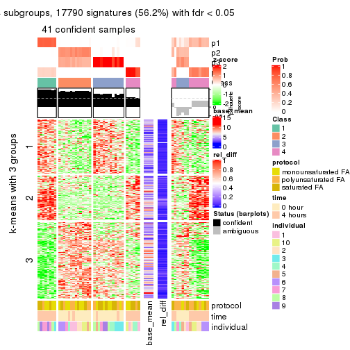</p>

</div>
<div id='tab-CV-mclust-get-signatures-4'>
<pre><code class="r">get_signatures(res, k = 5)
</code></pre>

<p>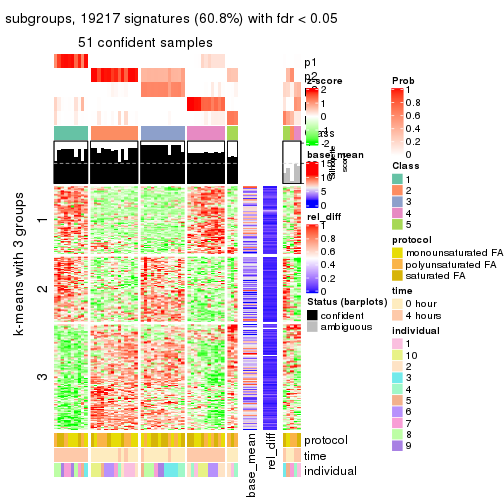</p>

</div>
<div id='tab-CV-mclust-get-signatures-5'>
<pre><code class="r">get_signatures(res, k = 6)
</code></pre>

<p>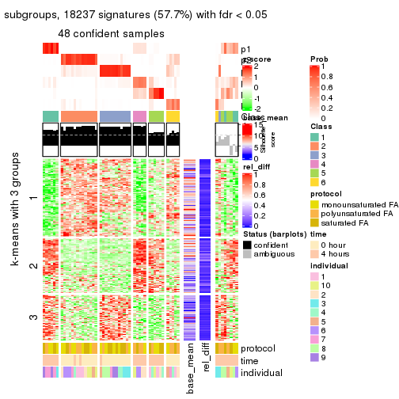</p>

</div>
</div>


Signature heatmaps where rows are not scaled:


<script>
$( function() {
	$( '#tabs-CV-mclust-get-signatures-no-scale' ).tabs();
} );
</script>
<div id='tabs-CV-mclust-get-signatures-no-scale'>
<ul>
<li><a href='#tab-CV-mclust-get-signatures-no-scale-1'>k = 2</a></li>
<li><a href='#tab-CV-mclust-get-signatures-no-scale-2'>k = 3</a></li>
<li><a href='#tab-CV-mclust-get-signatures-no-scale-3'>k = 4</a></li>
<li><a href='#tab-CV-mclust-get-signatures-no-scale-4'>k = 5</a></li>
<li><a href='#tab-CV-mclust-get-signatures-no-scale-5'>k = 6</a></li>
</ul>
<div id='tab-CV-mclust-get-signatures-no-scale-1'>
<pre><code class="r">get_signatures(res, k = 2, scale_rows = FALSE)
</code></pre>

<p>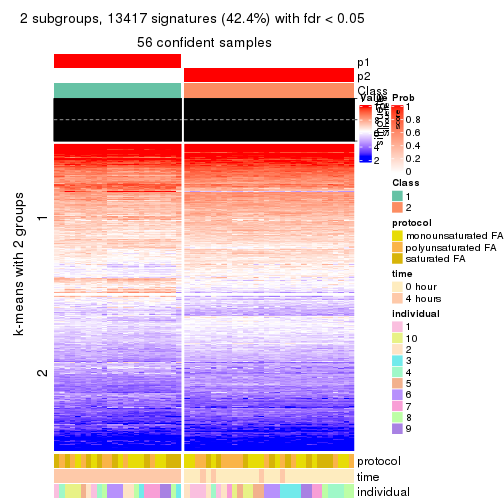</p>

</div>
<div id='tab-CV-mclust-get-signatures-no-scale-2'>
<pre><code class="r">get_signatures(res, k = 3, scale_rows = FALSE)
</code></pre>

<p>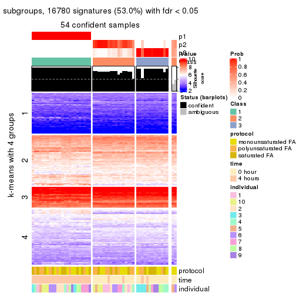</p>

</div>
<div id='tab-CV-mclust-get-signatures-no-scale-3'>
<pre><code class="r">get_signatures(res, k = 4, scale_rows = FALSE)
</code></pre>

<p>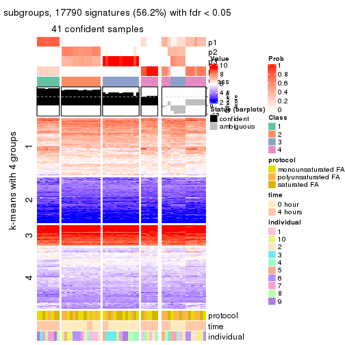</p>

</div>
<div id='tab-CV-mclust-get-signatures-no-scale-4'>
<pre><code class="r">get_signatures(res, k = 5, scale_rows = FALSE)
</code></pre>

<p>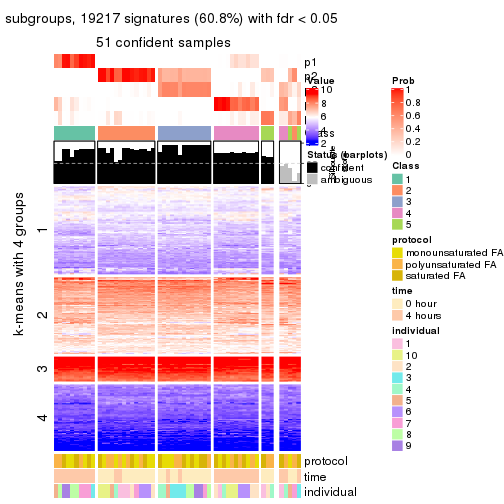</p>

</div>
<div id='tab-CV-mclust-get-signatures-no-scale-5'>
<pre><code class="r">get_signatures(res, k = 6, scale_rows = FALSE)
</code></pre>

<p>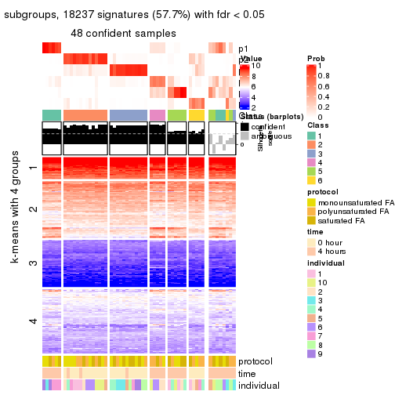</p>

</div>
</div>


Compare the overlap of signatures from different k:

```r
compare_signatures(res)
```

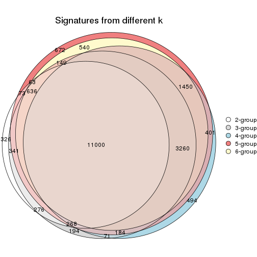

`get_signature()` returns a data frame invisibly. TO get the list of signatures, the function
call should be assigned to a variable explicitly. In following code, if `plot` argument is set
to `FALSE`, no heatmap is plotted while only the differential analysis is performed.

```r
# code only for demonstration
tb = get_signature(res, k = ..., plot = FALSE)
```

An example of the output of `tb` is:

```
#>   which_row         fdr    mean_1    mean_2 scaled_mean_1 scaled_mean_2 km
#> 1        38 0.042760348  8.373488  9.131774    -0.5533452     0.5164555  1
#> 2        40 0.018707592  7.106213  8.469186    -0.6173731     0.5762149  1
#> 3        55 0.019134737 10.221463 11.207825    -0.6159697     0.5749050  1
#> 4        59 0.006059896  5.921854  7.869574    -0.6899429     0.6439467  1
#> 5        60 0.018055526  8.928898 10.211722    -0.6204761     0.5791110  1
#> 6        98 0.009384629 15.714769 14.887706     0.6635654    -0.6193277  2
...
```

The columns in `tb` are:

1. `which_row`: row indices corresponding to the input matrix.
2. `fdr`: FDR for the differential test. 
3. `mean_x`: The mean value in group x.
4. `scaled_mean_x`: The mean value in group x after rows are scaled.
5. `km`: Row groups if k-means clustering is applied to rows.


UMAP plot which shows how samples are separated.


<script>
$( function() {
	$( '#tabs-CV-mclust-dimension-reduction' ).tabs();
} );
</script>
<div id='tabs-CV-mclust-dimension-reduction'>
<ul>
<li><a href='#tab-CV-mclust-dimension-reduction-1'>k = 2</a></li>
<li><a href='#tab-CV-mclust-dimension-reduction-2'>k = 3</a></li>
<li><a href='#tab-CV-mclust-dimension-reduction-3'>k = 4</a></li>
<li><a href='#tab-CV-mclust-dimension-reduction-4'>k = 5</a></li>
<li><a href='#tab-CV-mclust-dimension-reduction-5'>k = 6</a></li>
</ul>
<div id='tab-CV-mclust-dimension-reduction-1'>
<pre><code class="r">dimension_reduction(res, k = 2, method = &quot;UMAP&quot;)
</code></pre>

<p>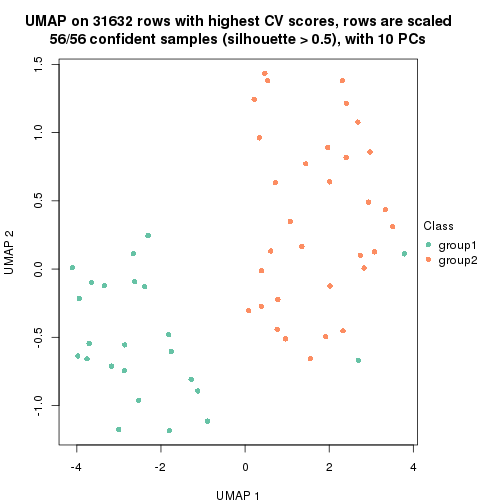</p>

</div>
<div id='tab-CV-mclust-dimension-reduction-2'>
<pre><code class="r">dimension_reduction(res, k = 3, method = &quot;UMAP&quot;)
</code></pre>

<p>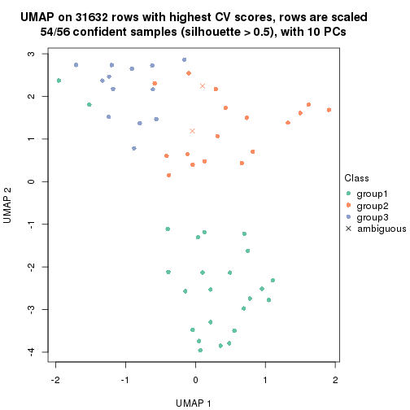</p>

</div>
<div id='tab-CV-mclust-dimension-reduction-3'>
<pre><code class="r">dimension_reduction(res, k = 4, method = &quot;UMAP&quot;)
</code></pre>

<p>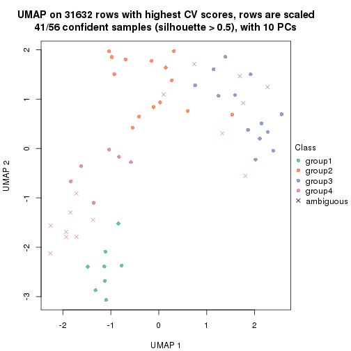</p>

</div>
<div id='tab-CV-mclust-dimension-reduction-4'>
<pre><code class="r">dimension_reduction(res, k = 5, method = &quot;UMAP&quot;)
</code></pre>

<p>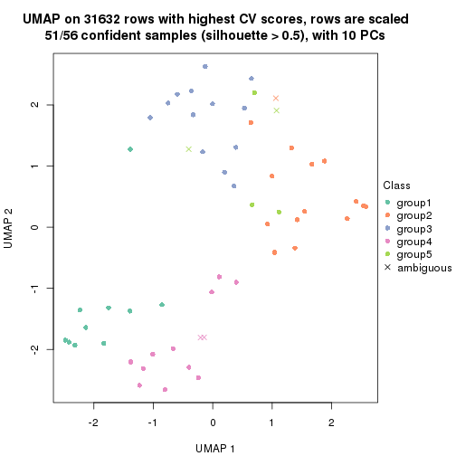</p>

</div>
<div id='tab-CV-mclust-dimension-reduction-5'>
<pre><code class="r">dimension_reduction(res, k = 6, method = &quot;UMAP&quot;)
</code></pre>

<p>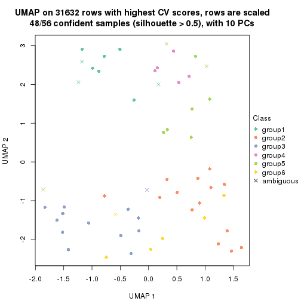</p>

</div>
</div>


Following heatmap shows how subgroups are split when increasing `k`:

```r
collect_classes(res)
```

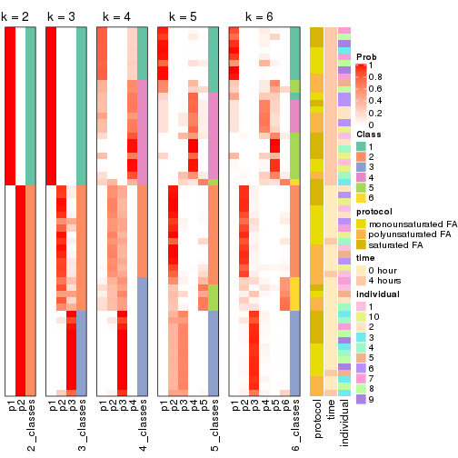


Test correlation between subgroups and known annotations. If the known
annotation is numeric, one-way ANOVA test is applied, and if the known
annotation is discrete, chi-squared contingency table test is applied.

```r
test_to_known_factors(res)
```

```
#>            n protocol(p)  time(p) individual(p) k
#> CV:mclust 56       0.757 5.27e-10        0.9930 2
#> CV:mclust 54       0.664 1.91e-09        0.1833 3
#> CV:mclust 41       0.830 5.43e-06        0.0196 4
#> CV:mclust 51       0.888 1.51e-07        0.0172 5
#> CV:mclust 48       0.672 5.52e-07        0.0274 6
```


If matrix rows can be associated to genes, consider to use `functional_enrichment(res,
...)` to perform function enrichment for the signature genes. See [this vignette](http://bioconductor.org/packages/devel/bioc/vignettes/cola/inst/doc/functional_enrichment.html) for more detailed explanations.


 

---------------------------------------------------


### CV:NMF**


The object with results only for a single top-value method and a single partition method 
can be extracted as:

```r
res = res_list["CV", "NMF"]
# you can also extract it by
# res = res_list["CV:NMF"]
```

A summary of `res` and all the functions that can be applied to it:

```r
res
```

```
#> A 'ConsensusPartition' object with k = 2, 3, 4, 5, 6.
#>   On a matrix with 31632 rows and 56 columns.
#>   Top rows (1000, 2000, 3000, 4000, 5000) are extracted by 'CV' method.
#>   Subgroups are detected by 'NMF' method.
#>   Performed in total 1250 partitions by row resampling.
#>   Best k for subgroups seems to be 2.
#> 
#> Following methods can be applied to this 'ConsensusPartition' object:
#>  [1] "cola_report"             "collect_classes"         "collect_plots"          
#>  [4] "collect_stats"           "colnames"                "compare_signatures"     
#>  [7] "consensus_heatmap"       "dimension_reduction"     "functional_enrichment"  
#> [10] "get_anno_col"            "get_anno"                "get_classes"            
#> [13] "get_consensus"           "get_matrix"              "get_membership"         
#> [16] "get_param"               "get_signatures"          "get_stats"              
#> [19] "is_best_k"               "is_stable_k"             "membership_heatmap"     
#> [22] "ncol"                    "nrow"                    "plot_ecdf"              
#> [25] "rownames"                "select_partition_number" "show"                   
#> [28] "suggest_best_k"          "test_to_known_factors"
```

`collect_plots()` function collects all the plots made from `res` for all `k` (number of partitions)
into one single page to provide an easy and fast comparison between different `k`.

```r
collect_plots(res)
```

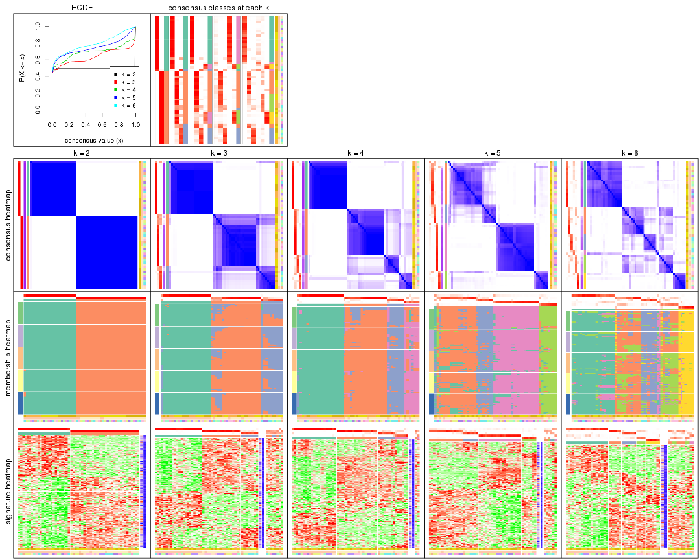

The plots are:

- The first row: a plot of the ECDF (empirical cumulative distribution
  function) curves of the consensus matrix for each `k` and the heatmap of
  predicted classes for each `k`.
- The second row: heatmaps of the consensus matrix for each `k`.
- The third row: heatmaps of the membership matrix for each `k`.
- The fouth row: heatmaps of the signatures for each `k`.

All the plots in panels can be made by individual functions and they are
plotted later in this section.

`select_partition_number()` produces several plots showing different
statistics for choosing "optimized" `k`. There are following statistics:

- ECDF curves of the consensus matrix for each `k`;
- 1-PAC. [The PAC
  score](https://en.wikipedia.org/wiki/Consensus_clustering#Over-interpretation_potential_of_consensus_clustering)
  measures the proportion of the ambiguous subgrouping.
- Mean silhouette score.
- Concordance. The mean probability of fiting the consensus class ids in all
  partitions.
- Area increased. Denote $A_k$ as the area under the ECDF curve for current
  `k`, the area increased is defined as $A_k - A_{k-1}$.
- Rand index. The percent of pairs of samples that are both in a same cluster
  or both are not in a same cluster in the partition of k and k-1.
- Jaccard index. The ratio of pairs of samples are both in a same cluster in
  the partition of k and k-1 and the pairs of samples are both in a same
  cluster in the partition k or k-1.

The detailed explanations of these statistics can be found in [the _cola_
vignette](http://bioconductor.org/packages/devel/bioc/vignettes/cola/inst/doc/cola.html#toc_13).

Generally speaking, lower PAC score, higher mean silhouette score or higher
concordance corresponds to better partition. Rand index and Jaccard index
measure how similar the current partition is compared to partition with `k-1`.
If they are too similar, we won't accept `k` is better than `k-1`.

```r
select_partition_number(res)
```

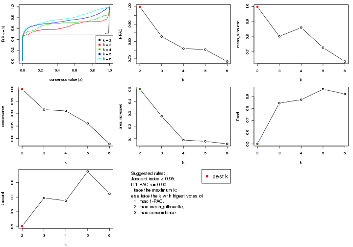

The numeric values for all these statistics can be obtained by `get_stats()`.

```r
get_stats(res)
```

```
#>   k 1-PAC mean_silhouette concordance area_increased  Rand Jaccard
#> 2 2 1.000           0.998       0.999         0.4989 0.501   0.501
#> 3 3 0.829           0.803       0.917         0.2810 0.845   0.694
#> 4 4 0.759           0.861       0.911         0.0882 0.874   0.675
#> 5 5 0.753           0.729       0.860         0.0782 0.962   0.875
#> 6 6 0.684           0.636       0.778         0.0580 0.922   0.723
```

`suggest_best_k()` suggests the best $k$ based on these statistics. The rules are as follows:

- All $k$ with Jaccard index larger than 0.95 are removed because increasing
  $k$ does not provide enough extra information. If all $k$ are removed, it is
  marked as no subgroup is detected.
- For all $k$ with 1-PAC score larger than 0.9, the maximal $k$ is taken as
  the best $k$, and other $k$ are marked as optional $k$.
- If it does not fit the second rule. The $k$ with the maximal vote of the
  highest 1-PAC score, highest mean silhouette, and highest concordance is
  taken as the best $k$.

```r
suggest_best_k(res)
```

```
#> [1] 2
```


Following shows the table of the partitions (You need to click the **show/hide
code output** link to see it). The membership matrix (columns with name `p*`)
is inferred by
[`clue::cl_consensus()`](https://www.rdocumentation.org/link/cl_consensus?package=clue)
function with the `SE` method. Basically the value in the membership matrix
represents the probability to belong to a certain group. The finall class
label for an item is determined with the group with highest probability it
belongs to.

In `get_classes()` function, the entropy is calculated from the membership
matrix and the silhouette score is calculated from the consensus matrix.


<script>
$( function() {
	$( '#tabs-CV-NMF-get-classes' ).tabs();
} );
</script>
<div id='tabs-CV-NMF-get-classes'>
<ul>
<li><a href='#tab-CV-NMF-get-classes-1'>k = 2</a></li>
<li><a href='#tab-CV-NMF-get-classes-2'>k = 3</a></li>
<li><a href='#tab-CV-NMF-get-classes-3'>k = 4</a></li>
<li><a href='#tab-CV-NMF-get-classes-4'>k = 5</a></li>
<li><a href='#tab-CV-NMF-get-classes-5'>k = 6</a></li>
</ul>

<div id='tab-CV-NMF-get-classes-1'>
<p><a id='tab-CV-NMF-get-classes-1-a' style='color:#0366d6' href='#'>show/hide code output</a></p>
<pre><code class="r">cbind(get_classes(res, k = 2), get_membership(res, k = 2))
</code></pre>

<pre><code>#&gt;           class entropy silhouette    p1    p2
#&gt; GSM790742     2   0.000      1.000 0.000 1.000
#&gt; GSM790744     2   0.000      1.000 0.000 1.000
#&gt; GSM790754     2   0.000      1.000 0.000 1.000
#&gt; GSM790756     2   0.000      1.000 0.000 1.000
#&gt; GSM790768     2   0.000      1.000 0.000 1.000
#&gt; GSM790774     2   0.000      1.000 0.000 1.000
#&gt; GSM790778     2   0.000      1.000 0.000 1.000
#&gt; GSM790784     2   0.000      1.000 0.000 1.000
#&gt; GSM790790     2   0.000      1.000 0.000 1.000
#&gt; GSM790743     1   0.000      0.998 1.000 0.000
#&gt; GSM790745     1   0.000      0.998 1.000 0.000
#&gt; GSM790755     1   0.278      0.950 0.952 0.048
#&gt; GSM790757     1   0.000      0.998 1.000 0.000
#&gt; GSM790769     1   0.000      0.998 1.000 0.000
#&gt; GSM790775     1   0.000      0.998 1.000 0.000
#&gt; GSM790779     1   0.000      0.998 1.000 0.000
#&gt; GSM790785     1   0.000      0.998 1.000 0.000
#&gt; GSM790791     1   0.000      0.998 1.000 0.000
#&gt; GSM790738     2   0.000      1.000 0.000 1.000
#&gt; GSM790746     2   0.000      1.000 0.000 1.000
#&gt; GSM790752     2   0.000      1.000 0.000 1.000
#&gt; GSM790758     2   0.000      1.000 0.000 1.000
#&gt; GSM790764     2   0.000      1.000 0.000 1.000
#&gt; GSM790766     2   0.000      1.000 0.000 1.000
#&gt; GSM790772     2   0.000      1.000 0.000 1.000
#&gt; GSM790782     2   0.000      1.000 0.000 1.000
#&gt; GSM790786     2   0.000      1.000 0.000 1.000
#&gt; GSM790792     2   0.000      1.000 0.000 1.000
#&gt; GSM790739     1   0.000      0.998 1.000 0.000
#&gt; GSM790747     1   0.000      0.998 1.000 0.000
#&gt; GSM790753     1   0.000      0.998 1.000 0.000
#&gt; GSM790759     2   0.000      1.000 0.000 1.000
#&gt; GSM790765     2   0.000      1.000 0.000 1.000
#&gt; GSM790767     1   0.000      0.998 1.000 0.000
#&gt; GSM790773     1   0.000      0.998 1.000 0.000
#&gt; GSM790783     1   0.000      0.998 1.000 0.000
#&gt; GSM790787     1   0.000      0.998 1.000 0.000
#&gt; GSM790793     1   0.000      0.998 1.000 0.000
#&gt; GSM790740     2   0.000      1.000 0.000 1.000
#&gt; GSM790748     2   0.000      1.000 0.000 1.000
#&gt; GSM790750     2   0.000      1.000 0.000 1.000
#&gt; GSM790760     2   0.000      1.000 0.000 1.000
#&gt; GSM790762     2   0.000      1.000 0.000 1.000
#&gt; GSM790770     2   0.000      1.000 0.000 1.000
#&gt; GSM790776     2   0.000      1.000 0.000 1.000
#&gt; GSM790780     2   0.000      1.000 0.000 1.000
#&gt; GSM790788     2   0.000      1.000 0.000 1.000
#&gt; GSM790741     2   0.000      1.000 0.000 1.000
#&gt; GSM790749     1   0.000      0.998 1.000 0.000
#&gt; GSM790751     2   0.000      1.000 0.000 1.000
#&gt; GSM790761     1   0.000      0.998 1.000 0.000
#&gt; GSM790763     1   0.000      0.998 1.000 0.000
#&gt; GSM790771     1   0.000      0.998 1.000 0.000
#&gt; GSM790777     1   0.000      0.998 1.000 0.000
#&gt; GSM790781     1   0.000      0.998 1.000 0.000
#&gt; GSM790789     1   0.000      0.998 1.000 0.000
</code></pre>

<script>
$('#tab-CV-NMF-get-classes-1-a').parent().next().next().hide();
$('#tab-CV-NMF-get-classes-1-a').click(function(){
  $('#tab-CV-NMF-get-classes-1-a').parent().next().next().toggle();
  return(false);
});
</script>
</div>

<div id='tab-CV-NMF-get-classes-2'>
<p><a id='tab-CV-NMF-get-classes-2-a' style='color:#0366d6' href='#'>show/hide code output</a></p>
<pre><code class="r">cbind(get_classes(res, k = 3), get_membership(res, k = 3))
</code></pre>

<pre><code>#&gt;           class entropy silhouette    p1    p2    p3
#&gt; GSM790742     2  0.0237      0.863 0.000 0.996 0.004
#&gt; GSM790744     2  0.0424      0.866 0.000 0.992 0.008
#&gt; GSM790754     3  0.2959      0.839 0.000 0.100 0.900
#&gt; GSM790756     2  0.6204      0.108 0.000 0.576 0.424
#&gt; GSM790768     2  0.0237      0.866 0.000 0.996 0.004
#&gt; GSM790774     2  0.6309     -0.196 0.000 0.504 0.496
#&gt; GSM790778     3  0.3752      0.831 0.000 0.144 0.856
#&gt; GSM790784     3  0.6140      0.424 0.000 0.404 0.596
#&gt; GSM790790     2  0.0237      0.866 0.000 0.996 0.004
#&gt; GSM790743     1  0.1170      0.960 0.976 0.008 0.016
#&gt; GSM790745     1  0.0000      0.975 1.000 0.000 0.000
#&gt; GSM790755     3  0.2165      0.724 0.064 0.000 0.936
#&gt; GSM790757     1  0.1031      0.956 0.976 0.024 0.000
#&gt; GSM790769     1  0.0000      0.975 1.000 0.000 0.000
#&gt; GSM790775     1  0.0237      0.975 0.996 0.000 0.004
#&gt; GSM790779     1  0.0237      0.975 0.996 0.000 0.004
#&gt; GSM790785     1  0.0237      0.975 0.996 0.000 0.004
#&gt; GSM790791     1  0.0000      0.975 1.000 0.000 0.000
#&gt; GSM790738     2  0.0000      0.866 0.000 1.000 0.000
#&gt; GSM790746     2  0.0000      0.866 0.000 1.000 0.000
#&gt; GSM790752     3  0.4504      0.790 0.000 0.196 0.804
#&gt; GSM790758     3  0.2448      0.833 0.000 0.076 0.924
#&gt; GSM790764     2  0.5810      0.425 0.000 0.664 0.336
#&gt; GSM790766     2  0.1411      0.852 0.000 0.964 0.036
#&gt; GSM790772     2  0.2448      0.819 0.000 0.924 0.076
#&gt; GSM790782     2  0.6154      0.177 0.000 0.592 0.408
#&gt; GSM790786     3  0.6274      0.265 0.000 0.456 0.544
#&gt; GSM790792     2  0.0000      0.866 0.000 1.000 0.000
#&gt; GSM790739     1  0.0000      0.975 1.000 0.000 0.000
#&gt; GSM790747     1  0.0000      0.975 1.000 0.000 0.000
#&gt; GSM790753     1  0.0237      0.975 0.996 0.000 0.004
#&gt; GSM790759     2  0.0237      0.866 0.000 0.996 0.004
#&gt; GSM790765     3  0.2448      0.833 0.000 0.076 0.924
#&gt; GSM790767     1  0.0000      0.975 1.000 0.000 0.000
#&gt; GSM790773     1  0.0237      0.975 0.996 0.000 0.004
#&gt; GSM790783     1  0.0237      0.975 0.996 0.000 0.004
#&gt; GSM790787     1  0.0237      0.975 0.996 0.000 0.004
#&gt; GSM790793     1  0.0000      0.975 1.000 0.000 0.000
#&gt; GSM790740     2  0.0424      0.866 0.000 0.992 0.008
#&gt; GSM790748     2  0.0000      0.866 0.000 1.000 0.000
#&gt; GSM790750     3  0.3816      0.829 0.000 0.148 0.852
#&gt; GSM790760     2  0.2066      0.839 0.000 0.940 0.060
#&gt; GSM790762     2  0.0592      0.865 0.000 0.988 0.012
#&gt; GSM790770     2  0.0000      0.866 0.000 1.000 0.000
#&gt; GSM790776     2  0.0592      0.865 0.000 0.988 0.012
#&gt; GSM790780     3  0.2711      0.838 0.000 0.088 0.912
#&gt; GSM790788     2  0.0000      0.866 0.000 1.000 0.000
#&gt; GSM790741     2  0.0892      0.861 0.000 0.980 0.020
#&gt; GSM790749     1  0.0000      0.975 1.000 0.000 0.000
#&gt; GSM790751     2  0.6260      0.133 0.000 0.552 0.448
#&gt; GSM790761     1  0.0892      0.960 0.980 0.020 0.000
#&gt; GSM790763     1  0.0237      0.975 0.996 0.000 0.004
#&gt; GSM790771     1  0.0000      0.975 1.000 0.000 0.000
#&gt; GSM790777     1  0.0237      0.975 0.996 0.000 0.004
#&gt; GSM790781     1  0.6274      0.211 0.544 0.000 0.456
#&gt; GSM790789     1  0.0000      0.975 1.000 0.000 0.000
</code></pre>

<script>
$('#tab-CV-NMF-get-classes-2-a').parent().next().next().hide();
$('#tab-CV-NMF-get-classes-2-a').click(function(){
  $('#tab-CV-NMF-get-classes-2-a').parent().next().next().toggle();
  return(false);
});
</script>
</div>

<div id='tab-CV-NMF-get-classes-3'>
<p><a id='tab-CV-NMF-get-classes-3-a' style='color:#0366d6' href='#'>show/hide code output</a></p>
<pre><code class="r">cbind(get_classes(res, k = 4), get_membership(res, k = 4))
</code></pre>

<pre><code>#&gt;           class entropy silhouette    p1    p2    p3    p4
#&gt; GSM790742     4  0.3726      0.772 0.000 0.212 0.000 0.788
#&gt; GSM790744     2  0.0000      0.912 0.000 1.000 0.000 0.000
#&gt; GSM790754     3  0.2868      0.835 0.000 0.136 0.864 0.000
#&gt; GSM790756     2  0.3266      0.786 0.000 0.832 0.168 0.000
#&gt; GSM790768     2  0.0000      0.912 0.000 1.000 0.000 0.000
#&gt; GSM790774     2  0.2647      0.843 0.000 0.880 0.120 0.000
#&gt; GSM790778     3  0.4222      0.692 0.000 0.272 0.728 0.000
#&gt; GSM790784     2  0.3172      0.804 0.000 0.840 0.160 0.000
#&gt; GSM790790     2  0.0000      0.912 0.000 1.000 0.000 0.000
#&gt; GSM790743     4  0.0707      0.624 0.020 0.000 0.000 0.980
#&gt; GSM790745     1  0.0188      0.980 0.996 0.004 0.000 0.000
#&gt; GSM790755     3  0.4134      0.570 0.000 0.000 0.740 0.260
#&gt; GSM790757     1  0.0592      0.968 0.984 0.016 0.000 0.000
#&gt; GSM790769     1  0.0000      0.983 1.000 0.000 0.000 0.000
#&gt; GSM790775     1  0.0000      0.983 1.000 0.000 0.000 0.000
#&gt; GSM790779     1  0.0000      0.983 1.000 0.000 0.000 0.000
#&gt; GSM790785     1  0.0000      0.983 1.000 0.000 0.000 0.000
#&gt; GSM790791     1  0.0000      0.983 1.000 0.000 0.000 0.000
#&gt; GSM790738     2  0.0188      0.910 0.000 0.996 0.000 0.004
#&gt; GSM790746     2  0.1022      0.888 0.000 0.968 0.000 0.032
#&gt; GSM790752     3  0.3444      0.806 0.000 0.184 0.816 0.000
#&gt; GSM790758     3  0.1389      0.830 0.000 0.048 0.952 0.000
#&gt; GSM790764     4  0.6407      0.611 0.000 0.148 0.204 0.648
#&gt; GSM790766     2  0.0000      0.912 0.000 1.000 0.000 0.000
#&gt; GSM790772     2  0.0469      0.908 0.000 0.988 0.012 0.000
#&gt; GSM790782     2  0.2760      0.836 0.000 0.872 0.128 0.000
#&gt; GSM790786     2  0.2760      0.835 0.000 0.872 0.128 0.000
#&gt; GSM790792     2  0.0000      0.912 0.000 1.000 0.000 0.000
#&gt; GSM790739     1  0.0000      0.983 1.000 0.000 0.000 0.000
#&gt; GSM790747     1  0.0188      0.981 0.996 0.000 0.000 0.004
#&gt; GSM790753     1  0.0000      0.983 1.000 0.000 0.000 0.000
#&gt; GSM790759     2  0.2814      0.786 0.000 0.868 0.000 0.132
#&gt; GSM790765     3  0.1389      0.830 0.000 0.048 0.952 0.000
#&gt; GSM790767     1  0.0000      0.983 1.000 0.000 0.000 0.000
#&gt; GSM790773     1  0.0000      0.983 1.000 0.000 0.000 0.000
#&gt; GSM790783     1  0.0000      0.983 1.000 0.000 0.000 0.000
#&gt; GSM790787     1  0.0000      0.983 1.000 0.000 0.000 0.000
#&gt; GSM790793     1  0.0000      0.983 1.000 0.000 0.000 0.000
#&gt; GSM790740     2  0.0000      0.912 0.000 1.000 0.000 0.000
#&gt; GSM790748     4  0.3942      0.768 0.000 0.236 0.000 0.764
#&gt; GSM790750     3  0.3311      0.819 0.000 0.172 0.828 0.000
#&gt; GSM790760     4  0.4284      0.771 0.000 0.224 0.012 0.764
#&gt; GSM790762     2  0.0000      0.912 0.000 1.000 0.000 0.000
#&gt; GSM790770     2  0.1940      0.854 0.000 0.924 0.000 0.076
#&gt; GSM790776     4  0.4941      0.455 0.000 0.436 0.000 0.564
#&gt; GSM790780     3  0.1557      0.834 0.000 0.056 0.944 0.000
#&gt; GSM790788     2  0.0000      0.912 0.000 1.000 0.000 0.000
#&gt; GSM790741     2  0.0000      0.912 0.000 1.000 0.000 0.000
#&gt; GSM790749     1  0.1940      0.918 0.924 0.000 0.000 0.076
#&gt; GSM790751     2  0.5331      0.481 0.000 0.644 0.332 0.024
#&gt; GSM790761     4  0.3400      0.576 0.180 0.000 0.000 0.820
#&gt; GSM790763     1  0.0000      0.983 1.000 0.000 0.000 0.000
#&gt; GSM790771     1  0.0188      0.981 0.996 0.000 0.000 0.004
#&gt; GSM790777     1  0.0000      0.983 1.000 0.000 0.000 0.000
#&gt; GSM790781     1  0.3837      0.711 0.776 0.000 0.224 0.000
#&gt; GSM790789     1  0.0000      0.983 1.000 0.000 0.000 0.000
</code></pre>

<script>
$('#tab-CV-NMF-get-classes-3-a').parent().next().next().hide();
$('#tab-CV-NMF-get-classes-3-a').click(function(){
  $('#tab-CV-NMF-get-classes-3-a').parent().next().next().toggle();
  return(false);
});
</script>
</div>

<div id='tab-CV-NMF-get-classes-4'>
<p><a id='tab-CV-NMF-get-classes-4-a' style='color:#0366d6' href='#'>show/hide code output</a></p>
<pre><code class="r">cbind(get_classes(res, k = 5), get_membership(res, k = 5))
</code></pre>

<pre><code>#&gt;           class entropy silhouette    p1    p2    p3    p4    p5
#&gt; GSM790742     5  0.0865    0.81185 0.004 0.024 0.000 0.000 0.972
#&gt; GSM790744     2  0.0566    0.79384 0.012 0.984 0.004 0.000 0.000
#&gt; GSM790754     3  0.3710    0.61828 0.024 0.192 0.784 0.000 0.000
#&gt; GSM790756     3  0.5876    0.29661 0.048 0.432 0.496 0.000 0.024
#&gt; GSM790768     2  0.1732    0.79222 0.080 0.920 0.000 0.000 0.000
#&gt; GSM790774     2  0.2653    0.76201 0.024 0.880 0.096 0.000 0.000
#&gt; GSM790778     3  0.3456    0.57458 0.016 0.184 0.800 0.000 0.000
#&gt; GSM790784     2  0.5384    0.60201 0.104 0.664 0.228 0.000 0.004
#&gt; GSM790790     2  0.3203    0.76187 0.168 0.820 0.000 0.000 0.012
#&gt; GSM790743     5  0.3016    0.72166 0.132 0.000 0.000 0.020 0.848
#&gt; GSM790745     4  0.1547    0.91247 0.032 0.016 0.000 0.948 0.004
#&gt; GSM790755     1  0.5412    0.00000 0.520 0.000 0.428 0.004 0.048
#&gt; GSM790757     4  0.2069    0.89677 0.052 0.012 0.000 0.924 0.012
#&gt; GSM790769     4  0.1892    0.91185 0.080 0.000 0.000 0.916 0.004
#&gt; GSM790775     4  0.0609    0.92459 0.020 0.000 0.000 0.980 0.000
#&gt; GSM790779     4  0.0510    0.92560 0.016 0.000 0.000 0.984 0.000
#&gt; GSM790785     4  0.0609    0.92459 0.020 0.000 0.000 0.980 0.000
#&gt; GSM790791     4  0.0963    0.92723 0.036 0.000 0.000 0.964 0.000
#&gt; GSM790738     2  0.2734    0.76498 0.076 0.888 0.008 0.000 0.028
#&gt; GSM790746     2  0.3348    0.75487 0.080 0.860 0.020 0.000 0.040
#&gt; GSM790752     3  0.2407    0.63164 0.012 0.088 0.896 0.000 0.004
#&gt; GSM790758     3  0.0703    0.51667 0.024 0.000 0.976 0.000 0.000
#&gt; GSM790764     5  0.3543    0.76340 0.068 0.056 0.024 0.000 0.852
#&gt; GSM790766     2  0.1153    0.79298 0.024 0.964 0.004 0.000 0.008
#&gt; GSM790772     2  0.1377    0.79556 0.020 0.956 0.020 0.000 0.004
#&gt; GSM790782     2  0.2798    0.71660 0.008 0.852 0.140 0.000 0.000
#&gt; GSM790786     2  0.4550    0.73554 0.136 0.760 0.100 0.000 0.004
#&gt; GSM790792     2  0.3343    0.75948 0.172 0.812 0.000 0.000 0.016
#&gt; GSM790739     4  0.0609    0.92849 0.020 0.000 0.000 0.980 0.000
#&gt; GSM790747     4  0.2583    0.88006 0.132 0.000 0.000 0.864 0.004
#&gt; GSM790753     4  0.0609    0.92793 0.020 0.000 0.000 0.980 0.000
#&gt; GSM790759     5  0.5825    0.17766 0.072 0.412 0.008 0.000 0.508
#&gt; GSM790765     3  0.3844    0.50501 0.132 0.064 0.804 0.000 0.000
#&gt; GSM790767     4  0.0609    0.92738 0.020 0.000 0.000 0.980 0.000
#&gt; GSM790773     4  0.0510    0.92560 0.016 0.000 0.000 0.984 0.000
#&gt; GSM790783     4  0.1478    0.91916 0.064 0.000 0.000 0.936 0.000
#&gt; GSM790787     4  0.0404    0.92814 0.012 0.000 0.000 0.988 0.000
#&gt; GSM790793     4  0.1608    0.91905 0.072 0.000 0.000 0.928 0.000
#&gt; GSM790740     2  0.2476    0.77058 0.064 0.904 0.012 0.000 0.020
#&gt; GSM790748     5  0.0771    0.81362 0.000 0.020 0.004 0.000 0.976
#&gt; GSM790750     3  0.3081    0.63760 0.012 0.156 0.832 0.000 0.000
#&gt; GSM790760     5  0.1267    0.81253 0.004 0.024 0.012 0.000 0.960
#&gt; GSM790762     2  0.3086    0.75950 0.180 0.816 0.000 0.000 0.004
#&gt; GSM790770     2  0.6254    0.16435 0.152 0.480 0.000 0.000 0.368
#&gt; GSM790776     5  0.2784    0.79078 0.028 0.072 0.012 0.000 0.888
#&gt; GSM790780     3  0.0955    0.57943 0.004 0.028 0.968 0.000 0.000
#&gt; GSM790788     2  0.3209    0.75837 0.180 0.812 0.000 0.000 0.008
#&gt; GSM790741     2  0.2819    0.76248 0.080 0.884 0.012 0.000 0.024
#&gt; GSM790749     4  0.4425    0.37951 0.452 0.000 0.000 0.544 0.004
#&gt; GSM790751     2  0.6409   -0.00982 0.092 0.508 0.372 0.000 0.028
#&gt; GSM790761     5  0.2046    0.74864 0.016 0.000 0.000 0.068 0.916
#&gt; GSM790763     4  0.1851    0.91133 0.088 0.000 0.000 0.912 0.000
#&gt; GSM790771     4  0.2389    0.89193 0.116 0.000 0.000 0.880 0.004
#&gt; GSM790777     4  0.0404    0.92632 0.012 0.000 0.000 0.988 0.000
#&gt; GSM790781     4  0.3688    0.76183 0.036 0.000 0.148 0.812 0.004
#&gt; GSM790789     4  0.1544    0.91801 0.068 0.000 0.000 0.932 0.000
</code></pre>

<script>
$('#tab-CV-NMF-get-classes-4-a').parent().next().next().hide();
$('#tab-CV-NMF-get-classes-4-a').click(function(){
  $('#tab-CV-NMF-get-classes-4-a').parent().next().next().toggle();
  return(false);
});
</script>
</div>

<div id='tab-CV-NMF-get-classes-5'>
<p><a id='tab-CV-NMF-get-classes-5-a' style='color:#0366d6' href='#'>show/hide code output</a></p>
<pre><code class="r">cbind(get_classes(res, k = 6), get_membership(res, k = 6))
</code></pre>

<pre><code>#&gt;           class entropy silhouette    p1    p2    p3    p4    p5    p6
#&gt; GSM790742     6  0.0632     0.8887 0.000 0.000 0.000 0.000 0.024 0.976
#&gt; GSM790744     2  0.4218     0.0805 0.000 0.584 0.004 0.012 0.400 0.000
#&gt; GSM790754     3  0.3986     0.7406 0.000 0.016 0.756 0.036 0.192 0.000
#&gt; GSM790756     5  0.5184     0.3618 0.000 0.044 0.328 0.016 0.600 0.012
#&gt; GSM790768     2  0.2994     0.5131 0.000 0.788 0.000 0.004 0.208 0.000
#&gt; GSM790774     2  0.5768     0.1156 0.000 0.488 0.196 0.000 0.316 0.000
#&gt; GSM790778     3  0.2614     0.7951 0.000 0.060 0.884 0.012 0.044 0.000
#&gt; GSM790784     2  0.4210     0.4470 0.000 0.672 0.288 0.000 0.040 0.000
#&gt; GSM790790     2  0.0665     0.6247 0.000 0.980 0.000 0.008 0.008 0.004
#&gt; GSM790743     6  0.4519     0.5570 0.012 0.000 0.000 0.296 0.036 0.656
#&gt; GSM790745     1  0.2796     0.7801 0.868 0.008 0.000 0.044 0.080 0.000
#&gt; GSM790755     4  0.5348    -0.0525 0.000 0.004 0.288 0.592 0.112 0.004
#&gt; GSM790757     1  0.3344     0.7327 0.828 0.008 0.000 0.060 0.104 0.000
#&gt; GSM790769     1  0.2912     0.7793 0.784 0.000 0.000 0.216 0.000 0.000
#&gt; GSM790775     1  0.0622     0.8344 0.980 0.000 0.000 0.008 0.012 0.000
#&gt; GSM790779     1  0.0603     0.8347 0.980 0.000 0.000 0.004 0.016 0.000
#&gt; GSM790785     1  0.0909     0.8384 0.968 0.000 0.000 0.020 0.012 0.000
#&gt; GSM790791     1  0.2288     0.8265 0.876 0.004 0.000 0.116 0.004 0.000
#&gt; GSM790738     5  0.3608     0.6294 0.000 0.272 0.000 0.012 0.716 0.000
#&gt; GSM790746     5  0.4149     0.6172 0.000 0.264 0.008 0.012 0.704 0.012
#&gt; GSM790752     3  0.2505     0.8159 0.000 0.016 0.888 0.012 0.080 0.004
#&gt; GSM790758     3  0.1007     0.7703 0.000 0.004 0.968 0.016 0.004 0.008
#&gt; GSM790764     6  0.2892     0.8264 0.000 0.068 0.028 0.016 0.012 0.876
#&gt; GSM790766     2  0.4344     0.0488 0.000 0.568 0.008 0.012 0.412 0.000
#&gt; GSM790772     2  0.5153     0.0736 0.000 0.536 0.060 0.012 0.392 0.000
#&gt; GSM790782     5  0.5772     0.1761 0.000 0.368 0.156 0.004 0.472 0.000
#&gt; GSM790786     2  0.3254     0.5686 0.000 0.816 0.136 0.000 0.048 0.000
#&gt; GSM790792     2  0.0665     0.6258 0.000 0.980 0.000 0.008 0.008 0.004
#&gt; GSM790739     1  0.3263     0.7324 0.800 0.004 0.000 0.020 0.176 0.000
#&gt; GSM790747     1  0.3714     0.6309 0.656 0.000 0.000 0.340 0.004 0.000
#&gt; GSM790753     1  0.0363     0.8389 0.988 0.000 0.000 0.012 0.000 0.000
#&gt; GSM790759     5  0.5559     0.4926 0.000 0.136 0.004 0.028 0.640 0.192
#&gt; GSM790765     3  0.4296     0.6311 0.000 0.240 0.712 0.032 0.012 0.004
#&gt; GSM790767     1  0.1285     0.8407 0.944 0.000 0.000 0.052 0.004 0.000
#&gt; GSM790773     1  0.0603     0.8347 0.980 0.000 0.000 0.004 0.016 0.000
#&gt; GSM790783     1  0.2848     0.7990 0.816 0.000 0.000 0.176 0.008 0.000
#&gt; GSM790787     1  0.1643     0.8383 0.924 0.000 0.000 0.068 0.008 0.000
#&gt; GSM790793     1  0.4203     0.7240 0.740 0.124 0.000 0.136 0.000 0.000
#&gt; GSM790740     5  0.3809     0.5969 0.000 0.304 0.004 0.008 0.684 0.000
#&gt; GSM790748     6  0.0000     0.8934 0.000 0.000 0.000 0.000 0.000 1.000
#&gt; GSM790750     3  0.3339     0.7566 0.000 0.008 0.792 0.008 0.188 0.004
#&gt; GSM790760     6  0.0363     0.8938 0.000 0.000 0.012 0.000 0.000 0.988
#&gt; GSM790762     2  0.0405     0.6250 0.000 0.988 0.000 0.008 0.004 0.000
#&gt; GSM790770     2  0.4380     0.3687 0.000 0.652 0.000 0.012 0.024 0.312
#&gt; GSM790776     6  0.0603     0.8925 0.000 0.004 0.016 0.000 0.000 0.980
#&gt; GSM790780     3  0.2114     0.8104 0.000 0.008 0.904 0.012 0.076 0.000
#&gt; GSM790788     2  0.0806     0.6223 0.000 0.972 0.000 0.008 0.020 0.000
#&gt; GSM790741     5  0.3463     0.6413 0.000 0.240 0.004 0.008 0.748 0.000
#&gt; GSM790749     4  0.3468     0.1482 0.284 0.000 0.000 0.712 0.004 0.000
#&gt; GSM790751     5  0.5274     0.4839 0.000 0.068 0.212 0.056 0.664 0.000
#&gt; GSM790761     6  0.2414     0.8476 0.028 0.000 0.000 0.028 0.044 0.900
#&gt; GSM790763     1  0.3514     0.7588 0.752 0.000 0.000 0.228 0.020 0.000
#&gt; GSM790771     1  0.3778     0.7004 0.696 0.000 0.000 0.288 0.016 0.000
#&gt; GSM790777     1  0.0603     0.8347 0.980 0.000 0.000 0.004 0.016 0.000
#&gt; GSM790781     1  0.2898     0.7508 0.864 0.000 0.088 0.024 0.024 0.000
#&gt; GSM790789     1  0.2933     0.7860 0.796 0.000 0.000 0.200 0.004 0.000
</code></pre>

<script>
$('#tab-CV-NMF-get-classes-5-a').parent().next().next().hide();
$('#tab-CV-NMF-get-classes-5-a').click(function(){
  $('#tab-CV-NMF-get-classes-5-a').parent().next().next().toggle();
  return(false);
});
</script>
</div>
</div>

Heatmaps for the consensus matrix. It visualizes the probability of two
samples to be in a same group.


<script>
$( function() {
	$( '#tabs-CV-NMF-consensus-heatmap' ).tabs();
} );
</script>
<div id='tabs-CV-NMF-consensus-heatmap'>
<ul>
<li><a href='#tab-CV-NMF-consensus-heatmap-1'>k = 2</a></li>
<li><a href='#tab-CV-NMF-consensus-heatmap-2'>k = 3</a></li>
<li><a href='#tab-CV-NMF-consensus-heatmap-3'>k = 4</a></li>
<li><a href='#tab-CV-NMF-consensus-heatmap-4'>k = 5</a></li>
<li><a href='#tab-CV-NMF-consensus-heatmap-5'>k = 6</a></li>
</ul>
<div id='tab-CV-NMF-consensus-heatmap-1'>
<pre><code class="r">consensus_heatmap(res, k = 2)
</code></pre>

<p>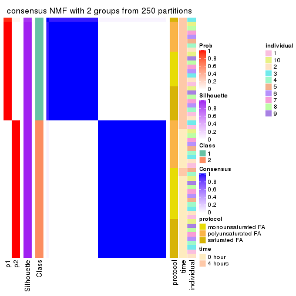</p>

</div>
<div id='tab-CV-NMF-consensus-heatmap-2'>
<pre><code class="r">consensus_heatmap(res, k = 3)
</code></pre>

<p>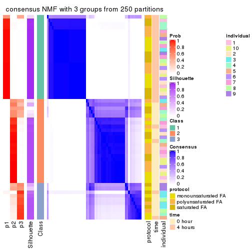</p>

</div>
<div id='tab-CV-NMF-consensus-heatmap-3'>
<pre><code class="r">consensus_heatmap(res, k = 4)
</code></pre>

<p>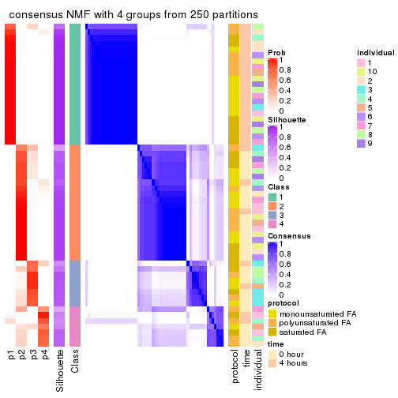</p>

</div>
<div id='tab-CV-NMF-consensus-heatmap-4'>
<pre><code class="r">consensus_heatmap(res, k = 5)
</code></pre>

<p>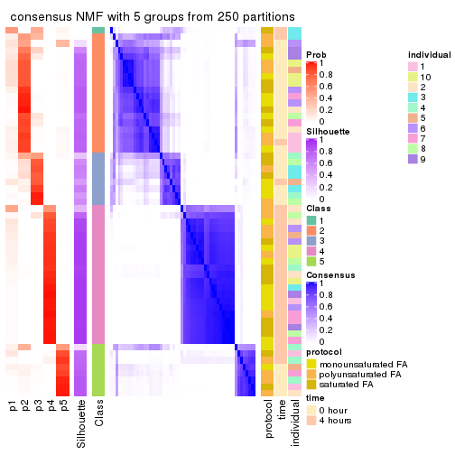</p>

</div>
<div id='tab-CV-NMF-consensus-heatmap-5'>
<pre><code class="r">consensus_heatmap(res, k = 6)
</code></pre>

<p>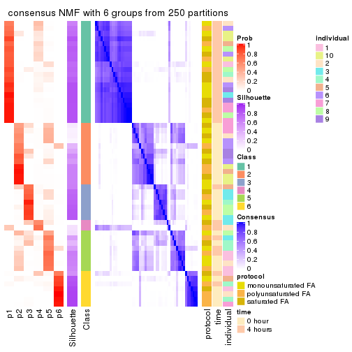</p>

</div>
</div>

Heatmaps for the membership of samples in all partitions to see how consistent they are:


<script>
$( function() {
	$( '#tabs-CV-NMF-membership-heatmap' ).tabs();
} );
</script>
<div id='tabs-CV-NMF-membership-heatmap'>
<ul>
<li><a href='#tab-CV-NMF-membership-heatmap-1'>k = 2</a></li>
<li><a href='#tab-CV-NMF-membership-heatmap-2'>k = 3</a></li>
<li><a href='#tab-CV-NMF-membership-heatmap-3'>k = 4</a></li>
<li><a href='#tab-CV-NMF-membership-heatmap-4'>k = 5</a></li>
<li><a href='#tab-CV-NMF-membership-heatmap-5'>k = 6</a></li>
</ul>
<div id='tab-CV-NMF-membership-heatmap-1'>
<pre><code class="r">membership_heatmap(res, k = 2)
</code></pre>

<p>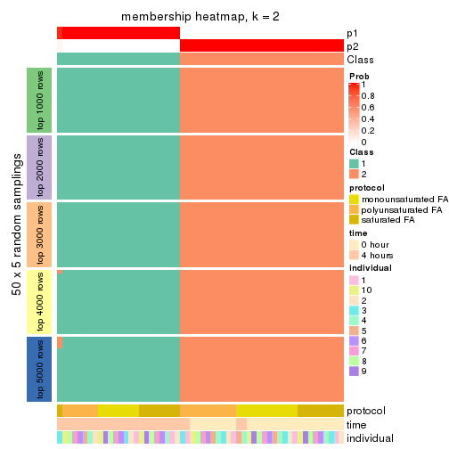</p>

</div>
<div id='tab-CV-NMF-membership-heatmap-2'>
<pre><code class="r">membership_heatmap(res, k = 3)
</code></pre>

<p>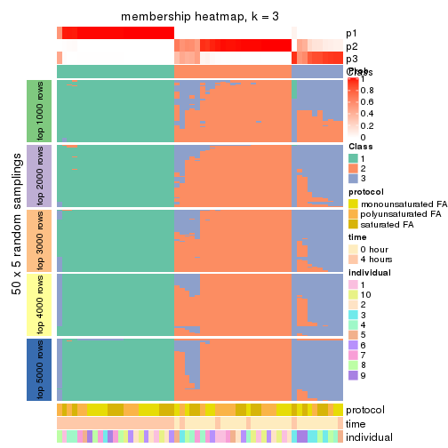</p>

</div>
<div id='tab-CV-NMF-membership-heatmap-3'>
<pre><code class="r">membership_heatmap(res, k = 4)
</code></pre>

<p>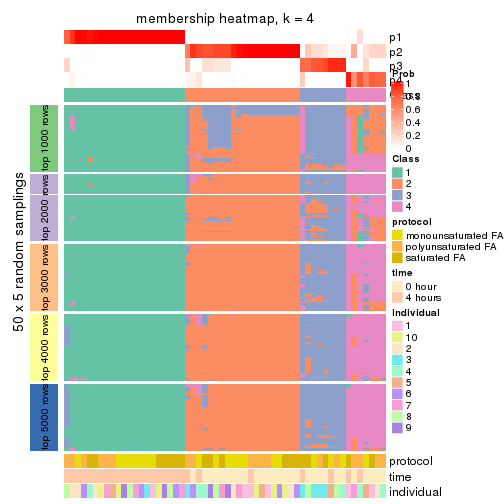</p>

</div>
<div id='tab-CV-NMF-membership-heatmap-4'>
<pre><code class="r">membership_heatmap(res, k = 5)
</code></pre>

<p>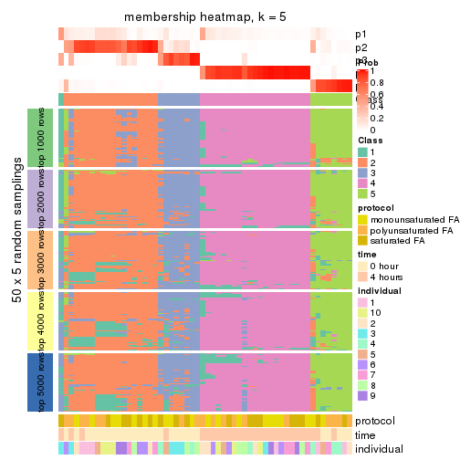</p>

</div>
<div id='tab-CV-NMF-membership-heatmap-5'>
<pre><code class="r">membership_heatmap(res, k = 6)
</code></pre>

<p>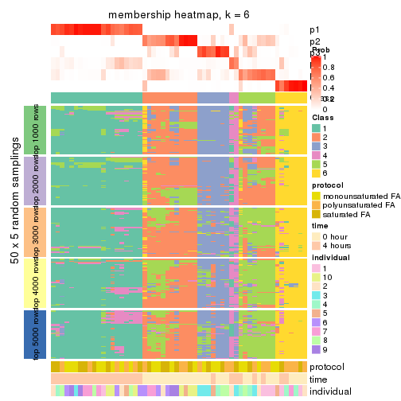</p>

</div>
</div>

As soon as we have had the classes for columns, we can look for signatures
which are significantly different between classes which can be candidate marks
for certain classes. Following are the heatmaps for signatures.


Signature heatmaps where rows are scaled:


<script>
$( function() {
	$( '#tabs-CV-NMF-get-signatures' ).tabs();
} );
</script>
<div id='tabs-CV-NMF-get-signatures'>
<ul>
<li><a href='#tab-CV-NMF-get-signatures-1'>k = 2</a></li>
<li><a href='#tab-CV-NMF-get-signatures-2'>k = 3</a></li>
<li><a href='#tab-CV-NMF-get-signatures-3'>k = 4</a></li>
<li><a href='#tab-CV-NMF-get-signatures-4'>k = 5</a></li>
<li><a href='#tab-CV-NMF-get-signatures-5'>k = 6</a></li>
</ul>
<div id='tab-CV-NMF-get-signatures-1'>
<pre><code class="r">get_signatures(res, k = 2)
</code></pre>

<p>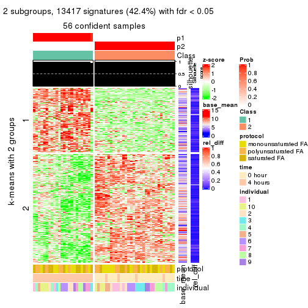</p>

</div>
<div id='tab-CV-NMF-get-signatures-2'>
<pre><code class="r">get_signatures(res, k = 3)
</code></pre>

<p>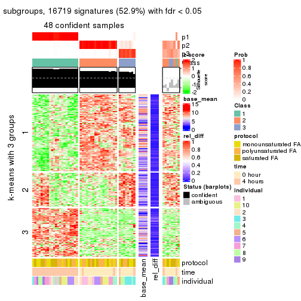</p>

</div>
<div id='tab-CV-NMF-get-signatures-3'>
<pre><code class="r">get_signatures(res, k = 4)
</code></pre>

<p>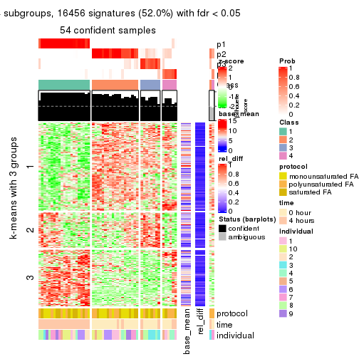</p>

</div>
<div id='tab-CV-NMF-get-signatures-4'>
<pre><code class="r">get_signatures(res, k = 5)
</code></pre>

<p>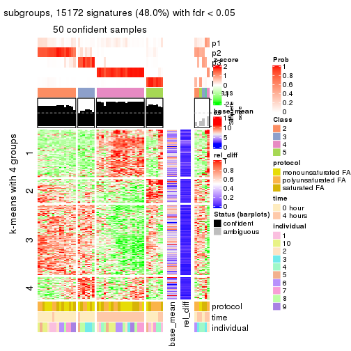</p>

</div>
<div id='tab-CV-NMF-get-signatures-5'>
<pre><code class="r">get_signatures(res, k = 6)
</code></pre>

<p>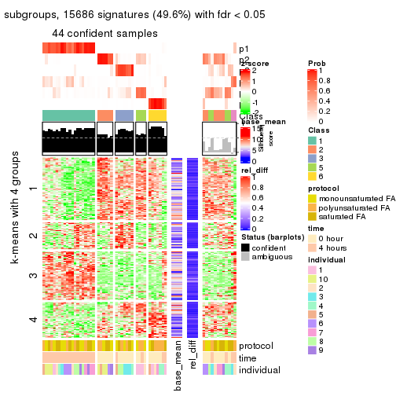</p>

</div>
</div>


Signature heatmaps where rows are not scaled:


<script>
$( function() {
	$( '#tabs-CV-NMF-get-signatures-no-scale' ).tabs();
} );
</script>
<div id='tabs-CV-NMF-get-signatures-no-scale'>
<ul>
<li><a href='#tab-CV-NMF-get-signatures-no-scale-1'>k = 2</a></li>
<li><a href='#tab-CV-NMF-get-signatures-no-scale-2'>k = 3</a></li>
<li><a href='#tab-CV-NMF-get-signatures-no-scale-3'>k = 4</a></li>
<li><a href='#tab-CV-NMF-get-signatures-no-scale-4'>k = 5</a></li>
<li><a href='#tab-CV-NMF-get-signatures-no-scale-5'>k = 6</a></li>
</ul>
<div id='tab-CV-NMF-get-signatures-no-scale-1'>
<pre><code class="r">get_signatures(res, k = 2, scale_rows = FALSE)
</code></pre>

<p>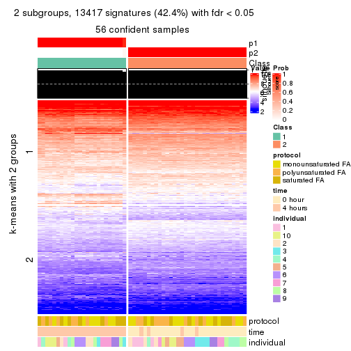</p>

</div>
<div id='tab-CV-NMF-get-signatures-no-scale-2'>
<pre><code class="r">get_signatures(res, k = 3, scale_rows = FALSE)
</code></pre>

<p>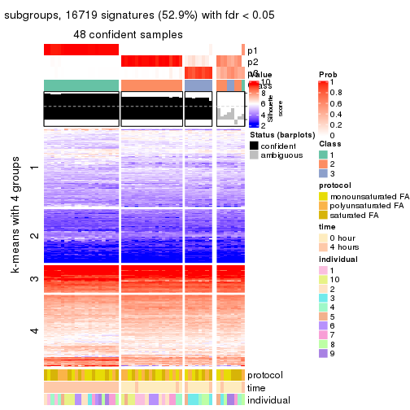</p>

</div>
<div id='tab-CV-NMF-get-signatures-no-scale-3'>
<pre><code class="r">get_signatures(res, k = 4, scale_rows = FALSE)
</code></pre>

<p>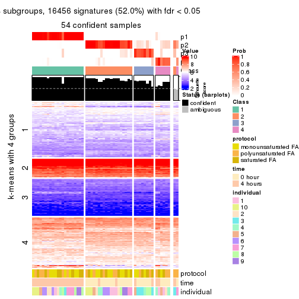</p>

</div>
<div id='tab-CV-NMF-get-signatures-no-scale-4'>
<pre><code class="r">get_signatures(res, k = 5, scale_rows = FALSE)
</code></pre>

<p>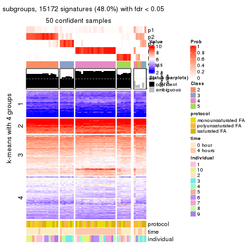</p>

</div>
<div id='tab-CV-NMF-get-signatures-no-scale-5'>
<pre><code class="r">get_signatures(res, k = 6, scale_rows = FALSE)
</code></pre>

<p>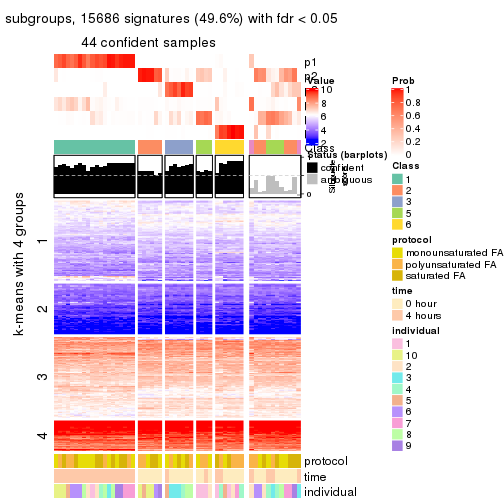</p>

</div>
</div>


Compare the overlap of signatures from different k:

```r
compare_signatures(res)
```

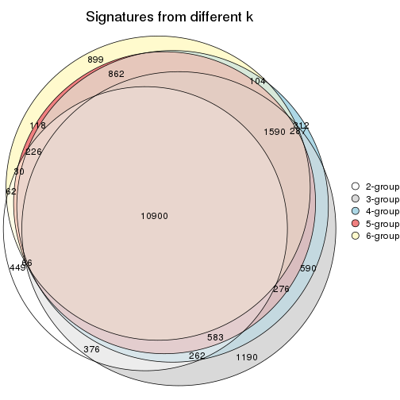

`get_signature()` returns a data frame invisibly. TO get the list of signatures, the function
call should be assigned to a variable explicitly. In following code, if `plot` argument is set
to `FALSE`, no heatmap is plotted while only the differential analysis is performed.

```r
# code only for demonstration
tb = get_signature(res, k = ..., plot = FALSE)
```

An example of the output of `tb` is:

```
#>   which_row         fdr    mean_1    mean_2 scaled_mean_1 scaled_mean_2 km
#> 1        38 0.042760348  8.373488  9.131774    -0.5533452     0.5164555  1
#> 2        40 0.018707592  7.106213  8.469186    -0.6173731     0.5762149  1
#> 3        55 0.019134737 10.221463 11.207825    -0.6159697     0.5749050  1
#> 4        59 0.006059896  5.921854  7.869574    -0.6899429     0.6439467  1
#> 5        60 0.018055526  8.928898 10.211722    -0.6204761     0.5791110  1
#> 6        98 0.009384629 15.714769 14.887706     0.6635654    -0.6193277  2
...
```

The columns in `tb` are:

1. `which_row`: row indices corresponding to the input matrix.
2. `fdr`: FDR for the differential test. 
3. `mean_x`: The mean value in group x.
4. `scaled_mean_x`: The mean value in group x after rows are scaled.
5. `km`: Row groups if k-means clustering is applied to rows.


UMAP plot which shows how samples are separated.


<script>
$( function() {
	$( '#tabs-CV-NMF-dimension-reduction' ).tabs();
} );
</script>
<div id='tabs-CV-NMF-dimension-reduction'>
<ul>
<li><a href='#tab-CV-NMF-dimension-reduction-1'>k = 2</a></li>
<li><a href='#tab-CV-NMF-dimension-reduction-2'>k = 3</a></li>
<li><a href='#tab-CV-NMF-dimension-reduction-3'>k = 4</a></li>
<li><a href='#tab-CV-NMF-dimension-reduction-4'>k = 5</a></li>
<li><a href='#tab-CV-NMF-dimension-reduction-5'>k = 6</a></li>
</ul>
<div id='tab-CV-NMF-dimension-reduction-1'>
<pre><code class="r">dimension_reduction(res, k = 2, method = &quot;UMAP&quot;)
</code></pre>

<p>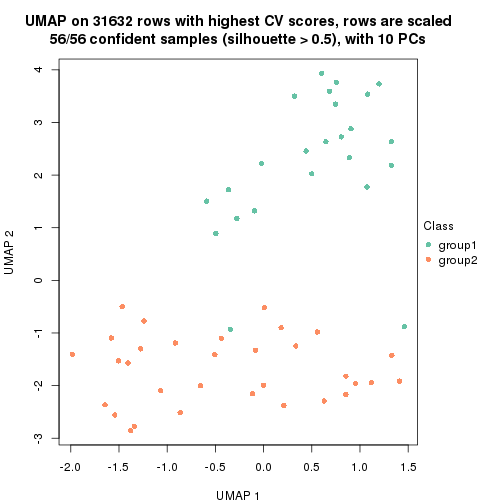</p>

</div>
<div id='tab-CV-NMF-dimension-reduction-2'>
<pre><code class="r">dimension_reduction(res, k = 3, method = &quot;UMAP&quot;)
</code></pre>

<p>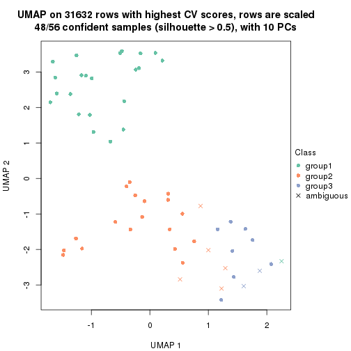</p>

</div>
<div id='tab-CV-NMF-dimension-reduction-3'>
<pre><code class="r">dimension_reduction(res, k = 4, method = &quot;UMAP&quot;)
</code></pre>

<p>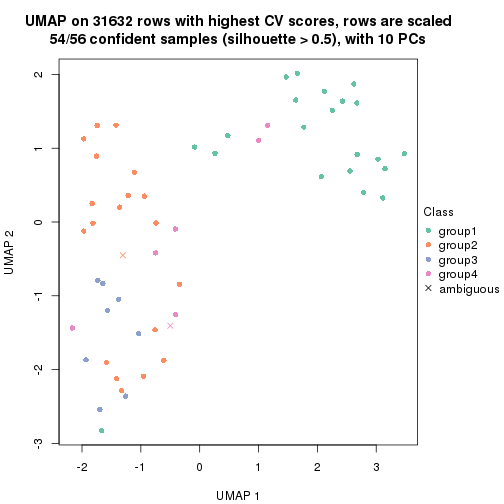</p>

</div>
<div id='tab-CV-NMF-dimension-reduction-4'>
<pre><code class="r">dimension_reduction(res, k = 5, method = &quot;UMAP&quot;)
</code></pre>

<p>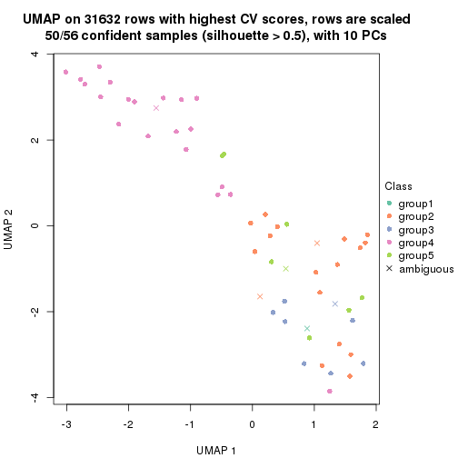</p>

</div>
<div id='tab-CV-NMF-dimension-reduction-5'>
<pre><code class="r">dimension_reduction(res, k = 6, method = &quot;UMAP&quot;)
</code></pre>

<p>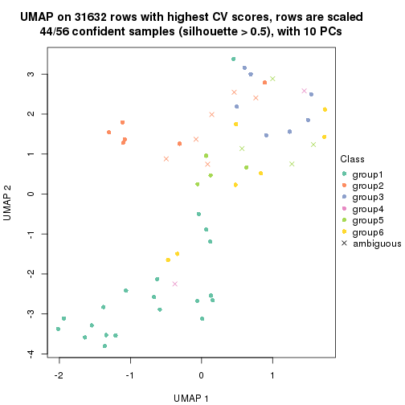</p>

</div>
</div>


Following heatmap shows how subgroups are split when increasing `k`:

```r
collect_classes(res)
```

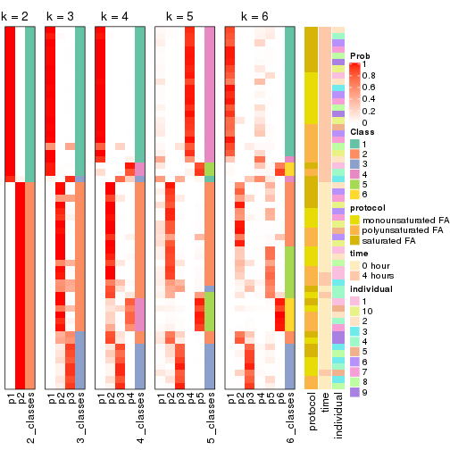


Test correlation between subgroups and known annotations. If the known
annotation is numeric, one-way ANOVA test is applied, and if the known
annotation is discrete, chi-squared contingency table test is applied.

```r
test_to_known_factors(res)
```

```
#>         n protocol(p)  time(p) individual(p) k
#> CV:NMF 56       0.757 5.27e-10        0.9930 2
#> CV:NMF 48       0.760 2.78e-08        0.0446 3
#> CV:NMF 54       0.933 9.51e-08        0.0750 4
#> CV:NMF 50       0.761 4.41e-08        0.1620 5
#> CV:NMF 44       0.793 2.15e-06        0.0264 6
```


If matrix rows can be associated to genes, consider to use `functional_enrichment(res,
...)` to perform function enrichment for the signature genes. See [this vignette](http://bioconductor.org/packages/devel/bioc/vignettes/cola/inst/doc/functional_enrichment.html) for more detailed explanations.


 

---------------------------------------------------


### MAD:hclust**


The object with results only for a single top-value method and a single partition method 
can be extracted as:

```r
res = res_list["MAD", "hclust"]
# you can also extract it by
# res = res_list["MAD:hclust"]
```

A summary of `res` and all the functions that can be applied to it:

```r
res
```

```
#> A 'ConsensusPartition' object with k = 2, 3, 4, 5, 6.
#>   On a matrix with 31632 rows and 56 columns.
#>   Top rows (1000, 2000, 3000, 4000, 5000) are extracted by 'MAD' method.
#>   Subgroups are detected by 'hclust' method.
#>   Performed in total 1250 partitions by row resampling.
#>   Best k for subgroups seems to be 2.
#> 
#> Following methods can be applied to this 'ConsensusPartition' object:
#>  [1] "cola_report"             "collect_classes"         "collect_plots"          
#>  [4] "collect_stats"           "colnames"                "compare_signatures"     
#>  [7] "consensus_heatmap"       "dimension_reduction"     "functional_enrichment"  
#> [10] "get_anno_col"            "get_anno"                "get_classes"            
#> [13] "get_consensus"           "get_matrix"              "get_membership"         
#> [16] "get_param"               "get_signatures"          "get_stats"              
#> [19] "is_best_k"               "is_stable_k"             "membership_heatmap"     
#> [22] "ncol"                    "nrow"                    "plot_ecdf"              
#> [25] "rownames"                "select_partition_number" "show"                   
#> [28] "suggest_best_k"          "test_to_known_factors"
```

`collect_plots()` function collects all the plots made from `res` for all `k` (number of partitions)
into one single page to provide an easy and fast comparison between different `k`.

```r
collect_plots(res)
```

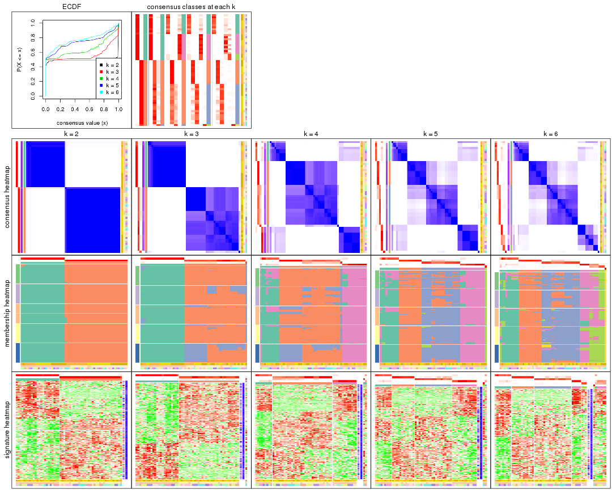

The plots are:

- The first row: a plot of the ECDF (empirical cumulative distribution
  function) curves of the consensus matrix for each `k` and the heatmap of
  predicted classes for each `k`.
- The second row: heatmaps of the consensus matrix for each `k`.
- The third row: heatmaps of the membership matrix for each `k`.
- The fouth row: heatmaps of the signatures for each `k`.

All the plots in panels can be made by individual functions and they are
plotted later in this section.

`select_partition_number()` produces several plots showing different
statistics for choosing "optimized" `k`. There are following statistics:

- ECDF curves of the consensus matrix for each `k`;
- 1-PAC. [The PAC
  score](https://en.wikipedia.org/wiki/Consensus_clustering#Over-interpretation_potential_of_consensus_clustering)
  measures the proportion of the ambiguous subgrouping.
- Mean silhouette score.
- Concordance. The mean probability of fiting the consensus class ids in all
  partitions.
- Area increased. Denote $A_k$ as the area under the ECDF curve for current
  `k`, the area increased is defined as $A_k - A_{k-1}$.
- Rand index. The percent of pairs of samples that are both in a same cluster
  or both are not in a same cluster in the partition of k and k-1.
- Jaccard index. The ratio of pairs of samples are both in a same cluster in
  the partition of k and k-1 and the pairs of samples are both in a same
  cluster in the partition k or k-1.

The detailed explanations of these statistics can be found in [the _cola_
vignette](http://bioconductor.org/packages/devel/bioc/vignettes/cola/inst/doc/cola.html#toc_13).

Generally speaking, lower PAC score, higher mean silhouette score or higher
concordance corresponds to better partition. Rand index and Jaccard index
measure how similar the current partition is compared to partition with `k-1`.
If they are too similar, we won't accept `k` is better than `k-1`.

```r
select_partition_number(res)
```

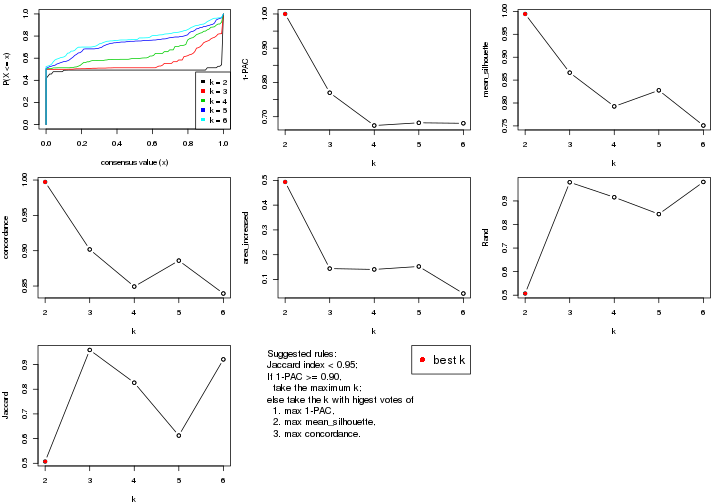

The numeric values for all these statistics can be obtained by `get_stats()`.

```r
get_stats(res)
```

```
#>   k 1-PAC mean_silhouette concordance area_increased  Rand Jaccard
#> 2 2 1.000           0.994       0.997         0.4935 0.507   0.507
#> 3 3 0.770           0.866       0.902         0.1439 0.979   0.959
#> 4 4 0.674           0.793       0.849         0.1405 0.916   0.826
#> 5 5 0.682           0.828       0.886         0.1524 0.844   0.612
#> 6 6 0.681           0.751       0.839         0.0433 0.981   0.921
```

`suggest_best_k()` suggests the best $k$ based on these statistics. The rules are as follows:

- All $k$ with Jaccard index larger than 0.95 are removed because increasing
  $k$ does not provide enough extra information. If all $k$ are removed, it is
  marked as no subgroup is detected.
- For all $k$ with 1-PAC score larger than 0.9, the maximal $k$ is taken as
  the best $k$, and other $k$ are marked as optional $k$.
- If it does not fit the second rule. The $k$ with the maximal vote of the
  highest 1-PAC score, highest mean silhouette, and highest concordance is
  taken as the best $k$.

```r
suggest_best_k(res)
```

```
#> [1] 2
```


Following shows the table of the partitions (You need to click the **show/hide
code output** link to see it). The membership matrix (columns with name `p*`)
is inferred by
[`clue::cl_consensus()`](https://www.rdocumentation.org/link/cl_consensus?package=clue)
function with the `SE` method. Basically the value in the membership matrix
represents the probability to belong to a certain group. The finall class
label for an item is determined with the group with highest probability it
belongs to.

In `get_classes()` function, the entropy is calculated from the membership
matrix and the silhouette score is calculated from the consensus matrix.


<script>
$( function() {
	$( '#tabs-MAD-hclust-get-classes' ).tabs();
} );
</script>
<div id='tabs-MAD-hclust-get-classes'>
<ul>
<li><a href='#tab-MAD-hclust-get-classes-1'>k = 2</a></li>
<li><a href='#tab-MAD-hclust-get-classes-2'>k = 3</a></li>
<li><a href='#tab-MAD-hclust-get-classes-3'>k = 4</a></li>
<li><a href='#tab-MAD-hclust-get-classes-4'>k = 5</a></li>
<li><a href='#tab-MAD-hclust-get-classes-5'>k = 6</a></li>
</ul>

<div id='tab-MAD-hclust-get-classes-1'>
<p><a id='tab-MAD-hclust-get-classes-1-a' style='color:#0366d6' href='#'>show/hide code output</a></p>
<pre><code class="r">cbind(get_classes(res, k = 2), get_membership(res, k = 2))
</code></pre>

<pre><code>#&gt;           class entropy silhouette    p1    p2
#&gt; GSM790742     2  0.0000      0.997 0.000 1.000
#&gt; GSM790744     2  0.0000      0.997 0.000 1.000
#&gt; GSM790754     2  0.0000      0.997 0.000 1.000
#&gt; GSM790756     2  0.0000      0.997 0.000 1.000
#&gt; GSM790768     2  0.0000      0.997 0.000 1.000
#&gt; GSM790774     2  0.0000      0.997 0.000 1.000
#&gt; GSM790778     2  0.0000      0.997 0.000 1.000
#&gt; GSM790784     2  0.0000      0.997 0.000 1.000
#&gt; GSM790790     2  0.0000      0.997 0.000 1.000
#&gt; GSM790743     1  0.0000      0.997 1.000 0.000
#&gt; GSM790745     1  0.0000      0.997 1.000 0.000
#&gt; GSM790755     2  0.4562      0.893 0.096 0.904
#&gt; GSM790757     1  0.0000      0.997 1.000 0.000
#&gt; GSM790769     1  0.0000      0.997 1.000 0.000
#&gt; GSM790775     1  0.0000      0.997 1.000 0.000
#&gt; GSM790779     1  0.1184      0.984 0.984 0.016
#&gt; GSM790785     1  0.0000      0.997 1.000 0.000
#&gt; GSM790791     1  0.0000      0.997 1.000 0.000
#&gt; GSM790738     2  0.0000      0.997 0.000 1.000
#&gt; GSM790746     2  0.0000      0.997 0.000 1.000
#&gt; GSM790752     2  0.0000      0.997 0.000 1.000
#&gt; GSM790758     2  0.0000      0.997 0.000 1.000
#&gt; GSM790764     2  0.0000      0.997 0.000 1.000
#&gt; GSM790766     2  0.0000      0.997 0.000 1.000
#&gt; GSM790772     2  0.0000      0.997 0.000 1.000
#&gt; GSM790782     2  0.0000      0.997 0.000 1.000
#&gt; GSM790786     2  0.0000      0.997 0.000 1.000
#&gt; GSM790792     2  0.0000      0.997 0.000 1.000
#&gt; GSM790739     1  0.0000      0.997 1.000 0.000
#&gt; GSM790747     1  0.0000      0.997 1.000 0.000
#&gt; GSM790753     1  0.0000      0.997 1.000 0.000
#&gt; GSM790759     2  0.0000      0.997 0.000 1.000
#&gt; GSM790765     2  0.0000      0.997 0.000 1.000
#&gt; GSM790767     1  0.0000      0.997 1.000 0.000
#&gt; GSM790773     1  0.0000      0.997 1.000 0.000
#&gt; GSM790783     1  0.0000      0.997 1.000 0.000
#&gt; GSM790787     1  0.0000      0.997 1.000 0.000
#&gt; GSM790793     1  0.0000      0.997 1.000 0.000
#&gt; GSM790740     2  0.0000      0.997 0.000 1.000
#&gt; GSM790748     2  0.0000      0.997 0.000 1.000
#&gt; GSM790750     2  0.0000      0.997 0.000 1.000
#&gt; GSM790760     2  0.0000      0.997 0.000 1.000
#&gt; GSM790762     2  0.0000      0.997 0.000 1.000
#&gt; GSM790770     2  0.0000      0.997 0.000 1.000
#&gt; GSM790776     2  0.0000      0.997 0.000 1.000
#&gt; GSM790780     2  0.0000      0.997 0.000 1.000
#&gt; GSM790788     2  0.0000      0.997 0.000 1.000
#&gt; GSM790741     2  0.0000      0.997 0.000 1.000
#&gt; GSM790749     1  0.0000      0.997 1.000 0.000
#&gt; GSM790751     2  0.0000      0.997 0.000 1.000
#&gt; GSM790761     1  0.0000      0.997 1.000 0.000
#&gt; GSM790763     1  0.0672      0.991 0.992 0.008
#&gt; GSM790771     1  0.0000      0.997 1.000 0.000
#&gt; GSM790777     1  0.0000      0.997 1.000 0.000
#&gt; GSM790781     1  0.2043      0.968 0.968 0.032
#&gt; GSM790789     1  0.0000      0.997 1.000 0.000
</code></pre>

<script>
$('#tab-MAD-hclust-get-classes-1-a').parent().next().next().hide();
$('#tab-MAD-hclust-get-classes-1-a').click(function(){
  $('#tab-MAD-hclust-get-classes-1-a').parent().next().next().toggle();
  return(false);
});
</script>
</div>

<div id='tab-MAD-hclust-get-classes-2'>
<p><a id='tab-MAD-hclust-get-classes-2-a' style='color:#0366d6' href='#'>show/hide code output</a></p>
<pre><code class="r">cbind(get_classes(res, k = 3), get_membership(res, k = 3))
</code></pre>

<pre><code>#&gt;           class entropy silhouette    p1    p2    p3
#&gt; GSM790742     2  0.4002      0.819 0.000 0.840 0.160
#&gt; GSM790744     2  0.4002      0.819 0.000 0.840 0.160
#&gt; GSM790754     2  0.2261      0.837 0.000 0.932 0.068
#&gt; GSM790756     2  0.3551      0.801 0.000 0.868 0.132
#&gt; GSM790768     2  0.0000      0.850 0.000 1.000 0.000
#&gt; GSM790774     2  0.2959      0.821 0.000 0.900 0.100
#&gt; GSM790778     2  0.4346      0.753 0.000 0.816 0.184
#&gt; GSM790784     2  0.4291      0.757 0.000 0.820 0.180
#&gt; GSM790790     2  0.4002      0.819 0.000 0.840 0.160
#&gt; GSM790743     1  0.0000      0.987 1.000 0.000 0.000
#&gt; GSM790745     1  0.0000      0.987 1.000 0.000 0.000
#&gt; GSM790755     3  0.4002      0.000 0.000 0.160 0.840
#&gt; GSM790757     1  0.0000      0.987 1.000 0.000 0.000
#&gt; GSM790769     1  0.0000      0.987 1.000 0.000 0.000
#&gt; GSM790775     1  0.0000      0.987 1.000 0.000 0.000
#&gt; GSM790779     1  0.3192      0.888 0.888 0.000 0.112
#&gt; GSM790785     1  0.0000      0.987 1.000 0.000 0.000
#&gt; GSM790791     1  0.0000      0.987 1.000 0.000 0.000
#&gt; GSM790738     2  0.4002      0.819 0.000 0.840 0.160
#&gt; GSM790746     2  0.4002      0.819 0.000 0.840 0.160
#&gt; GSM790752     2  0.2261      0.837 0.000 0.932 0.068
#&gt; GSM790758     2  0.3551      0.801 0.000 0.868 0.132
#&gt; GSM790764     2  0.1411      0.851 0.000 0.964 0.036
#&gt; GSM790766     2  0.0000      0.850 0.000 1.000 0.000
#&gt; GSM790772     2  0.2959      0.821 0.000 0.900 0.100
#&gt; GSM790782     2  0.4654      0.724 0.000 0.792 0.208
#&gt; GSM790786     2  0.4291      0.757 0.000 0.820 0.180
#&gt; GSM790792     2  0.4002      0.819 0.000 0.840 0.160
#&gt; GSM790739     1  0.0000      0.987 1.000 0.000 0.000
#&gt; GSM790747     1  0.0000      0.987 1.000 0.000 0.000
#&gt; GSM790753     1  0.0237      0.985 0.996 0.000 0.004
#&gt; GSM790759     2  0.4002      0.819 0.000 0.840 0.160
#&gt; GSM790765     2  0.1411      0.851 0.000 0.964 0.036
#&gt; GSM790767     1  0.0000      0.987 1.000 0.000 0.000
#&gt; GSM790773     1  0.0000      0.987 1.000 0.000 0.000
#&gt; GSM790783     1  0.0000      0.987 1.000 0.000 0.000
#&gt; GSM790787     1  0.0237      0.985 0.996 0.000 0.004
#&gt; GSM790793     1  0.0000      0.987 1.000 0.000 0.000
#&gt; GSM790740     2  0.4002      0.819 0.000 0.840 0.160
#&gt; GSM790748     2  0.4002      0.819 0.000 0.840 0.160
#&gt; GSM790750     2  0.2261      0.837 0.000 0.932 0.068
#&gt; GSM790760     2  0.1529      0.844 0.000 0.960 0.040
#&gt; GSM790762     2  0.4002      0.819 0.000 0.840 0.160
#&gt; GSM790770     2  0.0000      0.850 0.000 1.000 0.000
#&gt; GSM790776     2  0.0424      0.850 0.000 0.992 0.008
#&gt; GSM790780     2  0.4750      0.713 0.000 0.784 0.216
#&gt; GSM790788     2  0.4002      0.819 0.000 0.840 0.160
#&gt; GSM790741     2  0.4002      0.819 0.000 0.840 0.160
#&gt; GSM790749     1  0.0000      0.987 1.000 0.000 0.000
#&gt; GSM790751     2  0.2261      0.837 0.000 0.932 0.068
#&gt; GSM790761     1  0.0000      0.987 1.000 0.000 0.000
#&gt; GSM790763     1  0.1643      0.953 0.956 0.000 0.044
#&gt; GSM790771     1  0.0000      0.987 1.000 0.000 0.000
#&gt; GSM790777     1  0.0000      0.987 1.000 0.000 0.000
#&gt; GSM790781     1  0.3482      0.871 0.872 0.000 0.128
#&gt; GSM790789     1  0.0000      0.987 1.000 0.000 0.000
</code></pre>

<script>
$('#tab-MAD-hclust-get-classes-2-a').parent().next().next().hide();
$('#tab-MAD-hclust-get-classes-2-a').click(function(){
  $('#tab-MAD-hclust-get-classes-2-a').parent().next().next().toggle();
  return(false);
});
</script>
</div>

<div id='tab-MAD-hclust-get-classes-3'>
<p><a id='tab-MAD-hclust-get-classes-3-a' style='color:#0366d6' href='#'>show/hide code output</a></p>
<pre><code class="r">cbind(get_classes(res, k = 4), get_membership(res, k = 4))
</code></pre>

<pre><code>#&gt;           class entropy silhouette    p1    p2    p3    p4
#&gt; GSM790742     2  0.0188      0.776 0.000 0.996 0.004 0.000
#&gt; GSM790744     2  0.0000      0.777 0.000 1.000 0.000 0.000
#&gt; GSM790754     2  0.4250      0.807 0.000 0.724 0.276 0.000
#&gt; GSM790756     2  0.4605      0.772 0.000 0.664 0.336 0.000
#&gt; GSM790768     2  0.3649      0.821 0.000 0.796 0.204 0.000
#&gt; GSM790774     2  0.4431      0.793 0.000 0.696 0.304 0.000
#&gt; GSM790778     2  0.4843      0.717 0.000 0.604 0.396 0.000
#&gt; GSM790784     2  0.4817      0.724 0.000 0.612 0.388 0.000
#&gt; GSM790790     2  0.0000      0.777 0.000 1.000 0.000 0.000
#&gt; GSM790743     4  0.0000      0.949 0.000 0.000 0.000 1.000
#&gt; GSM790745     4  0.3123      0.833 0.156 0.000 0.000 0.844
#&gt; GSM790755     3  0.1474      0.000 0.052 0.000 0.948 0.000
#&gt; GSM790757     4  0.3123      0.833 0.156 0.000 0.000 0.844
#&gt; GSM790769     4  0.0469      0.948 0.012 0.000 0.000 0.988
#&gt; GSM790775     1  0.3569      0.860 0.804 0.000 0.000 0.196
#&gt; GSM790779     1  0.1452      0.728 0.956 0.000 0.008 0.036
#&gt; GSM790785     1  0.3569      0.860 0.804 0.000 0.000 0.196
#&gt; GSM790791     4  0.0000      0.949 0.000 0.000 0.000 1.000
#&gt; GSM790738     2  0.0000      0.777 0.000 1.000 0.000 0.000
#&gt; GSM790746     2  0.0188      0.776 0.000 0.996 0.004 0.000
#&gt; GSM790752     2  0.4250      0.807 0.000 0.724 0.276 0.000
#&gt; GSM790758     2  0.4605      0.772 0.000 0.664 0.336 0.000
#&gt; GSM790764     2  0.3569      0.822 0.000 0.804 0.196 0.000
#&gt; GSM790766     2  0.3649      0.821 0.000 0.796 0.204 0.000
#&gt; GSM790772     2  0.4431      0.793 0.000 0.696 0.304 0.000
#&gt; GSM790782     2  0.4907      0.687 0.000 0.580 0.420 0.000
#&gt; GSM790786     2  0.4817      0.724 0.000 0.612 0.388 0.000
#&gt; GSM790792     2  0.0000      0.777 0.000 1.000 0.000 0.000
#&gt; GSM790739     4  0.3123      0.833 0.156 0.000 0.000 0.844
#&gt; GSM790747     4  0.0469      0.948 0.012 0.000 0.000 0.988
#&gt; GSM790753     1  0.3311      0.852 0.828 0.000 0.000 0.172
#&gt; GSM790759     2  0.0188      0.776 0.000 0.996 0.004 0.000
#&gt; GSM790765     2  0.3688      0.822 0.000 0.792 0.208 0.000
#&gt; GSM790767     4  0.0469      0.948 0.012 0.000 0.000 0.988
#&gt; GSM790773     1  0.3569      0.860 0.804 0.000 0.000 0.196
#&gt; GSM790783     1  0.4585      0.725 0.668 0.000 0.000 0.332
#&gt; GSM790787     1  0.3311      0.852 0.828 0.000 0.000 0.172
#&gt; GSM790793     4  0.0000      0.949 0.000 0.000 0.000 1.000
#&gt; GSM790740     2  0.0000      0.777 0.000 1.000 0.000 0.000
#&gt; GSM790748     2  0.0188      0.776 0.000 0.996 0.004 0.000
#&gt; GSM790750     2  0.4250      0.807 0.000 0.724 0.276 0.000
#&gt; GSM790760     2  0.4040      0.814 0.000 0.752 0.248 0.000
#&gt; GSM790762     2  0.0000      0.777 0.000 1.000 0.000 0.000
#&gt; GSM790770     2  0.3649      0.821 0.000 0.796 0.204 0.000
#&gt; GSM790776     2  0.3726      0.821 0.000 0.788 0.212 0.000
#&gt; GSM790780     2  0.4925      0.676 0.000 0.572 0.428 0.000
#&gt; GSM790788     2  0.0000      0.777 0.000 1.000 0.000 0.000
#&gt; GSM790741     2  0.0000      0.777 0.000 1.000 0.000 0.000
#&gt; GSM790749     4  0.0469      0.948 0.012 0.000 0.000 0.988
#&gt; GSM790751     2  0.4250      0.807 0.000 0.724 0.276 0.000
#&gt; GSM790761     4  0.0000      0.949 0.000 0.000 0.000 1.000
#&gt; GSM790763     1  0.4992      0.176 0.524 0.000 0.000 0.476
#&gt; GSM790771     4  0.0469      0.948 0.012 0.000 0.000 0.988
#&gt; GSM790777     1  0.3569      0.860 0.804 0.000 0.000 0.196
#&gt; GSM790781     1  0.0592      0.678 0.984 0.000 0.016 0.000
#&gt; GSM790789     4  0.0000      0.949 0.000 0.000 0.000 1.000
</code></pre>

<script>
$('#tab-MAD-hclust-get-classes-3-a').parent().next().next().hide();
$('#tab-MAD-hclust-get-classes-3-a').click(function(){
  $('#tab-MAD-hclust-get-classes-3-a').parent().next().next().toggle();
  return(false);
});
</script>
</div>

<div id='tab-MAD-hclust-get-classes-4'>
<p><a id='tab-MAD-hclust-get-classes-4-a' style='color:#0366d6' href='#'>show/hide code output</a></p>
<pre><code class="r">cbind(get_classes(res, k = 5), get_membership(res, k = 5))
</code></pre>

<pre><code>#&gt;           class entropy silhouette    p1    p2    p3    p4    p5
#&gt; GSM790742     2  0.0963      0.959 0.000 0.964 0.036 0.000 0.000
#&gt; GSM790744     2  0.1341      0.958 0.000 0.944 0.056 0.000 0.000
#&gt; GSM790754     3  0.2377      0.845 0.000 0.128 0.872 0.000 0.000
#&gt; GSM790756     3  0.1608      0.830 0.000 0.072 0.928 0.000 0.000
#&gt; GSM790768     3  0.3816      0.753 0.000 0.304 0.696 0.000 0.000
#&gt; GSM790774     3  0.2179      0.841 0.000 0.112 0.888 0.000 0.000
#&gt; GSM790778     3  0.1522      0.773 0.000 0.012 0.944 0.000 0.044
#&gt; GSM790784     3  0.2153      0.802 0.000 0.040 0.916 0.000 0.044
#&gt; GSM790790     2  0.0510      0.961 0.000 0.984 0.016 0.000 0.000
#&gt; GSM790743     4  0.0000      0.933 0.000 0.000 0.000 1.000 0.000
#&gt; GSM790745     4  0.2806      0.832 0.152 0.004 0.000 0.844 0.000
#&gt; GSM790755     5  0.0290      0.000 0.000 0.000 0.008 0.000 0.992
#&gt; GSM790757     4  0.2806      0.832 0.152 0.004 0.000 0.844 0.000
#&gt; GSM790769     4  0.1121      0.928 0.044 0.000 0.000 0.956 0.000
#&gt; GSM790775     1  0.2732      0.851 0.840 0.000 0.000 0.160 0.000
#&gt; GSM790779     1  0.1869      0.720 0.936 0.008 0.000 0.028 0.028
#&gt; GSM790785     1  0.2732      0.851 0.840 0.000 0.000 0.160 0.000
#&gt; GSM790791     4  0.0000      0.933 0.000 0.000 0.000 1.000 0.000
#&gt; GSM790738     2  0.1608      0.950 0.000 0.928 0.072 0.000 0.000
#&gt; GSM790746     2  0.1043      0.959 0.000 0.960 0.040 0.000 0.000
#&gt; GSM790752     3  0.2377      0.845 0.000 0.128 0.872 0.000 0.000
#&gt; GSM790758     3  0.1544      0.829 0.000 0.068 0.932 0.000 0.000
#&gt; GSM790764     3  0.4138      0.626 0.000 0.384 0.616 0.000 0.000
#&gt; GSM790766     3  0.3816      0.753 0.000 0.304 0.696 0.000 0.000
#&gt; GSM790772     3  0.2179      0.841 0.000 0.112 0.888 0.000 0.000
#&gt; GSM790782     3  0.1571      0.753 0.000 0.004 0.936 0.000 0.060
#&gt; GSM790786     3  0.2153      0.802 0.000 0.040 0.916 0.000 0.044
#&gt; GSM790792     2  0.0510      0.961 0.000 0.984 0.016 0.000 0.000
#&gt; GSM790739     4  0.2806      0.832 0.152 0.004 0.000 0.844 0.000
#&gt; GSM790747     4  0.1121      0.928 0.044 0.000 0.000 0.956 0.000
#&gt; GSM790753     1  0.2471      0.842 0.864 0.000 0.000 0.136 0.000
#&gt; GSM790759     2  0.1270      0.960 0.000 0.948 0.052 0.000 0.000
#&gt; GSM790765     3  0.3966      0.695 0.000 0.336 0.664 0.000 0.000
#&gt; GSM790767     4  0.1121      0.928 0.044 0.000 0.000 0.956 0.000
#&gt; GSM790773     1  0.2732      0.851 0.840 0.000 0.000 0.160 0.000
#&gt; GSM790783     1  0.3774      0.721 0.704 0.000 0.000 0.296 0.000
#&gt; GSM790787     1  0.2471      0.842 0.864 0.000 0.000 0.136 0.000
#&gt; GSM790793     4  0.0000      0.933 0.000 0.000 0.000 1.000 0.000
#&gt; GSM790740     2  0.1608      0.950 0.000 0.928 0.072 0.000 0.000
#&gt; GSM790748     2  0.0963      0.959 0.000 0.964 0.036 0.000 0.000
#&gt; GSM790750     3  0.2377      0.845 0.000 0.128 0.872 0.000 0.000
#&gt; GSM790760     3  0.3612      0.775 0.000 0.268 0.732 0.000 0.000
#&gt; GSM790762     2  0.0510      0.961 0.000 0.984 0.016 0.000 0.000
#&gt; GSM790770     3  0.3816      0.753 0.000 0.304 0.696 0.000 0.000
#&gt; GSM790776     3  0.3752      0.765 0.000 0.292 0.708 0.000 0.000
#&gt; GSM790780     3  0.1704      0.747 0.000 0.004 0.928 0.000 0.068
#&gt; GSM790788     2  0.0510      0.961 0.000 0.984 0.016 0.000 0.000
#&gt; GSM790741     2  0.1608      0.950 0.000 0.928 0.072 0.000 0.000
#&gt; GSM790749     4  0.1121      0.928 0.044 0.000 0.000 0.956 0.000
#&gt; GSM790751     3  0.2377      0.845 0.000 0.128 0.872 0.000 0.000
#&gt; GSM790761     4  0.0000      0.933 0.000 0.000 0.000 1.000 0.000
#&gt; GSM790763     1  0.4698      0.149 0.520 0.004 0.000 0.468 0.008
#&gt; GSM790771     4  0.1121      0.928 0.044 0.000 0.000 0.956 0.000
#&gt; GSM790777     1  0.2732      0.851 0.840 0.000 0.000 0.160 0.000
#&gt; GSM790781     1  0.1605      0.669 0.944 0.012 0.004 0.000 0.040
#&gt; GSM790789     4  0.0000      0.933 0.000 0.000 0.000 1.000 0.000
</code></pre>

<script>
$('#tab-MAD-hclust-get-classes-4-a').parent().next().next().hide();
$('#tab-MAD-hclust-get-classes-4-a').click(function(){
  $('#tab-MAD-hclust-get-classes-4-a').parent().next().next().toggle();
  return(false);
});
</script>
</div>

<div id='tab-MAD-hclust-get-classes-5'>
<p><a id='tab-MAD-hclust-get-classes-5-a' style='color:#0366d6' href='#'>show/hide code output</a></p>
<pre><code class="r">cbind(get_classes(res, k = 6), get_membership(res, k = 6))
</code></pre>

<pre><code>#&gt;           class entropy silhouette    p1    p2    p3    p4    p5    p6
#&gt; GSM790742     2  0.0806      0.938 0.000 0.972 0.020 0.000 0.008 0.000
#&gt; GSM790744     2  0.1141      0.942 0.000 0.948 0.052 0.000 0.000 0.000
#&gt; GSM790754     3  0.1957      0.839 0.000 0.112 0.888 0.000 0.000 0.000
#&gt; GSM790756     3  0.1867      0.824 0.000 0.064 0.916 0.000 0.020 0.000
#&gt; GSM790768     3  0.3351      0.753 0.000 0.288 0.712 0.000 0.000 0.000
#&gt; GSM790774     3  0.1765      0.836 0.000 0.096 0.904 0.000 0.000 0.000
#&gt; GSM790778     3  0.2119      0.762 0.000 0.008 0.912 0.000 0.044 0.036
#&gt; GSM790784     3  0.2570      0.790 0.000 0.032 0.892 0.000 0.040 0.036
#&gt; GSM790790     2  0.1265      0.937 0.000 0.948 0.008 0.000 0.044 0.000
#&gt; GSM790743     4  0.3857      0.260 0.000 0.000 0.000 0.532 0.468 0.000
#&gt; GSM790745     5  0.2357      1.000 0.012 0.000 0.000 0.116 0.872 0.000
#&gt; GSM790755     6  0.0000      0.000 0.000 0.000 0.000 0.000 0.000 1.000
#&gt; GSM790757     5  0.2357      1.000 0.012 0.000 0.000 0.116 0.872 0.000
#&gt; GSM790769     4  0.0363      0.667 0.012 0.000 0.000 0.988 0.000 0.000
#&gt; GSM790775     1  0.3278      0.834 0.808 0.000 0.000 0.152 0.040 0.000
#&gt; GSM790779     1  0.0260      0.731 0.992 0.000 0.000 0.000 0.008 0.000
#&gt; GSM790785     1  0.3278      0.834 0.808 0.000 0.000 0.152 0.040 0.000
#&gt; GSM790791     4  0.3765      0.434 0.000 0.000 0.000 0.596 0.404 0.000
#&gt; GSM790738     2  0.1387      0.934 0.000 0.932 0.068 0.000 0.000 0.000
#&gt; GSM790746     2  0.0891      0.938 0.000 0.968 0.024 0.000 0.008 0.000
#&gt; GSM790752     3  0.1957      0.839 0.000 0.112 0.888 0.000 0.000 0.000
#&gt; GSM790758     3  0.1807      0.823 0.000 0.060 0.920 0.000 0.020 0.000
#&gt; GSM790764     3  0.4438      0.649 0.000 0.328 0.628 0.000 0.044 0.000
#&gt; GSM790766     3  0.3351      0.753 0.000 0.288 0.712 0.000 0.000 0.000
#&gt; GSM790772     3  0.1765      0.836 0.000 0.096 0.904 0.000 0.000 0.000
#&gt; GSM790782     3  0.2451      0.738 0.000 0.004 0.888 0.000 0.068 0.040
#&gt; GSM790786     3  0.2570      0.790 0.000 0.032 0.892 0.000 0.040 0.036
#&gt; GSM790792     2  0.1265      0.937 0.000 0.948 0.008 0.000 0.044 0.000
#&gt; GSM790739     5  0.2357      1.000 0.012 0.000 0.000 0.116 0.872 0.000
#&gt; GSM790747     4  0.0363      0.667 0.012 0.000 0.000 0.988 0.000 0.000
#&gt; GSM790753     1  0.2489      0.826 0.860 0.000 0.000 0.128 0.012 0.000
#&gt; GSM790759     2  0.1152      0.943 0.000 0.952 0.044 0.000 0.004 0.000
#&gt; GSM790765     3  0.4165      0.708 0.000 0.292 0.672 0.000 0.036 0.000
#&gt; GSM790767     4  0.0363      0.667 0.012 0.000 0.000 0.988 0.000 0.000
#&gt; GSM790773     1  0.3278      0.834 0.808 0.000 0.000 0.152 0.040 0.000
#&gt; GSM790783     1  0.3428      0.701 0.696 0.000 0.000 0.304 0.000 0.000
#&gt; GSM790787     1  0.2489      0.826 0.860 0.000 0.000 0.128 0.012 0.000
#&gt; GSM790793     4  0.3765      0.434 0.000 0.000 0.000 0.596 0.404 0.000
#&gt; GSM790740     2  0.1387      0.934 0.000 0.932 0.068 0.000 0.000 0.000
#&gt; GSM790748     2  0.0806      0.938 0.000 0.972 0.020 0.000 0.008 0.000
#&gt; GSM790750     3  0.1957      0.839 0.000 0.112 0.888 0.000 0.000 0.000
#&gt; GSM790760     3  0.3886      0.767 0.000 0.264 0.708 0.000 0.028 0.000
#&gt; GSM790762     2  0.1265      0.937 0.000 0.948 0.008 0.000 0.044 0.000
#&gt; GSM790770     3  0.3351      0.753 0.000 0.288 0.712 0.000 0.000 0.000
#&gt; GSM790776     3  0.3448      0.763 0.000 0.280 0.716 0.000 0.004 0.000
#&gt; GSM790780     3  0.2585      0.732 0.000 0.004 0.880 0.000 0.068 0.048
#&gt; GSM790788     2  0.1265      0.937 0.000 0.948 0.008 0.000 0.044 0.000
#&gt; GSM790741     2  0.1387      0.934 0.000 0.932 0.068 0.000 0.000 0.000
#&gt; GSM790749     4  0.0363      0.667 0.012 0.000 0.000 0.988 0.000 0.000
#&gt; GSM790751     3  0.1957      0.839 0.000 0.112 0.888 0.000 0.000 0.000
#&gt; GSM790761     4  0.3857      0.260 0.000 0.000 0.000 0.532 0.468 0.000
#&gt; GSM790763     1  0.5625     -0.072 0.504 0.000 0.000 0.164 0.332 0.000
#&gt; GSM790771     4  0.0363      0.667 0.012 0.000 0.000 0.988 0.000 0.000
#&gt; GSM790777     1  0.3278      0.834 0.808 0.000 0.000 0.152 0.040 0.000
#&gt; GSM790781     1  0.2110      0.662 0.900 0.000 0.004 0.000 0.084 0.012
#&gt; GSM790789     4  0.3765      0.434 0.000 0.000 0.000 0.596 0.404 0.000
</code></pre>

<script>
$('#tab-MAD-hclust-get-classes-5-a').parent().next().next().hide();
$('#tab-MAD-hclust-get-classes-5-a').click(function(){
  $('#tab-MAD-hclust-get-classes-5-a').parent().next().next().toggle();
  return(false);
});
</script>
</div>
</div>

Heatmaps for the consensus matrix. It visualizes the probability of two
samples to be in a same group.


<script>
$( function() {
	$( '#tabs-MAD-hclust-consensus-heatmap' ).tabs();
} );
</script>
<div id='tabs-MAD-hclust-consensus-heatmap'>
<ul>
<li><a href='#tab-MAD-hclust-consensus-heatmap-1'>k = 2</a></li>
<li><a href='#tab-MAD-hclust-consensus-heatmap-2'>k = 3</a></li>
<li><a href='#tab-MAD-hclust-consensus-heatmap-3'>k = 4</a></li>
<li><a href='#tab-MAD-hclust-consensus-heatmap-4'>k = 5</a></li>
<li><a href='#tab-MAD-hclust-consensus-heatmap-5'>k = 6</a></li>
</ul>
<div id='tab-MAD-hclust-consensus-heatmap-1'>
<pre><code class="r">consensus_heatmap(res, k = 2)
</code></pre>

<p>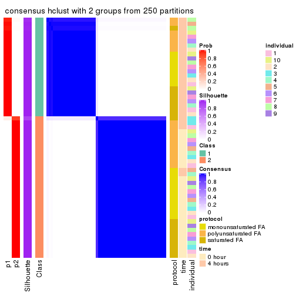</p>

</div>
<div id='tab-MAD-hclust-consensus-heatmap-2'>
<pre><code class="r">consensus_heatmap(res, k = 3)
</code></pre>

<p>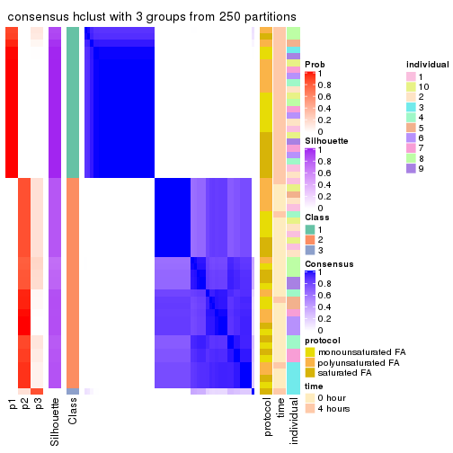</p>

</div>
<div id='tab-MAD-hclust-consensus-heatmap-3'>
<pre><code class="r">consensus_heatmap(res, k = 4)
</code></pre>

<p>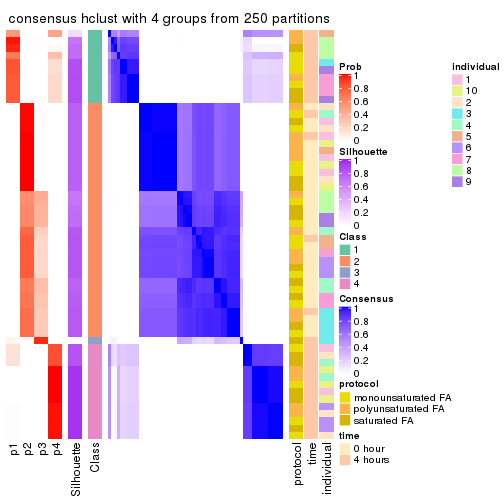</p>

</div>
<div id='tab-MAD-hclust-consensus-heatmap-4'>
<pre><code class="r">consensus_heatmap(res, k = 5)
</code></pre>

<p>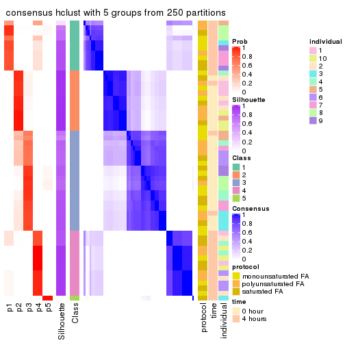</p>

</div>
<div id='tab-MAD-hclust-consensus-heatmap-5'>
<pre><code class="r">consensus_heatmap(res, k = 6)
</code></pre>

<p>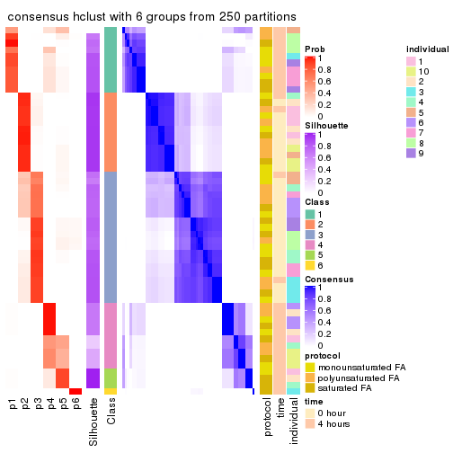</p>

</div>
</div>

Heatmaps for the membership of samples in all partitions to see how consistent they are:


<script>
$( function() {
	$( '#tabs-MAD-hclust-membership-heatmap' ).tabs();
} );
</script>
<div id='tabs-MAD-hclust-membership-heatmap'>
<ul>
<li><a href='#tab-MAD-hclust-membership-heatmap-1'>k = 2</a></li>
<li><a href='#tab-MAD-hclust-membership-heatmap-2'>k = 3</a></li>
<li><a href='#tab-MAD-hclust-membership-heatmap-3'>k = 4</a></li>
<li><a href='#tab-MAD-hclust-membership-heatmap-4'>k = 5</a></li>
<li><a href='#tab-MAD-hclust-membership-heatmap-5'>k = 6</a></li>
</ul>
<div id='tab-MAD-hclust-membership-heatmap-1'>
<pre><code class="r">membership_heatmap(res, k = 2)
</code></pre>

<p>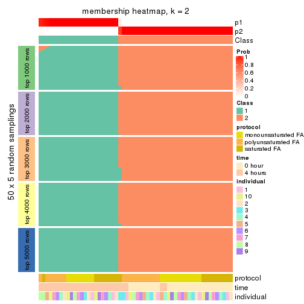</p>

</div>
<div id='tab-MAD-hclust-membership-heatmap-2'>
<pre><code class="r">membership_heatmap(res, k = 3)
</code></pre>

<p>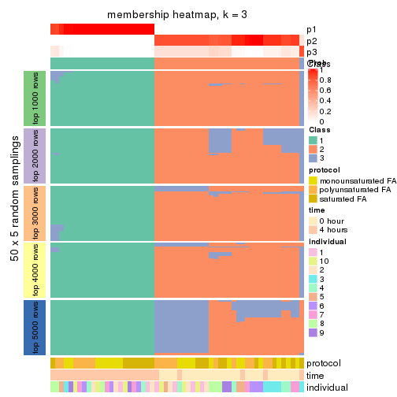</p>

</div>
<div id='tab-MAD-hclust-membership-heatmap-3'>
<pre><code class="r">membership_heatmap(res, k = 4)
</code></pre>

<p>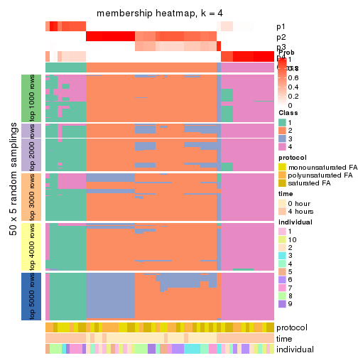</p>

</div>
<div id='tab-MAD-hclust-membership-heatmap-4'>
<pre><code class="r">membership_heatmap(res, k = 5)
</code></pre>

<p>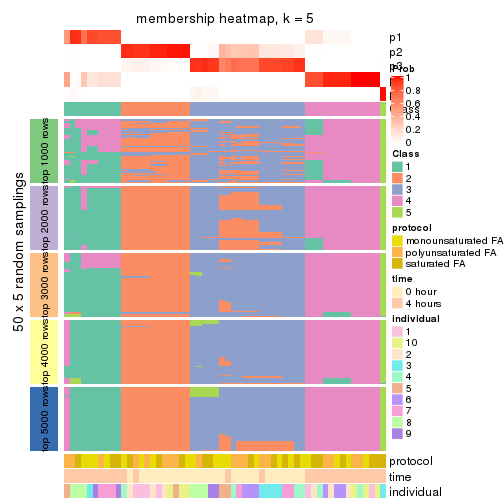</p>

</div>
<div id='tab-MAD-hclust-membership-heatmap-5'>
<pre><code class="r">membership_heatmap(res, k = 6)
</code></pre>

<p>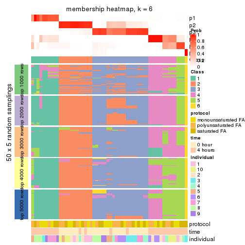</p>

</div>
</div>

As soon as we have had the classes for columns, we can look for signatures
which are significantly different between classes which can be candidate marks
for certain classes. Following are the heatmaps for signatures.


Signature heatmaps where rows are scaled:


<script>
$( function() {
	$( '#tabs-MAD-hclust-get-signatures' ).tabs();
} );
</script>
<div id='tabs-MAD-hclust-get-signatures'>
<ul>
<li><a href='#tab-MAD-hclust-get-signatures-1'>k = 2</a></li>
<li><a href='#tab-MAD-hclust-get-signatures-2'>k = 3</a></li>
<li><a href='#tab-MAD-hclust-get-signatures-3'>k = 4</a></li>
<li><a href='#tab-MAD-hclust-get-signatures-4'>k = 5</a></li>
<li><a href='#tab-MAD-hclust-get-signatures-5'>k = 6</a></li>
</ul>
<div id='tab-MAD-hclust-get-signatures-1'>
<pre><code class="r">get_signatures(res, k = 2)
</code></pre>

<p>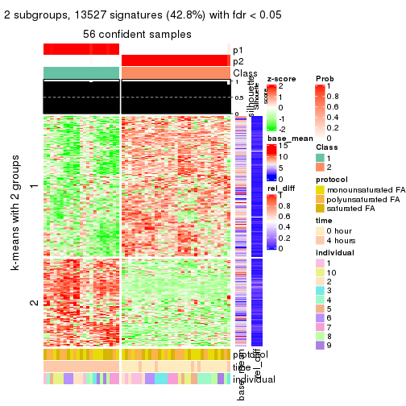</p>

</div>
<div id='tab-MAD-hclust-get-signatures-2'>
<pre><code class="r">get_signatures(res, k = 3)
</code></pre>

<p>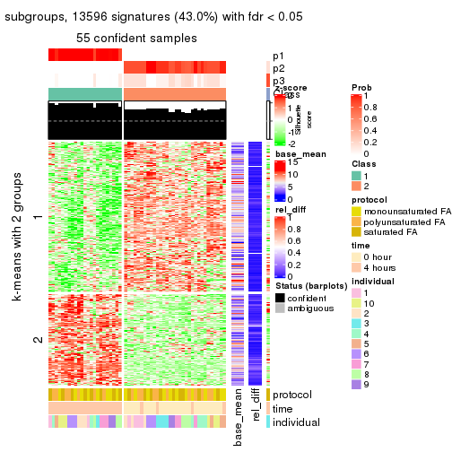</p>

</div>
<div id='tab-MAD-hclust-get-signatures-3'>
<pre><code class="r">get_signatures(res, k = 4)
</code></pre>

<p>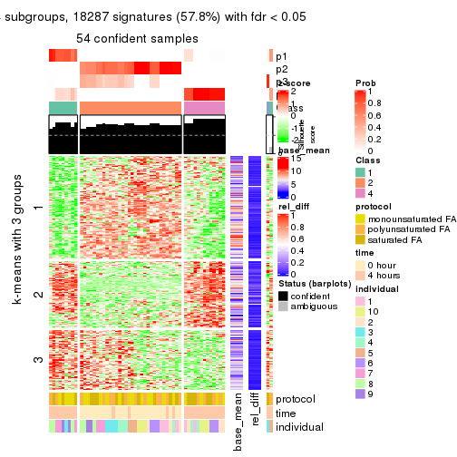</p>

</div>
<div id='tab-MAD-hclust-get-signatures-4'>
<pre><code class="r">get_signatures(res, k = 5)
</code></pre>

<p>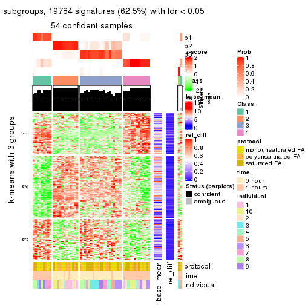</p>

</div>
<div id='tab-MAD-hclust-get-signatures-5'>
<pre><code class="r">get_signatures(res, k = 6)
</code></pre>

<p>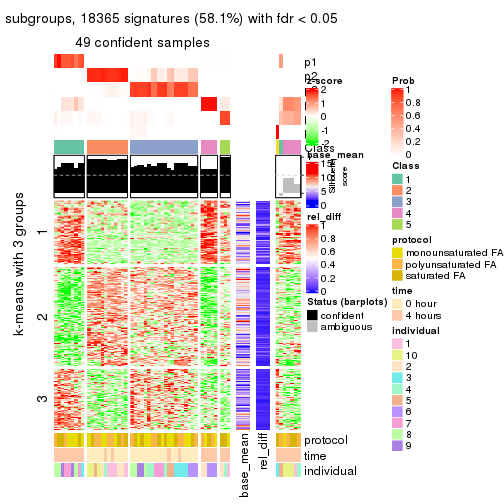</p>

</div>
</div>


Signature heatmaps where rows are not scaled:


<script>
$( function() {
	$( '#tabs-MAD-hclust-get-signatures-no-scale' ).tabs();
} );
</script>
<div id='tabs-MAD-hclust-get-signatures-no-scale'>
<ul>
<li><a href='#tab-MAD-hclust-get-signatures-no-scale-1'>k = 2</a></li>
<li><a href='#tab-MAD-hclust-get-signatures-no-scale-2'>k = 3</a></li>
<li><a href='#tab-MAD-hclust-get-signatures-no-scale-3'>k = 4</a></li>
<li><a href='#tab-MAD-hclust-get-signatures-no-scale-4'>k = 5</a></li>
<li><a href='#tab-MAD-hclust-get-signatures-no-scale-5'>k = 6</a></li>
</ul>
<div id='tab-MAD-hclust-get-signatures-no-scale-1'>
<pre><code class="r">get_signatures(res, k = 2, scale_rows = FALSE)
</code></pre>

<p>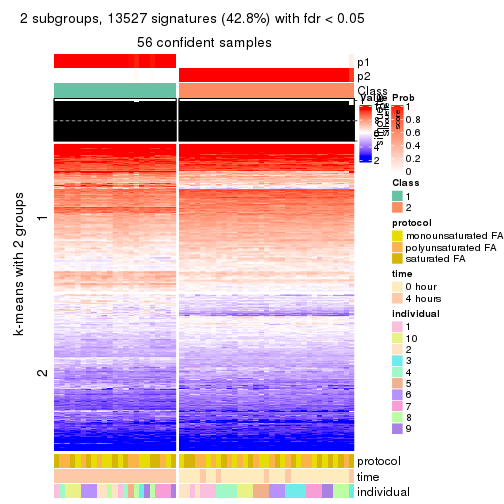</p>

</div>
<div id='tab-MAD-hclust-get-signatures-no-scale-2'>
<pre><code class="r">get_signatures(res, k = 3, scale_rows = FALSE)
</code></pre>

<p>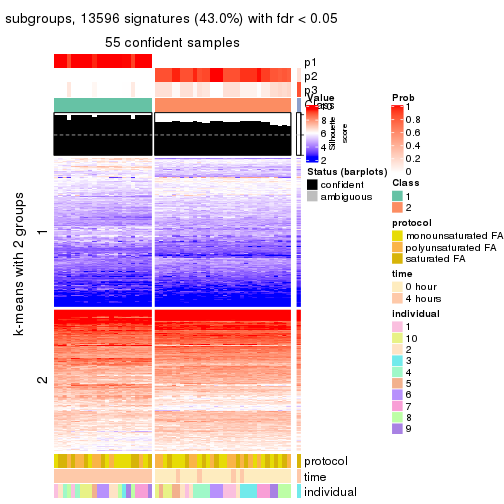</p>

</div>
<div id='tab-MAD-hclust-get-signatures-no-scale-3'>
<pre><code class="r">get_signatures(res, k = 4, scale_rows = FALSE)
</code></pre>

<p>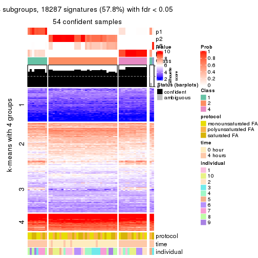</p>

</div>
<div id='tab-MAD-hclust-get-signatures-no-scale-4'>
<pre><code class="r">get_signatures(res, k = 5, scale_rows = FALSE)
</code></pre>

<p>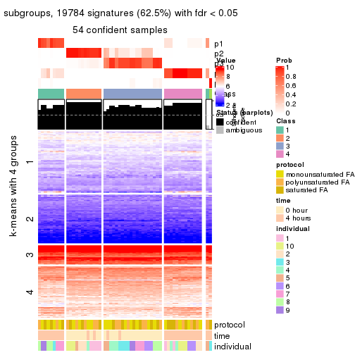</p>

</div>
<div id='tab-MAD-hclust-get-signatures-no-scale-5'>
<pre><code class="r">get_signatures(res, k = 6, scale_rows = FALSE)
</code></pre>

<p>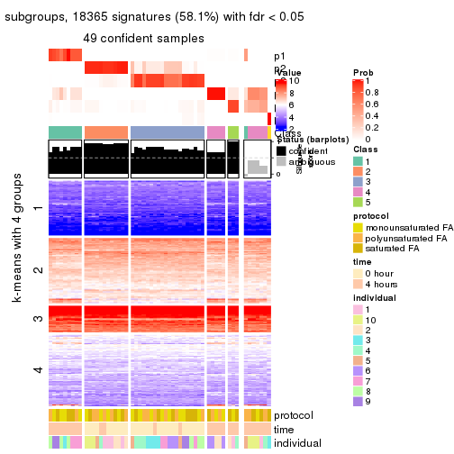</p>

</div>
</div>


Compare the overlap of signatures from different k:

```r
compare_signatures(res)
```

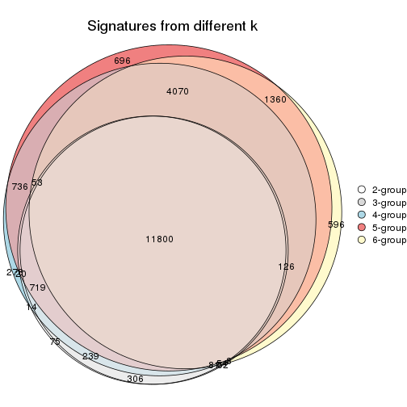

`get_signature()` returns a data frame invisibly. TO get the list of signatures, the function
call should be assigned to a variable explicitly. In following code, if `plot` argument is set
to `FALSE`, no heatmap is plotted while only the differential analysis is performed.

```r
# code only for demonstration
tb = get_signature(res, k = ..., plot = FALSE)
```

An example of the output of `tb` is:

```
#>   which_row         fdr    mean_1    mean_2 scaled_mean_1 scaled_mean_2 km
#> 1        38 0.042760348  8.373488  9.131774    -0.5533452     0.5164555  1
#> 2        40 0.018707592  7.106213  8.469186    -0.6173731     0.5762149  1
#> 3        55 0.019134737 10.221463 11.207825    -0.6159697     0.5749050  1
#> 4        59 0.006059896  5.921854  7.869574    -0.6899429     0.6439467  1
#> 5        60 0.018055526  8.928898 10.211722    -0.6204761     0.5791110  1
#> 6        98 0.009384629 15.714769 14.887706     0.6635654    -0.6193277  2
...
```

The columns in `tb` are:

1. `which_row`: row indices corresponding to the input matrix.
2. `fdr`: FDR for the differential test. 
3. `mean_x`: The mean value in group x.
4. `scaled_mean_x`: The mean value in group x after rows are scaled.
5. `km`: Row groups if k-means clustering is applied to rows.


UMAP plot which shows how samples are separated.


<script>
$( function() {
	$( '#tabs-MAD-hclust-dimension-reduction' ).tabs();
} );
</script>
<div id='tabs-MAD-hclust-dimension-reduction'>
<ul>
<li><a href='#tab-MAD-hclust-dimension-reduction-1'>k = 2</a></li>
<li><a href='#tab-MAD-hclust-dimension-reduction-2'>k = 3</a></li>
<li><a href='#tab-MAD-hclust-dimension-reduction-3'>k = 4</a></li>
<li><a href='#tab-MAD-hclust-dimension-reduction-4'>k = 5</a></li>
<li><a href='#tab-MAD-hclust-dimension-reduction-5'>k = 6</a></li>
</ul>
<div id='tab-MAD-hclust-dimension-reduction-1'>
<pre><code class="r">dimension_reduction(res, k = 2, method = &quot;UMAP&quot;)
</code></pre>

<p>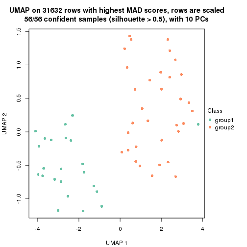</p>

</div>
<div id='tab-MAD-hclust-dimension-reduction-2'>
<pre><code class="r">dimension_reduction(res, k = 3, method = &quot;UMAP&quot;)
</code></pre>

<p>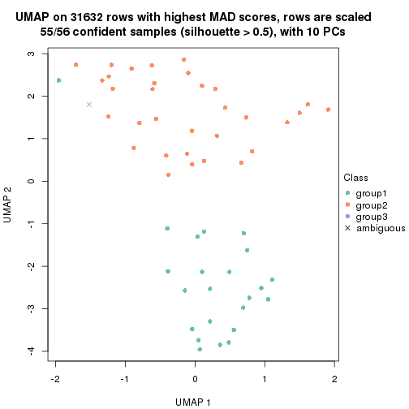</p>

</div>
<div id='tab-MAD-hclust-dimension-reduction-3'>
<pre><code class="r">dimension_reduction(res, k = 4, method = &quot;UMAP&quot;)
</code></pre>

<p>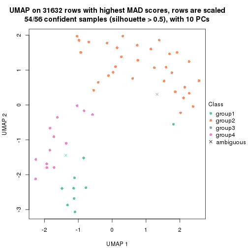</p>

</div>
<div id='tab-MAD-hclust-dimension-reduction-4'>
<pre><code class="r">dimension_reduction(res, k = 5, method = &quot;UMAP&quot;)
</code></pre>

<p>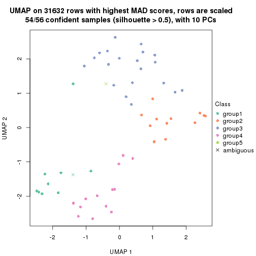</p>

</div>
<div id='tab-MAD-hclust-dimension-reduction-5'>
<pre><code class="r">dimension_reduction(res, k = 6, method = &quot;UMAP&quot;)
</code></pre>

<p>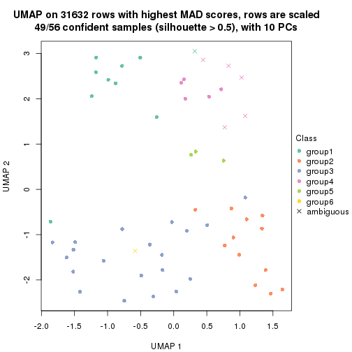</p>

</div>
</div>


Following heatmap shows how subgroups are split when increasing `k`:

```r
collect_classes(res)
```

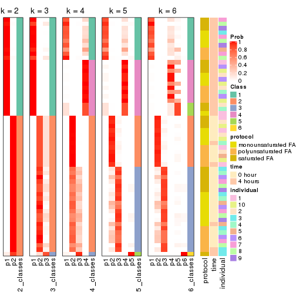


Test correlation between subgroups and known annotations. If the known
annotation is numeric, one-way ANOVA test is applied, and if the known
annotation is discrete, chi-squared contingency table test is applied.

```r
test_to_known_factors(res)
```

```
#>             n protocol(p)  time(p) individual(p) k
#> MAD:hclust 56       0.937 2.29e-09       0.95024 2
#> MAD:hclust 55       0.868 8.82e-10       0.97392 3
#> MAD:hclust 54       0.920 2.08e-09       0.04556 4
#> MAD:hclust 54       0.966 1.01e-08       0.00139 5
#> MAD:hclust 49       0.895 5.00e-07       0.00130 6
```


If matrix rows can be associated to genes, consider to use `functional_enrichment(res,
...)` to perform function enrichment for the signature genes. See [this vignette](http://bioconductor.org/packages/devel/bioc/vignettes/cola/inst/doc/functional_enrichment.html) for more detailed explanations.


 

---------------------------------------------------


### MAD:kmeans**


The object with results only for a single top-value method and a single partition method 
can be extracted as:

```r
res = res_list["MAD", "kmeans"]
# you can also extract it by
# res = res_list["MAD:kmeans"]
```

A summary of `res` and all the functions that can be applied to it:

```r
res
```

```
#> A 'ConsensusPartition' object with k = 2, 3, 4, 5, 6.
#>   On a matrix with 31632 rows and 56 columns.
#>   Top rows (1000, 2000, 3000, 4000, 5000) are extracted by 'MAD' method.
#>   Subgroups are detected by 'kmeans' method.
#>   Performed in total 1250 partitions by row resampling.
#>   Best k for subgroups seems to be 2.
#> 
#> Following methods can be applied to this 'ConsensusPartition' object:
#>  [1] "cola_report"             "collect_classes"         "collect_plots"          
#>  [4] "collect_stats"           "colnames"                "compare_signatures"     
#>  [7] "consensus_heatmap"       "dimension_reduction"     "functional_enrichment"  
#> [10] "get_anno_col"            "get_anno"                "get_classes"            
#> [13] "get_consensus"           "get_matrix"              "get_membership"         
#> [16] "get_param"               "get_signatures"          "get_stats"              
#> [19] "is_best_k"               "is_stable_k"             "membership_heatmap"     
#> [22] "ncol"                    "nrow"                    "plot_ecdf"              
#> [25] "rownames"                "select_partition_number" "show"                   
#> [28] "suggest_best_k"          "test_to_known_factors"
```

`collect_plots()` function collects all the plots made from `res` for all `k` (number of partitions)
into one single page to provide an easy and fast comparison between different `k`.

```r
collect_plots(res)
```

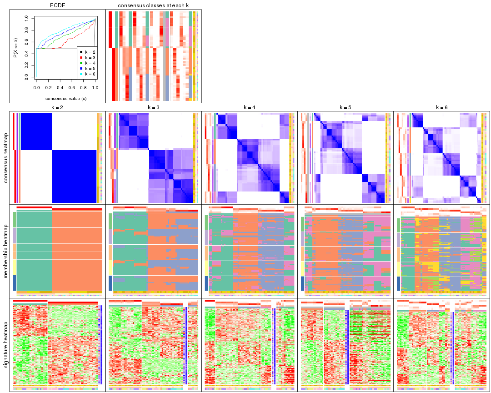

The plots are:

- The first row: a plot of the ECDF (empirical cumulative distribution
  function) curves of the consensus matrix for each `k` and the heatmap of
  predicted classes for each `k`.
- The second row: heatmaps of the consensus matrix for each `k`.
- The third row: heatmaps of the membership matrix for each `k`.
- The fouth row: heatmaps of the signatures for each `k`.

All the plots in panels can be made by individual functions and they are
plotted later in this section.

`select_partition_number()` produces several plots showing different
statistics for choosing "optimized" `k`. There are following statistics:

- ECDF curves of the consensus matrix for each `k`;
- 1-PAC. [The PAC
  score](https://en.wikipedia.org/wiki/Consensus_clustering#Over-interpretation_potential_of_consensus_clustering)
  measures the proportion of the ambiguous subgrouping.
- Mean silhouette score.
- Concordance. The mean probability of fiting the consensus class ids in all
  partitions.
- Area increased. Denote $A_k$ as the area under the ECDF curve for current
  `k`, the area increased is defined as $A_k - A_{k-1}$.
- Rand index. The percent of pairs of samples that are both in a same cluster
  or both are not in a same cluster in the partition of k and k-1.
- Jaccard index. The ratio of pairs of samples are both in a same cluster in
  the partition of k and k-1 and the pairs of samples are both in a same
  cluster in the partition k or k-1.

The detailed explanations of these statistics can be found in [the _cola_
vignette](http://bioconductor.org/packages/devel/bioc/vignettes/cola/inst/doc/cola.html#toc_13).

Generally speaking, lower PAC score, higher mean silhouette score or higher
concordance corresponds to better partition. Rand index and Jaccard index
measure how similar the current partition is compared to partition with `k-1`.
If they are too similar, we won't accept `k` is better than `k-1`.

```r
select_partition_number(res)
```

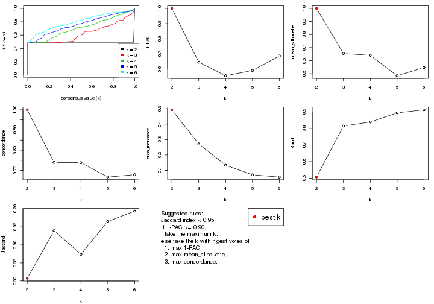

The numeric values for all these statistics can be obtained by `get_stats()`.

```r
get_stats(res)
```

```
#>   k 1-PAC mean_silhouette concordance area_increased  Rand Jaccard
#> 2 2 1.000           1.000       1.000         0.4934 0.507   0.507
#> 3 3 0.646           0.655       0.740         0.2713 0.814   0.639
#> 4 4 0.557           0.641       0.738         0.1334 0.839   0.574
#> 5 5 0.592           0.485       0.667         0.0714 0.894   0.665
#> 6 6 0.687           0.547       0.679         0.0567 0.912   0.694
```

`suggest_best_k()` suggests the best $k$ based on these statistics. The rules are as follows:

- All $k$ with Jaccard index larger than 0.95 are removed because increasing
  $k$ does not provide enough extra information. If all $k$ are removed, it is
  marked as no subgroup is detected.
- For all $k$ with 1-PAC score larger than 0.9, the maximal $k$ is taken as
  the best $k$, and other $k$ are marked as optional $k$.
- If it does not fit the second rule. The $k$ with the maximal vote of the
  highest 1-PAC score, highest mean silhouette, and highest concordance is
  taken as the best $k$.

```r
suggest_best_k(res)
```

```
#> [1] 2
```


Following shows the table of the partitions (You need to click the **show/hide
code output** link to see it). The membership matrix (columns with name `p*`)
is inferred by
[`clue::cl_consensus()`](https://www.rdocumentation.org/link/cl_consensus?package=clue)
function with the `SE` method. Basically the value in the membership matrix
represents the probability to belong to a certain group. The finall class
label for an item is determined with the group with highest probability it
belongs to.

In `get_classes()` function, the entropy is calculated from the membership
matrix and the silhouette score is calculated from the consensus matrix.


<script>
$( function() {
	$( '#tabs-MAD-kmeans-get-classes' ).tabs();
} );
</script>
<div id='tabs-MAD-kmeans-get-classes'>
<ul>
<li><a href='#tab-MAD-kmeans-get-classes-1'>k = 2</a></li>
<li><a href='#tab-MAD-kmeans-get-classes-2'>k = 3</a></li>
<li><a href='#tab-MAD-kmeans-get-classes-3'>k = 4</a></li>
<li><a href='#tab-MAD-kmeans-get-classes-4'>k = 5</a></li>
<li><a href='#tab-MAD-kmeans-get-classes-5'>k = 6</a></li>
</ul>

<div id='tab-MAD-kmeans-get-classes-1'>
<p><a id='tab-MAD-kmeans-get-classes-1-a' style='color:#0366d6' href='#'>show/hide code output</a></p>
<pre><code class="r">cbind(get_classes(res, k = 2), get_membership(res, k = 2))
</code></pre>

<pre><code>#&gt;           class entropy silhouette p1 p2
#&gt; GSM790742     2       0          1  0  1
#&gt; GSM790744     2       0          1  0  1
#&gt; GSM790754     2       0          1  0  1
#&gt; GSM790756     2       0          1  0  1
#&gt; GSM790768     2       0          1  0  1
#&gt; GSM790774     2       0          1  0  1
#&gt; GSM790778     2       0          1  0  1
#&gt; GSM790784     2       0          1  0  1
#&gt; GSM790790     2       0          1  0  1
#&gt; GSM790743     1       0          1  1  0
#&gt; GSM790745     1       0          1  1  0
#&gt; GSM790755     2       0          1  0  1
#&gt; GSM790757     1       0          1  1  0
#&gt; GSM790769     1       0          1  1  0
#&gt; GSM790775     1       0          1  1  0
#&gt; GSM790779     1       0          1  1  0
#&gt; GSM790785     1       0          1  1  0
#&gt; GSM790791     1       0          1  1  0
#&gt; GSM790738     2       0          1  0  1
#&gt; GSM790746     2       0          1  0  1
#&gt; GSM790752     2       0          1  0  1
#&gt; GSM790758     2       0          1  0  1
#&gt; GSM790764     2       0          1  0  1
#&gt; GSM790766     2       0          1  0  1
#&gt; GSM790772     2       0          1  0  1
#&gt; GSM790782     2       0          1  0  1
#&gt; GSM790786     2       0          1  0  1
#&gt; GSM790792     2       0          1  0  1
#&gt; GSM790739     1       0          1  1  0
#&gt; GSM790747     1       0          1  1  0
#&gt; GSM790753     1       0          1  1  0
#&gt; GSM790759     2       0          1  0  1
#&gt; GSM790765     2       0          1  0  1
#&gt; GSM790767     1       0          1  1  0
#&gt; GSM790773     1       0          1  1  0
#&gt; GSM790783     1       0          1  1  0
#&gt; GSM790787     1       0          1  1  0
#&gt; GSM790793     1       0          1  1  0
#&gt; GSM790740     2       0          1  0  1
#&gt; GSM790748     2       0          1  0  1
#&gt; GSM790750     2       0          1  0  1
#&gt; GSM790760     2       0          1  0  1
#&gt; GSM790762     2       0          1  0  1
#&gt; GSM790770     2       0          1  0  1
#&gt; GSM790776     2       0          1  0  1
#&gt; GSM790780     2       0          1  0  1
#&gt; GSM790788     2       0          1  0  1
#&gt; GSM790741     2       0          1  0  1
#&gt; GSM790749     1       0          1  1  0
#&gt; GSM790751     2       0          1  0  1
#&gt; GSM790761     1       0          1  1  0
#&gt; GSM790763     1       0          1  1  0
#&gt; GSM790771     1       0          1  1  0
#&gt; GSM790777     1       0          1  1  0
#&gt; GSM790781     1       0          1  1  0
#&gt; GSM790789     1       0          1  1  0
</code></pre>

<script>
$('#tab-MAD-kmeans-get-classes-1-a').parent().next().next().hide();
$('#tab-MAD-kmeans-get-classes-1-a').click(function(){
  $('#tab-MAD-kmeans-get-classes-1-a').parent().next().next().toggle();
  return(false);
});
</script>
</div>

<div id='tab-MAD-kmeans-get-classes-2'>
<p><a id='tab-MAD-kmeans-get-classes-2-a' style='color:#0366d6' href='#'>show/hide code output</a></p>
<pre><code class="r">cbind(get_classes(res, k = 3), get_membership(res, k = 3))
</code></pre>

<pre><code>#&gt;           class entropy silhouette    p1    p2    p3
#&gt; GSM790742     3  0.6299     -0.621 0.000 0.476 0.524
#&gt; GSM790744     2  0.6244      0.791 0.000 0.560 0.440
#&gt; GSM790754     3  0.0237      0.710 0.000 0.004 0.996
#&gt; GSM790756     3  0.0592      0.711 0.000 0.012 0.988
#&gt; GSM790768     2  0.6225      0.794 0.000 0.568 0.432
#&gt; GSM790774     3  0.2796      0.686 0.000 0.092 0.908
#&gt; GSM790778     3  0.2796      0.686 0.000 0.092 0.908
#&gt; GSM790784     3  0.2796      0.686 0.000 0.092 0.908
#&gt; GSM790790     2  0.6225      0.792 0.000 0.568 0.432
#&gt; GSM790743     1  0.4121      0.858 0.832 0.168 0.000
#&gt; GSM790745     1  0.4974      0.861 0.764 0.236 0.000
#&gt; GSM790755     3  0.2356      0.646 0.000 0.072 0.928
#&gt; GSM790757     1  0.4974      0.861 0.764 0.236 0.000
#&gt; GSM790769     1  0.0000      0.889 1.000 0.000 0.000
#&gt; GSM790775     1  0.4291      0.880 0.820 0.180 0.000
#&gt; GSM790779     1  0.4887      0.864 0.772 0.228 0.000
#&gt; GSM790785     1  0.4291      0.880 0.820 0.180 0.000
#&gt; GSM790791     1  0.3752      0.866 0.856 0.144 0.000
#&gt; GSM790738     2  0.6267      0.777 0.000 0.548 0.452
#&gt; GSM790746     2  0.6267      0.777 0.000 0.548 0.452
#&gt; GSM790752     3  0.0237      0.710 0.000 0.004 0.996
#&gt; GSM790758     3  0.0000      0.710 0.000 0.000 1.000
#&gt; GSM790764     3  0.4887      0.377 0.000 0.228 0.772
#&gt; GSM790766     2  0.6235      0.792 0.000 0.564 0.436
#&gt; GSM790772     3  0.6291     -0.539 0.000 0.468 0.532
#&gt; GSM790782     3  0.2796      0.686 0.000 0.092 0.908
#&gt; GSM790786     3  0.2796      0.686 0.000 0.092 0.908
#&gt; GSM790792     2  0.6225      0.792 0.000 0.568 0.432
#&gt; GSM790739     1  0.4974      0.861 0.764 0.236 0.000
#&gt; GSM790747     1  0.0000      0.889 1.000 0.000 0.000
#&gt; GSM790753     1  0.4291      0.880 0.820 0.180 0.000
#&gt; GSM790759     3  0.6302     -0.630 0.000 0.480 0.520
#&gt; GSM790765     3  0.1289      0.708 0.000 0.032 0.968
#&gt; GSM790767     1  0.0000      0.889 1.000 0.000 0.000
#&gt; GSM790773     1  0.4291      0.880 0.820 0.180 0.000
#&gt; GSM790783     1  0.3941      0.880 0.844 0.156 0.000
#&gt; GSM790787     1  0.4291      0.880 0.820 0.180 0.000
#&gt; GSM790793     1  0.4605      0.857 0.796 0.204 0.000
#&gt; GSM790740     2  0.6267      0.777 0.000 0.548 0.452
#&gt; GSM790748     3  0.6299     -0.621 0.000 0.476 0.524
#&gt; GSM790750     3  0.0237      0.710 0.000 0.004 0.996
#&gt; GSM790760     3  0.2796      0.641 0.000 0.092 0.908
#&gt; GSM790762     2  0.6225      0.792 0.000 0.568 0.432
#&gt; GSM790770     2  0.6225      0.794 0.000 0.568 0.432
#&gt; GSM790776     3  0.5465      0.129 0.000 0.288 0.712
#&gt; GSM790780     3  0.1753      0.707 0.000 0.048 0.952
#&gt; GSM790788     2  0.6225      0.792 0.000 0.568 0.432
#&gt; GSM790741     2  0.6267      0.777 0.000 0.548 0.452
#&gt; GSM790749     1  0.0000      0.889 1.000 0.000 0.000
#&gt; GSM790751     3  0.0424      0.708 0.000 0.008 0.992
#&gt; GSM790761     1  0.4121      0.858 0.832 0.168 0.000
#&gt; GSM790763     1  0.6062      0.834 0.616 0.384 0.000
#&gt; GSM790771     1  0.0000      0.889 1.000 0.000 0.000
#&gt; GSM790777     1  0.4291      0.880 0.820 0.180 0.000
#&gt; GSM790781     2  0.9825     -0.458 0.268 0.424 0.308
#&gt; GSM790789     1  0.0000      0.889 1.000 0.000 0.000
</code></pre>

<script>
$('#tab-MAD-kmeans-get-classes-2-a').parent().next().next().hide();
$('#tab-MAD-kmeans-get-classes-2-a').click(function(){
  $('#tab-MAD-kmeans-get-classes-2-a').parent().next().next().toggle();
  return(false);
});
</script>
</div>

<div id='tab-MAD-kmeans-get-classes-3'>
<p><a id='tab-MAD-kmeans-get-classes-3-a' style='color:#0366d6' href='#'>show/hide code output</a></p>
<pre><code class="r">cbind(get_classes(res, k = 4), get_membership(res, k = 4))
</code></pre>

<pre><code>#&gt;           class entropy silhouette    p1    p2    p3    p4
#&gt; GSM790742     2  0.6973      0.677 0.000 0.556 0.300 0.144
#&gt; GSM790744     2  0.3726      0.845 0.000 0.788 0.212 0.000
#&gt; GSM790754     3  0.0188      0.817 0.000 0.000 0.996 0.004
#&gt; GSM790756     3  0.2996      0.795 0.000 0.044 0.892 0.064
#&gt; GSM790768     2  0.3895      0.844 0.000 0.804 0.184 0.012
#&gt; GSM790774     3  0.4037      0.787 0.000 0.112 0.832 0.056
#&gt; GSM790778     3  0.3758      0.792 0.000 0.104 0.848 0.048
#&gt; GSM790784     3  0.3818      0.791 0.000 0.108 0.844 0.048
#&gt; GSM790790     2  0.5417      0.817 0.000 0.732 0.180 0.088
#&gt; GSM790743     4  0.5337      0.786 0.424 0.012 0.000 0.564
#&gt; GSM790745     4  0.5921      0.810 0.448 0.036 0.000 0.516
#&gt; GSM790755     3  0.3176      0.770 0.000 0.036 0.880 0.084
#&gt; GSM790757     4  0.5921      0.810 0.448 0.036 0.000 0.516
#&gt; GSM790769     1  0.5900      0.226 0.664 0.076 0.000 0.260
#&gt; GSM790775     1  0.0000      0.571 1.000 0.000 0.000 0.000
#&gt; GSM790779     1  0.2329      0.487 0.916 0.012 0.000 0.072
#&gt; GSM790785     1  0.0000      0.571 1.000 0.000 0.000 0.000
#&gt; GSM790791     4  0.6546      0.662 0.432 0.076 0.000 0.492
#&gt; GSM790738     2  0.4888      0.841 0.000 0.740 0.224 0.036
#&gt; GSM790746     2  0.5052      0.830 0.000 0.720 0.244 0.036
#&gt; GSM790752     3  0.1733      0.813 0.000 0.024 0.948 0.028
#&gt; GSM790758     3  0.1302      0.814 0.000 0.000 0.956 0.044
#&gt; GSM790764     3  0.6420      0.492 0.000 0.132 0.640 0.228
#&gt; GSM790766     2  0.4137      0.845 0.000 0.780 0.208 0.012
#&gt; GSM790772     2  0.5837      0.482 0.000 0.564 0.400 0.036
#&gt; GSM790782     3  0.3758      0.792 0.000 0.104 0.848 0.048
#&gt; GSM790786     3  0.3818      0.791 0.000 0.108 0.844 0.048
#&gt; GSM790792     2  0.5417      0.817 0.000 0.732 0.180 0.088
#&gt; GSM790739     4  0.5921      0.810 0.448 0.036 0.000 0.516
#&gt; GSM790747     1  0.5927      0.219 0.660 0.076 0.000 0.264
#&gt; GSM790753     1  0.0000      0.571 1.000 0.000 0.000 0.000
#&gt; GSM790759     2  0.6295      0.738 0.000 0.616 0.296 0.088
#&gt; GSM790765     3  0.3198      0.806 0.000 0.080 0.880 0.040
#&gt; GSM790767     1  0.6004      0.194 0.648 0.076 0.000 0.276
#&gt; GSM790773     1  0.0000      0.571 1.000 0.000 0.000 0.000
#&gt; GSM790783     1  0.1004      0.558 0.972 0.004 0.000 0.024
#&gt; GSM790787     1  0.0469      0.562 0.988 0.000 0.000 0.012
#&gt; GSM790793     4  0.6052      0.816 0.396 0.048 0.000 0.556
#&gt; GSM790740     2  0.4888      0.841 0.000 0.740 0.224 0.036
#&gt; GSM790748     2  0.7054      0.646 0.000 0.536 0.320 0.144
#&gt; GSM790750     3  0.1733      0.813 0.000 0.024 0.948 0.028
#&gt; GSM790760     3  0.5578      0.596 0.000 0.128 0.728 0.144
#&gt; GSM790762     2  0.5477      0.815 0.000 0.728 0.180 0.092
#&gt; GSM790770     2  0.4553      0.840 0.000 0.780 0.180 0.040
#&gt; GSM790776     3  0.6723      0.288 0.000 0.260 0.600 0.140
#&gt; GSM790780     3  0.3611      0.799 0.000 0.060 0.860 0.080
#&gt; GSM790788     2  0.5417      0.817 0.000 0.732 0.180 0.088
#&gt; GSM790741     2  0.4888      0.841 0.000 0.740 0.224 0.036
#&gt; GSM790749     1  0.6004      0.194 0.648 0.076 0.000 0.276
#&gt; GSM790751     3  0.1489      0.812 0.000 0.044 0.952 0.004
#&gt; GSM790761     4  0.5337      0.786 0.424 0.012 0.000 0.564
#&gt; GSM790763     1  0.5836     -0.216 0.640 0.056 0.000 0.304
#&gt; GSM790771     1  0.6004      0.194 0.648 0.076 0.000 0.276
#&gt; GSM790777     1  0.0000      0.571 1.000 0.000 0.000 0.000
#&gt; GSM790781     1  0.9024     -0.104 0.364 0.076 0.196 0.364
#&gt; GSM790789     1  0.6194      0.121 0.628 0.084 0.000 0.288
</code></pre>

<script>
$('#tab-MAD-kmeans-get-classes-3-a').parent().next().next().hide();
$('#tab-MAD-kmeans-get-classes-3-a').click(function(){
  $('#tab-MAD-kmeans-get-classes-3-a').parent().next().next().toggle();
  return(false);
});
</script>
</div>

<div id='tab-MAD-kmeans-get-classes-4'>
<p><a id='tab-MAD-kmeans-get-classes-4-a' style='color:#0366d6' href='#'>show/hide code output</a></p>
<pre><code class="r">cbind(get_classes(res, k = 5), get_membership(res, k = 5))
</code></pre>

<pre><code>#&gt;           class entropy silhouette    p1    p2    p3    p4 p5
#&gt; GSM790742     2  0.5036      0.641 0.044 0.740 0.052 0.000 NA
#&gt; GSM790744     2  0.1626      0.772 0.000 0.940 0.016 0.000 NA
#&gt; GSM790754     3  0.3266      0.796 0.032 0.108 0.852 0.000 NA
#&gt; GSM790756     3  0.5356      0.739 0.068 0.180 0.712 0.000 NA
#&gt; GSM790768     2  0.3203      0.768 0.008 0.848 0.020 0.000 NA
#&gt; GSM790774     3  0.5077      0.792 0.068 0.136 0.748 0.000 NA
#&gt; GSM790778     3  0.4904      0.793 0.064 0.132 0.760 0.000 NA
#&gt; GSM790784     3  0.4841      0.793 0.060 0.132 0.764 0.000 NA
#&gt; GSM790790     2  0.4252      0.694 0.000 0.652 0.008 0.000 NA
#&gt; GSM790743     4  0.6096      0.373 0.096 0.000 0.020 0.580 NA
#&gt; GSM790745     4  0.6334      0.302 0.160 0.000 0.000 0.452 NA
#&gt; GSM790755     3  0.4504      0.698 0.140 0.032 0.780 0.000 NA
#&gt; GSM790757     4  0.6334      0.302 0.160 0.000 0.000 0.452 NA
#&gt; GSM790769     4  0.0609      0.416 0.020 0.000 0.000 0.980 NA
#&gt; GSM790775     4  0.4300     -0.405 0.476 0.000 0.000 0.524 NA
#&gt; GSM790779     1  0.4276      0.412 0.616 0.000 0.004 0.380 NA
#&gt; GSM790785     4  0.4300     -0.405 0.476 0.000 0.000 0.524 NA
#&gt; GSM790791     4  0.4496      0.403 0.116 0.000 0.008 0.772 NA
#&gt; GSM790738     2  0.0703      0.769 0.000 0.976 0.024 0.000 NA
#&gt; GSM790746     2  0.1646      0.761 0.004 0.944 0.032 0.000 NA
#&gt; GSM790752     3  0.4168      0.784 0.060 0.132 0.796 0.000 NA
#&gt; GSM790758     3  0.4462      0.781 0.060 0.100 0.796 0.000 NA
#&gt; GSM790764     3  0.7807      0.373 0.096 0.196 0.444 0.000 NA
#&gt; GSM790766     2  0.3294      0.768 0.008 0.844 0.024 0.000 NA
#&gt; GSM790772     2  0.5774      0.413 0.060 0.652 0.244 0.000 NA
#&gt; GSM790782     3  0.4841      0.793 0.060 0.132 0.764 0.000 NA
#&gt; GSM790786     3  0.4841      0.793 0.060 0.132 0.764 0.000 NA
#&gt; GSM790792     2  0.4252      0.694 0.000 0.652 0.008 0.000 NA
#&gt; GSM790739     4  0.6334      0.302 0.160 0.000 0.000 0.452 NA
#&gt; GSM790747     4  0.0609      0.416 0.020 0.000 0.000 0.980 NA
#&gt; GSM790753     1  0.4307      0.294 0.504 0.000 0.000 0.496 NA
#&gt; GSM790759     2  0.3915      0.697 0.024 0.824 0.048 0.000 NA
#&gt; GSM790765     3  0.4706      0.800 0.060 0.120 0.776 0.000 NA
#&gt; GSM790767     4  0.0000      0.431 0.000 0.000 0.000 1.000 NA
#&gt; GSM790773     4  0.4300     -0.405 0.476 0.000 0.000 0.524 NA
#&gt; GSM790783     4  0.4283     -0.381 0.456 0.000 0.000 0.544 NA
#&gt; GSM790787     1  0.4291      0.358 0.536 0.000 0.000 0.464 NA
#&gt; GSM790793     4  0.6528      0.314 0.156 0.000 0.008 0.472 NA
#&gt; GSM790740     2  0.0703      0.769 0.000 0.976 0.024 0.000 NA
#&gt; GSM790748     2  0.5330      0.621 0.048 0.720 0.064 0.000 NA
#&gt; GSM790750     3  0.4168      0.784 0.060 0.132 0.796 0.000 NA
#&gt; GSM790760     3  0.7507      0.433 0.088 0.256 0.492 0.000 NA
#&gt; GSM790762     2  0.4252      0.694 0.000 0.652 0.008 0.000 NA
#&gt; GSM790770     2  0.3547      0.765 0.016 0.824 0.016 0.000 NA
#&gt; GSM790776     2  0.7761     -0.147 0.088 0.380 0.364 0.000 NA
#&gt; GSM790780     3  0.4272      0.774 0.076 0.060 0.812 0.000 NA
#&gt; GSM790788     2  0.4252      0.694 0.000 0.652 0.008 0.000 NA
#&gt; GSM790741     2  0.0703      0.769 0.000 0.976 0.024 0.000 NA
#&gt; GSM790749     4  0.0000      0.431 0.000 0.000 0.000 1.000 NA
#&gt; GSM790751     3  0.4512      0.756 0.040 0.192 0.752 0.000 NA
#&gt; GSM790761     4  0.6096      0.373 0.096 0.000 0.020 0.580 NA
#&gt; GSM790763     1  0.6387      0.162 0.544 0.000 0.008 0.276 NA
#&gt; GSM790771     4  0.0000      0.431 0.000 0.000 0.000 1.000 NA
#&gt; GSM790777     4  0.4300     -0.405 0.476 0.000 0.000 0.524 NA
#&gt; GSM790781     1  0.6764      0.165 0.552 0.000 0.232 0.032 NA
#&gt; GSM790789     4  0.0955      0.430 0.028 0.000 0.004 0.968 NA
</code></pre>

<script>
$('#tab-MAD-kmeans-get-classes-4-a').parent().next().next().hide();
$('#tab-MAD-kmeans-get-classes-4-a').click(function(){
  $('#tab-MAD-kmeans-get-classes-4-a').parent().next().next().toggle();
  return(false);
});
</script>
</div>

<div id='tab-MAD-kmeans-get-classes-5'>
<p><a id='tab-MAD-kmeans-get-classes-5-a' style='color:#0366d6' href='#'>show/hide code output</a></p>
<pre><code class="r">cbind(get_classes(res, k = 6), get_membership(res, k = 6))
</code></pre>

<pre><code>#&gt;           class entropy silhouette    p1    p2    p3    p4    p5    p6
#&gt; GSM790742     2  0.5390     0.1849 0.036 0.588 0.020 0.000 0.024 0.332
#&gt; GSM790744     2  0.1410     0.6693 0.000 0.944 0.008 0.000 0.044 0.004
#&gt; GSM790754     3  0.5298     0.5874 0.020 0.064 0.700 0.000 0.048 0.168
#&gt; GSM790756     3  0.5461     0.2771 0.008 0.092 0.576 0.000 0.008 0.316
#&gt; GSM790768     2  0.4213     0.6639 0.016 0.780 0.016 0.000 0.132 0.056
#&gt; GSM790774     3  0.1985     0.6899 0.008 0.064 0.916 0.000 0.004 0.008
#&gt; GSM790778     3  0.1493     0.6961 0.004 0.056 0.936 0.000 0.004 0.000
#&gt; GSM790784     3  0.1204     0.6985 0.000 0.056 0.944 0.000 0.000 0.000
#&gt; GSM790790     2  0.5457     0.5752 0.000 0.552 0.012 0.000 0.336 0.100
#&gt; GSM790743     4  0.4665     0.5144 0.004 0.000 0.012 0.676 0.260 0.048
#&gt; GSM790745     4  0.4488     0.3933 0.032 0.000 0.000 0.548 0.420 0.000
#&gt; GSM790755     3  0.6481     0.3357 0.048 0.016 0.516 0.000 0.112 0.308
#&gt; GSM790757     4  0.4488     0.3933 0.032 0.000 0.000 0.548 0.420 0.000
#&gt; GSM790769     4  0.3288     0.4220 0.276 0.000 0.000 0.724 0.000 0.000
#&gt; GSM790775     1  0.2697     0.8364 0.812 0.000 0.000 0.188 0.000 0.000
#&gt; GSM790779     1  0.4282     0.5910 0.776 0.000 0.000 0.096 0.084 0.044
#&gt; GSM790785     1  0.2697     0.8364 0.812 0.000 0.000 0.188 0.000 0.000
#&gt; GSM790791     4  0.3342     0.5669 0.040 0.000 0.000 0.844 0.072 0.044
#&gt; GSM790738     2  0.0777     0.6549 0.000 0.972 0.004 0.000 0.000 0.024
#&gt; GSM790746     2  0.3057     0.6138 0.048 0.868 0.004 0.000 0.036 0.044
#&gt; GSM790752     3  0.5958     0.4824 0.020 0.088 0.608 0.000 0.040 0.244
#&gt; GSM790758     3  0.4991     0.4372 0.008 0.036 0.624 0.000 0.020 0.312
#&gt; GSM790764     6  0.5146     0.7084 0.004 0.048 0.232 0.000 0.048 0.668
#&gt; GSM790766     2  0.4132     0.6649 0.016 0.788 0.016 0.000 0.124 0.056
#&gt; GSM790772     2  0.5253     0.0718 0.008 0.532 0.396 0.000 0.008 0.056
#&gt; GSM790782     3  0.1204     0.6985 0.000 0.056 0.944 0.000 0.000 0.000
#&gt; GSM790786     3  0.1204     0.6985 0.000 0.056 0.944 0.000 0.000 0.000
#&gt; GSM790792     2  0.5457     0.5752 0.000 0.552 0.012 0.000 0.336 0.100
#&gt; GSM790739     4  0.4488     0.3933 0.032 0.000 0.000 0.548 0.420 0.000
#&gt; GSM790747     4  0.3244     0.4365 0.268 0.000 0.000 0.732 0.000 0.000
#&gt; GSM790753     1  0.2946     0.8188 0.824 0.000 0.000 0.160 0.004 0.012
#&gt; GSM790759     2  0.3882     0.4706 0.004 0.768 0.020 0.000 0.020 0.188
#&gt; GSM790765     3  0.2457     0.6801 0.004 0.036 0.900 0.000 0.016 0.044
#&gt; GSM790767     4  0.2996     0.4970 0.228 0.000 0.000 0.772 0.000 0.000
#&gt; GSM790773     1  0.2697     0.8364 0.812 0.000 0.000 0.188 0.000 0.000
#&gt; GSM790783     1  0.2969     0.8053 0.776 0.000 0.000 0.224 0.000 0.000
#&gt; GSM790787     1  0.2799     0.7773 0.852 0.000 0.000 0.124 0.012 0.012
#&gt; GSM790793     4  0.4867     0.4212 0.012 0.000 0.000 0.600 0.340 0.048
#&gt; GSM790740     2  0.0891     0.6536 0.000 0.968 0.008 0.000 0.000 0.024
#&gt; GSM790748     2  0.5438     0.1353 0.036 0.572 0.020 0.000 0.024 0.348
#&gt; GSM790750     3  0.5958     0.4824 0.020 0.088 0.608 0.000 0.040 0.244
#&gt; GSM790760     6  0.5496     0.7961 0.008 0.160 0.240 0.000 0.000 0.592
#&gt; GSM790762     2  0.5457     0.5752 0.000 0.552 0.012 0.000 0.336 0.100
#&gt; GSM790770     2  0.4575     0.6570 0.016 0.748 0.012 0.000 0.140 0.084
#&gt; GSM790776     6  0.5577     0.7856 0.004 0.208 0.216 0.000 0.000 0.572
#&gt; GSM790780     3  0.1965     0.6813 0.004 0.040 0.924 0.000 0.008 0.024
#&gt; GSM790788     2  0.5457     0.5752 0.000 0.552 0.012 0.000 0.336 0.100
#&gt; GSM790741     2  0.0891     0.6536 0.000 0.968 0.008 0.000 0.000 0.024
#&gt; GSM790749     4  0.2996     0.4970 0.228 0.000 0.000 0.772 0.000 0.000
#&gt; GSM790751     3  0.6398     0.4327 0.020 0.168 0.584 0.000 0.048 0.180
#&gt; GSM790761     4  0.4665     0.5144 0.004 0.000 0.012 0.676 0.260 0.048
#&gt; GSM790763     1  0.7102    -0.3187 0.384 0.000 0.000 0.296 0.240 0.080
#&gt; GSM790771     4  0.2996     0.4970 0.228 0.000 0.000 0.772 0.000 0.000
#&gt; GSM790777     1  0.2697     0.8364 0.812 0.000 0.000 0.188 0.000 0.000
#&gt; GSM790781     5  0.8378     0.0000 0.292 0.000 0.188 0.068 0.304 0.148
#&gt; GSM790789     4  0.3555     0.5173 0.184 0.000 0.000 0.776 0.000 0.040
</code></pre>

<script>
$('#tab-MAD-kmeans-get-classes-5-a').parent().next().next().hide();
$('#tab-MAD-kmeans-get-classes-5-a').click(function(){
  $('#tab-MAD-kmeans-get-classes-5-a').parent().next().next().toggle();
  return(false);
});
</script>
</div>
</div>

Heatmaps for the consensus matrix. It visualizes the probability of two
samples to be in a same group.


<script>
$( function() {
	$( '#tabs-MAD-kmeans-consensus-heatmap' ).tabs();
} );
</script>
<div id='tabs-MAD-kmeans-consensus-heatmap'>
<ul>
<li><a href='#tab-MAD-kmeans-consensus-heatmap-1'>k = 2</a></li>
<li><a href='#tab-MAD-kmeans-consensus-heatmap-2'>k = 3</a></li>
<li><a href='#tab-MAD-kmeans-consensus-heatmap-3'>k = 4</a></li>
<li><a href='#tab-MAD-kmeans-consensus-heatmap-4'>k = 5</a></li>
<li><a href='#tab-MAD-kmeans-consensus-heatmap-5'>k = 6</a></li>
</ul>
<div id='tab-MAD-kmeans-consensus-heatmap-1'>
<pre><code class="r">consensus_heatmap(res, k = 2)
</code></pre>

<p>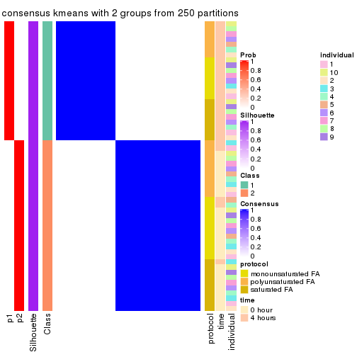</p>

</div>
<div id='tab-MAD-kmeans-consensus-heatmap-2'>
<pre><code class="r">consensus_heatmap(res, k = 3)
</code></pre>

<p>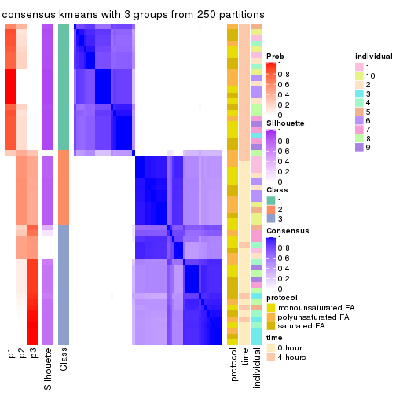</p>

</div>
<div id='tab-MAD-kmeans-consensus-heatmap-3'>
<pre><code class="r">consensus_heatmap(res, k = 4)
</code></pre>

<p>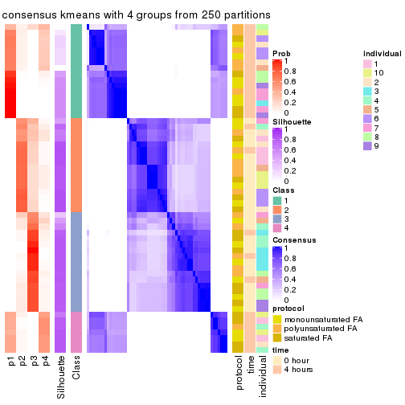</p>

</div>
<div id='tab-MAD-kmeans-consensus-heatmap-4'>
<pre><code class="r">consensus_heatmap(res, k = 5)
</code></pre>

<p>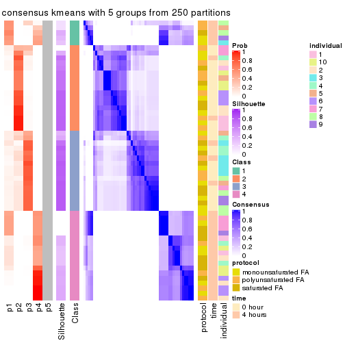</p>

</div>
<div id='tab-MAD-kmeans-consensus-heatmap-5'>
<pre><code class="r">consensus_heatmap(res, k = 6)
</code></pre>

<p>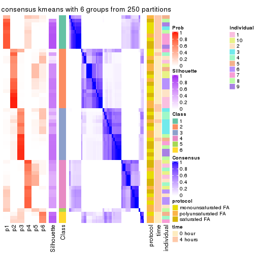</p>

</div>
</div>

Heatmaps for the membership of samples in all partitions to see how consistent they are:


<script>
$( function() {
	$( '#tabs-MAD-kmeans-membership-heatmap' ).tabs();
} );
</script>
<div id='tabs-MAD-kmeans-membership-heatmap'>
<ul>
<li><a href='#tab-MAD-kmeans-membership-heatmap-1'>k = 2</a></li>
<li><a href='#tab-MAD-kmeans-membership-heatmap-2'>k = 3</a></li>
<li><a href='#tab-MAD-kmeans-membership-heatmap-3'>k = 4</a></li>
<li><a href='#tab-MAD-kmeans-membership-heatmap-4'>k = 5</a></li>
<li><a href='#tab-MAD-kmeans-membership-heatmap-5'>k = 6</a></li>
</ul>
<div id='tab-MAD-kmeans-membership-heatmap-1'>
<pre><code class="r">membership_heatmap(res, k = 2)
</code></pre>

<p>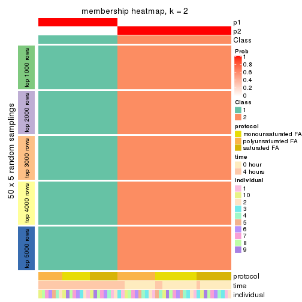</p>

</div>
<div id='tab-MAD-kmeans-membership-heatmap-2'>
<pre><code class="r">membership_heatmap(res, k = 3)
</code></pre>

<p>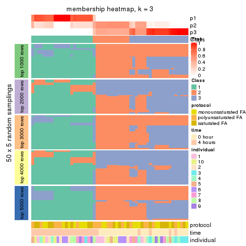</p>

</div>
<div id='tab-MAD-kmeans-membership-heatmap-3'>
<pre><code class="r">membership_heatmap(res, k = 4)
</code></pre>

<p>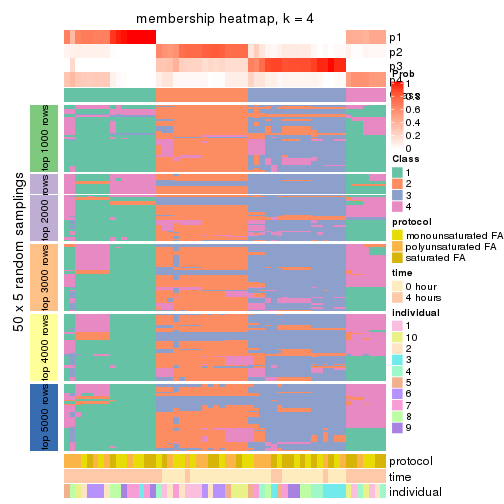</p>

</div>
<div id='tab-MAD-kmeans-membership-heatmap-4'>
<pre><code class="r">membership_heatmap(res, k = 5)
</code></pre>

<p>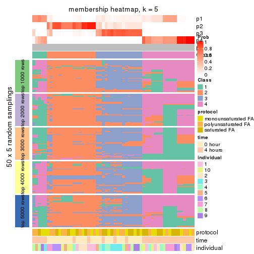</p>

</div>
<div id='tab-MAD-kmeans-membership-heatmap-5'>
<pre><code class="r">membership_heatmap(res, k = 6)
</code></pre>

<p>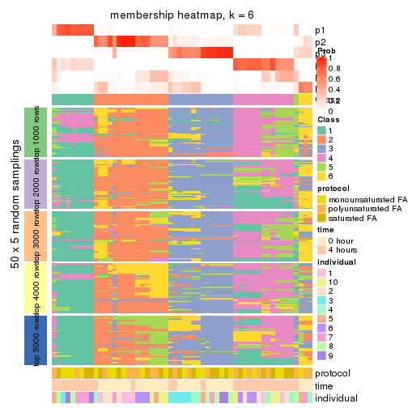</p>

</div>
</div>

As soon as we have had the classes for columns, we can look for signatures
which are significantly different between classes which can be candidate marks
for certain classes. Following are the heatmaps for signatures.


Signature heatmaps where rows are scaled:


<script>
$( function() {
	$( '#tabs-MAD-kmeans-get-signatures' ).tabs();
} );
</script>
<div id='tabs-MAD-kmeans-get-signatures'>
<ul>
<li><a href='#tab-MAD-kmeans-get-signatures-1'>k = 2</a></li>
<li><a href='#tab-MAD-kmeans-get-signatures-2'>k = 3</a></li>
<li><a href='#tab-MAD-kmeans-get-signatures-3'>k = 4</a></li>
<li><a href='#tab-MAD-kmeans-get-signatures-4'>k = 5</a></li>
<li><a href='#tab-MAD-kmeans-get-signatures-5'>k = 6</a></li>
</ul>
<div id='tab-MAD-kmeans-get-signatures-1'>
<pre><code class="r">get_signatures(res, k = 2)
</code></pre>

<p>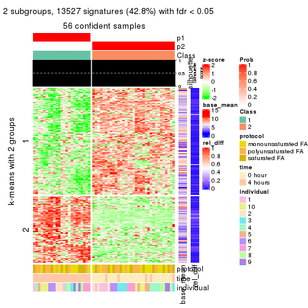</p>

</div>
<div id='tab-MAD-kmeans-get-signatures-2'>
<pre><code class="r">get_signatures(res, k = 3)
</code></pre>

<p>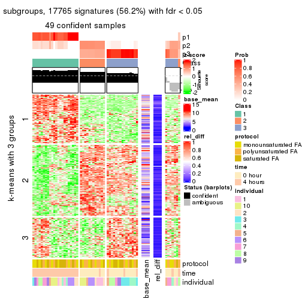</p>

</div>
<div id='tab-MAD-kmeans-get-signatures-3'>
<pre><code class="r">get_signatures(res, k = 4)
</code></pre>

<p>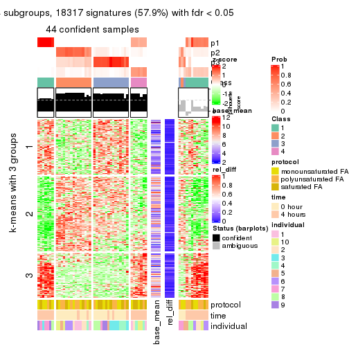</p>

</div>
<div id='tab-MAD-kmeans-get-signatures-4'>
<pre><code class="r">get_signatures(res, k = 5)
</code></pre>

<p>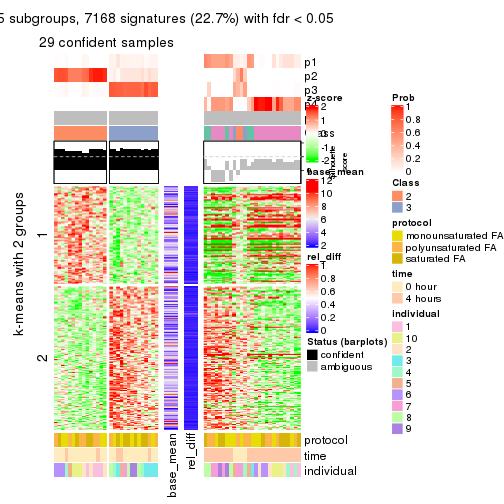</p>

</div>
<div id='tab-MAD-kmeans-get-signatures-5'>
<pre><code class="r">get_signatures(res, k = 6)
</code></pre>

<p>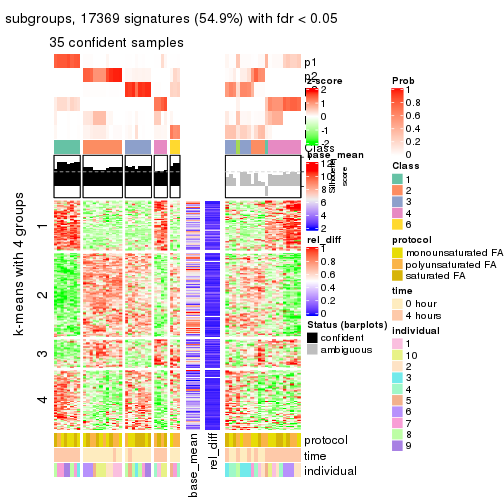</p>

</div>
</div>


Signature heatmaps where rows are not scaled:


<script>
$( function() {
	$( '#tabs-MAD-kmeans-get-signatures-no-scale' ).tabs();
} );
</script>
<div id='tabs-MAD-kmeans-get-signatures-no-scale'>
<ul>
<li><a href='#tab-MAD-kmeans-get-signatures-no-scale-1'>k = 2</a></li>
<li><a href='#tab-MAD-kmeans-get-signatures-no-scale-2'>k = 3</a></li>
<li><a href='#tab-MAD-kmeans-get-signatures-no-scale-3'>k = 4</a></li>
<li><a href='#tab-MAD-kmeans-get-signatures-no-scale-4'>k = 5</a></li>
<li><a href='#tab-MAD-kmeans-get-signatures-no-scale-5'>k = 6</a></li>
</ul>
<div id='tab-MAD-kmeans-get-signatures-no-scale-1'>
<pre><code class="r">get_signatures(res, k = 2, scale_rows = FALSE)
</code></pre>

<p>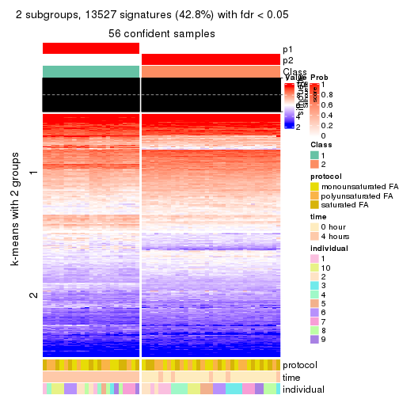</p>

</div>
<div id='tab-MAD-kmeans-get-signatures-no-scale-2'>
<pre><code class="r">get_signatures(res, k = 3, scale_rows = FALSE)
</code></pre>

<p>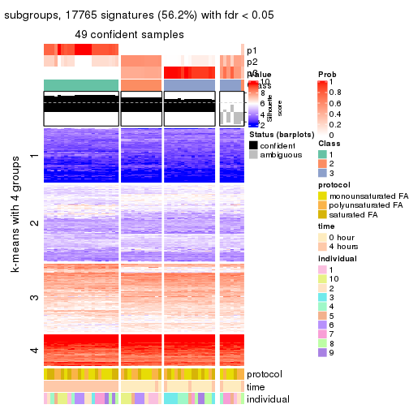</p>

</div>
<div id='tab-MAD-kmeans-get-signatures-no-scale-3'>
<pre><code class="r">get_signatures(res, k = 4, scale_rows = FALSE)
</code></pre>

<p>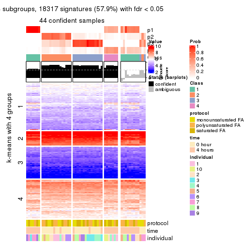</p>

</div>
<div id='tab-MAD-kmeans-get-signatures-no-scale-4'>
<pre><code class="r">get_signatures(res, k = 5, scale_rows = FALSE)
</code></pre>

<p>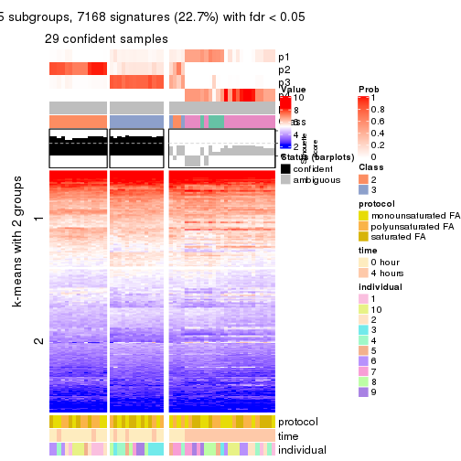</p>

</div>
<div id='tab-MAD-kmeans-get-signatures-no-scale-5'>
<pre><code class="r">get_signatures(res, k = 6, scale_rows = FALSE)
</code></pre>

<p>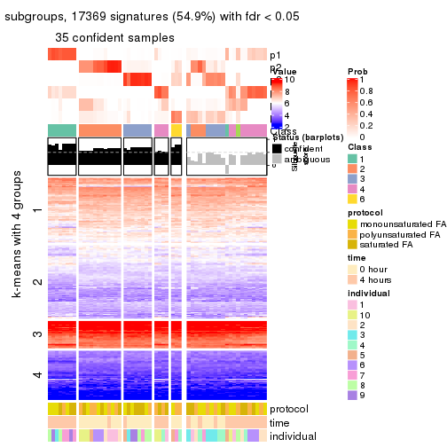</p>

</div>
</div>


Compare the overlap of signatures from different k:

```r
compare_signatures(res)
```

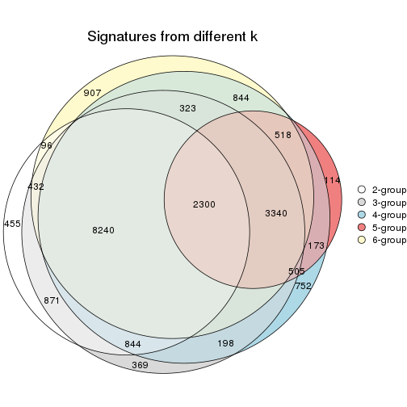

`get_signature()` returns a data frame invisibly. TO get the list of signatures, the function
call should be assigned to a variable explicitly. In following code, if `plot` argument is set
to `FALSE`, no heatmap is plotted while only the differential analysis is performed.

```r
# code only for demonstration
tb = get_signature(res, k = ..., plot = FALSE)
```

An example of the output of `tb` is:

```
#>   which_row         fdr    mean_1    mean_2 scaled_mean_1 scaled_mean_2 km
#> 1        38 0.042760348  8.373488  9.131774    -0.5533452     0.5164555  1
#> 2        40 0.018707592  7.106213  8.469186    -0.6173731     0.5762149  1
#> 3        55 0.019134737 10.221463 11.207825    -0.6159697     0.5749050  1
#> 4        59 0.006059896  5.921854  7.869574    -0.6899429     0.6439467  1
#> 5        60 0.018055526  8.928898 10.211722    -0.6204761     0.5791110  1
#> 6        98 0.009384629 15.714769 14.887706     0.6635654    -0.6193277  2
...
```

The columns in `tb` are:

1. `which_row`: row indices corresponding to the input matrix.
2. `fdr`: FDR for the differential test. 
3. `mean_x`: The mean value in group x.
4. `scaled_mean_x`: The mean value in group x after rows are scaled.
5. `km`: Row groups if k-means clustering is applied to rows.


UMAP plot which shows how samples are separated.


<script>
$( function() {
	$( '#tabs-MAD-kmeans-dimension-reduction' ).tabs();
} );
</script>
<div id='tabs-MAD-kmeans-dimension-reduction'>
<ul>
<li><a href='#tab-MAD-kmeans-dimension-reduction-1'>k = 2</a></li>
<li><a href='#tab-MAD-kmeans-dimension-reduction-2'>k = 3</a></li>
<li><a href='#tab-MAD-kmeans-dimension-reduction-3'>k = 4</a></li>
<li><a href='#tab-MAD-kmeans-dimension-reduction-4'>k = 5</a></li>
<li><a href='#tab-MAD-kmeans-dimension-reduction-5'>k = 6</a></li>
</ul>
<div id='tab-MAD-kmeans-dimension-reduction-1'>
<pre><code class="r">dimension_reduction(res, k = 2, method = &quot;UMAP&quot;)
</code></pre>

<p>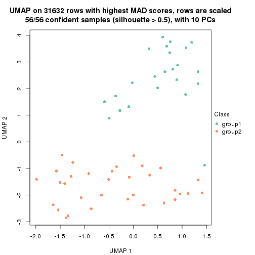</p>

</div>
<div id='tab-MAD-kmeans-dimension-reduction-2'>
<pre><code class="r">dimension_reduction(res, k = 3, method = &quot;UMAP&quot;)
</code></pre>

<p>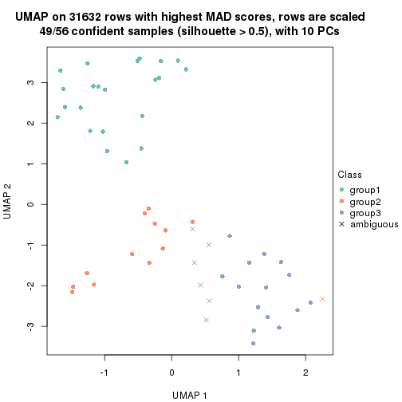</p>

</div>
<div id='tab-MAD-kmeans-dimension-reduction-3'>
<pre><code class="r">dimension_reduction(res, k = 4, method = &quot;UMAP&quot;)
</code></pre>

<p>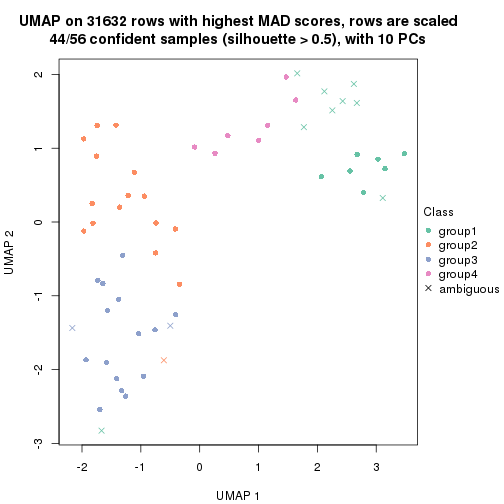</p>

</div>
<div id='tab-MAD-kmeans-dimension-reduction-4'>
<pre><code class="r">dimension_reduction(res, k = 5, method = &quot;UMAP&quot;)
</code></pre>

<p>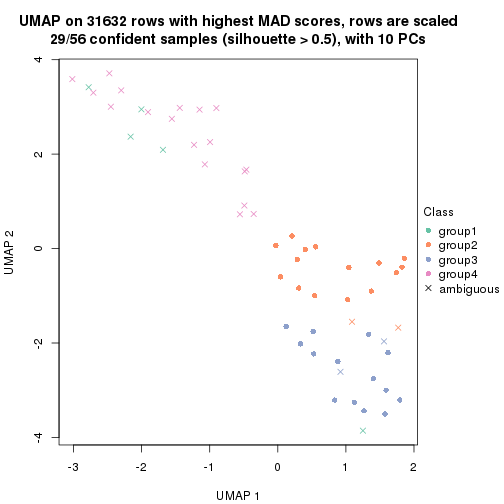</p>

</div>
<div id='tab-MAD-kmeans-dimension-reduction-5'>
<pre><code class="r">dimension_reduction(res, k = 6, method = &quot;UMAP&quot;)
</code></pre>

<p>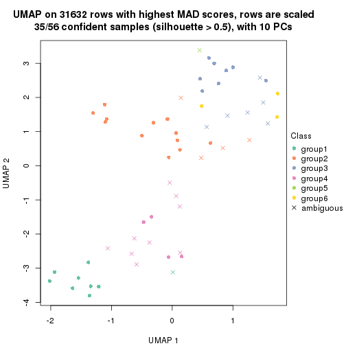</p>

</div>
</div>


Following heatmap shows how subgroups are split when increasing `k`:

```r
collect_classes(res)
```

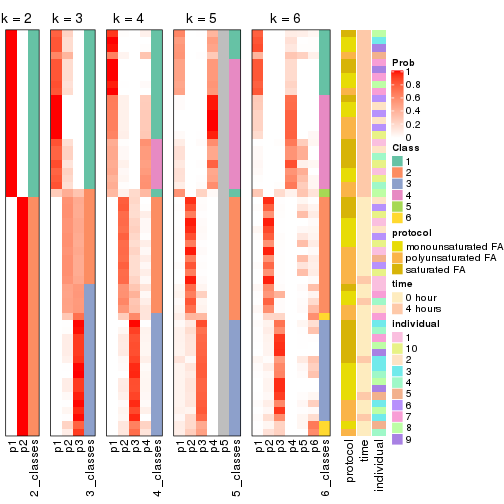


Test correlation between subgroups and known annotations. If the known
annotation is numeric, one-way ANOVA test is applied, and if the known
annotation is discrete, chi-squared contingency table test is applied.

```r
test_to_known_factors(res)
```

```
#>             n protocol(p)  time(p) individual(p) k
#> MAD:kmeans 56       0.937 2.29e-09       0.95024 2
#> MAD:kmeans 49       0.889 1.78e-08       0.03592 3
#> MAD:kmeans 44       0.653 5.47e-06       0.00210 4
#> MAD:kmeans 29       0.505 9.32e-01       0.00381 5
#> MAD:kmeans 35       0.429 1.55e-05       0.03578 6
```


If matrix rows can be associated to genes, consider to use `functional_enrichment(res,
...)` to perform function enrichment for the signature genes. See [this vignette](http://bioconductor.org/packages/devel/bioc/vignettes/cola/inst/doc/functional_enrichment.html) for more detailed explanations.


 

---------------------------------------------------


### MAD:skmeans**


The object with results only for a single top-value method and a single partition method 
can be extracted as:

```r
res = res_list["MAD", "skmeans"]
# you can also extract it by
# res = res_list["MAD:skmeans"]
```

A summary of `res` and all the functions that can be applied to it:

```r
res
```

```
#> A 'ConsensusPartition' object with k = 2, 3, 4, 5, 6.
#>   On a matrix with 31632 rows and 56 columns.
#>   Top rows (1000, 2000, 3000, 4000, 5000) are extracted by 'MAD' method.
#>   Subgroups are detected by 'skmeans' method.
#>   Performed in total 1250 partitions by row resampling.
#>   Best k for subgroups seems to be 3.
#> 
#> Following methods can be applied to this 'ConsensusPartition' object:
#>  [1] "cola_report"             "collect_classes"         "collect_plots"          
#>  [4] "collect_stats"           "colnames"                "compare_signatures"     
#>  [7] "consensus_heatmap"       "dimension_reduction"     "functional_enrichment"  
#> [10] "get_anno_col"            "get_anno"                "get_classes"            
#> [13] "get_consensus"           "get_matrix"              "get_membership"         
#> [16] "get_param"               "get_signatures"          "get_stats"              
#> [19] "is_best_k"               "is_stable_k"             "membership_heatmap"     
#> [22] "ncol"                    "nrow"                    "plot_ecdf"              
#> [25] "rownames"                "select_partition_number" "show"                   
#> [28] "suggest_best_k"          "test_to_known_factors"
```

`collect_plots()` function collects all the plots made from `res` for all `k` (number of partitions)
into one single page to provide an easy and fast comparison between different `k`.

```r
collect_plots(res)
```

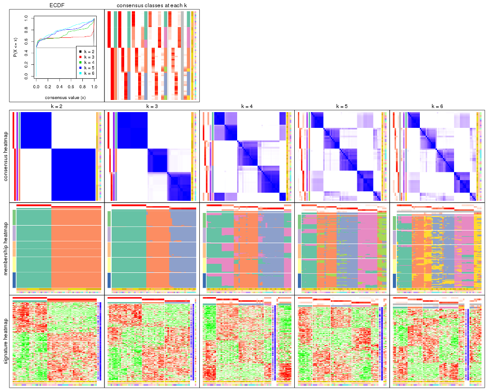

The plots are:

- The first row: a plot of the ECDF (empirical cumulative distribution
  function) curves of the consensus matrix for each `k` and the heatmap of
  predicted classes for each `k`.
- The second row: heatmaps of the consensus matrix for each `k`.
- The third row: heatmaps of the membership matrix for each `k`.
- The fouth row: heatmaps of the signatures for each `k`.

All the plots in panels can be made by individual functions and they are
plotted later in this section.

`select_partition_number()` produces several plots showing different
statistics for choosing "optimized" `k`. There are following statistics:

- ECDF curves of the consensus matrix for each `k`;
- 1-PAC. [The PAC
  score](https://en.wikipedia.org/wiki/Consensus_clustering#Over-interpretation_potential_of_consensus_clustering)
  measures the proportion of the ambiguous subgrouping.
- Mean silhouette score.
- Concordance. The mean probability of fiting the consensus class ids in all
  partitions.
- Area increased. Denote $A_k$ as the area under the ECDF curve for current
  `k`, the area increased is defined as $A_k - A_{k-1}$.
- Rand index. The percent of pairs of samples that are both in a same cluster
  or both are not in a same cluster in the partition of k and k-1.
- Jaccard index. The ratio of pairs of samples are both in a same cluster in
  the partition of k and k-1 and the pairs of samples are both in a same
  cluster in the partition k or k-1.

The detailed explanations of these statistics can be found in [the _cola_
vignette](http://bioconductor.org/packages/devel/bioc/vignettes/cola/inst/doc/cola.html#toc_13).

Generally speaking, lower PAC score, higher mean silhouette score or higher
concordance corresponds to better partition. Rand index and Jaccard index
measure how similar the current partition is compared to partition with `k-1`.
If they are too similar, we won't accept `k` is better than `k-1`.

```r
select_partition_number(res)
```

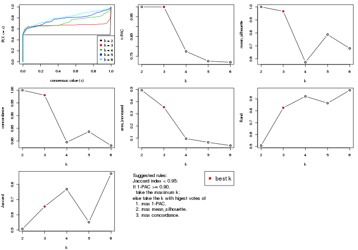

The numeric values for all these statistics can be obtained by `get_stats()`.

```r
get_stats(res)
```

```
#>   k 1-PAC mean_silhouette concordance area_increased  Rand Jaccard
#> 2 2 1.000           1.000       1.000         0.4934 0.507   0.507
#> 3 3 1.000           0.966       0.980         0.3544 0.825   0.654
#> 4 4 0.774           0.574       0.795         0.0958 0.921   0.768
#> 5 5 0.725           0.787       0.837         0.0653 0.864   0.551
#> 6 6 0.719           0.681       0.782         0.0389 0.972   0.871
```

`suggest_best_k()` suggests the best $k$ based on these statistics. The rules are as follows:

- All $k$ with Jaccard index larger than 0.95 are removed because increasing
  $k$ does not provide enough extra information. If all $k$ are removed, it is
  marked as no subgroup is detected.
- For all $k$ with 1-PAC score larger than 0.9, the maximal $k$ is taken as
  the best $k$, and other $k$ are marked as optional $k$.
- If it does not fit the second rule. The $k$ with the maximal vote of the
  highest 1-PAC score, highest mean silhouette, and highest concordance is
  taken as the best $k$.

```r
suggest_best_k(res)
```

```
#> [1] 3
#> attr(,"optional")
#> [1] 2
```

There is also optional best $k$ = 2 that is worth to check.

Following shows the table of the partitions (You need to click the **show/hide
code output** link to see it). The membership matrix (columns with name `p*`)
is inferred by
[`clue::cl_consensus()`](https://www.rdocumentation.org/link/cl_consensus?package=clue)
function with the `SE` method. Basically the value in the membership matrix
represents the probability to belong to a certain group. The finall class
label for an item is determined with the group with highest probability it
belongs to.

In `get_classes()` function, the entropy is calculated from the membership
matrix and the silhouette score is calculated from the consensus matrix.


<script>
$( function() {
	$( '#tabs-MAD-skmeans-get-classes' ).tabs();
} );
</script>
<div id='tabs-MAD-skmeans-get-classes'>
<ul>
<li><a href='#tab-MAD-skmeans-get-classes-1'>k = 2</a></li>
<li><a href='#tab-MAD-skmeans-get-classes-2'>k = 3</a></li>
<li><a href='#tab-MAD-skmeans-get-classes-3'>k = 4</a></li>
<li><a href='#tab-MAD-skmeans-get-classes-4'>k = 5</a></li>
<li><a href='#tab-MAD-skmeans-get-classes-5'>k = 6</a></li>
</ul>

<div id='tab-MAD-skmeans-get-classes-1'>
<p><a id='tab-MAD-skmeans-get-classes-1-a' style='color:#0366d6' href='#'>show/hide code output</a></p>
<pre><code class="r">cbind(get_classes(res, k = 2), get_membership(res, k = 2))
</code></pre>

<pre><code>#&gt;           class entropy silhouette p1 p2
#&gt; GSM790742     2       0          1  0  1
#&gt; GSM790744     2       0          1  0  1
#&gt; GSM790754     2       0          1  0  1
#&gt; GSM790756     2       0          1  0  1
#&gt; GSM790768     2       0          1  0  1
#&gt; GSM790774     2       0          1  0  1
#&gt; GSM790778     2       0          1  0  1
#&gt; GSM790784     2       0          1  0  1
#&gt; GSM790790     2       0          1  0  1
#&gt; GSM790743     1       0          1  1  0
#&gt; GSM790745     1       0          1  1  0
#&gt; GSM790755     2       0          1  0  1
#&gt; GSM790757     1       0          1  1  0
#&gt; GSM790769     1       0          1  1  0
#&gt; GSM790775     1       0          1  1  0
#&gt; GSM790779     1       0          1  1  0
#&gt; GSM790785     1       0          1  1  0
#&gt; GSM790791     1       0          1  1  0
#&gt; GSM790738     2       0          1  0  1
#&gt; GSM790746     2       0          1  0  1
#&gt; GSM790752     2       0          1  0  1
#&gt; GSM790758     2       0          1  0  1
#&gt; GSM790764     2       0          1  0  1
#&gt; GSM790766     2       0          1  0  1
#&gt; GSM790772     2       0          1  0  1
#&gt; GSM790782     2       0          1  0  1
#&gt; GSM790786     2       0          1  0  1
#&gt; GSM790792     2       0          1  0  1
#&gt; GSM790739     1       0          1  1  0
#&gt; GSM790747     1       0          1  1  0
#&gt; GSM790753     1       0          1  1  0
#&gt; GSM790759     2       0          1  0  1
#&gt; GSM790765     2       0          1  0  1
#&gt; GSM790767     1       0          1  1  0
#&gt; GSM790773     1       0          1  1  0
#&gt; GSM790783     1       0          1  1  0
#&gt; GSM790787     1       0          1  1  0
#&gt; GSM790793     1       0          1  1  0
#&gt; GSM790740     2       0          1  0  1
#&gt; GSM790748     2       0          1  0  1
#&gt; GSM790750     2       0          1  0  1
#&gt; GSM790760     2       0          1  0  1
#&gt; GSM790762     2       0          1  0  1
#&gt; GSM790770     2       0          1  0  1
#&gt; GSM790776     2       0          1  0  1
#&gt; GSM790780     2       0          1  0  1
#&gt; GSM790788     2       0          1  0  1
#&gt; GSM790741     2       0          1  0  1
#&gt; GSM790749     1       0          1  1  0
#&gt; GSM790751     2       0          1  0  1
#&gt; GSM790761     1       0          1  1  0
#&gt; GSM790763     1       0          1  1  0
#&gt; GSM790771     1       0          1  1  0
#&gt; GSM790777     1       0          1  1  0
#&gt; GSM790781     1       0          1  1  0
#&gt; GSM790789     1       0          1  1  0
</code></pre>

<script>
$('#tab-MAD-skmeans-get-classes-1-a').parent().next().next().hide();
$('#tab-MAD-skmeans-get-classes-1-a').click(function(){
  $('#tab-MAD-skmeans-get-classes-1-a').parent().next().next().toggle();
  return(false);
});
</script>
</div>

<div id='tab-MAD-skmeans-get-classes-2'>
<p><a id='tab-MAD-skmeans-get-classes-2-a' style='color:#0366d6' href='#'>show/hide code output</a></p>
<pre><code class="r">cbind(get_classes(res, k = 3), get_membership(res, k = 3))
</code></pre>

<pre><code>#&gt;           class entropy silhouette    p1    p2    p3
#&gt; GSM790742     2  0.1529      0.967 0.000 0.960 0.040
#&gt; GSM790744     2  0.0237      0.989 0.000 0.996 0.004
#&gt; GSM790754     3  0.0237      0.952 0.000 0.004 0.996
#&gt; GSM790756     3  0.0747      0.951 0.000 0.016 0.984
#&gt; GSM790768     2  0.0237      0.989 0.000 0.996 0.004
#&gt; GSM790774     3  0.1529      0.946 0.000 0.040 0.960
#&gt; GSM790778     3  0.1411      0.947 0.000 0.036 0.964
#&gt; GSM790784     3  0.1411      0.948 0.000 0.036 0.964
#&gt; GSM790790     2  0.0237      0.989 0.000 0.996 0.004
#&gt; GSM790743     1  0.0000      0.999 1.000 0.000 0.000
#&gt; GSM790745     1  0.0000      0.999 1.000 0.000 0.000
#&gt; GSM790755     3  0.0000      0.951 0.000 0.000 1.000
#&gt; GSM790757     1  0.0000      0.999 1.000 0.000 0.000
#&gt; GSM790769     1  0.0000      0.999 1.000 0.000 0.000
#&gt; GSM790775     1  0.0237      0.998 0.996 0.004 0.000
#&gt; GSM790779     1  0.0237      0.998 0.996 0.004 0.000
#&gt; GSM790785     1  0.0237      0.998 0.996 0.004 0.000
#&gt; GSM790791     1  0.0000      0.999 1.000 0.000 0.000
#&gt; GSM790738     2  0.0237      0.989 0.000 0.996 0.004
#&gt; GSM790746     2  0.0424      0.987 0.000 0.992 0.008
#&gt; GSM790752     3  0.0237      0.952 0.000 0.004 0.996
#&gt; GSM790758     3  0.0000      0.951 0.000 0.000 1.000
#&gt; GSM790764     3  0.1643      0.933 0.000 0.044 0.956
#&gt; GSM790766     2  0.1964      0.943 0.000 0.944 0.056
#&gt; GSM790772     3  0.6140      0.392 0.000 0.404 0.596
#&gt; GSM790782     3  0.1529      0.946 0.000 0.040 0.960
#&gt; GSM790786     3  0.1529      0.946 0.000 0.040 0.960
#&gt; GSM790792     2  0.0237      0.989 0.000 0.996 0.004
#&gt; GSM790739     1  0.0000      0.999 1.000 0.000 0.000
#&gt; GSM790747     1  0.0000      0.999 1.000 0.000 0.000
#&gt; GSM790753     1  0.0237      0.998 0.996 0.004 0.000
#&gt; GSM790759     2  0.1163      0.976 0.000 0.972 0.028
#&gt; GSM790765     3  0.0747      0.952 0.000 0.016 0.984
#&gt; GSM790767     1  0.0000      0.999 1.000 0.000 0.000
#&gt; GSM790773     1  0.0237      0.998 0.996 0.004 0.000
#&gt; GSM790783     1  0.0237      0.998 0.996 0.004 0.000
#&gt; GSM790787     1  0.0237      0.998 0.996 0.004 0.000
#&gt; GSM790793     1  0.0000      0.999 1.000 0.000 0.000
#&gt; GSM790740     2  0.0237      0.989 0.000 0.996 0.004
#&gt; GSM790748     2  0.1529      0.967 0.000 0.960 0.040
#&gt; GSM790750     3  0.0237      0.952 0.000 0.004 0.996
#&gt; GSM790760     3  0.0592      0.950 0.000 0.012 0.988
#&gt; GSM790762     2  0.0237      0.989 0.000 0.996 0.004
#&gt; GSM790770     2  0.0237      0.989 0.000 0.996 0.004
#&gt; GSM790776     3  0.3619      0.841 0.000 0.136 0.864
#&gt; GSM790780     3  0.0592      0.953 0.000 0.012 0.988
#&gt; GSM790788     2  0.0237      0.989 0.000 0.996 0.004
#&gt; GSM790741     2  0.0237      0.989 0.000 0.996 0.004
#&gt; GSM790749     1  0.0000      0.999 1.000 0.000 0.000
#&gt; GSM790751     3  0.0000      0.951 0.000 0.000 1.000
#&gt; GSM790761     1  0.0000      0.999 1.000 0.000 0.000
#&gt; GSM790763     1  0.0237      0.998 0.996 0.004 0.000
#&gt; GSM790771     1  0.0000      0.999 1.000 0.000 0.000
#&gt; GSM790777     1  0.0237      0.998 0.996 0.004 0.000
#&gt; GSM790781     1  0.0237      0.998 0.996 0.004 0.000
#&gt; GSM790789     1  0.0000      0.999 1.000 0.000 0.000
</code></pre>

<script>
$('#tab-MAD-skmeans-get-classes-2-a').parent().next().next().hide();
$('#tab-MAD-skmeans-get-classes-2-a').click(function(){
  $('#tab-MAD-skmeans-get-classes-2-a').parent().next().next().toggle();
  return(false);
});
</script>
</div>

<div id='tab-MAD-skmeans-get-classes-3'>
<p><a id='tab-MAD-skmeans-get-classes-3-a' style='color:#0366d6' href='#'>show/hide code output</a></p>
<pre><code class="r">cbind(get_classes(res, k = 4), get_membership(res, k = 4))
</code></pre>

<pre><code>#&gt;           class entropy silhouette    p1    p2    p3    p4
#&gt; GSM790742     2  0.4722     0.7604 0.000 0.692 0.008 0.300
#&gt; GSM790744     2  0.0707     0.8924 0.000 0.980 0.000 0.020
#&gt; GSM790754     3  0.0469     0.9150 0.000 0.000 0.988 0.012
#&gt; GSM790756     3  0.2546     0.8851 0.000 0.008 0.900 0.092
#&gt; GSM790768     2  0.0376     0.8927 0.000 0.992 0.004 0.004
#&gt; GSM790774     3  0.0895     0.9125 0.000 0.020 0.976 0.004
#&gt; GSM790778     3  0.0336     0.9148 0.000 0.008 0.992 0.000
#&gt; GSM790784     3  0.0336     0.9148 0.000 0.008 0.992 0.000
#&gt; GSM790790     2  0.0592     0.8925 0.000 0.984 0.000 0.016
#&gt; GSM790743     4  0.4972     0.9747 0.456 0.000 0.000 0.544
#&gt; GSM790745     4  0.4955     0.9782 0.444 0.000 0.000 0.556
#&gt; GSM790755     3  0.2408     0.8693 0.000 0.000 0.896 0.104
#&gt; GSM790757     4  0.4955     0.9782 0.444 0.000 0.000 0.556
#&gt; GSM790769     1  0.4972    -0.6720 0.544 0.000 0.000 0.456
#&gt; GSM790775     1  0.0188     0.5374 0.996 0.000 0.000 0.004
#&gt; GSM790779     1  0.1022     0.5176 0.968 0.000 0.000 0.032
#&gt; GSM790785     1  0.0000     0.5386 1.000 0.000 0.000 0.000
#&gt; GSM790791     1  0.4985    -0.7094 0.532 0.000 0.000 0.468
#&gt; GSM790738     2  0.1489     0.8905 0.000 0.952 0.004 0.044
#&gt; GSM790746     2  0.2402     0.8830 0.000 0.912 0.012 0.076
#&gt; GSM790752     3  0.1022     0.9130 0.000 0.000 0.968 0.032
#&gt; GSM790758     3  0.1792     0.9009 0.000 0.000 0.932 0.068
#&gt; GSM790764     3  0.6750     0.5913 0.000 0.128 0.584 0.288
#&gt; GSM790766     2  0.3024     0.7888 0.000 0.852 0.148 0.000
#&gt; GSM790772     2  0.5500     0.0421 0.000 0.520 0.464 0.016
#&gt; GSM790782     3  0.0469     0.9146 0.000 0.012 0.988 0.000
#&gt; GSM790786     3  0.0469     0.9146 0.000 0.012 0.988 0.000
#&gt; GSM790792     2  0.0592     0.8925 0.000 0.984 0.000 0.016
#&gt; GSM790739     4  0.4961     0.9809 0.448 0.000 0.000 0.552
#&gt; GSM790747     1  0.4972    -0.6720 0.544 0.000 0.000 0.456
#&gt; GSM790753     1  0.0336     0.5346 0.992 0.000 0.000 0.008
#&gt; GSM790759     2  0.4399     0.8053 0.000 0.760 0.016 0.224
#&gt; GSM790765     3  0.0469     0.9155 0.000 0.012 0.988 0.000
#&gt; GSM790767     1  0.4977    -0.6807 0.540 0.000 0.000 0.460
#&gt; GSM790773     1  0.0000     0.5386 1.000 0.000 0.000 0.000
#&gt; GSM790783     1  0.0188     0.5374 0.996 0.000 0.000 0.004
#&gt; GSM790787     1  0.0000     0.5386 1.000 0.000 0.000 0.000
#&gt; GSM790793     1  0.4985    -0.7094 0.532 0.000 0.000 0.468
#&gt; GSM790740     2  0.1635     0.8902 0.000 0.948 0.008 0.044
#&gt; GSM790748     2  0.4936     0.7437 0.000 0.672 0.012 0.316
#&gt; GSM790750     3  0.1022     0.9132 0.000 0.000 0.968 0.032
#&gt; GSM790760     3  0.4883     0.7314 0.000 0.016 0.696 0.288
#&gt; GSM790762     2  0.0592     0.8925 0.000 0.984 0.000 0.016
#&gt; GSM790770     2  0.1118     0.8908 0.000 0.964 0.000 0.036
#&gt; GSM790776     3  0.7013     0.5377 0.000 0.152 0.556 0.292
#&gt; GSM790780     3  0.0188     0.9150 0.000 0.004 0.996 0.000
#&gt; GSM790788     2  0.0592     0.8925 0.000 0.984 0.000 0.016
#&gt; GSM790741     2  0.2089     0.8874 0.000 0.932 0.020 0.048
#&gt; GSM790749     1  0.4977    -0.6807 0.540 0.000 0.000 0.460
#&gt; GSM790751     3  0.0707     0.9152 0.000 0.000 0.980 0.020
#&gt; GSM790761     4  0.4972     0.9747 0.456 0.000 0.000 0.544
#&gt; GSM790763     1  0.0592     0.5298 0.984 0.000 0.000 0.016
#&gt; GSM790771     1  0.4977    -0.6807 0.540 0.000 0.000 0.460
#&gt; GSM790777     1  0.0000     0.5386 1.000 0.000 0.000 0.000
#&gt; GSM790781     1  0.3161     0.4185 0.864 0.000 0.012 0.124
#&gt; GSM790789     1  0.4977    -0.6807 0.540 0.000 0.000 0.460
</code></pre>

<script>
$('#tab-MAD-skmeans-get-classes-3-a').parent().next().next().hide();
$('#tab-MAD-skmeans-get-classes-3-a').click(function(){
  $('#tab-MAD-skmeans-get-classes-3-a').parent().next().next().toggle();
  return(false);
});
</script>
</div>

<div id='tab-MAD-skmeans-get-classes-4'>
<p><a id='tab-MAD-skmeans-get-classes-4-a' style='color:#0366d6' href='#'>show/hide code output</a></p>
<pre><code class="r">cbind(get_classes(res, k = 5), get_membership(res, k = 5))
</code></pre>

<pre><code>#&gt;           class entropy silhouette    p1    p2    p3    p4    p5
#&gt; GSM790742     5  0.3586     0.5089 0.000 0.264 0.000 0.000 0.736
#&gt; GSM790744     2  0.2463     0.7676 0.004 0.888 0.008 0.000 0.100
#&gt; GSM790754     3  0.2568     0.8684 0.016 0.004 0.888 0.000 0.092
#&gt; GSM790756     3  0.5185     0.6340 0.028 0.040 0.684 0.000 0.248
#&gt; GSM790768     2  0.1200     0.7819 0.012 0.964 0.008 0.000 0.016
#&gt; GSM790774     3  0.2026     0.8650 0.016 0.044 0.928 0.000 0.012
#&gt; GSM790778     3  0.0932     0.8849 0.004 0.020 0.972 0.000 0.004
#&gt; GSM790784     3  0.0703     0.8852 0.000 0.024 0.976 0.000 0.000
#&gt; GSM790790     2  0.1267     0.7783 0.012 0.960 0.004 0.000 0.024
#&gt; GSM790743     4  0.0290     0.8802 0.000 0.000 0.000 0.992 0.008
#&gt; GSM790745     4  0.2409     0.8267 0.032 0.000 0.000 0.900 0.068
#&gt; GSM790755     3  0.4225     0.7817 0.076 0.004 0.784 0.000 0.136
#&gt; GSM790757     4  0.2409     0.8267 0.032 0.000 0.000 0.900 0.068
#&gt; GSM790769     4  0.2230     0.8968 0.116 0.000 0.000 0.884 0.000
#&gt; GSM790775     1  0.3395     0.9469 0.764 0.000 0.000 0.236 0.000
#&gt; GSM790779     1  0.2806     0.8777 0.844 0.000 0.000 0.152 0.004
#&gt; GSM790785     1  0.3395     0.9469 0.764 0.000 0.000 0.236 0.000
#&gt; GSM790791     4  0.1851     0.9111 0.088 0.000 0.000 0.912 0.000
#&gt; GSM790738     2  0.3879     0.7175 0.016 0.784 0.012 0.000 0.188
#&gt; GSM790746     2  0.4444     0.6353 0.012 0.708 0.016 0.000 0.264
#&gt; GSM790752     3  0.3174     0.8521 0.020 0.004 0.844 0.000 0.132
#&gt; GSM790758     3  0.3484     0.8298 0.028 0.004 0.824 0.000 0.144
#&gt; GSM790764     5  0.6201     0.5549 0.016 0.152 0.232 0.000 0.600
#&gt; GSM790766     2  0.4261     0.6154 0.012 0.780 0.160 0.000 0.048
#&gt; GSM790772     2  0.6045     0.0520 0.028 0.500 0.416 0.000 0.056
#&gt; GSM790782     3  0.0771     0.8853 0.000 0.020 0.976 0.000 0.004
#&gt; GSM790786     3  0.0703     0.8852 0.000 0.024 0.976 0.000 0.000
#&gt; GSM790792     2  0.1267     0.7783 0.012 0.960 0.004 0.000 0.024
#&gt; GSM790739     4  0.1809     0.8544 0.012 0.000 0.000 0.928 0.060
#&gt; GSM790747     4  0.2230     0.8968 0.116 0.000 0.000 0.884 0.000
#&gt; GSM790753     1  0.3424     0.9446 0.760 0.000 0.000 0.240 0.000
#&gt; GSM790759     5  0.4779     0.0546 0.012 0.448 0.004 0.000 0.536
#&gt; GSM790765     3  0.1243     0.8840 0.004 0.028 0.960 0.000 0.008
#&gt; GSM790767     4  0.2127     0.9038 0.108 0.000 0.000 0.892 0.000
#&gt; GSM790773     1  0.3366     0.9467 0.768 0.000 0.000 0.232 0.000
#&gt; GSM790783     1  0.3424     0.9446 0.760 0.000 0.000 0.240 0.000
#&gt; GSM790787     1  0.3366     0.9467 0.768 0.000 0.000 0.232 0.000
#&gt; GSM790793     4  0.1792     0.9108 0.084 0.000 0.000 0.916 0.000
#&gt; GSM790740     2  0.4072     0.7147 0.016 0.776 0.020 0.000 0.188
#&gt; GSM790748     5  0.3480     0.5394 0.000 0.248 0.000 0.000 0.752
#&gt; GSM790750     3  0.3264     0.8520 0.024 0.004 0.840 0.000 0.132
#&gt; GSM790760     5  0.4469     0.5012 0.016 0.012 0.268 0.000 0.704
#&gt; GSM790762     2  0.1267     0.7783 0.012 0.960 0.004 0.000 0.024
#&gt; GSM790770     2  0.1571     0.7562 0.004 0.936 0.000 0.000 0.060
#&gt; GSM790776     5  0.5978     0.5568 0.016 0.112 0.260 0.000 0.612
#&gt; GSM790780     3  0.0740     0.8843 0.004 0.008 0.980 0.000 0.008
#&gt; GSM790788     2  0.1267     0.7783 0.012 0.960 0.004 0.000 0.024
#&gt; GSM790741     2  0.4280     0.7073 0.016 0.764 0.028 0.000 0.192
#&gt; GSM790749     4  0.2020     0.9091 0.100 0.000 0.000 0.900 0.000
#&gt; GSM790751     3  0.3613     0.8210 0.016 0.012 0.812 0.000 0.160
#&gt; GSM790761     4  0.0290     0.8802 0.000 0.000 0.000 0.992 0.008
#&gt; GSM790763     1  0.3491     0.9254 0.768 0.000 0.000 0.228 0.004
#&gt; GSM790771     4  0.2020     0.9091 0.100 0.000 0.000 0.900 0.000
#&gt; GSM790777     1  0.3395     0.9469 0.764 0.000 0.000 0.236 0.000
#&gt; GSM790781     1  0.2976     0.7511 0.880 0.000 0.012 0.064 0.044
#&gt; GSM790789     4  0.1965     0.9103 0.096 0.000 0.000 0.904 0.000
</code></pre>

<script>
$('#tab-MAD-skmeans-get-classes-4-a').parent().next().next().hide();
$('#tab-MAD-skmeans-get-classes-4-a').click(function(){
  $('#tab-MAD-skmeans-get-classes-4-a').parent().next().next().toggle();
  return(false);
});
</script>
</div>

<div id='tab-MAD-skmeans-get-classes-5'>
<p><a id='tab-MAD-skmeans-get-classes-5-a' style='color:#0366d6' href='#'>show/hide code output</a></p>
<pre><code class="r">cbind(get_classes(res, k = 6), get_membership(res, k = 6))
</code></pre>

<pre><code>#&gt;           class entropy silhouette    p1    p2    p3    p4 p5    p6
#&gt; GSM790742     6  0.4688      0.444 0.008 0.400 0.000 0.000 NA 0.560
#&gt; GSM790744     2  0.3430      0.674 0.000 0.772 0.004 0.000 NA 0.016
#&gt; GSM790754     3  0.4476      0.675 0.000 0.016 0.740 0.000 NA 0.128
#&gt; GSM790756     3  0.4985      0.364 0.004 0.032 0.552 0.000 NA 0.396
#&gt; GSM790768     2  0.4266      0.694 0.000 0.628 0.016 0.000 NA 0.008
#&gt; GSM790774     3  0.2523      0.706 0.004 0.048 0.896 0.000 NA 0.036
#&gt; GSM790778     3  0.0405      0.738 0.000 0.008 0.988 0.000 NA 0.000
#&gt; GSM790784     3  0.0551      0.739 0.000 0.004 0.984 0.000 NA 0.008
#&gt; GSM790790     2  0.3961      0.690 0.000 0.556 0.000 0.000 NA 0.004
#&gt; GSM790743     4  0.2422      0.787 0.040 0.000 0.000 0.896 NA 0.012
#&gt; GSM790745     4  0.3686      0.695 0.016 0.000 0.000 0.792 NA 0.036
#&gt; GSM790755     3  0.6281      0.412 0.016 0.004 0.476 0.000 NA 0.200
#&gt; GSM790757     4  0.3686      0.695 0.016 0.000 0.000 0.792 NA 0.036
#&gt; GSM790769     4  0.2883      0.825 0.212 0.000 0.000 0.788 NA 0.000
#&gt; GSM790775     1  0.2048      0.924 0.880 0.000 0.000 0.120 NA 0.000
#&gt; GSM790779     1  0.1124      0.860 0.956 0.000 0.000 0.036 NA 0.000
#&gt; GSM790785     1  0.2003      0.924 0.884 0.000 0.000 0.116 NA 0.000
#&gt; GSM790791     4  0.3354      0.841 0.184 0.000 0.000 0.792 NA 0.008
#&gt; GSM790738     2  0.0870      0.583 0.000 0.972 0.004 0.000 NA 0.012
#&gt; GSM790746     2  0.3536      0.492 0.004 0.820 0.012 0.000 NA 0.116
#&gt; GSM790752     3  0.4962      0.658 0.004 0.020 0.696 0.000 NA 0.184
#&gt; GSM790758     3  0.4910      0.498 0.004 0.012 0.596 0.000 NA 0.348
#&gt; GSM790764     6  0.5510      0.568 0.000 0.028 0.164 0.000 NA 0.636
#&gt; GSM790766     2  0.6271      0.431 0.000 0.480 0.256 0.000 NA 0.020
#&gt; GSM790772     3  0.6258      0.087 0.004 0.376 0.476 0.000 NA 0.064
#&gt; GSM790782     3  0.0767      0.738 0.000 0.008 0.976 0.000 NA 0.004
#&gt; GSM790786     3  0.0405      0.739 0.000 0.004 0.988 0.000 NA 0.000
#&gt; GSM790792     2  0.3955      0.690 0.000 0.560 0.000 0.000 NA 0.004
#&gt; GSM790739     4  0.3292      0.738 0.032 0.000 0.000 0.836 NA 0.024
#&gt; GSM790747     4  0.2854      0.829 0.208 0.000 0.000 0.792 NA 0.000
#&gt; GSM790753     1  0.2178      0.919 0.868 0.000 0.000 0.132 NA 0.000
#&gt; GSM790759     2  0.5069     -0.166 0.004 0.588 0.012 0.000 NA 0.344
#&gt; GSM790765     3  0.1257      0.735 0.000 0.000 0.952 0.000 NA 0.020
#&gt; GSM790767     4  0.2762      0.838 0.196 0.000 0.000 0.804 NA 0.000
#&gt; GSM790773     1  0.2003      0.924 0.884 0.000 0.000 0.116 NA 0.000
#&gt; GSM790783     1  0.2340      0.904 0.852 0.000 0.000 0.148 NA 0.000
#&gt; GSM790787     1  0.2092      0.924 0.876 0.000 0.000 0.124 NA 0.000
#&gt; GSM790793     4  0.3321      0.842 0.180 0.000 0.000 0.796 NA 0.008
#&gt; GSM790740     2  0.1448      0.559 0.000 0.948 0.024 0.000 NA 0.016
#&gt; GSM790748     6  0.4718      0.508 0.008 0.340 0.000 0.000 NA 0.608
#&gt; GSM790750     3  0.5137      0.640 0.004 0.020 0.668 0.000 NA 0.216
#&gt; GSM790760     6  0.3985      0.589 0.004 0.056 0.172 0.000 NA 0.764
#&gt; GSM790762     2  0.4045      0.691 0.000 0.564 0.008 0.000 NA 0.000
#&gt; GSM790770     2  0.4810      0.682 0.000 0.552 0.008 0.000 NA 0.040
#&gt; GSM790776     6  0.5349      0.529 0.000 0.068 0.244 0.000 NA 0.640
#&gt; GSM790780     3  0.1059      0.740 0.000 0.004 0.964 0.000 NA 0.016
#&gt; GSM790788     2  0.3955      0.690 0.000 0.560 0.000 0.000 NA 0.004
#&gt; GSM790741     2  0.2484      0.518 0.000 0.896 0.044 0.000 NA 0.036
#&gt; GSM790749     4  0.2664      0.843 0.184 0.000 0.000 0.816 NA 0.000
#&gt; GSM790751     3  0.6105      0.573 0.000 0.100 0.608 0.000 NA 0.156
#&gt; GSM790761     4  0.2546      0.784 0.040 0.000 0.000 0.888 NA 0.012
#&gt; GSM790763     1  0.2949      0.886 0.848 0.000 0.000 0.116 NA 0.008
#&gt; GSM790771     4  0.2664      0.843 0.184 0.000 0.000 0.816 NA 0.000
#&gt; GSM790777     1  0.2092      0.924 0.876 0.000 0.000 0.124 NA 0.000
#&gt; GSM790781     1  0.4380      0.613 0.776 0.000 0.024 0.020 NA 0.056
#&gt; GSM790789     4  0.3056      0.842 0.184 0.000 0.000 0.804 NA 0.008
</code></pre>

<script>
$('#tab-MAD-skmeans-get-classes-5-a').parent().next().next().hide();
$('#tab-MAD-skmeans-get-classes-5-a').click(function(){
  $('#tab-MAD-skmeans-get-classes-5-a').parent().next().next().toggle();
  return(false);
});
</script>
</div>
</div>

Heatmaps for the consensus matrix. It visualizes the probability of two
samples to be in a same group.


<script>
$( function() {
	$( '#tabs-MAD-skmeans-consensus-heatmap' ).tabs();
} );
</script>
<div id='tabs-MAD-skmeans-consensus-heatmap'>
<ul>
<li><a href='#tab-MAD-skmeans-consensus-heatmap-1'>k = 2</a></li>
<li><a href='#tab-MAD-skmeans-consensus-heatmap-2'>k = 3</a></li>
<li><a href='#tab-MAD-skmeans-consensus-heatmap-3'>k = 4</a></li>
<li><a href='#tab-MAD-skmeans-consensus-heatmap-4'>k = 5</a></li>
<li><a href='#tab-MAD-skmeans-consensus-heatmap-5'>k = 6</a></li>
</ul>
<div id='tab-MAD-skmeans-consensus-heatmap-1'>
<pre><code class="r">consensus_heatmap(res, k = 2)
</code></pre>

<p>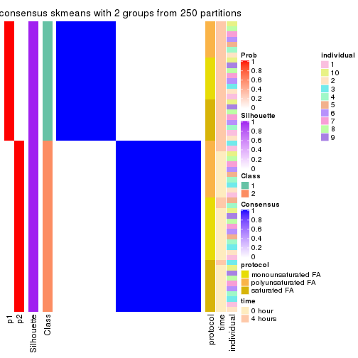</p>

</div>
<div id='tab-MAD-skmeans-consensus-heatmap-2'>
<pre><code class="r">consensus_heatmap(res, k = 3)
</code></pre>

<p>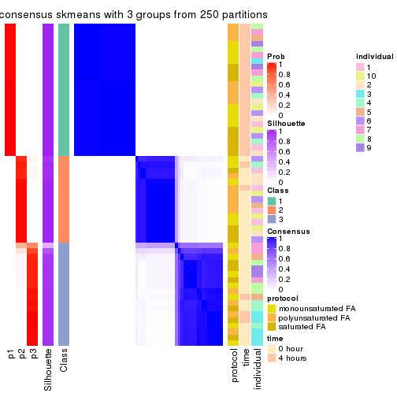</p>

</div>
<div id='tab-MAD-skmeans-consensus-heatmap-3'>
<pre><code class="r">consensus_heatmap(res, k = 4)
</code></pre>

<p>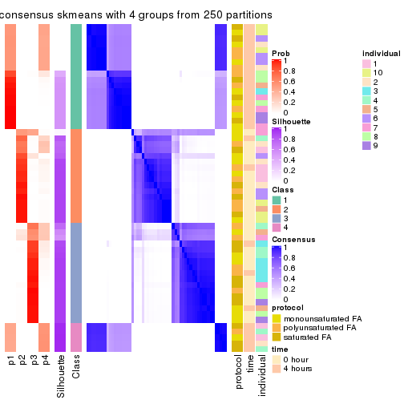</p>

</div>
<div id='tab-MAD-skmeans-consensus-heatmap-4'>
<pre><code class="r">consensus_heatmap(res, k = 5)
</code></pre>

<p>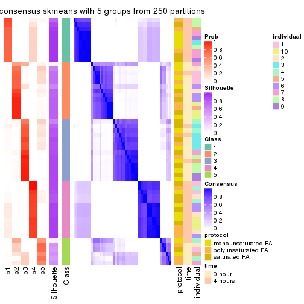</p>

</div>
<div id='tab-MAD-skmeans-consensus-heatmap-5'>
<pre><code class="r">consensus_heatmap(res, k = 6)
</code></pre>

<p>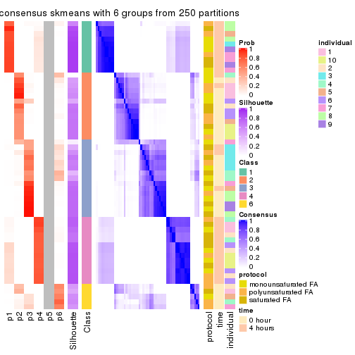</p>

</div>
</div>

Heatmaps for the membership of samples in all partitions to see how consistent they are:


<script>
$( function() {
	$( '#tabs-MAD-skmeans-membership-heatmap' ).tabs();
} );
</script>
<div id='tabs-MAD-skmeans-membership-heatmap'>
<ul>
<li><a href='#tab-MAD-skmeans-membership-heatmap-1'>k = 2</a></li>
<li><a href='#tab-MAD-skmeans-membership-heatmap-2'>k = 3</a></li>
<li><a href='#tab-MAD-skmeans-membership-heatmap-3'>k = 4</a></li>
<li><a href='#tab-MAD-skmeans-membership-heatmap-4'>k = 5</a></li>
<li><a href='#tab-MAD-skmeans-membership-heatmap-5'>k = 6</a></li>
</ul>
<div id='tab-MAD-skmeans-membership-heatmap-1'>
<pre><code class="r">membership_heatmap(res, k = 2)
</code></pre>

<p></p>

</div>
<div id='tab-MAD-skmeans-membership-heatmap-2'>
<pre><code class="r">membership_heatmap(res, k = 3)
</code></pre>

<p>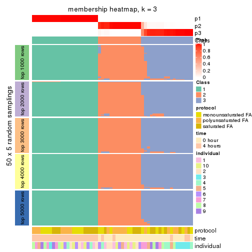</p>

</div>
<div id='tab-MAD-skmeans-membership-heatmap-3'>
<pre><code class="r">membership_heatmap(res, k = 4)
</code></pre>

<p>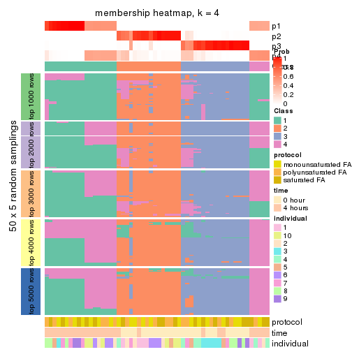</p>

</div>
<div id='tab-MAD-skmeans-membership-heatmap-4'>
<pre><code class="r">membership_heatmap(res, k = 5)
</code></pre>

<p>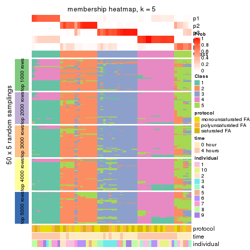</p>

</div>
<div id='tab-MAD-skmeans-membership-heatmap-5'>
<pre><code class="r">membership_heatmap(res, k = 6)
</code></pre>

<p>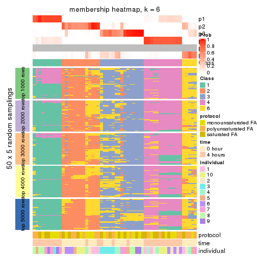</p>

</div>
</div>

As soon as we have had the classes for columns, we can look for signatures
which are significantly different between classes which can be candidate marks
for certain classes. Following are the heatmaps for signatures.


Signature heatmaps where rows are scaled:


<script>
$( function() {
	$( '#tabs-MAD-skmeans-get-signatures' ).tabs();
} );
</script>
<div id='tabs-MAD-skmeans-get-signatures'>
<ul>
<li><a href='#tab-MAD-skmeans-get-signatures-1'>k = 2</a></li>
<li><a href='#tab-MAD-skmeans-get-signatures-2'>k = 3</a></li>
<li><a href='#tab-MAD-skmeans-get-signatures-3'>k = 4</a></li>
<li><a href='#tab-MAD-skmeans-get-signatures-4'>k = 5</a></li>
<li><a href='#tab-MAD-skmeans-get-signatures-5'>k = 6</a></li>
</ul>
<div id='tab-MAD-skmeans-get-signatures-1'>
<pre><code class="r">get_signatures(res, k = 2)
</code></pre>

<p></p>

</div>
<div id='tab-MAD-skmeans-get-signatures-2'>
<pre><code class="r">get_signatures(res, k = 3)
</code></pre>

<p>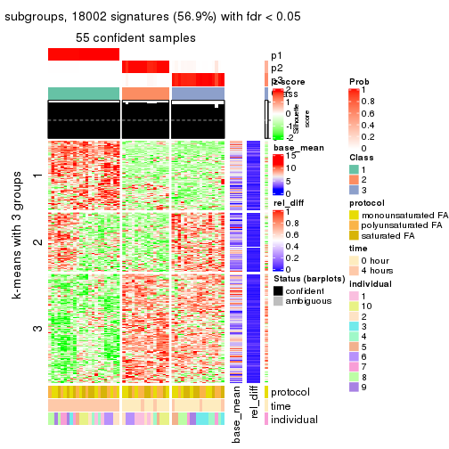</p>

</div>
<div id='tab-MAD-skmeans-get-signatures-3'>
<pre><code class="r">get_signatures(res, k = 4)
</code></pre>

<p>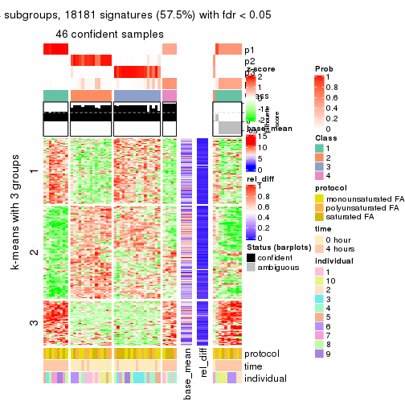</p>

</div>
<div id='tab-MAD-skmeans-get-signatures-4'>
<pre><code class="r">get_signatures(res, k = 5)
</code></pre>

<p>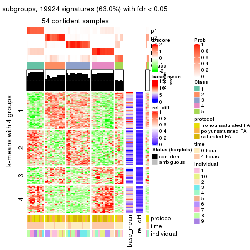</p>

</div>
<div id='tab-MAD-skmeans-get-signatures-5'>
<pre><code class="r">get_signatures(res, k = 6)
</code></pre>

<p>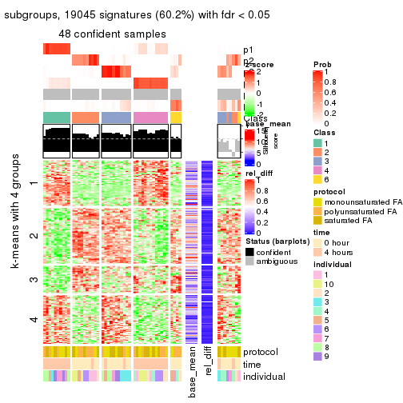</p>

</div>
</div>


Signature heatmaps where rows are not scaled:


<script>
$( function() {
	$( '#tabs-MAD-skmeans-get-signatures-no-scale' ).tabs();
} );
</script>
<div id='tabs-MAD-skmeans-get-signatures-no-scale'>
<ul>
<li><a href='#tab-MAD-skmeans-get-signatures-no-scale-1'>k = 2</a></li>
<li><a href='#tab-MAD-skmeans-get-signatures-no-scale-2'>k = 3</a></li>
<li><a href='#tab-MAD-skmeans-get-signatures-no-scale-3'>k = 4</a></li>
<li><a href='#tab-MAD-skmeans-get-signatures-no-scale-4'>k = 5</a></li>
<li><a href='#tab-MAD-skmeans-get-signatures-no-scale-5'>k = 6</a></li>
</ul>
<div id='tab-MAD-skmeans-get-signatures-no-scale-1'>
<pre><code class="r">get_signatures(res, k = 2, scale_rows = FALSE)
</code></pre>

<p>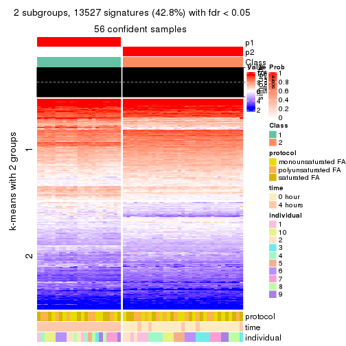</p>

</div>
<div id='tab-MAD-skmeans-get-signatures-no-scale-2'>
<pre><code class="r">get_signatures(res, k = 3, scale_rows = FALSE)
</code></pre>

<p>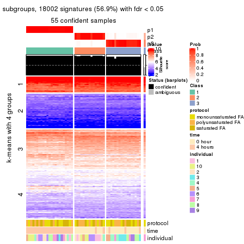</p>

</div>
<div id='tab-MAD-skmeans-get-signatures-no-scale-3'>
<pre><code class="r">get_signatures(res, k = 4, scale_rows = FALSE)
</code></pre>

<p>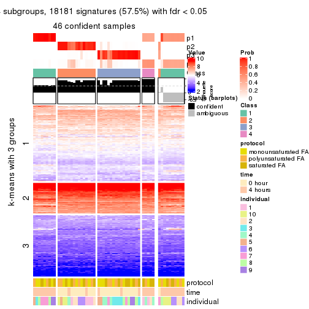</p>

</div>
<div id='tab-MAD-skmeans-get-signatures-no-scale-4'>
<pre><code class="r">get_signatures(res, k = 5, scale_rows = FALSE)
</code></pre>

<p>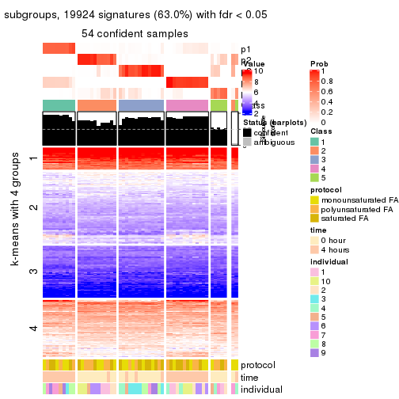</p>

</div>
<div id='tab-MAD-skmeans-get-signatures-no-scale-5'>
<pre><code class="r">get_signatures(res, k = 6, scale_rows = FALSE)
</code></pre>

<p>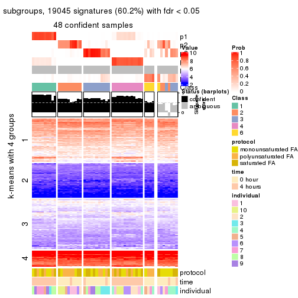</p>

</div>
</div>


Compare the overlap of signatures from different k:

```r
compare_signatures(res)
```

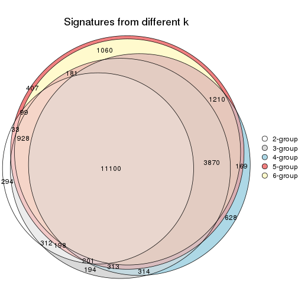

`get_signature()` returns a data frame invisibly. TO get the list of signatures, the function
call should be assigned to a variable explicitly. In following code, if `plot` argument is set
to `FALSE`, no heatmap is plotted while only the differential analysis is performed.

```r
# code only for demonstration
tb = get_signature(res, k = ..., plot = FALSE)
```

An example of the output of `tb` is:

```
#>   which_row         fdr    mean_1    mean_2 scaled_mean_1 scaled_mean_2 km
#> 1        38 0.042760348  8.373488  9.131774    -0.5533452     0.5164555  1
#> 2        40 0.018707592  7.106213  8.469186    -0.6173731     0.5762149  1
#> 3        55 0.019134737 10.221463 11.207825    -0.6159697     0.5749050  1
#> 4        59 0.006059896  5.921854  7.869574    -0.6899429     0.6439467  1
#> 5        60 0.018055526  8.928898 10.211722    -0.6204761     0.5791110  1
#> 6        98 0.009384629 15.714769 14.887706     0.6635654    -0.6193277  2
...
```

The columns in `tb` are:

1. `which_row`: row indices corresponding to the input matrix.
2. `fdr`: FDR for the differential test. 
3. `mean_x`: The mean value in group x.
4. `scaled_mean_x`: The mean value in group x after rows are scaled.
5. `km`: Row groups if k-means clustering is applied to rows.


UMAP plot which shows how samples are separated.


<script>
$( function() {
	$( '#tabs-MAD-skmeans-dimension-reduction' ).tabs();
} );
</script>
<div id='tabs-MAD-skmeans-dimension-reduction'>
<ul>
<li><a href='#tab-MAD-skmeans-dimension-reduction-1'>k = 2</a></li>
<li><a href='#tab-MAD-skmeans-dimension-reduction-2'>k = 3</a></li>
<li><a href='#tab-MAD-skmeans-dimension-reduction-3'>k = 4</a></li>
<li><a href='#tab-MAD-skmeans-dimension-reduction-4'>k = 5</a></li>
<li><a href='#tab-MAD-skmeans-dimension-reduction-5'>k = 6</a></li>
</ul>
<div id='tab-MAD-skmeans-dimension-reduction-1'>
<pre><code class="r">dimension_reduction(res, k = 2, method = &quot;UMAP&quot;)
</code></pre>

<p>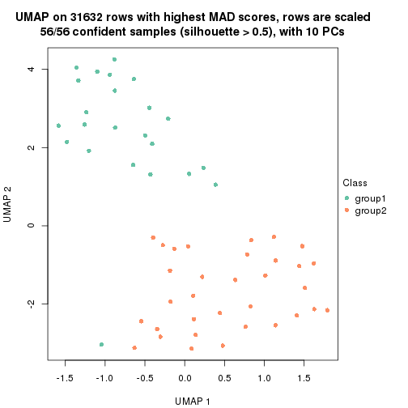</p>

</div>
<div id='tab-MAD-skmeans-dimension-reduction-2'>
<pre><code class="r">dimension_reduction(res, k = 3, method = &quot;UMAP&quot;)
</code></pre>

<p>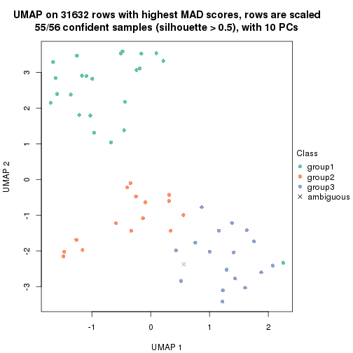</p>

</div>
<div id='tab-MAD-skmeans-dimension-reduction-3'>
<pre><code class="r">dimension_reduction(res, k = 4, method = &quot;UMAP&quot;)
</code></pre>

<p>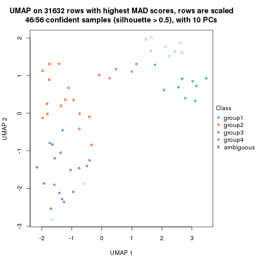</p>

</div>
<div id='tab-MAD-skmeans-dimension-reduction-4'>
<pre><code class="r">dimension_reduction(res, k = 5, method = &quot;UMAP&quot;)
</code></pre>

<p>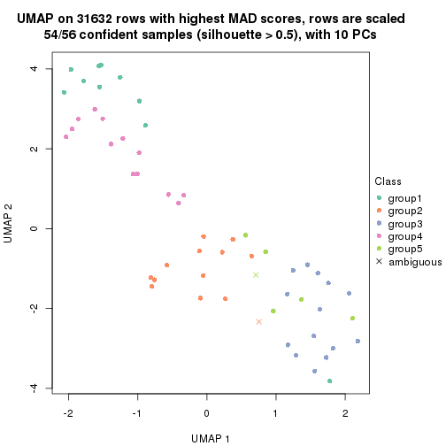</p>

</div>
<div id='tab-MAD-skmeans-dimension-reduction-5'>
<pre><code class="r">dimension_reduction(res, k = 6, method = &quot;UMAP&quot;)
</code></pre>

<p>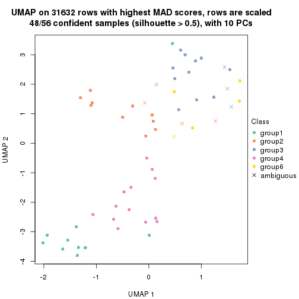</p>

</div>
</div>


Following heatmap shows how subgroups are split when increasing `k`:

```r
collect_classes(res)
```

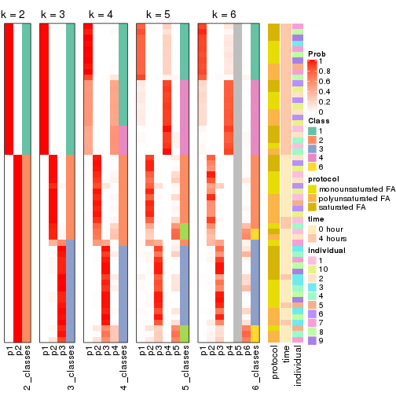


Test correlation between subgroups and known annotations. If the known
annotation is numeric, one-way ANOVA test is applied, and if the known
annotation is discrete, chi-squared contingency table test is applied.

```r
test_to_known_factors(res)
```

```
#>              n protocol(p)  time(p) individual(p) k
#> MAD:skmeans 56       0.937 2.29e-09       0.95024 2
#> MAD:skmeans 55       0.965 5.12e-09       0.03482 3
#> MAD:skmeans 46       0.856 2.64e-06       0.00293 4
#> MAD:skmeans 54       0.903 2.81e-08       0.00476 5
#> MAD:skmeans 48       0.769 1.24e-07       0.00454 6
```


If matrix rows can be associated to genes, consider to use `functional_enrichment(res,
...)` to perform function enrichment for the signature genes. See [this vignette](http://bioconductor.org/packages/devel/bioc/vignettes/cola/inst/doc/functional_enrichment.html) for more detailed explanations.


 

---------------------------------------------------


### MAD:pam**


The object with results only for a single top-value method and a single partition method 
can be extracted as:

```r
res = res_list["MAD", "pam"]
# you can also extract it by
# res = res_list["MAD:pam"]
```

A summary of `res` and all the functions that can be applied to it:

```r
res
```

```
#> A 'ConsensusPartition' object with k = 2, 3, 4, 5, 6.
#>   On a matrix with 31632 rows and 56 columns.
#>   Top rows (1000, 2000, 3000, 4000, 5000) are extracted by 'MAD' method.
#>   Subgroups are detected by 'pam' method.
#>   Performed in total 1250 partitions by row resampling.
#>   Best k for subgroups seems to be 2.
#> 
#> Following methods can be applied to this 'ConsensusPartition' object:
#>  [1] "cola_report"             "collect_classes"         "collect_plots"          
#>  [4] "collect_stats"           "colnames"                "compare_signatures"     
#>  [7] "consensus_heatmap"       "dimension_reduction"     "functional_enrichment"  
#> [10] "get_anno_col"            "get_anno"                "get_classes"            
#> [13] "get_consensus"           "get_matrix"              "get_membership"         
#> [16] "get_param"               "get_signatures"          "get_stats"              
#> [19] "is_best_k"               "is_stable_k"             "membership_heatmap"     
#> [22] "ncol"                    "nrow"                    "plot_ecdf"              
#> [25] "rownames"                "select_partition_number" "show"                   
#> [28] "suggest_best_k"          "test_to_known_factors"
```

`collect_plots()` function collects all the plots made from `res` for all `k` (number of partitions)
into one single page to provide an easy and fast comparison between different `k`.

```r
collect_plots(res)
```

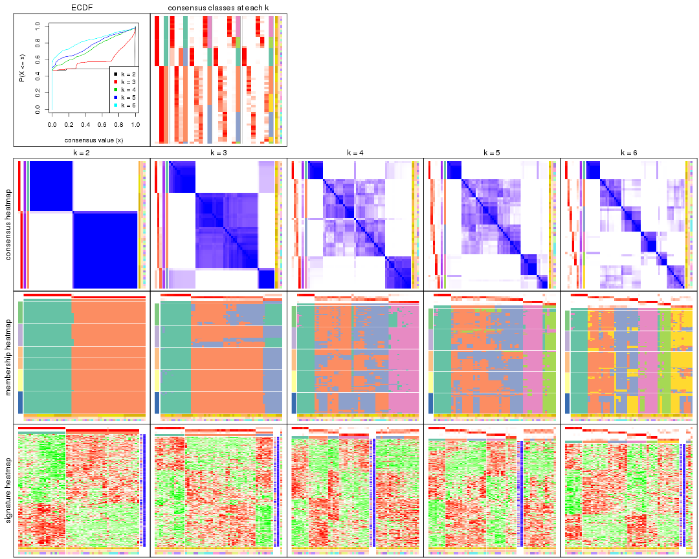

The plots are:

- The first row: a plot of the ECDF (empirical cumulative distribution
  function) curves of the consensus matrix for each `k` and the heatmap of
  predicted classes for each `k`.
- The second row: heatmaps of the consensus matrix for each `k`.
- The third row: heatmaps of the membership matrix for each `k`.
- The fouth row: heatmaps of the signatures for each `k`.

All the plots in panels can be made by individual functions and they are
plotted later in this section.

`select_partition_number()` produces several plots showing different
statistics for choosing "optimized" `k`. There are following statistics:

- ECDF curves of the consensus matrix for each `k`;
- 1-PAC. [The PAC
  score](https://en.wikipedia.org/wiki/Consensus_clustering#Over-interpretation_potential_of_consensus_clustering)
  measures the proportion of the ambiguous subgrouping.
- Mean silhouette score.
- Concordance. The mean probability of fiting the consensus class ids in all
  partitions.
- Area increased. Denote $A_k$ as the area under the ECDF curve for current
  `k`, the area increased is defined as $A_k - A_{k-1}$.
- Rand index. The percent of pairs of samples that are both in a same cluster
  or both are not in a same cluster in the partition of k and k-1.
- Jaccard index. The ratio of pairs of samples are both in a same cluster in
  the partition of k and k-1 and the pairs of samples are both in a same
  cluster in the partition k or k-1.

The detailed explanations of these statistics can be found in [the _cola_
vignette](http://bioconductor.org/packages/devel/bioc/vignettes/cola/inst/doc/cola.html#toc_13).

Generally speaking, lower PAC score, higher mean silhouette score or higher
concordance corresponds to better partition. Rand index and Jaccard index
measure how similar the current partition is compared to partition with `k-1`.
If they are too similar, we won't accept `k` is better than `k-1`.

```r
select_partition_number(res)
```

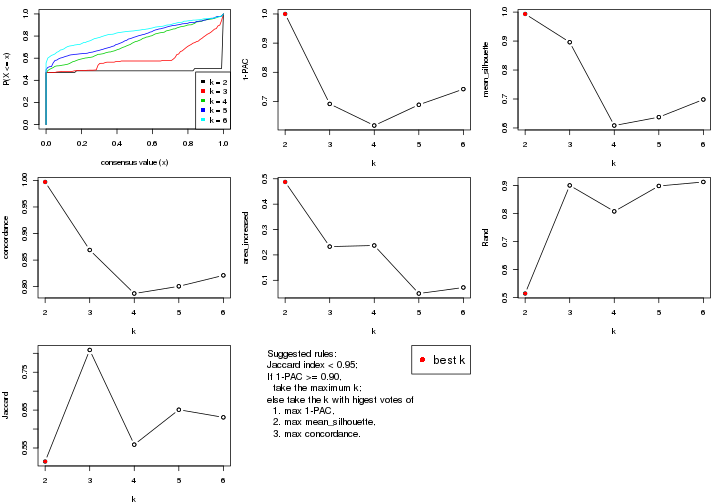

The numeric values for all these statistics can be obtained by `get_stats()`.

```r
get_stats(res)
```

```
#>   k 1-PAC mean_silhouette concordance area_increased  Rand Jaccard
#> 2 2 1.000           0.994       0.997         0.4874 0.514   0.514
#> 3 3 0.692           0.896       0.869         0.2328 0.901   0.809
#> 4 4 0.618           0.608       0.787         0.2371 0.808   0.559
#> 5 5 0.689           0.637       0.801         0.0479 0.899   0.651
#> 6 6 0.742           0.698       0.821         0.0717 0.913   0.631
```

`suggest_best_k()` suggests the best $k$ based on these statistics. The rules are as follows:

- All $k$ with Jaccard index larger than 0.95 are removed because increasing
  $k$ does not provide enough extra information. If all $k$ are removed, it is
  marked as no subgroup is detected.
- For all $k$ with 1-PAC score larger than 0.9, the maximal $k$ is taken as
  the best $k$, and other $k$ are marked as optional $k$.
- If it does not fit the second rule. The $k$ with the maximal vote of the
  highest 1-PAC score, highest mean silhouette, and highest concordance is
  taken as the best $k$.

```r
suggest_best_k(res)
```

```
#> [1] 2
```


Following shows the table of the partitions (You need to click the **show/hide
code output** link to see it). The membership matrix (columns with name `p*`)
is inferred by
[`clue::cl_consensus()`](https://www.rdocumentation.org/link/cl_consensus?package=clue)
function with the `SE` method. Basically the value in the membership matrix
represents the probability to belong to a certain group. The finall class
label for an item is determined with the group with highest probability it
belongs to.

In `get_classes()` function, the entropy is calculated from the membership
matrix and the silhouette score is calculated from the consensus matrix.


<script>
$( function() {
	$( '#tabs-MAD-pam-get-classes' ).tabs();
} );
</script>
<div id='tabs-MAD-pam-get-classes'>
<ul>
<li><a href='#tab-MAD-pam-get-classes-1'>k = 2</a></li>
<li><a href='#tab-MAD-pam-get-classes-2'>k = 3</a></li>
<li><a href='#tab-MAD-pam-get-classes-3'>k = 4</a></li>
<li><a href='#tab-MAD-pam-get-classes-4'>k = 5</a></li>
<li><a href='#tab-MAD-pam-get-classes-5'>k = 6</a></li>
</ul>

<div id='tab-MAD-pam-get-classes-1'>
<p><a id='tab-MAD-pam-get-classes-1-a' style='color:#0366d6' href='#'>show/hide code output</a></p>
<pre><code class="r">cbind(get_classes(res, k = 2), get_membership(res, k = 2))
</code></pre>

<pre><code>#&gt;           class entropy silhouette    p1    p2
#&gt; GSM790742     2   0.000      0.995 0.000 1.000
#&gt; GSM790744     2   0.000      0.995 0.000 1.000
#&gt; GSM790754     2   0.000      0.995 0.000 1.000
#&gt; GSM790756     2   0.000      0.995 0.000 1.000
#&gt; GSM790768     2   0.000      0.995 0.000 1.000
#&gt; GSM790774     2   0.000      0.995 0.000 1.000
#&gt; GSM790778     2   0.000      0.995 0.000 1.000
#&gt; GSM790784     2   0.000      0.995 0.000 1.000
#&gt; GSM790790     2   0.000      0.995 0.000 1.000
#&gt; GSM790743     1   0.000      1.000 1.000 0.000
#&gt; GSM790745     1   0.000      1.000 1.000 0.000
#&gt; GSM790755     2   0.000      0.995 0.000 1.000
#&gt; GSM790757     1   0.000      1.000 1.000 0.000
#&gt; GSM790769     1   0.000      1.000 1.000 0.000
#&gt; GSM790775     1   0.000      1.000 1.000 0.000
#&gt; GSM790779     1   0.000      1.000 1.000 0.000
#&gt; GSM790785     1   0.000      1.000 1.000 0.000
#&gt; GSM790791     1   0.000      1.000 1.000 0.000
#&gt; GSM790738     2   0.000      0.995 0.000 1.000
#&gt; GSM790746     2   0.000      0.995 0.000 1.000
#&gt; GSM790752     2   0.000      0.995 0.000 1.000
#&gt; GSM790758     2   0.000      0.995 0.000 1.000
#&gt; GSM790764     2   0.000      0.995 0.000 1.000
#&gt; GSM790766     2   0.000      0.995 0.000 1.000
#&gt; GSM790772     2   0.000      0.995 0.000 1.000
#&gt; GSM790782     2   0.000      0.995 0.000 1.000
#&gt; GSM790786     2   0.000      0.995 0.000 1.000
#&gt; GSM790792     2   0.000      0.995 0.000 1.000
#&gt; GSM790739     1   0.000      1.000 1.000 0.000
#&gt; GSM790747     1   0.000      1.000 1.000 0.000
#&gt; GSM790753     1   0.000      1.000 1.000 0.000
#&gt; GSM790759     2   0.000      0.995 0.000 1.000
#&gt; GSM790765     2   0.000      0.995 0.000 1.000
#&gt; GSM790767     1   0.000      1.000 1.000 0.000
#&gt; GSM790773     1   0.000      1.000 1.000 0.000
#&gt; GSM790783     1   0.000      1.000 1.000 0.000
#&gt; GSM790787     1   0.000      1.000 1.000 0.000
#&gt; GSM790793     1   0.000      1.000 1.000 0.000
#&gt; GSM790740     2   0.000      0.995 0.000 1.000
#&gt; GSM790748     2   0.000      0.995 0.000 1.000
#&gt; GSM790750     2   0.000      0.995 0.000 1.000
#&gt; GSM790760     2   0.000      0.995 0.000 1.000
#&gt; GSM790762     2   0.000      0.995 0.000 1.000
#&gt; GSM790770     2   0.000      0.995 0.000 1.000
#&gt; GSM790776     2   0.000      0.995 0.000 1.000
#&gt; GSM790780     2   0.000      0.995 0.000 1.000
#&gt; GSM790788     2   0.000      0.995 0.000 1.000
#&gt; GSM790741     2   0.000      0.995 0.000 1.000
#&gt; GSM790749     1   0.000      1.000 1.000 0.000
#&gt; GSM790751     2   0.000      0.995 0.000 1.000
#&gt; GSM790761     1   0.000      1.000 1.000 0.000
#&gt; GSM790763     1   0.000      1.000 1.000 0.000
#&gt; GSM790771     1   0.000      1.000 1.000 0.000
#&gt; GSM790777     1   0.000      1.000 1.000 0.000
#&gt; GSM790781     2   0.644      0.804 0.164 0.836
#&gt; GSM790789     1   0.000      1.000 1.000 0.000
</code></pre>

<script>
$('#tab-MAD-pam-get-classes-1-a').parent().next().next().hide();
$('#tab-MAD-pam-get-classes-1-a').click(function(){
  $('#tab-MAD-pam-get-classes-1-a').parent().next().next().toggle();
  return(false);
});
</script>
</div>

<div id='tab-MAD-pam-get-classes-2'>
<p><a id='tab-MAD-pam-get-classes-2-a' style='color:#0366d6' href='#'>show/hide code output</a></p>
<pre><code class="r">cbind(get_classes(res, k = 3), get_membership(res, k = 3))
</code></pre>

<pre><code>#&gt;           class entropy silhouette    p1    p2    p3
#&gt; GSM790742     2  0.3192      0.890 0.000 0.888 0.112
#&gt; GSM790744     2  0.0424      0.881 0.000 0.992 0.008
#&gt; GSM790754     2  0.5327      0.876 0.000 0.728 0.272
#&gt; GSM790756     2  0.3412      0.896 0.000 0.876 0.124
#&gt; GSM790768     2  0.0237      0.880 0.000 0.996 0.004
#&gt; GSM790774     2  0.3879      0.895 0.000 0.848 0.152
#&gt; GSM790778     2  0.4605      0.888 0.000 0.796 0.204
#&gt; GSM790784     2  0.4605      0.895 0.000 0.796 0.204
#&gt; GSM790790     2  0.0592      0.877 0.000 0.988 0.012
#&gt; GSM790743     1  0.0000      0.966 1.000 0.000 0.000
#&gt; GSM790745     1  0.0000      0.966 1.000 0.000 0.000
#&gt; GSM790755     2  0.5363      0.877 0.000 0.724 0.276
#&gt; GSM790757     1  0.0000      0.966 1.000 0.000 0.000
#&gt; GSM790769     1  0.0592      0.960 0.988 0.000 0.012
#&gt; GSM790775     3  0.5431      0.923 0.284 0.000 0.716
#&gt; GSM790779     3  0.5431      0.923 0.284 0.000 0.716
#&gt; GSM790785     3  0.5431      0.923 0.284 0.000 0.716
#&gt; GSM790791     1  0.0000      0.966 1.000 0.000 0.000
#&gt; GSM790738     2  0.0592      0.877 0.000 0.988 0.012
#&gt; GSM790746     2  0.1860      0.887 0.000 0.948 0.052
#&gt; GSM790752     2  0.5327      0.876 0.000 0.728 0.272
#&gt; GSM790758     2  0.4931      0.886 0.000 0.768 0.232
#&gt; GSM790764     2  0.4842      0.888 0.000 0.776 0.224
#&gt; GSM790766     2  0.4235      0.894 0.000 0.824 0.176
#&gt; GSM790772     2  0.0592      0.877 0.000 0.988 0.012
#&gt; GSM790782     2  0.5327      0.876 0.000 0.728 0.272
#&gt; GSM790786     2  0.4750      0.888 0.000 0.784 0.216
#&gt; GSM790792     2  0.0747      0.878 0.000 0.984 0.016
#&gt; GSM790739     1  0.0592      0.961 0.988 0.000 0.012
#&gt; GSM790747     1  0.1529      0.933 0.960 0.000 0.040
#&gt; GSM790753     3  0.5431      0.923 0.284 0.000 0.716
#&gt; GSM790759     2  0.2537      0.884 0.000 0.920 0.080
#&gt; GSM790765     2  0.5291      0.877 0.000 0.732 0.268
#&gt; GSM790767     1  0.0237      0.965 0.996 0.000 0.004
#&gt; GSM790773     3  0.5431      0.923 0.284 0.000 0.716
#&gt; GSM790783     3  0.5431      0.923 0.284 0.000 0.716
#&gt; GSM790787     3  0.5431      0.923 0.284 0.000 0.716
#&gt; GSM790793     1  0.0592      0.961 0.988 0.000 0.012
#&gt; GSM790740     2  0.1163      0.886 0.000 0.972 0.028
#&gt; GSM790748     2  0.1163      0.884 0.000 0.972 0.028
#&gt; GSM790750     2  0.5291      0.876 0.000 0.732 0.268
#&gt; GSM790760     2  0.5178      0.882 0.000 0.744 0.256
#&gt; GSM790762     2  0.0424      0.881 0.000 0.992 0.008
#&gt; GSM790770     2  0.0592      0.877 0.000 0.988 0.012
#&gt; GSM790776     2  0.4931      0.889 0.000 0.768 0.232
#&gt; GSM790780     2  0.5327      0.876 0.000 0.728 0.272
#&gt; GSM790788     2  0.0424      0.881 0.000 0.992 0.008
#&gt; GSM790741     2  0.1031      0.883 0.000 0.976 0.024
#&gt; GSM790749     1  0.3619      0.791 0.864 0.000 0.136
#&gt; GSM790751     2  0.5397      0.877 0.000 0.720 0.280
#&gt; GSM790761     1  0.0000      0.966 1.000 0.000 0.000
#&gt; GSM790763     1  0.3038      0.844 0.896 0.000 0.104
#&gt; GSM790771     1  0.0000      0.966 1.000 0.000 0.000
#&gt; GSM790777     3  0.5431      0.923 0.284 0.000 0.716
#&gt; GSM790781     3  0.5852      0.486 0.060 0.152 0.788
#&gt; GSM790789     1  0.0000      0.966 1.000 0.000 0.000
</code></pre>

<script>
$('#tab-MAD-pam-get-classes-2-a').parent().next().next().hide();
$('#tab-MAD-pam-get-classes-2-a').click(function(){
  $('#tab-MAD-pam-get-classes-2-a').parent().next().next().toggle();
  return(false);
});
</script>
</div>

<div id='tab-MAD-pam-get-classes-3'>
<p><a id='tab-MAD-pam-get-classes-3-a' style='color:#0366d6' href='#'>show/hide code output</a></p>
<pre><code class="r">cbind(get_classes(res, k = 4), get_membership(res, k = 4))
</code></pre>

<pre><code>#&gt;           class entropy silhouette    p1    p2    p3    p4
#&gt; GSM790742     2  0.3528     0.3008 0.000 0.808 0.192 0.000
#&gt; GSM790744     2  0.4955     0.4852 0.000 0.556 0.444 0.000
#&gt; GSM790754     3  0.3726     0.5131 0.000 0.212 0.788 0.000
#&gt; GSM790756     3  0.4994    -0.0434 0.000 0.480 0.520 0.000
#&gt; GSM790768     2  0.4661     0.5694 0.000 0.652 0.348 0.000
#&gt; GSM790774     2  0.4977     0.1886 0.000 0.540 0.460 0.000
#&gt; GSM790778     3  0.2081     0.4867 0.000 0.084 0.916 0.000
#&gt; GSM790784     3  0.3400     0.3963 0.000 0.180 0.820 0.000
#&gt; GSM790790     2  0.3528     0.6229 0.000 0.808 0.192 0.000
#&gt; GSM790743     4  0.1635     0.9112 0.044 0.000 0.008 0.948
#&gt; GSM790745     4  0.3730     0.8568 0.144 0.004 0.016 0.836
#&gt; GSM790755     3  0.4277     0.5218 0.000 0.280 0.720 0.000
#&gt; GSM790757     4  0.3547     0.8584 0.144 0.000 0.016 0.840
#&gt; GSM790769     4  0.0592     0.9120 0.016 0.000 0.000 0.984
#&gt; GSM790775     1  0.0336     0.9743 0.992 0.000 0.000 0.008
#&gt; GSM790779     1  0.0000     0.9776 1.000 0.000 0.000 0.000
#&gt; GSM790785     1  0.0592     0.9687 0.984 0.000 0.000 0.016
#&gt; GSM790791     4  0.0188     0.9133 0.004 0.000 0.000 0.996
#&gt; GSM790738     2  0.3528     0.6229 0.000 0.808 0.192 0.000
#&gt; GSM790746     2  0.2647     0.4419 0.000 0.880 0.120 0.000
#&gt; GSM790752     3  0.4522     0.5132 0.000 0.320 0.680 0.000
#&gt; GSM790758     3  0.4564     0.3366 0.000 0.328 0.672 0.000
#&gt; GSM790764     3  0.4941     0.1242 0.000 0.436 0.564 0.000
#&gt; GSM790766     2  0.4985     0.1008 0.000 0.532 0.468 0.000
#&gt; GSM790772     2  0.3873     0.6070 0.000 0.772 0.228 0.000
#&gt; GSM790782     3  0.1792     0.5068 0.000 0.068 0.932 0.000
#&gt; GSM790786     3  0.2868     0.4254 0.000 0.136 0.864 0.000
#&gt; GSM790792     2  0.3610     0.6231 0.000 0.800 0.200 0.000
#&gt; GSM790739     4  0.3495     0.8620 0.140 0.000 0.016 0.844
#&gt; GSM790747     4  0.1389     0.8989 0.048 0.000 0.000 0.952
#&gt; GSM790753     1  0.0000     0.9776 1.000 0.000 0.000 0.000
#&gt; GSM790759     2  0.2216     0.4889 0.000 0.908 0.092 0.000
#&gt; GSM790765     3  0.2011     0.4790 0.000 0.080 0.920 0.000
#&gt; GSM790767     4  0.0336     0.9144 0.008 0.000 0.000 0.992
#&gt; GSM790773     1  0.0000     0.9776 1.000 0.000 0.000 0.000
#&gt; GSM790783     1  0.2589     0.8639 0.884 0.000 0.000 0.116
#&gt; GSM790787     1  0.0000     0.9776 1.000 0.000 0.000 0.000
#&gt; GSM790793     4  0.1356     0.9130 0.032 0.000 0.008 0.960
#&gt; GSM790740     2  0.3688     0.5364 0.000 0.792 0.208 0.000
#&gt; GSM790748     2  0.2814     0.4123 0.000 0.868 0.132 0.000
#&gt; GSM790750     3  0.4877     0.4609 0.000 0.408 0.592 0.000
#&gt; GSM790760     3  0.5000     0.2968 0.000 0.500 0.500 0.000
#&gt; GSM790762     2  0.4888     0.5153 0.000 0.588 0.412 0.000
#&gt; GSM790770     2  0.3528     0.6229 0.000 0.808 0.192 0.000
#&gt; GSM790776     3  0.4916     0.1595 0.000 0.424 0.576 0.000
#&gt; GSM790780     3  0.3726     0.5133 0.000 0.212 0.788 0.000
#&gt; GSM790788     2  0.4877     0.5200 0.000 0.592 0.408 0.000
#&gt; GSM790741     2  0.4564     0.2632 0.000 0.672 0.328 0.000
#&gt; GSM790749     4  0.3266     0.7885 0.168 0.000 0.000 0.832
#&gt; GSM790751     3  0.4804     0.4809 0.000 0.384 0.616 0.000
#&gt; GSM790761     4  0.1151     0.9142 0.024 0.000 0.008 0.968
#&gt; GSM790763     4  0.4673     0.6800 0.292 0.000 0.008 0.700
#&gt; GSM790771     4  0.0000     0.9117 0.000 0.000 0.000 1.000
#&gt; GSM790777     1  0.0000     0.9776 1.000 0.000 0.000 0.000
#&gt; GSM790781     3  0.5452     0.0416 0.428 0.016 0.556 0.000
#&gt; GSM790789     4  0.0000     0.9117 0.000 0.000 0.000 1.000
</code></pre>

<script>
$('#tab-MAD-pam-get-classes-3-a').parent().next().next().hide();
$('#tab-MAD-pam-get-classes-3-a').click(function(){
  $('#tab-MAD-pam-get-classes-3-a').parent().next().next().toggle();
  return(false);
});
</script>
</div>

<div id='tab-MAD-pam-get-classes-4'>
<p><a id='tab-MAD-pam-get-classes-4-a' style='color:#0366d6' href='#'>show/hide code output</a></p>
<pre><code class="r">cbind(get_classes(res, k = 5), get_membership(res, k = 5))
</code></pre>

<pre><code>#&gt;           class entropy silhouette    p1    p2    p3    p4    p5
#&gt; GSM790742     2  0.5378    0.31548 0.000 0.548 0.392 0.000 0.060
#&gt; GSM790744     2  0.3906    0.47103 0.000 0.744 0.240 0.000 0.016
#&gt; GSM790754     3  0.0000    0.65521 0.000 0.000 1.000 0.000 0.000
#&gt; GSM790756     2  0.5174    0.14604 0.000 0.604 0.340 0.000 0.056
#&gt; GSM790768     2  0.2505    0.61181 0.000 0.888 0.092 0.000 0.020
#&gt; GSM790774     2  0.4509    0.40904 0.000 0.716 0.236 0.000 0.048
#&gt; GSM790778     3  0.3480    0.57191 0.000 0.248 0.752 0.000 0.000
#&gt; GSM790784     3  0.5320    0.17606 0.000 0.424 0.524 0.000 0.052
#&gt; GSM790790     2  0.0880    0.63459 0.000 0.968 0.000 0.000 0.032
#&gt; GSM790743     4  0.3291    0.82827 0.064 0.000 0.000 0.848 0.088
#&gt; GSM790745     5  0.1997    0.83665 0.036 0.000 0.000 0.040 0.924
#&gt; GSM790755     3  0.1121    0.65924 0.000 0.044 0.956 0.000 0.000
#&gt; GSM790757     5  0.1997    0.83665 0.036 0.000 0.000 0.040 0.924
#&gt; GSM790769     4  0.0000    0.93944 0.000 0.000 0.000 1.000 0.000
#&gt; GSM790775     1  0.0000    0.98301 1.000 0.000 0.000 0.000 0.000
#&gt; GSM790779     1  0.0000    0.98301 1.000 0.000 0.000 0.000 0.000
#&gt; GSM790785     1  0.0162    0.98066 0.996 0.000 0.000 0.004 0.000
#&gt; GSM790791     4  0.1892    0.89194 0.004 0.000 0.000 0.916 0.080
#&gt; GSM790738     2  0.0510    0.63456 0.000 0.984 0.000 0.000 0.016
#&gt; GSM790746     2  0.4147    0.47071 0.000 0.676 0.316 0.000 0.008
#&gt; GSM790752     3  0.1205    0.65912 0.000 0.040 0.956 0.000 0.004
#&gt; GSM790758     3  0.4641    0.28832 0.000 0.456 0.532 0.000 0.012
#&gt; GSM790764     2  0.5320    0.06340 0.000 0.572 0.368 0.000 0.060
#&gt; GSM790766     2  0.4731    0.23117 0.000 0.528 0.456 0.000 0.016
#&gt; GSM790772     2  0.1992    0.62052 0.000 0.924 0.044 0.000 0.032
#&gt; GSM790782     3  0.3816    0.52997 0.000 0.304 0.696 0.000 0.000
#&gt; GSM790786     3  0.3932    0.47200 0.000 0.328 0.672 0.000 0.000
#&gt; GSM790792     2  0.0798    0.63507 0.000 0.976 0.008 0.000 0.016
#&gt; GSM790739     5  0.1997    0.83665 0.036 0.000 0.000 0.040 0.924
#&gt; GSM790747     4  0.0000    0.93944 0.000 0.000 0.000 1.000 0.000
#&gt; GSM790753     1  0.0000    0.98301 1.000 0.000 0.000 0.000 0.000
#&gt; GSM790759     2  0.4793    0.50026 0.000 0.684 0.260 0.000 0.056
#&gt; GSM790765     3  0.3612    0.54851 0.000 0.268 0.732 0.000 0.000
#&gt; GSM790767     4  0.0000    0.93944 0.000 0.000 0.000 1.000 0.000
#&gt; GSM790773     1  0.0000    0.98301 1.000 0.000 0.000 0.000 0.000
#&gt; GSM790783     1  0.1121    0.94625 0.956 0.000 0.000 0.044 0.000
#&gt; GSM790787     1  0.1121    0.94661 0.956 0.000 0.000 0.044 0.000
#&gt; GSM790793     5  0.3579    0.67570 0.004 0.000 0.000 0.240 0.756
#&gt; GSM790740     2  0.4046    0.50368 0.000 0.696 0.296 0.000 0.008
#&gt; GSM790748     2  0.4866    0.41540 0.000 0.620 0.344 0.000 0.036
#&gt; GSM790750     3  0.2068    0.63319 0.000 0.092 0.904 0.000 0.004
#&gt; GSM790760     3  0.5338    0.18617 0.000 0.400 0.544 0.000 0.056
#&gt; GSM790762     2  0.2722    0.60294 0.000 0.872 0.108 0.000 0.020
#&gt; GSM790770     2  0.0963    0.63191 0.000 0.964 0.000 0.000 0.036
#&gt; GSM790776     2  0.5313   -0.00194 0.000 0.556 0.388 0.000 0.056
#&gt; GSM790780     3  0.0162    0.65430 0.000 0.004 0.996 0.000 0.000
#&gt; GSM790788     2  0.2669    0.60565 0.000 0.876 0.104 0.000 0.020
#&gt; GSM790741     2  0.4450    0.23229 0.000 0.508 0.488 0.000 0.004
#&gt; GSM790749     4  0.0000    0.93944 0.000 0.000 0.000 1.000 0.000
#&gt; GSM790751     3  0.1768    0.64775 0.000 0.072 0.924 0.000 0.004
#&gt; GSM790761     4  0.2416    0.86587 0.012 0.000 0.000 0.888 0.100
#&gt; GSM790763     5  0.6060    0.35848 0.384 0.000 0.000 0.124 0.492
#&gt; GSM790771     4  0.0000    0.93944 0.000 0.000 0.000 1.000 0.000
#&gt; GSM790777     1  0.0000    0.98301 1.000 0.000 0.000 0.000 0.000
#&gt; GSM790781     5  0.3716    0.76460 0.048 0.036 0.072 0.000 0.844
#&gt; GSM790789     4  0.1732    0.89519 0.000 0.000 0.000 0.920 0.080
</code></pre>

<script>
$('#tab-MAD-pam-get-classes-4-a').parent().next().next().hide();
$('#tab-MAD-pam-get-classes-4-a').click(function(){
  $('#tab-MAD-pam-get-classes-4-a').parent().next().next().toggle();
  return(false);
});
</script>
</div>

<div id='tab-MAD-pam-get-classes-5'>
<p><a id='tab-MAD-pam-get-classes-5-a' style='color:#0366d6' href='#'>show/hide code output</a></p>
<pre><code class="r">cbind(get_classes(res, k = 6), get_membership(res, k = 6))
</code></pre>

<pre><code>#&gt;           class entropy silhouette    p1    p2    p3    p4    p5    p6
#&gt; GSM790742     6  0.3101     0.5444 0.000 0.244 0.000 0.000 0.000 0.756
#&gt; GSM790744     2  0.2234     0.7593 0.000 0.872 0.004 0.000 0.000 0.124
#&gt; GSM790754     3  0.3351     0.6859 0.000 0.000 0.712 0.000 0.000 0.288
#&gt; GSM790756     6  0.3668     0.5846 0.000 0.004 0.328 0.000 0.000 0.668
#&gt; GSM790768     2  0.2871     0.7390 0.000 0.804 0.004 0.000 0.000 0.192
#&gt; GSM790774     6  0.3714     0.5898 0.000 0.004 0.340 0.000 0.000 0.656
#&gt; GSM790778     3  0.0405     0.6706 0.000 0.008 0.988 0.000 0.000 0.004
#&gt; GSM790784     6  0.4305     0.5022 0.000 0.020 0.436 0.000 0.000 0.544
#&gt; GSM790790     2  0.2003     0.6859 0.000 0.884 0.000 0.000 0.000 0.116
#&gt; GSM790743     4  0.3215     0.7757 0.072 0.000 0.000 0.828 0.100 0.000
#&gt; GSM790745     5  0.0146     0.7814 0.004 0.000 0.000 0.000 0.996 0.000
#&gt; GSM790755     3  0.3221     0.6910 0.000 0.000 0.736 0.000 0.000 0.264
#&gt; GSM790757     5  0.0000     0.7799 0.000 0.000 0.000 0.000 1.000 0.000
#&gt; GSM790769     4  0.0000     0.8929 0.000 0.000 0.000 1.000 0.000 0.000
#&gt; GSM790775     1  0.0000     0.9864 1.000 0.000 0.000 0.000 0.000 0.000
#&gt; GSM790779     1  0.0000     0.9864 1.000 0.000 0.000 0.000 0.000 0.000
#&gt; GSM790785     1  0.0000     0.9864 1.000 0.000 0.000 0.000 0.000 0.000
#&gt; GSM790791     4  0.2996     0.7070 0.000 0.000 0.000 0.772 0.228 0.000
#&gt; GSM790738     2  0.2416     0.7567 0.000 0.844 0.000 0.000 0.000 0.156
#&gt; GSM790746     2  0.3727     0.6214 0.000 0.612 0.000 0.000 0.000 0.388
#&gt; GSM790752     3  0.3515     0.6664 0.000 0.000 0.676 0.000 0.000 0.324
#&gt; GSM790758     3  0.3830     0.0489 0.000 0.004 0.620 0.000 0.000 0.376
#&gt; GSM790764     6  0.4332     0.5941 0.000 0.288 0.048 0.000 0.000 0.664
#&gt; GSM790766     2  0.5348     0.5269 0.000 0.576 0.152 0.000 0.000 0.272
#&gt; GSM790772     6  0.5156     0.6034 0.000 0.128 0.272 0.000 0.000 0.600
#&gt; GSM790782     3  0.4620     0.2288 0.000 0.292 0.640 0.000 0.000 0.068
#&gt; GSM790786     3  0.0405     0.6713 0.000 0.008 0.988 0.000 0.000 0.004
#&gt; GSM790792     2  0.1007     0.7268 0.000 0.956 0.000 0.000 0.000 0.044
#&gt; GSM790739     5  0.0146     0.7814 0.004 0.000 0.000 0.000 0.996 0.000
#&gt; GSM790747     4  0.0000     0.8929 0.000 0.000 0.000 1.000 0.000 0.000
#&gt; GSM790753     1  0.0000     0.9864 1.000 0.000 0.000 0.000 0.000 0.000
#&gt; GSM790759     6  0.2669     0.5060 0.000 0.156 0.008 0.000 0.000 0.836
#&gt; GSM790765     3  0.0790     0.6795 0.000 0.000 0.968 0.000 0.000 0.032
#&gt; GSM790767     4  0.0000     0.8929 0.000 0.000 0.000 1.000 0.000 0.000
#&gt; GSM790773     1  0.0000     0.9864 1.000 0.000 0.000 0.000 0.000 0.000
#&gt; GSM790783     1  0.0632     0.9682 0.976 0.000 0.000 0.024 0.000 0.000
#&gt; GSM790787     1  0.1141     0.9372 0.948 0.000 0.000 0.052 0.000 0.000
#&gt; GSM790793     5  0.2823     0.6248 0.000 0.000 0.000 0.204 0.796 0.000
#&gt; GSM790740     2  0.4084     0.6069 0.000 0.588 0.012 0.000 0.000 0.400
#&gt; GSM790748     6  0.4274     0.5025 0.000 0.276 0.048 0.000 0.000 0.676
#&gt; GSM790750     3  0.3531     0.6637 0.000 0.000 0.672 0.000 0.000 0.328
#&gt; GSM790760     6  0.1802     0.5843 0.000 0.012 0.072 0.000 0.000 0.916
#&gt; GSM790762     2  0.0291     0.7396 0.000 0.992 0.004 0.000 0.000 0.004
#&gt; GSM790770     2  0.3531     0.5583 0.000 0.672 0.000 0.000 0.000 0.328
#&gt; GSM790776     6  0.3978     0.6309 0.000 0.192 0.064 0.000 0.000 0.744
#&gt; GSM790780     3  0.0146     0.6722 0.000 0.004 0.996 0.000 0.000 0.000
#&gt; GSM790788     2  0.0000     0.7390 0.000 1.000 0.000 0.000 0.000 0.000
#&gt; GSM790741     2  0.5133     0.5772 0.000 0.580 0.108 0.000 0.000 0.312
#&gt; GSM790749     4  0.0000     0.8929 0.000 0.000 0.000 1.000 0.000 0.000
#&gt; GSM790751     3  0.3636     0.6654 0.000 0.004 0.676 0.000 0.000 0.320
#&gt; GSM790761     4  0.2003     0.8272 0.000 0.000 0.000 0.884 0.116 0.000
#&gt; GSM790763     5  0.5319     0.2650 0.388 0.000 0.000 0.108 0.504 0.000
#&gt; GSM790771     4  0.0000     0.8929 0.000 0.000 0.000 1.000 0.000 0.000
#&gt; GSM790777     1  0.0000     0.9864 1.000 0.000 0.000 0.000 0.000 0.000
#&gt; GSM790781     5  0.3337     0.5456 0.004 0.000 0.260 0.000 0.736 0.000
#&gt; GSM790789     4  0.2996     0.7070 0.000 0.000 0.000 0.772 0.228 0.000
</code></pre>

<script>
$('#tab-MAD-pam-get-classes-5-a').parent().next().next().hide();
$('#tab-MAD-pam-get-classes-5-a').click(function(){
  $('#tab-MAD-pam-get-classes-5-a').parent().next().next().toggle();
  return(false);
});
</script>
</div>
</div>

Heatmaps for the consensus matrix. It visualizes the probability of two
samples to be in a same group.


<script>
$( function() {
	$( '#tabs-MAD-pam-consensus-heatmap' ).tabs();
} );
</script>
<div id='tabs-MAD-pam-consensus-heatmap'>
<ul>
<li><a href='#tab-MAD-pam-consensus-heatmap-1'>k = 2</a></li>
<li><a href='#tab-MAD-pam-consensus-heatmap-2'>k = 3</a></li>
<li><a href='#tab-MAD-pam-consensus-heatmap-3'>k = 4</a></li>
<li><a href='#tab-MAD-pam-consensus-heatmap-4'>k = 5</a></li>
<li><a href='#tab-MAD-pam-consensus-heatmap-5'>k = 6</a></li>
</ul>
<div id='tab-MAD-pam-consensus-heatmap-1'>
<pre><code class="r">consensus_heatmap(res, k = 2)
</code></pre>

<p>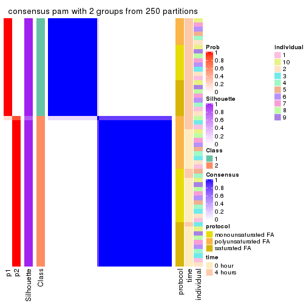</p>

</div>
<div id='tab-MAD-pam-consensus-heatmap-2'>
<pre><code class="r">consensus_heatmap(res, k = 3)
</code></pre>

<p>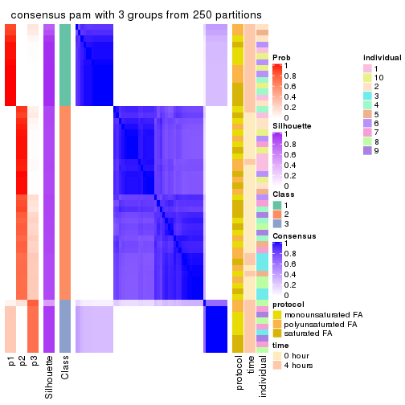</p>

</div>
<div id='tab-MAD-pam-consensus-heatmap-3'>
<pre><code class="r">consensus_heatmap(res, k = 4)
</code></pre>

<p>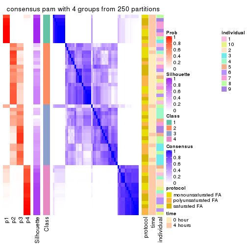</p>

</div>
<div id='tab-MAD-pam-consensus-heatmap-4'>
<pre><code class="r">consensus_heatmap(res, k = 5)
</code></pre>

<p>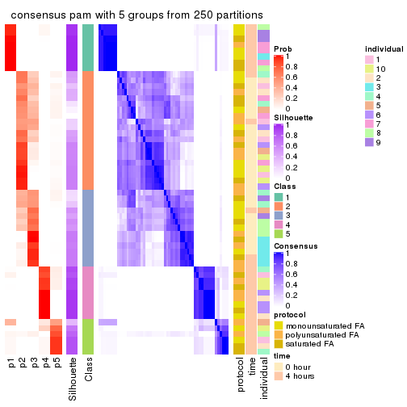</p>

</div>
<div id='tab-MAD-pam-consensus-heatmap-5'>
<pre><code class="r">consensus_heatmap(res, k = 6)
</code></pre>

<p>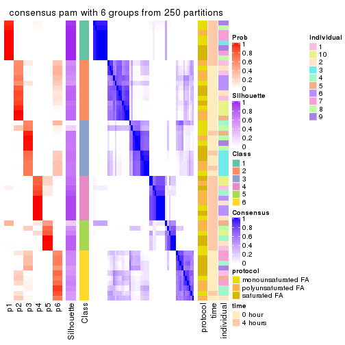</p>

</div>
</div>

Heatmaps for the membership of samples in all partitions to see how consistent they are:


<script>
$( function() {
	$( '#tabs-MAD-pam-membership-heatmap' ).tabs();
} );
</script>
<div id='tabs-MAD-pam-membership-heatmap'>
<ul>
<li><a href='#tab-MAD-pam-membership-heatmap-1'>k = 2</a></li>
<li><a href='#tab-MAD-pam-membership-heatmap-2'>k = 3</a></li>
<li><a href='#tab-MAD-pam-membership-heatmap-3'>k = 4</a></li>
<li><a href='#tab-MAD-pam-membership-heatmap-4'>k = 5</a></li>
<li><a href='#tab-MAD-pam-membership-heatmap-5'>k = 6</a></li>
</ul>
<div id='tab-MAD-pam-membership-heatmap-1'>
<pre><code class="r">membership_heatmap(res, k = 2)
</code></pre>

<p>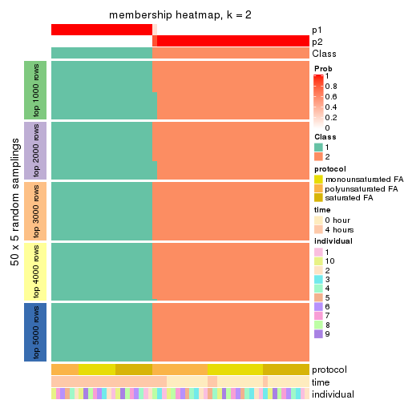</p>

</div>
<div id='tab-MAD-pam-membership-heatmap-2'>
<pre><code class="r">membership_heatmap(res, k = 3)
</code></pre>

<p>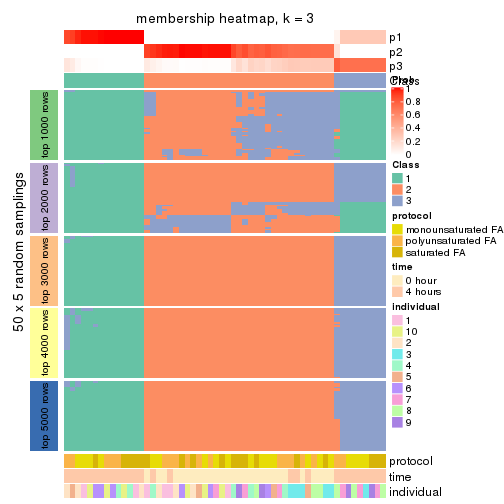</p>

</div>
<div id='tab-MAD-pam-membership-heatmap-3'>
<pre><code class="r">membership_heatmap(res, k = 4)
</code></pre>

<p>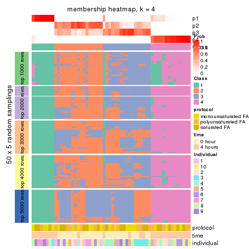</p>

</div>
<div id='tab-MAD-pam-membership-heatmap-4'>
<pre><code class="r">membership_heatmap(res, k = 5)
</code></pre>

<p>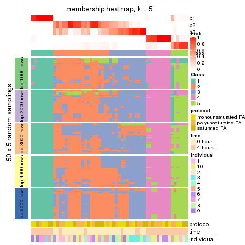</p>

</div>
<div id='tab-MAD-pam-membership-heatmap-5'>
<pre><code class="r">membership_heatmap(res, k = 6)
</code></pre>

<p>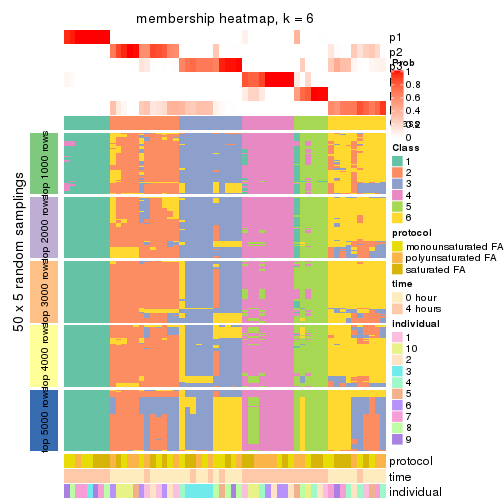</p>

</div>
</div>

As soon as we have had the classes for columns, we can look for signatures
which are significantly different between classes which can be candidate marks
for certain classes. Following are the heatmaps for signatures.


Signature heatmaps where rows are scaled:


<script>
$( function() {
	$( '#tabs-MAD-pam-get-signatures' ).tabs();
} );
</script>
<div id='tabs-MAD-pam-get-signatures'>
<ul>
<li><a href='#tab-MAD-pam-get-signatures-1'>k = 2</a></li>
<li><a href='#tab-MAD-pam-get-signatures-2'>k = 3</a></li>
<li><a href='#tab-MAD-pam-get-signatures-3'>k = 4</a></li>
<li><a href='#tab-MAD-pam-get-signatures-4'>k = 5</a></li>
<li><a href='#tab-MAD-pam-get-signatures-5'>k = 6</a></li>
</ul>
<div id='tab-MAD-pam-get-signatures-1'>
<pre><code class="r">get_signatures(res, k = 2)
</code></pre>

<p>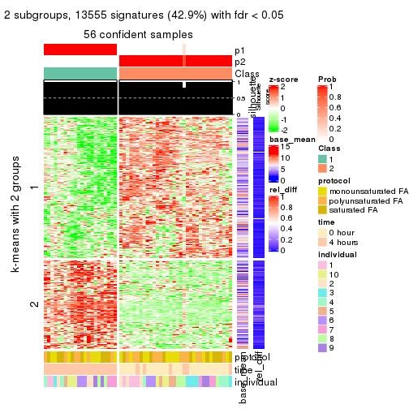</p>

</div>
<div id='tab-MAD-pam-get-signatures-2'>
<pre><code class="r">get_signatures(res, k = 3)
</code></pre>

<p>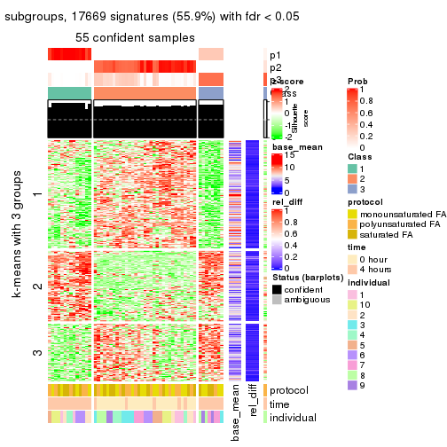</p>

</div>
<div id='tab-MAD-pam-get-signatures-3'>
<pre><code class="r">get_signatures(res, k = 4)
</code></pre>

<p>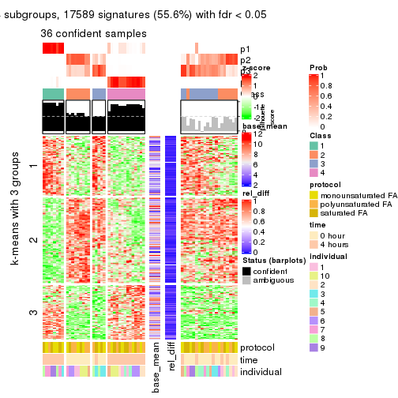</p>

</div>
<div id='tab-MAD-pam-get-signatures-4'>
<pre><code class="r">get_signatures(res, k = 5)
</code></pre>

<p>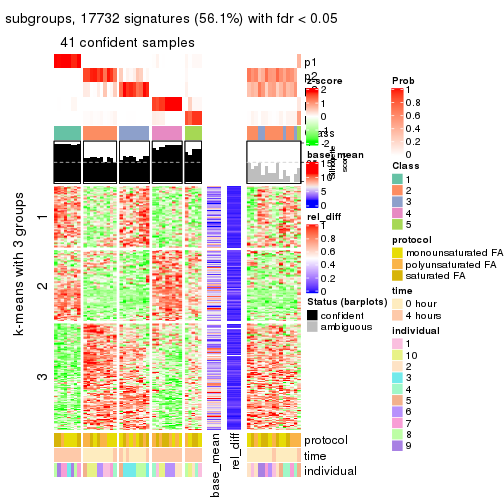</p>

</div>
<div id='tab-MAD-pam-get-signatures-5'>
<pre><code class="r">get_signatures(res, k = 6)
</code></pre>

<p>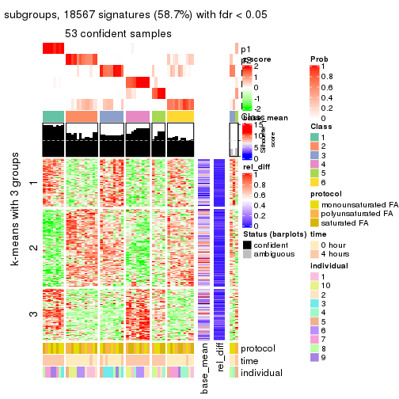</p>

</div>
</div>


Signature heatmaps where rows are not scaled:


<script>
$( function() {
	$( '#tabs-MAD-pam-get-signatures-no-scale' ).tabs();
} );
</script>
<div id='tabs-MAD-pam-get-signatures-no-scale'>
<ul>
<li><a href='#tab-MAD-pam-get-signatures-no-scale-1'>k = 2</a></li>
<li><a href='#tab-MAD-pam-get-signatures-no-scale-2'>k = 3</a></li>
<li><a href='#tab-MAD-pam-get-signatures-no-scale-3'>k = 4</a></li>
<li><a href='#tab-MAD-pam-get-signatures-no-scale-4'>k = 5</a></li>
<li><a href='#tab-MAD-pam-get-signatures-no-scale-5'>k = 6</a></li>
</ul>
<div id='tab-MAD-pam-get-signatures-no-scale-1'>
<pre><code class="r">get_signatures(res, k = 2, scale_rows = FALSE)
</code></pre>

<p>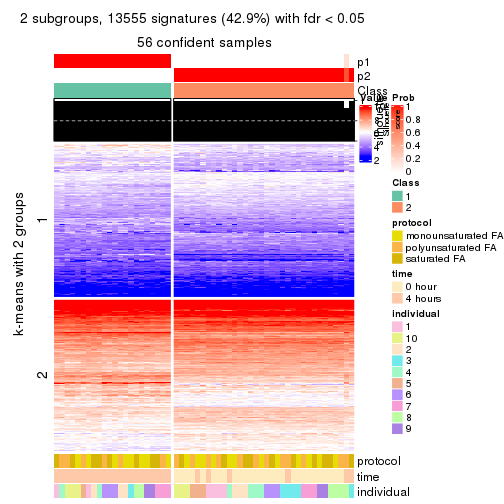</p>

</div>
<div id='tab-MAD-pam-get-signatures-no-scale-2'>
<pre><code class="r">get_signatures(res, k = 3, scale_rows = FALSE)
</code></pre>

<p>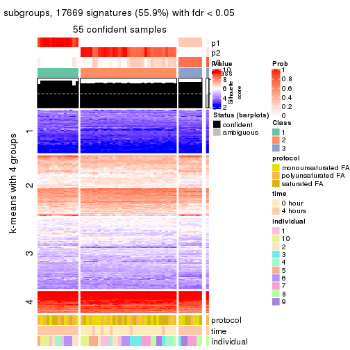</p>

</div>
<div id='tab-MAD-pam-get-signatures-no-scale-3'>
<pre><code class="r">get_signatures(res, k = 4, scale_rows = FALSE)
</code></pre>

<p>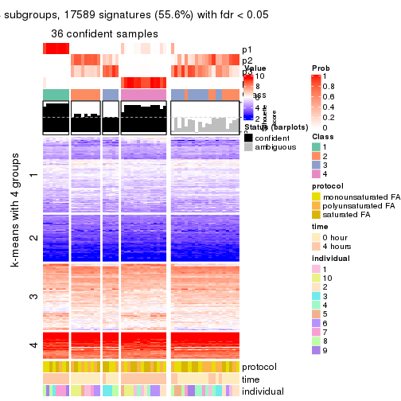</p>

</div>
<div id='tab-MAD-pam-get-signatures-no-scale-4'>
<pre><code class="r">get_signatures(res, k = 5, scale_rows = FALSE)
</code></pre>

<p>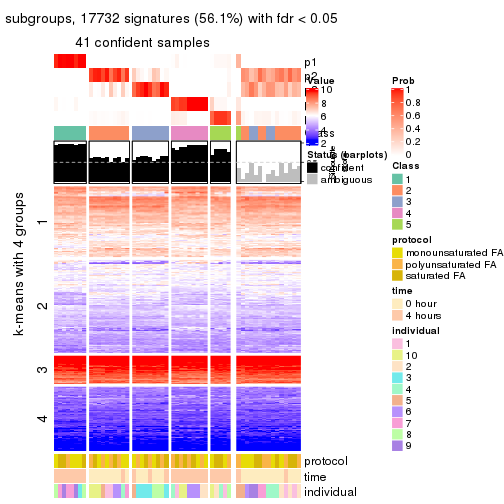</p>

</div>
<div id='tab-MAD-pam-get-signatures-no-scale-5'>
<pre><code class="r">get_signatures(res, k = 6, scale_rows = FALSE)
</code></pre>

<p>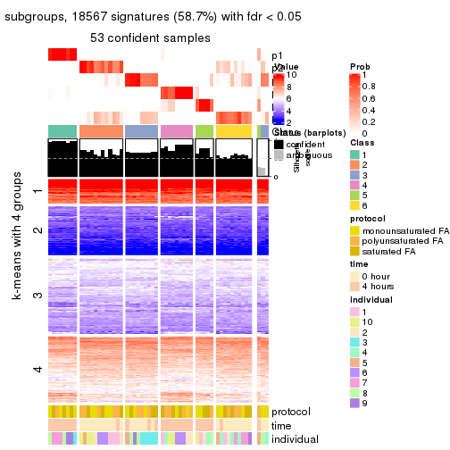</p>

</div>
</div>


Compare the overlap of signatures from different k:

```r
compare_signatures(res)
```

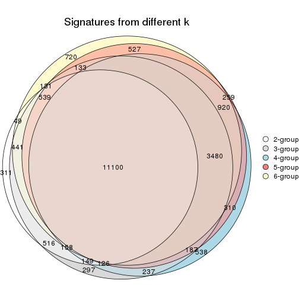

`get_signature()` returns a data frame invisibly. TO get the list of signatures, the function
call should be assigned to a variable explicitly. In following code, if `plot` argument is set
to `FALSE`, no heatmap is plotted while only the differential analysis is performed.

```r
# code only for demonstration
tb = get_signature(res, k = ..., plot = FALSE)
```

An example of the output of `tb` is:

```
#>   which_row         fdr    mean_1    mean_2 scaled_mean_1 scaled_mean_2 km
#> 1        38 0.042760348  8.373488  9.131774    -0.5533452     0.5164555  1
#> 2        40 0.018707592  7.106213  8.469186    -0.6173731     0.5762149  1
#> 3        55 0.019134737 10.221463 11.207825    -0.6159697     0.5749050  1
#> 4        59 0.006059896  5.921854  7.869574    -0.6899429     0.6439467  1
#> 5        60 0.018055526  8.928898 10.211722    -0.6204761     0.5791110  1
#> 6        98 0.009384629 15.714769 14.887706     0.6635654    -0.6193277  2
...
```

The columns in `tb` are:

1. `which_row`: row indices corresponding to the input matrix.
2. `fdr`: FDR for the differential test. 
3. `mean_x`: The mean value in group x.
4. `scaled_mean_x`: The mean value in group x after rows are scaled.
5. `km`: Row groups if k-means clustering is applied to rows.


UMAP plot which shows how samples are separated.


<script>
$( function() {
	$( '#tabs-MAD-pam-dimension-reduction' ).tabs();
} );
</script>
<div id='tabs-MAD-pam-dimension-reduction'>
<ul>
<li><a href='#tab-MAD-pam-dimension-reduction-1'>k = 2</a></li>
<li><a href='#tab-MAD-pam-dimension-reduction-2'>k = 3</a></li>
<li><a href='#tab-MAD-pam-dimension-reduction-3'>k = 4</a></li>
<li><a href='#tab-MAD-pam-dimension-reduction-4'>k = 5</a></li>
<li><a href='#tab-MAD-pam-dimension-reduction-5'>k = 6</a></li>
</ul>
<div id='tab-MAD-pam-dimension-reduction-1'>
<pre><code class="r">dimension_reduction(res, k = 2, method = &quot;UMAP&quot;)
</code></pre>

<p>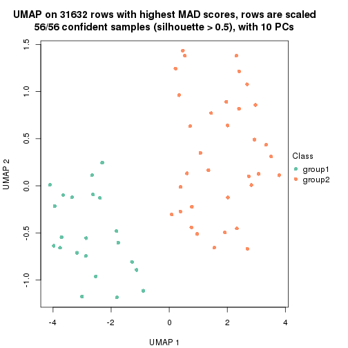</p>

</div>
<div id='tab-MAD-pam-dimension-reduction-2'>
<pre><code class="r">dimension_reduction(res, k = 3, method = &quot;UMAP&quot;)
</code></pre>

<p>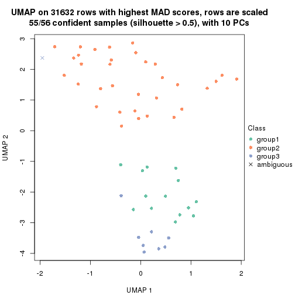</p>

</div>
<div id='tab-MAD-pam-dimension-reduction-3'>
<pre><code class="r">dimension_reduction(res, k = 4, method = &quot;UMAP&quot;)
</code></pre>

<p>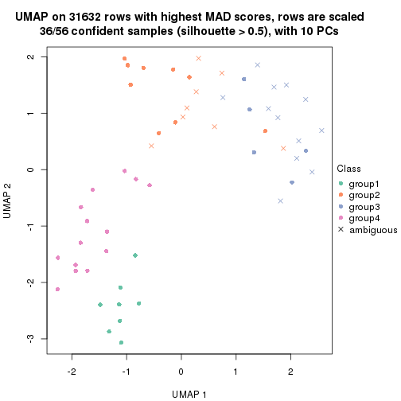</p>

</div>
<div id='tab-MAD-pam-dimension-reduction-4'>
<pre><code class="r">dimension_reduction(res, k = 5, method = &quot;UMAP&quot;)
</code></pre>

<p>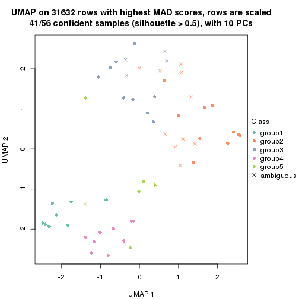</p>

</div>
<div id='tab-MAD-pam-dimension-reduction-5'>
<pre><code class="r">dimension_reduction(res, k = 6, method = &quot;UMAP&quot;)
</code></pre>

<p>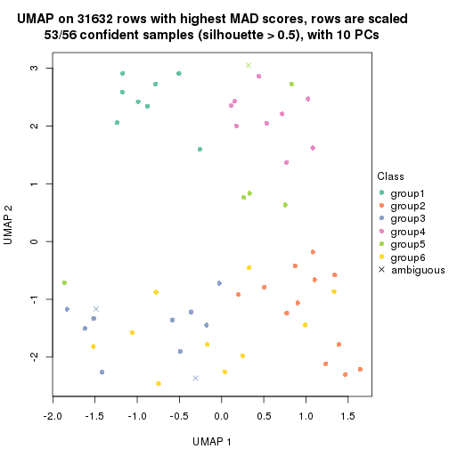</p>

</div>
</div>


Following heatmap shows how subgroups are split when increasing `k`:

```r
collect_classes(res)
```

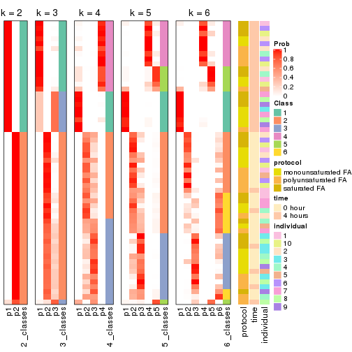


Test correlation between subgroups and known annotations. If the known
annotation is numeric, one-way ANOVA test is applied, and if the known
annotation is discrete, chi-squared contingency table test is applied.

```r
test_to_known_factors(res)
```

```
#>          n protocol(p)  time(p) individual(p) k
#> MAD:pam 56       0.790 9.14e-09       0.95382 2
#> MAD:pam 55       0.765 5.53e-09       0.07933 3
#> MAD:pam 36       0.824 4.04e-07       0.00173 4
#> MAD:pam 41       0.903 9.87e-06       0.00530 5
#> MAD:pam 53       0.966 4.28e-07       0.00178 6
```


If matrix rows can be associated to genes, consider to use `functional_enrichment(res,
...)` to perform function enrichment for the signature genes. See [this vignette](http://bioconductor.org/packages/devel/bioc/vignettes/cola/inst/doc/functional_enrichment.html) for more detailed explanations.


 

---------------------------------------------------


### MAD:mclust**


The object with results only for a single top-value method and a single partition method 
can be extracted as:

```r
res = res_list["MAD", "mclust"]
# you can also extract it by
# res = res_list["MAD:mclust"]
```

A summary of `res` and all the functions that can be applied to it:

```r
res
```

```
#> A 'ConsensusPartition' object with k = 2, 3, 4, 5, 6.
#>   On a matrix with 31632 rows and 56 columns.
#>   Top rows (1000, 2000, 3000, 4000, 5000) are extracted by 'MAD' method.
#>   Subgroups are detected by 'mclust' method.
#>   Performed in total 1250 partitions by row resampling.
#>   Best k for subgroups seems to be 2.
#> 
#> Following methods can be applied to this 'ConsensusPartition' object:
#>  [1] "cola_report"             "collect_classes"         "collect_plots"          
#>  [4] "collect_stats"           "colnames"                "compare_signatures"     
#>  [7] "consensus_heatmap"       "dimension_reduction"     "functional_enrichment"  
#> [10] "get_anno_col"            "get_anno"                "get_classes"            
#> [13] "get_consensus"           "get_matrix"              "get_membership"         
#> [16] "get_param"               "get_signatures"          "get_stats"              
#> [19] "is_best_k"               "is_stable_k"             "membership_heatmap"     
#> [22] "ncol"                    "nrow"                    "plot_ecdf"              
#> [25] "rownames"                "select_partition_number" "show"                   
#> [28] "suggest_best_k"          "test_to_known_factors"
```

`collect_plots()` function collects all the plots made from `res` for all `k` (number of partitions)
into one single page to provide an easy and fast comparison between different `k`.

```r
collect_plots(res)
```

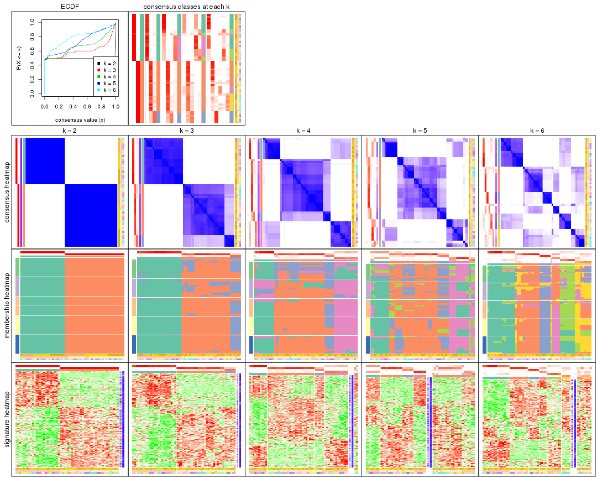

The plots are:

- The first row: a plot of the ECDF (empirical cumulative distribution
  function) curves of the consensus matrix for each `k` and the heatmap of
  predicted classes for each `k`.
- The second row: heatmaps of the consensus matrix for each `k`.
- The third row: heatmaps of the membership matrix for each `k`.
- The fouth row: heatmaps of the signatures for each `k`.

All the plots in panels can be made by individual functions and they are
plotted later in this section.

`select_partition_number()` produces several plots showing different
statistics for choosing "optimized" `k`. There are following statistics:

- ECDF curves of the consensus matrix for each `k`;
- 1-PAC. [The PAC
  score](https://en.wikipedia.org/wiki/Consensus_clustering#Over-interpretation_potential_of_consensus_clustering)
  measures the proportion of the ambiguous subgrouping.
- Mean silhouette score.
- Concordance. The mean probability of fiting the consensus class ids in all
  partitions.
- Area increased. Denote $A_k$ as the area under the ECDF curve for current
  `k`, the area increased is defined as $A_k - A_{k-1}$.
- Rand index. The percent of pairs of samples that are both in a same cluster
  or both are not in a same cluster in the partition of k and k-1.
- Jaccard index. The ratio of pairs of samples are both in a same cluster in
  the partition of k and k-1 and the pairs of samples are both in a same
  cluster in the partition k or k-1.

The detailed explanations of these statistics can be found in [the _cola_
vignette](http://bioconductor.org/packages/devel/bioc/vignettes/cola/inst/doc/cola.html#toc_13).

Generally speaking, lower PAC score, higher mean silhouette score or higher
concordance corresponds to better partition. Rand index and Jaccard index
measure how similar the current partition is compared to partition with `k-1`.
If they are too similar, we won't accept `k` is better than `k-1`.

```r
select_partition_number(res)
```

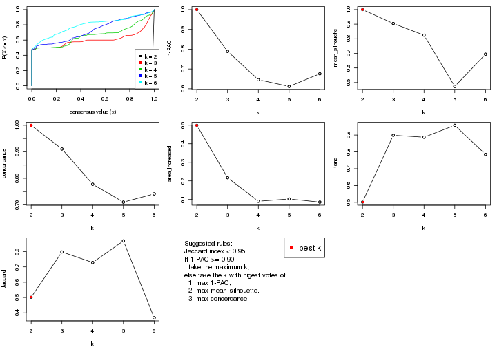

The numeric values for all these statistics can be obtained by `get_stats()`.

```r
get_stats(res)
```

```
#>   k 1-PAC mean_silhouette concordance area_increased  Rand Jaccard
#> 2 2 1.000           1.000       1.000         0.4992 0.501   0.501
#> 3 3 0.789           0.905       0.911         0.2171 0.899   0.798
#> 4 4 0.646           0.825       0.778         0.0905 0.887   0.729
#> 5 5 0.612           0.473       0.710         0.1029 0.958   0.870
#> 6 6 0.676           0.694       0.741         0.0859 0.785   0.367
```

`suggest_best_k()` suggests the best $k$ based on these statistics. The rules are as follows:

- All $k$ with Jaccard index larger than 0.95 are removed because increasing
  $k$ does not provide enough extra information. If all $k$ are removed, it is
  marked as no subgroup is detected.
- For all $k$ with 1-PAC score larger than 0.9, the maximal $k$ is taken as
  the best $k$, and other $k$ are marked as optional $k$.
- If it does not fit the second rule. The $k$ with the maximal vote of the
  highest 1-PAC score, highest mean silhouette, and highest concordance is
  taken as the best $k$.

```r
suggest_best_k(res)
```

```
#> [1] 2
```


Following shows the table of the partitions (You need to click the **show/hide
code output** link to see it). The membership matrix (columns with name `p*`)
is inferred by
[`clue::cl_consensus()`](https://www.rdocumentation.org/link/cl_consensus?package=clue)
function with the `SE` method. Basically the value in the membership matrix
represents the probability to belong to a certain group. The finall class
label for an item is determined with the group with highest probability it
belongs to.

In `get_classes()` function, the entropy is calculated from the membership
matrix and the silhouette score is calculated from the consensus matrix.


<script>
$( function() {
	$( '#tabs-MAD-mclust-get-classes' ).tabs();
} );
</script>
<div id='tabs-MAD-mclust-get-classes'>
<ul>
<li><a href='#tab-MAD-mclust-get-classes-1'>k = 2</a></li>
<li><a href='#tab-MAD-mclust-get-classes-2'>k = 3</a></li>
<li><a href='#tab-MAD-mclust-get-classes-3'>k = 4</a></li>
<li><a href='#tab-MAD-mclust-get-classes-4'>k = 5</a></li>
<li><a href='#tab-MAD-mclust-get-classes-5'>k = 6</a></li>
</ul>

<div id='tab-MAD-mclust-get-classes-1'>
<p><a id='tab-MAD-mclust-get-classes-1-a' style='color:#0366d6' href='#'>show/hide code output</a></p>
<pre><code class="r">cbind(get_classes(res, k = 2), get_membership(res, k = 2))
</code></pre>

<pre><code>#&gt;           class entropy silhouette    p1    p2
#&gt; GSM790742     2  0.0000      1.000 0.000 1.000
#&gt; GSM790744     2  0.0000      1.000 0.000 1.000
#&gt; GSM790754     2  0.0000      1.000 0.000 1.000
#&gt; GSM790756     2  0.0000      1.000 0.000 1.000
#&gt; GSM790768     2  0.0000      1.000 0.000 1.000
#&gt; GSM790774     2  0.0000      1.000 0.000 1.000
#&gt; GSM790778     2  0.0000      1.000 0.000 1.000
#&gt; GSM790784     2  0.0000      1.000 0.000 1.000
#&gt; GSM790790     2  0.0000      1.000 0.000 1.000
#&gt; GSM790743     1  0.0000      1.000 1.000 0.000
#&gt; GSM790745     1  0.0000      1.000 1.000 0.000
#&gt; GSM790755     1  0.0672      0.992 0.992 0.008
#&gt; GSM790757     1  0.0000      1.000 1.000 0.000
#&gt; GSM790769     1  0.0000      1.000 1.000 0.000
#&gt; GSM790775     1  0.0000      1.000 1.000 0.000
#&gt; GSM790779     1  0.0000      1.000 1.000 0.000
#&gt; GSM790785     1  0.0000      1.000 1.000 0.000
#&gt; GSM790791     1  0.0000      1.000 1.000 0.000
#&gt; GSM790738     2  0.0000      1.000 0.000 1.000
#&gt; GSM790746     2  0.0000      1.000 0.000 1.000
#&gt; GSM790752     2  0.0000      1.000 0.000 1.000
#&gt; GSM790758     2  0.0000      1.000 0.000 1.000
#&gt; GSM790764     2  0.0000      1.000 0.000 1.000
#&gt; GSM790766     2  0.0000      1.000 0.000 1.000
#&gt; GSM790772     2  0.0000      1.000 0.000 1.000
#&gt; GSM790782     2  0.0000      1.000 0.000 1.000
#&gt; GSM790786     2  0.0000      1.000 0.000 1.000
#&gt; GSM790792     2  0.0000      1.000 0.000 1.000
#&gt; GSM790739     1  0.0000      1.000 1.000 0.000
#&gt; GSM790747     1  0.0000      1.000 1.000 0.000
#&gt; GSM790753     1  0.0000      1.000 1.000 0.000
#&gt; GSM790759     2  0.0000      1.000 0.000 1.000
#&gt; GSM790765     2  0.0000      1.000 0.000 1.000
#&gt; GSM790767     1  0.0000      1.000 1.000 0.000
#&gt; GSM790773     1  0.0000      1.000 1.000 0.000
#&gt; GSM790783     1  0.0000      1.000 1.000 0.000
#&gt; GSM790787     1  0.0000      1.000 1.000 0.000
#&gt; GSM790793     1  0.0000      1.000 1.000 0.000
#&gt; GSM790740     2  0.0000      1.000 0.000 1.000
#&gt; GSM790748     2  0.0000      1.000 0.000 1.000
#&gt; GSM790750     2  0.0000      1.000 0.000 1.000
#&gt; GSM790760     2  0.0000      1.000 0.000 1.000
#&gt; GSM790762     2  0.0000      1.000 0.000 1.000
#&gt; GSM790770     2  0.0000      1.000 0.000 1.000
#&gt; GSM790776     2  0.0000      1.000 0.000 1.000
#&gt; GSM790780     2  0.0000      1.000 0.000 1.000
#&gt; GSM790788     2  0.0000      1.000 0.000 1.000
#&gt; GSM790741     2  0.0000      1.000 0.000 1.000
#&gt; GSM790749     1  0.0000      1.000 1.000 0.000
#&gt; GSM790751     2  0.0000      1.000 0.000 1.000
#&gt; GSM790761     1  0.0000      1.000 1.000 0.000
#&gt; GSM790763     1  0.0000      1.000 1.000 0.000
#&gt; GSM790771     1  0.0000      1.000 1.000 0.000
#&gt; GSM790777     1  0.0000      1.000 1.000 0.000
#&gt; GSM790781     1  0.0000      1.000 1.000 0.000
#&gt; GSM790789     1  0.0000      1.000 1.000 0.000
</code></pre>

<script>
$('#tab-MAD-mclust-get-classes-1-a').parent().next().next().hide();
$('#tab-MAD-mclust-get-classes-1-a').click(function(){
  $('#tab-MAD-mclust-get-classes-1-a').parent().next().next().toggle();
  return(false);
});
</script>
</div>

<div id='tab-MAD-mclust-get-classes-2'>
<p><a id='tab-MAD-mclust-get-classes-2-a' style='color:#0366d6' href='#'>show/hide code output</a></p>
<pre><code class="r">cbind(get_classes(res, k = 3), get_membership(res, k = 3))
</code></pre>

<pre><code>#&gt;           class entropy silhouette    p1    p2    p3
#&gt; GSM790742     2  0.1289      0.870 0.000 0.968 0.032
#&gt; GSM790744     2  0.2711      0.874 0.000 0.912 0.088
#&gt; GSM790754     2  0.4931      0.660 0.000 0.768 0.232
#&gt; GSM790756     2  0.4062      0.801 0.000 0.836 0.164
#&gt; GSM790768     2  0.2356      0.875 0.000 0.928 0.072
#&gt; GSM790774     3  0.5327      0.969 0.000 0.272 0.728
#&gt; GSM790778     3  0.5138      0.984 0.000 0.252 0.748
#&gt; GSM790784     3  0.5098      0.988 0.000 0.248 0.752
#&gt; GSM790790     2  0.2537      0.871 0.000 0.920 0.080
#&gt; GSM790743     1  0.2537      0.955 0.920 0.000 0.080
#&gt; GSM790745     1  0.0000      0.975 1.000 0.000 0.000
#&gt; GSM790755     1  0.3686      0.911 0.860 0.000 0.140
#&gt; GSM790757     1  0.0000      0.975 1.000 0.000 0.000
#&gt; GSM790769     1  0.0892      0.972 0.980 0.000 0.020
#&gt; GSM790775     1  0.1643      0.971 0.956 0.000 0.044
#&gt; GSM790779     1  0.1643      0.971 0.956 0.000 0.044
#&gt; GSM790785     1  0.1643      0.971 0.956 0.000 0.044
#&gt; GSM790791     1  0.0000      0.975 1.000 0.000 0.000
#&gt; GSM790738     2  0.1411      0.877 0.000 0.964 0.036
#&gt; GSM790746     2  0.0747      0.874 0.000 0.984 0.016
#&gt; GSM790752     2  0.4974      0.660 0.000 0.764 0.236
#&gt; GSM790758     2  0.5058      0.654 0.000 0.756 0.244
#&gt; GSM790764     2  0.1411      0.873 0.000 0.964 0.036
#&gt; GSM790766     2  0.2537      0.877 0.000 0.920 0.080
#&gt; GSM790772     2  0.3038      0.868 0.000 0.896 0.104
#&gt; GSM790782     3  0.5138      0.982 0.000 0.252 0.748
#&gt; GSM790786     3  0.5098      0.988 0.000 0.248 0.752
#&gt; GSM790792     2  0.2537      0.871 0.000 0.920 0.080
#&gt; GSM790739     1  0.0424      0.974 0.992 0.000 0.008
#&gt; GSM790747     1  0.1031      0.972 0.976 0.000 0.024
#&gt; GSM790753     1  0.0892      0.975 0.980 0.000 0.020
#&gt; GSM790759     2  0.3116      0.872 0.000 0.892 0.108
#&gt; GSM790765     3  0.5098      0.988 0.000 0.248 0.752
#&gt; GSM790767     1  0.0747      0.972 0.984 0.000 0.016
#&gt; GSM790773     1  0.1643      0.971 0.956 0.000 0.044
#&gt; GSM790783     1  0.0892      0.974 0.980 0.000 0.020
#&gt; GSM790787     1  0.1643      0.971 0.956 0.000 0.044
#&gt; GSM790793     1  0.0000      0.975 1.000 0.000 0.000
#&gt; GSM790740     2  0.1643      0.870 0.000 0.956 0.044
#&gt; GSM790748     2  0.0892      0.875 0.000 0.980 0.020
#&gt; GSM790750     2  0.4974      0.660 0.000 0.764 0.236
#&gt; GSM790760     2  0.0892      0.876 0.000 0.980 0.020
#&gt; GSM790762     2  0.2711      0.869 0.000 0.912 0.088
#&gt; GSM790770     2  0.2165      0.876 0.000 0.936 0.064
#&gt; GSM790776     2  0.0592      0.877 0.000 0.988 0.012
#&gt; GSM790780     2  0.5842      0.682 0.036 0.768 0.196
#&gt; GSM790788     2  0.2711      0.869 0.000 0.912 0.088
#&gt; GSM790741     2  0.3267      0.869 0.000 0.884 0.116
#&gt; GSM790749     1  0.2165      0.963 0.936 0.000 0.064
#&gt; GSM790751     2  0.3038      0.836 0.000 0.896 0.104
#&gt; GSM790761     1  0.2261      0.961 0.932 0.000 0.068
#&gt; GSM790763     1  0.0592      0.973 0.988 0.000 0.012
#&gt; GSM790771     1  0.2165      0.963 0.936 0.000 0.064
#&gt; GSM790777     1  0.1031      0.974 0.976 0.000 0.024
#&gt; GSM790781     1  0.2066      0.951 0.940 0.000 0.060
#&gt; GSM790789     1  0.0000      0.975 1.000 0.000 0.000
</code></pre>

<script>
$('#tab-MAD-mclust-get-classes-2-a').parent().next().next().hide();
$('#tab-MAD-mclust-get-classes-2-a').click(function(){
  $('#tab-MAD-mclust-get-classes-2-a').parent().next().next().toggle();
  return(false);
});
</script>
</div>

<div id='tab-MAD-mclust-get-classes-3'>
<p><a id='tab-MAD-mclust-get-classes-3-a' style='color:#0366d6' href='#'>show/hide code output</a></p>
<pre><code class="r">cbind(get_classes(res, k = 4), get_membership(res, k = 4))
</code></pre>

<pre><code>#&gt;           class entropy silhouette    p1    p2    p3    p4
#&gt; GSM790742     2  0.3439     0.7850 0.000 0.868 0.048 0.084
#&gt; GSM790744     2  0.1302     0.8350 0.000 0.956 0.000 0.044
#&gt; GSM790754     2  0.4805     0.6870 0.000 0.784 0.132 0.084
#&gt; GSM790756     2  0.3312     0.7840 0.000 0.876 0.072 0.052
#&gt; GSM790768     2  0.1389     0.8339 0.000 0.952 0.000 0.048
#&gt; GSM790774     3  0.4522     0.9620 0.000 0.320 0.680 0.000
#&gt; GSM790778     2  0.4855    -0.0563 0.000 0.600 0.400 0.000
#&gt; GSM790784     3  0.4500     0.9633 0.000 0.316 0.684 0.000
#&gt; GSM790790     2  0.1792     0.8246 0.000 0.932 0.000 0.068
#&gt; GSM790743     4  0.4797     0.8752 0.260 0.000 0.020 0.720
#&gt; GSM790745     4  0.4406     0.8924 0.300 0.000 0.000 0.700
#&gt; GSM790755     1  0.7359     0.4819 0.544 0.016 0.316 0.124
#&gt; GSM790757     4  0.4406     0.8924 0.300 0.000 0.000 0.700
#&gt; GSM790769     4  0.4855     0.8558 0.400 0.000 0.000 0.600
#&gt; GSM790775     1  0.0188     0.9108 0.996 0.000 0.000 0.004
#&gt; GSM790779     1  0.0376     0.9127 0.992 0.000 0.004 0.004
#&gt; GSM790785     1  0.0000     0.9133 1.000 0.000 0.000 0.000
#&gt; GSM790791     4  0.4624     0.9011 0.340 0.000 0.000 0.660
#&gt; GSM790738     2  0.1557     0.8307 0.000 0.944 0.000 0.056
#&gt; GSM790746     2  0.0895     0.8394 0.000 0.976 0.004 0.020
#&gt; GSM790752     2  0.4805     0.6870 0.000 0.784 0.132 0.084
#&gt; GSM790758     2  0.4805     0.6870 0.000 0.784 0.132 0.084
#&gt; GSM790764     2  0.2412     0.8183 0.000 0.908 0.008 0.084
#&gt; GSM790766     2  0.1411     0.8370 0.000 0.960 0.020 0.020
#&gt; GSM790772     2  0.1398     0.8360 0.000 0.956 0.004 0.040
#&gt; GSM790782     3  0.4804     0.8592 0.000 0.384 0.616 0.000
#&gt; GSM790786     3  0.4500     0.9633 0.000 0.316 0.684 0.000
#&gt; GSM790792     2  0.1792     0.8246 0.000 0.932 0.000 0.068
#&gt; GSM790739     4  0.4406     0.8929 0.300 0.000 0.000 0.700
#&gt; GSM790747     4  0.4830     0.8647 0.392 0.000 0.000 0.608
#&gt; GSM790753     1  0.0188     0.9129 0.996 0.000 0.000 0.004
#&gt; GSM790759     2  0.0921     0.8386 0.000 0.972 0.000 0.028
#&gt; GSM790765     3  0.4699     0.9609 0.000 0.320 0.676 0.004
#&gt; GSM790767     4  0.4877     0.8500 0.408 0.000 0.000 0.592
#&gt; GSM790773     1  0.0000     0.9133 1.000 0.000 0.000 0.000
#&gt; GSM790783     1  0.0469     0.9122 0.988 0.000 0.000 0.012
#&gt; GSM790787     1  0.0000     0.9133 1.000 0.000 0.000 0.000
#&gt; GSM790793     4  0.4406     0.8924 0.300 0.000 0.000 0.700
#&gt; GSM790740     2  0.1209     0.8400 0.000 0.964 0.004 0.032
#&gt; GSM790748     2  0.3216     0.7923 0.000 0.880 0.044 0.076
#&gt; GSM790750     2  0.4805     0.6870 0.000 0.784 0.132 0.084
#&gt; GSM790760     2  0.2797     0.8088 0.000 0.900 0.032 0.068
#&gt; GSM790762     2  0.1792     0.8246 0.000 0.932 0.000 0.068
#&gt; GSM790770     2  0.1389     0.8339 0.000 0.952 0.000 0.048
#&gt; GSM790776     2  0.2480     0.8168 0.000 0.904 0.008 0.088
#&gt; GSM790780     2  0.5224     0.6749 0.040 0.784 0.132 0.044
#&gt; GSM790788     2  0.1867     0.8256 0.000 0.928 0.000 0.072
#&gt; GSM790741     2  0.1022     0.8379 0.000 0.968 0.000 0.032
#&gt; GSM790749     4  0.4741     0.8891 0.328 0.000 0.004 0.668
#&gt; GSM790751     2  0.4547     0.7271 0.000 0.804 0.092 0.104
#&gt; GSM790761     4  0.4576     0.8776 0.260 0.000 0.012 0.728
#&gt; GSM790763     1  0.1940     0.8478 0.924 0.000 0.000 0.076
#&gt; GSM790771     4  0.4781     0.8920 0.336 0.000 0.004 0.660
#&gt; GSM790777     1  0.0469     0.9122 0.988 0.000 0.000 0.012
#&gt; GSM790781     1  0.3858     0.7977 0.844 0.000 0.056 0.100
#&gt; GSM790789     4  0.4585     0.9018 0.332 0.000 0.000 0.668
</code></pre>

<script>
$('#tab-MAD-mclust-get-classes-3-a').parent().next().next().hide();
$('#tab-MAD-mclust-get-classes-3-a').click(function(){
  $('#tab-MAD-mclust-get-classes-3-a').parent().next().next().toggle();
  return(false);
});
</script>
</div>

<div id='tab-MAD-mclust-get-classes-4'>
<p><a id='tab-MAD-mclust-get-classes-4-a' style='color:#0366d6' href='#'>show/hide code output</a></p>
<pre><code class="r">cbind(get_classes(res, k = 5), get_membership(res, k = 5))
</code></pre>

<pre><code>#&gt;           class entropy silhouette    p1    p2    p3    p4    p5
#&gt; GSM790742     2  0.6457     0.4113 0.116 0.640 0.156 0.000 0.088
#&gt; GSM790744     2  0.1943     0.6113 0.056 0.924 0.020 0.000 0.000
#&gt; GSM790754     2  0.4825     0.2647 0.028 0.708 0.240 0.000 0.024
#&gt; GSM790756     2  0.4312     0.4123 0.032 0.772 0.176 0.000 0.020
#&gt; GSM790768     2  0.1872     0.6079 0.052 0.928 0.020 0.000 0.000
#&gt; GSM790774     3  0.4101     0.8770 0.004 0.332 0.664 0.000 0.000
#&gt; GSM790778     3  0.3895     0.8884 0.000 0.320 0.680 0.000 0.000
#&gt; GSM790784     3  0.4273     0.7040 0.000 0.448 0.552 0.000 0.000
#&gt; GSM790790     2  0.6344     0.2226 0.252 0.576 0.156 0.000 0.016
#&gt; GSM790743     5  0.3452     0.4031 0.000 0.000 0.000 0.244 0.756
#&gt; GSM790745     4  0.4425    -0.1083 0.004 0.000 0.000 0.544 0.452
#&gt; GSM790755     5  0.6419     0.3314 0.164 0.048 0.164 0.000 0.624
#&gt; GSM790757     4  0.4425    -0.1083 0.004 0.000 0.000 0.544 0.452
#&gt; GSM790769     4  0.1205     0.5465 0.040 0.000 0.000 0.956 0.004
#&gt; GSM790775     1  0.4297     0.8028 0.528 0.000 0.000 0.472 0.000
#&gt; GSM790779     1  0.5784     0.7531 0.476 0.000 0.032 0.460 0.032
#&gt; GSM790785     1  0.4294     0.8053 0.532 0.000 0.000 0.468 0.000
#&gt; GSM790791     4  0.2011     0.5663 0.004 0.000 0.000 0.908 0.088
#&gt; GSM790738     2  0.2308     0.5994 0.048 0.912 0.036 0.000 0.004
#&gt; GSM790746     2  0.0771     0.6199 0.004 0.976 0.020 0.000 0.000
#&gt; GSM790752     2  0.4798     0.2706 0.028 0.712 0.236 0.000 0.024
#&gt; GSM790758     2  0.4798     0.2706 0.028 0.712 0.236 0.000 0.024
#&gt; GSM790764     2  0.2519     0.6038 0.060 0.900 0.036 0.000 0.004
#&gt; GSM790766     2  0.0955     0.6100 0.004 0.968 0.028 0.000 0.000
#&gt; GSM790772     2  0.1750     0.6133 0.036 0.936 0.028 0.000 0.000
#&gt; GSM790782     3  0.3857     0.8826 0.000 0.312 0.688 0.000 0.000
#&gt; GSM790786     3  0.4201     0.7935 0.000 0.408 0.592 0.000 0.000
#&gt; GSM790792     2  0.6344     0.2226 0.252 0.576 0.156 0.000 0.016
#&gt; GSM790739     4  0.4420    -0.1104 0.004 0.000 0.000 0.548 0.448
#&gt; GSM790747     4  0.1205     0.5465 0.040 0.000 0.000 0.956 0.004
#&gt; GSM790753     1  0.4297     0.8030 0.528 0.000 0.000 0.472 0.000
#&gt; GSM790759     2  0.3001     0.5724 0.008 0.844 0.144 0.000 0.004
#&gt; GSM790765     3  0.3895     0.8880 0.000 0.320 0.680 0.000 0.000
#&gt; GSM790767     4  0.0880     0.5548 0.032 0.000 0.000 0.968 0.000
#&gt; GSM790773     1  0.4294     0.8053 0.532 0.000 0.000 0.468 0.000
#&gt; GSM790783     1  0.4297     0.8030 0.528 0.000 0.000 0.472 0.000
#&gt; GSM790787     1  0.4294     0.8053 0.532 0.000 0.000 0.468 0.000
#&gt; GSM790793     4  0.4425    -0.1083 0.004 0.000 0.000 0.544 0.452
#&gt; GSM790740     2  0.1329     0.6175 0.008 0.956 0.032 0.000 0.004
#&gt; GSM790748     2  0.5927     0.4371 0.116 0.668 0.176 0.000 0.040
#&gt; GSM790750     2  0.4825     0.2722 0.028 0.708 0.240 0.000 0.024
#&gt; GSM790760     2  0.6039     0.4338 0.120 0.660 0.176 0.000 0.044
#&gt; GSM790762     2  0.6344     0.2226 0.252 0.576 0.156 0.000 0.016
#&gt; GSM790770     2  0.1661     0.6181 0.036 0.940 0.024 0.000 0.000
#&gt; GSM790776     2  0.2369     0.6052 0.056 0.908 0.032 0.000 0.004
#&gt; GSM790780     2  0.5416    -0.1528 0.028 0.584 0.364 0.000 0.024
#&gt; GSM790788     2  0.6428     0.2183 0.256 0.564 0.164 0.000 0.016
#&gt; GSM790741     2  0.2953     0.5756 0.012 0.844 0.144 0.000 0.000
#&gt; GSM790749     4  0.2011     0.5415 0.004 0.000 0.000 0.908 0.088
#&gt; GSM790751     2  0.4729     0.3820 0.044 0.744 0.188 0.000 0.024
#&gt; GSM790761     5  0.4268     0.0367 0.000 0.000 0.000 0.444 0.556
#&gt; GSM790763     1  0.5998    -0.1126 0.464 0.000 0.004 0.096 0.436
#&gt; GSM790771     4  0.2011     0.5415 0.004 0.000 0.000 0.908 0.088
#&gt; GSM790777     1  0.4294     0.8053 0.532 0.000 0.000 0.468 0.000
#&gt; GSM790781     1  0.6502    -0.1552 0.468 0.000 0.104 0.024 0.404
#&gt; GSM790789     4  0.0671     0.5786 0.004 0.000 0.000 0.980 0.016
</code></pre>

<script>
$('#tab-MAD-mclust-get-classes-4-a').parent().next().next().hide();
$('#tab-MAD-mclust-get-classes-4-a').click(function(){
  $('#tab-MAD-mclust-get-classes-4-a').parent().next().next().toggle();
  return(false);
});
</script>
</div>

<div id='tab-MAD-mclust-get-classes-5'>
<p><a id='tab-MAD-mclust-get-classes-5-a' style='color:#0366d6' href='#'>show/hide code output</a></p>
<pre><code class="r">cbind(get_classes(res, k = 6), get_membership(res, k = 6))
</code></pre>

<pre><code>#&gt;           class entropy silhouette    p1    p2    p3    p4    p5    p6
#&gt; GSM790742     6  0.7401      0.276 0.000 0.108 0.016 0.272 0.172 0.432
#&gt; GSM790744     2  0.0603      0.731 0.000 0.980 0.004 0.016 0.000 0.000
#&gt; GSM790754     6  0.5187      0.589 0.000 0.264 0.136 0.000 0.000 0.600
#&gt; GSM790756     6  0.5598      0.346 0.000 0.420 0.100 0.012 0.000 0.468
#&gt; GSM790768     2  0.0547      0.724 0.000 0.980 0.000 0.020 0.000 0.000
#&gt; GSM790774     3  0.1285      0.974 0.000 0.052 0.944 0.004 0.000 0.000
#&gt; GSM790778     3  0.0937      0.981 0.000 0.040 0.960 0.000 0.000 0.000
#&gt; GSM790784     3  0.1219      0.978 0.000 0.048 0.948 0.000 0.000 0.004
#&gt; GSM790790     4  0.3966      0.662 0.000 0.444 0.004 0.552 0.000 0.000
#&gt; GSM790743     5  0.6174      0.855 0.180 0.000 0.032 0.072 0.632 0.084
#&gt; GSM790745     5  0.2562      0.892 0.172 0.000 0.000 0.000 0.828 0.000
#&gt; GSM790755     4  0.6481     -0.245 0.020 0.000 0.000 0.392 0.260 0.328
#&gt; GSM790757     5  0.2562      0.892 0.172 0.000 0.000 0.000 0.828 0.000
#&gt; GSM790769     1  0.3471      0.808 0.784 0.000 0.000 0.008 0.188 0.020
#&gt; GSM790775     1  0.0000      0.833 1.000 0.000 0.000 0.000 0.000 0.000
#&gt; GSM790779     1  0.3409      0.749 0.808 0.000 0.004 0.044 0.144 0.000
#&gt; GSM790785     1  0.0000      0.833 1.000 0.000 0.000 0.000 0.000 0.000
#&gt; GSM790791     1  0.4139      0.683 0.688 0.000 0.008 0.004 0.284 0.016
#&gt; GSM790738     2  0.0713      0.711 0.000 0.972 0.000 0.028 0.000 0.000
#&gt; GSM790746     2  0.1173      0.756 0.000 0.960 0.016 0.008 0.000 0.016
#&gt; GSM790752     6  0.5187      0.589 0.000 0.264 0.136 0.000 0.000 0.600
#&gt; GSM790758     6  0.5321      0.589 0.000 0.264 0.136 0.000 0.004 0.596
#&gt; GSM790764     2  0.5208      0.423 0.000 0.672 0.028 0.128 0.000 0.172
#&gt; GSM790766     2  0.1845      0.749 0.000 0.920 0.052 0.000 0.000 0.028
#&gt; GSM790772     2  0.2039      0.724 0.000 0.908 0.072 0.004 0.000 0.016
#&gt; GSM790782     3  0.1007      0.980 0.000 0.044 0.956 0.000 0.000 0.000
#&gt; GSM790786     3  0.1007      0.980 0.000 0.044 0.956 0.000 0.000 0.000
#&gt; GSM790792     4  0.3966      0.662 0.000 0.444 0.004 0.552 0.000 0.000
#&gt; GSM790739     5  0.2703      0.893 0.172 0.000 0.000 0.004 0.824 0.000
#&gt; GSM790747     1  0.3471      0.808 0.784 0.000 0.000 0.008 0.188 0.020
#&gt; GSM790753     1  0.1049      0.840 0.960 0.000 0.008 0.000 0.032 0.000
#&gt; GSM790759     2  0.4119      0.630 0.000 0.788 0.040 0.080 0.000 0.092
#&gt; GSM790765     3  0.2119      0.954 0.000 0.044 0.912 0.008 0.000 0.036
#&gt; GSM790767     1  0.3589      0.803 0.776 0.000 0.008 0.004 0.196 0.016
#&gt; GSM790773     1  0.0000      0.833 1.000 0.000 0.000 0.000 0.000 0.000
#&gt; GSM790783     1  0.0260      0.836 0.992 0.000 0.000 0.000 0.008 0.000
#&gt; GSM790787     1  0.0858      0.840 0.968 0.000 0.004 0.000 0.028 0.000
#&gt; GSM790793     5  0.2562      0.892 0.172 0.000 0.000 0.000 0.828 0.000
#&gt; GSM790740     2  0.1232      0.755 0.000 0.956 0.024 0.004 0.000 0.016
#&gt; GSM790748     6  0.7587      0.298 0.000 0.116 0.024 0.268 0.172 0.420
#&gt; GSM790750     6  0.5187      0.589 0.000 0.264 0.136 0.000 0.000 0.600
#&gt; GSM790760     6  0.7662      0.304 0.000 0.124 0.028 0.252 0.172 0.424
#&gt; GSM790762     4  0.3930      0.673 0.000 0.420 0.004 0.576 0.000 0.000
#&gt; GSM790770     2  0.0551      0.747 0.000 0.984 0.008 0.004 0.000 0.004
#&gt; GSM790776     2  0.5711      0.265 0.000 0.596 0.032 0.124 0.000 0.248
#&gt; GSM790780     2  0.9095     -0.464 0.008 0.256 0.204 0.200 0.172 0.160
#&gt; GSM790788     4  0.3890      0.669 0.000 0.400 0.004 0.596 0.000 0.000
#&gt; GSM790741     2  0.1390      0.754 0.000 0.948 0.032 0.004 0.000 0.016
#&gt; GSM790749     1  0.4264      0.807 0.776 0.000 0.008 0.024 0.128 0.064
#&gt; GSM790751     6  0.6445      0.533 0.000 0.288 0.104 0.092 0.000 0.516
#&gt; GSM790761     5  0.6174      0.855 0.180 0.000 0.032 0.072 0.632 0.084
#&gt; GSM790763     5  0.4677      0.837 0.272 0.000 0.000 0.048 0.664 0.016
#&gt; GSM790771     1  0.4264      0.807 0.776 0.000 0.008 0.024 0.128 0.064
#&gt; GSM790777     1  0.0000      0.833 1.000 0.000 0.000 0.000 0.000 0.000
#&gt; GSM790781     5  0.5886      0.806 0.216 0.000 0.000 0.136 0.600 0.048
#&gt; GSM790789     1  0.4026      0.747 0.724 0.000 0.008 0.008 0.244 0.016
</code></pre>

<script>
$('#tab-MAD-mclust-get-classes-5-a').parent().next().next().hide();
$('#tab-MAD-mclust-get-classes-5-a').click(function(){
  $('#tab-MAD-mclust-get-classes-5-a').parent().next().next().toggle();
  return(false);
});
</script>
</div>
</div>

Heatmaps for the consensus matrix. It visualizes the probability of two
samples to be in a same group.


<script>
$( function() {
	$( '#tabs-MAD-mclust-consensus-heatmap' ).tabs();
} );
</script>
<div id='tabs-MAD-mclust-consensus-heatmap'>
<ul>
<li><a href='#tab-MAD-mclust-consensus-heatmap-1'>k = 2</a></li>
<li><a href='#tab-MAD-mclust-consensus-heatmap-2'>k = 3</a></li>
<li><a href='#tab-MAD-mclust-consensus-heatmap-3'>k = 4</a></li>
<li><a href='#tab-MAD-mclust-consensus-heatmap-4'>k = 5</a></li>
<li><a href='#tab-MAD-mclust-consensus-heatmap-5'>k = 6</a></li>
</ul>
<div id='tab-MAD-mclust-consensus-heatmap-1'>
<pre><code class="r">consensus_heatmap(res, k = 2)
</code></pre>

<p>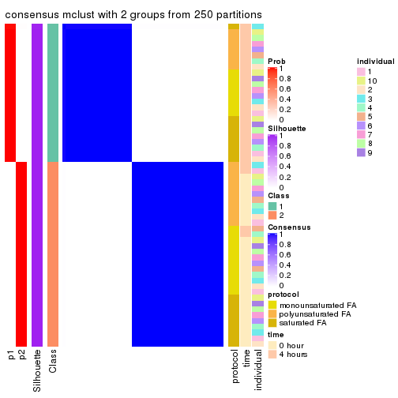</p>

</div>
<div id='tab-MAD-mclust-consensus-heatmap-2'>
<pre><code class="r">consensus_heatmap(res, k = 3)
</code></pre>

<p>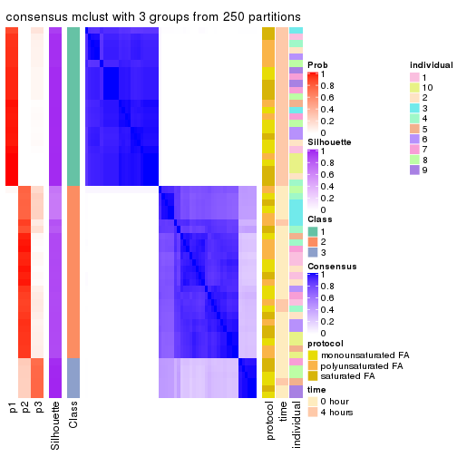</p>

</div>
<div id='tab-MAD-mclust-consensus-heatmap-3'>
<pre><code class="r">consensus_heatmap(res, k = 4)
</code></pre>

<p>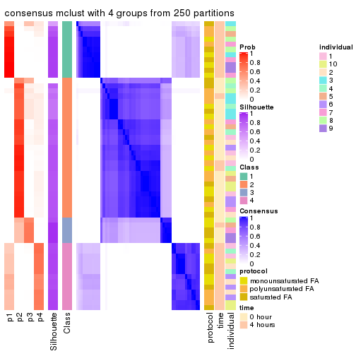</p>

</div>
<div id='tab-MAD-mclust-consensus-heatmap-4'>
<pre><code class="r">consensus_heatmap(res, k = 5)
</code></pre>

<p>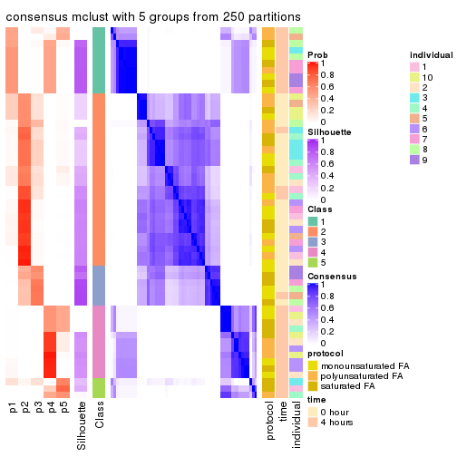</p>

</div>
<div id='tab-MAD-mclust-consensus-heatmap-5'>
<pre><code class="r">consensus_heatmap(res, k = 6)
</code></pre>

<p>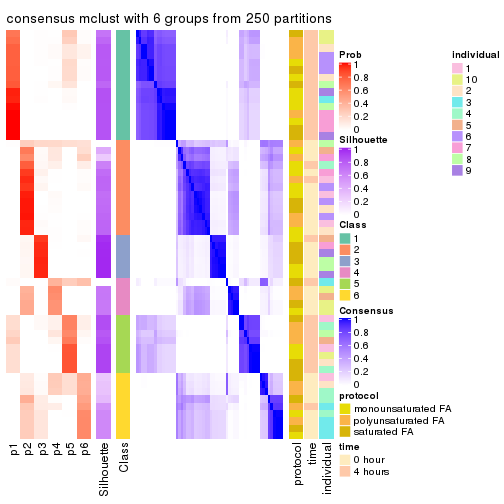</p>

</div>
</div>

Heatmaps for the membership of samples in all partitions to see how consistent they are:


<script>
$( function() {
	$( '#tabs-MAD-mclust-membership-heatmap' ).tabs();
} );
</script>
<div id='tabs-MAD-mclust-membership-heatmap'>
<ul>
<li><a href='#tab-MAD-mclust-membership-heatmap-1'>k = 2</a></li>
<li><a href='#tab-MAD-mclust-membership-heatmap-2'>k = 3</a></li>
<li><a href='#tab-MAD-mclust-membership-heatmap-3'>k = 4</a></li>
<li><a href='#tab-MAD-mclust-membership-heatmap-4'>k = 5</a></li>
<li><a href='#tab-MAD-mclust-membership-heatmap-5'>k = 6</a></li>
</ul>
<div id='tab-MAD-mclust-membership-heatmap-1'>
<pre><code class="r">membership_heatmap(res, k = 2)
</code></pre>

<p>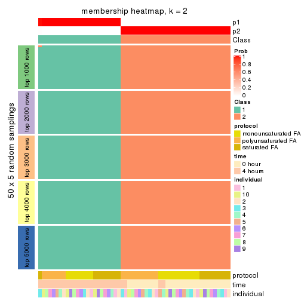</p>

</div>
<div id='tab-MAD-mclust-membership-heatmap-2'>
<pre><code class="r">membership_heatmap(res, k = 3)
</code></pre>

<p>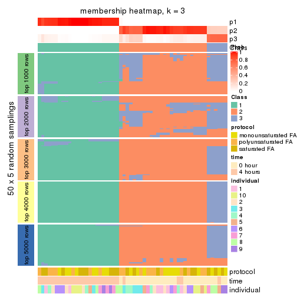</p>

</div>
<div id='tab-MAD-mclust-membership-heatmap-3'>
<pre><code class="r">membership_heatmap(res, k = 4)
</code></pre>

<p>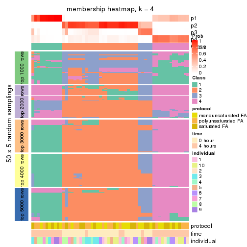</p>

</div>
<div id='tab-MAD-mclust-membership-heatmap-4'>
<pre><code class="r">membership_heatmap(res, k = 5)
</code></pre>

<p>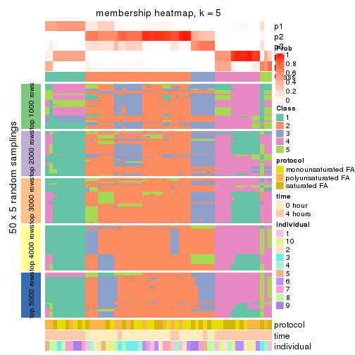</p>

</div>
<div id='tab-MAD-mclust-membership-heatmap-5'>
<pre><code class="r">membership_heatmap(res, k = 6)
</code></pre>

<p>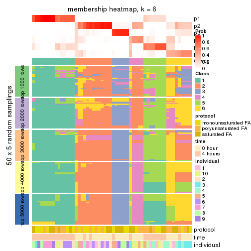</p>

</div>
</div>

As soon as we have had the classes for columns, we can look for signatures
which are significantly different between classes which can be candidate marks
for certain classes. Following are the heatmaps for signatures.


Signature heatmaps where rows are scaled:


<script>
$( function() {
	$( '#tabs-MAD-mclust-get-signatures' ).tabs();
} );
</script>
<div id='tabs-MAD-mclust-get-signatures'>
<ul>
<li><a href='#tab-MAD-mclust-get-signatures-1'>k = 2</a></li>
<li><a href='#tab-MAD-mclust-get-signatures-2'>k = 3</a></li>
<li><a href='#tab-MAD-mclust-get-signatures-3'>k = 4</a></li>
<li><a href='#tab-MAD-mclust-get-signatures-4'>k = 5</a></li>
<li><a href='#tab-MAD-mclust-get-signatures-5'>k = 6</a></li>
</ul>
<div id='tab-MAD-mclust-get-signatures-1'>
<pre><code class="r">get_signatures(res, k = 2)
</code></pre>

<p>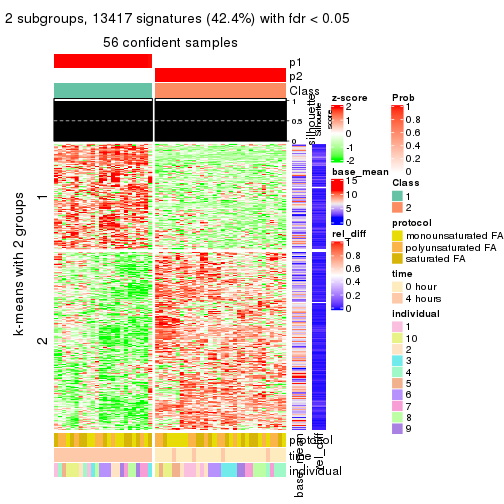</p>

</div>
<div id='tab-MAD-mclust-get-signatures-2'>
<pre><code class="r">get_signatures(res, k = 3)
</code></pre>

<p>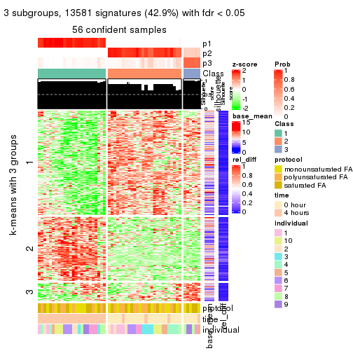</p>

</div>
<div id='tab-MAD-mclust-get-signatures-3'>
<pre><code class="r">get_signatures(res, k = 4)
</code></pre>

<p>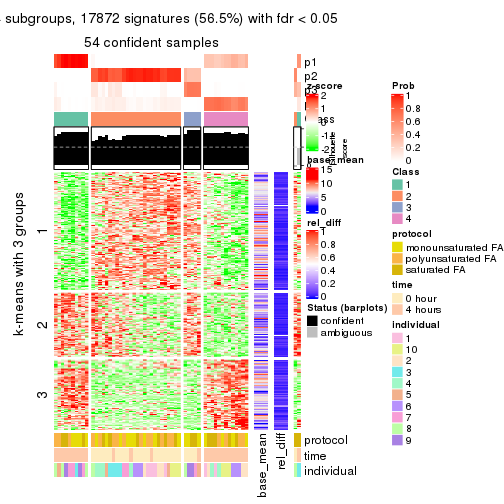</p>

</div>
<div id='tab-MAD-mclust-get-signatures-4'>
<pre><code class="r">get_signatures(res, k = 5)
</code></pre>

<p>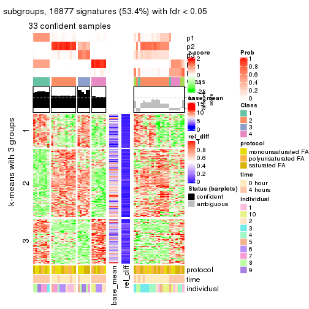</p>

</div>
<div id='tab-MAD-mclust-get-signatures-5'>
<pre><code class="r">get_signatures(res, k = 6)
</code></pre>

<p>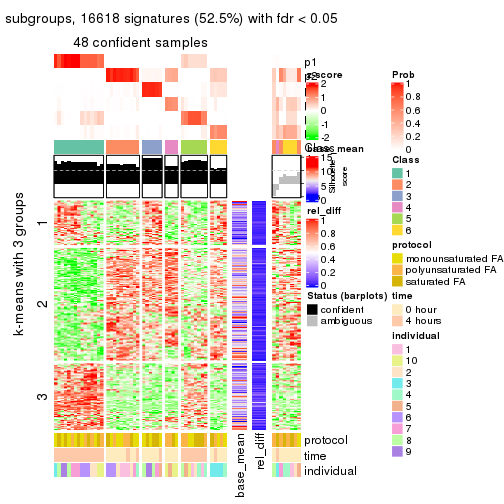</p>

</div>
</div>


Signature heatmaps where rows are not scaled:


<script>
$( function() {
	$( '#tabs-MAD-mclust-get-signatures-no-scale' ).tabs();
} );
</script>
<div id='tabs-MAD-mclust-get-signatures-no-scale'>
<ul>
<li><a href='#tab-MAD-mclust-get-signatures-no-scale-1'>k = 2</a></li>
<li><a href='#tab-MAD-mclust-get-signatures-no-scale-2'>k = 3</a></li>
<li><a href='#tab-MAD-mclust-get-signatures-no-scale-3'>k = 4</a></li>
<li><a href='#tab-MAD-mclust-get-signatures-no-scale-4'>k = 5</a></li>
<li><a href='#tab-MAD-mclust-get-signatures-no-scale-5'>k = 6</a></li>
</ul>
<div id='tab-MAD-mclust-get-signatures-no-scale-1'>
<pre><code class="r">get_signatures(res, k = 2, scale_rows = FALSE)
</code></pre>

<p>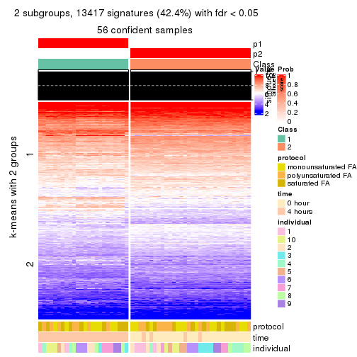</p>

</div>
<div id='tab-MAD-mclust-get-signatures-no-scale-2'>
<pre><code class="r">get_signatures(res, k = 3, scale_rows = FALSE)
</code></pre>

<p>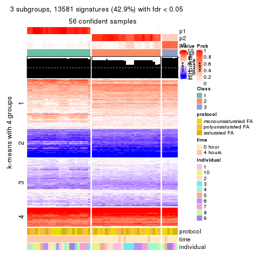</p>

</div>
<div id='tab-MAD-mclust-get-signatures-no-scale-3'>
<pre><code class="r">get_signatures(res, k = 4, scale_rows = FALSE)
</code></pre>

<p>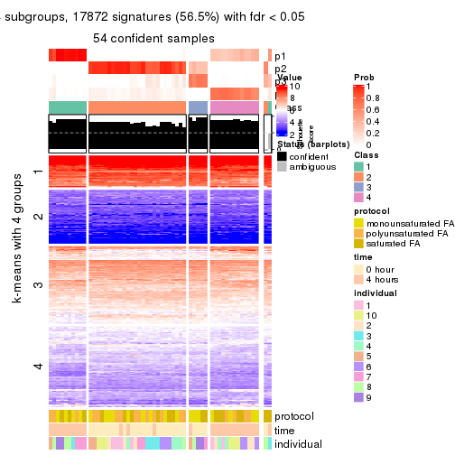</p>

</div>
<div id='tab-MAD-mclust-get-signatures-no-scale-4'>
<pre><code class="r">get_signatures(res, k = 5, scale_rows = FALSE)
</code></pre>

<p>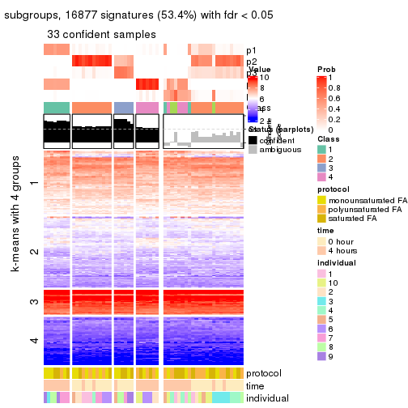</p>

</div>
<div id='tab-MAD-mclust-get-signatures-no-scale-5'>
<pre><code class="r">get_signatures(res, k = 6, scale_rows = FALSE)
</code></pre>

<p>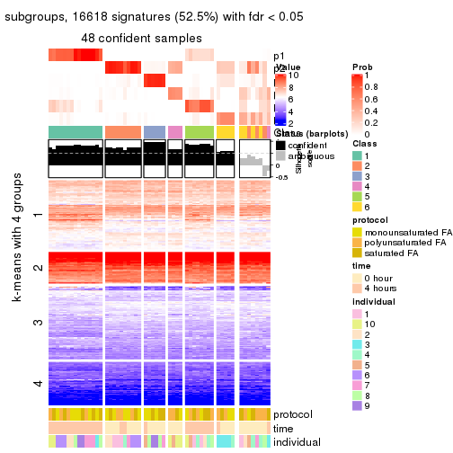</p>

</div>
</div>


Compare the overlap of signatures from different k:

```r
compare_signatures(res)
```

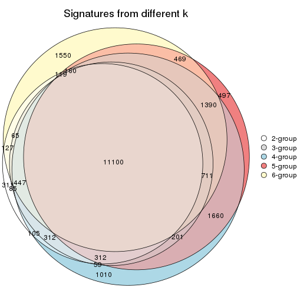

`get_signature()` returns a data frame invisibly. TO get the list of signatures, the function
call should be assigned to a variable explicitly. In following code, if `plot` argument is set
to `FALSE`, no heatmap is plotted while only the differential analysis is performed.

```r
# code only for demonstration
tb = get_signature(res, k = ..., plot = FALSE)
```

An example of the output of `tb` is:

```
#>   which_row         fdr    mean_1    mean_2 scaled_mean_1 scaled_mean_2 km
#> 1        38 0.042760348  8.373488  9.131774    -0.5533452     0.5164555  1
#> 2        40 0.018707592  7.106213  8.469186    -0.6173731     0.5762149  1
#> 3        55 0.019134737 10.221463 11.207825    -0.6159697     0.5749050  1
#> 4        59 0.006059896  5.921854  7.869574    -0.6899429     0.6439467  1
#> 5        60 0.018055526  8.928898 10.211722    -0.6204761     0.5791110  1
#> 6        98 0.009384629 15.714769 14.887706     0.6635654    -0.6193277  2
...
```

The columns in `tb` are:

1. `which_row`: row indices corresponding to the input matrix.
2. `fdr`: FDR for the differential test. 
3. `mean_x`: The mean value in group x.
4. `scaled_mean_x`: The mean value in group x after rows are scaled.
5. `km`: Row groups if k-means clustering is applied to rows.


UMAP plot which shows how samples are separated.


<script>
$( function() {
	$( '#tabs-MAD-mclust-dimension-reduction' ).tabs();
} );
</script>
<div id='tabs-MAD-mclust-dimension-reduction'>
<ul>
<li><a href='#tab-MAD-mclust-dimension-reduction-1'>k = 2</a></li>
<li><a href='#tab-MAD-mclust-dimension-reduction-2'>k = 3</a></li>
<li><a href='#tab-MAD-mclust-dimension-reduction-3'>k = 4</a></li>
<li><a href='#tab-MAD-mclust-dimension-reduction-4'>k = 5</a></li>
<li><a href='#tab-MAD-mclust-dimension-reduction-5'>k = 6</a></li>
</ul>
<div id='tab-MAD-mclust-dimension-reduction-1'>
<pre><code class="r">dimension_reduction(res, k = 2, method = &quot;UMAP&quot;)
</code></pre>

<p>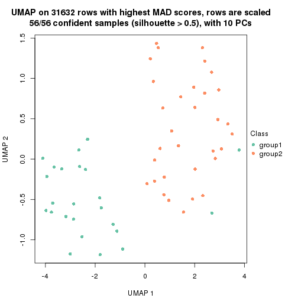</p>

</div>
<div id='tab-MAD-mclust-dimension-reduction-2'>
<pre><code class="r">dimension_reduction(res, k = 3, method = &quot;UMAP&quot;)
</code></pre>

<p>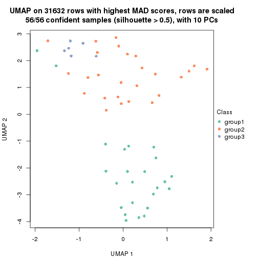</p>

</div>
<div id='tab-MAD-mclust-dimension-reduction-3'>
<pre><code class="r">dimension_reduction(res, k = 4, method = &quot;UMAP&quot;)
</code></pre>

<p>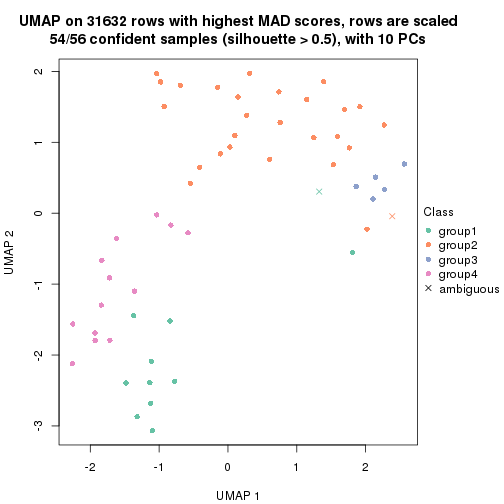</p>

</div>
<div id='tab-MAD-mclust-dimension-reduction-4'>
<pre><code class="r">dimension_reduction(res, k = 5, method = &quot;UMAP&quot;)
</code></pre>

<p>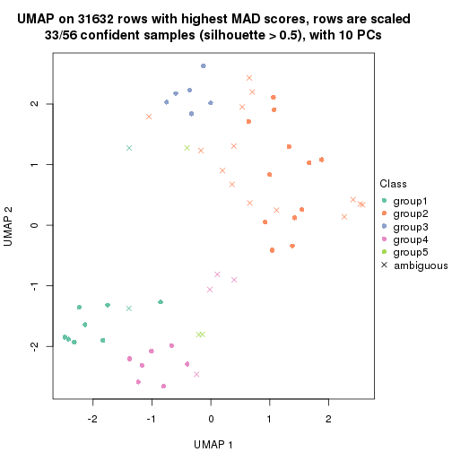</p>

</div>
<div id='tab-MAD-mclust-dimension-reduction-5'>
<pre><code class="r">dimension_reduction(res, k = 6, method = &quot;UMAP&quot;)
</code></pre>

<p>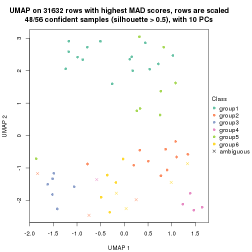</p>

</div>
</div>


Following heatmap shows how subgroups are split when increasing `k`:

```r
collect_classes(res)
```

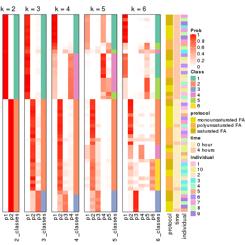


Test correlation between subgroups and known annotations. If the known
annotation is numeric, one-way ANOVA test is applied, and if the known
annotation is discrete, chi-squared contingency table test is applied.

```r
test_to_known_factors(res)
```

```
#>             n protocol(p)  time(p) individual(p) k
#> MAD:mclust 56       0.757 5.27e-10      0.993010 2
#> MAD:mclust 56       0.320 7.39e-10      0.367616 3
#> MAD:mclust 54       0.654 9.74e-09      0.019310 4
#> MAD:mclust 33       0.478 4.20e-05      0.029183 5
#> MAD:mclust 48       0.870 1.60e-06      0.000257 6
```


If matrix rows can be associated to genes, consider to use `functional_enrichment(res,
...)` to perform function enrichment for the signature genes. See [this vignette](http://bioconductor.org/packages/devel/bioc/vignettes/cola/inst/doc/functional_enrichment.html) for more detailed explanations.


 

---------------------------------------------------


### MAD:NMF**


The object with results only for a single top-value method and a single partition method 
can be extracted as:

```r
res = res_list["MAD", "NMF"]
# you can also extract it by
# res = res_list["MAD:NMF"]
```

A summary of `res` and all the functions that can be applied to it:

```r
res
```

```
#> A 'ConsensusPartition' object with k = 2, 3, 4, 5, 6.
#>   On a matrix with 31632 rows and 56 columns.
#>   Top rows (1000, 2000, 3000, 4000, 5000) are extracted by 'MAD' method.
#>   Subgroups are detected by 'NMF' method.
#>   Performed in total 1250 partitions by row resampling.
#>   Best k for subgroups seems to be 2.
#> 
#> Following methods can be applied to this 'ConsensusPartition' object:
#>  [1] "cola_report"             "collect_classes"         "collect_plots"          
#>  [4] "collect_stats"           "colnames"                "compare_signatures"     
#>  [7] "consensus_heatmap"       "dimension_reduction"     "functional_enrichment"  
#> [10] "get_anno_col"            "get_anno"                "get_classes"            
#> [13] "get_consensus"           "get_matrix"              "get_membership"         
#> [16] "get_param"               "get_signatures"          "get_stats"              
#> [19] "is_best_k"               "is_stable_k"             "membership_heatmap"     
#> [22] "ncol"                    "nrow"                    "plot_ecdf"              
#> [25] "rownames"                "select_partition_number" "show"                   
#> [28] "suggest_best_k"          "test_to_known_factors"
```

`collect_plots()` function collects all the plots made from `res` for all `k` (number of partitions)
into one single page to provide an easy and fast comparison between different `k`.

```r
collect_plots(res)
```

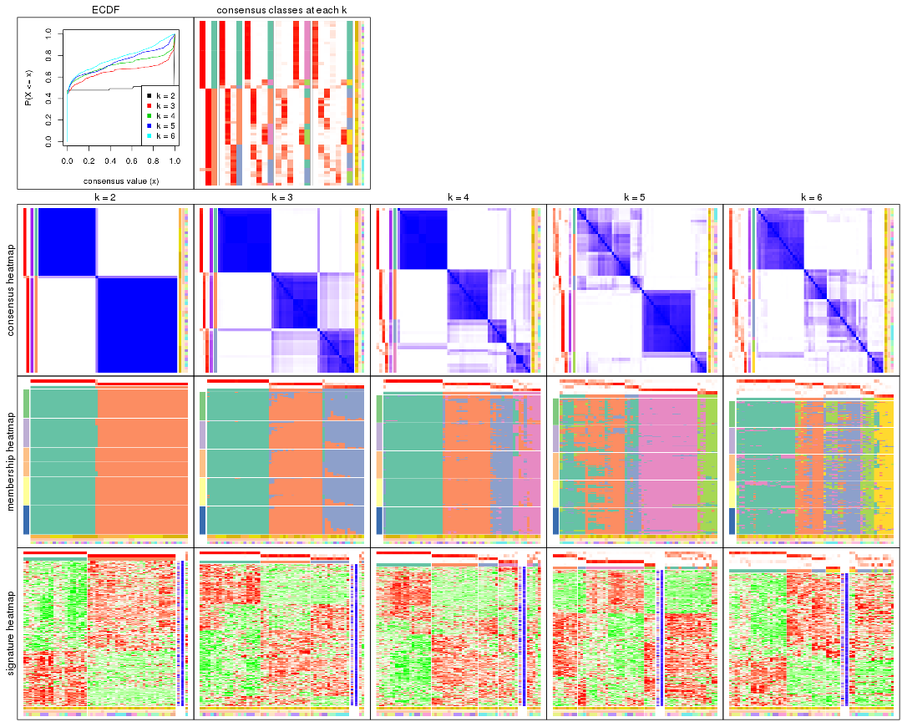

The plots are:

- The first row: a plot of the ECDF (empirical cumulative distribution
  function) curves of the consensus matrix for each `k` and the heatmap of
  predicted classes for each `k`.
- The second row: heatmaps of the consensus matrix for each `k`.
- The third row: heatmaps of the membership matrix for each `k`.
- The fouth row: heatmaps of the signatures for each `k`.

All the plots in panels can be made by individual functions and they are
plotted later in this section.

`select_partition_number()` produces several plots showing different
statistics for choosing "optimized" `k`. There are following statistics:

- ECDF curves of the consensus matrix for each `k`;
- 1-PAC. [The PAC
  score](https://en.wikipedia.org/wiki/Consensus_clustering#Over-interpretation_potential_of_consensus_clustering)
  measures the proportion of the ambiguous subgrouping.
- Mean silhouette score.
- Concordance. The mean probability of fiting the consensus class ids in all
  partitions.
- Area increased. Denote $A_k$ as the area under the ECDF curve for current
  `k`, the area increased is defined as $A_k - A_{k-1}$.
- Rand index. The percent of pairs of samples that are both in a same cluster
  or both are not in a same cluster in the partition of k and k-1.
- Jaccard index. The ratio of pairs of samples are both in a same cluster in
  the partition of k and k-1 and the pairs of samples are both in a same
  cluster in the partition k or k-1.

The detailed explanations of these statistics can be found in [the _cola_
vignette](http://bioconductor.org/packages/devel/bioc/vignettes/cola/inst/doc/cola.html#toc_13).

Generally speaking, lower PAC score, higher mean silhouette score or higher
concordance corresponds to better partition. Rand index and Jaccard index
measure how similar the current partition is compared to partition with `k-1`.
If they are too similar, we won't accept `k` is better than `k-1`.

```r
select_partition_number(res)
```

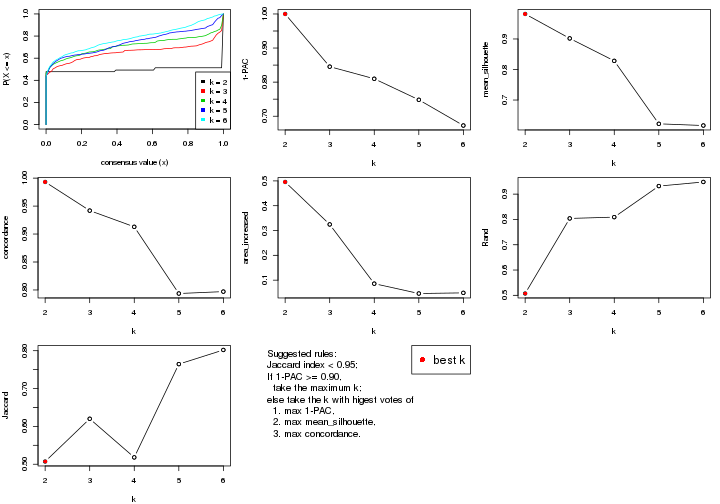

The numeric values for all these statistics can be obtained by `get_stats()`.

```r
get_stats(res)
```

```
#>   k 1-PAC mean_silhouette concordance area_increased  Rand Jaccard
#> 2 2 1.000           0.982       0.993         0.4956 0.507   0.507
#> 3 3 0.845           0.902       0.942         0.3245 0.804   0.620
#> 4 4 0.810           0.828       0.913         0.0859 0.809   0.518
#> 5 5 0.748           0.622       0.794         0.0462 0.932   0.765
#> 6 6 0.673           0.616       0.797         0.0488 0.948   0.802
```

`suggest_best_k()` suggests the best $k$ based on these statistics. The rules are as follows:

- All $k$ with Jaccard index larger than 0.95 are removed because increasing
  $k$ does not provide enough extra information. If all $k$ are removed, it is
  marked as no subgroup is detected.
- For all $k$ with 1-PAC score larger than 0.9, the maximal $k$ is taken as
  the best $k$, and other $k$ are marked as optional $k$.
- If it does not fit the second rule. The $k$ with the maximal vote of the
  highest 1-PAC score, highest mean silhouette, and highest concordance is
  taken as the best $k$.

```r
suggest_best_k(res)
```

```
#> [1] 2
```


Following shows the table of the partitions (You need to click the **show/hide
code output** link to see it). The membership matrix (columns with name `p*`)
is inferred by
[`clue::cl_consensus()`](https://www.rdocumentation.org/link/cl_consensus?package=clue)
function with the `SE` method. Basically the value in the membership matrix
represents the probability to belong to a certain group. The finall class
label for an item is determined with the group with highest probability it
belongs to.

In `get_classes()` function, the entropy is calculated from the membership
matrix and the silhouette score is calculated from the consensus matrix.


<script>
$( function() {
	$( '#tabs-MAD-NMF-get-classes' ).tabs();
} );
</script>
<div id='tabs-MAD-NMF-get-classes'>
<ul>
<li><a href='#tab-MAD-NMF-get-classes-1'>k = 2</a></li>
<li><a href='#tab-MAD-NMF-get-classes-2'>k = 3</a></li>
<li><a href='#tab-MAD-NMF-get-classes-3'>k = 4</a></li>
<li><a href='#tab-MAD-NMF-get-classes-4'>k = 5</a></li>
<li><a href='#tab-MAD-NMF-get-classes-5'>k = 6</a></li>
</ul>

<div id='tab-MAD-NMF-get-classes-1'>
<p><a id='tab-MAD-NMF-get-classes-1-a' style='color:#0366d6' href='#'>show/hide code output</a></p>
<pre><code class="r">cbind(get_classes(res, k = 2), get_membership(res, k = 2))
</code></pre>

<pre><code>#&gt;           class entropy silhouette    p1    p2
#&gt; GSM790742     2   0.000      0.988 0.000 1.000
#&gt; GSM790744     2   0.000      0.988 0.000 1.000
#&gt; GSM790754     2   0.000      0.988 0.000 1.000
#&gt; GSM790756     2   0.000      0.988 0.000 1.000
#&gt; GSM790768     2   0.000      0.988 0.000 1.000
#&gt; GSM790774     2   0.000      0.988 0.000 1.000
#&gt; GSM790778     2   0.000      0.988 0.000 1.000
#&gt; GSM790784     2   0.000      0.988 0.000 1.000
#&gt; GSM790790     2   0.000      0.988 0.000 1.000
#&gt; GSM790743     1   0.000      1.000 1.000 0.000
#&gt; GSM790745     1   0.000      1.000 1.000 0.000
#&gt; GSM790755     2   0.961      0.377 0.384 0.616
#&gt; GSM790757     1   0.000      1.000 1.000 0.000
#&gt; GSM790769     1   0.000      1.000 1.000 0.000
#&gt; GSM790775     1   0.000      1.000 1.000 0.000
#&gt; GSM790779     1   0.000      1.000 1.000 0.000
#&gt; GSM790785     1   0.000      1.000 1.000 0.000
#&gt; GSM790791     1   0.000      1.000 1.000 0.000
#&gt; GSM790738     2   0.000      0.988 0.000 1.000
#&gt; GSM790746     2   0.000      0.988 0.000 1.000
#&gt; GSM790752     2   0.000      0.988 0.000 1.000
#&gt; GSM790758     2   0.000      0.988 0.000 1.000
#&gt; GSM790764     2   0.000      0.988 0.000 1.000
#&gt; GSM790766     2   0.000      0.988 0.000 1.000
#&gt; GSM790772     2   0.000      0.988 0.000 1.000
#&gt; GSM790782     2   0.000      0.988 0.000 1.000
#&gt; GSM790786     2   0.000      0.988 0.000 1.000
#&gt; GSM790792     2   0.000      0.988 0.000 1.000
#&gt; GSM790739     1   0.000      1.000 1.000 0.000
#&gt; GSM790747     1   0.000      1.000 1.000 0.000
#&gt; GSM790753     1   0.000      1.000 1.000 0.000
#&gt; GSM790759     2   0.000      0.988 0.000 1.000
#&gt; GSM790765     2   0.000      0.988 0.000 1.000
#&gt; GSM790767     1   0.000      1.000 1.000 0.000
#&gt; GSM790773     1   0.000      1.000 1.000 0.000
#&gt; GSM790783     1   0.000      1.000 1.000 0.000
#&gt; GSM790787     1   0.000      1.000 1.000 0.000
#&gt; GSM790793     1   0.000      1.000 1.000 0.000
#&gt; GSM790740     2   0.000      0.988 0.000 1.000
#&gt; GSM790748     2   0.000      0.988 0.000 1.000
#&gt; GSM790750     2   0.000      0.988 0.000 1.000
#&gt; GSM790760     2   0.000      0.988 0.000 1.000
#&gt; GSM790762     2   0.000      0.988 0.000 1.000
#&gt; GSM790770     2   0.000      0.988 0.000 1.000
#&gt; GSM790776     2   0.000      0.988 0.000 1.000
#&gt; GSM790780     2   0.000      0.988 0.000 1.000
#&gt; GSM790788     2   0.000      0.988 0.000 1.000
#&gt; GSM790741     2   0.000      0.988 0.000 1.000
#&gt; GSM790749     1   0.000      1.000 1.000 0.000
#&gt; GSM790751     2   0.000      0.988 0.000 1.000
#&gt; GSM790761     1   0.000      1.000 1.000 0.000
#&gt; GSM790763     1   0.000      1.000 1.000 0.000
#&gt; GSM790771     1   0.000      1.000 1.000 0.000
#&gt; GSM790777     1   0.000      1.000 1.000 0.000
#&gt; GSM790781     1   0.000      1.000 1.000 0.000
#&gt; GSM790789     1   0.000      1.000 1.000 0.000
</code></pre>

<script>
$('#tab-MAD-NMF-get-classes-1-a').parent().next().next().hide();
$('#tab-MAD-NMF-get-classes-1-a').click(function(){
  $('#tab-MAD-NMF-get-classes-1-a').parent().next().next().toggle();
  return(false);
});
</script>
</div>

<div id='tab-MAD-NMF-get-classes-2'>
<p><a id='tab-MAD-NMF-get-classes-2-a' style='color:#0366d6' href='#'>show/hide code output</a></p>
<pre><code class="r">cbind(get_classes(res, k = 3), get_membership(res, k = 3))
</code></pre>

<pre><code>#&gt;           class entropy silhouette    p1    p2    p3
#&gt; GSM790742     2  0.0424      0.937 0.000 0.992 0.008
#&gt; GSM790744     2  0.1753      0.932 0.000 0.952 0.048
#&gt; GSM790754     3  0.1964      0.854 0.000 0.056 0.944
#&gt; GSM790756     3  0.5138      0.753 0.000 0.252 0.748
#&gt; GSM790768     2  0.0424      0.941 0.000 0.992 0.008
#&gt; GSM790774     3  0.4121      0.836 0.000 0.168 0.832
#&gt; GSM790778     3  0.1643      0.850 0.000 0.044 0.956
#&gt; GSM790784     3  0.3752      0.849 0.000 0.144 0.856
#&gt; GSM790790     2  0.0237      0.942 0.000 0.996 0.004
#&gt; GSM790743     1  0.1015      0.980 0.980 0.012 0.008
#&gt; GSM790745     1  0.0237      0.993 0.996 0.000 0.004
#&gt; GSM790755     3  0.1525      0.813 0.032 0.004 0.964
#&gt; GSM790757     1  0.0000      0.995 1.000 0.000 0.000
#&gt; GSM790769     1  0.0000      0.995 1.000 0.000 0.000
#&gt; GSM790775     1  0.0237      0.995 0.996 0.000 0.004
#&gt; GSM790779     1  0.0237      0.995 0.996 0.000 0.004
#&gt; GSM790785     1  0.0237      0.995 0.996 0.000 0.004
#&gt; GSM790791     1  0.0000      0.995 1.000 0.000 0.000
#&gt; GSM790738     2  0.0000      0.941 0.000 1.000 0.000
#&gt; GSM790746     2  0.0000      0.941 0.000 1.000 0.000
#&gt; GSM790752     3  0.3816      0.847 0.000 0.148 0.852
#&gt; GSM790758     3  0.1163      0.843 0.000 0.028 0.972
#&gt; GSM790764     2  0.1964      0.926 0.000 0.944 0.056
#&gt; GSM790766     2  0.1753      0.932 0.000 0.952 0.048
#&gt; GSM790772     2  0.5835      0.435 0.000 0.660 0.340
#&gt; GSM790782     3  0.5291      0.728 0.000 0.268 0.732
#&gt; GSM790786     3  0.4002      0.841 0.000 0.160 0.840
#&gt; GSM790792     2  0.0000      0.941 0.000 1.000 0.000
#&gt; GSM790739     1  0.0000      0.995 1.000 0.000 0.000
#&gt; GSM790747     1  0.0000      0.995 1.000 0.000 0.000
#&gt; GSM790753     1  0.0237      0.995 0.996 0.000 0.004
#&gt; GSM790759     2  0.0000      0.941 0.000 1.000 0.000
#&gt; GSM790765     3  0.2165      0.855 0.000 0.064 0.936
#&gt; GSM790767     1  0.0000      0.995 1.000 0.000 0.000
#&gt; GSM790773     1  0.0237      0.995 0.996 0.000 0.004
#&gt; GSM790783     1  0.0237      0.995 0.996 0.000 0.004
#&gt; GSM790787     1  0.0237      0.995 0.996 0.000 0.004
#&gt; GSM790793     1  0.0000      0.995 1.000 0.000 0.000
#&gt; GSM790740     2  0.2165      0.922 0.000 0.936 0.064
#&gt; GSM790748     2  0.0424      0.937 0.000 0.992 0.008
#&gt; GSM790750     3  0.3038      0.856 0.000 0.104 0.896
#&gt; GSM790760     2  0.3752      0.825 0.000 0.856 0.144
#&gt; GSM790762     2  0.1753      0.932 0.000 0.952 0.048
#&gt; GSM790770     2  0.0237      0.939 0.000 0.996 0.004
#&gt; GSM790776     2  0.1289      0.937 0.000 0.968 0.032
#&gt; GSM790780     3  0.0892      0.838 0.000 0.020 0.980
#&gt; GSM790788     2  0.0237      0.939 0.000 0.996 0.004
#&gt; GSM790741     2  0.3038      0.884 0.000 0.896 0.104
#&gt; GSM790749     1  0.0000      0.995 1.000 0.000 0.000
#&gt; GSM790751     3  0.5529      0.666 0.000 0.296 0.704
#&gt; GSM790761     1  0.1950      0.952 0.952 0.040 0.008
#&gt; GSM790763     1  0.0237      0.995 0.996 0.000 0.004
#&gt; GSM790771     1  0.0000      0.995 1.000 0.000 0.000
#&gt; GSM790777     1  0.0237      0.995 0.996 0.000 0.004
#&gt; GSM790781     3  0.6244      0.116 0.440 0.000 0.560
#&gt; GSM790789     1  0.0000      0.995 1.000 0.000 0.000
</code></pre>

<script>
$('#tab-MAD-NMF-get-classes-2-a').parent().next().next().hide();
$('#tab-MAD-NMF-get-classes-2-a').click(function(){
  $('#tab-MAD-NMF-get-classes-2-a').parent().next().next().toggle();
  return(false);
});
</script>
</div>

<div id='tab-MAD-NMF-get-classes-3'>
<p><a id='tab-MAD-NMF-get-classes-3-a' style='color:#0366d6' href='#'>show/hide code output</a></p>
<pre><code class="r">cbind(get_classes(res, k = 4), get_membership(res, k = 4))
</code></pre>

<pre><code>#&gt;           class entropy silhouette    p1    p2    p3    p4
#&gt; GSM790742     4  0.0817      0.692 0.000 0.024 0.000 0.976
#&gt; GSM790744     2  0.0188      0.932 0.000 0.996 0.004 0.000
#&gt; GSM790754     3  0.1474      0.819 0.000 0.052 0.948 0.000
#&gt; GSM790756     3  0.4483      0.656 0.000 0.284 0.712 0.004
#&gt; GSM790768     2  0.0376      0.930 0.000 0.992 0.004 0.004
#&gt; GSM790774     2  0.2281      0.888 0.000 0.904 0.096 0.000
#&gt; GSM790778     3  0.4843      0.418 0.000 0.396 0.604 0.000
#&gt; GSM790784     2  0.2714      0.868 0.000 0.884 0.112 0.004
#&gt; GSM790790     2  0.0000      0.931 0.000 1.000 0.000 0.000
#&gt; GSM790743     4  0.3710      0.592 0.192 0.000 0.004 0.804
#&gt; GSM790745     1  0.0188      0.975 0.996 0.000 0.000 0.004
#&gt; GSM790755     3  0.1520      0.767 0.020 0.000 0.956 0.024
#&gt; GSM790757     1  0.0672      0.967 0.984 0.000 0.008 0.008
#&gt; GSM790769     1  0.0000      0.976 1.000 0.000 0.000 0.000
#&gt; GSM790775     1  0.0188      0.975 0.996 0.000 0.000 0.004
#&gt; GSM790779     1  0.0592      0.968 0.984 0.000 0.016 0.000
#&gt; GSM790785     1  0.0000      0.976 1.000 0.000 0.000 0.000
#&gt; GSM790791     1  0.0188      0.975 0.996 0.000 0.000 0.004
#&gt; GSM790738     2  0.2124      0.889 0.000 0.924 0.008 0.068
#&gt; GSM790746     4  0.5288      0.232 0.000 0.472 0.008 0.520
#&gt; GSM790752     3  0.4953      0.744 0.000 0.120 0.776 0.104
#&gt; GSM790758     3  0.0921      0.811 0.000 0.028 0.972 0.000
#&gt; GSM790764     4  0.4295      0.617 0.000 0.240 0.008 0.752
#&gt; GSM790766     2  0.0469      0.932 0.000 0.988 0.012 0.000
#&gt; GSM790772     2  0.1022      0.927 0.000 0.968 0.032 0.000
#&gt; GSM790782     2  0.2149      0.895 0.000 0.912 0.088 0.000
#&gt; GSM790786     2  0.2053      0.904 0.000 0.924 0.072 0.004
#&gt; GSM790792     2  0.0469      0.926 0.000 0.988 0.000 0.012
#&gt; GSM790739     1  0.0000      0.976 1.000 0.000 0.000 0.000
#&gt; GSM790747     1  0.0000      0.976 1.000 0.000 0.000 0.000
#&gt; GSM790753     1  0.0188      0.976 0.996 0.000 0.004 0.000
#&gt; GSM790759     4  0.4304      0.610 0.000 0.284 0.000 0.716
#&gt; GSM790765     2  0.4655      0.525 0.000 0.684 0.312 0.004
#&gt; GSM790767     1  0.0000      0.976 1.000 0.000 0.000 0.000
#&gt; GSM790773     1  0.0000      0.976 1.000 0.000 0.000 0.000
#&gt; GSM790783     1  0.0188      0.976 0.996 0.000 0.004 0.000
#&gt; GSM790787     1  0.0188      0.976 0.996 0.000 0.004 0.000
#&gt; GSM790793     1  0.0000      0.976 1.000 0.000 0.000 0.000
#&gt; GSM790740     2  0.1510      0.923 0.000 0.956 0.016 0.028
#&gt; GSM790748     4  0.0817      0.692 0.000 0.024 0.000 0.976
#&gt; GSM790750     3  0.3301      0.805 0.000 0.076 0.876 0.048
#&gt; GSM790760     4  0.1004      0.692 0.000 0.024 0.004 0.972
#&gt; GSM790762     2  0.0524      0.930 0.000 0.988 0.004 0.008
#&gt; GSM790770     2  0.1557      0.900 0.000 0.944 0.000 0.056
#&gt; GSM790776     4  0.3402      0.682 0.000 0.164 0.004 0.832
#&gt; GSM790780     3  0.1118      0.815 0.000 0.036 0.964 0.000
#&gt; GSM790788     2  0.0524      0.929 0.000 0.988 0.008 0.004
#&gt; GSM790741     2  0.0927      0.931 0.000 0.976 0.016 0.008
#&gt; GSM790749     1  0.0188      0.976 0.996 0.000 0.004 0.000
#&gt; GSM790751     4  0.6337      0.255 0.000 0.072 0.360 0.568
#&gt; GSM790761     4  0.4746      0.406 0.368 0.000 0.000 0.632
#&gt; GSM790763     1  0.0188      0.976 0.996 0.000 0.004 0.000
#&gt; GSM790771     1  0.0000      0.976 1.000 0.000 0.000 0.000
#&gt; GSM790777     1  0.0336      0.974 0.992 0.000 0.008 0.000
#&gt; GSM790781     1  0.4936      0.415 0.624 0.000 0.372 0.004
#&gt; GSM790789     1  0.0000      0.976 1.000 0.000 0.000 0.000
</code></pre>

<script>
$('#tab-MAD-NMF-get-classes-3-a').parent().next().next().hide();
$('#tab-MAD-NMF-get-classes-3-a').click(function(){
  $('#tab-MAD-NMF-get-classes-3-a').parent().next().next().toggle();
  return(false);
});
</script>
</div>

<div id='tab-MAD-NMF-get-classes-4'>
<p><a id='tab-MAD-NMF-get-classes-4-a' style='color:#0366d6' href='#'>show/hide code output</a></p>
<pre><code class="r">cbind(get_classes(res, k = 5), get_membership(res, k = 5))
</code></pre>

<pre><code>#&gt;           class entropy silhouette    p1    p2    p3    p4    p5
#&gt; GSM790742     5  0.1792    0.66012 0.084 0.000 0.000 0.000 0.916
#&gt; GSM790744     2  0.4390    0.22199 0.428 0.568 0.004 0.000 0.000
#&gt; GSM790754     1  0.5161    0.10555 0.516 0.040 0.444 0.000 0.000
#&gt; GSM790756     3  0.6230   -0.00875 0.372 0.060 0.528 0.000 0.040
#&gt; GSM790768     2  0.3635    0.57998 0.248 0.748 0.004 0.000 0.000
#&gt; GSM790774     2  0.5252    0.49472 0.292 0.632 0.076 0.000 0.000
#&gt; GSM790778     3  0.5159    0.44192 0.144 0.164 0.692 0.000 0.000
#&gt; GSM790784     2  0.4676    0.57266 0.072 0.720 0.208 0.000 0.000
#&gt; GSM790790     2  0.0727    0.66182 0.012 0.980 0.004 0.000 0.004
#&gt; GSM790743     5  0.4735    0.19049 0.016 0.000 0.000 0.460 0.524
#&gt; GSM790745     4  0.1732    0.91996 0.080 0.000 0.000 0.920 0.000
#&gt; GSM790755     3  0.4402    0.54048 0.292 0.000 0.688 0.008 0.012
#&gt; GSM790757     4  0.1732    0.92437 0.080 0.000 0.000 0.920 0.000
#&gt; GSM790769     4  0.0451    0.94908 0.008 0.000 0.000 0.988 0.004
#&gt; GSM790775     4  0.0880    0.94820 0.032 0.000 0.000 0.968 0.000
#&gt; GSM790779     4  0.1124    0.94833 0.036 0.000 0.004 0.960 0.000
#&gt; GSM790785     4  0.0794    0.94837 0.028 0.000 0.000 0.972 0.000
#&gt; GSM790791     4  0.0671    0.94906 0.016 0.000 0.000 0.980 0.004
#&gt; GSM790738     1  0.5059    0.21113 0.548 0.416 0.000 0.000 0.036
#&gt; GSM790746     1  0.5365    0.43419 0.628 0.284 0.000 0.000 0.088
#&gt; GSM790752     1  0.5126    0.15858 0.536 0.024 0.432 0.000 0.008
#&gt; GSM790758     3  0.1369    0.64560 0.028 0.008 0.956 0.000 0.008
#&gt; GSM790764     5  0.4916    0.43690 0.012 0.288 0.032 0.000 0.668
#&gt; GSM790766     2  0.4264    0.35027 0.376 0.620 0.004 0.000 0.000
#&gt; GSM790772     2  0.4404    0.52866 0.292 0.684 0.024 0.000 0.000
#&gt; GSM790782     2  0.5663    0.29592 0.364 0.548 0.088 0.000 0.000
#&gt; GSM790786     2  0.3267    0.65572 0.112 0.844 0.044 0.000 0.000
#&gt; GSM790792     2  0.0451    0.66547 0.008 0.988 0.000 0.000 0.004
#&gt; GSM790739     4  0.1410    0.93202 0.060 0.000 0.000 0.940 0.000
#&gt; GSM790747     4  0.0451    0.94908 0.008 0.000 0.000 0.988 0.004
#&gt; GSM790753     4  0.0703    0.94884 0.024 0.000 0.000 0.976 0.000
#&gt; GSM790759     1  0.5742    0.23628 0.508 0.088 0.000 0.000 0.404
#&gt; GSM790765     2  0.4701    0.21635 0.016 0.612 0.368 0.000 0.004
#&gt; GSM790767     4  0.0609    0.94978 0.020 0.000 0.000 0.980 0.000
#&gt; GSM790773     4  0.0880    0.94867 0.032 0.000 0.000 0.968 0.000
#&gt; GSM790783     4  0.0771    0.94889 0.020 0.000 0.000 0.976 0.004
#&gt; GSM790787     4  0.0609    0.94995 0.020 0.000 0.000 0.980 0.000
#&gt; GSM790793     4  0.2522    0.87739 0.024 0.076 0.000 0.896 0.004
#&gt; GSM790740     1  0.4893    0.26330 0.568 0.404 0.000 0.000 0.028
#&gt; GSM790748     5  0.1792    0.65933 0.084 0.000 0.000 0.000 0.916
#&gt; GSM790750     1  0.5043    0.17804 0.552 0.016 0.420 0.000 0.012
#&gt; GSM790760     5  0.1282    0.66286 0.044 0.000 0.004 0.000 0.952
#&gt; GSM790762     2  0.0290    0.66851 0.008 0.992 0.000 0.000 0.000
#&gt; GSM790770     2  0.1710    0.63505 0.016 0.940 0.004 0.000 0.040
#&gt; GSM790776     5  0.2857    0.63667 0.028 0.064 0.020 0.000 0.888
#&gt; GSM790780     3  0.2017    0.64525 0.080 0.008 0.912 0.000 0.000
#&gt; GSM790788     2  0.0510    0.66790 0.016 0.984 0.000 0.000 0.000
#&gt; GSM790741     1  0.4747    0.35836 0.620 0.352 0.000 0.000 0.028
#&gt; GSM790749     4  0.0771    0.94709 0.020 0.000 0.000 0.976 0.004
#&gt; GSM790751     1  0.5312    0.31941 0.680 0.040 0.244 0.000 0.036
#&gt; GSM790761     5  0.4283    0.45925 0.008 0.000 0.000 0.348 0.644
#&gt; GSM790763     4  0.0955    0.94526 0.028 0.000 0.000 0.968 0.004
#&gt; GSM790771     4  0.0566    0.94877 0.012 0.000 0.000 0.984 0.004
#&gt; GSM790777     4  0.0963    0.94880 0.036 0.000 0.000 0.964 0.000
#&gt; GSM790781     4  0.4565    0.55608 0.028 0.000 0.308 0.664 0.000
#&gt; GSM790789     4  0.0566    0.94900 0.012 0.000 0.000 0.984 0.004
</code></pre>

<script>
$('#tab-MAD-NMF-get-classes-4-a').parent().next().next().hide();
$('#tab-MAD-NMF-get-classes-4-a').click(function(){
  $('#tab-MAD-NMF-get-classes-4-a').parent().next().next().toggle();
  return(false);
});
</script>
</div>

<div id='tab-MAD-NMF-get-classes-5'>
<p><a id='tab-MAD-NMF-get-classes-5-a' style='color:#0366d6' href='#'>show/hide code output</a></p>
<pre><code class="r">cbind(get_classes(res, k = 6), get_membership(res, k = 6))
</code></pre>

<pre><code>#&gt;           class entropy silhouette    p1    p2    p3    p4    p5    p6
#&gt; GSM790742     6  0.1926     0.6922 0.000 0.000 0.068 0.020 0.000 0.912
#&gt; GSM790744     3  0.3517     0.5577 0.000 0.204 0.772 0.012 0.012 0.000
#&gt; GSM790754     3  0.6258    -0.0225 0.000 0.016 0.412 0.200 0.372 0.000
#&gt; GSM790756     5  0.5988     0.1311 0.000 0.008 0.400 0.036 0.480 0.076
#&gt; GSM790768     2  0.4165     0.5457 0.000 0.676 0.292 0.028 0.004 0.000
#&gt; GSM790774     3  0.6483     0.2274 0.000 0.288 0.456 0.012 0.232 0.012
#&gt; GSM790778     5  0.4282     0.4718 0.000 0.080 0.136 0.016 0.764 0.004
#&gt; GSM790784     2  0.4816     0.5385 0.000 0.648 0.084 0.004 0.264 0.000
#&gt; GSM790790     2  0.1151     0.7745 0.000 0.956 0.032 0.000 0.000 0.012
#&gt; GSM790743     6  0.5624     0.3238 0.400 0.000 0.020 0.088 0.000 0.492
#&gt; GSM790745     1  0.3956     0.8046 0.760 0.000 0.088 0.152 0.000 0.000
#&gt; GSM790755     4  0.5192     0.0000 0.000 0.000 0.076 0.552 0.364 0.008
#&gt; GSM790757     1  0.4296     0.7483 0.700 0.004 0.052 0.244 0.000 0.000
#&gt; GSM790769     1  0.0790     0.8862 0.968 0.000 0.000 0.032 0.000 0.000
#&gt; GSM790775     1  0.2219     0.8769 0.864 0.000 0.000 0.136 0.000 0.000
#&gt; GSM790779     1  0.2300     0.8767 0.856 0.000 0.000 0.144 0.000 0.000
#&gt; GSM790785     1  0.2178     0.8777 0.868 0.000 0.000 0.132 0.000 0.000
#&gt; GSM790791     1  0.0870     0.8948 0.972 0.012 0.004 0.012 0.000 0.000
#&gt; GSM790738     3  0.2402     0.5718 0.000 0.044 0.900 0.044 0.004 0.008
#&gt; GSM790746     3  0.2737     0.5876 0.000 0.096 0.868 0.012 0.000 0.024
#&gt; GSM790752     3  0.5713     0.1989 0.000 0.024 0.536 0.052 0.368 0.020
#&gt; GSM790758     5  0.2069     0.3167 0.000 0.000 0.004 0.020 0.908 0.068
#&gt; GSM790764     6  0.2982     0.5906 0.000 0.164 0.000 0.004 0.012 0.820
#&gt; GSM790766     2  0.4593     0.0684 0.000 0.492 0.472 0.036 0.000 0.000
#&gt; GSM790772     3  0.5898     0.4271 0.000 0.272 0.592 0.028 0.088 0.020
#&gt; GSM790782     3  0.5206     0.4897 0.000 0.216 0.648 0.016 0.120 0.000
#&gt; GSM790786     2  0.4195     0.6824 0.000 0.756 0.136 0.008 0.100 0.000
#&gt; GSM790792     2  0.1245     0.7739 0.000 0.952 0.032 0.000 0.000 0.016
#&gt; GSM790739     1  0.2706     0.8571 0.860 0.000 0.104 0.036 0.000 0.000
#&gt; GSM790747     1  0.1082     0.8841 0.956 0.000 0.004 0.040 0.000 0.000
#&gt; GSM790753     1  0.1411     0.8950 0.936 0.000 0.004 0.060 0.000 0.000
#&gt; GSM790759     3  0.5018     0.2706 0.000 0.004 0.632 0.056 0.016 0.292
#&gt; GSM790765     2  0.3813     0.6040 0.000 0.744 0.000 0.024 0.224 0.008
#&gt; GSM790767     1  0.1471     0.8943 0.932 0.000 0.004 0.064 0.000 0.000
#&gt; GSM790773     1  0.2260     0.8757 0.860 0.000 0.000 0.140 0.000 0.000
#&gt; GSM790783     1  0.0865     0.8899 0.964 0.000 0.000 0.036 0.000 0.000
#&gt; GSM790787     1  0.0865     0.8948 0.964 0.000 0.000 0.036 0.000 0.000
#&gt; GSM790793     1  0.3017     0.7654 0.816 0.164 0.000 0.020 0.000 0.000
#&gt; GSM790740     3  0.2101     0.5856 0.000 0.072 0.908 0.008 0.004 0.008
#&gt; GSM790748     6  0.1075     0.7043 0.000 0.000 0.048 0.000 0.000 0.952
#&gt; GSM790750     3  0.5103     0.2960 0.000 0.020 0.600 0.032 0.336 0.012
#&gt; GSM790760     6  0.0665     0.7073 0.000 0.000 0.008 0.004 0.008 0.980
#&gt; GSM790762     2  0.1082     0.7748 0.000 0.956 0.040 0.004 0.000 0.000
#&gt; GSM790770     2  0.2365     0.7205 0.000 0.896 0.012 0.024 0.000 0.068
#&gt; GSM790776     6  0.1579     0.6990 0.000 0.024 0.008 0.004 0.020 0.944
#&gt; GSM790780     5  0.3854     0.3747 0.000 0.028 0.128 0.048 0.796 0.000
#&gt; GSM790788     2  0.1478     0.7695 0.000 0.944 0.032 0.020 0.000 0.004
#&gt; GSM790741     3  0.1599     0.5707 0.000 0.028 0.940 0.024 0.008 0.000
#&gt; GSM790749     1  0.1644     0.8711 0.920 0.000 0.004 0.076 0.000 0.000
#&gt; GSM790751     3  0.5856     0.1376 0.000 0.008 0.528 0.264 0.200 0.000
#&gt; GSM790761     6  0.4379     0.4881 0.292 0.000 0.016 0.024 0.000 0.668
#&gt; GSM790763     1  0.1387     0.8861 0.932 0.000 0.000 0.068 0.000 0.000
#&gt; GSM790771     1  0.1219     0.8865 0.948 0.000 0.004 0.048 0.000 0.000
#&gt; GSM790777     1  0.2135     0.8795 0.872 0.000 0.000 0.128 0.000 0.000
#&gt; GSM790781     1  0.5335     0.5414 0.576 0.000 0.000 0.148 0.276 0.000
#&gt; GSM790789     1  0.0777     0.8875 0.972 0.004 0.000 0.024 0.000 0.000
</code></pre>

<script>
$('#tab-MAD-NMF-get-classes-5-a').parent().next().next().hide();
$('#tab-MAD-NMF-get-classes-5-a').click(function(){
  $('#tab-MAD-NMF-get-classes-5-a').parent().next().next().toggle();
  return(false);
});
</script>
</div>
</div>

Heatmaps for the consensus matrix. It visualizes the probability of two
samples to be in a same group.


<script>
$( function() {
	$( '#tabs-MAD-NMF-consensus-heatmap' ).tabs();
} );
</script>
<div id='tabs-MAD-NMF-consensus-heatmap'>
<ul>
<li><a href='#tab-MAD-NMF-consensus-heatmap-1'>k = 2</a></li>
<li><a href='#tab-MAD-NMF-consensus-heatmap-2'>k = 3</a></li>
<li><a href='#tab-MAD-NMF-consensus-heatmap-3'>k = 4</a></li>
<li><a href='#tab-MAD-NMF-consensus-heatmap-4'>k = 5</a></li>
<li><a href='#tab-MAD-NMF-consensus-heatmap-5'>k = 6</a></li>
</ul>
<div id='tab-MAD-NMF-consensus-heatmap-1'>
<pre><code class="r">consensus_heatmap(res, k = 2)
</code></pre>

<p>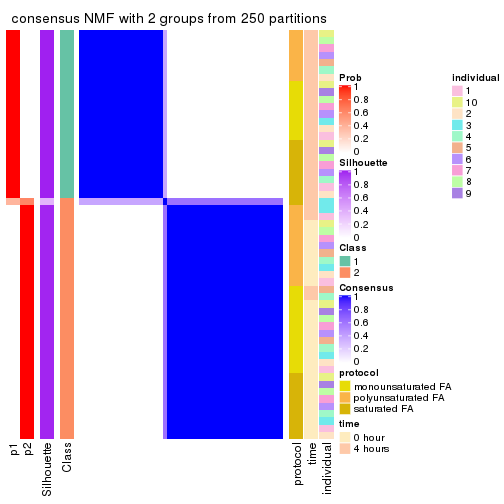</p>

</div>
<div id='tab-MAD-NMF-consensus-heatmap-2'>
<pre><code class="r">consensus_heatmap(res, k = 3)
</code></pre>

<p>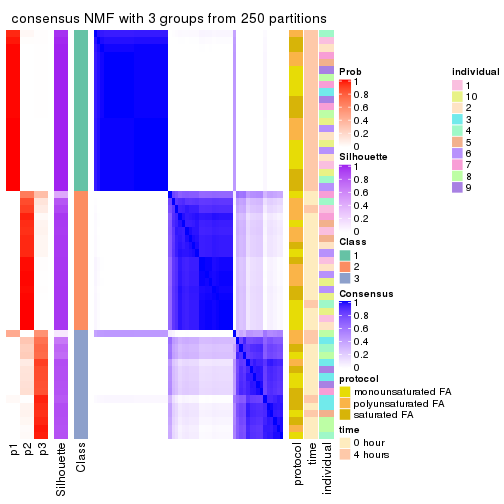</p>

</div>
<div id='tab-MAD-NMF-consensus-heatmap-3'>
<pre><code class="r">consensus_heatmap(res, k = 4)
</code></pre>

<p>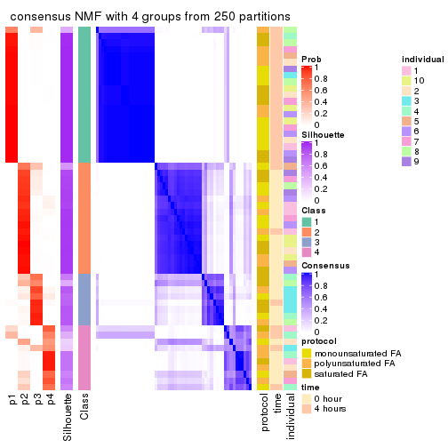</p>

</div>
<div id='tab-MAD-NMF-consensus-heatmap-4'>
<pre><code class="r">consensus_heatmap(res, k = 5)
</code></pre>

<p>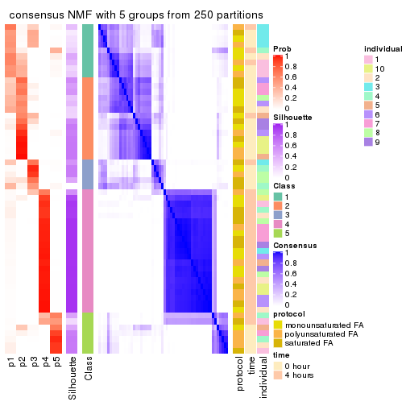</p>

</div>
<div id='tab-MAD-NMF-consensus-heatmap-5'>
<pre><code class="r">consensus_heatmap(res, k = 6)
</code></pre>

<p>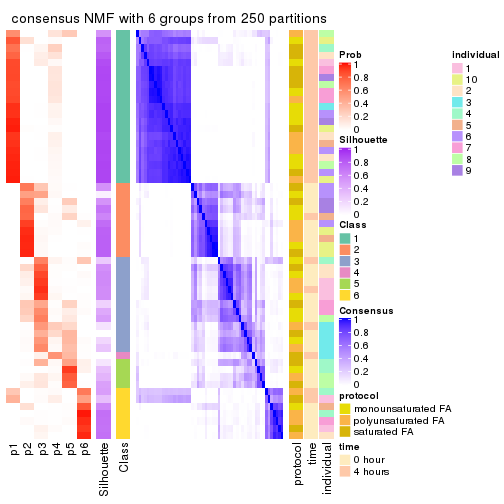</p>

</div>
</div>

Heatmaps for the membership of samples in all partitions to see how consistent they are:


<script>
$( function() {
	$( '#tabs-MAD-NMF-membership-heatmap' ).tabs();
} );
</script>
<div id='tabs-MAD-NMF-membership-heatmap'>
<ul>
<li><a href='#tab-MAD-NMF-membership-heatmap-1'>k = 2</a></li>
<li><a href='#tab-MAD-NMF-membership-heatmap-2'>k = 3</a></li>
<li><a href='#tab-MAD-NMF-membership-heatmap-3'>k = 4</a></li>
<li><a href='#tab-MAD-NMF-membership-heatmap-4'>k = 5</a></li>
<li><a href='#tab-MAD-NMF-membership-heatmap-5'>k = 6</a></li>
</ul>
<div id='tab-MAD-NMF-membership-heatmap-1'>
<pre><code class="r">membership_heatmap(res, k = 2)
</code></pre>

<p>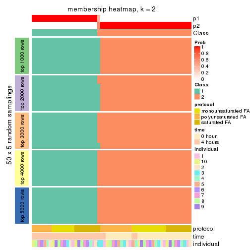</p>

</div>
<div id='tab-MAD-NMF-membership-heatmap-2'>
<pre><code class="r">membership_heatmap(res, k = 3)
</code></pre>

<p>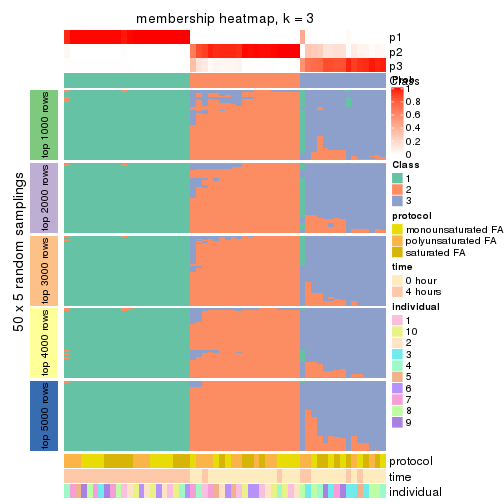</p>

</div>
<div id='tab-MAD-NMF-membership-heatmap-3'>
<pre><code class="r">membership_heatmap(res, k = 4)
</code></pre>

<p>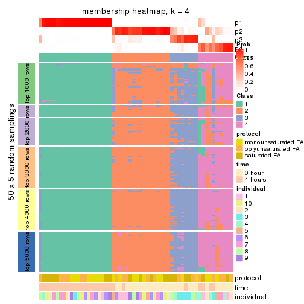</p>

</div>
<div id='tab-MAD-NMF-membership-heatmap-4'>
<pre><code class="r">membership_heatmap(res, k = 5)
</code></pre>

<p>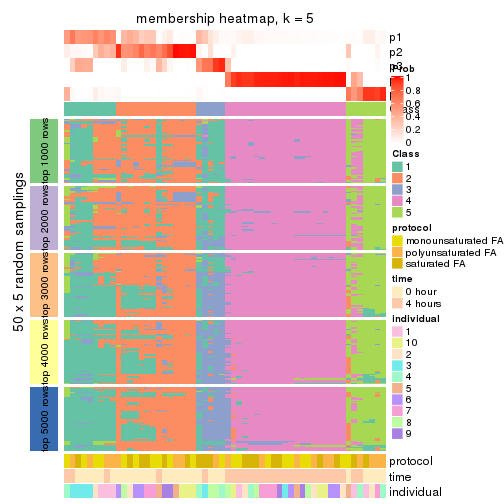</p>

</div>
<div id='tab-MAD-NMF-membership-heatmap-5'>
<pre><code class="r">membership_heatmap(res, k = 6)
</code></pre>

<p>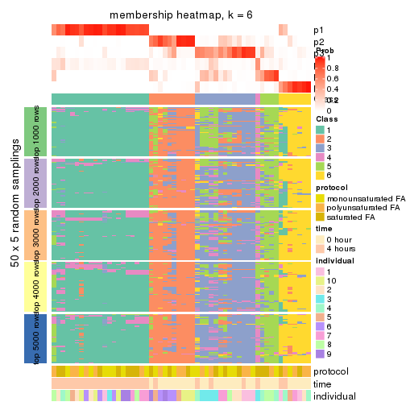</p>

</div>
</div>

As soon as we have had the classes for columns, we can look for signatures
which are significantly different between classes which can be candidate marks
for certain classes. Following are the heatmaps for signatures.


Signature heatmaps where rows are scaled:


<script>
$( function() {
	$( '#tabs-MAD-NMF-get-signatures' ).tabs();
} );
</script>
<div id='tabs-MAD-NMF-get-signatures'>
<ul>
<li><a href='#tab-MAD-NMF-get-signatures-1'>k = 2</a></li>
<li><a href='#tab-MAD-NMF-get-signatures-2'>k = 3</a></li>
<li><a href='#tab-MAD-NMF-get-signatures-3'>k = 4</a></li>
<li><a href='#tab-MAD-NMF-get-signatures-4'>k = 5</a></li>
<li><a href='#tab-MAD-NMF-get-signatures-5'>k = 6</a></li>
</ul>
<div id='tab-MAD-NMF-get-signatures-1'>
<pre><code class="r">get_signatures(res, k = 2)
</code></pre>

<p>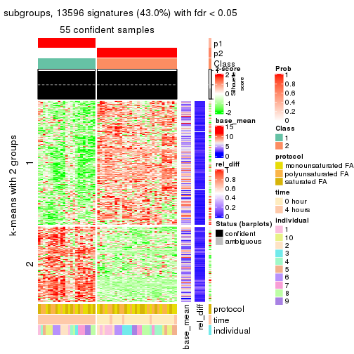</p>

</div>
<div id='tab-MAD-NMF-get-signatures-2'>
<pre><code class="r">get_signatures(res, k = 3)
</code></pre>

<p>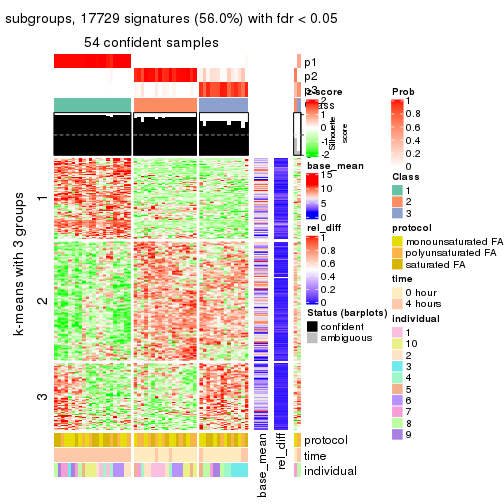</p>

</div>
<div id='tab-MAD-NMF-get-signatures-3'>
<pre><code class="r">get_signatures(res, k = 4)
</code></pre>

<p>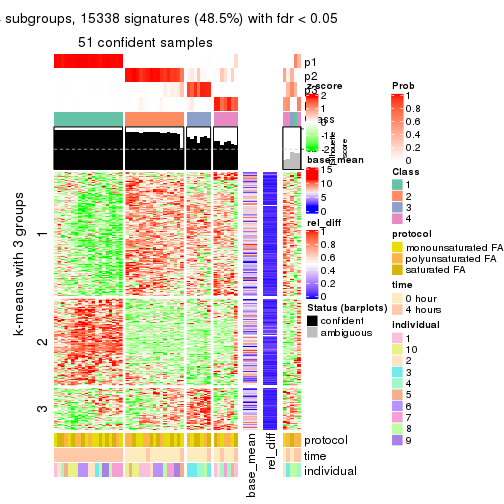</p>

</div>
<div id='tab-MAD-NMF-get-signatures-4'>
<pre><code class="r">get_signatures(res, k = 5)
</code></pre>

<p>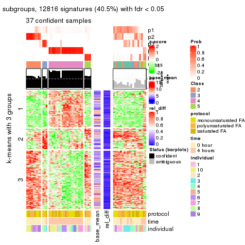</p>

</div>
<div id='tab-MAD-NMF-get-signatures-5'>
<pre><code class="r">get_signatures(res, k = 6)
</code></pre>

<p>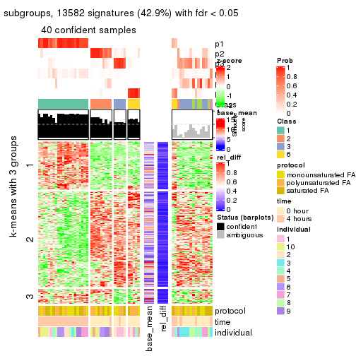</p>

</div>
</div>


Signature heatmaps where rows are not scaled:


<script>
$( function() {
	$( '#tabs-MAD-NMF-get-signatures-no-scale' ).tabs();
} );
</script>
<div id='tabs-MAD-NMF-get-signatures-no-scale'>
<ul>
<li><a href='#tab-MAD-NMF-get-signatures-no-scale-1'>k = 2</a></li>
<li><a href='#tab-MAD-NMF-get-signatures-no-scale-2'>k = 3</a></li>
<li><a href='#tab-MAD-NMF-get-signatures-no-scale-3'>k = 4</a></li>
<li><a href='#tab-MAD-NMF-get-signatures-no-scale-4'>k = 5</a></li>
<li><a href='#tab-MAD-NMF-get-signatures-no-scale-5'>k = 6</a></li>
</ul>
<div id='tab-MAD-NMF-get-signatures-no-scale-1'>
<pre><code class="r">get_signatures(res, k = 2, scale_rows = FALSE)
</code></pre>

<p>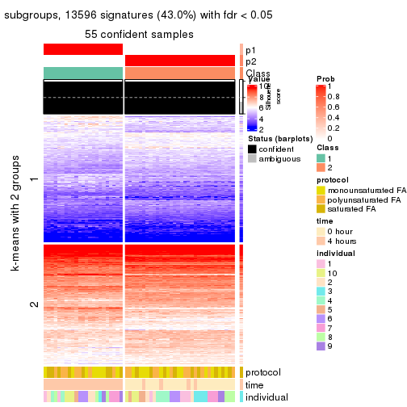</p>

</div>
<div id='tab-MAD-NMF-get-signatures-no-scale-2'>
<pre><code class="r">get_signatures(res, k = 3, scale_rows = FALSE)
</code></pre>

<p>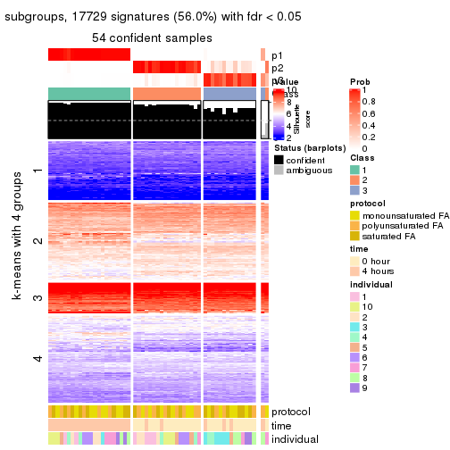</p>

</div>
<div id='tab-MAD-NMF-get-signatures-no-scale-3'>
<pre><code class="r">get_signatures(res, k = 4, scale_rows = FALSE)
</code></pre>

<p>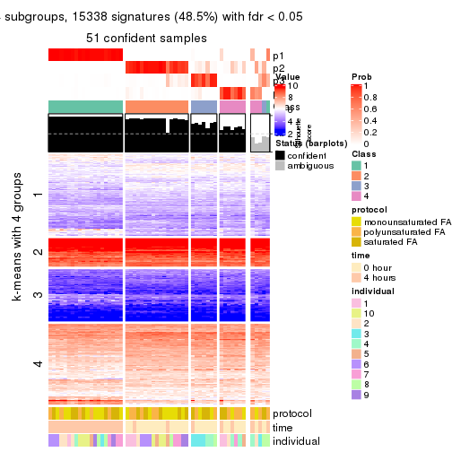</p>

</div>
<div id='tab-MAD-NMF-get-signatures-no-scale-4'>
<pre><code class="r">get_signatures(res, k = 5, scale_rows = FALSE)
</code></pre>

<p>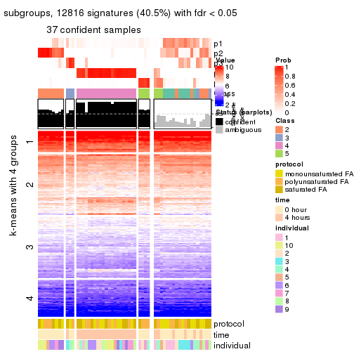</p>

</div>
<div id='tab-MAD-NMF-get-signatures-no-scale-5'>
<pre><code class="r">get_signatures(res, k = 6, scale_rows = FALSE)
</code></pre>

<p>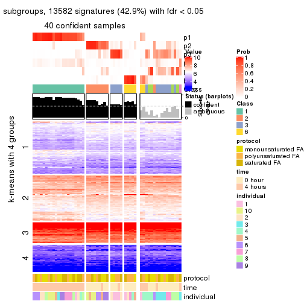</p>

</div>
</div>


Compare the overlap of signatures from different k:

```r
compare_signatures(res)
```

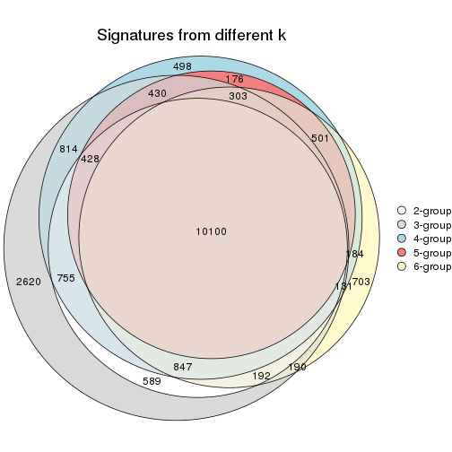

`get_signature()` returns a data frame invisibly. TO get the list of signatures, the function
call should be assigned to a variable explicitly. In following code, if `plot` argument is set
to `FALSE`, no heatmap is plotted while only the differential analysis is performed.

```r
# code only for demonstration
tb = get_signature(res, k = ..., plot = FALSE)
```

An example of the output of `tb` is:

```
#>   which_row         fdr    mean_1    mean_2 scaled_mean_1 scaled_mean_2 km
#> 1        38 0.042760348  8.373488  9.131774    -0.5533452     0.5164555  1
#> 2        40 0.018707592  7.106213  8.469186    -0.6173731     0.5762149  1
#> 3        55 0.019134737 10.221463 11.207825    -0.6159697     0.5749050  1
#> 4        59 0.006059896  5.921854  7.869574    -0.6899429     0.6439467  1
#> 5        60 0.018055526  8.928898 10.211722    -0.6204761     0.5791110  1
#> 6        98 0.009384629 15.714769 14.887706     0.6635654    -0.6193277  2
...
```

The columns in `tb` are:

1. `which_row`: row indices corresponding to the input matrix.
2. `fdr`: FDR for the differential test. 
3. `mean_x`: The mean value in group x.
4. `scaled_mean_x`: The mean value in group x after rows are scaled.
5. `km`: Row groups if k-means clustering is applied to rows.


UMAP plot which shows how samples are separated.


<script>
$( function() {
	$( '#tabs-MAD-NMF-dimension-reduction' ).tabs();
} );
</script>
<div id='tabs-MAD-NMF-dimension-reduction'>
<ul>
<li><a href='#tab-MAD-NMF-dimension-reduction-1'>k = 2</a></li>
<li><a href='#tab-MAD-NMF-dimension-reduction-2'>k = 3</a></li>
<li><a href='#tab-MAD-NMF-dimension-reduction-3'>k = 4</a></li>
<li><a href='#tab-MAD-NMF-dimension-reduction-4'>k = 5</a></li>
<li><a href='#tab-MAD-NMF-dimension-reduction-5'>k = 6</a></li>
</ul>
<div id='tab-MAD-NMF-dimension-reduction-1'>
<pre><code class="r">dimension_reduction(res, k = 2, method = &quot;UMAP&quot;)
</code></pre>

<p>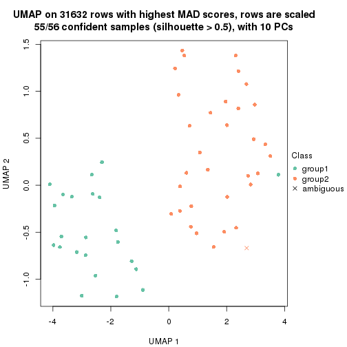</p>

</div>
<div id='tab-MAD-NMF-dimension-reduction-2'>
<pre><code class="r">dimension_reduction(res, k = 3, method = &quot;UMAP&quot;)
</code></pre>

<p>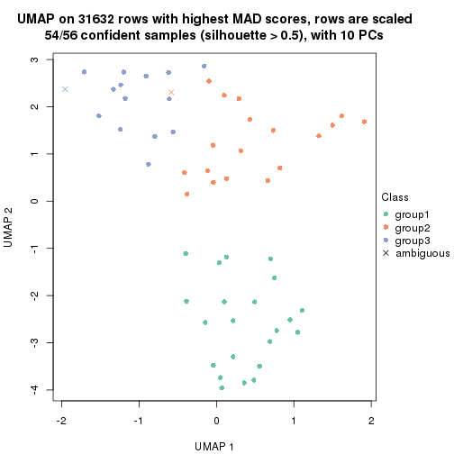</p>

</div>
<div id='tab-MAD-NMF-dimension-reduction-3'>
<pre><code class="r">dimension_reduction(res, k = 4, method = &quot;UMAP&quot;)
</code></pre>

<p>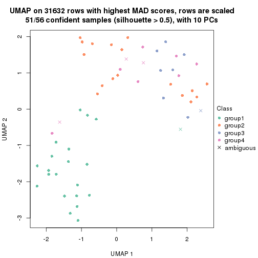</p>

</div>
<div id='tab-MAD-NMF-dimension-reduction-4'>
<pre><code class="r">dimension_reduction(res, k = 5, method = &quot;UMAP&quot;)
</code></pre>

<p>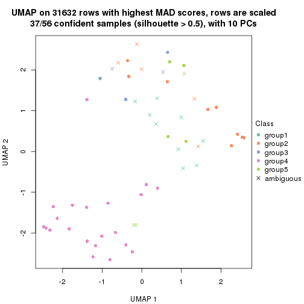</p>

</div>
<div id='tab-MAD-NMF-dimension-reduction-5'>
<pre><code class="r">dimension_reduction(res, k = 6, method = &quot;UMAP&quot;)
</code></pre>

<p>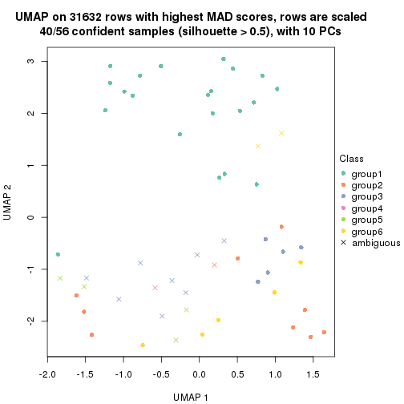</p>

</div>
</div>


Following heatmap shows how subgroups are split when increasing `k`:

```r
collect_classes(res)
```

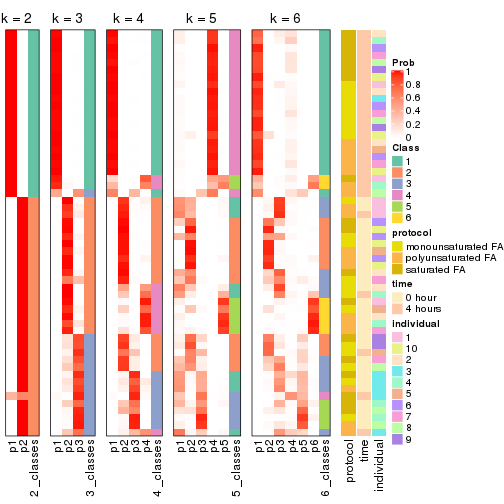


Test correlation between subgroups and known annotations. If the known
annotation is numeric, one-way ANOVA test is applied, and if the known
annotation is discrete, chi-squared contingency table test is applied.

```r
test_to_known_factors(res)
```

```
#>          n protocol(p)  time(p) individual(p) k
#> MAD:NMF 55       0.868 8.82e-10        0.9739 2
#> MAD:NMF 54       0.615 7.34e-09        0.0554 3
#> MAD:NMF 51       0.972 1.35e-07        0.0390 4
#> MAD:NMF 37       0.722 1.77e-07        0.4865 5
#> MAD:NMF 40       0.915 3.08e-07        0.1509 6
```


If matrix rows can be associated to genes, consider to use `functional_enrichment(res,
...)` to perform function enrichment for the signature genes. See [this vignette](http://bioconductor.org/packages/devel/bioc/vignettes/cola/inst/doc/functional_enrichment.html) for more detailed explanations.


 

---------------------------------------------------


### ATC:hclust**


The object with results only for a single top-value method and a single partition method 
can be extracted as:

```r
res = res_list["ATC", "hclust"]
# you can also extract it by
# res = res_list["ATC:hclust"]
```

A summary of `res` and all the functions that can be applied to it:

```r
res
```

```
#> A 'ConsensusPartition' object with k = 2, 3, 4, 5, 6.
#>   On a matrix with 31632 rows and 56 columns.
#>   Top rows (1000, 2000, 3000, 4000, 5000) are extracted by 'ATC' method.
#>   Subgroups are detected by 'hclust' method.
#>   Performed in total 1250 partitions by row resampling.
#>   Best k for subgroups seems to be 5.
#> 
#> Following methods can be applied to this 'ConsensusPartition' object:
#>  [1] "cola_report"             "collect_classes"         "collect_plots"          
#>  [4] "collect_stats"           "colnames"                "compare_signatures"     
#>  [7] "consensus_heatmap"       "dimension_reduction"     "functional_enrichment"  
#> [10] "get_anno_col"            "get_anno"                "get_classes"            
#> [13] "get_consensus"           "get_matrix"              "get_membership"         
#> [16] "get_param"               "get_signatures"          "get_stats"              
#> [19] "is_best_k"               "is_stable_k"             "membership_heatmap"     
#> [22] "ncol"                    "nrow"                    "plot_ecdf"              
#> [25] "rownames"                "select_partition_number" "show"                   
#> [28] "suggest_best_k"          "test_to_known_factors"
```

`collect_plots()` function collects all the plots made from `res` for all `k` (number of partitions)
into one single page to provide an easy and fast comparison between different `k`.

```r
collect_plots(res)
```

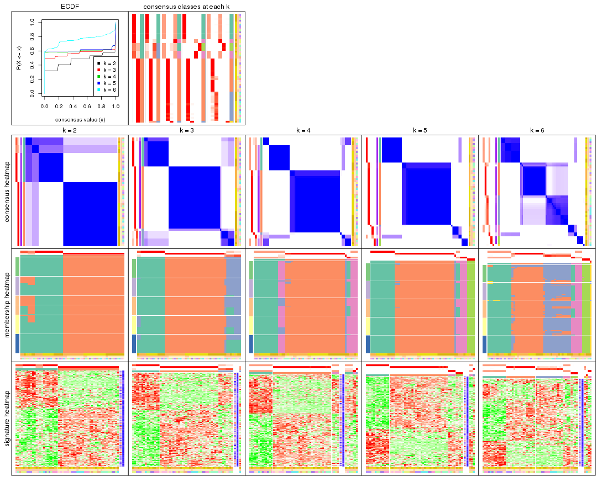

The plots are:

- The first row: a plot of the ECDF (empirical cumulative distribution
  function) curves of the consensus matrix for each `k` and the heatmap of
  predicted classes for each `k`.
- The second row: heatmaps of the consensus matrix for each `k`.
- The third row: heatmaps of the membership matrix for each `k`.
- The fouth row: heatmaps of the signatures for each `k`.

All the plots in panels can be made by individual functions and they are
plotted later in this section.

`select_partition_number()` produces several plots showing different
statistics for choosing "optimized" `k`. There are following statistics:

- ECDF curves of the consensus matrix for each `k`;
- 1-PAC. [The PAC
  score](https://en.wikipedia.org/wiki/Consensus_clustering#Over-interpretation_potential_of_consensus_clustering)
  measures the proportion of the ambiguous subgrouping.
- Mean silhouette score.
- Concordance. The mean probability of fiting the consensus class ids in all
  partitions.
- Area increased. Denote $A_k$ as the area under the ECDF curve for current
  `k`, the area increased is defined as $A_k - A_{k-1}$.
- Rand index. The percent of pairs of samples that are both in a same cluster
  or both are not in a same cluster in the partition of k and k-1.
- Jaccard index. The ratio of pairs of samples are both in a same cluster in
  the partition of k and k-1 and the pairs of samples are both in a same
  cluster in the partition k or k-1.

The detailed explanations of these statistics can be found in [the _cola_
vignette](http://bioconductor.org/packages/devel/bioc/vignettes/cola/inst/doc/cola.html#toc_13).

Generally speaking, lower PAC score, higher mean silhouette score or higher
concordance corresponds to better partition. Rand index and Jaccard index
measure how similar the current partition is compared to partition with `k-1`.
If they are too similar, we won't accept `k` is better than `k-1`.

```r
select_partition_number(res)
```

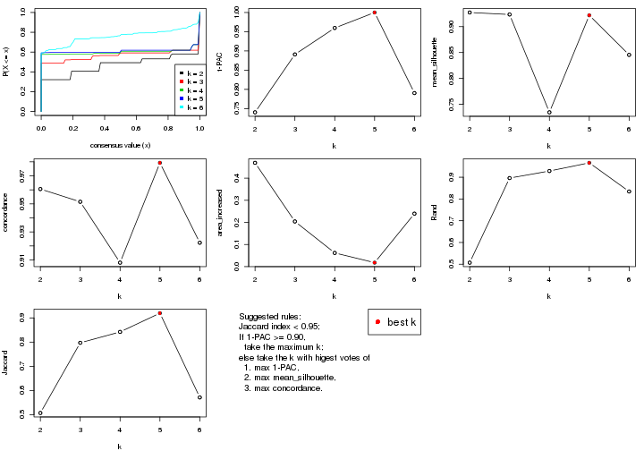

The numeric values for all these statistics can be obtained by `get_stats()`.

```r
get_stats(res)
```

```
#>   k 1-PAC mean_silhouette concordance area_increased  Rand Jaccard
#> 2 2 0.740           0.927       0.961         0.4694 0.507   0.507
#> 3 3 0.891           0.923       0.952         0.2042 0.896   0.797
#> 4 4 0.960           0.735       0.908         0.0619 0.929   0.842
#> 5 5 1.000           0.922       0.979         0.0178 0.966   0.920
#> 6 6 0.790           0.845       0.922         0.2395 0.834   0.571
```

`suggest_best_k()` suggests the best $k$ based on these statistics. The rules are as follows:

- All $k$ with Jaccard index larger than 0.95 are removed because increasing
  $k$ does not provide enough extra information. If all $k$ are removed, it is
  marked as no subgroup is detected.
- For all $k$ with 1-PAC score larger than 0.9, the maximal $k$ is taken as
  the best $k$, and other $k$ are marked as optional $k$.
- If it does not fit the second rule. The $k$ with the maximal vote of the
  highest 1-PAC score, highest mean silhouette, and highest concordance is
  taken as the best $k$.

```r
suggest_best_k(res)
```

```
#> [1] 5
#> attr(,"optional")
#> [1] 4
```

There is also optional best $k$ = 4 that is worth to check.

Following shows the table of the partitions (You need to click the **show/hide
code output** link to see it). The membership matrix (columns with name `p*`)
is inferred by
[`clue::cl_consensus()`](https://www.rdocumentation.org/link/cl_consensus?package=clue)
function with the `SE` method. Basically the value in the membership matrix
represents the probability to belong to a certain group. The finall class
label for an item is determined with the group with highest probability it
belongs to.

In `get_classes()` function, the entropy is calculated from the membership
matrix and the silhouette score is calculated from the consensus matrix.


<script>
$( function() {
	$( '#tabs-ATC-hclust-get-classes' ).tabs();
} );
</script>
<div id='tabs-ATC-hclust-get-classes'>
<ul>
<li><a href='#tab-ATC-hclust-get-classes-1'>k = 2</a></li>
<li><a href='#tab-ATC-hclust-get-classes-2'>k = 3</a></li>
<li><a href='#tab-ATC-hclust-get-classes-3'>k = 4</a></li>
<li><a href='#tab-ATC-hclust-get-classes-4'>k = 5</a></li>
<li><a href='#tab-ATC-hclust-get-classes-5'>k = 6</a></li>
</ul>

<div id='tab-ATC-hclust-get-classes-1'>
<p><a id='tab-ATC-hclust-get-classes-1-a' style='color:#0366d6' href='#'>show/hide code output</a></p>
<pre><code class="r">cbind(get_classes(res, k = 2), get_membership(res, k = 2))
</code></pre>

<pre><code>#&gt;           class entropy silhouette    p1    p2
#&gt; GSM790742     2   0.000      1.000 0.000 1.000
#&gt; GSM790744     2   0.000      1.000 0.000 1.000
#&gt; GSM790754     2   0.000      1.000 0.000 1.000
#&gt; GSM790756     2   0.000      1.000 0.000 1.000
#&gt; GSM790768     2   0.000      1.000 0.000 1.000
#&gt; GSM790774     2   0.000      1.000 0.000 1.000
#&gt; GSM790778     2   0.000      1.000 0.000 1.000
#&gt; GSM790784     2   0.000      1.000 0.000 1.000
#&gt; GSM790790     2   0.000      1.000 0.000 1.000
#&gt; GSM790743     1   0.697      0.798 0.812 0.188
#&gt; GSM790745     1   0.946      0.574 0.636 0.364
#&gt; GSM790755     2   0.000      1.000 0.000 1.000
#&gt; GSM790757     1   0.946      0.574 0.636 0.364
#&gt; GSM790769     1   0.000      0.896 1.000 0.000
#&gt; GSM790775     1   0.000      0.896 1.000 0.000
#&gt; GSM790779     1   0.000      0.896 1.000 0.000
#&gt; GSM790785     1   0.000      0.896 1.000 0.000
#&gt; GSM790791     1   0.000      0.896 1.000 0.000
#&gt; GSM790738     2   0.000      1.000 0.000 1.000
#&gt; GSM790746     2   0.000      1.000 0.000 1.000
#&gt; GSM790752     2   0.000      1.000 0.000 1.000
#&gt; GSM790758     2   0.000      1.000 0.000 1.000
#&gt; GSM790764     2   0.000      1.000 0.000 1.000
#&gt; GSM790766     2   0.000      1.000 0.000 1.000
#&gt; GSM790772     2   0.000      1.000 0.000 1.000
#&gt; GSM790782     2   0.000      1.000 0.000 1.000
#&gt; GSM790786     2   0.000      1.000 0.000 1.000
#&gt; GSM790792     2   0.000      1.000 0.000 1.000
#&gt; GSM790739     1   0.946      0.574 0.636 0.364
#&gt; GSM790747     1   0.000      0.896 1.000 0.000
#&gt; GSM790753     1   0.000      0.896 1.000 0.000
#&gt; GSM790759     2   0.000      1.000 0.000 1.000
#&gt; GSM790765     2   0.000      1.000 0.000 1.000
#&gt; GSM790767     1   0.000      0.896 1.000 0.000
#&gt; GSM790773     1   0.000      0.896 1.000 0.000
#&gt; GSM790783     1   0.000      0.896 1.000 0.000
#&gt; GSM790787     1   0.000      0.896 1.000 0.000
#&gt; GSM790793     1   0.697      0.798 0.812 0.188
#&gt; GSM790740     2   0.000      1.000 0.000 1.000
#&gt; GSM790748     2   0.000      1.000 0.000 1.000
#&gt; GSM790750     2   0.000      1.000 0.000 1.000
#&gt; GSM790760     2   0.000      1.000 0.000 1.000
#&gt; GSM790762     2   0.000      1.000 0.000 1.000
#&gt; GSM790770     2   0.000      1.000 0.000 1.000
#&gt; GSM790776     2   0.000      1.000 0.000 1.000
#&gt; GSM790780     2   0.000      1.000 0.000 1.000
#&gt; GSM790788     2   0.000      1.000 0.000 1.000
#&gt; GSM790741     2   0.000      1.000 0.000 1.000
#&gt; GSM790749     1   0.000      0.896 1.000 0.000
#&gt; GSM790751     2   0.000      1.000 0.000 1.000
#&gt; GSM790761     1   0.697      0.798 0.812 0.188
#&gt; GSM790763     1   0.697      0.798 0.812 0.188
#&gt; GSM790771     1   0.000      0.896 1.000 0.000
#&gt; GSM790777     1   0.000      0.896 1.000 0.000
#&gt; GSM790781     1   0.946      0.574 0.636 0.364
#&gt; GSM790789     1   0.000      0.896 1.000 0.000
</code></pre>

<script>
$('#tab-ATC-hclust-get-classes-1-a').parent().next().next().hide();
$('#tab-ATC-hclust-get-classes-1-a').click(function(){
  $('#tab-ATC-hclust-get-classes-1-a').parent().next().next().toggle();
  return(false);
});
</script>
</div>

<div id='tab-ATC-hclust-get-classes-2'>
<p><a id='tab-ATC-hclust-get-classes-2-a' style='color:#0366d6' href='#'>show/hide code output</a></p>
<pre><code class="r">cbind(get_classes(res, k = 3), get_membership(res, k = 3))
</code></pre>

<pre><code>#&gt;           class entropy silhouette    p1    p2    p3
#&gt; GSM790742     2   0.000      1.000 0.000 1.000 0.000
#&gt; GSM790744     2   0.000      1.000 0.000 1.000 0.000
#&gt; GSM790754     2   0.000      1.000 0.000 1.000 0.000
#&gt; GSM790756     2   0.000      1.000 0.000 1.000 0.000
#&gt; GSM790768     2   0.000      1.000 0.000 1.000 0.000
#&gt; GSM790774     2   0.000      1.000 0.000 1.000 0.000
#&gt; GSM790778     2   0.000      1.000 0.000 1.000 0.000
#&gt; GSM790784     2   0.000      1.000 0.000 1.000 0.000
#&gt; GSM790790     2   0.000      1.000 0.000 1.000 0.000
#&gt; GSM790743     3   0.571      0.707 0.320 0.000 0.680
#&gt; GSM790745     3   0.375      0.764 0.144 0.000 0.856
#&gt; GSM790755     3   0.631     -0.152 0.000 0.492 0.508
#&gt; GSM790757     3   0.375      0.764 0.144 0.000 0.856
#&gt; GSM790769     1   0.000      0.965 1.000 0.000 0.000
#&gt; GSM790775     1   0.000      0.965 1.000 0.000 0.000
#&gt; GSM790779     1   0.000      0.965 1.000 0.000 0.000
#&gt; GSM790785     1   0.000      0.965 1.000 0.000 0.000
#&gt; GSM790791     1   0.435      0.717 0.816 0.000 0.184
#&gt; GSM790738     2   0.000      1.000 0.000 1.000 0.000
#&gt; GSM790746     2   0.000      1.000 0.000 1.000 0.000
#&gt; GSM790752     2   0.000      1.000 0.000 1.000 0.000
#&gt; GSM790758     2   0.000      1.000 0.000 1.000 0.000
#&gt; GSM790764     2   0.000      1.000 0.000 1.000 0.000
#&gt; GSM790766     2   0.000      1.000 0.000 1.000 0.000
#&gt; GSM790772     2   0.000      1.000 0.000 1.000 0.000
#&gt; GSM790782     2   0.000      1.000 0.000 1.000 0.000
#&gt; GSM790786     2   0.000      1.000 0.000 1.000 0.000
#&gt; GSM790792     2   0.000      1.000 0.000 1.000 0.000
#&gt; GSM790739     3   0.375      0.764 0.144 0.000 0.856
#&gt; GSM790747     1   0.000      0.965 1.000 0.000 0.000
#&gt; GSM790753     1   0.000      0.965 1.000 0.000 0.000
#&gt; GSM790759     2   0.000      1.000 0.000 1.000 0.000
#&gt; GSM790765     2   0.000      1.000 0.000 1.000 0.000
#&gt; GSM790767     1   0.000      0.965 1.000 0.000 0.000
#&gt; GSM790773     1   0.000      0.965 1.000 0.000 0.000
#&gt; GSM790783     1   0.000      0.965 1.000 0.000 0.000
#&gt; GSM790787     1   0.000      0.965 1.000 0.000 0.000
#&gt; GSM790793     3   0.571      0.707 0.320 0.000 0.680
#&gt; GSM790740     2   0.000      1.000 0.000 1.000 0.000
#&gt; GSM790748     2   0.000      1.000 0.000 1.000 0.000
#&gt; GSM790750     2   0.000      1.000 0.000 1.000 0.000
#&gt; GSM790760     2   0.000      1.000 0.000 1.000 0.000
#&gt; GSM790762     2   0.000      1.000 0.000 1.000 0.000
#&gt; GSM790770     2   0.000      1.000 0.000 1.000 0.000
#&gt; GSM790776     2   0.000      1.000 0.000 1.000 0.000
#&gt; GSM790780     2   0.000      1.000 0.000 1.000 0.000
#&gt; GSM790788     2   0.000      1.000 0.000 1.000 0.000
#&gt; GSM790741     2   0.000      1.000 0.000 1.000 0.000
#&gt; GSM790749     1   0.000      0.965 1.000 0.000 0.000
#&gt; GSM790751     2   0.000      1.000 0.000 1.000 0.000
#&gt; GSM790761     3   0.571      0.707 0.320 0.000 0.680
#&gt; GSM790763     3   0.571      0.707 0.320 0.000 0.680
#&gt; GSM790771     1   0.000      0.965 1.000 0.000 0.000
#&gt; GSM790777     1   0.000      0.965 1.000 0.000 0.000
#&gt; GSM790781     3   0.375      0.764 0.144 0.000 0.856
#&gt; GSM790789     1   0.435      0.717 0.816 0.000 0.184
</code></pre>

<script>
$('#tab-ATC-hclust-get-classes-2-a').parent().next().next().hide();
$('#tab-ATC-hclust-get-classes-2-a').click(function(){
  $('#tab-ATC-hclust-get-classes-2-a').parent().next().next().toggle();
  return(false);
});
</script>
</div>

<div id='tab-ATC-hclust-get-classes-3'>
<p><a id='tab-ATC-hclust-get-classes-3-a' style='color:#0366d6' href='#'>show/hide code output</a></p>
<pre><code class="r">cbind(get_classes(res, k = 4), get_membership(res, k = 4))
</code></pre>

<pre><code>#&gt;           class entropy silhouette    p1    p2    p3    p4
#&gt; GSM790742     2  0.0000      0.995 0.000 1.000 0.000 0.000
#&gt; GSM790744     2  0.0000      0.995 0.000 1.000 0.000 0.000
#&gt; GSM790754     2  0.0000      0.995 0.000 1.000 0.000 0.000
#&gt; GSM790756     2  0.0000      0.995 0.000 1.000 0.000 0.000
#&gt; GSM790768     2  0.0000      0.995 0.000 1.000 0.000 0.000
#&gt; GSM790774     2  0.0000      0.995 0.000 1.000 0.000 0.000
#&gt; GSM790778     2  0.0000      0.995 0.000 1.000 0.000 0.000
#&gt; GSM790784     2  0.0000      0.995 0.000 1.000 0.000 0.000
#&gt; GSM790790     2  0.0000      0.995 0.000 1.000 0.000 0.000
#&gt; GSM790743     4  0.5000      0.645 0.496 0.000 0.000 0.504
#&gt; GSM790745     1  0.7352     -0.660 0.496 0.000 0.176 0.328
#&gt; GSM790755     3  0.0000      0.000 0.000 0.000 1.000 0.000
#&gt; GSM790757     1  0.7352     -0.660 0.496 0.000 0.176 0.328
#&gt; GSM790769     1  0.5000      0.701 0.504 0.000 0.000 0.496
#&gt; GSM790775     1  0.5000      0.701 0.504 0.000 0.000 0.496
#&gt; GSM790779     1  0.5000      0.701 0.504 0.000 0.000 0.496
#&gt; GSM790785     1  0.5000      0.701 0.504 0.000 0.000 0.496
#&gt; GSM790791     4  0.0000      0.189 0.000 0.000 0.000 1.000
#&gt; GSM790738     2  0.0000      0.995 0.000 1.000 0.000 0.000
#&gt; GSM790746     2  0.0000      0.995 0.000 1.000 0.000 0.000
#&gt; GSM790752     2  0.0000      0.995 0.000 1.000 0.000 0.000
#&gt; GSM790758     2  0.1474      0.949 0.000 0.948 0.052 0.000
#&gt; GSM790764     2  0.0000      0.995 0.000 1.000 0.000 0.000
#&gt; GSM790766     2  0.0000      0.995 0.000 1.000 0.000 0.000
#&gt; GSM790772     2  0.0000      0.995 0.000 1.000 0.000 0.000
#&gt; GSM790782     2  0.0000      0.995 0.000 1.000 0.000 0.000
#&gt; GSM790786     2  0.0000      0.995 0.000 1.000 0.000 0.000
#&gt; GSM790792     2  0.0000      0.995 0.000 1.000 0.000 0.000
#&gt; GSM790739     1  0.7352     -0.660 0.496 0.000 0.176 0.328
#&gt; GSM790747     1  0.5000      0.701 0.504 0.000 0.000 0.496
#&gt; GSM790753     1  0.5000      0.701 0.504 0.000 0.000 0.496
#&gt; GSM790759     2  0.0000      0.995 0.000 1.000 0.000 0.000
#&gt; GSM790765     2  0.0000      0.995 0.000 1.000 0.000 0.000
#&gt; GSM790767     1  0.5000      0.701 0.504 0.000 0.000 0.496
#&gt; GSM790773     1  0.5000      0.701 0.504 0.000 0.000 0.496
#&gt; GSM790783     1  0.5000      0.701 0.504 0.000 0.000 0.496
#&gt; GSM790787     1  0.5000      0.701 0.504 0.000 0.000 0.496
#&gt; GSM790793     4  0.5000      0.645 0.496 0.000 0.000 0.504
#&gt; GSM790740     2  0.0000      0.995 0.000 1.000 0.000 0.000
#&gt; GSM790748     2  0.0000      0.995 0.000 1.000 0.000 0.000
#&gt; GSM790750     2  0.0000      0.995 0.000 1.000 0.000 0.000
#&gt; GSM790760     2  0.1389      0.953 0.000 0.952 0.048 0.000
#&gt; GSM790762     2  0.0000      0.995 0.000 1.000 0.000 0.000
#&gt; GSM790770     2  0.0000      0.995 0.000 1.000 0.000 0.000
#&gt; GSM790776     2  0.0188      0.992 0.000 0.996 0.004 0.000
#&gt; GSM790780     2  0.1474      0.949 0.000 0.948 0.052 0.000
#&gt; GSM790788     2  0.0000      0.995 0.000 1.000 0.000 0.000
#&gt; GSM790741     2  0.0000      0.995 0.000 1.000 0.000 0.000
#&gt; GSM790749     1  0.5000      0.701 0.504 0.000 0.000 0.496
#&gt; GSM790751     2  0.0000      0.995 0.000 1.000 0.000 0.000
#&gt; GSM790761     4  0.5000      0.645 0.496 0.000 0.000 0.504
#&gt; GSM790763     4  0.5000      0.645 0.496 0.000 0.000 0.504
#&gt; GSM790771     1  0.5000      0.701 0.504 0.000 0.000 0.496
#&gt; GSM790777     1  0.5000      0.701 0.504 0.000 0.000 0.496
#&gt; GSM790781     1  0.7352     -0.660 0.496 0.000 0.176 0.328
#&gt; GSM790789     4  0.0000      0.189 0.000 0.000 0.000 1.000
</code></pre>

<script>
$('#tab-ATC-hclust-get-classes-3-a').parent().next().next().hide();
$('#tab-ATC-hclust-get-classes-3-a').click(function(){
  $('#tab-ATC-hclust-get-classes-3-a').parent().next().next().toggle();
  return(false);
});
</script>
</div>

<div id='tab-ATC-hclust-get-classes-4'>
<p><a id='tab-ATC-hclust-get-classes-4-a' style='color:#0366d6' href='#'>show/hide code output</a></p>
<pre><code class="r">cbind(get_classes(res, k = 5), get_membership(res, k = 5))
</code></pre>

<pre><code>#&gt;           class entropy silhouette    p1    p2    p3    p4    p5
#&gt; GSM790742     2  0.0000      0.995 0.000 1.000 0.000 0.000 0.000
#&gt; GSM790744     2  0.0000      0.995 0.000 1.000 0.000 0.000 0.000
#&gt; GSM790754     2  0.0000      0.995 0.000 1.000 0.000 0.000 0.000
#&gt; GSM790756     2  0.0000      0.995 0.000 1.000 0.000 0.000 0.000
#&gt; GSM790768     2  0.0000      0.995 0.000 1.000 0.000 0.000 0.000
#&gt; GSM790774     2  0.0000      0.995 0.000 1.000 0.000 0.000 0.000
#&gt; GSM790778     2  0.0000      0.995 0.000 1.000 0.000 0.000 0.000
#&gt; GSM790784     2  0.0000      0.995 0.000 1.000 0.000 0.000 0.000
#&gt; GSM790790     2  0.0000      0.995 0.000 1.000 0.000 0.000 0.000
#&gt; GSM790743     4  0.0000      0.632 0.000 0.000 0.000 1.000 0.000
#&gt; GSM790745     5  0.0000      0.995 0.000 0.000 0.000 0.000 1.000
#&gt; GSM790755     3  0.0000      0.000 0.000 0.000 1.000 0.000 0.000
#&gt; GSM790757     5  0.0000      0.995 0.000 0.000 0.000 0.000 1.000
#&gt; GSM790769     1  0.0000      1.000 1.000 0.000 0.000 0.000 0.000
#&gt; GSM790775     1  0.0000      1.000 1.000 0.000 0.000 0.000 0.000
#&gt; GSM790779     1  0.0000      1.000 1.000 0.000 0.000 0.000 0.000
#&gt; GSM790785     1  0.0000      1.000 1.000 0.000 0.000 0.000 0.000
#&gt; GSM790791     4  0.4307      0.213 0.496 0.000 0.000 0.504 0.000
#&gt; GSM790738     2  0.0000      0.995 0.000 1.000 0.000 0.000 0.000
#&gt; GSM790746     2  0.0000      0.995 0.000 1.000 0.000 0.000 0.000
#&gt; GSM790752     2  0.0000      0.995 0.000 1.000 0.000 0.000 0.000
#&gt; GSM790758     2  0.1270      0.949 0.000 0.948 0.052 0.000 0.000
#&gt; GSM790764     2  0.0000      0.995 0.000 1.000 0.000 0.000 0.000
#&gt; GSM790766     2  0.0000      0.995 0.000 1.000 0.000 0.000 0.000
#&gt; GSM790772     2  0.0000      0.995 0.000 1.000 0.000 0.000 0.000
#&gt; GSM790782     2  0.0000      0.995 0.000 1.000 0.000 0.000 0.000
#&gt; GSM790786     2  0.0000      0.995 0.000 1.000 0.000 0.000 0.000
#&gt; GSM790792     2  0.0000      0.995 0.000 1.000 0.000 0.000 0.000
#&gt; GSM790739     5  0.0404      0.985 0.000 0.000 0.000 0.012 0.988
#&gt; GSM790747     1  0.0000      1.000 1.000 0.000 0.000 0.000 0.000
#&gt; GSM790753     1  0.0000      1.000 1.000 0.000 0.000 0.000 0.000
#&gt; GSM790759     2  0.0000      0.995 0.000 1.000 0.000 0.000 0.000
#&gt; GSM790765     2  0.0000      0.995 0.000 1.000 0.000 0.000 0.000
#&gt; GSM790767     1  0.0000      1.000 1.000 0.000 0.000 0.000 0.000
#&gt; GSM790773     1  0.0000      1.000 1.000 0.000 0.000 0.000 0.000
#&gt; GSM790783     1  0.0000      1.000 1.000 0.000 0.000 0.000 0.000
#&gt; GSM790787     1  0.0000      1.000 1.000 0.000 0.000 0.000 0.000
#&gt; GSM790793     4  0.0000      0.632 0.000 0.000 0.000 1.000 0.000
#&gt; GSM790740     2  0.0000      0.995 0.000 1.000 0.000 0.000 0.000
#&gt; GSM790748     2  0.0000      0.995 0.000 1.000 0.000 0.000 0.000
#&gt; GSM790750     2  0.0000      0.995 0.000 1.000 0.000 0.000 0.000
#&gt; GSM790760     2  0.1197      0.953 0.000 0.952 0.048 0.000 0.000
#&gt; GSM790762     2  0.0000      0.995 0.000 1.000 0.000 0.000 0.000
#&gt; GSM790770     2  0.0000      0.995 0.000 1.000 0.000 0.000 0.000
#&gt; GSM790776     2  0.0162      0.992 0.000 0.996 0.004 0.000 0.000
#&gt; GSM790780     2  0.1270      0.949 0.000 0.948 0.052 0.000 0.000
#&gt; GSM790788     2  0.0000      0.995 0.000 1.000 0.000 0.000 0.000
#&gt; GSM790741     2  0.0000      0.995 0.000 1.000 0.000 0.000 0.000
#&gt; GSM790749     1  0.0000      1.000 1.000 0.000 0.000 0.000 0.000
#&gt; GSM790751     2  0.0000      0.995 0.000 1.000 0.000 0.000 0.000
#&gt; GSM790761     4  0.0000      0.632 0.000 0.000 0.000 1.000 0.000
#&gt; GSM790763     4  0.0000      0.632 0.000 0.000 0.000 1.000 0.000
#&gt; GSM790771     1  0.0000      1.000 1.000 0.000 0.000 0.000 0.000
#&gt; GSM790777     1  0.0000      1.000 1.000 0.000 0.000 0.000 0.000
#&gt; GSM790781     5  0.0000      0.995 0.000 0.000 0.000 0.000 1.000
#&gt; GSM790789     4  0.4307      0.213 0.496 0.000 0.000 0.504 0.000
</code></pre>

<script>
$('#tab-ATC-hclust-get-classes-4-a').parent().next().next().hide();
$('#tab-ATC-hclust-get-classes-4-a').click(function(){
  $('#tab-ATC-hclust-get-classes-4-a').parent().next().next().toggle();
  return(false);
});
</script>
</div>

<div id='tab-ATC-hclust-get-classes-5'>
<p><a id='tab-ATC-hclust-get-classes-5-a' style='color:#0366d6' href='#'>show/hide code output</a></p>
<pre><code class="r">cbind(get_classes(res, k = 6), get_membership(res, k = 6))
</code></pre>

<pre><code>#&gt;           class entropy silhouette    p1    p2    p3    p4    p5    p6
#&gt; GSM790742     2  0.0000     0.9439 0.000 1.000 0.000 0.000 0.000 0.000
#&gt; GSM790744     2  0.0000     0.9439 0.000 1.000 0.000 0.000 0.000 0.000
#&gt; GSM790754     3  0.2823     0.8945 0.000 0.204 0.796 0.000 0.000 0.000
#&gt; GSM790756     3  0.1814     0.8657 0.000 0.100 0.900 0.000 0.000 0.000
#&gt; GSM790768     2  0.0000     0.9439 0.000 1.000 0.000 0.000 0.000 0.000
#&gt; GSM790774     3  0.2697     0.9015 0.000 0.188 0.812 0.000 0.000 0.000
#&gt; GSM790778     3  0.2697     0.9015 0.000 0.188 0.812 0.000 0.000 0.000
#&gt; GSM790784     3  0.2762     0.8982 0.000 0.196 0.804 0.000 0.000 0.000
#&gt; GSM790790     2  0.0000     0.9439 0.000 1.000 0.000 0.000 0.000 0.000
#&gt; GSM790743     4  0.4184     0.6385 0.484 0.000 0.000 0.504 0.000 0.012
#&gt; GSM790745     5  0.0000     0.9949 0.000 0.000 0.000 0.000 1.000 0.000
#&gt; GSM790755     6  0.0790     0.0000 0.000 0.000 0.032 0.000 0.000 0.968
#&gt; GSM790757     5  0.0000     0.9949 0.000 0.000 0.000 0.000 1.000 0.000
#&gt; GSM790769     1  0.3868     0.9829 0.504 0.000 0.000 0.496 0.000 0.000
#&gt; GSM790775     1  0.3868     0.9829 0.504 0.000 0.000 0.496 0.000 0.000
#&gt; GSM790779     1  0.4861     0.9540 0.512 0.000 0.024 0.444 0.000 0.020
#&gt; GSM790785     1  0.3866     0.9811 0.516 0.000 0.000 0.484 0.000 0.000
#&gt; GSM790791     4  0.0000     0.2222 0.000 0.000 0.000 1.000 0.000 0.000
#&gt; GSM790738     2  0.0000     0.9439 0.000 1.000 0.000 0.000 0.000 0.000
#&gt; GSM790746     2  0.0000     0.9439 0.000 1.000 0.000 0.000 0.000 0.000
#&gt; GSM790752     3  0.2823     0.8945 0.000 0.204 0.796 0.000 0.000 0.000
#&gt; GSM790758     3  0.0632     0.7979 0.000 0.024 0.976 0.000 0.000 0.000
#&gt; GSM790764     2  0.0260     0.9361 0.000 0.992 0.008 0.000 0.000 0.000
#&gt; GSM790766     2  0.0000     0.9439 0.000 1.000 0.000 0.000 0.000 0.000
#&gt; GSM790772     3  0.2697     0.9015 0.000 0.188 0.812 0.000 0.000 0.000
#&gt; GSM790782     3  0.3464     0.7406 0.000 0.312 0.688 0.000 0.000 0.000
#&gt; GSM790786     3  0.2762     0.8982 0.000 0.196 0.804 0.000 0.000 0.000
#&gt; GSM790792     2  0.0000     0.9439 0.000 1.000 0.000 0.000 0.000 0.000
#&gt; GSM790739     5  0.0363     0.9847 0.012 0.000 0.000 0.000 0.988 0.000
#&gt; GSM790747     1  0.3868     0.9829 0.504 0.000 0.000 0.496 0.000 0.000
#&gt; GSM790753     1  0.4869     0.9576 0.500 0.000 0.024 0.456 0.000 0.020
#&gt; GSM790759     2  0.3266     0.5398 0.000 0.728 0.272 0.000 0.000 0.000
#&gt; GSM790765     2  0.3797     0.0157 0.000 0.580 0.420 0.000 0.000 0.000
#&gt; GSM790767     1  0.3868     0.9829 0.504 0.000 0.000 0.496 0.000 0.000
#&gt; GSM790773     1  0.3866     0.9811 0.516 0.000 0.000 0.484 0.000 0.000
#&gt; GSM790783     1  0.3866     0.9811 0.516 0.000 0.000 0.484 0.000 0.000
#&gt; GSM790787     1  0.4869     0.9576 0.500 0.000 0.024 0.456 0.000 0.020
#&gt; GSM790793     4  0.4184     0.6385 0.484 0.000 0.000 0.504 0.000 0.012
#&gt; GSM790740     2  0.0000     0.9439 0.000 1.000 0.000 0.000 0.000 0.000
#&gt; GSM790748     2  0.0000     0.9439 0.000 1.000 0.000 0.000 0.000 0.000
#&gt; GSM790750     3  0.2491     0.8974 0.000 0.164 0.836 0.000 0.000 0.000
#&gt; GSM790760     3  0.1007     0.8106 0.000 0.044 0.956 0.000 0.000 0.000
#&gt; GSM790762     2  0.0000     0.9439 0.000 1.000 0.000 0.000 0.000 0.000
#&gt; GSM790770     2  0.0000     0.9439 0.000 1.000 0.000 0.000 0.000 0.000
#&gt; GSM790776     3  0.2260     0.8865 0.000 0.140 0.860 0.000 0.000 0.000
#&gt; GSM790780     3  0.0632     0.7979 0.000 0.024 0.976 0.000 0.000 0.000
#&gt; GSM790788     2  0.0000     0.9439 0.000 1.000 0.000 0.000 0.000 0.000
#&gt; GSM790741     2  0.0000     0.9439 0.000 1.000 0.000 0.000 0.000 0.000
#&gt; GSM790749     1  0.3868     0.9829 0.504 0.000 0.000 0.496 0.000 0.000
#&gt; GSM790751     3  0.2823     0.8945 0.000 0.204 0.796 0.000 0.000 0.000
#&gt; GSM790761     4  0.4184     0.6385 0.484 0.000 0.000 0.504 0.000 0.012
#&gt; GSM790763     4  0.4184     0.6385 0.484 0.000 0.000 0.504 0.000 0.012
#&gt; GSM790771     1  0.3868     0.9829 0.504 0.000 0.000 0.496 0.000 0.000
#&gt; GSM790777     1  0.3866     0.9811 0.516 0.000 0.000 0.484 0.000 0.000
#&gt; GSM790781     5  0.0000     0.9949 0.000 0.000 0.000 0.000 1.000 0.000
#&gt; GSM790789     4  0.0000     0.2222 0.000 0.000 0.000 1.000 0.000 0.000
</code></pre>

<script>
$('#tab-ATC-hclust-get-classes-5-a').parent().next().next().hide();
$('#tab-ATC-hclust-get-classes-5-a').click(function(){
  $('#tab-ATC-hclust-get-classes-5-a').parent().next().next().toggle();
  return(false);
});
</script>
</div>
</div>

Heatmaps for the consensus matrix. It visualizes the probability of two
samples to be in a same group.


<script>
$( function() {
	$( '#tabs-ATC-hclust-consensus-heatmap' ).tabs();
} );
</script>
<div id='tabs-ATC-hclust-consensus-heatmap'>
<ul>
<li><a href='#tab-ATC-hclust-consensus-heatmap-1'>k = 2</a></li>
<li><a href='#tab-ATC-hclust-consensus-heatmap-2'>k = 3</a></li>
<li><a href='#tab-ATC-hclust-consensus-heatmap-3'>k = 4</a></li>
<li><a href='#tab-ATC-hclust-consensus-heatmap-4'>k = 5</a></li>
<li><a href='#tab-ATC-hclust-consensus-heatmap-5'>k = 6</a></li>
</ul>
<div id='tab-ATC-hclust-consensus-heatmap-1'>
<pre><code class="r">consensus_heatmap(res, k = 2)
</code></pre>

<p>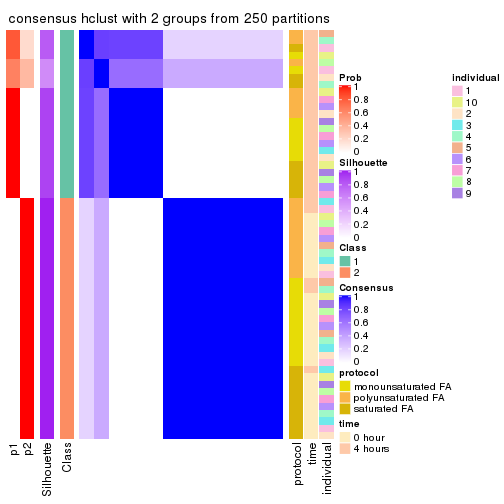</p>

</div>
<div id='tab-ATC-hclust-consensus-heatmap-2'>
<pre><code class="r">consensus_heatmap(res, k = 3)
</code></pre>

<p>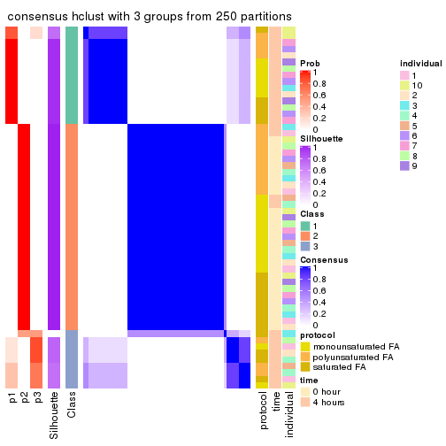</p>

</div>
<div id='tab-ATC-hclust-consensus-heatmap-3'>
<pre><code class="r">consensus_heatmap(res, k = 4)
</code></pre>

<p>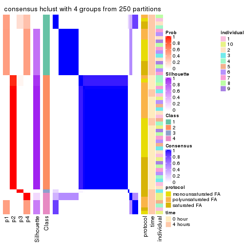</p>

</div>
<div id='tab-ATC-hclust-consensus-heatmap-4'>
<pre><code class="r">consensus_heatmap(res, k = 5)
</code></pre>

<p>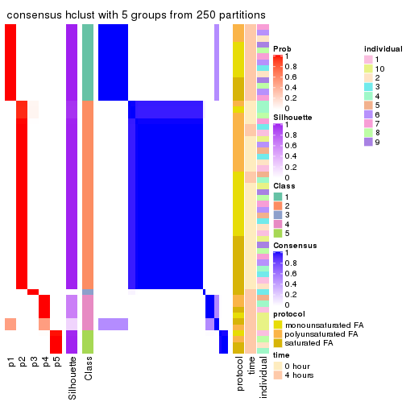</p>

</div>
<div id='tab-ATC-hclust-consensus-heatmap-5'>
<pre><code class="r">consensus_heatmap(res, k = 6)
</code></pre>

<p>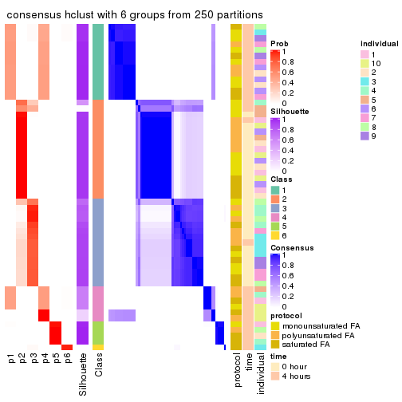</p>

</div>
</div>

Heatmaps for the membership of samples in all partitions to see how consistent they are:


<script>
$( function() {
	$( '#tabs-ATC-hclust-membership-heatmap' ).tabs();
} );
</script>
<div id='tabs-ATC-hclust-membership-heatmap'>
<ul>
<li><a href='#tab-ATC-hclust-membership-heatmap-1'>k = 2</a></li>
<li><a href='#tab-ATC-hclust-membership-heatmap-2'>k = 3</a></li>
<li><a href='#tab-ATC-hclust-membership-heatmap-3'>k = 4</a></li>
<li><a href='#tab-ATC-hclust-membership-heatmap-4'>k = 5</a></li>
<li><a href='#tab-ATC-hclust-membership-heatmap-5'>k = 6</a></li>
</ul>
<div id='tab-ATC-hclust-membership-heatmap-1'>
<pre><code class="r">membership_heatmap(res, k = 2)
</code></pre>

<p>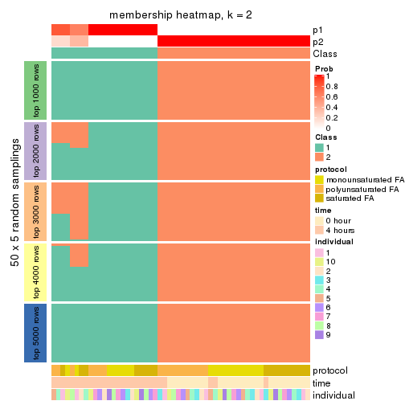</p>

</div>
<div id='tab-ATC-hclust-membership-heatmap-2'>
<pre><code class="r">membership_heatmap(res, k = 3)
</code></pre>

<p>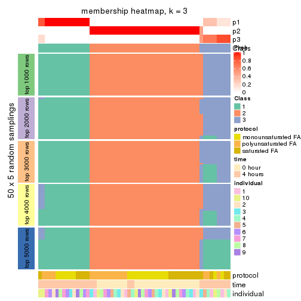</p>

</div>
<div id='tab-ATC-hclust-membership-heatmap-3'>
<pre><code class="r">membership_heatmap(res, k = 4)
</code></pre>

<p>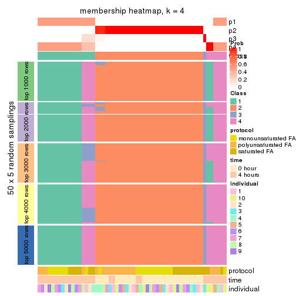</p>

</div>
<div id='tab-ATC-hclust-membership-heatmap-4'>
<pre><code class="r">membership_heatmap(res, k = 5)
</code></pre>

<p>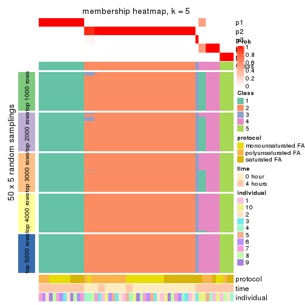</p>

</div>
<div id='tab-ATC-hclust-membership-heatmap-5'>
<pre><code class="r">membership_heatmap(res, k = 6)
</code></pre>

<p>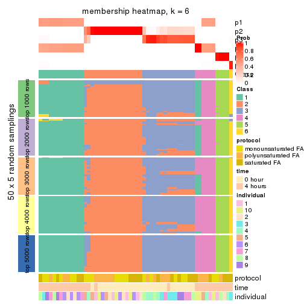</p>

</div>
</div>

As soon as we have had the classes for columns, we can look for signatures
which are significantly different between classes which can be candidate marks
for certain classes. Following are the heatmaps for signatures.


Signature heatmaps where rows are scaled:


<script>
$( function() {
	$( '#tabs-ATC-hclust-get-signatures' ).tabs();
} );
</script>
<div id='tabs-ATC-hclust-get-signatures'>
<ul>
<li><a href='#tab-ATC-hclust-get-signatures-1'>k = 2</a></li>
<li><a href='#tab-ATC-hclust-get-signatures-2'>k = 3</a></li>
<li><a href='#tab-ATC-hclust-get-signatures-3'>k = 4</a></li>
<li><a href='#tab-ATC-hclust-get-signatures-4'>k = 5</a></li>
<li><a href='#tab-ATC-hclust-get-signatures-5'>k = 6</a></li>
</ul>
<div id='tab-ATC-hclust-get-signatures-1'>
<pre><code class="r">get_signatures(res, k = 2)
</code></pre>

<p>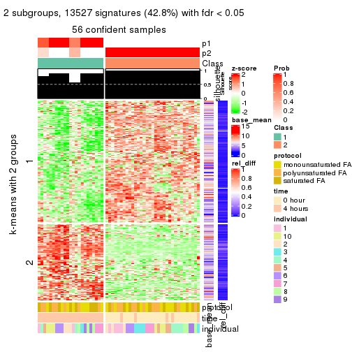</p>

</div>
<div id='tab-ATC-hclust-get-signatures-2'>
<pre><code class="r">get_signatures(res, k = 3)
</code></pre>

<p>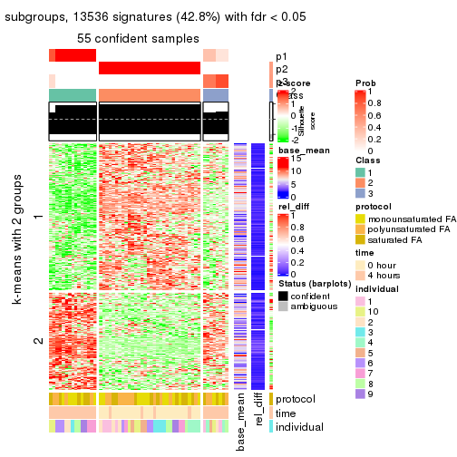</p>

</div>
<div id='tab-ATC-hclust-get-signatures-3'>
<pre><code class="r">get_signatures(res, k = 4)
</code></pre>

<p>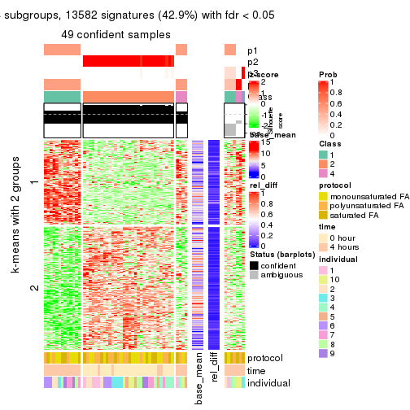</p>

</div>
<div id='tab-ATC-hclust-get-signatures-4'>
<pre><code class="r">get_signatures(res, k = 5)
</code></pre>

<p>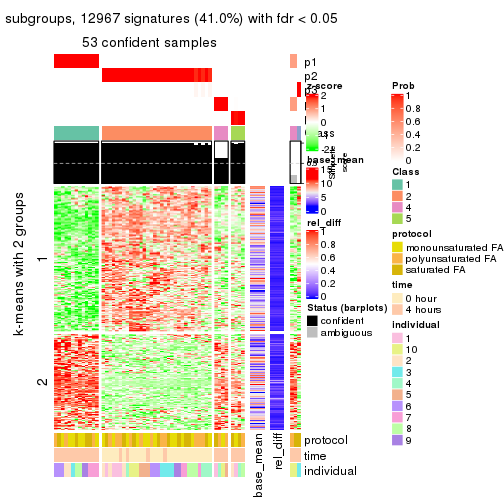</p>

</div>
<div id='tab-ATC-hclust-get-signatures-5'>
<pre><code class="r">get_signatures(res, k = 6)
</code></pre>

<p>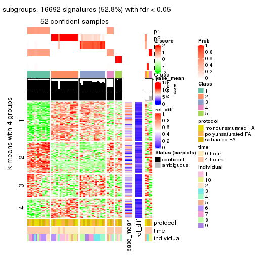</p>

</div>
</div>


Signature heatmaps where rows are not scaled:


<script>
$( function() {
	$( '#tabs-ATC-hclust-get-signatures-no-scale' ).tabs();
} );
</script>
<div id='tabs-ATC-hclust-get-signatures-no-scale'>
<ul>
<li><a href='#tab-ATC-hclust-get-signatures-no-scale-1'>k = 2</a></li>
<li><a href='#tab-ATC-hclust-get-signatures-no-scale-2'>k = 3</a></li>
<li><a href='#tab-ATC-hclust-get-signatures-no-scale-3'>k = 4</a></li>
<li><a href='#tab-ATC-hclust-get-signatures-no-scale-4'>k = 5</a></li>
<li><a href='#tab-ATC-hclust-get-signatures-no-scale-5'>k = 6</a></li>
</ul>
<div id='tab-ATC-hclust-get-signatures-no-scale-1'>
<pre><code class="r">get_signatures(res, k = 2, scale_rows = FALSE)
</code></pre>

<p>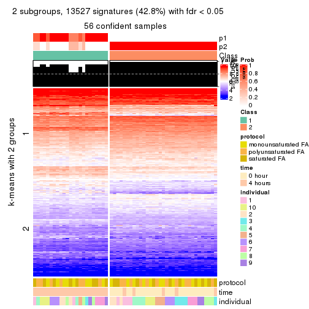</p>

</div>
<div id='tab-ATC-hclust-get-signatures-no-scale-2'>
<pre><code class="r">get_signatures(res, k = 3, scale_rows = FALSE)
</code></pre>

<p>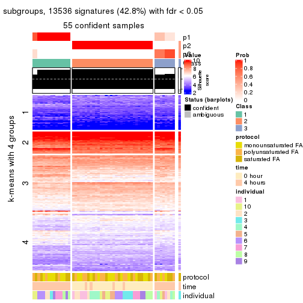</p>

</div>
<div id='tab-ATC-hclust-get-signatures-no-scale-3'>
<pre><code class="r">get_signatures(res, k = 4, scale_rows = FALSE)
</code></pre>

<p>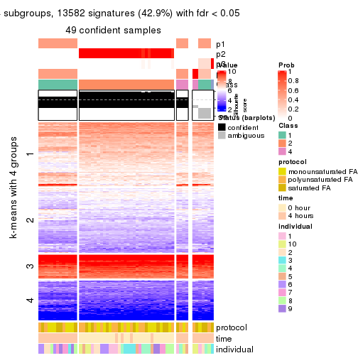</p>

</div>
<div id='tab-ATC-hclust-get-signatures-no-scale-4'>
<pre><code class="r">get_signatures(res, k = 5, scale_rows = FALSE)
</code></pre>

<p>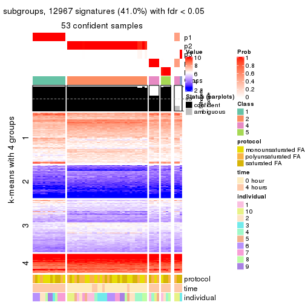</p>

</div>
<div id='tab-ATC-hclust-get-signatures-no-scale-5'>
<pre><code class="r">get_signatures(res, k = 6, scale_rows = FALSE)
</code></pre>

<p>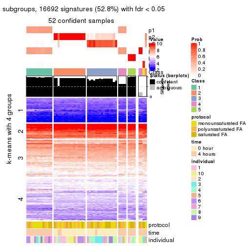</p>

</div>
</div>


Compare the overlap of signatures from different k:

```r
compare_signatures(res)
```

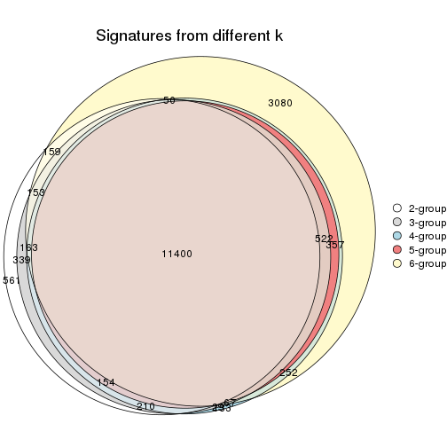

`get_signature()` returns a data frame invisibly. TO get the list of signatures, the function
call should be assigned to a variable explicitly. In following code, if `plot` argument is set
to `FALSE`, no heatmap is plotted while only the differential analysis is performed.

```r
# code only for demonstration
tb = get_signature(res, k = ..., plot = FALSE)
```

An example of the output of `tb` is:

```
#>   which_row         fdr    mean_1    mean_2 scaled_mean_1 scaled_mean_2 km
#> 1        38 0.042760348  8.373488  9.131774    -0.5533452     0.5164555  1
#> 2        40 0.018707592  7.106213  8.469186    -0.6173731     0.5762149  1
#> 3        55 0.019134737 10.221463 11.207825    -0.6159697     0.5749050  1
#> 4        59 0.006059896  5.921854  7.869574    -0.6899429     0.6439467  1
#> 5        60 0.018055526  8.928898 10.211722    -0.6204761     0.5791110  1
#> 6        98 0.009384629 15.714769 14.887706     0.6635654    -0.6193277  2
...
```

The columns in `tb` are:

1. `which_row`: row indices corresponding to the input matrix.
2. `fdr`: FDR for the differential test. 
3. `mean_x`: The mean value in group x.
4. `scaled_mean_x`: The mean value in group x after rows are scaled.
5. `km`: Row groups if k-means clustering is applied to rows.


UMAP plot which shows how samples are separated.


<script>
$( function() {
	$( '#tabs-ATC-hclust-dimension-reduction' ).tabs();
} );
</script>
<div id='tabs-ATC-hclust-dimension-reduction'>
<ul>
<li><a href='#tab-ATC-hclust-dimension-reduction-1'>k = 2</a></li>
<li><a href='#tab-ATC-hclust-dimension-reduction-2'>k = 3</a></li>
<li><a href='#tab-ATC-hclust-dimension-reduction-3'>k = 4</a></li>
<li><a href='#tab-ATC-hclust-dimension-reduction-4'>k = 5</a></li>
<li><a href='#tab-ATC-hclust-dimension-reduction-5'>k = 6</a></li>
</ul>
<div id='tab-ATC-hclust-dimension-reduction-1'>
<pre><code class="r">dimension_reduction(res, k = 2, method = &quot;UMAP&quot;)
</code></pre>

<p>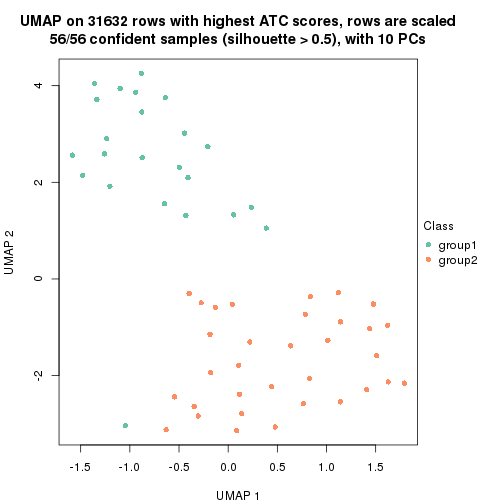</p>

</div>
<div id='tab-ATC-hclust-dimension-reduction-2'>
<pre><code class="r">dimension_reduction(res, k = 3, method = &quot;UMAP&quot;)
</code></pre>

<p>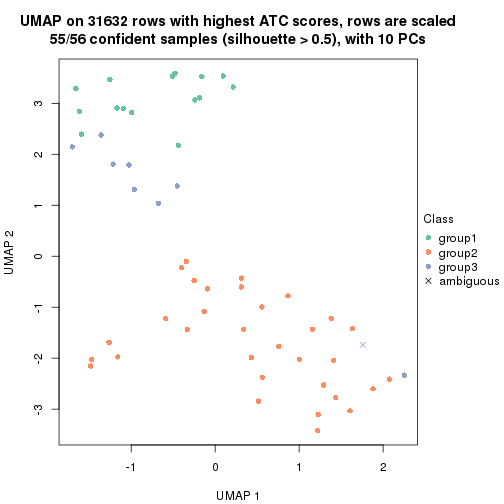</p>

</div>
<div id='tab-ATC-hclust-dimension-reduction-3'>
<pre><code class="r">dimension_reduction(res, k = 4, method = &quot;UMAP&quot;)
</code></pre>

<p>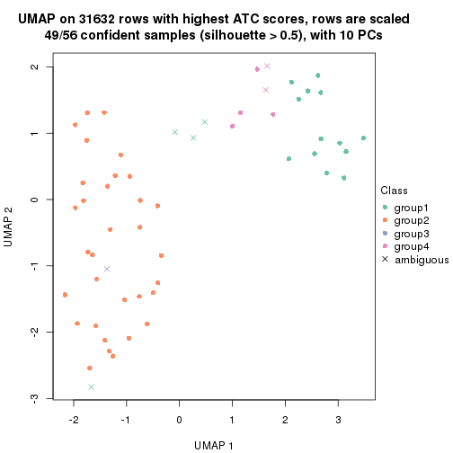</p>

</div>
<div id='tab-ATC-hclust-dimension-reduction-4'>
<pre><code class="r">dimension_reduction(res, k = 5, method = &quot;UMAP&quot;)
</code></pre>

<p>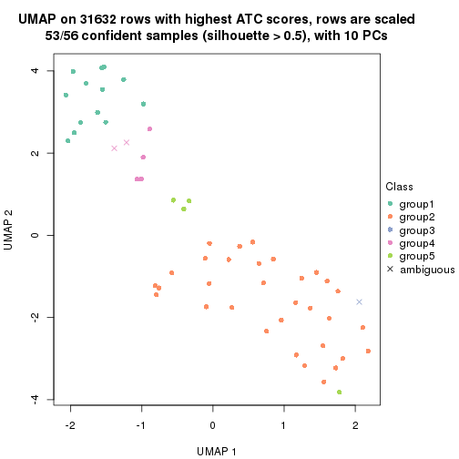</p>

</div>
<div id='tab-ATC-hclust-dimension-reduction-5'>
<pre><code class="r">dimension_reduction(res, k = 6, method = &quot;UMAP&quot;)
</code></pre>

<p>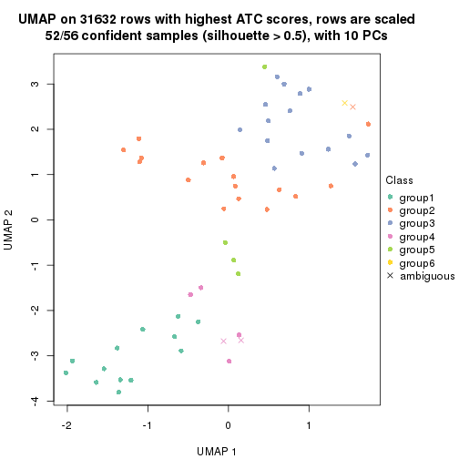</p>

</div>
</div>


Following heatmap shows how subgroups are split when increasing `k`:

```r
collect_classes(res)
```

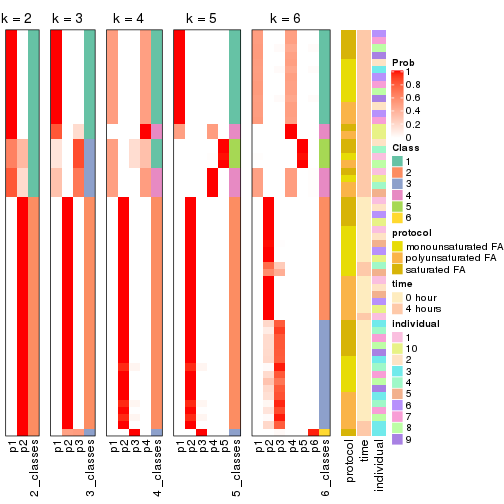


Test correlation between subgroups and known annotations. If the known
annotation is numeric, one-way ANOVA test is applied, and if the known
annotation is discrete, chi-squared contingency table test is applied.

```r
test_to_known_factors(res)
```

```
#>             n protocol(p)  time(p) individual(p) k
#> ATC:hclust 56       0.937 2.29e-09        0.9502 2
#> ATC:hclust 55       0.936 1.25e-09        0.6482 3
#> ATC:hclust 49       0.879 2.91e-08        0.5152 4
#> ATC:hclust 53       0.916 1.77e-08        0.7056 5
#> ATC:hclust 52       0.970 2.44e-08        0.0455 6
```


If matrix rows can be associated to genes, consider to use `functional_enrichment(res,
...)` to perform function enrichment for the signature genes. See [this vignette](http://bioconductor.org/packages/devel/bioc/vignettes/cola/inst/doc/functional_enrichment.html) for more detailed explanations.


 

---------------------------------------------------


### ATC:kmeans**


The object with results only for a single top-value method and a single partition method 
can be extracted as:

```r
res = res_list["ATC", "kmeans"]
# you can also extract it by
# res = res_list["ATC:kmeans"]
```

A summary of `res` and all the functions that can be applied to it:

```r
res
```

```
#> A 'ConsensusPartition' object with k = 2, 3, 4, 5, 6.
#>   On a matrix with 31632 rows and 56 columns.
#>   Top rows (1000, 2000, 3000, 4000, 5000) are extracted by 'ATC' method.
#>   Subgroups are detected by 'kmeans' method.
#>   Performed in total 1250 partitions by row resampling.
#>   Best k for subgroups seems to be 2.
#> 
#> Following methods can be applied to this 'ConsensusPartition' object:
#>  [1] "cola_report"             "collect_classes"         "collect_plots"          
#>  [4] "collect_stats"           "colnames"                "compare_signatures"     
#>  [7] "consensus_heatmap"       "dimension_reduction"     "functional_enrichment"  
#> [10] "get_anno_col"            "get_anno"                "get_classes"            
#> [13] "get_consensus"           "get_matrix"              "get_membership"         
#> [16] "get_param"               "get_signatures"          "get_stats"              
#> [19] "is_best_k"               "is_stable_k"             "membership_heatmap"     
#> [22] "ncol"                    "nrow"                    "plot_ecdf"              
#> [25] "rownames"                "select_partition_number" "show"                   
#> [28] "suggest_best_k"          "test_to_known_factors"
```

`collect_plots()` function collects all the plots made from `res` for all `k` (number of partitions)
into one single page to provide an easy and fast comparison between different `k`.

```r
collect_plots(res)
```

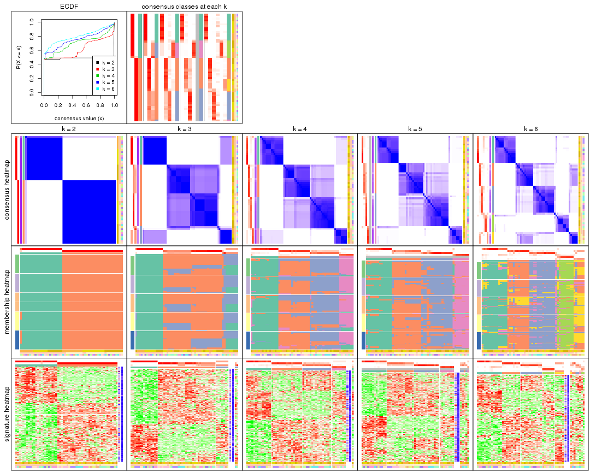

The plots are:

- The first row: a plot of the ECDF (empirical cumulative distribution
  function) curves of the consensus matrix for each `k` and the heatmap of
  predicted classes for each `k`.
- The second row: heatmaps of the consensus matrix for each `k`.
- The third row: heatmaps of the membership matrix for each `k`.
- The fouth row: heatmaps of the signatures for each `k`.

All the plots in panels can be made by individual functions and they are
plotted later in this section.

`select_partition_number()` produces several plots showing different
statistics for choosing "optimized" `k`. There are following statistics:

- ECDF curves of the consensus matrix for each `k`;
- 1-PAC. [The PAC
  score](https://en.wikipedia.org/wiki/Consensus_clustering#Over-interpretation_potential_of_consensus_clustering)
  measures the proportion of the ambiguous subgrouping.
- Mean silhouette score.
- Concordance. The mean probability of fiting the consensus class ids in all
  partitions.
- Area increased. Denote $A_k$ as the area under the ECDF curve for current
  `k`, the area increased is defined as $A_k - A_{k-1}$.
- Rand index. The percent of pairs of samples that are both in a same cluster
  or both are not in a same cluster in the partition of k and k-1.
- Jaccard index. The ratio of pairs of samples are both in a same cluster in
  the partition of k and k-1 and the pairs of samples are both in a same
  cluster in the partition k or k-1.

The detailed explanations of these statistics can be found in [the _cola_
vignette](http://bioconductor.org/packages/devel/bioc/vignettes/cola/inst/doc/cola.html#toc_13).

Generally speaking, lower PAC score, higher mean silhouette score or higher
concordance corresponds to better partition. Rand index and Jaccard index
measure how similar the current partition is compared to partition with `k-1`.
If they are too similar, we won't accept `k` is better than `k-1`.

```r
select_partition_number(res)
```

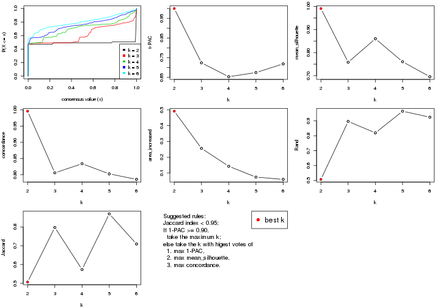

The numeric values for all these statistics can be obtained by `get_stats()`.

```r
get_stats(res)
```

```
#>   k 1-PAC mean_silhouette concordance area_increased  Rand Jaccard
#> 2 2 1.000           0.991       0.996         0.4917 0.507   0.507
#> 3 3 0.724           0.758       0.806         0.2558 0.896   0.797
#> 4 4 0.653           0.860       0.834         0.1425 0.819   0.574
#> 5 5 0.674           0.760       0.803         0.0735 0.965   0.869
#> 6 6 0.718           0.696       0.786         0.0593 0.925   0.709
```

`suggest_best_k()` suggests the best $k$ based on these statistics. The rules are as follows:

- All $k$ with Jaccard index larger than 0.95 are removed because increasing
  $k$ does not provide enough extra information. If all $k$ are removed, it is
  marked as no subgroup is detected.
- For all $k$ with 1-PAC score larger than 0.9, the maximal $k$ is taken as
  the best $k$, and other $k$ are marked as optional $k$.
- If it does not fit the second rule. The $k$ with the maximal vote of the
  highest 1-PAC score, highest mean silhouette, and highest concordance is
  taken as the best $k$.

```r
suggest_best_k(res)
```

```
#> [1] 2
```


Following shows the table of the partitions (You need to click the **show/hide
code output** link to see it). The membership matrix (columns with name `p*`)
is inferred by
[`clue::cl_consensus()`](https://www.rdocumentation.org/link/cl_consensus?package=clue)
function with the `SE` method. Basically the value in the membership matrix
represents the probability to belong to a certain group. The finall class
label for an item is determined with the group with highest probability it
belongs to.

In `get_classes()` function, the entropy is calculated from the membership
matrix and the silhouette score is calculated from the consensus matrix.


<script>
$( function() {
	$( '#tabs-ATC-kmeans-get-classes' ).tabs();
} );
</script>
<div id='tabs-ATC-kmeans-get-classes'>
<ul>
<li><a href='#tab-ATC-kmeans-get-classes-1'>k = 2</a></li>
<li><a href='#tab-ATC-kmeans-get-classes-2'>k = 3</a></li>
<li><a href='#tab-ATC-kmeans-get-classes-3'>k = 4</a></li>
<li><a href='#tab-ATC-kmeans-get-classes-4'>k = 5</a></li>
<li><a href='#tab-ATC-kmeans-get-classes-5'>k = 6</a></li>
</ul>

<div id='tab-ATC-kmeans-get-classes-1'>
<p><a id='tab-ATC-kmeans-get-classes-1-a' style='color:#0366d6' href='#'>show/hide code output</a></p>
<pre><code class="r">cbind(get_classes(res, k = 2), get_membership(res, k = 2))
</code></pre>

<pre><code>#&gt;           class entropy silhouette    p1    p2
#&gt; GSM790742     2   0.000      1.000 0.000 1.000
#&gt; GSM790744     2   0.000      1.000 0.000 1.000
#&gt; GSM790754     2   0.000      1.000 0.000 1.000
#&gt; GSM790756     2   0.000      1.000 0.000 1.000
#&gt; GSM790768     2   0.000      1.000 0.000 1.000
#&gt; GSM790774     2   0.000      1.000 0.000 1.000
#&gt; GSM790778     2   0.000      1.000 0.000 1.000
#&gt; GSM790784     2   0.000      1.000 0.000 1.000
#&gt; GSM790790     2   0.000      1.000 0.000 1.000
#&gt; GSM790743     1   0.000      0.990 1.000 0.000
#&gt; GSM790745     1   0.000      0.990 1.000 0.000
#&gt; GSM790755     2   0.000      1.000 0.000 1.000
#&gt; GSM790757     1   0.000      0.990 1.000 0.000
#&gt; GSM790769     1   0.000      0.990 1.000 0.000
#&gt; GSM790775     1   0.000      0.990 1.000 0.000
#&gt; GSM790779     1   0.000      0.990 1.000 0.000
#&gt; GSM790785     1   0.000      0.990 1.000 0.000
#&gt; GSM790791     1   0.000      0.990 1.000 0.000
#&gt; GSM790738     2   0.000      1.000 0.000 1.000
#&gt; GSM790746     2   0.000      1.000 0.000 1.000
#&gt; GSM790752     2   0.000      1.000 0.000 1.000
#&gt; GSM790758     2   0.000      1.000 0.000 1.000
#&gt; GSM790764     2   0.000      1.000 0.000 1.000
#&gt; GSM790766     2   0.000      1.000 0.000 1.000
#&gt; GSM790772     2   0.000      1.000 0.000 1.000
#&gt; GSM790782     2   0.000      1.000 0.000 1.000
#&gt; GSM790786     2   0.000      1.000 0.000 1.000
#&gt; GSM790792     2   0.000      1.000 0.000 1.000
#&gt; GSM790739     1   0.000      0.990 1.000 0.000
#&gt; GSM790747     1   0.000      0.990 1.000 0.000
#&gt; GSM790753     1   0.000      0.990 1.000 0.000
#&gt; GSM790759     2   0.000      1.000 0.000 1.000
#&gt; GSM790765     2   0.000      1.000 0.000 1.000
#&gt; GSM790767     1   0.000      0.990 1.000 0.000
#&gt; GSM790773     1   0.000      0.990 1.000 0.000
#&gt; GSM790783     1   0.000      0.990 1.000 0.000
#&gt; GSM790787     1   0.000      0.990 1.000 0.000
#&gt; GSM790793     1   0.000      0.990 1.000 0.000
#&gt; GSM790740     2   0.000      1.000 0.000 1.000
#&gt; GSM790748     2   0.000      1.000 0.000 1.000
#&gt; GSM790750     2   0.000      1.000 0.000 1.000
#&gt; GSM790760     2   0.000      1.000 0.000 1.000
#&gt; GSM790762     2   0.000      1.000 0.000 1.000
#&gt; GSM790770     2   0.000      1.000 0.000 1.000
#&gt; GSM790776     2   0.000      1.000 0.000 1.000
#&gt; GSM790780     2   0.000      1.000 0.000 1.000
#&gt; GSM790788     2   0.000      1.000 0.000 1.000
#&gt; GSM790741     2   0.000      1.000 0.000 1.000
#&gt; GSM790749     1   0.000      0.990 1.000 0.000
#&gt; GSM790751     2   0.000      1.000 0.000 1.000
#&gt; GSM790761     1   0.000      0.990 1.000 0.000
#&gt; GSM790763     1   0.000      0.990 1.000 0.000
#&gt; GSM790771     1   0.000      0.990 1.000 0.000
#&gt; GSM790777     1   0.000      0.990 1.000 0.000
#&gt; GSM790781     1   0.775      0.705 0.772 0.228
#&gt; GSM790789     1   0.000      0.990 1.000 0.000
</code></pre>

<script>
$('#tab-ATC-kmeans-get-classes-1-a').parent().next().next().hide();
$('#tab-ATC-kmeans-get-classes-1-a').click(function(){
  $('#tab-ATC-kmeans-get-classes-1-a').parent().next().next().toggle();
  return(false);
});
</script>
</div>

<div id='tab-ATC-kmeans-get-classes-2'>
<p><a id='tab-ATC-kmeans-get-classes-2-a' style='color:#0366d6' href='#'>show/hide code output</a></p>
<pre><code class="r">cbind(get_classes(res, k = 3), get_membership(res, k = 3))
</code></pre>

<pre><code>#&gt;           class entropy silhouette    p1    p2    p3
#&gt; GSM790742     2  0.0000      0.784 0.000 1.000 0.000
#&gt; GSM790744     2  0.0000      0.784 0.000 1.000 0.000
#&gt; GSM790754     2  0.6204      0.722 0.000 0.576 0.424
#&gt; GSM790756     2  0.6180      0.725 0.000 0.584 0.416
#&gt; GSM790768     2  0.0000      0.784 0.000 1.000 0.000
#&gt; GSM790774     2  0.6180      0.725 0.000 0.584 0.416
#&gt; GSM790778     2  0.6180      0.725 0.000 0.584 0.416
#&gt; GSM790784     2  0.6204      0.722 0.000 0.576 0.424
#&gt; GSM790790     2  0.1163      0.772 0.000 0.972 0.028
#&gt; GSM790743     3  0.6295      0.614 0.472 0.000 0.528
#&gt; GSM790745     3  0.6295      0.614 0.472 0.000 0.528
#&gt; GSM790755     3  0.6244     -0.613 0.000 0.440 0.560
#&gt; GSM790757     3  0.6295      0.614 0.472 0.000 0.528
#&gt; GSM790769     1  0.0000      0.979 1.000 0.000 0.000
#&gt; GSM790775     1  0.0000      0.979 1.000 0.000 0.000
#&gt; GSM790779     1  0.0000      0.979 1.000 0.000 0.000
#&gt; GSM790785     1  0.0000      0.979 1.000 0.000 0.000
#&gt; GSM790791     1  0.4399      0.598 0.812 0.000 0.188
#&gt; GSM790738     2  0.0000      0.784 0.000 1.000 0.000
#&gt; GSM790746     2  0.0000      0.784 0.000 1.000 0.000
#&gt; GSM790752     2  0.6204      0.722 0.000 0.576 0.424
#&gt; GSM790758     2  0.6252      0.707 0.000 0.556 0.444
#&gt; GSM790764     2  0.1163      0.772 0.000 0.972 0.028
#&gt; GSM790766     2  0.0237      0.784 0.000 0.996 0.004
#&gt; GSM790772     2  0.5465      0.755 0.000 0.712 0.288
#&gt; GSM790782     2  0.5016      0.762 0.000 0.760 0.240
#&gt; GSM790786     2  0.6204      0.722 0.000 0.576 0.424
#&gt; GSM790792     2  0.1163      0.772 0.000 0.972 0.028
#&gt; GSM790739     3  0.6295      0.614 0.472 0.000 0.528
#&gt; GSM790747     1  0.0000      0.979 1.000 0.000 0.000
#&gt; GSM790753     1  0.0000      0.979 1.000 0.000 0.000
#&gt; GSM790759     2  0.2066      0.786 0.000 0.940 0.060
#&gt; GSM790765     2  0.2796      0.781 0.000 0.908 0.092
#&gt; GSM790767     1  0.0000      0.979 1.000 0.000 0.000
#&gt; GSM790773     1  0.0000      0.979 1.000 0.000 0.000
#&gt; GSM790783     1  0.0000      0.979 1.000 0.000 0.000
#&gt; GSM790787     1  0.0000      0.979 1.000 0.000 0.000
#&gt; GSM790793     3  0.6295      0.614 0.472 0.000 0.528
#&gt; GSM790740     2  0.0000      0.784 0.000 1.000 0.000
#&gt; GSM790748     2  0.1529      0.786 0.000 0.960 0.040
#&gt; GSM790750     2  0.6204      0.722 0.000 0.576 0.424
#&gt; GSM790760     2  0.6252      0.707 0.000 0.556 0.444
#&gt; GSM790762     2  0.1163      0.772 0.000 0.972 0.028
#&gt; GSM790770     2  0.1163      0.772 0.000 0.972 0.028
#&gt; GSM790776     2  0.6204      0.722 0.000 0.576 0.424
#&gt; GSM790780     2  0.6252      0.707 0.000 0.556 0.444
#&gt; GSM790788     2  0.1163      0.772 0.000 0.972 0.028
#&gt; GSM790741     2  0.0000      0.784 0.000 1.000 0.000
#&gt; GSM790749     1  0.0000      0.979 1.000 0.000 0.000
#&gt; GSM790751     2  0.6111      0.731 0.000 0.604 0.396
#&gt; GSM790761     3  0.6295      0.614 0.472 0.000 0.528
#&gt; GSM790763     3  0.6295      0.614 0.472 0.000 0.528
#&gt; GSM790771     1  0.0000      0.979 1.000 0.000 0.000
#&gt; GSM790777     1  0.0000      0.979 1.000 0.000 0.000
#&gt; GSM790781     3  0.2414      0.348 0.040 0.020 0.940
#&gt; GSM790789     1  0.0000      0.979 1.000 0.000 0.000
</code></pre>

<script>
$('#tab-ATC-kmeans-get-classes-2-a').parent().next().next().hide();
$('#tab-ATC-kmeans-get-classes-2-a').click(function(){
  $('#tab-ATC-kmeans-get-classes-2-a').parent().next().next().toggle();
  return(false);
});
</script>
</div>

<div id='tab-ATC-kmeans-get-classes-3'>
<p><a id='tab-ATC-kmeans-get-classes-3-a' style='color:#0366d6' href='#'>show/hide code output</a></p>
<pre><code class="r">cbind(get_classes(res, k = 4), get_membership(res, k = 4))
</code></pre>

<pre><code>#&gt;           class entropy silhouette    p1    p2    p3    p4
#&gt; GSM790742     2  0.2563     0.8642 0.000 0.908 0.072 0.020
#&gt; GSM790744     2  0.1867     0.8715 0.000 0.928 0.072 0.000
#&gt; GSM790754     3  0.4304     0.9222 0.000 0.284 0.716 0.000
#&gt; GSM790756     3  0.4401     0.9234 0.000 0.272 0.724 0.004
#&gt; GSM790768     2  0.2053     0.8704 0.000 0.924 0.072 0.004
#&gt; GSM790774     3  0.4539     0.9245 0.000 0.272 0.720 0.008
#&gt; GSM790778     3  0.4539     0.9245 0.000 0.272 0.720 0.008
#&gt; GSM790784     3  0.4539     0.9245 0.000 0.272 0.720 0.008
#&gt; GSM790790     2  0.2345     0.8269 0.000 0.900 0.000 0.100
#&gt; GSM790743     4  0.2999     0.9376 0.132 0.000 0.004 0.864
#&gt; GSM790745     4  0.4462     0.9346 0.132 0.000 0.064 0.804
#&gt; GSM790755     3  0.3547     0.6698 0.000 0.064 0.864 0.072
#&gt; GSM790757     4  0.4462     0.9346 0.132 0.000 0.064 0.804
#&gt; GSM790769     1  0.1716     0.9113 0.936 0.000 0.064 0.000
#&gt; GSM790775     1  0.0000     0.9147 1.000 0.000 0.000 0.000
#&gt; GSM790779     1  0.1118     0.9105 0.964 0.000 0.036 0.000
#&gt; GSM790785     1  0.0188     0.9145 0.996 0.000 0.004 0.000
#&gt; GSM790791     1  0.7140     0.0624 0.464 0.000 0.132 0.404
#&gt; GSM790738     2  0.1867     0.8715 0.000 0.928 0.072 0.000
#&gt; GSM790746     2  0.1867     0.8715 0.000 0.928 0.072 0.000
#&gt; GSM790752     3  0.4535     0.9173 0.000 0.292 0.704 0.004
#&gt; GSM790758     3  0.4088     0.8990 0.000 0.232 0.764 0.004
#&gt; GSM790764     2  0.2704     0.8208 0.000 0.876 0.000 0.124
#&gt; GSM790766     2  0.2197     0.8659 0.000 0.916 0.080 0.004
#&gt; GSM790772     3  0.5110     0.8811 0.000 0.328 0.656 0.016
#&gt; GSM790782     3  0.5193     0.7394 0.000 0.412 0.580 0.008
#&gt; GSM790786     3  0.4539     0.9245 0.000 0.272 0.720 0.008
#&gt; GSM790792     2  0.2345     0.8269 0.000 0.900 0.000 0.100
#&gt; GSM790739     4  0.4534     0.9340 0.132 0.000 0.068 0.800
#&gt; GSM790747     1  0.1716     0.9113 0.936 0.000 0.064 0.000
#&gt; GSM790753     1  0.2542     0.9002 0.904 0.000 0.084 0.012
#&gt; GSM790759     2  0.4501     0.6342 0.000 0.764 0.212 0.024
#&gt; GSM790765     2  0.5507     0.6136 0.000 0.732 0.156 0.112
#&gt; GSM790767     1  0.2647     0.8988 0.880 0.000 0.120 0.000
#&gt; GSM790773     1  0.0000     0.9147 1.000 0.000 0.000 0.000
#&gt; GSM790783     1  0.0000     0.9147 1.000 0.000 0.000 0.000
#&gt; GSM790787     1  0.1792     0.9041 0.932 0.000 0.068 0.000
#&gt; GSM790793     4  0.2999     0.9386 0.132 0.000 0.004 0.864
#&gt; GSM790740     2  0.1867     0.8715 0.000 0.928 0.072 0.000
#&gt; GSM790748     2  0.3606     0.7921 0.000 0.844 0.132 0.024
#&gt; GSM790750     3  0.4483     0.9217 0.000 0.284 0.712 0.004
#&gt; GSM790760     3  0.4576     0.8964 0.000 0.232 0.748 0.020
#&gt; GSM790762     2  0.2345     0.8269 0.000 0.900 0.000 0.100
#&gt; GSM790770     2  0.0921     0.8478 0.000 0.972 0.000 0.028
#&gt; GSM790776     3  0.4983     0.9182 0.000 0.272 0.704 0.024
#&gt; GSM790780     3  0.4228     0.8990 0.000 0.232 0.760 0.008
#&gt; GSM790788     2  0.2345     0.8269 0.000 0.900 0.000 0.100
#&gt; GSM790741     2  0.1867     0.8715 0.000 0.928 0.072 0.000
#&gt; GSM790749     1  0.1716     0.9113 0.936 0.000 0.064 0.000
#&gt; GSM790751     3  0.4761     0.8218 0.000 0.372 0.628 0.000
#&gt; GSM790761     4  0.2999     0.9376 0.132 0.000 0.004 0.864
#&gt; GSM790763     4  0.2999     0.9386 0.132 0.000 0.004 0.864
#&gt; GSM790771     1  0.2281     0.9053 0.904 0.000 0.096 0.000
#&gt; GSM790777     1  0.0000     0.9147 1.000 0.000 0.000 0.000
#&gt; GSM790781     4  0.4053     0.7795 0.004 0.000 0.228 0.768
#&gt; GSM790789     1  0.4312     0.8547 0.812 0.000 0.132 0.056
</code></pre>

<script>
$('#tab-ATC-kmeans-get-classes-3-a').parent().next().next().hide();
$('#tab-ATC-kmeans-get-classes-3-a').click(function(){
  $('#tab-ATC-kmeans-get-classes-3-a').parent().next().next().toggle();
  return(false);
});
</script>
</div>

<div id='tab-ATC-kmeans-get-classes-4'>
<p><a id='tab-ATC-kmeans-get-classes-4-a' style='color:#0366d6' href='#'>show/hide code output</a></p>
<pre><code class="r">cbind(get_classes(res, k = 5), get_membership(res, k = 5))
</code></pre>

<pre><code>#&gt;           class entropy silhouette    p1    p2    p3    p4 p5
#&gt; GSM790742     2  0.4508      0.759 0.000 0.708 0.256 0.004 NA
#&gt; GSM790744     2  0.3508      0.775 0.000 0.748 0.252 0.000 NA
#&gt; GSM790754     3  0.1750      0.819 0.000 0.028 0.936 0.000 NA
#&gt; GSM790756     3  0.1872      0.815 0.000 0.020 0.928 0.000 NA
#&gt; GSM790768     2  0.3910      0.775 0.000 0.740 0.248 0.008 NA
#&gt; GSM790774     3  0.0566      0.819 0.000 0.012 0.984 0.000 NA
#&gt; GSM790778     3  0.0566      0.819 0.000 0.012 0.984 0.000 NA
#&gt; GSM790784     3  0.0566      0.819 0.000 0.012 0.984 0.000 NA
#&gt; GSM790790     2  0.6144      0.639 0.000 0.548 0.172 0.000 NA
#&gt; GSM790743     4  0.1518      0.871 0.012 0.020 0.000 0.952 NA
#&gt; GSM790745     4  0.2520      0.871 0.012 0.004 0.000 0.888 NA
#&gt; GSM790755     3  0.4747      0.440 0.000 0.000 0.500 0.016 NA
#&gt; GSM790757     4  0.2520      0.871 0.012 0.004 0.000 0.888 NA
#&gt; GSM790769     1  0.3346      0.892 0.844 0.092 0.000 0.000 NA
#&gt; GSM790775     1  0.0000      0.909 1.000 0.000 0.000 0.000 NA
#&gt; GSM790779     1  0.1106      0.903 0.964 0.012 0.000 0.000 NA
#&gt; GSM790785     1  0.0000      0.909 1.000 0.000 0.000 0.000 NA
#&gt; GSM790791     4  0.7111      0.248 0.280 0.040 0.000 0.496 NA
#&gt; GSM790738     2  0.3424      0.777 0.000 0.760 0.240 0.000 NA
#&gt; GSM790746     2  0.3452      0.777 0.000 0.756 0.244 0.000 NA
#&gt; GSM790752     3  0.1725      0.817 0.000 0.020 0.936 0.000 NA
#&gt; GSM790758     3  0.3635      0.717 0.000 0.004 0.748 0.000 NA
#&gt; GSM790764     2  0.6472      0.620 0.000 0.504 0.184 0.004 NA
#&gt; GSM790766     2  0.4240      0.722 0.000 0.684 0.304 0.008 NA
#&gt; GSM790772     3  0.0963      0.810 0.000 0.036 0.964 0.000 NA
#&gt; GSM790782     3  0.2179      0.739 0.000 0.112 0.888 0.000 NA
#&gt; GSM790786     3  0.0566      0.819 0.000 0.012 0.984 0.000 NA
#&gt; GSM790792     2  0.6144      0.639 0.000 0.548 0.172 0.000 NA
#&gt; GSM790739     4  0.2575      0.870 0.012 0.004 0.000 0.884 NA
#&gt; GSM790747     1  0.3346      0.892 0.844 0.092 0.000 0.000 NA
#&gt; GSM790753     1  0.3416      0.871 0.852 0.020 0.000 0.032 NA
#&gt; GSM790759     2  0.5499      0.466 0.000 0.532 0.400 0.000 NA
#&gt; GSM790765     3  0.6684     -0.106 0.000 0.252 0.476 0.004 NA
#&gt; GSM790767     1  0.4016      0.881 0.796 0.092 0.000 0.000 NA
#&gt; GSM790773     1  0.0000      0.909 1.000 0.000 0.000 0.000 NA
#&gt; GSM790783     1  0.0000      0.909 1.000 0.000 0.000 0.000 NA
#&gt; GSM790787     1  0.2172      0.892 0.908 0.016 0.000 0.000 NA
#&gt; GSM790793     4  0.2198      0.864 0.012 0.020 0.000 0.920 NA
#&gt; GSM790740     2  0.3480      0.776 0.000 0.752 0.248 0.000 NA
#&gt; GSM790748     2  0.5147      0.723 0.000 0.664 0.264 0.004 NA
#&gt; GSM790750     3  0.1725      0.817 0.000 0.020 0.936 0.000 NA
#&gt; GSM790760     3  0.3809      0.711 0.000 0.008 0.736 0.000 NA
#&gt; GSM790762     2  0.6144      0.639 0.000 0.548 0.172 0.000 NA
#&gt; GSM790770     2  0.4230      0.736 0.000 0.776 0.168 0.008 NA
#&gt; GSM790776     3  0.1544      0.814 0.000 0.000 0.932 0.000 NA
#&gt; GSM790780     3  0.2179      0.789 0.000 0.004 0.896 0.000 NA
#&gt; GSM790788     2  0.6144      0.639 0.000 0.548 0.172 0.000 NA
#&gt; GSM790741     2  0.3480      0.776 0.000 0.752 0.248 0.000 NA
#&gt; GSM790749     1  0.3346      0.892 0.844 0.092 0.000 0.000 NA
#&gt; GSM790751     3  0.4661      0.345 0.000 0.312 0.656 0.000 NA
#&gt; GSM790761     4  0.1518      0.871 0.012 0.020 0.000 0.952 NA
#&gt; GSM790763     4  0.2198      0.864 0.012 0.020 0.000 0.920 NA
#&gt; GSM790771     1  0.3648      0.887 0.824 0.092 0.000 0.000 NA
#&gt; GSM790777     1  0.0000      0.909 1.000 0.000 0.000 0.000 NA
#&gt; GSM790781     4  0.4121      0.790 0.000 0.004 0.012 0.720 NA
#&gt; GSM790789     1  0.5884      0.765 0.676 0.060 0.000 0.080 NA
</code></pre>

<script>
$('#tab-ATC-kmeans-get-classes-4-a').parent().next().next().hide();
$('#tab-ATC-kmeans-get-classes-4-a').click(function(){
  $('#tab-ATC-kmeans-get-classes-4-a').parent().next().next().toggle();
  return(false);
});
</script>
</div>

<div id='tab-ATC-kmeans-get-classes-5'>
<p><a id='tab-ATC-kmeans-get-classes-5-a' style='color:#0366d6' href='#'>show/hide code output</a></p>
<pre><code class="r">cbind(get_classes(res, k = 6), get_membership(res, k = 6))
</code></pre>

<pre><code>#&gt;           class entropy silhouette    p1    p2    p3    p4    p5    p6
#&gt; GSM790742     2  0.2046      0.729 0.000 0.916 0.008 0.032 0.000 0.044
#&gt; GSM790744     2  0.1092      0.769 0.000 0.960 0.020 0.000 0.000 0.020
#&gt; GSM790754     3  0.3065      0.811 0.000 0.088 0.852 0.048 0.000 0.012
#&gt; GSM790756     3  0.4312      0.737 0.000 0.092 0.748 0.148 0.000 0.012
#&gt; GSM790768     2  0.1257      0.758 0.000 0.952 0.020 0.028 0.000 0.000
#&gt; GSM790774     3  0.1753      0.817 0.000 0.084 0.912 0.000 0.000 0.004
#&gt; GSM790778     3  0.1753      0.817 0.000 0.084 0.912 0.000 0.000 0.004
#&gt; GSM790784     3  0.1753      0.817 0.000 0.084 0.912 0.000 0.000 0.004
#&gt; GSM790790     6  0.3857      0.775 0.000 0.468 0.000 0.000 0.000 0.532
#&gt; GSM790743     5  0.1970      0.768 0.000 0.000 0.000 0.028 0.912 0.060
#&gt; GSM790745     5  0.2384      0.767 0.000 0.000 0.000 0.048 0.888 0.064
#&gt; GSM790755     4  0.6482      0.000 0.000 0.000 0.340 0.404 0.024 0.232
#&gt; GSM790757     5  0.2384      0.767 0.000 0.000 0.000 0.048 0.888 0.064
#&gt; GSM790769     1  0.3050      0.819 0.764 0.000 0.000 0.236 0.000 0.000
#&gt; GSM790775     1  0.0260      0.844 0.992 0.000 0.000 0.008 0.000 0.000
#&gt; GSM790779     1  0.1625      0.832 0.928 0.000 0.012 0.060 0.000 0.000
#&gt; GSM790785     1  0.0260      0.843 0.992 0.000 0.000 0.008 0.000 0.000
#&gt; GSM790791     5  0.6881      0.311 0.160 0.000 0.000 0.284 0.460 0.096
#&gt; GSM790738     2  0.1003      0.766 0.000 0.964 0.016 0.000 0.000 0.020
#&gt; GSM790746     2  0.1364      0.763 0.000 0.952 0.016 0.012 0.000 0.020
#&gt; GSM790752     3  0.3718      0.796 0.000 0.088 0.808 0.088 0.000 0.016
#&gt; GSM790758     3  0.5107      0.251 0.000 0.040 0.620 0.300 0.000 0.040
#&gt; GSM790764     6  0.5277      0.632 0.000 0.364 0.000 0.108 0.000 0.528
#&gt; GSM790766     2  0.2361      0.711 0.000 0.884 0.088 0.028 0.000 0.000
#&gt; GSM790772     3  0.2212      0.801 0.000 0.112 0.880 0.000 0.000 0.008
#&gt; GSM790782     3  0.2944      0.748 0.000 0.148 0.832 0.012 0.000 0.008
#&gt; GSM790786     3  0.1753      0.817 0.000 0.084 0.912 0.000 0.000 0.004
#&gt; GSM790792     6  0.3857      0.775 0.000 0.468 0.000 0.000 0.000 0.532
#&gt; GSM790739     5  0.2499      0.766 0.000 0.000 0.000 0.048 0.880 0.072
#&gt; GSM790747     1  0.3163      0.819 0.764 0.000 0.004 0.232 0.000 0.000
#&gt; GSM790753     1  0.5022      0.754 0.724 0.000 0.012 0.148 0.056 0.060
#&gt; GSM790759     2  0.4940      0.523 0.000 0.720 0.120 0.108 0.000 0.052
#&gt; GSM790765     6  0.6334      0.195 0.000 0.172 0.380 0.028 0.000 0.420
#&gt; GSM790767     1  0.3725      0.795 0.676 0.000 0.000 0.316 0.000 0.008
#&gt; GSM790773     1  0.0000      0.844 1.000 0.000 0.000 0.000 0.000 0.000
#&gt; GSM790783     1  0.0000      0.844 1.000 0.000 0.000 0.000 0.000 0.000
#&gt; GSM790787     1  0.3259      0.812 0.836 0.000 0.012 0.104 0.000 0.048
#&gt; GSM790793     5  0.2325      0.762 0.000 0.000 0.000 0.060 0.892 0.048
#&gt; GSM790740     2  0.1092      0.769 0.000 0.960 0.020 0.000 0.000 0.020
#&gt; GSM790748     2  0.3591      0.642 0.000 0.812 0.016 0.120 0.000 0.052
#&gt; GSM790750     3  0.3668      0.796 0.000 0.084 0.812 0.088 0.000 0.016
#&gt; GSM790760     3  0.5711      0.154 0.000 0.048 0.580 0.292 0.000 0.080
#&gt; GSM790762     6  0.3857      0.775 0.000 0.468 0.000 0.000 0.000 0.532
#&gt; GSM790770     2  0.2831      0.474 0.000 0.840 0.000 0.024 0.000 0.136
#&gt; GSM790776     3  0.5108      0.689 0.000 0.104 0.704 0.136 0.000 0.056
#&gt; GSM790780     3  0.0935      0.764 0.000 0.032 0.964 0.004 0.000 0.000
#&gt; GSM790788     6  0.3857      0.775 0.000 0.468 0.000 0.000 0.000 0.532
#&gt; GSM790741     2  0.1092      0.769 0.000 0.960 0.020 0.000 0.000 0.020
#&gt; GSM790749     1  0.3163      0.819 0.764 0.000 0.004 0.232 0.000 0.000
#&gt; GSM790751     2  0.5110      0.140 0.000 0.552 0.380 0.052 0.000 0.016
#&gt; GSM790761     5  0.1970      0.768 0.000 0.000 0.000 0.028 0.912 0.060
#&gt; GSM790763     5  0.2325      0.762 0.000 0.000 0.000 0.060 0.892 0.048
#&gt; GSM790771     1  0.3383      0.810 0.728 0.000 0.000 0.268 0.000 0.004
#&gt; GSM790777     1  0.0000      0.844 1.000 0.000 0.000 0.000 0.000 0.000
#&gt; GSM790781     5  0.5741      0.423 0.000 0.000 0.008 0.208 0.556 0.228
#&gt; GSM790789     1  0.6277      0.629 0.520 0.000 0.000 0.308 0.084 0.088
</code></pre>

<script>
$('#tab-ATC-kmeans-get-classes-5-a').parent().next().next().hide();
$('#tab-ATC-kmeans-get-classes-5-a').click(function(){
  $('#tab-ATC-kmeans-get-classes-5-a').parent().next().next().toggle();
  return(false);
});
</script>
</div>
</div>

Heatmaps for the consensus matrix. It visualizes the probability of two
samples to be in a same group.


<script>
$( function() {
	$( '#tabs-ATC-kmeans-consensus-heatmap' ).tabs();
} );
</script>
<div id='tabs-ATC-kmeans-consensus-heatmap'>
<ul>
<li><a href='#tab-ATC-kmeans-consensus-heatmap-1'>k = 2</a></li>
<li><a href='#tab-ATC-kmeans-consensus-heatmap-2'>k = 3</a></li>
<li><a href='#tab-ATC-kmeans-consensus-heatmap-3'>k = 4</a></li>
<li><a href='#tab-ATC-kmeans-consensus-heatmap-4'>k = 5</a></li>
<li><a href='#tab-ATC-kmeans-consensus-heatmap-5'>k = 6</a></li>
</ul>
<div id='tab-ATC-kmeans-consensus-heatmap-1'>
<pre><code class="r">consensus_heatmap(res, k = 2)
</code></pre>

<p>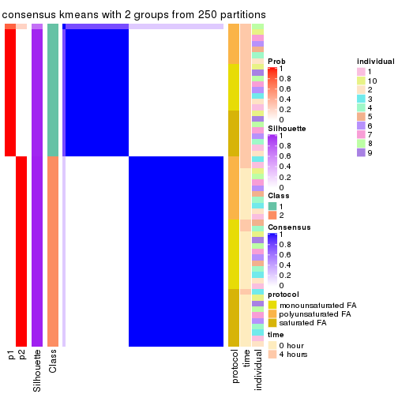</p>

</div>
<div id='tab-ATC-kmeans-consensus-heatmap-2'>
<pre><code class="r">consensus_heatmap(res, k = 3)
</code></pre>

<p>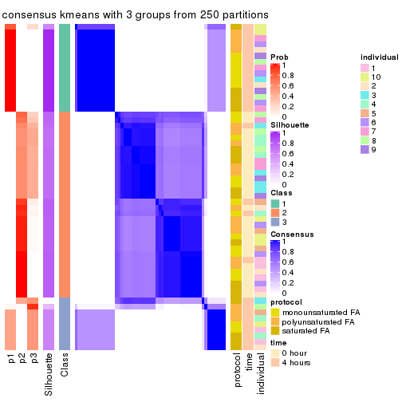</p>

</div>
<div id='tab-ATC-kmeans-consensus-heatmap-3'>
<pre><code class="r">consensus_heatmap(res, k = 4)
</code></pre>

<p>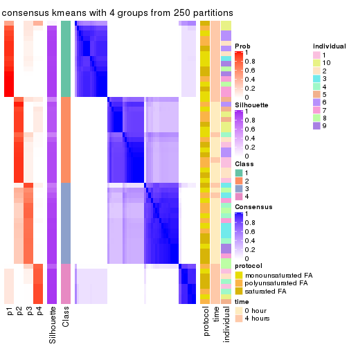</p>

</div>
<div id='tab-ATC-kmeans-consensus-heatmap-4'>
<pre><code class="r">consensus_heatmap(res, k = 5)
</code></pre>

<p>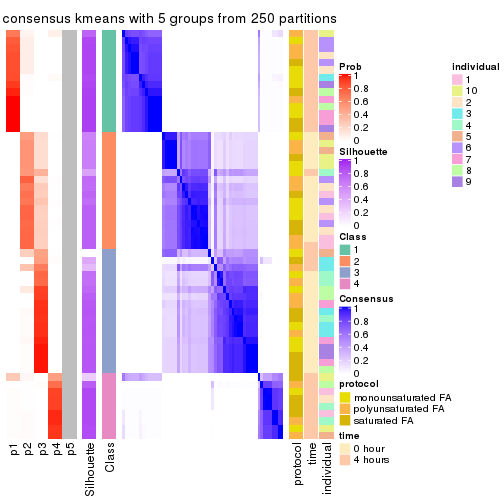</p>

</div>
<div id='tab-ATC-kmeans-consensus-heatmap-5'>
<pre><code class="r">consensus_heatmap(res, k = 6)
</code></pre>

<p>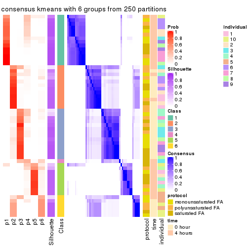</p>

</div>
</div>

Heatmaps for the membership of samples in all partitions to see how consistent they are:


<script>
$( function() {
	$( '#tabs-ATC-kmeans-membership-heatmap' ).tabs();
} );
</script>
<div id='tabs-ATC-kmeans-membership-heatmap'>
<ul>
<li><a href='#tab-ATC-kmeans-membership-heatmap-1'>k = 2</a></li>
<li><a href='#tab-ATC-kmeans-membership-heatmap-2'>k = 3</a></li>
<li><a href='#tab-ATC-kmeans-membership-heatmap-3'>k = 4</a></li>
<li><a href='#tab-ATC-kmeans-membership-heatmap-4'>k = 5</a></li>
<li><a href='#tab-ATC-kmeans-membership-heatmap-5'>k = 6</a></li>
</ul>
<div id='tab-ATC-kmeans-membership-heatmap-1'>
<pre><code class="r">membership_heatmap(res, k = 2)
</code></pre>

<p>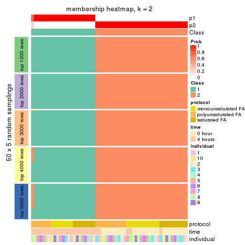</p>

</div>
<div id='tab-ATC-kmeans-membership-heatmap-2'>
<pre><code class="r">membership_heatmap(res, k = 3)
</code></pre>

<p>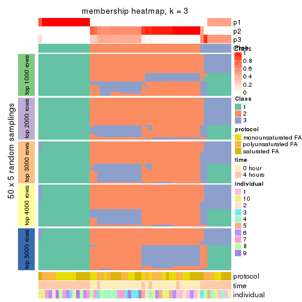</p>

</div>
<div id='tab-ATC-kmeans-membership-heatmap-3'>
<pre><code class="r">membership_heatmap(res, k = 4)
</code></pre>

<p>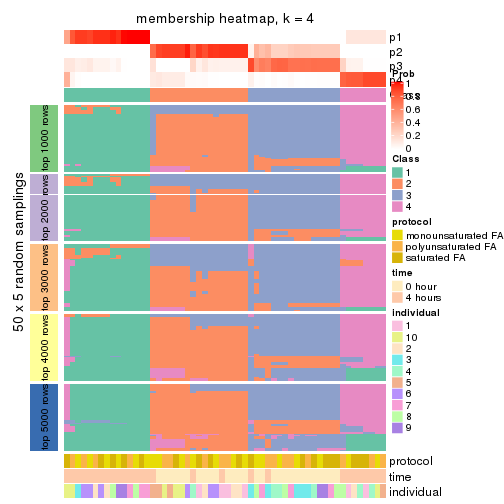</p>

</div>
<div id='tab-ATC-kmeans-membership-heatmap-4'>
<pre><code class="r">membership_heatmap(res, k = 5)
</code></pre>

<p>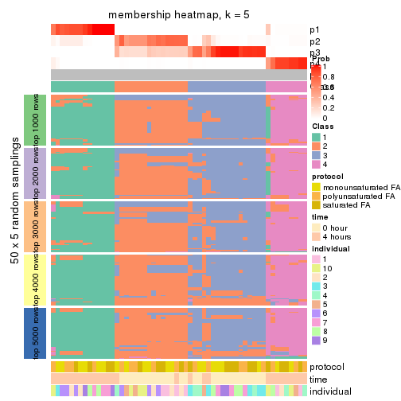</p>

</div>
<div id='tab-ATC-kmeans-membership-heatmap-5'>
<pre><code class="r">membership_heatmap(res, k = 6)
</code></pre>

<p>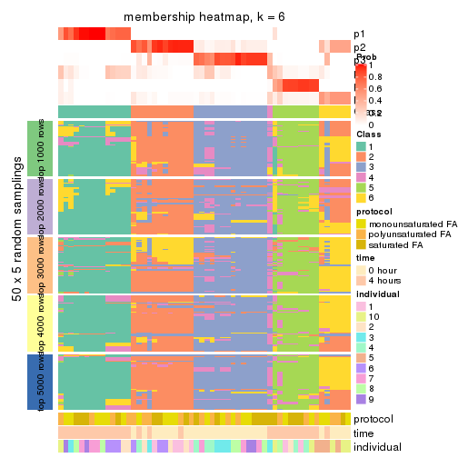</p>

</div>
</div>

As soon as we have had the classes for columns, we can look for signatures
which are significantly different between classes which can be candidate marks
for certain classes. Following are the heatmaps for signatures.


Signature heatmaps where rows are scaled:


<script>
$( function() {
	$( '#tabs-ATC-kmeans-get-signatures' ).tabs();
} );
</script>
<div id='tabs-ATC-kmeans-get-signatures'>
<ul>
<li><a href='#tab-ATC-kmeans-get-signatures-1'>k = 2</a></li>
<li><a href='#tab-ATC-kmeans-get-signatures-2'>k = 3</a></li>
<li><a href='#tab-ATC-kmeans-get-signatures-3'>k = 4</a></li>
<li><a href='#tab-ATC-kmeans-get-signatures-4'>k = 5</a></li>
<li><a href='#tab-ATC-kmeans-get-signatures-5'>k = 6</a></li>
</ul>
<div id='tab-ATC-kmeans-get-signatures-1'>
<pre><code class="r">get_signatures(res, k = 2)
</code></pre>

<p>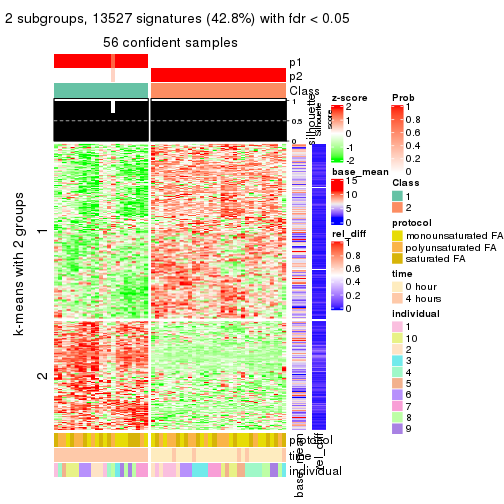</p>

</div>
<div id='tab-ATC-kmeans-get-signatures-2'>
<pre><code class="r">get_signatures(res, k = 3)
</code></pre>

<p>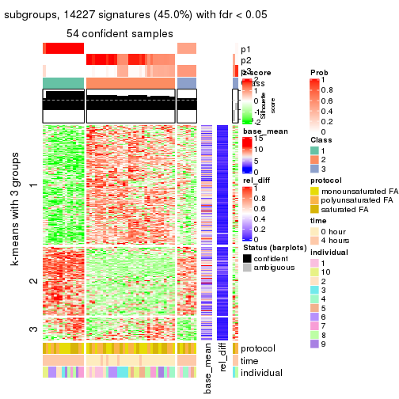</p>

</div>
<div id='tab-ATC-kmeans-get-signatures-3'>
<pre><code class="r">get_signatures(res, k = 4)
</code></pre>

<p>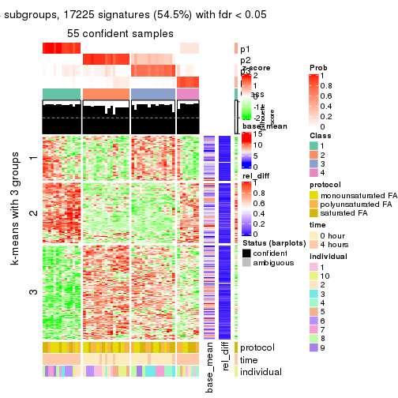</p>

</div>
<div id='tab-ATC-kmeans-get-signatures-4'>
<pre><code class="r">get_signatures(res, k = 5)
</code></pre>

<p>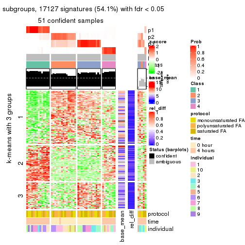</p>

</div>
<div id='tab-ATC-kmeans-get-signatures-5'>
<pre><code class="r">get_signatures(res, k = 6)
</code></pre>

<p>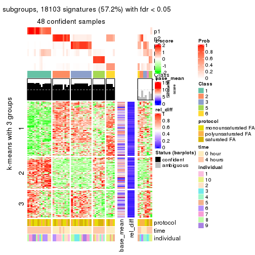</p>

</div>
</div>


Signature heatmaps where rows are not scaled:


<script>
$( function() {
	$( '#tabs-ATC-kmeans-get-signatures-no-scale' ).tabs();
} );
</script>
<div id='tabs-ATC-kmeans-get-signatures-no-scale'>
<ul>
<li><a href='#tab-ATC-kmeans-get-signatures-no-scale-1'>k = 2</a></li>
<li><a href='#tab-ATC-kmeans-get-signatures-no-scale-2'>k = 3</a></li>
<li><a href='#tab-ATC-kmeans-get-signatures-no-scale-3'>k = 4</a></li>
<li><a href='#tab-ATC-kmeans-get-signatures-no-scale-4'>k = 5</a></li>
<li><a href='#tab-ATC-kmeans-get-signatures-no-scale-5'>k = 6</a></li>
</ul>
<div id='tab-ATC-kmeans-get-signatures-no-scale-1'>
<pre><code class="r">get_signatures(res, k = 2, scale_rows = FALSE)
</code></pre>

<p>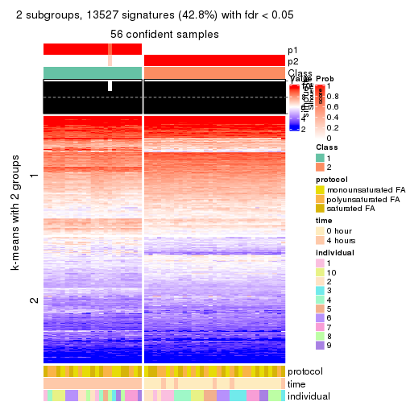</p>

</div>
<div id='tab-ATC-kmeans-get-signatures-no-scale-2'>
<pre><code class="r">get_signatures(res, k = 3, scale_rows = FALSE)
</code></pre>

<p>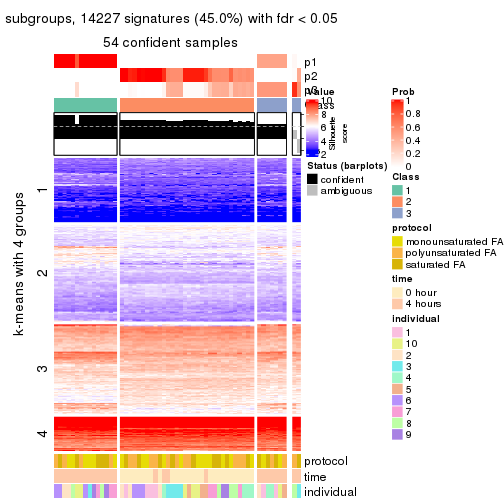</p>

</div>
<div id='tab-ATC-kmeans-get-signatures-no-scale-3'>
<pre><code class="r">get_signatures(res, k = 4, scale_rows = FALSE)
</code></pre>

<p>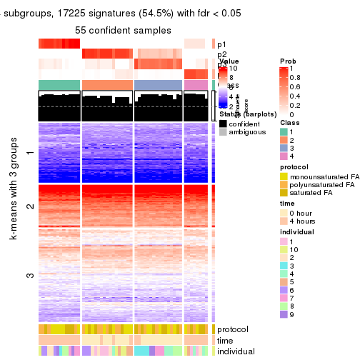</p>

</div>
<div id='tab-ATC-kmeans-get-signatures-no-scale-4'>
<pre><code class="r">get_signatures(res, k = 5, scale_rows = FALSE)
</code></pre>

<p>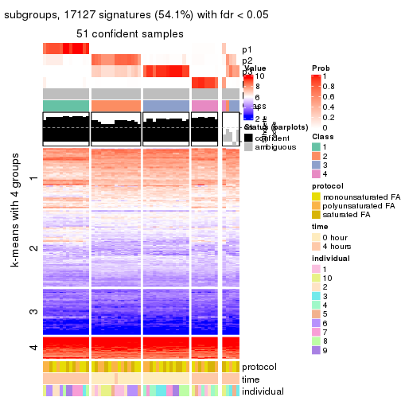</p>

</div>
<div id='tab-ATC-kmeans-get-signatures-no-scale-5'>
<pre><code class="r">get_signatures(res, k = 6, scale_rows = FALSE)
</code></pre>

<p>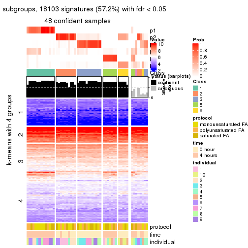</p>

</div>
</div>


Compare the overlap of signatures from different k:

```r
compare_signatures(res)
```

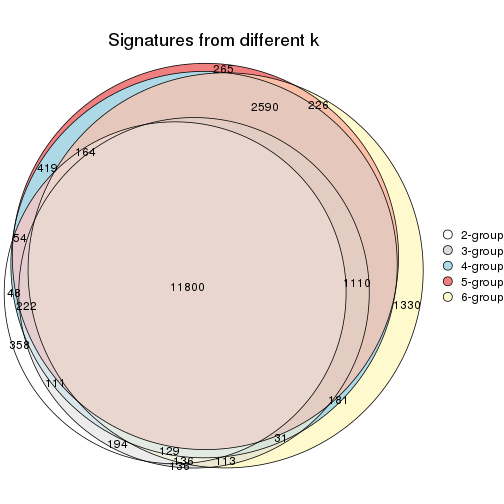

`get_signature()` returns a data frame invisibly. TO get the list of signatures, the function
call should be assigned to a variable explicitly. In following code, if `plot` argument is set
to `FALSE`, no heatmap is plotted while only the differential analysis is performed.

```r
# code only for demonstration
tb = get_signature(res, k = ..., plot = FALSE)
```

An example of the output of `tb` is:

```
#>   which_row         fdr    mean_1    mean_2 scaled_mean_1 scaled_mean_2 km
#> 1        38 0.042760348  8.373488  9.131774    -0.5533452     0.5164555  1
#> 2        40 0.018707592  7.106213  8.469186    -0.6173731     0.5762149  1
#> 3        55 0.019134737 10.221463 11.207825    -0.6159697     0.5749050  1
#> 4        59 0.006059896  5.921854  7.869574    -0.6899429     0.6439467  1
#> 5        60 0.018055526  8.928898 10.211722    -0.6204761     0.5791110  1
#> 6        98 0.009384629 15.714769 14.887706     0.6635654    -0.6193277  2
...
```

The columns in `tb` are:

1. `which_row`: row indices corresponding to the input matrix.
2. `fdr`: FDR for the differential test. 
3. `mean_x`: The mean value in group x.
4. `scaled_mean_x`: The mean value in group x after rows are scaled.
5. `km`: Row groups if k-means clustering is applied to rows.


UMAP plot which shows how samples are separated.


<script>
$( function() {
	$( '#tabs-ATC-kmeans-dimension-reduction' ).tabs();
} );
</script>
<div id='tabs-ATC-kmeans-dimension-reduction'>
<ul>
<li><a href='#tab-ATC-kmeans-dimension-reduction-1'>k = 2</a></li>
<li><a href='#tab-ATC-kmeans-dimension-reduction-2'>k = 3</a></li>
<li><a href='#tab-ATC-kmeans-dimension-reduction-3'>k = 4</a></li>
<li><a href='#tab-ATC-kmeans-dimension-reduction-4'>k = 5</a></li>
<li><a href='#tab-ATC-kmeans-dimension-reduction-5'>k = 6</a></li>
</ul>
<div id='tab-ATC-kmeans-dimension-reduction-1'>
<pre><code class="r">dimension_reduction(res, k = 2, method = &quot;UMAP&quot;)
</code></pre>

<p></p>

</div>
<div id='tab-ATC-kmeans-dimension-reduction-2'>
<pre><code class="r">dimension_reduction(res, k = 3, method = &quot;UMAP&quot;)
</code></pre>

<p>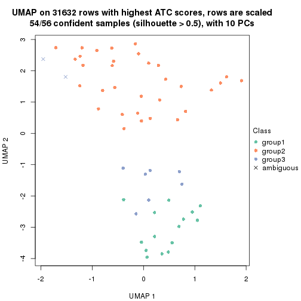</p>

</div>
<div id='tab-ATC-kmeans-dimension-reduction-3'>
<pre><code class="r">dimension_reduction(res, k = 4, method = &quot;UMAP&quot;)
</code></pre>

<p>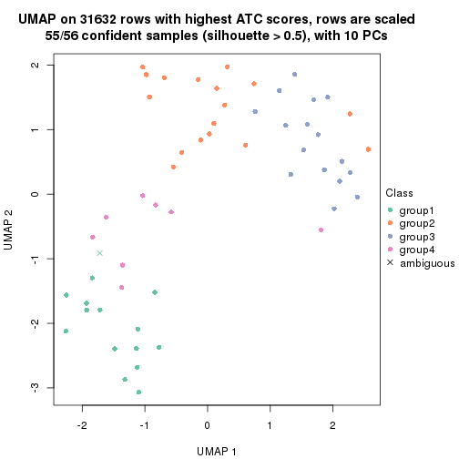</p>

</div>
<div id='tab-ATC-kmeans-dimension-reduction-4'>
<pre><code class="r">dimension_reduction(res, k = 5, method = &quot;UMAP&quot;)
</code></pre>

<p>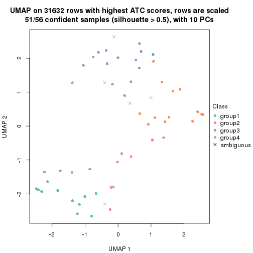</p>

</div>
<div id='tab-ATC-kmeans-dimension-reduction-5'>
<pre><code class="r">dimension_reduction(res, k = 6, method = &quot;UMAP&quot;)
</code></pre>

<p>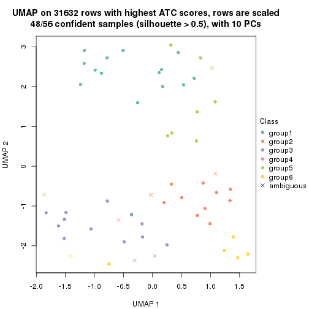</p>

</div>
</div>


Following heatmap shows how subgroups are split when increasing `k`:

```r
collect_classes(res)
```

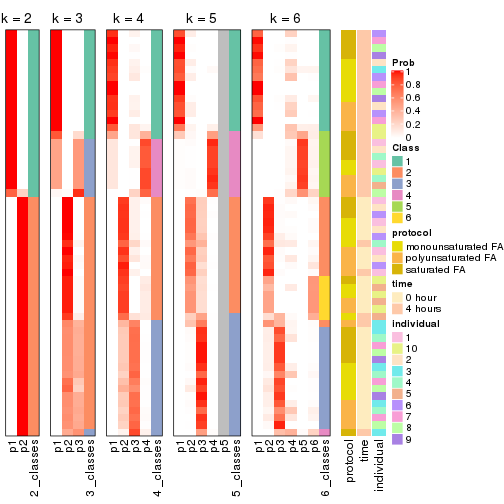


Test correlation between subgroups and known annotations. If the known
annotation is numeric, one-way ANOVA test is applied, and if the known
annotation is discrete, chi-squared contingency table test is applied.

```r
test_to_known_factors(res)
```

```
#>             n protocol(p)  time(p) individual(p) k
#> ATC:kmeans 56       0.937 2.29e-09      0.950239 2
#> ATC:kmeans 54       0.938 2.08e-09      0.548487 3
#> ATC:kmeans 55       0.959 2.68e-08      0.009539 4
#> ATC:kmeans 51       0.975 3.10e-10      0.019773 5
#> ATC:kmeans 48       0.994 2.03e-08      0.000353 6
```


If matrix rows can be associated to genes, consider to use `functional_enrichment(res,
...)` to perform function enrichment for the signature genes. See [this vignette](http://bioconductor.org/packages/devel/bioc/vignettes/cola/inst/doc/functional_enrichment.html) for more detailed explanations.


 

---------------------------------------------------


### ATC:skmeans**


The object with results only for a single top-value method and a single partition method 
can be extracted as:

```r
res = res_list["ATC", "skmeans"]
# you can also extract it by
# res = res_list["ATC:skmeans"]
```

A summary of `res` and all the functions that can be applied to it:

```r
res
```

```
#> A 'ConsensusPartition' object with k = 2, 3, 4, 5, 6.
#>   On a matrix with 31632 rows and 56 columns.
#>   Top rows (1000, 2000, 3000, 4000, 5000) are extracted by 'ATC' method.
#>   Subgroups are detected by 'skmeans' method.
#>   Performed in total 1250 partitions by row resampling.
#>   Best k for subgroups seems to be 2.
#> 
#> Following methods can be applied to this 'ConsensusPartition' object:
#>  [1] "cola_report"             "collect_classes"         "collect_plots"          
#>  [4] "collect_stats"           "colnames"                "compare_signatures"     
#>  [7] "consensus_heatmap"       "dimension_reduction"     "functional_enrichment"  
#> [10] "get_anno_col"            "get_anno"                "get_classes"            
#> [13] "get_consensus"           "get_matrix"              "get_membership"         
#> [16] "get_param"               "get_signatures"          "get_stats"              
#> [19] "is_best_k"               "is_stable_k"             "membership_heatmap"     
#> [22] "ncol"                    "nrow"                    "plot_ecdf"              
#> [25] "rownames"                "select_partition_number" "show"                   
#> [28] "suggest_best_k"          "test_to_known_factors"
```

`collect_plots()` function collects all the plots made from `res` for all `k` (number of partitions)
into one single page to provide an easy and fast comparison between different `k`.

```r
collect_plots(res)
```

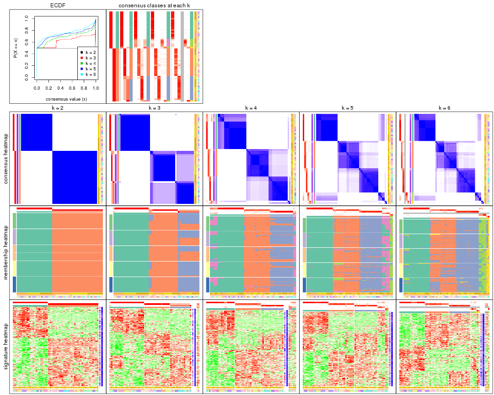

The plots are:

- The first row: a plot of the ECDF (empirical cumulative distribution
  function) curves of the consensus matrix for each `k` and the heatmap of
  predicted classes for each `k`.
- The second row: heatmaps of the consensus matrix for each `k`.
- The third row: heatmaps of the membership matrix for each `k`.
- The fouth row: heatmaps of the signatures for each `k`.

All the plots in panels can be made by individual functions and they are
plotted later in this section.

`select_partition_number()` produces several plots showing different
statistics for choosing "optimized" `k`. There are following statistics:

- ECDF curves of the consensus matrix for each `k`;
- 1-PAC. [The PAC
  score](https://en.wikipedia.org/wiki/Consensus_clustering#Over-interpretation_potential_of_consensus_clustering)
  measures the proportion of the ambiguous subgrouping.
- Mean silhouette score.
- Concordance. The mean probability of fiting the consensus class ids in all
  partitions.
- Area increased. Denote $A_k$ as the area under the ECDF curve for current
  `k`, the area increased is defined as $A_k - A_{k-1}$.
- Rand index. The percent of pairs of samples that are both in a same cluster
  or both are not in a same cluster in the partition of k and k-1.
- Jaccard index. The ratio of pairs of samples are both in a same cluster in
  the partition of k and k-1 and the pairs of samples are both in a same
  cluster in the partition k or k-1.

The detailed explanations of these statistics can be found in [the _cola_
vignette](http://bioconductor.org/packages/devel/bioc/vignettes/cola/inst/doc/cola.html#toc_13).

Generally speaking, lower PAC score, higher mean silhouette score or higher
concordance corresponds to better partition. Rand index and Jaccard index
measure how similar the current partition is compared to partition with `k-1`.
If they are too similar, we won't accept `k` is better than `k-1`.

```r
select_partition_number(res)
```

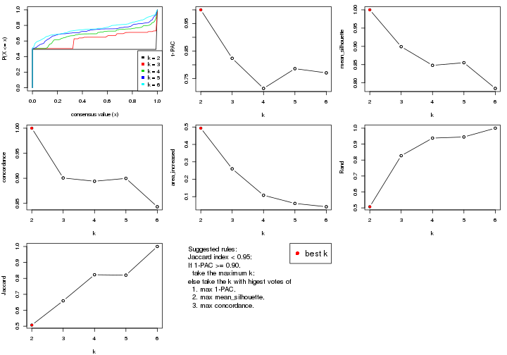

The numeric values for all these statistics can be obtained by `get_stats()`.

```r
get_stats(res)
```

```
#>   k 1-PAC mean_silhouette concordance area_increased  Rand Jaccard
#> 2 2 1.000           1.000       1.000         0.4934 0.507   0.507
#> 3 3 0.824           0.899       0.901         0.2599 0.827   0.659
#> 4 4 0.714           0.848       0.894         0.1080 0.938   0.823
#> 5 5 0.786           0.855       0.900         0.0610 0.945   0.820
#> 6 6 0.771           0.785       0.843         0.0421 1.000   1.000
```

`suggest_best_k()` suggests the best $k$ based on these statistics. The rules are as follows:

- All $k$ with Jaccard index larger than 0.95 are removed because increasing
  $k$ does not provide enough extra information. If all $k$ are removed, it is
  marked as no subgroup is detected.
- For all $k$ with 1-PAC score larger than 0.9, the maximal $k$ is taken as
  the best $k$, and other $k$ are marked as optional $k$.
- If it does not fit the second rule. The $k$ with the maximal vote of the
  highest 1-PAC score, highest mean silhouette, and highest concordance is
  taken as the best $k$.

```r
suggest_best_k(res)
```

```
#> [1] 2
```


Following shows the table of the partitions (You need to click the **show/hide
code output** link to see it). The membership matrix (columns with name `p*`)
is inferred by
[`clue::cl_consensus()`](https://www.rdocumentation.org/link/cl_consensus?package=clue)
function with the `SE` method. Basically the value in the membership matrix
represents the probability to belong to a certain group. The finall class
label for an item is determined with the group with highest probability it
belongs to.

In `get_classes()` function, the entropy is calculated from the membership
matrix and the silhouette score is calculated from the consensus matrix.


<script>
$( function() {
	$( '#tabs-ATC-skmeans-get-classes' ).tabs();
} );
</script>
<div id='tabs-ATC-skmeans-get-classes'>
<ul>
<li><a href='#tab-ATC-skmeans-get-classes-1'>k = 2</a></li>
<li><a href='#tab-ATC-skmeans-get-classes-2'>k = 3</a></li>
<li><a href='#tab-ATC-skmeans-get-classes-3'>k = 4</a></li>
<li><a href='#tab-ATC-skmeans-get-classes-4'>k = 5</a></li>
<li><a href='#tab-ATC-skmeans-get-classes-5'>k = 6</a></li>
</ul>

<div id='tab-ATC-skmeans-get-classes-1'>
<p><a id='tab-ATC-skmeans-get-classes-1-a' style='color:#0366d6' href='#'>show/hide code output</a></p>
<pre><code class="r">cbind(get_classes(res, k = 2), get_membership(res, k = 2))
</code></pre>

<pre><code>#&gt;           class entropy silhouette p1 p2
#&gt; GSM790742     2       0          1  0  1
#&gt; GSM790744     2       0          1  0  1
#&gt; GSM790754     2       0          1  0  1
#&gt; GSM790756     2       0          1  0  1
#&gt; GSM790768     2       0          1  0  1
#&gt; GSM790774     2       0          1  0  1
#&gt; GSM790778     2       0          1  0  1
#&gt; GSM790784     2       0          1  0  1
#&gt; GSM790790     2       0          1  0  1
#&gt; GSM790743     1       0          1  1  0
#&gt; GSM790745     1       0          1  1  0
#&gt; GSM790755     2       0          1  0  1
#&gt; GSM790757     1       0          1  1  0
#&gt; GSM790769     1       0          1  1  0
#&gt; GSM790775     1       0          1  1  0
#&gt; GSM790779     1       0          1  1  0
#&gt; GSM790785     1       0          1  1  0
#&gt; GSM790791     1       0          1  1  0
#&gt; GSM790738     2       0          1  0  1
#&gt; GSM790746     2       0          1  0  1
#&gt; GSM790752     2       0          1  0  1
#&gt; GSM790758     2       0          1  0  1
#&gt; GSM790764     2       0          1  0  1
#&gt; GSM790766     2       0          1  0  1
#&gt; GSM790772     2       0          1  0  1
#&gt; GSM790782     2       0          1  0  1
#&gt; GSM790786     2       0          1  0  1
#&gt; GSM790792     2       0          1  0  1
#&gt; GSM790739     1       0          1  1  0
#&gt; GSM790747     1       0          1  1  0
#&gt; GSM790753     1       0          1  1  0
#&gt; GSM790759     2       0          1  0  1
#&gt; GSM790765     2       0          1  0  1
#&gt; GSM790767     1       0          1  1  0
#&gt; GSM790773     1       0          1  1  0
#&gt; GSM790783     1       0          1  1  0
#&gt; GSM790787     1       0          1  1  0
#&gt; GSM790793     1       0          1  1  0
#&gt; GSM790740     2       0          1  0  1
#&gt; GSM790748     2       0          1  0  1
#&gt; GSM790750     2       0          1  0  1
#&gt; GSM790760     2       0          1  0  1
#&gt; GSM790762     2       0          1  0  1
#&gt; GSM790770     2       0          1  0  1
#&gt; GSM790776     2       0          1  0  1
#&gt; GSM790780     2       0          1  0  1
#&gt; GSM790788     2       0          1  0  1
#&gt; GSM790741     2       0          1  0  1
#&gt; GSM790749     1       0          1  1  0
#&gt; GSM790751     2       0          1  0  1
#&gt; GSM790761     1       0          1  1  0
#&gt; GSM790763     1       0          1  1  0
#&gt; GSM790771     1       0          1  1  0
#&gt; GSM790777     1       0          1  1  0
#&gt; GSM790781     1       0          1  1  0
#&gt; GSM790789     1       0          1  1  0
</code></pre>

<script>
$('#tab-ATC-skmeans-get-classes-1-a').parent().next().next().hide();
$('#tab-ATC-skmeans-get-classes-1-a').click(function(){
  $('#tab-ATC-skmeans-get-classes-1-a').parent().next().next().toggle();
  return(false);
});
</script>
</div>

<div id='tab-ATC-skmeans-get-classes-2'>
<p><a id='tab-ATC-skmeans-get-classes-2-a' style='color:#0366d6' href='#'>show/hide code output</a></p>
<pre><code class="r">cbind(get_classes(res, k = 3), get_membership(res, k = 3))
</code></pre>

<pre><code>#&gt;           class entropy silhouette    p1    p2    p3
#&gt; GSM790742     2   0.000      0.925 0.000 1.000 0.000
#&gt; GSM790744     2   0.000      0.925 0.000 1.000 0.000
#&gt; GSM790754     3   0.579      0.952 0.000 0.332 0.668
#&gt; GSM790756     3   0.579      0.952 0.000 0.332 0.668
#&gt; GSM790768     2   0.000      0.925 0.000 1.000 0.000
#&gt; GSM790774     3   0.579      0.952 0.000 0.332 0.668
#&gt; GSM790778     3   0.579      0.952 0.000 0.332 0.668
#&gt; GSM790784     3   0.579      0.952 0.000 0.332 0.668
#&gt; GSM790790     2   0.000      0.925 0.000 1.000 0.000
#&gt; GSM790743     1   0.000      0.988 1.000 0.000 0.000
#&gt; GSM790745     1   0.000      0.988 1.000 0.000 0.000
#&gt; GSM790755     3   0.000      0.539 0.000 0.000 1.000
#&gt; GSM790757     1   0.000      0.988 1.000 0.000 0.000
#&gt; GSM790769     1   0.000      0.988 1.000 0.000 0.000
#&gt; GSM790775     1   0.000      0.988 1.000 0.000 0.000
#&gt; GSM790779     1   0.000      0.988 1.000 0.000 0.000
#&gt; GSM790785     1   0.000      0.988 1.000 0.000 0.000
#&gt; GSM790791     1   0.000      0.988 1.000 0.000 0.000
#&gt; GSM790738     2   0.000      0.925 0.000 1.000 0.000
#&gt; GSM790746     2   0.000      0.925 0.000 1.000 0.000
#&gt; GSM790752     3   0.579      0.952 0.000 0.332 0.668
#&gt; GSM790758     3   0.579      0.952 0.000 0.332 0.668
#&gt; GSM790764     2   0.000      0.925 0.000 1.000 0.000
#&gt; GSM790766     2   0.000      0.925 0.000 1.000 0.000
#&gt; GSM790772     2   0.617     -0.300 0.000 0.588 0.412
#&gt; GSM790782     2   0.611     -0.234 0.000 0.604 0.396
#&gt; GSM790786     3   0.579      0.952 0.000 0.332 0.668
#&gt; GSM790792     2   0.000      0.925 0.000 1.000 0.000
#&gt; GSM790739     1   0.000      0.988 1.000 0.000 0.000
#&gt; GSM790747     1   0.000      0.988 1.000 0.000 0.000
#&gt; GSM790753     1   0.000      0.988 1.000 0.000 0.000
#&gt; GSM790759     2   0.000      0.925 0.000 1.000 0.000
#&gt; GSM790765     2   0.245      0.821 0.000 0.924 0.076
#&gt; GSM790767     1   0.000      0.988 1.000 0.000 0.000
#&gt; GSM790773     1   0.000      0.988 1.000 0.000 0.000
#&gt; GSM790783     1   0.000      0.988 1.000 0.000 0.000
#&gt; GSM790787     1   0.000      0.988 1.000 0.000 0.000
#&gt; GSM790793     1   0.000      0.988 1.000 0.000 0.000
#&gt; GSM790740     2   0.000      0.925 0.000 1.000 0.000
#&gt; GSM790748     2   0.000      0.925 0.000 1.000 0.000
#&gt; GSM790750     3   0.579      0.952 0.000 0.332 0.668
#&gt; GSM790760     3   0.579      0.952 0.000 0.332 0.668
#&gt; GSM790762     2   0.000      0.925 0.000 1.000 0.000
#&gt; GSM790770     2   0.000      0.925 0.000 1.000 0.000
#&gt; GSM790776     3   0.579      0.952 0.000 0.332 0.668
#&gt; GSM790780     3   0.576      0.947 0.000 0.328 0.672
#&gt; GSM790788     2   0.000      0.925 0.000 1.000 0.000
#&gt; GSM790741     2   0.000      0.925 0.000 1.000 0.000
#&gt; GSM790749     1   0.000      0.988 1.000 0.000 0.000
#&gt; GSM790751     3   0.599      0.894 0.000 0.368 0.632
#&gt; GSM790761     1   0.000      0.988 1.000 0.000 0.000
#&gt; GSM790763     1   0.000      0.988 1.000 0.000 0.000
#&gt; GSM790771     1   0.000      0.988 1.000 0.000 0.000
#&gt; GSM790777     1   0.000      0.988 1.000 0.000 0.000
#&gt; GSM790781     1   0.579      0.681 0.668 0.000 0.332
#&gt; GSM790789     1   0.000      0.988 1.000 0.000 0.000
</code></pre>

<script>
$('#tab-ATC-skmeans-get-classes-2-a').parent().next().next().hide();
$('#tab-ATC-skmeans-get-classes-2-a').click(function(){
  $('#tab-ATC-skmeans-get-classes-2-a').parent().next().next().toggle();
  return(false);
});
</script>
</div>

<div id='tab-ATC-skmeans-get-classes-3'>
<p><a id='tab-ATC-skmeans-get-classes-3-a' style='color:#0366d6' href='#'>show/hide code output</a></p>
<pre><code class="r">cbind(get_classes(res, k = 4), get_membership(res, k = 4))
</code></pre>

<pre><code>#&gt;           class entropy silhouette    p1    p2    p3    p4
#&gt; GSM790742     2  0.2760      0.945 0.000 0.872 0.128 0.000
#&gt; GSM790744     2  0.3123      0.946 0.000 0.844 0.156 0.000
#&gt; GSM790754     3  0.0469      0.944 0.000 0.012 0.988 0.000
#&gt; GSM790756     3  0.0336      0.943 0.000 0.008 0.992 0.000
#&gt; GSM790768     2  0.3074      0.948 0.000 0.848 0.152 0.000
#&gt; GSM790774     3  0.0469      0.943 0.000 0.012 0.988 0.000
#&gt; GSM790778     3  0.0469      0.943 0.000 0.012 0.988 0.000
#&gt; GSM790784     3  0.0592      0.942 0.000 0.016 0.984 0.000
#&gt; GSM790790     2  0.3047      0.942 0.000 0.872 0.116 0.012
#&gt; GSM790743     1  0.6025      0.602 0.668 0.096 0.000 0.236
#&gt; GSM790745     1  0.6919      0.387 0.516 0.116 0.000 0.368
#&gt; GSM790755     4  0.4790      0.291 0.000 0.000 0.380 0.620
#&gt; GSM790757     1  0.6919      0.387 0.516 0.116 0.000 0.368
#&gt; GSM790769     1  0.0000      0.886 1.000 0.000 0.000 0.000
#&gt; GSM790775     1  0.0000      0.886 1.000 0.000 0.000 0.000
#&gt; GSM790779     1  0.0000      0.886 1.000 0.000 0.000 0.000
#&gt; GSM790785     1  0.0000      0.886 1.000 0.000 0.000 0.000
#&gt; GSM790791     1  0.0707      0.879 0.980 0.000 0.000 0.020
#&gt; GSM790738     2  0.3024      0.949 0.000 0.852 0.148 0.000
#&gt; GSM790746     2  0.3074      0.948 0.000 0.848 0.152 0.000
#&gt; GSM790752     3  0.0469      0.944 0.000 0.012 0.988 0.000
#&gt; GSM790758     3  0.0000      0.936 0.000 0.000 1.000 0.000
#&gt; GSM790764     2  0.3047      0.942 0.000 0.872 0.116 0.012
#&gt; GSM790766     2  0.3801      0.888 0.000 0.780 0.220 0.000
#&gt; GSM790772     3  0.2868      0.805 0.000 0.136 0.864 0.000
#&gt; GSM790782     3  0.3528      0.720 0.000 0.192 0.808 0.000
#&gt; GSM790786     3  0.0592      0.942 0.000 0.016 0.984 0.000
#&gt; GSM790792     2  0.3047      0.942 0.000 0.872 0.116 0.012
#&gt; GSM790739     1  0.6454      0.468 0.572 0.084 0.000 0.344
#&gt; GSM790747     1  0.0000      0.886 1.000 0.000 0.000 0.000
#&gt; GSM790753     1  0.0000      0.886 1.000 0.000 0.000 0.000
#&gt; GSM790759     2  0.3764      0.895 0.000 0.784 0.216 0.000
#&gt; GSM790765     2  0.4999      0.667 0.000 0.660 0.328 0.012
#&gt; GSM790767     1  0.0000      0.886 1.000 0.000 0.000 0.000
#&gt; GSM790773     1  0.0000      0.886 1.000 0.000 0.000 0.000
#&gt; GSM790783     1  0.0000      0.886 1.000 0.000 0.000 0.000
#&gt; GSM790787     1  0.0000      0.886 1.000 0.000 0.000 0.000
#&gt; GSM790793     1  0.0817      0.877 0.976 0.000 0.000 0.024
#&gt; GSM790740     2  0.3074      0.948 0.000 0.848 0.152 0.000
#&gt; GSM790748     2  0.3172      0.945 0.000 0.840 0.160 0.000
#&gt; GSM790750     3  0.0469      0.944 0.000 0.012 0.988 0.000
#&gt; GSM790760     3  0.0000      0.936 0.000 0.000 1.000 0.000
#&gt; GSM790762     2  0.3047      0.942 0.000 0.872 0.116 0.012
#&gt; GSM790770     2  0.3047      0.942 0.000 0.872 0.116 0.012
#&gt; GSM790776     3  0.0336      0.943 0.000 0.008 0.992 0.000
#&gt; GSM790780     3  0.0469      0.919 0.000 0.000 0.988 0.012
#&gt; GSM790788     2  0.3047      0.942 0.000 0.872 0.116 0.012
#&gt; GSM790741     2  0.3024      0.949 0.000 0.852 0.148 0.000
#&gt; GSM790749     1  0.0000      0.886 1.000 0.000 0.000 0.000
#&gt; GSM790751     3  0.2704      0.823 0.000 0.124 0.876 0.000
#&gt; GSM790761     1  0.6025      0.602 0.668 0.096 0.000 0.236
#&gt; GSM790763     1  0.0707      0.879 0.980 0.000 0.000 0.020
#&gt; GSM790771     1  0.0000      0.886 1.000 0.000 0.000 0.000
#&gt; GSM790777     1  0.0000      0.886 1.000 0.000 0.000 0.000
#&gt; GSM790781     4  0.4164      0.417 0.264 0.000 0.000 0.736
#&gt; GSM790789     1  0.0707      0.879 0.980 0.000 0.000 0.020
</code></pre>

<script>
$('#tab-ATC-skmeans-get-classes-3-a').parent().next().next().hide();
$('#tab-ATC-skmeans-get-classes-3-a').click(function(){
  $('#tab-ATC-skmeans-get-classes-3-a').parent().next().next().toggle();
  return(false);
});
</script>
</div>

<div id='tab-ATC-skmeans-get-classes-4'>
<p><a id='tab-ATC-skmeans-get-classes-4-a' style='color:#0366d6' href='#'>show/hide code output</a></p>
<pre><code class="r">cbind(get_classes(res, k = 5), get_membership(res, k = 5))
</code></pre>

<pre><code>#&gt;           class entropy silhouette    p1    p2    p3    p4    p5
#&gt; GSM790742     2  0.1205      0.864 0.000 0.956 0.040 0.000 0.004
#&gt; GSM790744     2  0.1410      0.867 0.000 0.940 0.060 0.000 0.000
#&gt; GSM790754     3  0.1544      0.925 0.000 0.068 0.932 0.000 0.000
#&gt; GSM790756     3  0.1357      0.927 0.000 0.048 0.948 0.000 0.004
#&gt; GSM790768     2  0.1571      0.870 0.000 0.936 0.060 0.004 0.000
#&gt; GSM790774     3  0.1121      0.927 0.000 0.044 0.956 0.000 0.000
#&gt; GSM790778     3  0.1121      0.927 0.000 0.044 0.956 0.000 0.000
#&gt; GSM790784     3  0.1043      0.927 0.000 0.040 0.960 0.000 0.000
#&gt; GSM790790     2  0.3450      0.822 0.000 0.848 0.008 0.060 0.084
#&gt; GSM790743     4  0.4648      0.586 0.464 0.000 0.012 0.524 0.000
#&gt; GSM790745     4  0.2516      0.528 0.140 0.000 0.000 0.860 0.000
#&gt; GSM790755     5  0.2424      0.646 0.000 0.000 0.132 0.000 0.868
#&gt; GSM790757     4  0.2648      0.548 0.152 0.000 0.000 0.848 0.000
#&gt; GSM790769     1  0.0000      0.984 1.000 0.000 0.000 0.000 0.000
#&gt; GSM790775     1  0.0000      0.984 1.000 0.000 0.000 0.000 0.000
#&gt; GSM790779     1  0.0000      0.984 1.000 0.000 0.000 0.000 0.000
#&gt; GSM790785     1  0.0000      0.984 1.000 0.000 0.000 0.000 0.000
#&gt; GSM790791     1  0.1195      0.946 0.960 0.000 0.012 0.028 0.000
#&gt; GSM790738     2  0.1197      0.870 0.000 0.952 0.048 0.000 0.000
#&gt; GSM790746     2  0.1341      0.869 0.000 0.944 0.056 0.000 0.000
#&gt; GSM790752     3  0.1544      0.923 0.000 0.068 0.932 0.000 0.000
#&gt; GSM790758     3  0.1106      0.913 0.000 0.024 0.964 0.000 0.012
#&gt; GSM790764     2  0.3719      0.817 0.000 0.836 0.016 0.060 0.088
#&gt; GSM790766     2  0.2970      0.773 0.000 0.828 0.168 0.004 0.000
#&gt; GSM790772     3  0.2233      0.885 0.000 0.104 0.892 0.000 0.004
#&gt; GSM790782     3  0.3461      0.739 0.000 0.224 0.772 0.000 0.004
#&gt; GSM790786     3  0.1121      0.927 0.000 0.044 0.956 0.000 0.000
#&gt; GSM790792     2  0.3450      0.822 0.000 0.848 0.008 0.060 0.084
#&gt; GSM790739     4  0.4114      0.607 0.376 0.000 0.000 0.624 0.000
#&gt; GSM790747     1  0.0000      0.984 1.000 0.000 0.000 0.000 0.000
#&gt; GSM790753     1  0.0000      0.984 1.000 0.000 0.000 0.000 0.000
#&gt; GSM790759     2  0.2648      0.798 0.000 0.848 0.152 0.000 0.000
#&gt; GSM790765     2  0.6455      0.505 0.000 0.584 0.276 0.056 0.084
#&gt; GSM790767     1  0.0000      0.984 1.000 0.000 0.000 0.000 0.000
#&gt; GSM790773     1  0.0000      0.984 1.000 0.000 0.000 0.000 0.000
#&gt; GSM790783     1  0.0000      0.984 1.000 0.000 0.000 0.000 0.000
#&gt; GSM790787     1  0.0000      0.984 1.000 0.000 0.000 0.000 0.000
#&gt; GSM790793     1  0.1670      0.916 0.936 0.000 0.012 0.052 0.000
#&gt; GSM790740     2  0.1341      0.869 0.000 0.944 0.056 0.000 0.000
#&gt; GSM790748     2  0.1768      0.862 0.000 0.924 0.072 0.000 0.004
#&gt; GSM790750     3  0.1478      0.925 0.000 0.064 0.936 0.000 0.000
#&gt; GSM790760     3  0.1549      0.915 0.000 0.040 0.944 0.000 0.016
#&gt; GSM790762     2  0.3450      0.822 0.000 0.848 0.008 0.060 0.084
#&gt; GSM790770     2  0.2734      0.836 0.000 0.892 0.008 0.048 0.052
#&gt; GSM790776     3  0.1408      0.925 0.000 0.044 0.948 0.000 0.008
#&gt; GSM790780     3  0.1117      0.909 0.000 0.020 0.964 0.000 0.016
#&gt; GSM790788     2  0.3450      0.822 0.000 0.848 0.008 0.060 0.084
#&gt; GSM790741     2  0.1270      0.870 0.000 0.948 0.052 0.000 0.000
#&gt; GSM790749     1  0.0000      0.984 1.000 0.000 0.000 0.000 0.000
#&gt; GSM790751     3  0.3966      0.584 0.000 0.336 0.664 0.000 0.000
#&gt; GSM790761     4  0.4627      0.620 0.444 0.000 0.012 0.544 0.000
#&gt; GSM790763     1  0.1444      0.933 0.948 0.000 0.012 0.040 0.000
#&gt; GSM790771     1  0.0000      0.984 1.000 0.000 0.000 0.000 0.000
#&gt; GSM790777     1  0.0000      0.984 1.000 0.000 0.000 0.000 0.000
#&gt; GSM790781     5  0.5566      0.579 0.144 0.000 0.008 0.180 0.668
#&gt; GSM790789     1  0.0912      0.959 0.972 0.000 0.012 0.016 0.000
</code></pre>

<script>
$('#tab-ATC-skmeans-get-classes-4-a').parent().next().next().hide();
$('#tab-ATC-skmeans-get-classes-4-a').click(function(){
  $('#tab-ATC-skmeans-get-classes-4-a').parent().next().next().toggle();
  return(false);
});
</script>
</div>

<div id='tab-ATC-skmeans-get-classes-5'>
<p><a id='tab-ATC-skmeans-get-classes-5-a' style='color:#0366d6' href='#'>show/hide code output</a></p>
<pre><code class="r">cbind(get_classes(res, k = 6), get_membership(res, k = 6))
</code></pre>

<pre><code>#&gt;           class entropy silhouette    p1    p2    p3 p4    p5    p6
#&gt; GSM790742     2  0.1934      0.752 0.000 0.916 0.040 NA 0.000 0.000
#&gt; GSM790744     2  0.1610      0.769 0.000 0.916 0.084 NA 0.000 0.000
#&gt; GSM790754     3  0.1637      0.905 0.000 0.056 0.932 NA 0.004 0.004
#&gt; GSM790756     3  0.1476      0.898 0.000 0.008 0.948 NA 0.012 0.004
#&gt; GSM790768     2  0.2060      0.772 0.000 0.900 0.084 NA 0.000 0.000
#&gt; GSM790774     3  0.0458      0.910 0.000 0.016 0.984 NA 0.000 0.000
#&gt; GSM790778     3  0.0458      0.910 0.000 0.016 0.984 NA 0.000 0.000
#&gt; GSM790784     3  0.0692      0.910 0.000 0.020 0.976 NA 0.000 0.000
#&gt; GSM790790     2  0.3690      0.666 0.000 0.684 0.008 NA 0.000 0.000
#&gt; GSM790743     5  0.5411      0.603 0.296 0.000 0.000 NA 0.556 0.000
#&gt; GSM790745     5  0.0547      0.499 0.020 0.000 0.000 NA 0.980 0.000
#&gt; GSM790755     6  0.0363      0.687 0.000 0.000 0.012 NA 0.000 0.988
#&gt; GSM790757     5  0.0632      0.506 0.024 0.000 0.000 NA 0.976 0.000
#&gt; GSM790769     1  0.0000      0.931 1.000 0.000 0.000 NA 0.000 0.000
#&gt; GSM790775     1  0.0405      0.932 0.988 0.000 0.000 NA 0.000 0.004
#&gt; GSM790779     1  0.0405      0.932 0.988 0.000 0.000 NA 0.000 0.004
#&gt; GSM790785     1  0.0405      0.932 0.988 0.000 0.000 NA 0.000 0.004
#&gt; GSM790791     1  0.3344      0.762 0.804 0.000 0.000 NA 0.044 0.000
#&gt; GSM790738     2  0.1444      0.771 0.000 0.928 0.072 NA 0.000 0.000
#&gt; GSM790746     2  0.1644      0.771 0.000 0.920 0.076 NA 0.000 0.000
#&gt; GSM790752     3  0.2058      0.901 0.000 0.056 0.916 NA 0.008 0.004
#&gt; GSM790758     3  0.2107      0.882 0.000 0.008 0.920 NA 0.012 0.024
#&gt; GSM790764     2  0.3998      0.639 0.000 0.644 0.016 NA 0.000 0.000
#&gt; GSM790766     2  0.3171      0.675 0.000 0.784 0.204 NA 0.000 0.000
#&gt; GSM790772     3  0.1349      0.898 0.000 0.056 0.940 NA 0.000 0.000
#&gt; GSM790782     3  0.2593      0.805 0.000 0.148 0.844 NA 0.000 0.000
#&gt; GSM790786     3  0.0692      0.910 0.000 0.020 0.976 NA 0.000 0.000
#&gt; GSM790792     2  0.3690      0.666 0.000 0.684 0.008 NA 0.000 0.000
#&gt; GSM790739     5  0.4814      0.536 0.256 0.000 0.000 NA 0.644 0.000
#&gt; GSM790747     1  0.0000      0.931 1.000 0.000 0.000 NA 0.000 0.000
#&gt; GSM790753     1  0.0405      0.932 0.988 0.000 0.000 NA 0.000 0.004
#&gt; GSM790759     2  0.2946      0.708 0.000 0.824 0.160 NA 0.004 0.000
#&gt; GSM790765     2  0.6104      0.265 0.000 0.376 0.328 NA 0.000 0.000
#&gt; GSM790767     1  0.0000      0.931 1.000 0.000 0.000 NA 0.000 0.000
#&gt; GSM790773     1  0.0405      0.932 0.988 0.000 0.000 NA 0.000 0.004
#&gt; GSM790783     1  0.0405      0.932 0.988 0.000 0.000 NA 0.000 0.004
#&gt; GSM790787     1  0.0405      0.932 0.988 0.000 0.000 NA 0.000 0.004
#&gt; GSM790793     1  0.3825      0.714 0.768 0.000 0.000 NA 0.072 0.000
#&gt; GSM790740     2  0.1663      0.767 0.000 0.912 0.088 NA 0.000 0.000
#&gt; GSM790748     2  0.2608      0.748 0.000 0.872 0.080 NA 0.000 0.000
#&gt; GSM790750     3  0.2113      0.904 0.000 0.044 0.916 NA 0.008 0.004
#&gt; GSM790760     3  0.3061      0.866 0.000 0.028 0.868 NA 0.012 0.024
#&gt; GSM790762     2  0.3690      0.666 0.000 0.684 0.008 NA 0.000 0.000
#&gt; GSM790770     2  0.3161      0.705 0.000 0.776 0.008 NA 0.000 0.000
#&gt; GSM790776     3  0.1994      0.896 0.000 0.016 0.920 NA 0.008 0.004
#&gt; GSM790780     3  0.1364      0.904 0.000 0.016 0.952 NA 0.000 0.020
#&gt; GSM790788     2  0.3690      0.666 0.000 0.684 0.008 NA 0.000 0.000
#&gt; GSM790741     2  0.1556      0.770 0.000 0.920 0.080 NA 0.000 0.000
#&gt; GSM790749     1  0.0146      0.929 0.996 0.000 0.000 NA 0.000 0.000
#&gt; GSM790751     3  0.3976      0.442 0.000 0.380 0.612 NA 0.000 0.004
#&gt; GSM790761     5  0.5382      0.608 0.288 0.000 0.000 NA 0.564 0.000
#&gt; GSM790763     1  0.3602      0.737 0.784 0.000 0.000 NA 0.056 0.000
#&gt; GSM790771     1  0.0146      0.929 0.996 0.000 0.000 NA 0.000 0.000
#&gt; GSM790777     1  0.0405      0.932 0.988 0.000 0.000 NA 0.000 0.004
#&gt; GSM790781     6  0.5198      0.674 0.024 0.000 0.000 NA 0.044 0.524
#&gt; GSM790789     1  0.2830      0.799 0.836 0.000 0.000 NA 0.020 0.000
</code></pre>

<script>
$('#tab-ATC-skmeans-get-classes-5-a').parent().next().next().hide();
$('#tab-ATC-skmeans-get-classes-5-a').click(function(){
  $('#tab-ATC-skmeans-get-classes-5-a').parent().next().next().toggle();
  return(false);
});
</script>
</div>
</div>

Heatmaps for the consensus matrix. It visualizes the probability of two
samples to be in a same group.


<script>
$( function() {
	$( '#tabs-ATC-skmeans-consensus-heatmap' ).tabs();
} );
</script>
<div id='tabs-ATC-skmeans-consensus-heatmap'>
<ul>
<li><a href='#tab-ATC-skmeans-consensus-heatmap-1'>k = 2</a></li>
<li><a href='#tab-ATC-skmeans-consensus-heatmap-2'>k = 3</a></li>
<li><a href='#tab-ATC-skmeans-consensus-heatmap-3'>k = 4</a></li>
<li><a href='#tab-ATC-skmeans-consensus-heatmap-4'>k = 5</a></li>
<li><a href='#tab-ATC-skmeans-consensus-heatmap-5'>k = 6</a></li>
</ul>
<div id='tab-ATC-skmeans-consensus-heatmap-1'>
<pre><code class="r">consensus_heatmap(res, k = 2)
</code></pre>

<p></p>

</div>
<div id='tab-ATC-skmeans-consensus-heatmap-2'>
<pre><code class="r">consensus_heatmap(res, k = 3)
</code></pre>

<p>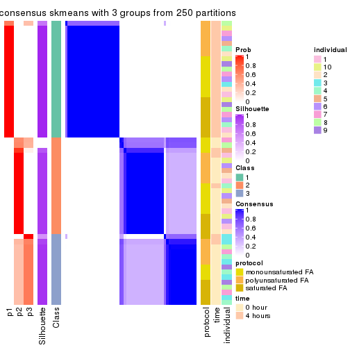</p>

</div>
<div id='tab-ATC-skmeans-consensus-heatmap-3'>
<pre><code class="r">consensus_heatmap(res, k = 4)
</code></pre>

<p>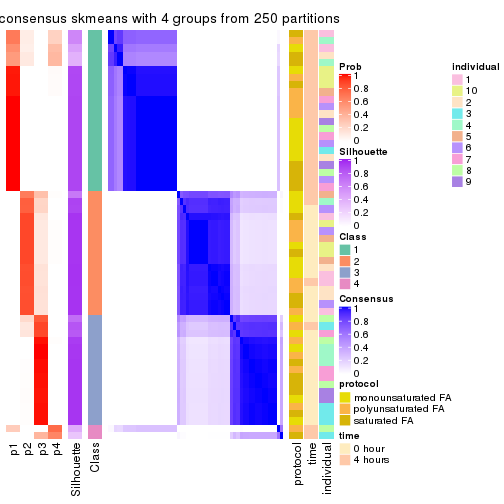</p>

</div>
<div id='tab-ATC-skmeans-consensus-heatmap-4'>
<pre><code class="r">consensus_heatmap(res, k = 5)
</code></pre>

<p>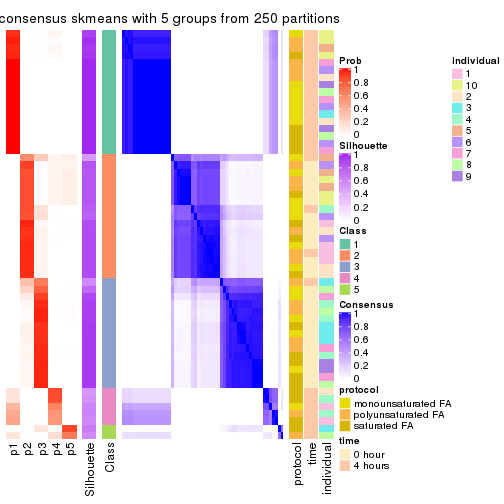</p>

</div>
<div id='tab-ATC-skmeans-consensus-heatmap-5'>
<pre><code class="r">consensus_heatmap(res, k = 6)
</code></pre>

<p>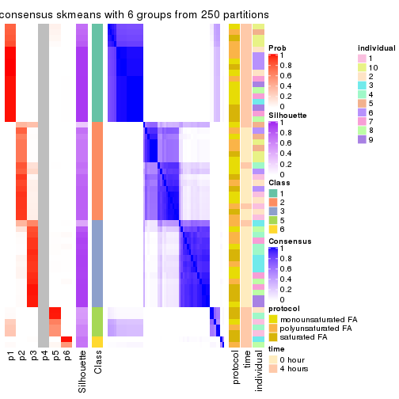</p>

</div>
</div>

Heatmaps for the membership of samples in all partitions to see how consistent they are:


<script>
$( function() {
	$( '#tabs-ATC-skmeans-membership-heatmap' ).tabs();
} );
</script>
<div id='tabs-ATC-skmeans-membership-heatmap'>
<ul>
<li><a href='#tab-ATC-skmeans-membership-heatmap-1'>k = 2</a></li>
<li><a href='#tab-ATC-skmeans-membership-heatmap-2'>k = 3</a></li>
<li><a href='#tab-ATC-skmeans-membership-heatmap-3'>k = 4</a></li>
<li><a href='#tab-ATC-skmeans-membership-heatmap-4'>k = 5</a></li>
<li><a href='#tab-ATC-skmeans-membership-heatmap-5'>k = 6</a></li>
</ul>
<div id='tab-ATC-skmeans-membership-heatmap-1'>
<pre><code class="r">membership_heatmap(res, k = 2)
</code></pre>

<p></p>

</div>
<div id='tab-ATC-skmeans-membership-heatmap-2'>
<pre><code class="r">membership_heatmap(res, k = 3)
</code></pre>

<p>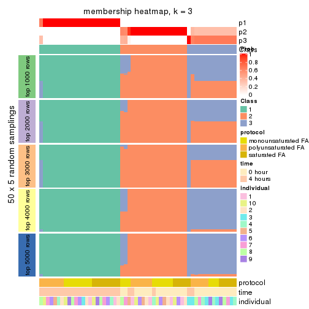</p>

</div>
<div id='tab-ATC-skmeans-membership-heatmap-3'>
<pre><code class="r">membership_heatmap(res, k = 4)
</code></pre>

<p>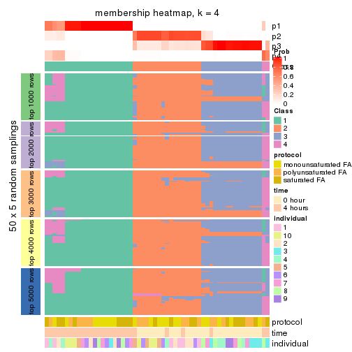</p>

</div>
<div id='tab-ATC-skmeans-membership-heatmap-4'>
<pre><code class="r">membership_heatmap(res, k = 5)
</code></pre>

<p>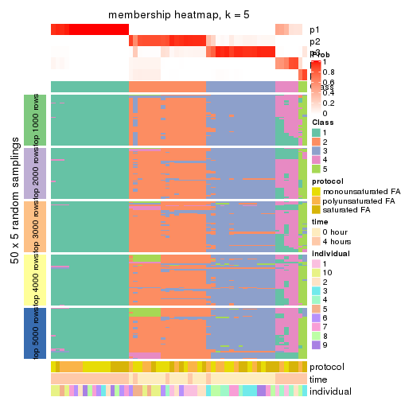</p>

</div>
<div id='tab-ATC-skmeans-membership-heatmap-5'>
<pre><code class="r">membership_heatmap(res, k = 6)
</code></pre>

<p>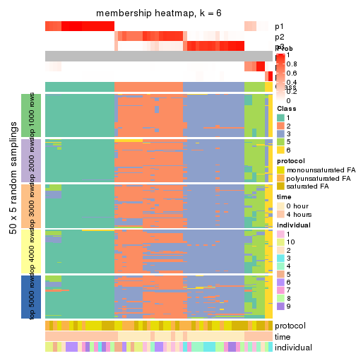</p>

</div>
</div>

As soon as we have had the classes for columns, we can look for signatures
which are significantly different between classes which can be candidate marks
for certain classes. Following are the heatmaps for signatures.


Signature heatmaps where rows are scaled:


<script>
$( function() {
	$( '#tabs-ATC-skmeans-get-signatures' ).tabs();
} );
</script>
<div id='tabs-ATC-skmeans-get-signatures'>
<ul>
<li><a href='#tab-ATC-skmeans-get-signatures-1'>k = 2</a></li>
<li><a href='#tab-ATC-skmeans-get-signatures-2'>k = 3</a></li>
<li><a href='#tab-ATC-skmeans-get-signatures-3'>k = 4</a></li>
<li><a href='#tab-ATC-skmeans-get-signatures-4'>k = 5</a></li>
<li><a href='#tab-ATC-skmeans-get-signatures-5'>k = 6</a></li>
</ul>
<div id='tab-ATC-skmeans-get-signatures-1'>
<pre><code class="r">get_signatures(res, k = 2)
</code></pre>

<p></p>

</div>
<div id='tab-ATC-skmeans-get-signatures-2'>
<pre><code class="r">get_signatures(res, k = 3)
</code></pre>

<p>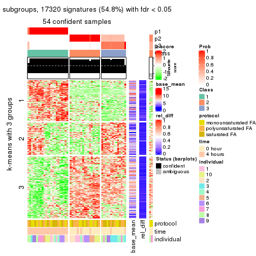</p>

</div>
<div id='tab-ATC-skmeans-get-signatures-3'>
<pre><code class="r">get_signatures(res, k = 4)
</code></pre>

<p>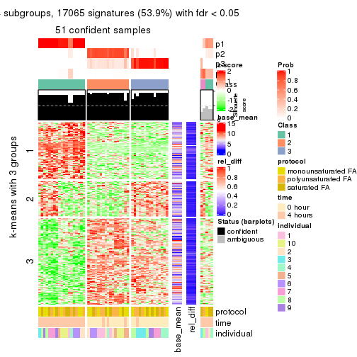</p>

</div>
<div id='tab-ATC-skmeans-get-signatures-4'>
<pre><code class="r">get_signatures(res, k = 5)
</code></pre>

<p>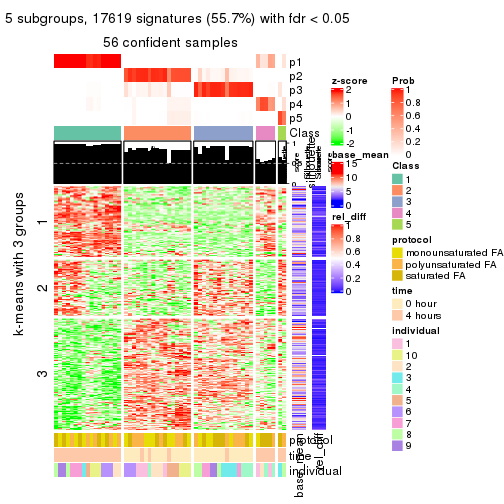</p>

</div>
<div id='tab-ATC-skmeans-get-signatures-5'>
<pre><code class="r">get_signatures(res, k = 6)
</code></pre>

<p>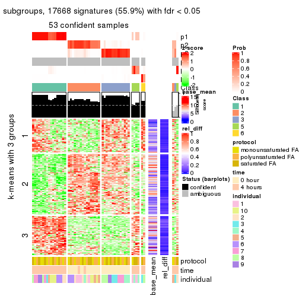</p>

</div>
</div>


Signature heatmaps where rows are not scaled:


<script>
$( function() {
	$( '#tabs-ATC-skmeans-get-signatures-no-scale' ).tabs();
} );
</script>
<div id='tabs-ATC-skmeans-get-signatures-no-scale'>
<ul>
<li><a href='#tab-ATC-skmeans-get-signatures-no-scale-1'>k = 2</a></li>
<li><a href='#tab-ATC-skmeans-get-signatures-no-scale-2'>k = 3</a></li>
<li><a href='#tab-ATC-skmeans-get-signatures-no-scale-3'>k = 4</a></li>
<li><a href='#tab-ATC-skmeans-get-signatures-no-scale-4'>k = 5</a></li>
<li><a href='#tab-ATC-skmeans-get-signatures-no-scale-5'>k = 6</a></li>
</ul>
<div id='tab-ATC-skmeans-get-signatures-no-scale-1'>
<pre><code class="r">get_signatures(res, k = 2, scale_rows = FALSE)
</code></pre>

<p></p>

</div>
<div id='tab-ATC-skmeans-get-signatures-no-scale-2'>
<pre><code class="r">get_signatures(res, k = 3, scale_rows = FALSE)
</code></pre>

<p>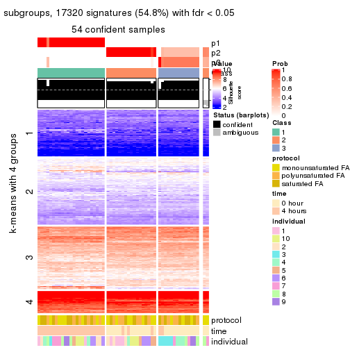</p>

</div>
<div id='tab-ATC-skmeans-get-signatures-no-scale-3'>
<pre><code class="r">get_signatures(res, k = 4, scale_rows = FALSE)
</code></pre>

<p>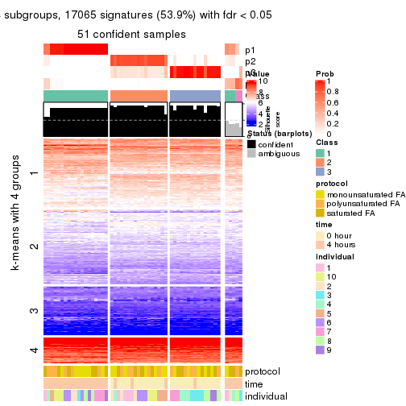</p>

</div>
<div id='tab-ATC-skmeans-get-signatures-no-scale-4'>
<pre><code class="r">get_signatures(res, k = 5, scale_rows = FALSE)
</code></pre>

<p>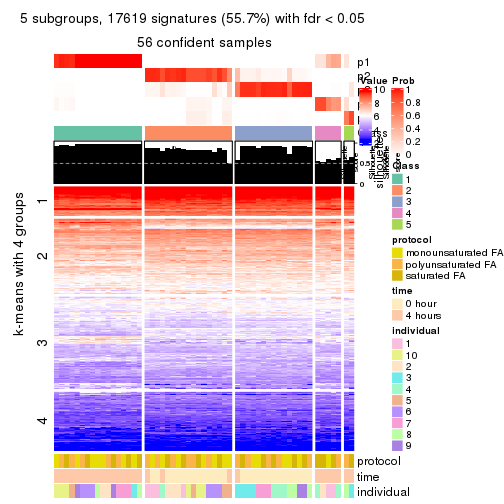</p>

</div>
<div id='tab-ATC-skmeans-get-signatures-no-scale-5'>
<pre><code class="r">get_signatures(res, k = 6, scale_rows = FALSE)
</code></pre>

<p>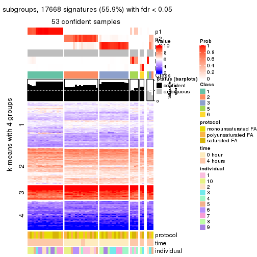</p>

</div>
</div>


Compare the overlap of signatures from different k:

```r
compare_signatures(res)
```

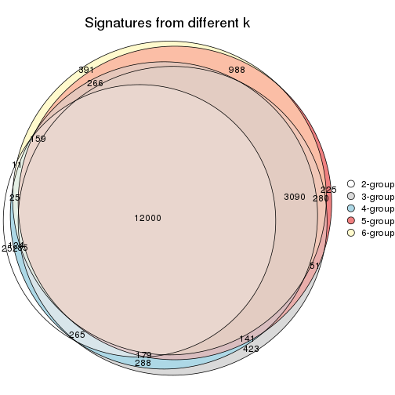

`get_signature()` returns a data frame invisibly. TO get the list of signatures, the function
call should be assigned to a variable explicitly. In following code, if `plot` argument is set
to `FALSE`, no heatmap is plotted while only the differential analysis is performed.

```r
# code only for demonstration
tb = get_signature(res, k = ..., plot = FALSE)
```

An example of the output of `tb` is:

```
#>   which_row         fdr    mean_1    mean_2 scaled_mean_1 scaled_mean_2 km
#> 1        38 0.042760348  8.373488  9.131774    -0.5533452     0.5164555  1
#> 2        40 0.018707592  7.106213  8.469186    -0.6173731     0.5762149  1
#> 3        55 0.019134737 10.221463 11.207825    -0.6159697     0.5749050  1
#> 4        59 0.006059896  5.921854  7.869574    -0.6899429     0.6439467  1
#> 5        60 0.018055526  8.928898 10.211722    -0.6204761     0.5791110  1
#> 6        98 0.009384629 15.714769 14.887706     0.6635654    -0.6193277  2
...
```

The columns in `tb` are:

1. `which_row`: row indices corresponding to the input matrix.
2. `fdr`: FDR for the differential test. 
3. `mean_x`: The mean value in group x.
4. `scaled_mean_x`: The mean value in group x after rows are scaled.
5. `km`: Row groups if k-means clustering is applied to rows.


UMAP plot which shows how samples are separated.


<script>
$( function() {
	$( '#tabs-ATC-skmeans-dimension-reduction' ).tabs();
} );
</script>
<div id='tabs-ATC-skmeans-dimension-reduction'>
<ul>
<li><a href='#tab-ATC-skmeans-dimension-reduction-1'>k = 2</a></li>
<li><a href='#tab-ATC-skmeans-dimension-reduction-2'>k = 3</a></li>
<li><a href='#tab-ATC-skmeans-dimension-reduction-3'>k = 4</a></li>
<li><a href='#tab-ATC-skmeans-dimension-reduction-4'>k = 5</a></li>
<li><a href='#tab-ATC-skmeans-dimension-reduction-5'>k = 6</a></li>
</ul>
<div id='tab-ATC-skmeans-dimension-reduction-1'>
<pre><code class="r">dimension_reduction(res, k = 2, method = &quot;UMAP&quot;)
</code></pre>

<p>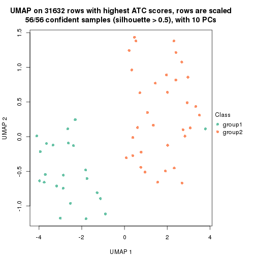</p>

</div>
<div id='tab-ATC-skmeans-dimension-reduction-2'>
<pre><code class="r">dimension_reduction(res, k = 3, method = &quot;UMAP&quot;)
</code></pre>

<p>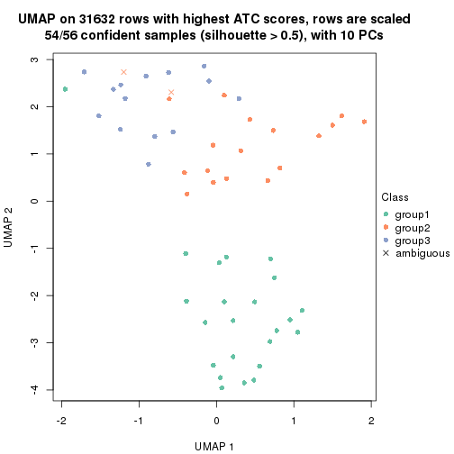</p>

</div>
<div id='tab-ATC-skmeans-dimension-reduction-3'>
<pre><code class="r">dimension_reduction(res, k = 4, method = &quot;UMAP&quot;)
</code></pre>

<p>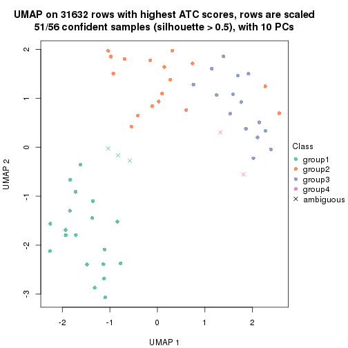</p>

</div>
<div id='tab-ATC-skmeans-dimension-reduction-4'>
<pre><code class="r">dimension_reduction(res, k = 5, method = &quot;UMAP&quot;)
</code></pre>

<p>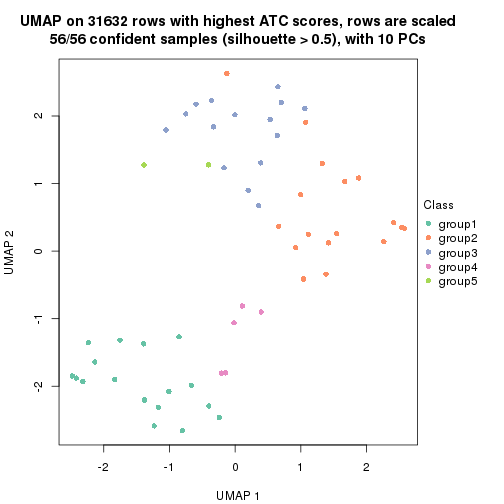</p>

</div>
<div id='tab-ATC-skmeans-dimension-reduction-5'>
<pre><code class="r">dimension_reduction(res, k = 6, method = &quot;UMAP&quot;)
</code></pre>

<p>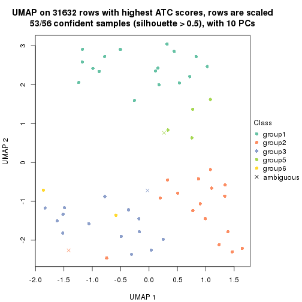</p>

</div>
</div>


Following heatmap shows how subgroups are split when increasing `k`:

```r
collect_classes(res)
```

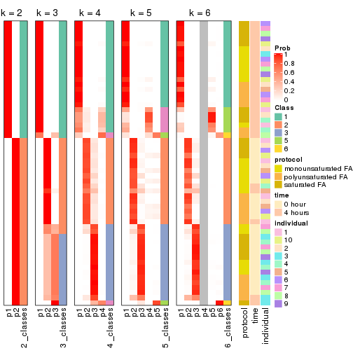


Test correlation between subgroups and known annotations. If the known
annotation is numeric, one-way ANOVA test is applied, and if the known
annotation is discrete, chi-squared contingency table test is applied.

```r
test_to_known_factors(res)
```

```
#>              n protocol(p)  time(p) individual(p) k
#> ATC:skmeans 56       0.937 2.29e-09        0.9502 2
#> ATC:skmeans 54       0.752 8.20e-09        0.0133 3
#> ATC:skmeans 51       0.976 8.14e-09        0.0153 4
#> ATC:skmeans 56       0.880 1.39e-08        0.0176 5
#> ATC:skmeans 53       0.964 2.49e-09        0.0217 6
```


If matrix rows can be associated to genes, consider to use `functional_enrichment(res,
...)` to perform function enrichment for the signature genes. See [this vignette](http://bioconductor.org/packages/devel/bioc/vignettes/cola/inst/doc/functional_enrichment.html) for more detailed explanations.


 

---------------------------------------------------


### ATC:pam**


The object with results only for a single top-value method and a single partition method 
can be extracted as:

```r
res = res_list["ATC", "pam"]
# you can also extract it by
# res = res_list["ATC:pam"]
```

A summary of `res` and all the functions that can be applied to it:

```r
res
```

```
#> A 'ConsensusPartition' object with k = 2, 3, 4, 5, 6.
#>   On a matrix with 31632 rows and 56 columns.
#>   Top rows (1000, 2000, 3000, 4000, 5000) are extracted by 'ATC' method.
#>   Subgroups are detected by 'pam' method.
#>   Performed in total 1250 partitions by row resampling.
#>   Best k for subgroups seems to be 3.
#> 
#> Following methods can be applied to this 'ConsensusPartition' object:
#>  [1] "cola_report"             "collect_classes"         "collect_plots"          
#>  [4] "collect_stats"           "colnames"                "compare_signatures"     
#>  [7] "consensus_heatmap"       "dimension_reduction"     "functional_enrichment"  
#> [10] "get_anno_col"            "get_anno"                "get_classes"            
#> [13] "get_consensus"           "get_matrix"              "get_membership"         
#> [16] "get_param"               "get_signatures"          "get_stats"              
#> [19] "is_best_k"               "is_stable_k"             "membership_heatmap"     
#> [22] "ncol"                    "nrow"                    "plot_ecdf"              
#> [25] "rownames"                "select_partition_number" "show"                   
#> [28] "suggest_best_k"          "test_to_known_factors"
```

`collect_plots()` function collects all the plots made from `res` for all `k` (number of partitions)
into one single page to provide an easy and fast comparison between different `k`.

```r
collect_plots(res)
```

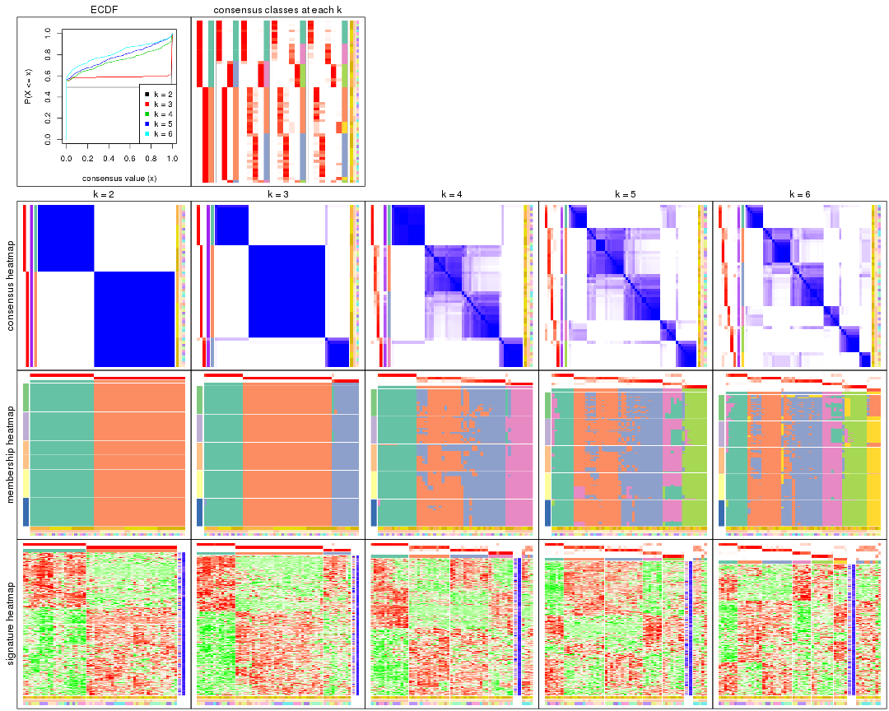

The plots are:

- The first row: a plot of the ECDF (empirical cumulative distribution
  function) curves of the consensus matrix for each `k` and the heatmap of
  predicted classes for each `k`.
- The second row: heatmaps of the consensus matrix for each `k`.
- The third row: heatmaps of the membership matrix for each `k`.
- The fouth row: heatmaps of the signatures for each `k`.

All the plots in panels can be made by individual functions and they are
plotted later in this section.

`select_partition_number()` produces several plots showing different
statistics for choosing "optimized" `k`. There are following statistics:

- ECDF curves of the consensus matrix for each `k`;
- 1-PAC. [The PAC
  score](https://en.wikipedia.org/wiki/Consensus_clustering#Over-interpretation_potential_of_consensus_clustering)
  measures the proportion of the ambiguous subgrouping.
- Mean silhouette score.
- Concordance. The mean probability of fiting the consensus class ids in all
  partitions.
- Area increased. Denote $A_k$ as the area under the ECDF curve for current
  `k`, the area increased is defined as $A_k - A_{k-1}$.
- Rand index. The percent of pairs of samples that are both in a same cluster
  or both are not in a same cluster in the partition of k and k-1.
- Jaccard index. The ratio of pairs of samples are both in a same cluster in
  the partition of k and k-1 and the pairs of samples are both in a same
  cluster in the partition k or k-1.

The detailed explanations of these statistics can be found in [the _cola_
vignette](http://bioconductor.org/packages/devel/bioc/vignettes/cola/inst/doc/cola.html#toc_13).

Generally speaking, lower PAC score, higher mean silhouette score or higher
concordance corresponds to better partition. Rand index and Jaccard index
measure how similar the current partition is compared to partition with `k-1`.
If they are too similar, we won't accept `k` is better than `k-1`.

```r
select_partition_number(res)
```

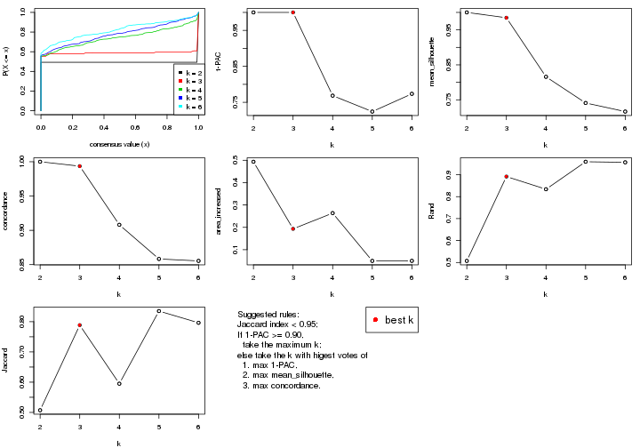

The numeric values for all these statistics can be obtained by `get_stats()`.

```r
get_stats(res)
```

```
#>   k 1-PAC mean_silhouette concordance area_increased  Rand Jaccard
#> 2 2 1.000           1.000       1.000         0.4934 0.507   0.507
#> 3 3 1.000           0.985       0.994         0.1933 0.892   0.789
#> 4 4 0.769           0.816       0.908         0.2636 0.834   0.595
#> 5 5 0.724           0.741       0.858         0.0498 0.959   0.835
#> 6 6 0.774           0.716       0.855         0.0501 0.956   0.796
```

`suggest_best_k()` suggests the best $k$ based on these statistics. The rules are as follows:

- All $k$ with Jaccard index larger than 0.95 are removed because increasing
  $k$ does not provide enough extra information. If all $k$ are removed, it is
  marked as no subgroup is detected.
- For all $k$ with 1-PAC score larger than 0.9, the maximal $k$ is taken as
  the best $k$, and other $k$ are marked as optional $k$.
- If it does not fit the second rule. The $k$ with the maximal vote of the
  highest 1-PAC score, highest mean silhouette, and highest concordance is
  taken as the best $k$.

```r
suggest_best_k(res)
```

```
#> [1] 3
#> attr(,"optional")
#> [1] 2
```

There is also optional best $k$ = 2 that is worth to check.

Following shows the table of the partitions (You need to click the **show/hide
code output** link to see it). The membership matrix (columns with name `p*`)
is inferred by
[`clue::cl_consensus()`](https://www.rdocumentation.org/link/cl_consensus?package=clue)
function with the `SE` method. Basically the value in the membership matrix
represents the probability to belong to a certain group. The finall class
label for an item is determined with the group with highest probability it
belongs to.

In `get_classes()` function, the entropy is calculated from the membership
matrix and the silhouette score is calculated from the consensus matrix.


<script>
$( function() {
	$( '#tabs-ATC-pam-get-classes' ).tabs();
} );
</script>
<div id='tabs-ATC-pam-get-classes'>
<ul>
<li><a href='#tab-ATC-pam-get-classes-1'>k = 2</a></li>
<li><a href='#tab-ATC-pam-get-classes-2'>k = 3</a></li>
<li><a href='#tab-ATC-pam-get-classes-3'>k = 4</a></li>
<li><a href='#tab-ATC-pam-get-classes-4'>k = 5</a></li>
<li><a href='#tab-ATC-pam-get-classes-5'>k = 6</a></li>
</ul>

<div id='tab-ATC-pam-get-classes-1'>
<p><a id='tab-ATC-pam-get-classes-1-a' style='color:#0366d6' href='#'>show/hide code output</a></p>
<pre><code class="r">cbind(get_classes(res, k = 2), get_membership(res, k = 2))
</code></pre>

<pre><code>#&gt;           class entropy silhouette p1 p2
#&gt; GSM790742     2       0          1  0  1
#&gt; GSM790744     2       0          1  0  1
#&gt; GSM790754     2       0          1  0  1
#&gt; GSM790756     2       0          1  0  1
#&gt; GSM790768     2       0          1  0  1
#&gt; GSM790774     2       0          1  0  1
#&gt; GSM790778     2       0          1  0  1
#&gt; GSM790784     2       0          1  0  1
#&gt; GSM790790     2       0          1  0  1
#&gt; GSM790743     1       0          1  1  0
#&gt; GSM790745     1       0          1  1  0
#&gt; GSM790755     2       0          1  0  1
#&gt; GSM790757     1       0          1  1  0
#&gt; GSM790769     1       0          1  1  0
#&gt; GSM790775     1       0          1  1  0
#&gt; GSM790779     1       0          1  1  0
#&gt; GSM790785     1       0          1  1  0
#&gt; GSM790791     1       0          1  1  0
#&gt; GSM790738     2       0          1  0  1
#&gt; GSM790746     2       0          1  0  1
#&gt; GSM790752     2       0          1  0  1
#&gt; GSM790758     2       0          1  0  1
#&gt; GSM790764     2       0          1  0  1
#&gt; GSM790766     2       0          1  0  1
#&gt; GSM790772     2       0          1  0  1
#&gt; GSM790782     2       0          1  0  1
#&gt; GSM790786     2       0          1  0  1
#&gt; GSM790792     2       0          1  0  1
#&gt; GSM790739     1       0          1  1  0
#&gt; GSM790747     1       0          1  1  0
#&gt; GSM790753     1       0          1  1  0
#&gt; GSM790759     2       0          1  0  1
#&gt; GSM790765     2       0          1  0  1
#&gt; GSM790767     1       0          1  1  0
#&gt; GSM790773     1       0          1  1  0
#&gt; GSM790783     1       0          1  1  0
#&gt; GSM790787     1       0          1  1  0
#&gt; GSM790793     1       0          1  1  0
#&gt; GSM790740     2       0          1  0  1
#&gt; GSM790748     2       0          1  0  1
#&gt; GSM790750     2       0          1  0  1
#&gt; GSM790760     2       0          1  0  1
#&gt; GSM790762     2       0          1  0  1
#&gt; GSM790770     2       0          1  0  1
#&gt; GSM790776     2       0          1  0  1
#&gt; GSM790780     2       0          1  0  1
#&gt; GSM790788     2       0          1  0  1
#&gt; GSM790741     2       0          1  0  1
#&gt; GSM790749     1       0          1  1  0
#&gt; GSM790751     2       0          1  0  1
#&gt; GSM790761     1       0          1  1  0
#&gt; GSM790763     1       0          1  1  0
#&gt; GSM790771     1       0          1  1  0
#&gt; GSM790777     1       0          1  1  0
#&gt; GSM790781     1       0          1  1  0
#&gt; GSM790789     1       0          1  1  0
</code></pre>

<script>
$('#tab-ATC-pam-get-classes-1-a').parent().next().next().hide();
$('#tab-ATC-pam-get-classes-1-a').click(function(){
  $('#tab-ATC-pam-get-classes-1-a').parent().next().next().toggle();
  return(false);
});
</script>
</div>

<div id='tab-ATC-pam-get-classes-2'>
<p><a id='tab-ATC-pam-get-classes-2-a' style='color:#0366d6' href='#'>show/hide code output</a></p>
<pre><code class="r">cbind(get_classes(res, k = 3), get_membership(res, k = 3))
</code></pre>

<pre><code>#&gt;           class entropy silhouette    p1    p2    p3
#&gt; GSM790742     2   0.000      1.000 0.000 1.000 0.000
#&gt; GSM790744     2   0.000      1.000 0.000 1.000 0.000
#&gt; GSM790754     2   0.000      1.000 0.000 1.000 0.000
#&gt; GSM790756     2   0.000      1.000 0.000 1.000 0.000
#&gt; GSM790768     2   0.000      1.000 0.000 1.000 0.000
#&gt; GSM790774     2   0.000      1.000 0.000 1.000 0.000
#&gt; GSM790778     2   0.000      1.000 0.000 1.000 0.000
#&gt; GSM790784     2   0.000      1.000 0.000 1.000 0.000
#&gt; GSM790790     2   0.000      1.000 0.000 1.000 0.000
#&gt; GSM790743     3   0.000      0.963 0.000 0.000 1.000
#&gt; GSM790745     3   0.000      0.963 0.000 0.000 1.000
#&gt; GSM790755     3   0.129      0.930 0.000 0.032 0.968
#&gt; GSM790757     3   0.000      0.963 0.000 0.000 1.000
#&gt; GSM790769     1   0.000      0.996 1.000 0.000 0.000
#&gt; GSM790775     1   0.000      0.996 1.000 0.000 0.000
#&gt; GSM790779     1   0.000      0.996 1.000 0.000 0.000
#&gt; GSM790785     1   0.000      0.996 1.000 0.000 0.000
#&gt; GSM790791     3   0.540      0.610 0.280 0.000 0.720
#&gt; GSM790738     2   0.000      1.000 0.000 1.000 0.000
#&gt; GSM790746     2   0.000      1.000 0.000 1.000 0.000
#&gt; GSM790752     2   0.000      1.000 0.000 1.000 0.000
#&gt; GSM790758     2   0.000      1.000 0.000 1.000 0.000
#&gt; GSM790764     2   0.000      1.000 0.000 1.000 0.000
#&gt; GSM790766     2   0.000      1.000 0.000 1.000 0.000
#&gt; GSM790772     2   0.000      1.000 0.000 1.000 0.000
#&gt; GSM790782     2   0.000      1.000 0.000 1.000 0.000
#&gt; GSM790786     2   0.000      1.000 0.000 1.000 0.000
#&gt; GSM790792     2   0.000      1.000 0.000 1.000 0.000
#&gt; GSM790739     3   0.000      0.963 0.000 0.000 1.000
#&gt; GSM790747     1   0.000      0.996 1.000 0.000 0.000
#&gt; GSM790753     1   0.175      0.947 0.952 0.000 0.048
#&gt; GSM790759     2   0.000      1.000 0.000 1.000 0.000
#&gt; GSM790765     2   0.000      1.000 0.000 1.000 0.000
#&gt; GSM790767     1   0.000      0.996 1.000 0.000 0.000
#&gt; GSM790773     1   0.000      0.996 1.000 0.000 0.000
#&gt; GSM790783     1   0.000      0.996 1.000 0.000 0.000
#&gt; GSM790787     1   0.000      0.996 1.000 0.000 0.000
#&gt; GSM790793     3   0.000      0.963 0.000 0.000 1.000
#&gt; GSM790740     2   0.000      1.000 0.000 1.000 0.000
#&gt; GSM790748     2   0.000      1.000 0.000 1.000 0.000
#&gt; GSM790750     2   0.000      1.000 0.000 1.000 0.000
#&gt; GSM790760     2   0.000      1.000 0.000 1.000 0.000
#&gt; GSM790762     2   0.000      1.000 0.000 1.000 0.000
#&gt; GSM790770     2   0.000      1.000 0.000 1.000 0.000
#&gt; GSM790776     2   0.000      1.000 0.000 1.000 0.000
#&gt; GSM790780     2   0.000      1.000 0.000 1.000 0.000
#&gt; GSM790788     2   0.000      1.000 0.000 1.000 0.000
#&gt; GSM790741     2   0.000      1.000 0.000 1.000 0.000
#&gt; GSM790749     1   0.000      0.996 1.000 0.000 0.000
#&gt; GSM790751     2   0.000      1.000 0.000 1.000 0.000
#&gt; GSM790761     3   0.000      0.963 0.000 0.000 1.000
#&gt; GSM790763     3   0.000      0.963 0.000 0.000 1.000
#&gt; GSM790771     1   0.000      0.996 1.000 0.000 0.000
#&gt; GSM790777     1   0.000      0.996 1.000 0.000 0.000
#&gt; GSM790781     3   0.000      0.963 0.000 0.000 1.000
#&gt; GSM790789     1   0.000      0.996 1.000 0.000 0.000
</code></pre>

<script>
$('#tab-ATC-pam-get-classes-2-a').parent().next().next().hide();
$('#tab-ATC-pam-get-classes-2-a').click(function(){
  $('#tab-ATC-pam-get-classes-2-a').parent().next().next().toggle();
  return(false);
});
</script>
</div>

<div id='tab-ATC-pam-get-classes-3'>
<p><a id='tab-ATC-pam-get-classes-3-a' style='color:#0366d6' href='#'>show/hide code output</a></p>
<pre><code class="r">cbind(get_classes(res, k = 4), get_membership(res, k = 4))
</code></pre>

<pre><code>#&gt;           class entropy silhouette    p1    p2    p3    p4
#&gt; GSM790742     2  0.2530      0.838 0.000 0.888 0.112 0.000
#&gt; GSM790744     2  0.2469      0.846 0.000 0.892 0.108 0.000
#&gt; GSM790754     3  0.4981     -0.137 0.000 0.464 0.536 0.000
#&gt; GSM790756     3  0.1118      0.836 0.000 0.036 0.964 0.000
#&gt; GSM790768     2  0.3444      0.791 0.000 0.816 0.184 0.000
#&gt; GSM790774     3  0.0707      0.838 0.000 0.020 0.980 0.000
#&gt; GSM790778     3  0.2011      0.809 0.000 0.080 0.920 0.000
#&gt; GSM790784     3  0.0000      0.839 0.000 0.000 1.000 0.000
#&gt; GSM790790     2  0.1792      0.808 0.000 0.932 0.068 0.000
#&gt; GSM790743     4  0.0188      0.924 0.000 0.004 0.000 0.996
#&gt; GSM790745     4  0.0000      0.925 0.000 0.000 0.000 1.000
#&gt; GSM790755     4  0.4679      0.455 0.000 0.000 0.352 0.648
#&gt; GSM790757     4  0.0000      0.925 0.000 0.000 0.000 1.000
#&gt; GSM790769     1  0.0336      0.992 0.992 0.008 0.000 0.000
#&gt; GSM790775     1  0.0000      0.992 1.000 0.000 0.000 0.000
#&gt; GSM790779     1  0.0000      0.992 1.000 0.000 0.000 0.000
#&gt; GSM790785     1  0.0000      0.992 1.000 0.000 0.000 0.000
#&gt; GSM790791     4  0.4718      0.585 0.280 0.012 0.000 0.708
#&gt; GSM790738     2  0.2281      0.847 0.000 0.904 0.096 0.000
#&gt; GSM790746     2  0.2149      0.847 0.000 0.912 0.088 0.000
#&gt; GSM790752     2  0.4961      0.341 0.000 0.552 0.448 0.000
#&gt; GSM790758     3  0.0000      0.839 0.000 0.000 1.000 0.000
#&gt; GSM790764     3  0.3837      0.713 0.000 0.224 0.776 0.000
#&gt; GSM790766     2  0.4661      0.581 0.000 0.652 0.348 0.000
#&gt; GSM790772     3  0.2345      0.808 0.000 0.100 0.900 0.000
#&gt; GSM790782     3  0.4008      0.633 0.000 0.244 0.756 0.000
#&gt; GSM790786     3  0.0188      0.840 0.000 0.004 0.996 0.000
#&gt; GSM790792     2  0.0921      0.821 0.000 0.972 0.028 0.000
#&gt; GSM790739     4  0.0000      0.925 0.000 0.000 0.000 1.000
#&gt; GSM790747     1  0.0336      0.992 0.992 0.008 0.000 0.000
#&gt; GSM790753     1  0.1576      0.944 0.948 0.004 0.000 0.048
#&gt; GSM790759     3  0.4790      0.378 0.000 0.380 0.620 0.000
#&gt; GSM790765     3  0.2281      0.797 0.000 0.096 0.904 0.000
#&gt; GSM790767     1  0.0469      0.990 0.988 0.012 0.000 0.000
#&gt; GSM790773     1  0.0000      0.992 1.000 0.000 0.000 0.000
#&gt; GSM790783     1  0.0000      0.992 1.000 0.000 0.000 0.000
#&gt; GSM790787     1  0.0000      0.992 1.000 0.000 0.000 0.000
#&gt; GSM790793     4  0.0000      0.925 0.000 0.000 0.000 1.000
#&gt; GSM790740     2  0.2469      0.846 0.000 0.892 0.108 0.000
#&gt; GSM790748     2  0.4713      0.576 0.000 0.640 0.360 0.000
#&gt; GSM790750     3  0.4164      0.533 0.000 0.264 0.736 0.000
#&gt; GSM790760     3  0.0000      0.839 0.000 0.000 1.000 0.000
#&gt; GSM790762     2  0.1557      0.814 0.000 0.944 0.056 0.000
#&gt; GSM790770     2  0.1474      0.830 0.000 0.948 0.052 0.000
#&gt; GSM790776     3  0.1022      0.837 0.000 0.032 0.968 0.000
#&gt; GSM790780     3  0.0000      0.839 0.000 0.000 1.000 0.000
#&gt; GSM790788     2  0.0469      0.819 0.000 0.988 0.012 0.000
#&gt; GSM790741     2  0.2469      0.846 0.000 0.892 0.108 0.000
#&gt; GSM790749     1  0.0336      0.992 0.992 0.008 0.000 0.000
#&gt; GSM790751     2  0.4193      0.713 0.000 0.732 0.268 0.000
#&gt; GSM790761     4  0.0188      0.924 0.000 0.004 0.000 0.996
#&gt; GSM790763     4  0.0000      0.925 0.000 0.000 0.000 1.000
#&gt; GSM790771     1  0.0336      0.992 0.992 0.008 0.000 0.000
#&gt; GSM790777     1  0.0000      0.992 1.000 0.000 0.000 0.000
#&gt; GSM790781     4  0.0000      0.925 0.000 0.000 0.000 1.000
#&gt; GSM790789     1  0.0469      0.990 0.988 0.012 0.000 0.000
</code></pre>

<script>
$('#tab-ATC-pam-get-classes-3-a').parent().next().next().hide();
$('#tab-ATC-pam-get-classes-3-a').click(function(){
  $('#tab-ATC-pam-get-classes-3-a').parent().next().next().toggle();
  return(false);
});
</script>
</div>

<div id='tab-ATC-pam-get-classes-4'>
<p><a id='tab-ATC-pam-get-classes-4-a' style='color:#0366d6' href='#'>show/hide code output</a></p>
<pre><code class="r">cbind(get_classes(res, k = 5), get_membership(res, k = 5))
</code></pre>

<pre><code>#&gt;           class entropy silhouette    p1    p2    p3    p4    p5
#&gt; GSM790742     2  0.1732      0.819 0.000 0.920 0.080 0.000 0.000
#&gt; GSM790744     2  0.1478      0.826 0.000 0.936 0.064 0.000 0.000
#&gt; GSM790754     3  0.4302     -0.107 0.000 0.480 0.520 0.000 0.000
#&gt; GSM790756     3  0.1043      0.825 0.000 0.040 0.960 0.000 0.000
#&gt; GSM790768     2  0.2471      0.779 0.000 0.864 0.136 0.000 0.000
#&gt; GSM790774     3  0.0609      0.827 0.000 0.020 0.980 0.000 0.000
#&gt; GSM790778     3  0.1792      0.800 0.000 0.084 0.916 0.000 0.000
#&gt; GSM790784     3  0.0000      0.827 0.000 0.000 1.000 0.000 0.000
#&gt; GSM790790     2  0.2629      0.774 0.000 0.860 0.004 0.136 0.000
#&gt; GSM790743     5  0.0510      0.914 0.000 0.000 0.000 0.016 0.984
#&gt; GSM790745     5  0.0000      0.917 0.000 0.000 0.000 0.000 1.000
#&gt; GSM790755     5  0.4114      0.391 0.000 0.000 0.376 0.000 0.624
#&gt; GSM790757     5  0.0000      0.917 0.000 0.000 0.000 0.000 1.000
#&gt; GSM790769     4  0.4210      0.722 0.412 0.000 0.000 0.588 0.000
#&gt; GSM790775     1  0.0000      0.882 1.000 0.000 0.000 0.000 0.000
#&gt; GSM790779     1  0.1121      0.856 0.956 0.000 0.000 0.044 0.000
#&gt; GSM790785     1  0.0162      0.881 0.996 0.000 0.000 0.004 0.000
#&gt; GSM790791     4  0.2471      0.574 0.000 0.000 0.000 0.864 0.136
#&gt; GSM790738     2  0.1270      0.827 0.000 0.948 0.052 0.000 0.000
#&gt; GSM790746     2  0.1121      0.826 0.000 0.956 0.044 0.000 0.000
#&gt; GSM790752     2  0.4235      0.332 0.000 0.576 0.424 0.000 0.000
#&gt; GSM790758     3  0.0000      0.827 0.000 0.000 1.000 0.000 0.000
#&gt; GSM790764     3  0.5375      0.591 0.000 0.200 0.664 0.136 0.000
#&gt; GSM790766     2  0.3895      0.560 0.000 0.680 0.320 0.000 0.000
#&gt; GSM790772     3  0.2329      0.787 0.000 0.124 0.876 0.000 0.000
#&gt; GSM790782     3  0.3636      0.608 0.000 0.272 0.728 0.000 0.000
#&gt; GSM790786     3  0.0404      0.829 0.000 0.012 0.988 0.000 0.000
#&gt; GSM790792     2  0.2471      0.776 0.000 0.864 0.000 0.136 0.000
#&gt; GSM790739     5  0.0000      0.917 0.000 0.000 0.000 0.000 1.000
#&gt; GSM790747     4  0.4287      0.650 0.460 0.000 0.000 0.540 0.000
#&gt; GSM790753     1  0.5250      0.200 0.536 0.000 0.000 0.416 0.048
#&gt; GSM790759     3  0.4219      0.334 0.000 0.416 0.584 0.000 0.000
#&gt; GSM790765     3  0.2853      0.781 0.000 0.072 0.876 0.052 0.000
#&gt; GSM790767     4  0.2966      0.727 0.184 0.000 0.000 0.816 0.000
#&gt; GSM790773     1  0.0000      0.882 1.000 0.000 0.000 0.000 0.000
#&gt; GSM790783     1  0.0000      0.882 1.000 0.000 0.000 0.000 0.000
#&gt; GSM790787     1  0.2377      0.783 0.872 0.000 0.000 0.128 0.000
#&gt; GSM790793     5  0.0162      0.917 0.000 0.000 0.000 0.004 0.996
#&gt; GSM790740     2  0.1478      0.826 0.000 0.936 0.064 0.000 0.000
#&gt; GSM790748     2  0.3983      0.547 0.000 0.660 0.340 0.000 0.000
#&gt; GSM790750     3  0.3508      0.572 0.000 0.252 0.748 0.000 0.000
#&gt; GSM790760     3  0.0000      0.827 0.000 0.000 1.000 0.000 0.000
#&gt; GSM790762     2  0.2471      0.776 0.000 0.864 0.000 0.136 0.000
#&gt; GSM790770     2  0.0703      0.816 0.000 0.976 0.024 0.000 0.000
#&gt; GSM790776     3  0.0963      0.826 0.000 0.036 0.964 0.000 0.000
#&gt; GSM790780     3  0.0000      0.827 0.000 0.000 1.000 0.000 0.000
#&gt; GSM790788     2  0.2471      0.776 0.000 0.864 0.000 0.136 0.000
#&gt; GSM790741     2  0.1478      0.826 0.000 0.936 0.064 0.000 0.000
#&gt; GSM790749     4  0.4161      0.739 0.392 0.000 0.000 0.608 0.000
#&gt; GSM790751     2  0.3508      0.678 0.000 0.748 0.252 0.000 0.000
#&gt; GSM790761     5  0.2424      0.829 0.000 0.000 0.000 0.132 0.868
#&gt; GSM790763     5  0.1043      0.901 0.000 0.000 0.000 0.040 0.960
#&gt; GSM790771     4  0.4088      0.747 0.368 0.000 0.000 0.632 0.000
#&gt; GSM790777     1  0.0000      0.882 1.000 0.000 0.000 0.000 0.000
#&gt; GSM790781     5  0.0000      0.917 0.000 0.000 0.000 0.000 1.000
#&gt; GSM790789     4  0.2813      0.720 0.168 0.000 0.000 0.832 0.000
</code></pre>

<script>
$('#tab-ATC-pam-get-classes-4-a').parent().next().next().hide();
$('#tab-ATC-pam-get-classes-4-a').click(function(){
  $('#tab-ATC-pam-get-classes-4-a').parent().next().next().toggle();
  return(false);
});
</script>
</div>

<div id='tab-ATC-pam-get-classes-5'>
<p><a id='tab-ATC-pam-get-classes-5-a' style='color:#0366d6' href='#'>show/hide code output</a></p>
<pre><code class="r">cbind(get_classes(res, k = 6), get_membership(res, k = 6))
</code></pre>

<pre><code>#&gt;           class entropy silhouette    p1    p2    p3    p4    p5    p6
#&gt; GSM790742     2  0.0458      0.764 0.000 0.984 0.016 0.000 0.000 0.000
#&gt; GSM790744     2  0.0000      0.771 0.000 1.000 0.000 0.000 0.000 0.000
#&gt; GSM790754     3  0.3862     -0.211 0.000 0.476 0.524 0.000 0.000 0.000
#&gt; GSM790756     3  0.1285      0.774 0.000 0.052 0.944 0.000 0.000 0.004
#&gt; GSM790768     2  0.0146      0.770 0.000 0.996 0.004 0.000 0.000 0.000
#&gt; GSM790774     3  0.0363      0.781 0.000 0.012 0.988 0.000 0.000 0.000
#&gt; GSM790778     3  0.1863      0.743 0.000 0.104 0.896 0.000 0.000 0.000
#&gt; GSM790784     3  0.0458      0.780 0.000 0.000 0.984 0.000 0.000 0.016
#&gt; GSM790790     6  0.2854      0.940 0.000 0.208 0.000 0.000 0.000 0.792
#&gt; GSM790743     5  0.3071      0.792 0.000 0.000 0.000 0.016 0.804 0.180
#&gt; GSM790745     5  0.0000      0.874 0.000 0.000 0.000 0.000 1.000 0.000
#&gt; GSM790755     5  0.4385      0.168 0.000 0.000 0.444 0.000 0.532 0.024
#&gt; GSM790757     5  0.0000      0.874 0.000 0.000 0.000 0.000 1.000 0.000
#&gt; GSM790769     4  0.2969      0.814 0.224 0.000 0.000 0.776 0.000 0.000
#&gt; GSM790775     1  0.0865      0.903 0.964 0.000 0.000 0.036 0.000 0.000
#&gt; GSM790779     1  0.0260      0.882 0.992 0.000 0.000 0.008 0.000 0.000
#&gt; GSM790785     1  0.0790      0.902 0.968 0.000 0.000 0.032 0.000 0.000
#&gt; GSM790791     4  0.1010      0.788 0.036 0.000 0.000 0.960 0.000 0.004
#&gt; GSM790738     2  0.0000      0.771 0.000 1.000 0.000 0.000 0.000 0.000
#&gt; GSM790746     2  0.0000      0.771 0.000 1.000 0.000 0.000 0.000 0.000
#&gt; GSM790752     2  0.4246      0.260 0.000 0.532 0.452 0.000 0.000 0.016
#&gt; GSM790758     3  0.0632      0.779 0.000 0.000 0.976 0.000 0.000 0.024
#&gt; GSM790764     6  0.3313      0.763 0.000 0.060 0.124 0.000 0.000 0.816
#&gt; GSM790766     2  0.3652      0.564 0.000 0.720 0.264 0.000 0.000 0.016
#&gt; GSM790772     3  0.3314      0.606 0.000 0.256 0.740 0.000 0.000 0.004
#&gt; GSM790782     3  0.3828      0.295 0.000 0.440 0.560 0.000 0.000 0.000
#&gt; GSM790786     3  0.0547      0.782 0.000 0.020 0.980 0.000 0.000 0.000
#&gt; GSM790792     6  0.2854      0.940 0.000 0.208 0.000 0.000 0.000 0.792
#&gt; GSM790739     5  0.0000      0.874 0.000 0.000 0.000 0.000 1.000 0.000
#&gt; GSM790747     4  0.3351      0.742 0.288 0.000 0.000 0.712 0.000 0.000
#&gt; GSM790753     1  0.4773      0.367 0.572 0.000 0.000 0.376 0.048 0.004
#&gt; GSM790759     3  0.3868      0.165 0.000 0.496 0.504 0.000 0.000 0.000
#&gt; GSM790765     3  0.4057      0.269 0.000 0.012 0.600 0.000 0.000 0.388
#&gt; GSM790767     4  0.0363      0.817 0.012 0.000 0.000 0.988 0.000 0.000
#&gt; GSM790773     1  0.0865      0.903 0.964 0.000 0.000 0.036 0.000 0.000
#&gt; GSM790783     1  0.0865      0.903 0.964 0.000 0.000 0.036 0.000 0.000
#&gt; GSM790787     1  0.1753      0.827 0.912 0.000 0.000 0.084 0.000 0.004
#&gt; GSM790793     5  0.0146      0.873 0.000 0.000 0.000 0.004 0.996 0.000
#&gt; GSM790740     2  0.0000      0.771 0.000 1.000 0.000 0.000 0.000 0.000
#&gt; GSM790748     2  0.4377      0.271 0.000 0.540 0.436 0.000 0.000 0.024
#&gt; GSM790750     3  0.2333      0.731 0.000 0.092 0.884 0.000 0.000 0.024
#&gt; GSM790760     3  0.0632      0.779 0.000 0.000 0.976 0.000 0.000 0.024
#&gt; GSM790762     6  0.2854      0.940 0.000 0.208 0.000 0.000 0.000 0.792
#&gt; GSM790770     2  0.2389      0.684 0.000 0.888 0.060 0.000 0.000 0.052
#&gt; GSM790776     3  0.1700      0.773 0.000 0.048 0.928 0.000 0.000 0.024
#&gt; GSM790780     3  0.0000      0.780 0.000 0.000 1.000 0.000 0.000 0.000
#&gt; GSM790788     6  0.2854      0.940 0.000 0.208 0.000 0.000 0.000 0.792
#&gt; GSM790741     2  0.0000      0.771 0.000 1.000 0.000 0.000 0.000 0.000
#&gt; GSM790749     4  0.2823      0.828 0.204 0.000 0.000 0.796 0.000 0.000
#&gt; GSM790751     2  0.3672      0.458 0.000 0.632 0.368 0.000 0.000 0.000
#&gt; GSM790761     5  0.4486      0.723 0.000 0.000 0.000 0.112 0.704 0.184
#&gt; GSM790763     5  0.0865      0.862 0.000 0.000 0.000 0.036 0.964 0.000
#&gt; GSM790771     4  0.2631      0.834 0.180 0.000 0.000 0.820 0.000 0.000
#&gt; GSM790777     1  0.0865      0.903 0.964 0.000 0.000 0.036 0.000 0.000
#&gt; GSM790781     5  0.0000      0.874 0.000 0.000 0.000 0.000 1.000 0.000
#&gt; GSM790789     4  0.0291      0.810 0.004 0.000 0.000 0.992 0.000 0.004
</code></pre>

<script>
$('#tab-ATC-pam-get-classes-5-a').parent().next().next().hide();
$('#tab-ATC-pam-get-classes-5-a').click(function(){
  $('#tab-ATC-pam-get-classes-5-a').parent().next().next().toggle();
  return(false);
});
</script>
</div>
</div>

Heatmaps for the consensus matrix. It visualizes the probability of two
samples to be in a same group.


<script>
$( function() {
	$( '#tabs-ATC-pam-consensus-heatmap' ).tabs();
} );
</script>
<div id='tabs-ATC-pam-consensus-heatmap'>
<ul>
<li><a href='#tab-ATC-pam-consensus-heatmap-1'>k = 2</a></li>
<li><a href='#tab-ATC-pam-consensus-heatmap-2'>k = 3</a></li>
<li><a href='#tab-ATC-pam-consensus-heatmap-3'>k = 4</a></li>
<li><a href='#tab-ATC-pam-consensus-heatmap-4'>k = 5</a></li>
<li><a href='#tab-ATC-pam-consensus-heatmap-5'>k = 6</a></li>
</ul>
<div id='tab-ATC-pam-consensus-heatmap-1'>
<pre><code class="r">consensus_heatmap(res, k = 2)
</code></pre>

<p>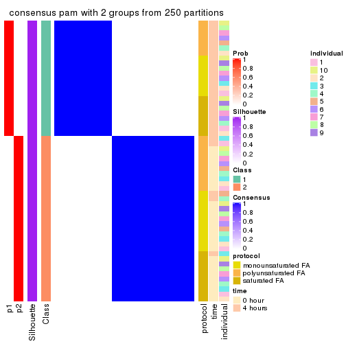</p>

</div>
<div id='tab-ATC-pam-consensus-heatmap-2'>
<pre><code class="r">consensus_heatmap(res, k = 3)
</code></pre>

<p>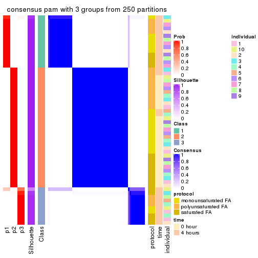</p>

</div>
<div id='tab-ATC-pam-consensus-heatmap-3'>
<pre><code class="r">consensus_heatmap(res, k = 4)
</code></pre>

<p>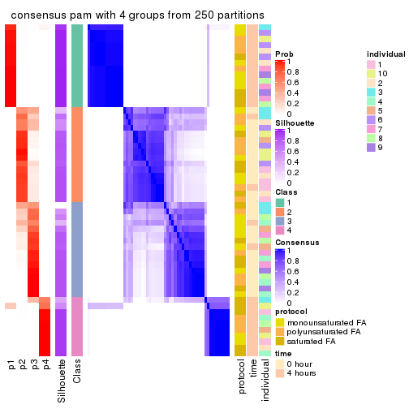</p>

</div>
<div id='tab-ATC-pam-consensus-heatmap-4'>
<pre><code class="r">consensus_heatmap(res, k = 5)
</code></pre>

<p>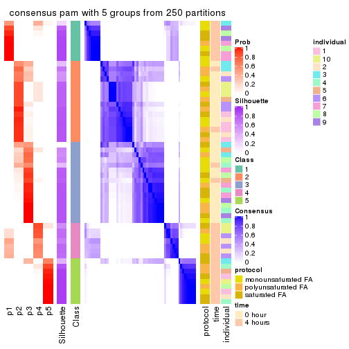</p>

</div>
<div id='tab-ATC-pam-consensus-heatmap-5'>
<pre><code class="r">consensus_heatmap(res, k = 6)
</code></pre>

<p>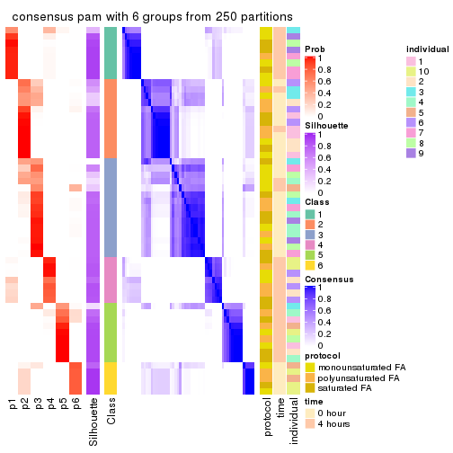</p>

</div>
</div>

Heatmaps for the membership of samples in all partitions to see how consistent they are:


<script>
$( function() {
	$( '#tabs-ATC-pam-membership-heatmap' ).tabs();
} );
</script>
<div id='tabs-ATC-pam-membership-heatmap'>
<ul>
<li><a href='#tab-ATC-pam-membership-heatmap-1'>k = 2</a></li>
<li><a href='#tab-ATC-pam-membership-heatmap-2'>k = 3</a></li>
<li><a href='#tab-ATC-pam-membership-heatmap-3'>k = 4</a></li>
<li><a href='#tab-ATC-pam-membership-heatmap-4'>k = 5</a></li>
<li><a href='#tab-ATC-pam-membership-heatmap-5'>k = 6</a></li>
</ul>
<div id='tab-ATC-pam-membership-heatmap-1'>
<pre><code class="r">membership_heatmap(res, k = 2)
</code></pre>

<p></p>

</div>
<div id='tab-ATC-pam-membership-heatmap-2'>
<pre><code class="r">membership_heatmap(res, k = 3)
</code></pre>

<p>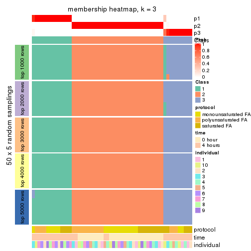</p>

</div>
<div id='tab-ATC-pam-membership-heatmap-3'>
<pre><code class="r">membership_heatmap(res, k = 4)
</code></pre>

<p>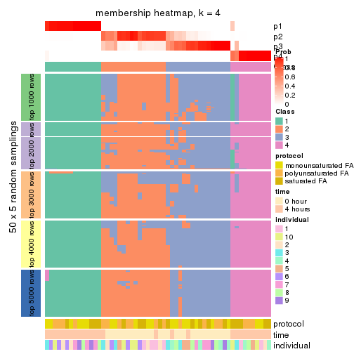</p>

</div>
<div id='tab-ATC-pam-membership-heatmap-4'>
<pre><code class="r">membership_heatmap(res, k = 5)
</code></pre>

<p>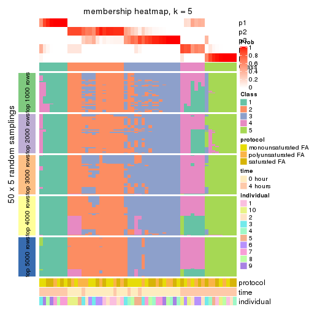</p>

</div>
<div id='tab-ATC-pam-membership-heatmap-5'>
<pre><code class="r">membership_heatmap(res, k = 6)
</code></pre>

<p>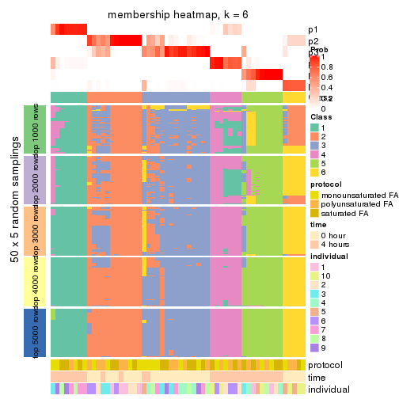</p>

</div>
</div>

As soon as we have had the classes for columns, we can look for signatures
which are significantly different between classes which can be candidate marks
for certain classes. Following are the heatmaps for signatures.


Signature heatmaps where rows are scaled:


<script>
$( function() {
	$( '#tabs-ATC-pam-get-signatures' ).tabs();
} );
</script>
<div id='tabs-ATC-pam-get-signatures'>
<ul>
<li><a href='#tab-ATC-pam-get-signatures-1'>k = 2</a></li>
<li><a href='#tab-ATC-pam-get-signatures-2'>k = 3</a></li>
<li><a href='#tab-ATC-pam-get-signatures-3'>k = 4</a></li>
<li><a href='#tab-ATC-pam-get-signatures-4'>k = 5</a></li>
<li><a href='#tab-ATC-pam-get-signatures-5'>k = 6</a></li>
</ul>
<div id='tab-ATC-pam-get-signatures-1'>
<pre><code class="r">get_signatures(res, k = 2)
</code></pre>

<p></p>

</div>
<div id='tab-ATC-pam-get-signatures-2'>
<pre><code class="r">get_signatures(res, k = 3)
</code></pre>

<p>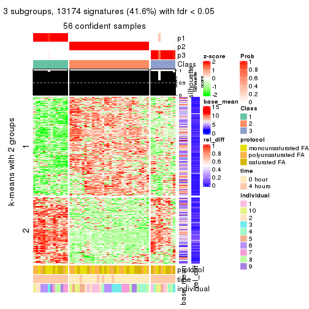</p>

</div>
<div id='tab-ATC-pam-get-signatures-3'>
<pre><code class="r">get_signatures(res, k = 4)
</code></pre>

<p>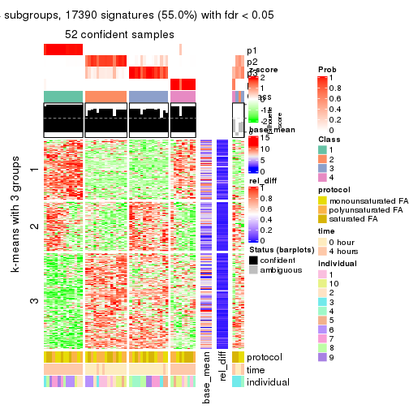</p>

</div>
<div id='tab-ATC-pam-get-signatures-4'>
<pre><code class="r">get_signatures(res, k = 5)
</code></pre>

<p>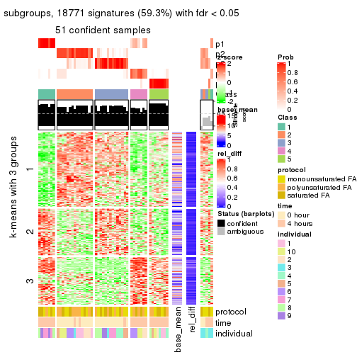</p>

</div>
<div id='tab-ATC-pam-get-signatures-5'>
<pre><code class="r">get_signatures(res, k = 6)
</code></pre>

<p>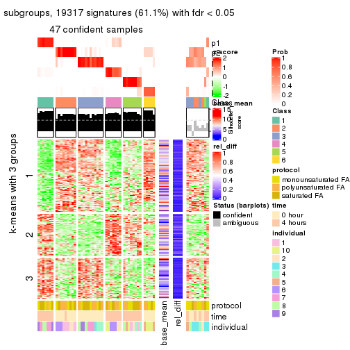</p>

</div>
</div>


Signature heatmaps where rows are not scaled:


<script>
$( function() {
	$( '#tabs-ATC-pam-get-signatures-no-scale' ).tabs();
} );
</script>
<div id='tabs-ATC-pam-get-signatures-no-scale'>
<ul>
<li><a href='#tab-ATC-pam-get-signatures-no-scale-1'>k = 2</a></li>
<li><a href='#tab-ATC-pam-get-signatures-no-scale-2'>k = 3</a></li>
<li><a href='#tab-ATC-pam-get-signatures-no-scale-3'>k = 4</a></li>
<li><a href='#tab-ATC-pam-get-signatures-no-scale-4'>k = 5</a></li>
<li><a href='#tab-ATC-pam-get-signatures-no-scale-5'>k = 6</a></li>
</ul>
<div id='tab-ATC-pam-get-signatures-no-scale-1'>
<pre><code class="r">get_signatures(res, k = 2, scale_rows = FALSE)
</code></pre>

<p></p>

</div>
<div id='tab-ATC-pam-get-signatures-no-scale-2'>
<pre><code class="r">get_signatures(res, k = 3, scale_rows = FALSE)
</code></pre>

<p>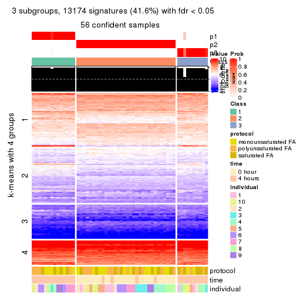</p>

</div>
<div id='tab-ATC-pam-get-signatures-no-scale-3'>
<pre><code class="r">get_signatures(res, k = 4, scale_rows = FALSE)
</code></pre>

<p>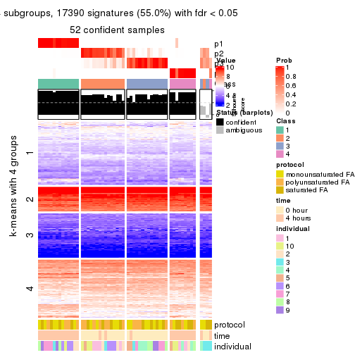</p>

</div>
<div id='tab-ATC-pam-get-signatures-no-scale-4'>
<pre><code class="r">get_signatures(res, k = 5, scale_rows = FALSE)
</code></pre>

<p>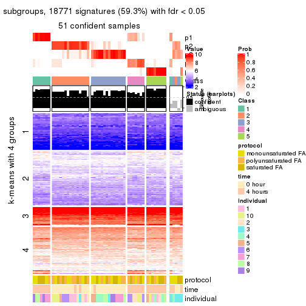</p>

</div>
<div id='tab-ATC-pam-get-signatures-no-scale-5'>
<pre><code class="r">get_signatures(res, k = 6, scale_rows = FALSE)
</code></pre>

<p>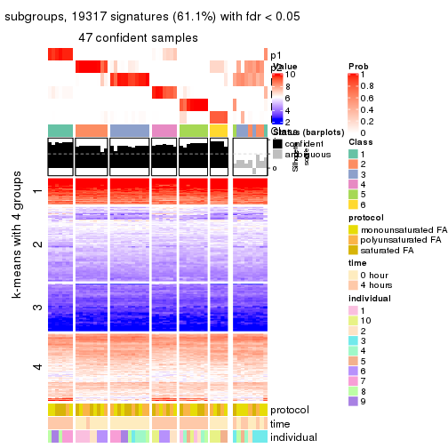</p>

</div>
</div>


Compare the overlap of signatures from different k:

```r
compare_signatures(res)
```

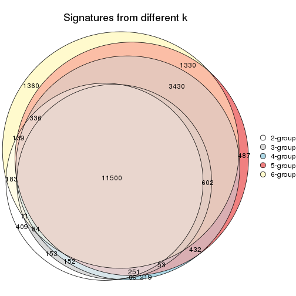

`get_signature()` returns a data frame invisibly. TO get the list of signatures, the function
call should be assigned to a variable explicitly. In following code, if `plot` argument is set
to `FALSE`, no heatmap is plotted while only the differential analysis is performed.

```r
# code only for demonstration
tb = get_signature(res, k = ..., plot = FALSE)
```

An example of the output of `tb` is:

```
#>   which_row         fdr    mean_1    mean_2 scaled_mean_1 scaled_mean_2 km
#> 1        38 0.042760348  8.373488  9.131774    -0.5533452     0.5164555  1
#> 2        40 0.018707592  7.106213  8.469186    -0.6173731     0.5762149  1
#> 3        55 0.019134737 10.221463 11.207825    -0.6159697     0.5749050  1
#> 4        59 0.006059896  5.921854  7.869574    -0.6899429     0.6439467  1
#> 5        60 0.018055526  8.928898 10.211722    -0.6204761     0.5791110  1
#> 6        98 0.009384629 15.714769 14.887706     0.6635654    -0.6193277  2
...
```

The columns in `tb` are:

1. `which_row`: row indices corresponding to the input matrix.
2. `fdr`: FDR for the differential test. 
3. `mean_x`: The mean value in group x.
4. `scaled_mean_x`: The mean value in group x after rows are scaled.
5. `km`: Row groups if k-means clustering is applied to rows.


UMAP plot which shows how samples are separated.


<script>
$( function() {
	$( '#tabs-ATC-pam-dimension-reduction' ).tabs();
} );
</script>
<div id='tabs-ATC-pam-dimension-reduction'>
<ul>
<li><a href='#tab-ATC-pam-dimension-reduction-1'>k = 2</a></li>
<li><a href='#tab-ATC-pam-dimension-reduction-2'>k = 3</a></li>
<li><a href='#tab-ATC-pam-dimension-reduction-3'>k = 4</a></li>
<li><a href='#tab-ATC-pam-dimension-reduction-4'>k = 5</a></li>
<li><a href='#tab-ATC-pam-dimension-reduction-5'>k = 6</a></li>
</ul>
<div id='tab-ATC-pam-dimension-reduction-1'>
<pre><code class="r">dimension_reduction(res, k = 2, method = &quot;UMAP&quot;)
</code></pre>

<p></p>

</div>
<div id='tab-ATC-pam-dimension-reduction-2'>
<pre><code class="r">dimension_reduction(res, k = 3, method = &quot;UMAP&quot;)
</code></pre>

<p>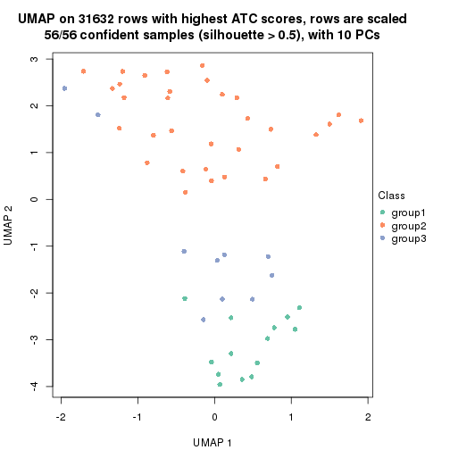</p>

</div>
<div id='tab-ATC-pam-dimension-reduction-3'>
<pre><code class="r">dimension_reduction(res, k = 4, method = &quot;UMAP&quot;)
</code></pre>

<p>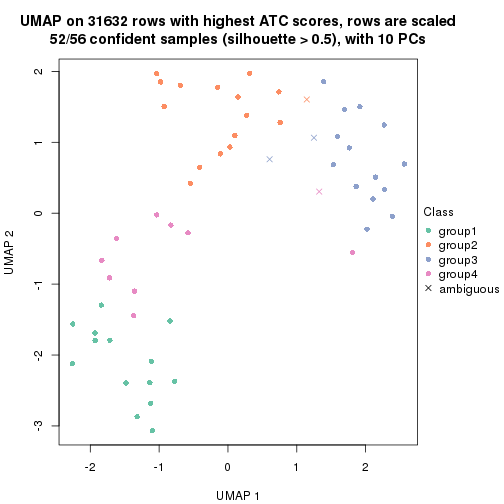</p>

</div>
<div id='tab-ATC-pam-dimension-reduction-4'>
<pre><code class="r">dimension_reduction(res, k = 5, method = &quot;UMAP&quot;)
</code></pre>

<p>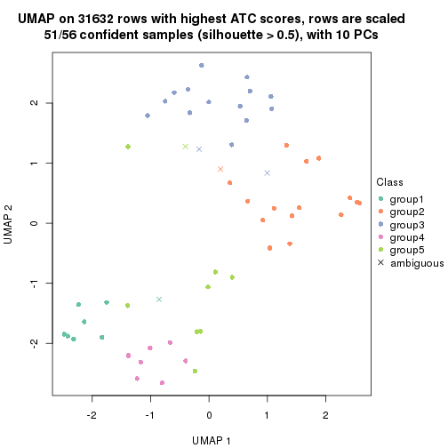</p>

</div>
<div id='tab-ATC-pam-dimension-reduction-5'>
<pre><code class="r">dimension_reduction(res, k = 6, method = &quot;UMAP&quot;)
</code></pre>

<p>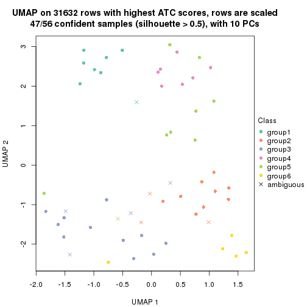</p>

</div>
</div>


Following heatmap shows how subgroups are split when increasing `k`:

```r
collect_classes(res)
```

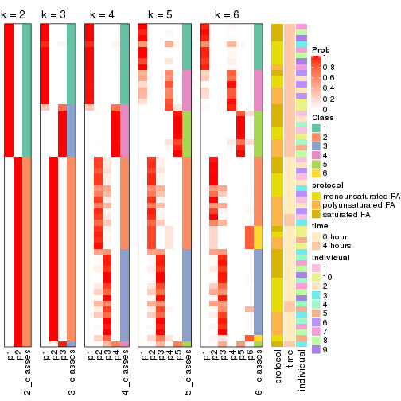


Test correlation between subgroups and known annotations. If the known
annotation is numeric, one-way ANOVA test is applied, and if the known
annotation is discrete, chi-squared contingency table test is applied.

```r
test_to_known_factors(res)
```

```
#>          n protocol(p)  time(p) individual(p) k
#> ATC:pam 56       0.937 2.29e-09      0.950239 2
#> ATC:pam 56       0.690 7.58e-10      0.670247 3
#> ATC:pam 52       0.831 5.51e-09      0.067098 4
#> ATC:pam 51       0.917 3.67e-08      0.006690 5
#> ATC:pam 47       0.994 3.00e-08      0.000147 6
```


If matrix rows can be associated to genes, consider to use `functional_enrichment(res,
...)` to perform function enrichment for the signature genes. See [this vignette](http://bioconductor.org/packages/devel/bioc/vignettes/cola/inst/doc/functional_enrichment.html) for more detailed explanations.


 

---------------------------------------------------


### ATC:mclust**


The object with results only for a single top-value method and a single partition method 
can be extracted as:

```r
res = res_list["ATC", "mclust"]
# you can also extract it by
# res = res_list["ATC:mclust"]
```

A summary of `res` and all the functions that can be applied to it:

```r
res
```

```
#> A 'ConsensusPartition' object with k = 2, 3, 4, 5, 6.
#>   On a matrix with 31632 rows and 56 columns.
#>   Top rows (1000, 2000, 3000, 4000, 5000) are extracted by 'ATC' method.
#>   Subgroups are detected by 'mclust' method.
#>   Performed in total 1250 partitions by row resampling.
#>   Best k for subgroups seems to be 2.
#> 
#> Following methods can be applied to this 'ConsensusPartition' object:
#>  [1] "cola_report"             "collect_classes"         "collect_plots"          
#>  [4] "collect_stats"           "colnames"                "compare_signatures"     
#>  [7] "consensus_heatmap"       "dimension_reduction"     "functional_enrichment"  
#> [10] "get_anno_col"            "get_anno"                "get_classes"            
#> [13] "get_consensus"           "get_matrix"              "get_membership"         
#> [16] "get_param"               "get_signatures"          "get_stats"              
#> [19] "is_best_k"               "is_stable_k"             "membership_heatmap"     
#> [22] "ncol"                    "nrow"                    "plot_ecdf"              
#> [25] "rownames"                "select_partition_number" "show"                   
#> [28] "suggest_best_k"          "test_to_known_factors"
```

`collect_plots()` function collects all the plots made from `res` for all `k` (number of partitions)
into one single page to provide an easy and fast comparison between different `k`.

```r
collect_plots(res)
```

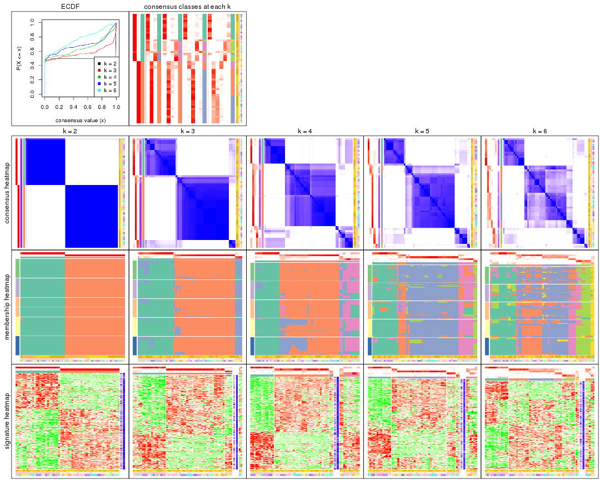

The plots are:

- The first row: a plot of the ECDF (empirical cumulative distribution
  function) curves of the consensus matrix for each `k` and the heatmap of
  predicted classes for each `k`.
- The second row: heatmaps of the consensus matrix for each `k`.
- The third row: heatmaps of the membership matrix for each `k`.
- The fouth row: heatmaps of the signatures for each `k`.

All the plots in panels can be made by individual functions and they are
plotted later in this section.

`select_partition_number()` produces several plots showing different
statistics for choosing "optimized" `k`. There are following statistics:

- ECDF curves of the consensus matrix for each `k`;
- 1-PAC. [The PAC
  score](https://en.wikipedia.org/wiki/Consensus_clustering#Over-interpretation_potential_of_consensus_clustering)
  measures the proportion of the ambiguous subgrouping.
- Mean silhouette score.
- Concordance. The mean probability of fiting the consensus class ids in all
  partitions.
- Area increased. Denote $A_k$ as the area under the ECDF curve for current
  `k`, the area increased is defined as $A_k - A_{k-1}$.
- Rand index. The percent of pairs of samples that are both in a same cluster
  or both are not in a same cluster in the partition of k and k-1.
- Jaccard index. The ratio of pairs of samples are both in a same cluster in
  the partition of k and k-1 and the pairs of samples are both in a same
  cluster in the partition k or k-1.

The detailed explanations of these statistics can be found in [the _cola_
vignette](http://bioconductor.org/packages/devel/bioc/vignettes/cola/inst/doc/cola.html#toc_13).

Generally speaking, lower PAC score, higher mean silhouette score or higher
concordance corresponds to better partition. Rand index and Jaccard index
measure how similar the current partition is compared to partition with `k-1`.
If they are too similar, we won't accept `k` is better than `k-1`.

```r
select_partition_number(res)
```

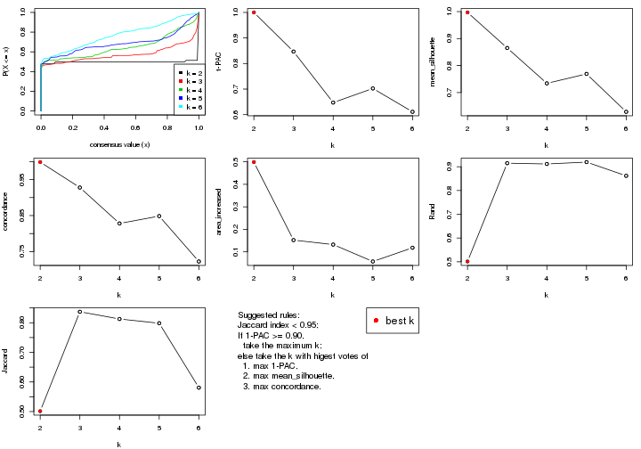

The numeric values for all these statistics can be obtained by `get_stats()`.

```r
get_stats(res)
```

```
#>   k 1-PAC mean_silhouette concordance area_increased  Rand Jaccard
#> 2 2 1.000           0.997       0.998         0.4987 0.501   0.501
#> 3 3 0.847           0.865       0.928         0.1522 0.915   0.837
#> 4 4 0.647           0.734       0.828         0.1323 0.912   0.813
#> 5 5 0.702           0.769       0.849         0.0571 0.919   0.798
#> 6 6 0.611           0.629       0.723         0.1182 0.862   0.581
```

`suggest_best_k()` suggests the best $k$ based on these statistics. The rules are as follows:

- All $k$ with Jaccard index larger than 0.95 are removed because increasing
  $k$ does not provide enough extra information. If all $k$ are removed, it is
  marked as no subgroup is detected.
- For all $k$ with 1-PAC score larger than 0.9, the maximal $k$ is taken as
  the best $k$, and other $k$ are marked as optional $k$.
- If it does not fit the second rule. The $k$ with the maximal vote of the
  highest 1-PAC score, highest mean silhouette, and highest concordance is
  taken as the best $k$.

```r
suggest_best_k(res)
```

```
#> [1] 2
```


Following shows the table of the partitions (You need to click the **show/hide
code output** link to see it). The membership matrix (columns with name `p*`)
is inferred by
[`clue::cl_consensus()`](https://www.rdocumentation.org/link/cl_consensus?package=clue)
function with the `SE` method. Basically the value in the membership matrix
represents the probability to belong to a certain group. The finall class
label for an item is determined with the group with highest probability it
belongs to.

In `get_classes()` function, the entropy is calculated from the membership
matrix and the silhouette score is calculated from the consensus matrix.


<script>
$( function() {
	$( '#tabs-ATC-mclust-get-classes' ).tabs();
} );
</script>
<div id='tabs-ATC-mclust-get-classes'>
<ul>
<li><a href='#tab-ATC-mclust-get-classes-1'>k = 2</a></li>
<li><a href='#tab-ATC-mclust-get-classes-2'>k = 3</a></li>
<li><a href='#tab-ATC-mclust-get-classes-3'>k = 4</a></li>
<li><a href='#tab-ATC-mclust-get-classes-4'>k = 5</a></li>
<li><a href='#tab-ATC-mclust-get-classes-5'>k = 6</a></li>
</ul>

<div id='tab-ATC-mclust-get-classes-1'>
<p><a id='tab-ATC-mclust-get-classes-1-a' style='color:#0366d6' href='#'>show/hide code output</a></p>
<pre><code class="r">cbind(get_classes(res, k = 2), get_membership(res, k = 2))
</code></pre>

<pre><code>#&gt;           class entropy silhouette    p1    p2
#&gt; GSM790742     2   0.000      1.000 0.000 1.000
#&gt; GSM790744     2   0.000      1.000 0.000 1.000
#&gt; GSM790754     2   0.000      1.000 0.000 1.000
#&gt; GSM790756     2   0.000      1.000 0.000 1.000
#&gt; GSM790768     2   0.000      1.000 0.000 1.000
#&gt; GSM790774     2   0.000      1.000 0.000 1.000
#&gt; GSM790778     2   0.000      1.000 0.000 1.000
#&gt; GSM790784     2   0.000      1.000 0.000 1.000
#&gt; GSM790790     2   0.000      1.000 0.000 1.000
#&gt; GSM790743     1   0.000      0.996 1.000 0.000
#&gt; GSM790745     1   0.000      0.996 1.000 0.000
#&gt; GSM790755     1   0.416      0.908 0.916 0.084
#&gt; GSM790757     1   0.000      0.996 1.000 0.000
#&gt; GSM790769     1   0.000      0.996 1.000 0.000
#&gt; GSM790775     1   0.000      0.996 1.000 0.000
#&gt; GSM790779     1   0.000      0.996 1.000 0.000
#&gt; GSM790785     1   0.000      0.996 1.000 0.000
#&gt; GSM790791     1   0.000      0.996 1.000 0.000
#&gt; GSM790738     2   0.000      1.000 0.000 1.000
#&gt; GSM790746     2   0.000      1.000 0.000 1.000
#&gt; GSM790752     2   0.000      1.000 0.000 1.000
#&gt; GSM790758     2   0.000      1.000 0.000 1.000
#&gt; GSM790764     2   0.000      1.000 0.000 1.000
#&gt; GSM790766     2   0.000      1.000 0.000 1.000
#&gt; GSM790772     2   0.000      1.000 0.000 1.000
#&gt; GSM790782     2   0.000      1.000 0.000 1.000
#&gt; GSM790786     2   0.000      1.000 0.000 1.000
#&gt; GSM790792     2   0.000      1.000 0.000 1.000
#&gt; GSM790739     1   0.000      0.996 1.000 0.000
#&gt; GSM790747     1   0.000      0.996 1.000 0.000
#&gt; GSM790753     1   0.000      0.996 1.000 0.000
#&gt; GSM790759     2   0.000      1.000 0.000 1.000
#&gt; GSM790765     2   0.000      1.000 0.000 1.000
#&gt; GSM790767     1   0.000      0.996 1.000 0.000
#&gt; GSM790773     1   0.000      0.996 1.000 0.000
#&gt; GSM790783     1   0.000      0.996 1.000 0.000
#&gt; GSM790787     1   0.000      0.996 1.000 0.000
#&gt; GSM790793     1   0.000      0.996 1.000 0.000
#&gt; GSM790740     2   0.000      1.000 0.000 1.000
#&gt; GSM790748     2   0.000      1.000 0.000 1.000
#&gt; GSM790750     2   0.000      1.000 0.000 1.000
#&gt; GSM790760     2   0.000      1.000 0.000 1.000
#&gt; GSM790762     2   0.000      1.000 0.000 1.000
#&gt; GSM790770     2   0.000      1.000 0.000 1.000
#&gt; GSM790776     2   0.000      1.000 0.000 1.000
#&gt; GSM790780     2   0.000      1.000 0.000 1.000
#&gt; GSM790788     2   0.000      1.000 0.000 1.000
#&gt; GSM790741     2   0.000      1.000 0.000 1.000
#&gt; GSM790749     1   0.000      0.996 1.000 0.000
#&gt; GSM790751     2   0.000      1.000 0.000 1.000
#&gt; GSM790761     1   0.000      0.996 1.000 0.000
#&gt; GSM790763     1   0.000      0.996 1.000 0.000
#&gt; GSM790771     1   0.000      0.996 1.000 0.000
#&gt; GSM790777     1   0.000      0.996 1.000 0.000
#&gt; GSM790781     1   0.000      0.996 1.000 0.000
#&gt; GSM790789     1   0.000      0.996 1.000 0.000
</code></pre>

<script>
$('#tab-ATC-mclust-get-classes-1-a').parent().next().next().hide();
$('#tab-ATC-mclust-get-classes-1-a').click(function(){
  $('#tab-ATC-mclust-get-classes-1-a').parent().next().next().toggle();
  return(false);
});
</script>
</div>

<div id='tab-ATC-mclust-get-classes-2'>
<p><a id='tab-ATC-mclust-get-classes-2-a' style='color:#0366d6' href='#'>show/hide code output</a></p>
<pre><code class="r">cbind(get_classes(res, k = 3), get_membership(res, k = 3))
</code></pre>

<pre><code>#&gt;           class entropy silhouette    p1    p2    p3
#&gt; GSM790742     2  0.0237      0.953 0.000 0.996 0.004
#&gt; GSM790744     2  0.1031      0.946 0.000 0.976 0.024
#&gt; GSM790754     2  0.0237      0.953 0.000 0.996 0.004
#&gt; GSM790756     2  0.0237      0.953 0.000 0.996 0.004
#&gt; GSM790768     2  0.0892      0.948 0.000 0.980 0.020
#&gt; GSM790774     2  0.0000      0.953 0.000 1.000 0.000
#&gt; GSM790778     2  0.0000      0.953 0.000 1.000 0.000
#&gt; GSM790784     2  0.0000      0.953 0.000 1.000 0.000
#&gt; GSM790790     2  0.4002      0.814 0.000 0.840 0.160
#&gt; GSM790743     1  0.3752      0.815 0.856 0.000 0.144
#&gt; GSM790745     1  0.5291      0.686 0.732 0.000 0.268
#&gt; GSM790755     2  0.9653     -0.157 0.224 0.448 0.328
#&gt; GSM790757     1  0.5291      0.686 0.732 0.000 0.268
#&gt; GSM790769     1  0.0000      0.874 1.000 0.000 0.000
#&gt; GSM790775     1  0.0747      0.870 0.984 0.000 0.016
#&gt; GSM790779     1  0.4291      0.744 0.820 0.000 0.180
#&gt; GSM790785     1  0.3038      0.825 0.896 0.000 0.104
#&gt; GSM790791     3  0.3816      0.909 0.148 0.000 0.852
#&gt; GSM790738     2  0.1529      0.939 0.000 0.960 0.040
#&gt; GSM790746     2  0.1411      0.941 0.000 0.964 0.036
#&gt; GSM790752     2  0.0237      0.953 0.000 0.996 0.004
#&gt; GSM790758     2  0.0237      0.953 0.000 0.996 0.004
#&gt; GSM790764     2  0.1529      0.934 0.000 0.960 0.040
#&gt; GSM790766     2  0.0237      0.953 0.000 0.996 0.004
#&gt; GSM790772     2  0.0000      0.953 0.000 1.000 0.000
#&gt; GSM790782     2  0.0000      0.953 0.000 1.000 0.000
#&gt; GSM790786     2  0.0000      0.953 0.000 1.000 0.000
#&gt; GSM790792     2  0.1753      0.925 0.000 0.952 0.048
#&gt; GSM790739     1  0.5291      0.686 0.732 0.000 0.268
#&gt; GSM790747     1  0.0237      0.874 0.996 0.000 0.004
#&gt; GSM790753     1  0.0892      0.870 0.980 0.000 0.020
#&gt; GSM790759     2  0.0237      0.953 0.000 0.996 0.004
#&gt; GSM790765     2  0.0000      0.953 0.000 1.000 0.000
#&gt; GSM790767     1  0.0000      0.874 1.000 0.000 0.000
#&gt; GSM790773     1  0.1411      0.866 0.964 0.000 0.036
#&gt; GSM790783     1  0.0747      0.870 0.984 0.000 0.016
#&gt; GSM790787     1  0.2625      0.843 0.916 0.000 0.084
#&gt; GSM790793     3  0.2356      0.916 0.072 0.000 0.928
#&gt; GSM790740     2  0.1031      0.946 0.000 0.976 0.024
#&gt; GSM790748     2  0.0237      0.953 0.000 0.996 0.004
#&gt; GSM790750     2  0.0237      0.953 0.000 0.996 0.004
#&gt; GSM790760     2  0.0237      0.953 0.000 0.996 0.004
#&gt; GSM790762     2  0.4796      0.739 0.000 0.780 0.220
#&gt; GSM790770     2  0.0424      0.952 0.000 0.992 0.008
#&gt; GSM790776     2  0.0237      0.953 0.000 0.996 0.004
#&gt; GSM790780     2  0.0000      0.953 0.000 1.000 0.000
#&gt; GSM790788     2  0.5254      0.673 0.000 0.736 0.264
#&gt; GSM790741     2  0.0747      0.950 0.000 0.984 0.016
#&gt; GSM790749     1  0.0000      0.874 1.000 0.000 0.000
#&gt; GSM790751     2  0.0237      0.953 0.000 0.996 0.004
#&gt; GSM790761     1  0.3752      0.815 0.856 0.000 0.144
#&gt; GSM790763     3  0.2356      0.916 0.072 0.000 0.928
#&gt; GSM790771     1  0.0000      0.874 1.000 0.000 0.000
#&gt; GSM790777     1  0.0747      0.870 0.984 0.000 0.016
#&gt; GSM790781     1  0.6192      0.400 0.580 0.000 0.420
#&gt; GSM790789     3  0.4399      0.872 0.188 0.000 0.812
</code></pre>

<script>
$('#tab-ATC-mclust-get-classes-2-a').parent().next().next().hide();
$('#tab-ATC-mclust-get-classes-2-a').click(function(){
  $('#tab-ATC-mclust-get-classes-2-a').parent().next().next().toggle();
  return(false);
});
</script>
</div>

<div id='tab-ATC-mclust-get-classes-3'>
<p><a id='tab-ATC-mclust-get-classes-3-a' style='color:#0366d6' href='#'>show/hide code output</a></p>
<pre><code class="r">cbind(get_classes(res, k = 4), get_membership(res, k = 4))
</code></pre>

<pre><code>#&gt;           class entropy silhouette    p1    p2    p3    p4
#&gt; GSM790742     2  0.4253    0.82805 0.016 0.776 0.208 0.000
#&gt; GSM790744     2  0.3123    0.84817 0.000 0.844 0.156 0.000
#&gt; GSM790754     2  0.0188    0.86100 0.000 0.996 0.004 0.000
#&gt; GSM790756     2  0.0188    0.86033 0.000 0.996 0.004 0.000
#&gt; GSM790768     2  0.2868    0.85189 0.000 0.864 0.136 0.000
#&gt; GSM790774     2  0.0817    0.86040 0.000 0.976 0.024 0.000
#&gt; GSM790778     2  0.1022    0.85845 0.000 0.968 0.032 0.000
#&gt; GSM790784     2  0.0921    0.85869 0.000 0.972 0.028 0.000
#&gt; GSM790790     2  0.7086    0.61548 0.000 0.548 0.292 0.160
#&gt; GSM790743     4  0.5587    0.40806 0.372 0.000 0.028 0.600
#&gt; GSM790745     4  0.5018    0.43289 0.332 0.000 0.012 0.656
#&gt; GSM790755     3  0.5406    0.70588 0.008 0.008 0.604 0.380
#&gt; GSM790757     4  0.5130    0.43233 0.332 0.000 0.016 0.652
#&gt; GSM790769     1  0.0336    0.93046 0.992 0.000 0.008 0.000
#&gt; GSM790775     1  0.0188    0.93128 0.996 0.000 0.004 0.000
#&gt; GSM790779     1  0.4767    0.65126 0.724 0.000 0.256 0.020
#&gt; GSM790785     1  0.0188    0.93128 0.996 0.000 0.004 0.000
#&gt; GSM790791     4  0.4840    0.06987 0.116 0.000 0.100 0.784
#&gt; GSM790738     2  0.3873    0.82544 0.000 0.772 0.228 0.000
#&gt; GSM790746     2  0.3837    0.82749 0.000 0.776 0.224 0.000
#&gt; GSM790752     2  0.0000    0.86070 0.000 1.000 0.000 0.000
#&gt; GSM790758     2  0.3172    0.75157 0.000 0.840 0.160 0.000
#&gt; GSM790764     2  0.4956    0.80660 0.000 0.732 0.232 0.036
#&gt; GSM790766     2  0.0000    0.86070 0.000 1.000 0.000 0.000
#&gt; GSM790772     2  0.0592    0.86049 0.000 0.984 0.016 0.000
#&gt; GSM790782     2  0.0592    0.86049 0.000 0.984 0.016 0.000
#&gt; GSM790786     2  0.0707    0.86041 0.000 0.980 0.020 0.000
#&gt; GSM790792     2  0.5383    0.75986 0.000 0.672 0.292 0.036
#&gt; GSM790739     4  0.5130    0.43233 0.332 0.000 0.016 0.652
#&gt; GSM790747     1  0.0336    0.93046 0.992 0.000 0.008 0.000
#&gt; GSM790753     1  0.3266    0.84626 0.868 0.000 0.108 0.024
#&gt; GSM790759     2  0.2081    0.85943 0.000 0.916 0.084 0.000
#&gt; GSM790765     2  0.4222    0.80933 0.000 0.728 0.272 0.000
#&gt; GSM790767     1  0.2469    0.87074 0.892 0.000 0.108 0.000
#&gt; GSM790773     1  0.0188    0.93128 0.996 0.000 0.004 0.000
#&gt; GSM790783     1  0.0188    0.93128 0.996 0.000 0.004 0.000
#&gt; GSM790787     1  0.3160    0.84755 0.872 0.000 0.108 0.020
#&gt; GSM790793     4  0.0000    0.05237 0.000 0.000 0.000 1.000
#&gt; GSM790740     2  0.3528    0.84090 0.000 0.808 0.192 0.000
#&gt; GSM790748     2  0.4095    0.83633 0.016 0.792 0.192 0.000
#&gt; GSM790750     2  0.0000    0.86070 0.000 1.000 0.000 0.000
#&gt; GSM790760     2  0.1406    0.85019 0.016 0.960 0.024 0.000
#&gt; GSM790762     2  0.7784    0.42084 0.000 0.428 0.292 0.280
#&gt; GSM790770     2  0.3688    0.83081 0.000 0.792 0.208 0.000
#&gt; GSM790776     2  0.0000    0.86070 0.000 1.000 0.000 0.000
#&gt; GSM790780     2  0.0707    0.86037 0.000 0.980 0.020 0.000
#&gt; GSM790788     2  0.7796    0.41310 0.000 0.424 0.292 0.284
#&gt; GSM790741     2  0.3444    0.83971 0.000 0.816 0.184 0.000
#&gt; GSM790749     1  0.0336    0.93046 0.992 0.000 0.008 0.000
#&gt; GSM790751     2  0.0000    0.86070 0.000 1.000 0.000 0.000
#&gt; GSM790761     4  0.5587    0.40806 0.372 0.000 0.028 0.600
#&gt; GSM790763     4  0.0000    0.05237 0.000 0.000 0.000 1.000
#&gt; GSM790771     1  0.0336    0.93046 0.992 0.000 0.008 0.000
#&gt; GSM790777     1  0.0188    0.93128 0.996 0.000 0.004 0.000
#&gt; GSM790781     3  0.7037    0.65538 0.120 0.000 0.464 0.416
#&gt; GSM790789     4  0.6817    0.00714 0.408 0.000 0.100 0.492
</code></pre>

<script>
$('#tab-ATC-mclust-get-classes-3-a').parent().next().next().hide();
$('#tab-ATC-mclust-get-classes-3-a').click(function(){
  $('#tab-ATC-mclust-get-classes-3-a').parent().next().next().toggle();
  return(false);
});
</script>
</div>

<div id='tab-ATC-mclust-get-classes-4'>
<p><a id='tab-ATC-mclust-get-classes-4-a' style='color:#0366d6' href='#'>show/hide code output</a></p>
<pre><code class="r">cbind(get_classes(res, k = 5), get_membership(res, k = 5))
</code></pre>

<pre><code>#&gt;           class entropy silhouette    p1    p2    p3    p4    p5
#&gt; GSM790742     3  0.2504      0.878 0.000 0.040 0.896 0.000 0.064
#&gt; GSM790744     3  0.1668      0.893 0.000 0.028 0.940 0.000 0.032
#&gt; GSM790754     3  0.0000      0.901 0.000 0.000 1.000 0.000 0.000
#&gt; GSM790756     3  0.0000      0.901 0.000 0.000 1.000 0.000 0.000
#&gt; GSM790768     3  0.1661      0.894 0.000 0.036 0.940 0.000 0.024
#&gt; GSM790774     3  0.1851      0.874 0.000 0.000 0.912 0.000 0.088
#&gt; GSM790778     3  0.1952      0.873 0.000 0.000 0.912 0.004 0.084
#&gt; GSM790784     3  0.2228      0.874 0.000 0.012 0.908 0.004 0.076
#&gt; GSM790790     2  0.3636      0.578 0.000 0.728 0.272 0.000 0.000
#&gt; GSM790743     4  0.3325      0.636 0.056 0.080 0.000 0.856 0.008
#&gt; GSM790745     4  0.1341      0.676 0.056 0.000 0.000 0.944 0.000
#&gt; GSM790755     5  0.2900      0.779 0.000 0.000 0.028 0.108 0.864
#&gt; GSM790757     4  0.1341      0.676 0.056 0.000 0.000 0.944 0.000
#&gt; GSM790769     1  0.2674      0.893 0.868 0.012 0.000 0.120 0.000
#&gt; GSM790775     1  0.1341      0.897 0.944 0.000 0.000 0.056 0.000
#&gt; GSM790779     1  0.4713      0.762 0.772 0.048 0.000 0.048 0.132
#&gt; GSM790785     1  0.0000      0.884 1.000 0.000 0.000 0.000 0.000
#&gt; GSM790791     4  0.6100      0.385 0.056 0.404 0.000 0.508 0.032
#&gt; GSM790738     3  0.3336      0.827 0.000 0.096 0.844 0.000 0.060
#&gt; GSM790746     3  0.3336      0.827 0.000 0.096 0.844 0.000 0.060
#&gt; GSM790752     3  0.0000      0.901 0.000 0.000 1.000 0.000 0.000
#&gt; GSM790758     3  0.3196      0.720 0.000 0.004 0.804 0.000 0.192
#&gt; GSM790764     3  0.4709      0.243 0.000 0.364 0.612 0.000 0.024
#&gt; GSM790766     3  0.0703      0.901 0.000 0.000 0.976 0.000 0.024
#&gt; GSM790772     3  0.1942      0.879 0.000 0.012 0.920 0.000 0.068
#&gt; GSM790782     3  0.2006      0.877 0.000 0.012 0.916 0.000 0.072
#&gt; GSM790786     3  0.2228      0.873 0.000 0.012 0.908 0.004 0.076
#&gt; GSM790792     2  0.4262      0.286 0.000 0.560 0.440 0.000 0.000
#&gt; GSM790739     4  0.1341      0.676 0.056 0.000 0.000 0.944 0.000
#&gt; GSM790747     1  0.2574      0.895 0.876 0.012 0.000 0.112 0.000
#&gt; GSM790753     1  0.4293      0.844 0.772 0.064 0.000 0.160 0.004
#&gt; GSM790759     3  0.1281      0.901 0.000 0.012 0.956 0.000 0.032
#&gt; GSM790765     3  0.2597      0.854 0.000 0.092 0.884 0.000 0.024
#&gt; GSM790767     1  0.4054      0.876 0.800 0.080 0.000 0.116 0.004
#&gt; GSM790773     1  0.0000      0.884 1.000 0.000 0.000 0.000 0.000
#&gt; GSM790783     1  0.0000      0.884 1.000 0.000 0.000 0.000 0.000
#&gt; GSM790787     1  0.3651      0.863 0.828 0.060 0.000 0.108 0.004
#&gt; GSM790793     4  0.4761      0.467 0.000 0.356 0.000 0.616 0.028
#&gt; GSM790740     3  0.3234      0.836 0.000 0.084 0.852 0.000 0.064
#&gt; GSM790748     3  0.1478      0.891 0.000 0.000 0.936 0.000 0.064
#&gt; GSM790750     3  0.0000      0.901 0.000 0.000 1.000 0.000 0.000
#&gt; GSM790760     3  0.1430      0.889 0.000 0.004 0.944 0.000 0.052
#&gt; GSM790762     2  0.3143      0.577 0.000 0.796 0.204 0.000 0.000
#&gt; GSM790770     3  0.2124      0.884 0.000 0.056 0.916 0.000 0.028
#&gt; GSM790776     3  0.0798      0.902 0.000 0.008 0.976 0.000 0.016
#&gt; GSM790780     3  0.0963      0.898 0.000 0.000 0.964 0.000 0.036
#&gt; GSM790788     2  0.3143      0.577 0.000 0.796 0.204 0.000 0.000
#&gt; GSM790741     3  0.2067      0.887 0.000 0.048 0.920 0.000 0.032
#&gt; GSM790749     1  0.3085      0.889 0.852 0.032 0.000 0.116 0.000
#&gt; GSM790751     3  0.0404      0.901 0.000 0.000 0.988 0.000 0.012
#&gt; GSM790761     4  0.3325      0.636 0.056 0.080 0.000 0.856 0.008
#&gt; GSM790763     4  0.4761      0.467 0.000 0.356 0.000 0.616 0.028
#&gt; GSM790771     1  0.3366      0.876 0.828 0.032 0.000 0.140 0.000
#&gt; GSM790777     1  0.0000      0.884 1.000 0.000 0.000 0.000 0.000
#&gt; GSM790781     5  0.4576      0.748 0.040 0.000 0.000 0.268 0.692
#&gt; GSM790789     2  0.7056     -0.309 0.404 0.404 0.000 0.160 0.032
</code></pre>

<script>
$('#tab-ATC-mclust-get-classes-4-a').parent().next().next().hide();
$('#tab-ATC-mclust-get-classes-4-a').click(function(){
  $('#tab-ATC-mclust-get-classes-4-a').parent().next().next().toggle();
  return(false);
});
</script>
</div>

<div id='tab-ATC-mclust-get-classes-5'>
<p><a id='tab-ATC-mclust-get-classes-5-a' style='color:#0366d6' href='#'>show/hide code output</a></p>
<pre><code class="r">cbind(get_classes(res, k = 6), get_membership(res, k = 6))
</code></pre>

<pre><code>#&gt;           class entropy silhouette    p1    p2    p3    p4    p5    p6
#&gt; GSM790742     2   0.220     0.6300 0.000 0.896 0.084 0.016 0.000 0.004
#&gt; GSM790744     2   0.136     0.6597 0.000 0.952 0.016 0.012 0.000 0.020
#&gt; GSM790754     3   0.400     0.7252 0.000 0.496 0.500 0.004 0.000 0.000
#&gt; GSM790756     3   0.400     0.7259 0.000 0.492 0.504 0.004 0.000 0.000
#&gt; GSM790768     2   0.187     0.6548 0.000 0.928 0.024 0.032 0.000 0.016
#&gt; GSM790774     3   0.438     0.7509 0.000 0.400 0.576 0.004 0.000 0.020
#&gt; GSM790778     3   0.427     0.7517 0.000 0.388 0.592 0.004 0.000 0.016
#&gt; GSM790784     3   0.503     0.7430 0.000 0.332 0.596 0.056 0.000 0.016
#&gt; GSM790790     4   0.435     0.8761 0.000 0.256 0.044 0.692 0.008 0.000
#&gt; GSM790743     5   0.513     0.6548 0.004 0.000 0.024 0.040 0.588 0.344
#&gt; GSM790745     5   0.360     0.6987 0.004 0.000 0.000 0.000 0.684 0.312
#&gt; GSM790755     6   0.691     0.7617 0.000 0.004 0.324 0.204 0.056 0.412
#&gt; GSM790757     5   0.360     0.6987 0.004 0.000 0.000 0.000 0.684 0.312
#&gt; GSM790769     1   0.364     0.7894 0.732 0.000 0.000 0.000 0.020 0.248
#&gt; GSM790775     1   0.257     0.7960 0.852 0.000 0.000 0.000 0.012 0.136
#&gt; GSM790779     1   0.414     0.7279 0.808 0.000 0.056 0.052 0.020 0.064
#&gt; GSM790785     1   0.000     0.7595 1.000 0.000 0.000 0.000 0.000 0.000
#&gt; GSM790791     5   0.452     0.4181 0.064 0.000 0.000 0.100 0.760 0.076
#&gt; GSM790738     2   0.311     0.5744 0.000 0.836 0.016 0.128 0.000 0.020
#&gt; GSM790746     2   0.311     0.5744 0.000 0.836 0.016 0.128 0.000 0.020
#&gt; GSM790752     3   0.400     0.7208 0.000 0.496 0.500 0.004 0.000 0.000
#&gt; GSM790758     3   0.534     0.5095 0.000 0.276 0.616 0.080 0.000 0.028
#&gt; GSM790764     2   0.499     0.0495 0.000 0.572 0.084 0.344 0.000 0.000
#&gt; GSM790766     2   0.205     0.5081 0.000 0.880 0.120 0.000 0.000 0.000
#&gt; GSM790772     3   0.519     0.7488 0.000 0.396 0.532 0.056 0.000 0.016
#&gt; GSM790782     3   0.524     0.7441 0.000 0.396 0.528 0.060 0.000 0.016
#&gt; GSM790786     3   0.505     0.7403 0.000 0.336 0.592 0.056 0.000 0.016
#&gt; GSM790792     4   0.438     0.7769 0.000 0.312 0.044 0.644 0.000 0.000
#&gt; GSM790739     5   0.360     0.6987 0.004 0.000 0.000 0.000 0.684 0.312
#&gt; GSM790747     1   0.357     0.7915 0.744 0.000 0.000 0.000 0.020 0.236
#&gt; GSM790753     1   0.442     0.7284 0.604 0.000 0.000 0.000 0.036 0.360
#&gt; GSM790759     2   0.201     0.6179 0.000 0.904 0.080 0.016 0.000 0.000
#&gt; GSM790765     3   0.581     0.6144 0.000 0.380 0.436 0.184 0.000 0.000
#&gt; GSM790767     1   0.427     0.7354 0.596 0.000 0.000 0.000 0.024 0.380
#&gt; GSM790773     1   0.000     0.7595 1.000 0.000 0.000 0.000 0.000 0.000
#&gt; GSM790783     1   0.000     0.7595 1.000 0.000 0.000 0.000 0.000 0.000
#&gt; GSM790787     1   0.353     0.7800 0.772 0.000 0.004 0.000 0.024 0.200
#&gt; GSM790793     5   0.181     0.5155 0.000 0.000 0.000 0.100 0.900 0.000
#&gt; GSM790740     2   0.298     0.5827 0.000 0.844 0.012 0.124 0.000 0.020
#&gt; GSM790748     2   0.291     0.5743 0.000 0.832 0.144 0.024 0.000 0.000
#&gt; GSM790750     2   0.400    -0.7587 0.000 0.500 0.496 0.004 0.000 0.000
#&gt; GSM790760     3   0.454     0.6300 0.000 0.408 0.560 0.028 0.000 0.004
#&gt; GSM790762     4   0.445     0.8696 0.000 0.196 0.044 0.728 0.032 0.000
#&gt; GSM790770     2   0.270     0.6302 0.000 0.872 0.048 0.076 0.000 0.004
#&gt; GSM790776     3   0.496     0.7009 0.000 0.412 0.520 0.068 0.000 0.000
#&gt; GSM790780     3   0.500     0.7355 0.000 0.444 0.504 0.024 0.000 0.028
#&gt; GSM790788     4   0.448     0.8755 0.000 0.200 0.044 0.724 0.032 0.000
#&gt; GSM790741     2   0.210     0.6546 0.000 0.916 0.024 0.040 0.000 0.020
#&gt; GSM790749     1   0.397     0.7605 0.668 0.000 0.000 0.000 0.020 0.312
#&gt; GSM790751     2   0.398    -0.5800 0.000 0.600 0.392 0.008 0.000 0.000
#&gt; GSM790761     5   0.513     0.6548 0.004 0.000 0.024 0.040 0.588 0.344
#&gt; GSM790763     5   0.181     0.5155 0.000 0.000 0.000 0.100 0.900 0.000
#&gt; GSM790771     1   0.418     0.7434 0.628 0.000 0.000 0.000 0.024 0.348
#&gt; GSM790777     1   0.000     0.7595 1.000 0.000 0.000 0.000 0.000 0.000
#&gt; GSM790781     6   0.789     0.7281 0.056 0.000 0.172 0.124 0.212 0.436
#&gt; GSM790789     1   0.643     0.3543 0.456 0.000 0.000 0.100 0.368 0.076
</code></pre>

<script>
$('#tab-ATC-mclust-get-classes-5-a').parent().next().next().hide();
$('#tab-ATC-mclust-get-classes-5-a').click(function(){
  $('#tab-ATC-mclust-get-classes-5-a').parent().next().next().toggle();
  return(false);
});
</script>
</div>
</div>

Heatmaps for the consensus matrix. It visualizes the probability of two
samples to be in a same group.


<script>
$( function() {
	$( '#tabs-ATC-mclust-consensus-heatmap' ).tabs();
} );
</script>
<div id='tabs-ATC-mclust-consensus-heatmap'>
<ul>
<li><a href='#tab-ATC-mclust-consensus-heatmap-1'>k = 2</a></li>
<li><a href='#tab-ATC-mclust-consensus-heatmap-2'>k = 3</a></li>
<li><a href='#tab-ATC-mclust-consensus-heatmap-3'>k = 4</a></li>
<li><a href='#tab-ATC-mclust-consensus-heatmap-4'>k = 5</a></li>
<li><a href='#tab-ATC-mclust-consensus-heatmap-5'>k = 6</a></li>
</ul>
<div id='tab-ATC-mclust-consensus-heatmap-1'>
<pre><code class="r">consensus_heatmap(res, k = 2)
</code></pre>

<p>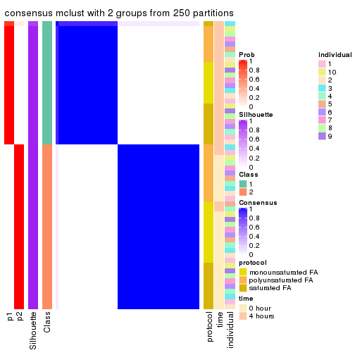</p>

</div>
<div id='tab-ATC-mclust-consensus-heatmap-2'>
<pre><code class="r">consensus_heatmap(res, k = 3)
</code></pre>

<p>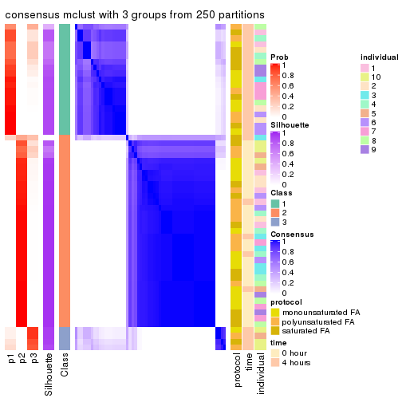</p>

</div>
<div id='tab-ATC-mclust-consensus-heatmap-3'>
<pre><code class="r">consensus_heatmap(res, k = 4)
</code></pre>

<p>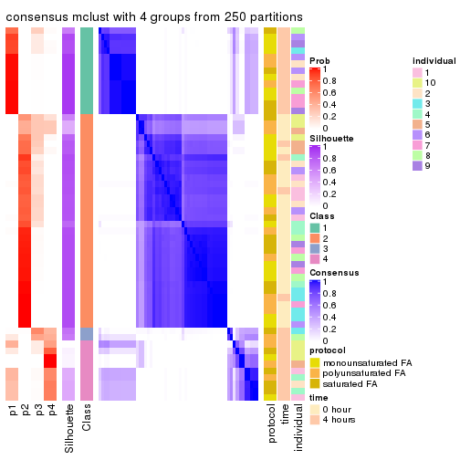</p>

</div>
<div id='tab-ATC-mclust-consensus-heatmap-4'>
<pre><code class="r">consensus_heatmap(res, k = 5)
</code></pre>

<p>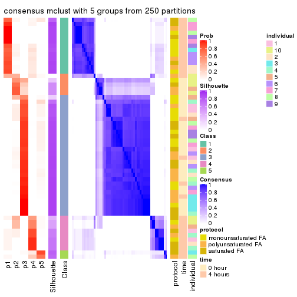</p>

</div>
<div id='tab-ATC-mclust-consensus-heatmap-5'>
<pre><code class="r">consensus_heatmap(res, k = 6)
</code></pre>

<p>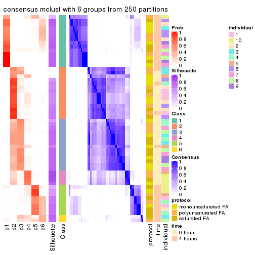</p>

</div>
</div>

Heatmaps for the membership of samples in all partitions to see how consistent they are:


<script>
$( function() {
	$( '#tabs-ATC-mclust-membership-heatmap' ).tabs();
} );
</script>
<div id='tabs-ATC-mclust-membership-heatmap'>
<ul>
<li><a href='#tab-ATC-mclust-membership-heatmap-1'>k = 2</a></li>
<li><a href='#tab-ATC-mclust-membership-heatmap-2'>k = 3</a></li>
<li><a href='#tab-ATC-mclust-membership-heatmap-3'>k = 4</a></li>
<li><a href='#tab-ATC-mclust-membership-heatmap-4'>k = 5</a></li>
<li><a href='#tab-ATC-mclust-membership-heatmap-5'>k = 6</a></li>
</ul>
<div id='tab-ATC-mclust-membership-heatmap-1'>
<pre><code class="r">membership_heatmap(res, k = 2)
</code></pre>

<p>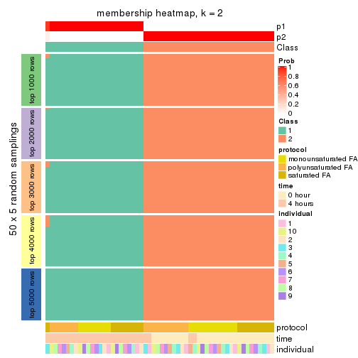</p>

</div>
<div id='tab-ATC-mclust-membership-heatmap-2'>
<pre><code class="r">membership_heatmap(res, k = 3)
</code></pre>

<p>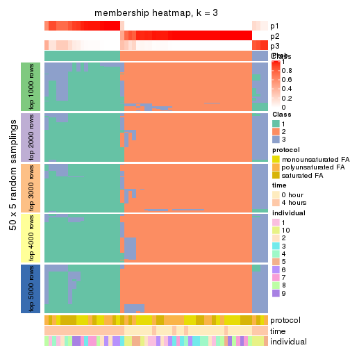</p>

</div>
<div id='tab-ATC-mclust-membership-heatmap-3'>
<pre><code class="r">membership_heatmap(res, k = 4)
</code></pre>

<p>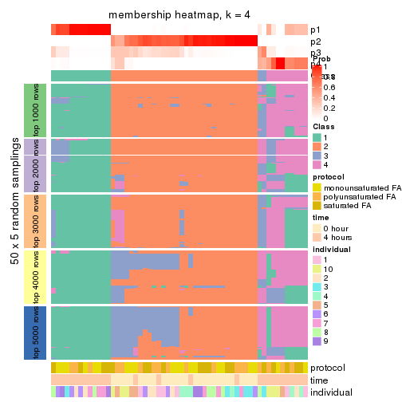</p>

</div>
<div id='tab-ATC-mclust-membership-heatmap-4'>
<pre><code class="r">membership_heatmap(res, k = 5)
</code></pre>

<p>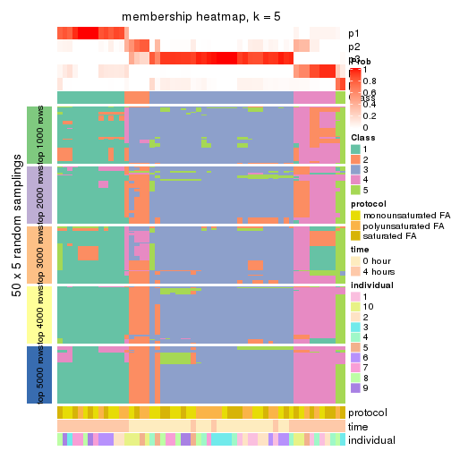</p>

</div>
<div id='tab-ATC-mclust-membership-heatmap-5'>
<pre><code class="r">membership_heatmap(res, k = 6)
</code></pre>

<p>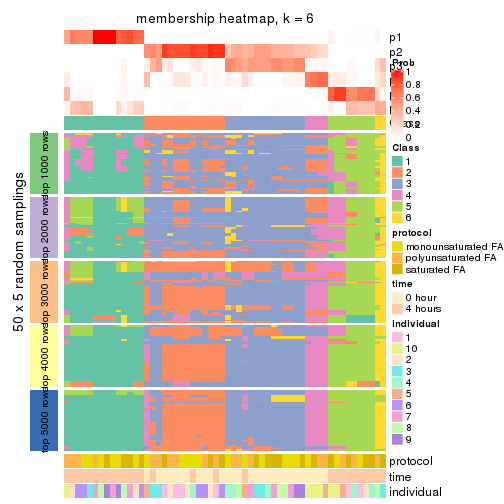</p>

</div>
</div>

As soon as we have had the classes for columns, we can look for signatures
which are significantly different between classes which can be candidate marks
for certain classes. Following are the heatmaps for signatures.


Signature heatmaps where rows are scaled:


<script>
$( function() {
	$( '#tabs-ATC-mclust-get-signatures' ).tabs();
} );
</script>
<div id='tabs-ATC-mclust-get-signatures'>
<ul>
<li><a href='#tab-ATC-mclust-get-signatures-1'>k = 2</a></li>
<li><a href='#tab-ATC-mclust-get-signatures-2'>k = 3</a></li>
<li><a href='#tab-ATC-mclust-get-signatures-3'>k = 4</a></li>
<li><a href='#tab-ATC-mclust-get-signatures-4'>k = 5</a></li>
<li><a href='#tab-ATC-mclust-get-signatures-5'>k = 6</a></li>
</ul>
<div id='tab-ATC-mclust-get-signatures-1'>
<pre><code class="r">get_signatures(res, k = 2)
</code></pre>

<p>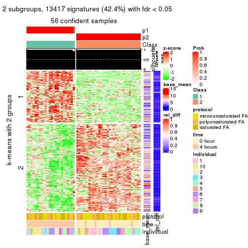</p>

</div>
<div id='tab-ATC-mclust-get-signatures-2'>
<pre><code class="r">get_signatures(res, k = 3)
</code></pre>

<p>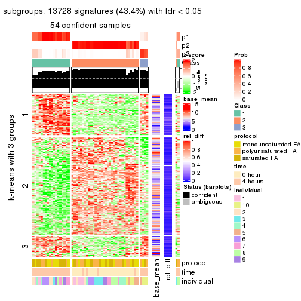</p>

</div>
<div id='tab-ATC-mclust-get-signatures-3'>
<pre><code class="r">get_signatures(res, k = 4)
</code></pre>

<p>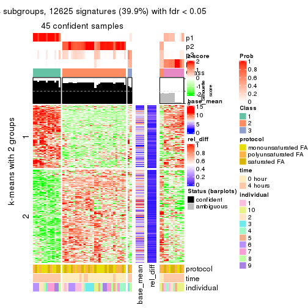</p>

</div>
<div id='tab-ATC-mclust-get-signatures-4'>
<pre><code class="r">get_signatures(res, k = 5)
</code></pre>

<p>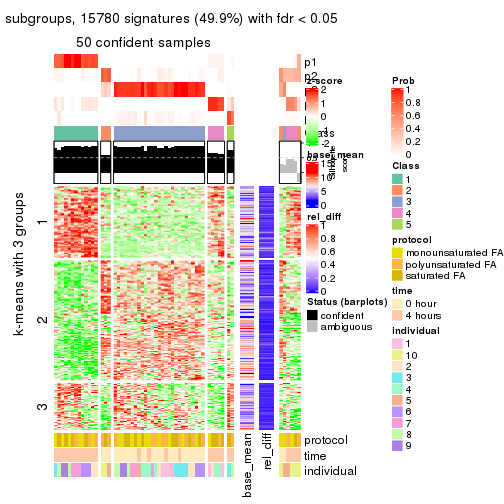</p>

</div>
<div id='tab-ATC-mclust-get-signatures-5'>
<pre><code class="r">get_signatures(res, k = 6)
</code></pre>

<p>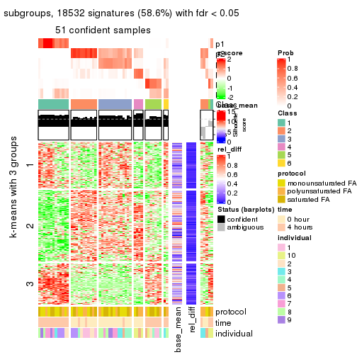</p>

</div>
</div>


Signature heatmaps where rows are not scaled:


<script>
$( function() {
	$( '#tabs-ATC-mclust-get-signatures-no-scale' ).tabs();
} );
</script>
<div id='tabs-ATC-mclust-get-signatures-no-scale'>
<ul>
<li><a href='#tab-ATC-mclust-get-signatures-no-scale-1'>k = 2</a></li>
<li><a href='#tab-ATC-mclust-get-signatures-no-scale-2'>k = 3</a></li>
<li><a href='#tab-ATC-mclust-get-signatures-no-scale-3'>k = 4</a></li>
<li><a href='#tab-ATC-mclust-get-signatures-no-scale-4'>k = 5</a></li>
<li><a href='#tab-ATC-mclust-get-signatures-no-scale-5'>k = 6</a></li>
</ul>
<div id='tab-ATC-mclust-get-signatures-no-scale-1'>
<pre><code class="r">get_signatures(res, k = 2, scale_rows = FALSE)
</code></pre>

<p>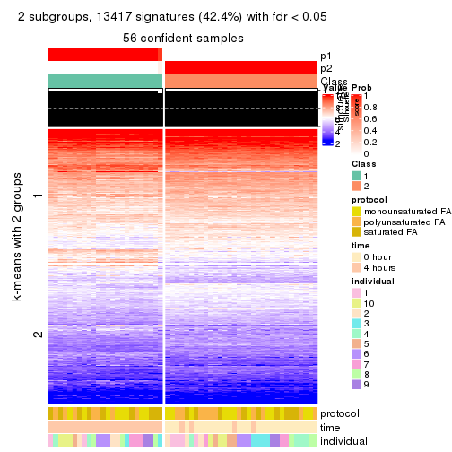</p>

</div>
<div id='tab-ATC-mclust-get-signatures-no-scale-2'>
<pre><code class="r">get_signatures(res, k = 3, scale_rows = FALSE)
</code></pre>

<p>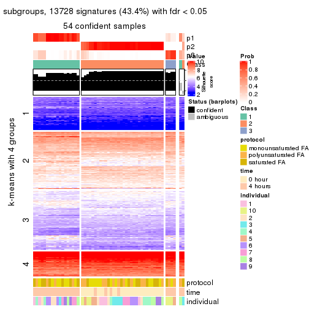</p>

</div>
<div id='tab-ATC-mclust-get-signatures-no-scale-3'>
<pre><code class="r">get_signatures(res, k = 4, scale_rows = FALSE)
</code></pre>

<p>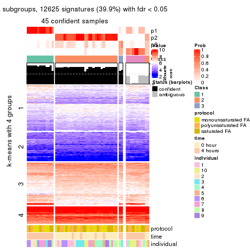</p>

</div>
<div id='tab-ATC-mclust-get-signatures-no-scale-4'>
<pre><code class="r">get_signatures(res, k = 5, scale_rows = FALSE)
</code></pre>

<p>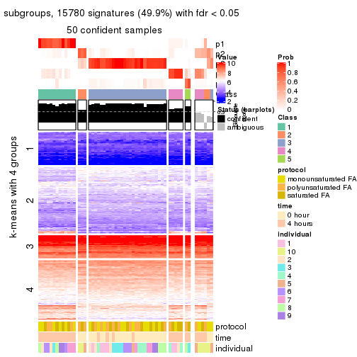</p>

</div>
<div id='tab-ATC-mclust-get-signatures-no-scale-5'>
<pre><code class="r">get_signatures(res, k = 6, scale_rows = FALSE)
</code></pre>

<p>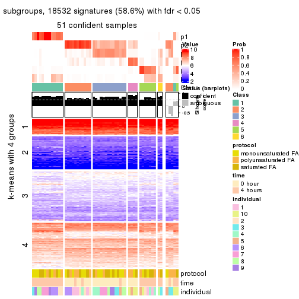</p>

</div>
</div>


Compare the overlap of signatures from different k:

```r
compare_signatures(res)
```

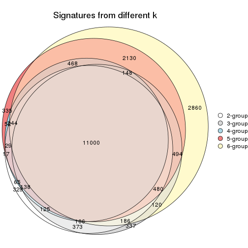

`get_signature()` returns a data frame invisibly. TO get the list of signatures, the function
call should be assigned to a variable explicitly. In following code, if `plot` argument is set
to `FALSE`, no heatmap is plotted while only the differential analysis is performed.

```r
# code only for demonstration
tb = get_signature(res, k = ..., plot = FALSE)
```

An example of the output of `tb` is:

```
#>   which_row         fdr    mean_1    mean_2 scaled_mean_1 scaled_mean_2 km
#> 1        38 0.042760348  8.373488  9.131774    -0.5533452     0.5164555  1
#> 2        40 0.018707592  7.106213  8.469186    -0.6173731     0.5762149  1
#> 3        55 0.019134737 10.221463 11.207825    -0.6159697     0.5749050  1
#> 4        59 0.006059896  5.921854  7.869574    -0.6899429     0.6439467  1
#> 5        60 0.018055526  8.928898 10.211722    -0.6204761     0.5791110  1
#> 6        98 0.009384629 15.714769 14.887706     0.6635654    -0.6193277  2
...
```

The columns in `tb` are:

1. `which_row`: row indices corresponding to the input matrix.
2. `fdr`: FDR for the differential test. 
3. `mean_x`: The mean value in group x.
4. `scaled_mean_x`: The mean value in group x after rows are scaled.
5. `km`: Row groups if k-means clustering is applied to rows.


UMAP plot which shows how samples are separated.


<script>
$( function() {
	$( '#tabs-ATC-mclust-dimension-reduction' ).tabs();
} );
</script>
<div id='tabs-ATC-mclust-dimension-reduction'>
<ul>
<li><a href='#tab-ATC-mclust-dimension-reduction-1'>k = 2</a></li>
<li><a href='#tab-ATC-mclust-dimension-reduction-2'>k = 3</a></li>
<li><a href='#tab-ATC-mclust-dimension-reduction-3'>k = 4</a></li>
<li><a href='#tab-ATC-mclust-dimension-reduction-4'>k = 5</a></li>
<li><a href='#tab-ATC-mclust-dimension-reduction-5'>k = 6</a></li>
</ul>
<div id='tab-ATC-mclust-dimension-reduction-1'>
<pre><code class="r">dimension_reduction(res, k = 2, method = &quot;UMAP&quot;)
</code></pre>

<p>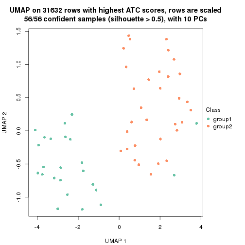</p>

</div>
<div id='tab-ATC-mclust-dimension-reduction-2'>
<pre><code class="r">dimension_reduction(res, k = 3, method = &quot;UMAP&quot;)
</code></pre>

<p>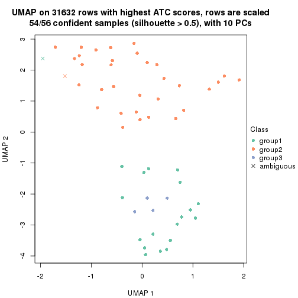</p>

</div>
<div id='tab-ATC-mclust-dimension-reduction-3'>
<pre><code class="r">dimension_reduction(res, k = 4, method = &quot;UMAP&quot;)
</code></pre>

<p>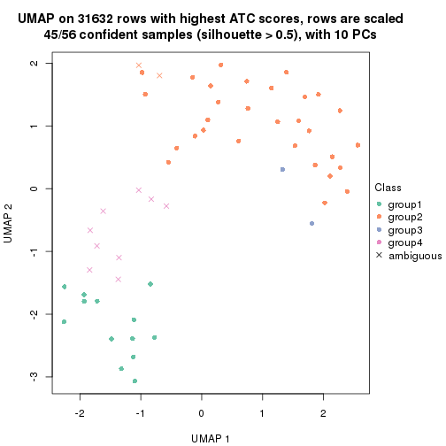</p>

</div>
<div id='tab-ATC-mclust-dimension-reduction-4'>
<pre><code class="r">dimension_reduction(res, k = 5, method = &quot;UMAP&quot;)
</code></pre>

<p>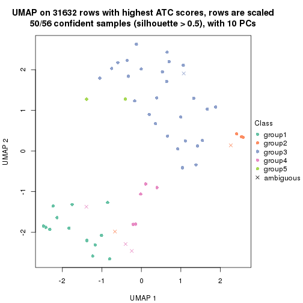</p>

</div>
<div id='tab-ATC-mclust-dimension-reduction-5'>
<pre><code class="r">dimension_reduction(res, k = 6, method = &quot;UMAP&quot;)
</code></pre>

<p>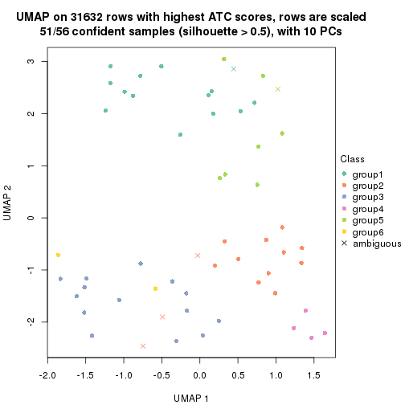</p>

</div>
</div>


Following heatmap shows how subgroups are split when increasing `k`:

```r
collect_classes(res)
```

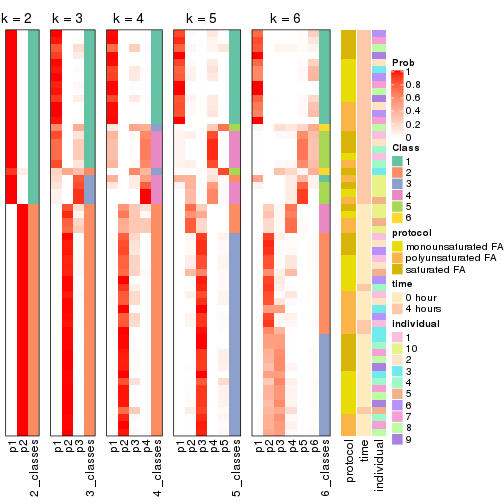


Test correlation between subgroups and known annotations. If the known
annotation is numeric, one-way ANOVA test is applied, and if the known
annotation is discrete, chi-squared contingency table test is applied.

```r
test_to_known_factors(res)
```

```
#>             n protocol(p)  time(p) individual(p) k
#> ATC:mclust 56       0.757 5.27e-10      0.993010 2
#> ATC:mclust 54       0.797 2.08e-09      0.095892 3
#> ATC:mclust 45       0.802 2.06e-07      0.665397 4
#> ATC:mclust 50       0.663 2.45e-07      0.002234 5
#> ATC:mclust 51       0.964 1.06e-07      0.000691 6
```


If matrix rows can be associated to genes, consider to use `functional_enrichment(res,
...)` to perform function enrichment for the signature genes. See [this vignette](http://bioconductor.org/packages/devel/bioc/vignettes/cola/inst/doc/functional_enrichment.html) for more detailed explanations.


 

---------------------------------------------------


### ATC:NMF**


The object with results only for a single top-value method and a single partition method 
can be extracted as:

```r
res = res_list["ATC", "NMF"]
# you can also extract it by
# res = res_list["ATC:NMF"]
```

A summary of `res` and all the functions that can be applied to it:

```r
res
```

```
#> A 'ConsensusPartition' object with k = 2, 3, 4, 5, 6.
#>   On a matrix with 31632 rows and 56 columns.
#>   Top rows (1000, 2000, 3000, 4000, 5000) are extracted by 'ATC' method.
#>   Subgroups are detected by 'NMF' method.
#>   Performed in total 1250 partitions by row resampling.
#>   Best k for subgroups seems to be 2.
#> 
#> Following methods can be applied to this 'ConsensusPartition' object:
#>  [1] "cola_report"             "collect_classes"         "collect_plots"          
#>  [4] "collect_stats"           "colnames"                "compare_signatures"     
#>  [7] "consensus_heatmap"       "dimension_reduction"     "functional_enrichment"  
#> [10] "get_anno_col"            "get_anno"                "get_classes"            
#> [13] "get_consensus"           "get_matrix"              "get_membership"         
#> [16] "get_param"               "get_signatures"          "get_stats"              
#> [19] "is_best_k"               "is_stable_k"             "membership_heatmap"     
#> [22] "ncol"                    "nrow"                    "plot_ecdf"              
#> [25] "rownames"                "select_partition_number" "show"                   
#> [28] "suggest_best_k"          "test_to_known_factors"
```

`collect_plots()` function collects all the plots made from `res` for all `k` (number of partitions)
into one single page to provide an easy and fast comparison between different `k`.

```r
collect_plots(res)
```

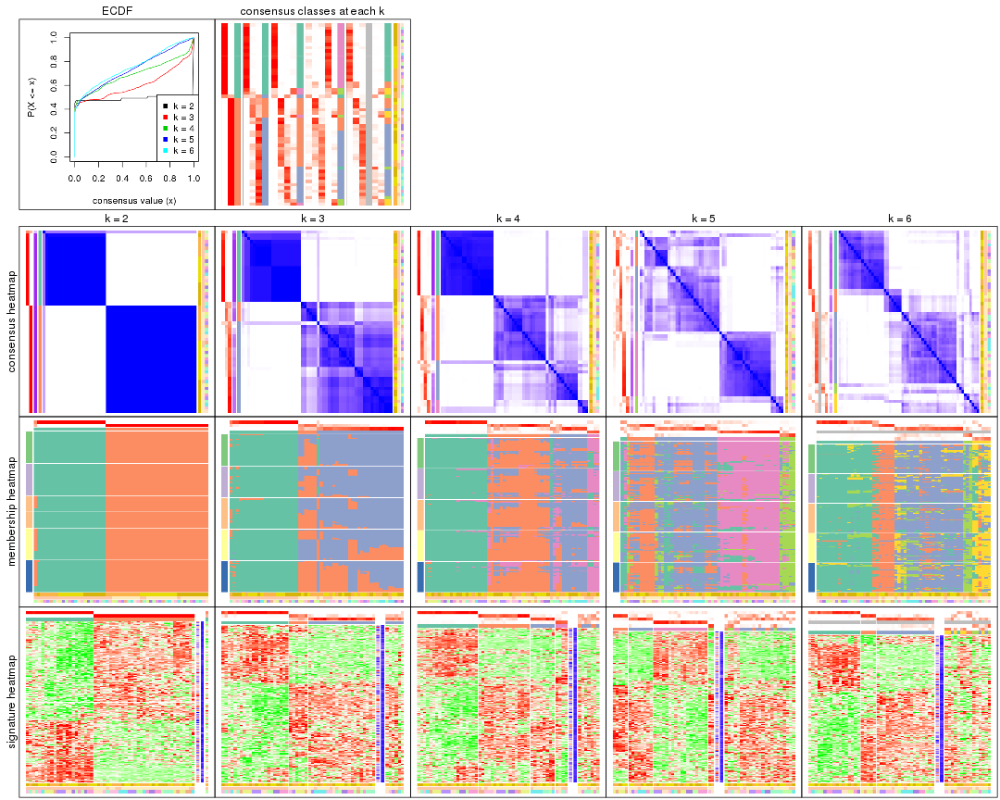

The plots are:

- The first row: a plot of the ECDF (empirical cumulative distribution
  function) curves of the consensus matrix for each `k` and the heatmap of
  predicted classes for each `k`.
- The second row: heatmaps of the consensus matrix for each `k`.
- The third row: heatmaps of the membership matrix for each `k`.
- The fouth row: heatmaps of the signatures for each `k`.

All the plots in panels can be made by individual functions and they are
plotted later in this section.

`select_partition_number()` produces several plots showing different
statistics for choosing "optimized" `k`. There are following statistics:

- ECDF curves of the consensus matrix for each `k`;
- 1-PAC. [The PAC
  score](https://en.wikipedia.org/wiki/Consensus_clustering#Over-interpretation_potential_of_consensus_clustering)
  measures the proportion of the ambiguous subgrouping.
- Mean silhouette score.
- Concordance. The mean probability of fiting the consensus class ids in all
  partitions.
- Area increased. Denote $A_k$ as the area under the ECDF curve for current
  `k`, the area increased is defined as $A_k - A_{k-1}$.
- Rand index. The percent of pairs of samples that are both in a same cluster
  or both are not in a same cluster in the partition of k and k-1.
- Jaccard index. The ratio of pairs of samples are both in a same cluster in
  the partition of k and k-1 and the pairs of samples are both in a same
  cluster in the partition k or k-1.

The detailed explanations of these statistics can be found in [the _cola_
vignette](http://bioconductor.org/packages/devel/bioc/vignettes/cola/inst/doc/cola.html#toc_13).

Generally speaking, lower PAC score, higher mean silhouette score or higher
concordance corresponds to better partition. Rand index and Jaccard index
measure how similar the current partition is compared to partition with `k-1`.
If they are too similar, we won't accept `k` is better than `k-1`.

```r
select_partition_number(res)
```

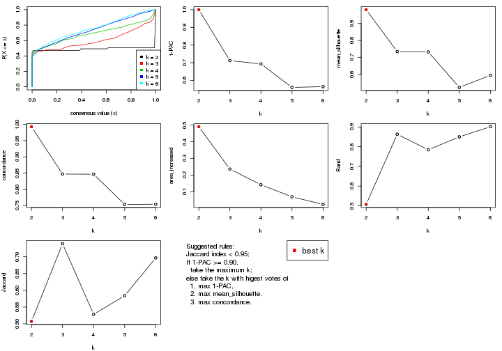

The numeric values for all these statistics can be obtained by `get_stats()`.

```r
get_stats(res)
```

```
#>   k 1-PAC mean_silhouette concordance area_increased  Rand Jaccard
#> 2 2 1.000           0.981       0.993         0.4905 0.507   0.507
#> 3 3 0.712           0.735       0.847         0.2359 0.863   0.739
#> 4 4 0.693           0.732       0.847         0.1418 0.784   0.528
#> 5 5 0.560           0.523       0.754         0.0692 0.850   0.584
#> 6 6 0.565           0.595       0.754         0.0235 0.901   0.697
```

`suggest_best_k()` suggests the best $k$ based on these statistics. The rules are as follows:

- All $k$ with Jaccard index larger than 0.95 are removed because increasing
  $k$ does not provide enough extra information. If all $k$ are removed, it is
  marked as no subgroup is detected.
- For all $k$ with 1-PAC score larger than 0.9, the maximal $k$ is taken as
  the best $k$, and other $k$ are marked as optional $k$.
- If it does not fit the second rule. The $k$ with the maximal vote of the
  highest 1-PAC score, highest mean silhouette, and highest concordance is
  taken as the best $k$.

```r
suggest_best_k(res)
```

```
#> [1] 2
```


Following shows the table of the partitions (You need to click the **show/hide
code output** link to see it). The membership matrix (columns with name `p*`)
is inferred by
[`clue::cl_consensus()`](https://www.rdocumentation.org/link/cl_consensus?package=clue)
function with the `SE` method. Basically the value in the membership matrix
represents the probability to belong to a certain group. The finall class
label for an item is determined with the group with highest probability it
belongs to.

In `get_classes()` function, the entropy is calculated from the membership
matrix and the silhouette score is calculated from the consensus matrix.


<script>
$( function() {
	$( '#tabs-ATC-NMF-get-classes' ).tabs();
} );
</script>
<div id='tabs-ATC-NMF-get-classes'>
<ul>
<li><a href='#tab-ATC-NMF-get-classes-1'>k = 2</a></li>
<li><a href='#tab-ATC-NMF-get-classes-2'>k = 3</a></li>
<li><a href='#tab-ATC-NMF-get-classes-3'>k = 4</a></li>
<li><a href='#tab-ATC-NMF-get-classes-4'>k = 5</a></li>
<li><a href='#tab-ATC-NMF-get-classes-5'>k = 6</a></li>
</ul>

<div id='tab-ATC-NMF-get-classes-1'>
<p><a id='tab-ATC-NMF-get-classes-1-a' style='color:#0366d6' href='#'>show/hide code output</a></p>
<pre><code class="r">cbind(get_classes(res, k = 2), get_membership(res, k = 2))
</code></pre>

<pre><code>#&gt;           class entropy silhouette    p1    p2
#&gt; GSM790742     2  0.0000      1.000 0.000 1.000
#&gt; GSM790744     2  0.0000      1.000 0.000 1.000
#&gt; GSM790754     2  0.0000      1.000 0.000 1.000
#&gt; GSM790756     2  0.0000      1.000 0.000 1.000
#&gt; GSM790768     2  0.0000      1.000 0.000 1.000
#&gt; GSM790774     2  0.0000      1.000 0.000 1.000
#&gt; GSM790778     2  0.0000      1.000 0.000 1.000
#&gt; GSM790784     2  0.0000      1.000 0.000 1.000
#&gt; GSM790790     2  0.0000      1.000 0.000 1.000
#&gt; GSM790743     1  0.0000      0.982 1.000 0.000
#&gt; GSM790745     1  0.0672      0.974 0.992 0.008
#&gt; GSM790755     2  0.0000      1.000 0.000 1.000
#&gt; GSM790757     1  0.0000      0.982 1.000 0.000
#&gt; GSM790769     1  0.0000      0.982 1.000 0.000
#&gt; GSM790775     1  0.0000      0.982 1.000 0.000
#&gt; GSM790779     1  0.0000      0.982 1.000 0.000
#&gt; GSM790785     1  0.0000      0.982 1.000 0.000
#&gt; GSM790791     1  0.0000      0.982 1.000 0.000
#&gt; GSM790738     2  0.0000      1.000 0.000 1.000
#&gt; GSM790746     2  0.0000      1.000 0.000 1.000
#&gt; GSM790752     2  0.0000      1.000 0.000 1.000
#&gt; GSM790758     2  0.0000      1.000 0.000 1.000
#&gt; GSM790764     2  0.0000      1.000 0.000 1.000
#&gt; GSM790766     2  0.0000      1.000 0.000 1.000
#&gt; GSM790772     2  0.0000      1.000 0.000 1.000
#&gt; GSM790782     2  0.0000      1.000 0.000 1.000
#&gt; GSM790786     2  0.0000      1.000 0.000 1.000
#&gt; GSM790792     2  0.0000      1.000 0.000 1.000
#&gt; GSM790739     1  0.0000      0.982 1.000 0.000
#&gt; GSM790747     1  0.0000      0.982 1.000 0.000
#&gt; GSM790753     1  0.0000      0.982 1.000 0.000
#&gt; GSM790759     2  0.0000      1.000 0.000 1.000
#&gt; GSM790765     2  0.0000      1.000 0.000 1.000
#&gt; GSM790767     1  0.0000      0.982 1.000 0.000
#&gt; GSM790773     1  0.0000      0.982 1.000 0.000
#&gt; GSM790783     1  0.0000      0.982 1.000 0.000
#&gt; GSM790787     1  0.0000      0.982 1.000 0.000
#&gt; GSM790793     1  0.0000      0.982 1.000 0.000
#&gt; GSM790740     2  0.0000      1.000 0.000 1.000
#&gt; GSM790748     2  0.0000      1.000 0.000 1.000
#&gt; GSM790750     2  0.0000      1.000 0.000 1.000
#&gt; GSM790760     2  0.0000      1.000 0.000 1.000
#&gt; GSM790762     2  0.0000      1.000 0.000 1.000
#&gt; GSM790770     2  0.0000      1.000 0.000 1.000
#&gt; GSM790776     2  0.0000      1.000 0.000 1.000
#&gt; GSM790780     2  0.0000      1.000 0.000 1.000
#&gt; GSM790788     2  0.0000      1.000 0.000 1.000
#&gt; GSM790741     2  0.0000      1.000 0.000 1.000
#&gt; GSM790749     1  0.0000      0.982 1.000 0.000
#&gt; GSM790751     2  0.0000      1.000 0.000 1.000
#&gt; GSM790761     1  0.0000      0.982 1.000 0.000
#&gt; GSM790763     1  0.0000      0.982 1.000 0.000
#&gt; GSM790771     1  0.0000      0.982 1.000 0.000
#&gt; GSM790777     1  0.0000      0.982 1.000 0.000
#&gt; GSM790781     1  0.9661      0.356 0.608 0.392
#&gt; GSM790789     1  0.0000      0.982 1.000 0.000
</code></pre>

<script>
$('#tab-ATC-NMF-get-classes-1-a').parent().next().next().hide();
$('#tab-ATC-NMF-get-classes-1-a').click(function(){
  $('#tab-ATC-NMF-get-classes-1-a').parent().next().next().toggle();
  return(false);
});
</script>
</div>

<div id='tab-ATC-NMF-get-classes-2'>
<p><a id='tab-ATC-NMF-get-classes-2-a' style='color:#0366d6' href='#'>show/hide code output</a></p>
<pre><code class="r">cbind(get_classes(res, k = 3), get_membership(res, k = 3))
</code></pre>

<pre><code>#&gt;           class entropy silhouette    p1    p2    p3
#&gt; GSM790742     2  0.4974      0.777 0.000 0.764 0.236
#&gt; GSM790744     3  0.5216      0.512 0.000 0.260 0.740
#&gt; GSM790754     3  0.1529      0.692 0.000 0.040 0.960
#&gt; GSM790756     3  0.1031      0.715 0.000 0.024 0.976
#&gt; GSM790768     3  0.5397      0.465 0.000 0.280 0.720
#&gt; GSM790774     3  0.0424      0.712 0.000 0.008 0.992
#&gt; GSM790778     3  0.1289      0.698 0.000 0.032 0.968
#&gt; GSM790784     3  0.0424      0.712 0.000 0.008 0.992
#&gt; GSM790790     2  0.6267      0.614 0.000 0.548 0.452
#&gt; GSM790743     1  0.2878      0.906 0.904 0.096 0.000
#&gt; GSM790745     1  0.3207      0.885 0.904 0.084 0.012
#&gt; GSM790755     3  0.4887      0.484 0.000 0.228 0.772
#&gt; GSM790757     1  0.0000      0.972 1.000 0.000 0.000
#&gt; GSM790769     1  0.0000      0.972 1.000 0.000 0.000
#&gt; GSM790775     1  0.0000      0.972 1.000 0.000 0.000
#&gt; GSM790779     1  0.1163      0.965 0.972 0.028 0.000
#&gt; GSM790785     1  0.0892      0.969 0.980 0.020 0.000
#&gt; GSM790791     1  0.0000      0.972 1.000 0.000 0.000
#&gt; GSM790738     3  0.5760      0.313 0.000 0.328 0.672
#&gt; GSM790746     3  0.5254      0.504 0.000 0.264 0.736
#&gt; GSM790752     3  0.0000      0.714 0.000 0.000 1.000
#&gt; GSM790758     3  0.4178      0.555 0.000 0.172 0.828
#&gt; GSM790764     2  0.5291      0.815 0.000 0.732 0.268
#&gt; GSM790766     3  0.3686      0.668 0.000 0.140 0.860
#&gt; GSM790772     3  0.3267      0.682 0.000 0.116 0.884
#&gt; GSM790782     3  0.1411      0.714 0.000 0.036 0.964
#&gt; GSM790786     3  0.0424      0.712 0.000 0.008 0.992
#&gt; GSM790792     2  0.6295      0.555 0.000 0.528 0.472
#&gt; GSM790739     1  0.0983      0.968 0.980 0.016 0.004
#&gt; GSM790747     1  0.0000      0.972 1.000 0.000 0.000
#&gt; GSM790753     1  0.0892      0.969 0.980 0.020 0.000
#&gt; GSM790759     3  0.5058      0.542 0.000 0.244 0.756
#&gt; GSM790765     3  0.4702      0.592 0.000 0.212 0.788
#&gt; GSM790767     1  0.0000      0.972 1.000 0.000 0.000
#&gt; GSM790773     1  0.0892      0.969 0.980 0.020 0.000
#&gt; GSM790783     1  0.0892      0.969 0.980 0.020 0.000
#&gt; GSM790787     1  0.0892      0.969 0.980 0.020 0.000
#&gt; GSM790793     1  0.0000      0.972 1.000 0.000 0.000
#&gt; GSM790740     3  0.4235      0.634 0.000 0.176 0.824
#&gt; GSM790748     3  0.5706      0.347 0.000 0.320 0.680
#&gt; GSM790750     3  0.0892      0.706 0.000 0.020 0.980
#&gt; GSM790760     3  0.1289      0.715 0.000 0.032 0.968
#&gt; GSM790762     3  0.6192     -0.176 0.000 0.420 0.580
#&gt; GSM790770     2  0.5529      0.828 0.000 0.704 0.296
#&gt; GSM790776     3  0.3686      0.667 0.000 0.140 0.860
#&gt; GSM790780     3  0.4346      0.541 0.000 0.184 0.816
#&gt; GSM790788     2  0.5560      0.827 0.000 0.700 0.300
#&gt; GSM790741     3  0.4887      0.569 0.000 0.228 0.772
#&gt; GSM790749     1  0.0000      0.972 1.000 0.000 0.000
#&gt; GSM790751     3  0.0237      0.715 0.000 0.004 0.996
#&gt; GSM790761     1  0.5591      0.660 0.696 0.304 0.000
#&gt; GSM790763     1  0.0000      0.972 1.000 0.000 0.000
#&gt; GSM790771     1  0.0000      0.972 1.000 0.000 0.000
#&gt; GSM790777     1  0.0892      0.969 0.980 0.020 0.000
#&gt; GSM790781     3  0.9141      0.132 0.244 0.212 0.544
#&gt; GSM790789     1  0.0000      0.972 1.000 0.000 0.000
</code></pre>

<script>
$('#tab-ATC-NMF-get-classes-2-a').parent().next().next().hide();
$('#tab-ATC-NMF-get-classes-2-a').click(function(){
  $('#tab-ATC-NMF-get-classes-2-a').parent().next().next().toggle();
  return(false);
});
</script>
</div>

<div id='tab-ATC-NMF-get-classes-3'>
<p><a id='tab-ATC-NMF-get-classes-3-a' style='color:#0366d6' href='#'>show/hide code output</a></p>
<pre><code class="r">cbind(get_classes(res, k = 4), get_membership(res, k = 4))
</code></pre>

<pre><code>#&gt;           class entropy silhouette    p1    p2    p3    p4
#&gt; GSM790742     4  0.3948     0.6598 0.000 0.064 0.096 0.840
#&gt; GSM790744     2  0.4994     0.7420 0.000 0.744 0.208 0.048
#&gt; GSM790754     3  0.2831     0.6960 0.000 0.120 0.876 0.004
#&gt; GSM790756     3  0.4197     0.6507 0.000 0.156 0.808 0.036
#&gt; GSM790768     2  0.4285     0.7634 0.000 0.804 0.156 0.040
#&gt; GSM790774     2  0.5212     0.4741 0.000 0.572 0.420 0.008
#&gt; GSM790778     2  0.5497     0.3391 0.000 0.524 0.460 0.016
#&gt; GSM790784     2  0.4826     0.7071 0.000 0.716 0.264 0.020
#&gt; GSM790790     2  0.0188     0.7182 0.000 0.996 0.000 0.004
#&gt; GSM790743     4  0.3945     0.7179 0.216 0.004 0.000 0.780
#&gt; GSM790745     1  0.1635     0.9625 0.948 0.000 0.008 0.044
#&gt; GSM790755     3  0.1305     0.6248 0.000 0.004 0.960 0.036
#&gt; GSM790757     1  0.0779     0.9806 0.980 0.000 0.004 0.016
#&gt; GSM790769     1  0.1022     0.9763 0.968 0.000 0.000 0.032
#&gt; GSM790775     1  0.0592     0.9809 0.984 0.000 0.000 0.016
#&gt; GSM790779     1  0.0188     0.9801 0.996 0.000 0.004 0.000
#&gt; GSM790785     1  0.0000     0.9807 1.000 0.000 0.000 0.000
#&gt; GSM790791     1  0.0188     0.9811 0.996 0.000 0.000 0.004
#&gt; GSM790738     2  0.5272     0.7422 0.000 0.744 0.172 0.084
#&gt; GSM790746     2  0.7746     0.2858 0.000 0.440 0.272 0.288
#&gt; GSM790752     3  0.3764     0.6940 0.000 0.116 0.844 0.040
#&gt; GSM790758     3  0.1182     0.6649 0.000 0.016 0.968 0.016
#&gt; GSM790764     2  0.4004     0.6353 0.000 0.812 0.024 0.164
#&gt; GSM790766     2  0.5936     0.6108 0.000 0.620 0.324 0.056
#&gt; GSM790772     2  0.4283     0.7268 0.000 0.740 0.256 0.004
#&gt; GSM790782     2  0.3428     0.7619 0.000 0.844 0.144 0.012
#&gt; GSM790786     2  0.4284     0.7496 0.000 0.780 0.200 0.020
#&gt; GSM790792     2  0.0779     0.7159 0.000 0.980 0.004 0.016
#&gt; GSM790739     1  0.0779     0.9806 0.980 0.000 0.004 0.016
#&gt; GSM790747     1  0.0707     0.9802 0.980 0.000 0.000 0.020
#&gt; GSM790753     1  0.1109     0.9775 0.968 0.000 0.004 0.028
#&gt; GSM790759     3  0.7922    -0.0438 0.000 0.320 0.344 0.336
#&gt; GSM790765     2  0.1913     0.7355 0.000 0.940 0.040 0.020
#&gt; GSM790767     1  0.1118     0.9744 0.964 0.000 0.000 0.036
#&gt; GSM790773     1  0.0000     0.9807 1.000 0.000 0.000 0.000
#&gt; GSM790783     1  0.0000     0.9807 1.000 0.000 0.000 0.000
#&gt; GSM790787     1  0.0000     0.9807 1.000 0.000 0.000 0.000
#&gt; GSM790793     1  0.1398     0.9450 0.956 0.040 0.000 0.004
#&gt; GSM790740     2  0.5022     0.7404 0.000 0.736 0.220 0.044
#&gt; GSM790748     4  0.4257     0.6039 0.000 0.048 0.140 0.812
#&gt; GSM790750     3  0.3399     0.7079 0.000 0.092 0.868 0.040
#&gt; GSM790760     3  0.5620     0.2102 0.000 0.024 0.560 0.416
#&gt; GSM790762     2  0.0000     0.7193 0.000 1.000 0.000 0.000
#&gt; GSM790770     2  0.3143     0.7110 0.000 0.876 0.024 0.100
#&gt; GSM790776     3  0.6707    -0.2497 0.000 0.444 0.468 0.088
#&gt; GSM790780     3  0.2965     0.6737 0.000 0.072 0.892 0.036
#&gt; GSM790788     2  0.0469     0.7134 0.000 0.988 0.000 0.012
#&gt; GSM790741     2  0.4914     0.7464 0.000 0.748 0.208 0.044
#&gt; GSM790749     1  0.1305     0.9732 0.960 0.000 0.004 0.036
#&gt; GSM790751     3  0.3399     0.7086 0.000 0.092 0.868 0.040
#&gt; GSM790761     4  0.4049     0.7207 0.212 0.008 0.000 0.780
#&gt; GSM790763     1  0.0779     0.9685 0.980 0.016 0.000 0.004
#&gt; GSM790771     1  0.1118     0.9744 0.964 0.000 0.000 0.036
#&gt; GSM790777     1  0.0000     0.9807 1.000 0.000 0.000 0.000
#&gt; GSM790781     3  0.6216     0.1073 0.372 0.008 0.576 0.044
#&gt; GSM790789     1  0.0188     0.9811 0.996 0.000 0.000 0.004
</code></pre>

<script>
$('#tab-ATC-NMF-get-classes-3-a').parent().next().next().hide();
$('#tab-ATC-NMF-get-classes-3-a').click(function(){
  $('#tab-ATC-NMF-get-classes-3-a').parent().next().next().toggle();
  return(false);
});
</script>
</div>

<div id='tab-ATC-NMF-get-classes-4'>
<p><a id='tab-ATC-NMF-get-classes-4-a' style='color:#0366d6' href='#'>show/hide code output</a></p>
<pre><code class="r">cbind(get_classes(res, k = 5), get_membership(res, k = 5))
</code></pre>

<pre><code>#&gt;           class entropy silhouette    p1    p2    p3    p4    p5
#&gt; GSM790742     5  0.2069     0.6022 0.012 0.000 0.076 0.000 0.912
#&gt; GSM790744     3  0.5498     0.4088 0.016 0.336 0.600 0.000 0.048
#&gt; GSM790754     3  0.1913     0.5594 0.044 0.016 0.932 0.000 0.008
#&gt; GSM790756     3  0.4753     0.4656 0.164 0.020 0.752 0.000 0.064
#&gt; GSM790768     3  0.5870     0.3456 0.064 0.352 0.564 0.000 0.020
#&gt; GSM790774     3  0.3750     0.5357 0.012 0.232 0.756 0.000 0.000
#&gt; GSM790778     3  0.4584     0.5232 0.056 0.228 0.716 0.000 0.000
#&gt; GSM790784     2  0.5296    -0.1057 0.048 0.480 0.472 0.000 0.000
#&gt; GSM790790     2  0.1430     0.6885 0.000 0.944 0.052 0.000 0.004
#&gt; GSM790743     5  0.5660     0.3811 0.052 0.020 0.000 0.340 0.588
#&gt; GSM790745     4  0.7524     0.2293 0.288 0.028 0.160 0.492 0.032
#&gt; GSM790755     1  0.4572     0.0403 0.540 0.004 0.452 0.000 0.004
#&gt; GSM790757     4  0.4746     0.7341 0.196 0.016 0.036 0.744 0.008
#&gt; GSM790769     4  0.0566     0.8312 0.012 0.000 0.000 0.984 0.004
#&gt; GSM790775     4  0.1331     0.8348 0.040 0.008 0.000 0.952 0.000
#&gt; GSM790779     4  0.3366     0.7808 0.212 0.004 0.000 0.784 0.000
#&gt; GSM790785     4  0.2732     0.8105 0.160 0.000 0.000 0.840 0.000
#&gt; GSM790791     4  0.0579     0.8335 0.008 0.008 0.000 0.984 0.000
#&gt; GSM790738     3  0.6605     0.3791 0.064 0.296 0.560 0.000 0.080
#&gt; GSM790746     3  0.6059     0.5341 0.060 0.108 0.668 0.000 0.164
#&gt; GSM790752     3  0.1710     0.5514 0.040 0.004 0.940 0.000 0.016
#&gt; GSM790758     3  0.5953    -0.1381 0.384 0.000 0.504 0.000 0.112
#&gt; GSM790764     2  0.5619     0.1035 0.004 0.516 0.064 0.000 0.416
#&gt; GSM790766     3  0.5208     0.5521 0.076 0.176 0.720 0.000 0.028
#&gt; GSM790772     3  0.4392     0.3670 0.000 0.380 0.612 0.000 0.008
#&gt; GSM790782     3  0.4434     0.1881 0.004 0.460 0.536 0.000 0.000
#&gt; GSM790786     2  0.4582     0.1594 0.012 0.572 0.416 0.000 0.000
#&gt; GSM790792     2  0.2520     0.6897 0.004 0.888 0.096 0.000 0.012
#&gt; GSM790739     4  0.4306     0.7565 0.172 0.012 0.044 0.772 0.000
#&gt; GSM790747     4  0.0451     0.8307 0.008 0.000 0.000 0.988 0.004
#&gt; GSM790753     4  0.2462     0.8178 0.112 0.008 0.000 0.880 0.000
#&gt; GSM790759     3  0.5122     0.4884 0.008 0.044 0.640 0.000 0.308
#&gt; GSM790765     2  0.2127     0.6876 0.000 0.892 0.108 0.000 0.000
#&gt; GSM790767     4  0.0932     0.8318 0.020 0.004 0.000 0.972 0.004
#&gt; GSM790773     4  0.2732     0.8105 0.160 0.000 0.000 0.840 0.000
#&gt; GSM790783     4  0.2230     0.8233 0.116 0.000 0.000 0.884 0.000
#&gt; GSM790787     4  0.1671     0.8290 0.076 0.000 0.000 0.924 0.000
#&gt; GSM790793     4  0.5176     0.3274 0.048 0.380 0.000 0.572 0.000
#&gt; GSM790740     3  0.5043     0.5106 0.040 0.252 0.688 0.000 0.020
#&gt; GSM790748     5  0.2286     0.5974 0.004 0.000 0.108 0.000 0.888
#&gt; GSM790750     3  0.2921     0.4783 0.124 0.000 0.856 0.000 0.020
#&gt; GSM790760     5  0.5015     0.3744 0.048 0.004 0.296 0.000 0.652
#&gt; GSM790762     2  0.1608     0.6948 0.000 0.928 0.072 0.000 0.000
#&gt; GSM790770     2  0.6381     0.3819 0.032 0.588 0.260 0.000 0.120
#&gt; GSM790776     3  0.7146     0.1325 0.052 0.132 0.440 0.000 0.376
#&gt; GSM790780     3  0.4251    -0.0838 0.372 0.000 0.624 0.000 0.004
#&gt; GSM790788     2  0.1430     0.6871 0.004 0.944 0.052 0.000 0.000
#&gt; GSM790741     3  0.6377     0.4785 0.104 0.220 0.620 0.000 0.056
#&gt; GSM790749     4  0.0960     0.8283 0.016 0.004 0.000 0.972 0.008
#&gt; GSM790751     3  0.1569     0.5485 0.044 0.004 0.944 0.000 0.008
#&gt; GSM790761     5  0.5257     0.4902 0.056 0.020 0.000 0.244 0.680
#&gt; GSM790763     4  0.4563     0.5728 0.048 0.244 0.000 0.708 0.000
#&gt; GSM790771     4  0.0932     0.8298 0.020 0.004 0.000 0.972 0.004
#&gt; GSM790777     4  0.2605     0.8152 0.148 0.000 0.000 0.852 0.000
#&gt; GSM790781     1  0.6532     0.0547 0.492 0.004 0.192 0.312 0.000
#&gt; GSM790789     4  0.0932     0.8300 0.020 0.004 0.000 0.972 0.004
</code></pre>

<script>
$('#tab-ATC-NMF-get-classes-4-a').parent().next().next().hide();
$('#tab-ATC-NMF-get-classes-4-a').click(function(){
  $('#tab-ATC-NMF-get-classes-4-a').parent().next().next().toggle();
  return(false);
});
</script>
</div>

<div id='tab-ATC-NMF-get-classes-5'>
<p><a id='tab-ATC-NMF-get-classes-5-a' style='color:#0366d6' href='#'>show/hide code output</a></p>
<pre><code class="r">cbind(get_classes(res, k = 6), get_membership(res, k = 6))
</code></pre>

<pre><code>#&gt;           class entropy silhouette    p1    p2    p3 p4    p5    p6
#&gt; GSM790742     6  0.4199     0.4384 0.000 0.004 0.248 NA 0.000 0.704
#&gt; GSM790744     3  0.2393     0.7028 0.000 0.092 0.884 NA 0.000 0.020
#&gt; GSM790754     3  0.3214     0.6659 0.000 0.004 0.812 NA 0.164 0.004
#&gt; GSM790756     3  0.5485     0.5429 0.000 0.008 0.652 NA 0.192 0.124
#&gt; GSM790768     3  0.4281     0.6587 0.000 0.100 0.788 NA 0.028 0.016
#&gt; GSM790774     3  0.3304     0.6792 0.000 0.040 0.816 NA 0.140 0.000
#&gt; GSM790778     3  0.4176     0.6587 0.000 0.080 0.752 NA 0.160 0.000
#&gt; GSM790784     3  0.4664     0.6334 0.000 0.184 0.696 NA 0.116 0.000
#&gt; GSM790790     2  0.1364     0.7169 0.000 0.944 0.048 NA 0.000 0.004
#&gt; GSM790743     6  0.6432     0.2182 0.312 0.004 0.000 NA 0.016 0.436
#&gt; GSM790745     1  0.6423     0.4222 0.468 0.000 0.136 NA 0.020 0.020
#&gt; GSM790755     5  0.3800     0.3289 0.000 0.000 0.108 NA 0.800 0.016
#&gt; GSM790757     1  0.5176     0.6216 0.564 0.000 0.036 NA 0.008 0.020
#&gt; GSM790769     1  0.0692     0.8227 0.976 0.000 0.000 NA 0.000 0.004
#&gt; GSM790775     1  0.2378     0.8277 0.848 0.000 0.000 NA 0.000 0.000
#&gt; GSM790779     1  0.3879     0.7536 0.688 0.000 0.000 NA 0.020 0.000
#&gt; GSM790785     1  0.3050     0.7991 0.764 0.000 0.000 NA 0.000 0.000
#&gt; GSM790791     1  0.1745     0.7976 0.920 0.068 0.000 NA 0.000 0.000
#&gt; GSM790738     3  0.3165     0.6838 0.000 0.048 0.868 NA 0.032 0.032
#&gt; GSM790746     3  0.3352     0.6825 0.000 0.032 0.848 NA 0.024 0.084
#&gt; GSM790752     3  0.3316     0.6542 0.000 0.000 0.804 NA 0.164 0.028
#&gt; GSM790758     3  0.6440     0.2297 0.000 0.004 0.472 NA 0.320 0.172
#&gt; GSM790764     6  0.5998     0.0237 0.000 0.432 0.048 NA 0.024 0.460
#&gt; GSM790766     3  0.3627     0.6756 0.000 0.028 0.828 NA 0.032 0.012
#&gt; GSM790772     3  0.4240     0.6825 0.000 0.152 0.764 NA 0.064 0.012
#&gt; GSM790782     3  0.4457     0.6382 0.000 0.228 0.704 NA 0.056 0.000
#&gt; GSM790786     3  0.4993     0.5191 0.000 0.316 0.600 NA 0.080 0.000
#&gt; GSM790792     2  0.2362     0.6503 0.000 0.860 0.136 NA 0.000 0.004
#&gt; GSM790739     1  0.4852     0.7169 0.664 0.000 0.072 NA 0.008 0.004
#&gt; GSM790747     1  0.1003     0.8184 0.964 0.000 0.000 NA 0.004 0.004
#&gt; GSM790753     1  0.3023     0.8082 0.784 0.000 0.000 NA 0.004 0.000
#&gt; GSM790759     3  0.4585     0.5035 0.000 0.004 0.676 NA 0.012 0.268
#&gt; GSM790765     2  0.2163     0.7070 0.000 0.892 0.096 NA 0.008 0.000
#&gt; GSM790767     1  0.0790     0.8314 0.968 0.000 0.000 NA 0.000 0.000
#&gt; GSM790773     1  0.3076     0.7977 0.760 0.000 0.000 NA 0.000 0.000
#&gt; GSM790783     1  0.1714     0.8323 0.908 0.000 0.000 NA 0.000 0.000
#&gt; GSM790787     1  0.0865     0.8305 0.964 0.000 0.000 NA 0.000 0.000
#&gt; GSM790793     2  0.4344     0.3200 0.424 0.556 0.000 NA 0.004 0.000
#&gt; GSM790740     3  0.2433     0.6976 0.000 0.060 0.900 NA 0.012 0.012
#&gt; GSM790748     6  0.3772     0.4040 0.000 0.000 0.296 NA 0.008 0.692
#&gt; GSM790750     3  0.4177     0.6060 0.000 0.000 0.724 NA 0.216 0.056
#&gt; GSM790760     6  0.5528     0.3234 0.000 0.000 0.288 NA 0.100 0.588
#&gt; GSM790762     2  0.1556     0.7266 0.000 0.920 0.080 NA 0.000 0.000
#&gt; GSM790770     3  0.6045     0.4510 0.000 0.284 0.580 NA 0.024 0.068
#&gt; GSM790776     3  0.6086     0.1254 0.000 0.028 0.472 NA 0.100 0.392
#&gt; GSM790780     5  0.4325    -0.0401 0.000 0.004 0.412 NA 0.568 0.000
#&gt; GSM790788     2  0.1387     0.7267 0.000 0.932 0.068 NA 0.000 0.000
#&gt; GSM790741     3  0.3973     0.6550 0.000 0.028 0.820 NA 0.040 0.044
#&gt; GSM790749     1  0.2186     0.7963 0.908 0.000 0.000 NA 0.012 0.024
#&gt; GSM790751     3  0.4357     0.6286 0.000 0.000 0.748 NA 0.168 0.032
#&gt; GSM790761     6  0.5248     0.3311 0.188 0.000 0.008 NA 0.000 0.636
#&gt; GSM790763     2  0.4184     0.3650 0.408 0.576 0.000 NA 0.000 0.000
#&gt; GSM790771     1  0.0935     0.8220 0.964 0.000 0.000 NA 0.000 0.004
#&gt; GSM790777     1  0.2762     0.8138 0.804 0.000 0.000 NA 0.000 0.000
#&gt; GSM790781     5  0.6420     0.1853 0.144 0.000 0.052 NA 0.480 0.000
#&gt; GSM790789     1  0.1067     0.8206 0.964 0.004 0.000 NA 0.004 0.004
</code></pre>

<script>
$('#tab-ATC-NMF-get-classes-5-a').parent().next().next().hide();
$('#tab-ATC-NMF-get-classes-5-a').click(function(){
  $('#tab-ATC-NMF-get-classes-5-a').parent().next().next().toggle();
  return(false);
});
</script>
</div>
</div>

Heatmaps for the consensus matrix. It visualizes the probability of two
samples to be in a same group.


<script>
$( function() {
	$( '#tabs-ATC-NMF-consensus-heatmap' ).tabs();
} );
</script>
<div id='tabs-ATC-NMF-consensus-heatmap'>
<ul>
<li><a href='#tab-ATC-NMF-consensus-heatmap-1'>k = 2</a></li>
<li><a href='#tab-ATC-NMF-consensus-heatmap-2'>k = 3</a></li>
<li><a href='#tab-ATC-NMF-consensus-heatmap-3'>k = 4</a></li>
<li><a href='#tab-ATC-NMF-consensus-heatmap-4'>k = 5</a></li>
<li><a href='#tab-ATC-NMF-consensus-heatmap-5'>k = 6</a></li>
</ul>
<div id='tab-ATC-NMF-consensus-heatmap-1'>
<pre><code class="r">consensus_heatmap(res, k = 2)
</code></pre>

<p>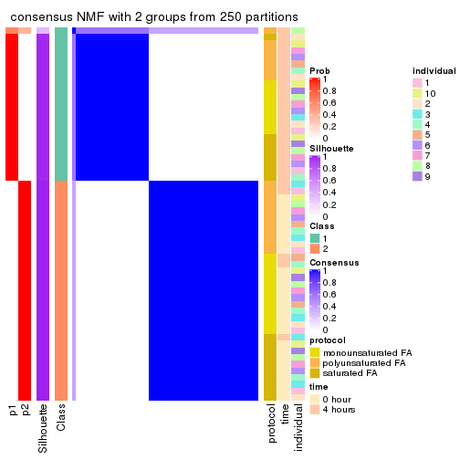</p>

</div>
<div id='tab-ATC-NMF-consensus-heatmap-2'>
<pre><code class="r">consensus_heatmap(res, k = 3)
</code></pre>

<p>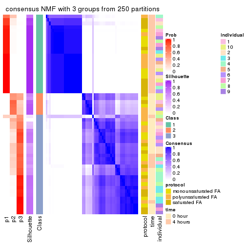</p>

</div>
<div id='tab-ATC-NMF-consensus-heatmap-3'>
<pre><code class="r">consensus_heatmap(res, k = 4)
</code></pre>

<p>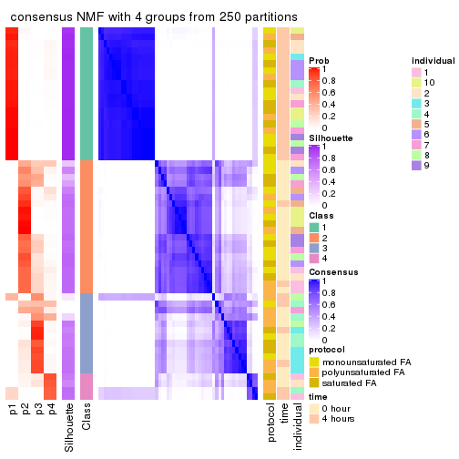</p>

</div>
<div id='tab-ATC-NMF-consensus-heatmap-4'>
<pre><code class="r">consensus_heatmap(res, k = 5)
</code></pre>

<p>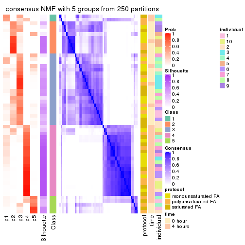</p>

</div>
<div id='tab-ATC-NMF-consensus-heatmap-5'>
<pre><code class="r">consensus_heatmap(res, k = 6)
</code></pre>

<p>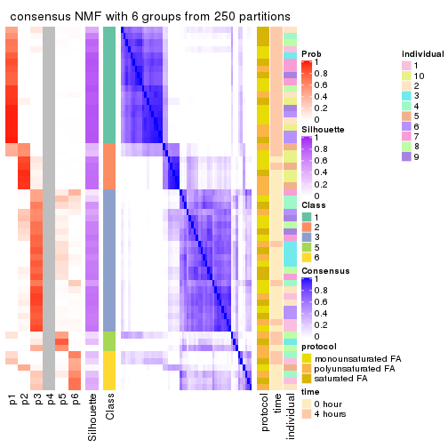</p>

</div>
</div>

Heatmaps for the membership of samples in all partitions to see how consistent they are:


<script>
$( function() {
	$( '#tabs-ATC-NMF-membership-heatmap' ).tabs();
} );
</script>
<div id='tabs-ATC-NMF-membership-heatmap'>
<ul>
<li><a href='#tab-ATC-NMF-membership-heatmap-1'>k = 2</a></li>
<li><a href='#tab-ATC-NMF-membership-heatmap-2'>k = 3</a></li>
<li><a href='#tab-ATC-NMF-membership-heatmap-3'>k = 4</a></li>
<li><a href='#tab-ATC-NMF-membership-heatmap-4'>k = 5</a></li>
<li><a href='#tab-ATC-NMF-membership-heatmap-5'>k = 6</a></li>
</ul>
<div id='tab-ATC-NMF-membership-heatmap-1'>
<pre><code class="r">membership_heatmap(res, k = 2)
</code></pre>

<p>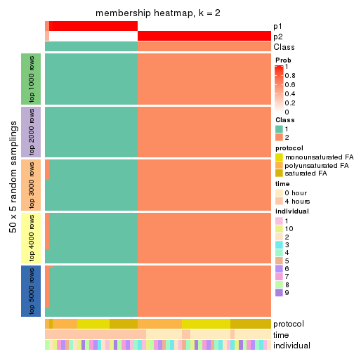</p>

</div>
<div id='tab-ATC-NMF-membership-heatmap-2'>
<pre><code class="r">membership_heatmap(res, k = 3)
</code></pre>

<p>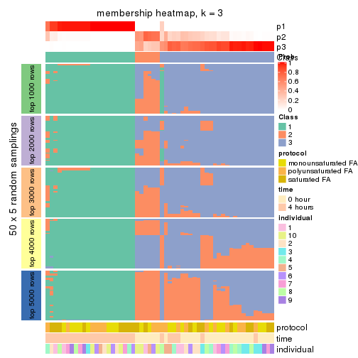</p>

</div>
<div id='tab-ATC-NMF-membership-heatmap-3'>
<pre><code class="r">membership_heatmap(res, k = 4)
</code></pre>

<p>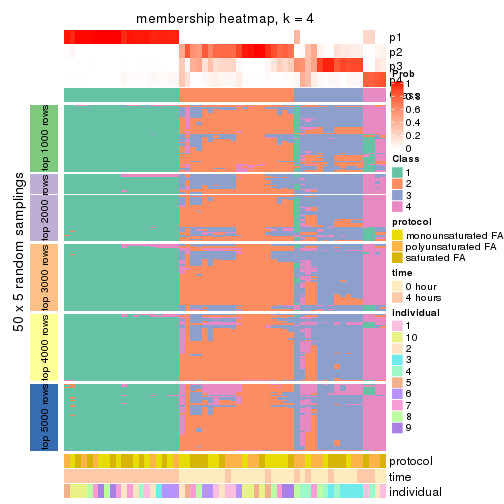</p>

</div>
<div id='tab-ATC-NMF-membership-heatmap-4'>
<pre><code class="r">membership_heatmap(res, k = 5)
</code></pre>

<p>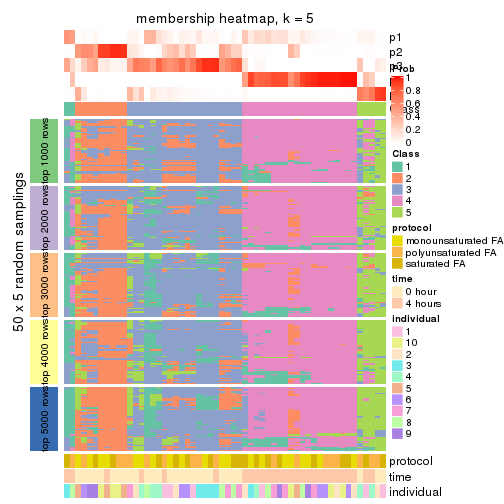</p>

</div>
<div id='tab-ATC-NMF-membership-heatmap-5'>
<pre><code class="r">membership_heatmap(res, k = 6)
</code></pre>

<p>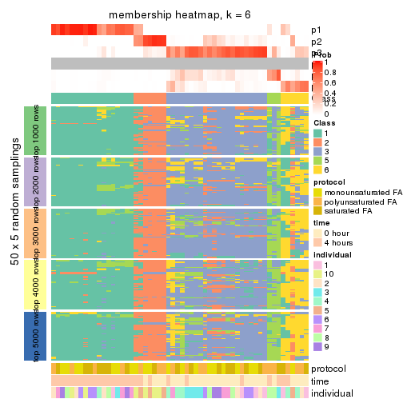</p>

</div>
</div>

As soon as we have had the classes for columns, we can look for signatures
which are significantly different between classes which can be candidate marks
for certain classes. Following are the heatmaps for signatures.


Signature heatmaps where rows are scaled:


<script>
$( function() {
	$( '#tabs-ATC-NMF-get-signatures' ).tabs();
} );
</script>
<div id='tabs-ATC-NMF-get-signatures'>
<ul>
<li><a href='#tab-ATC-NMF-get-signatures-1'>k = 2</a></li>
<li><a href='#tab-ATC-NMF-get-signatures-2'>k = 3</a></li>
<li><a href='#tab-ATC-NMF-get-signatures-3'>k = 4</a></li>
<li><a href='#tab-ATC-NMF-get-signatures-4'>k = 5</a></li>
<li><a href='#tab-ATC-NMF-get-signatures-5'>k = 6</a></li>
</ul>
<div id='tab-ATC-NMF-get-signatures-1'>
<pre><code class="r">get_signatures(res, k = 2)
</code></pre>

<p>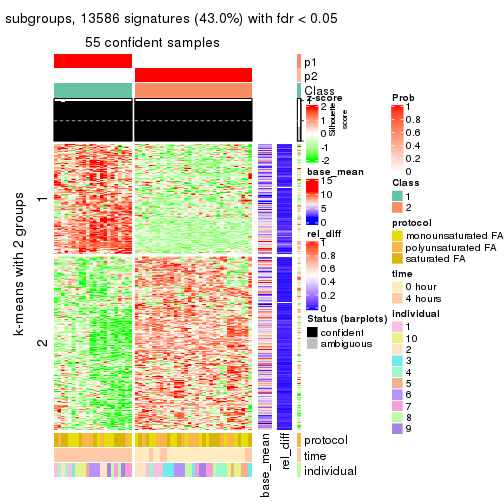</p>

</div>
<div id='tab-ATC-NMF-get-signatures-2'>
<pre><code class="r">get_signatures(res, k = 3)
</code></pre>

<p>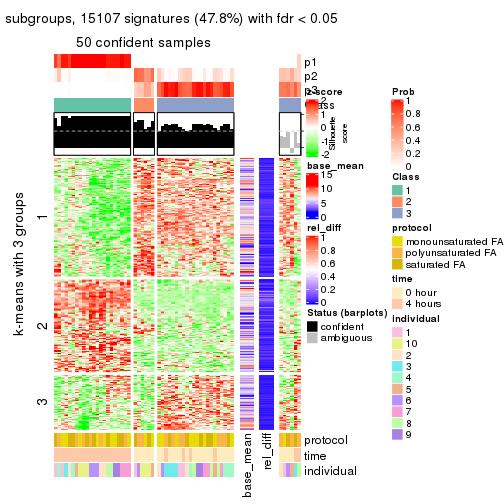</p>

</div>
<div id='tab-ATC-NMF-get-signatures-3'>
<pre><code class="r">get_signatures(res, k = 4)
</code></pre>

<p>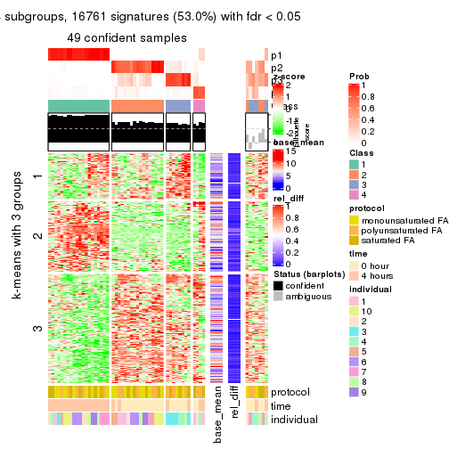</p>

</div>
<div id='tab-ATC-NMF-get-signatures-4'>
<pre><code class="r">get_signatures(res, k = 5)
</code></pre>

<p>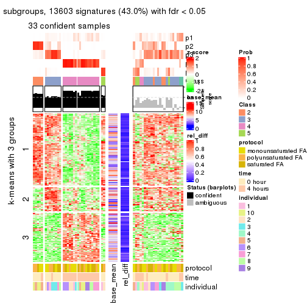</p>

</div>
<div id='tab-ATC-NMF-get-signatures-5'>
<pre><code class="r">get_signatures(res, k = 6)
</code></pre>

<p>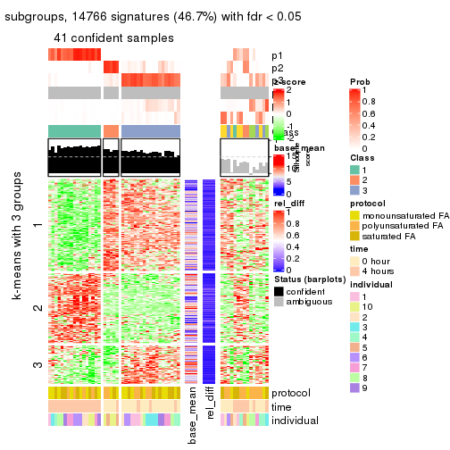</p>

</div>
</div>


Signature heatmaps where rows are not scaled:


<script>
$( function() {
	$( '#tabs-ATC-NMF-get-signatures-no-scale' ).tabs();
} );
</script>
<div id='tabs-ATC-NMF-get-signatures-no-scale'>
<ul>
<li><a href='#tab-ATC-NMF-get-signatures-no-scale-1'>k = 2</a></li>
<li><a href='#tab-ATC-NMF-get-signatures-no-scale-2'>k = 3</a></li>
<li><a href='#tab-ATC-NMF-get-signatures-no-scale-3'>k = 4</a></li>
<li><a href='#tab-ATC-NMF-get-signatures-no-scale-4'>k = 5</a></li>
<li><a href='#tab-ATC-NMF-get-signatures-no-scale-5'>k = 6</a></li>
</ul>
<div id='tab-ATC-NMF-get-signatures-no-scale-1'>
<pre><code class="r">get_signatures(res, k = 2, scale_rows = FALSE)
</code></pre>

<p>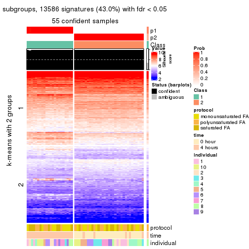</p>

</div>
<div id='tab-ATC-NMF-get-signatures-no-scale-2'>
<pre><code class="r">get_signatures(res, k = 3, scale_rows = FALSE)
</code></pre>

<p>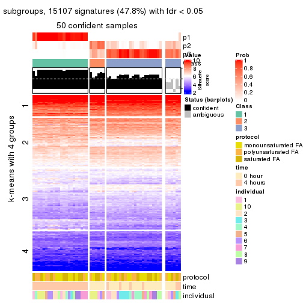</p>

</div>
<div id='tab-ATC-NMF-get-signatures-no-scale-3'>
<pre><code class="r">get_signatures(res, k = 4, scale_rows = FALSE)
</code></pre>

<p>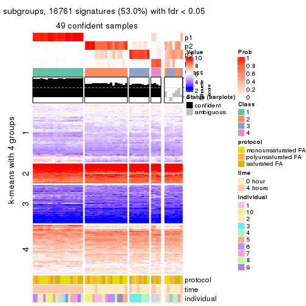</p>

</div>
<div id='tab-ATC-NMF-get-signatures-no-scale-4'>
<pre><code class="r">get_signatures(res, k = 5, scale_rows = FALSE)
</code></pre>

<p>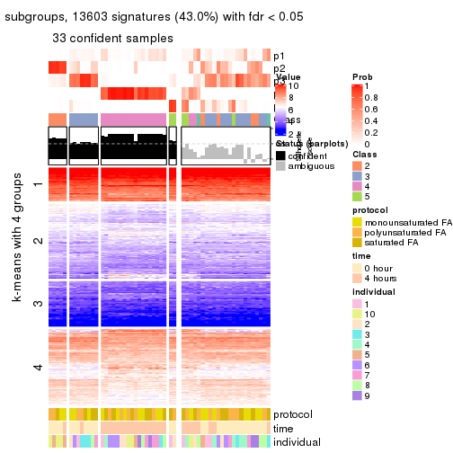</p>

</div>
<div id='tab-ATC-NMF-get-signatures-no-scale-5'>
<pre><code class="r">get_signatures(res, k = 6, scale_rows = FALSE)
</code></pre>

<p>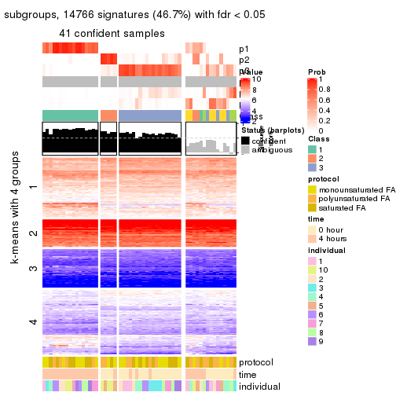</p>

</div>
</div>


Compare the overlap of signatures from different k:

```r
compare_signatures(res)
```

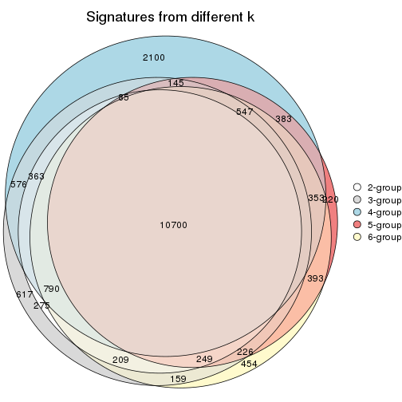

`get_signature()` returns a data frame invisibly. TO get the list of signatures, the function
call should be assigned to a variable explicitly. In following code, if `plot` argument is set
to `FALSE`, no heatmap is plotted while only the differential analysis is performed.

```r
# code only for demonstration
tb = get_signature(res, k = ..., plot = FALSE)
```

An example of the output of `tb` is:

```
#>   which_row         fdr    mean_1    mean_2 scaled_mean_1 scaled_mean_2 km
#> 1        38 0.042760348  8.373488  9.131774    -0.5533452     0.5164555  1
#> 2        40 0.018707592  7.106213  8.469186    -0.6173731     0.5762149  1
#> 3        55 0.019134737 10.221463 11.207825    -0.6159697     0.5749050  1
#> 4        59 0.006059896  5.921854  7.869574    -0.6899429     0.6439467  1
#> 5        60 0.018055526  8.928898 10.211722    -0.6204761     0.5791110  1
#> 6        98 0.009384629 15.714769 14.887706     0.6635654    -0.6193277  2
...
```

The columns in `tb` are:

1. `which_row`: row indices corresponding to the input matrix.
2. `fdr`: FDR for the differential test. 
3. `mean_x`: The mean value in group x.
4. `scaled_mean_x`: The mean value in group x after rows are scaled.
5. `km`: Row groups if k-means clustering is applied to rows.


UMAP plot which shows how samples are separated.


<script>
$( function() {
	$( '#tabs-ATC-NMF-dimension-reduction' ).tabs();
} );
</script>
<div id='tabs-ATC-NMF-dimension-reduction'>
<ul>
<li><a href='#tab-ATC-NMF-dimension-reduction-1'>k = 2</a></li>
<li><a href='#tab-ATC-NMF-dimension-reduction-2'>k = 3</a></li>
<li><a href='#tab-ATC-NMF-dimension-reduction-3'>k = 4</a></li>
<li><a href='#tab-ATC-NMF-dimension-reduction-4'>k = 5</a></li>
<li><a href='#tab-ATC-NMF-dimension-reduction-5'>k = 6</a></li>
</ul>
<div id='tab-ATC-NMF-dimension-reduction-1'>
<pre><code class="r">dimension_reduction(res, k = 2, method = &quot;UMAP&quot;)
</code></pre>

<p>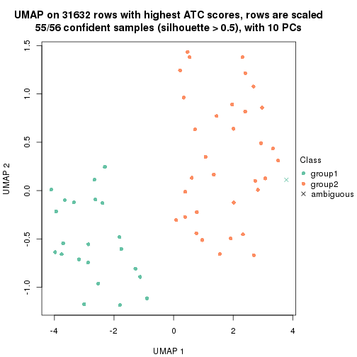</p>

</div>
<div id='tab-ATC-NMF-dimension-reduction-2'>
<pre><code class="r">dimension_reduction(res, k = 3, method = &quot;UMAP&quot;)
</code></pre>

<p>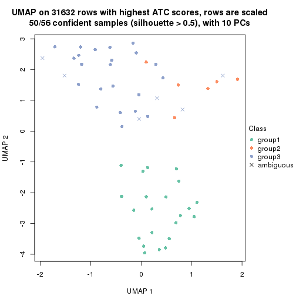</p>

</div>
<div id='tab-ATC-NMF-dimension-reduction-3'>
<pre><code class="r">dimension_reduction(res, k = 4, method = &quot;UMAP&quot;)
</code></pre>

<p>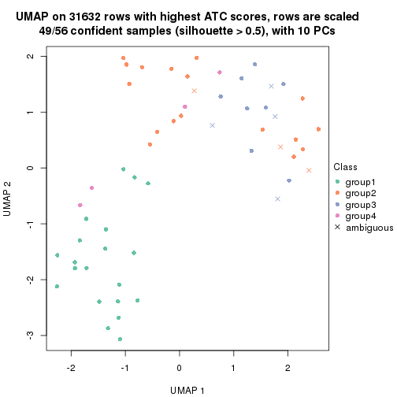</p>

</div>
<div id='tab-ATC-NMF-dimension-reduction-4'>
<pre><code class="r">dimension_reduction(res, k = 5, method = &quot;UMAP&quot;)
</code></pre>

<p>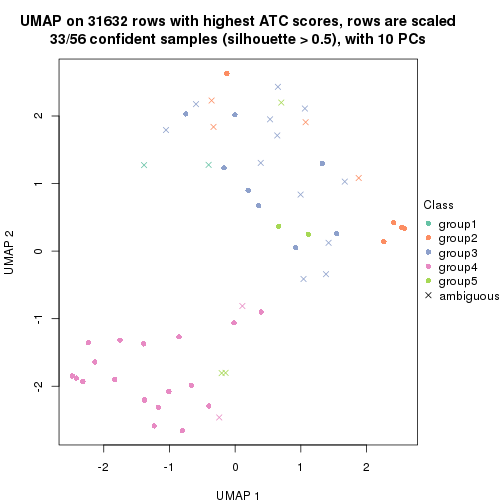</p>

</div>
<div id='tab-ATC-NMF-dimension-reduction-5'>
<pre><code class="r">dimension_reduction(res, k = 6, method = &quot;UMAP&quot;)
</code></pre>

<p>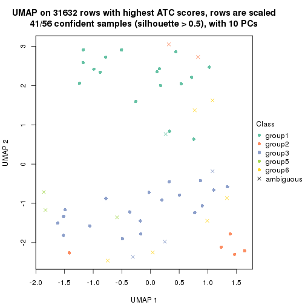</p>

</div>
</div>


Following heatmap shows how subgroups are split when increasing `k`:

```r
collect_classes(res)
```

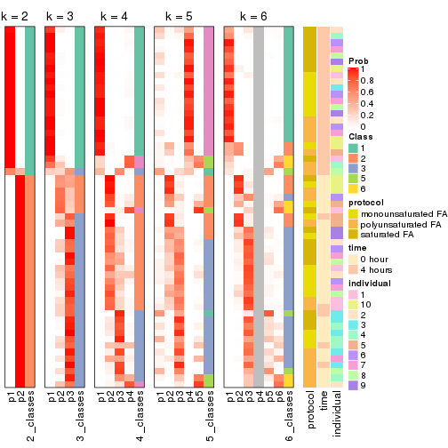


Test correlation between subgroups and known annotations. If the known
annotation is numeric, one-way ANOVA test is applied, and if the known
annotation is discrete, chi-squared contingency table test is applied.

```r
test_to_known_factors(res)
```

```
#>          n protocol(p)  time(p) individual(p) k
#> ATC:NMF 55       0.859 3.84e-09        0.9591 2
#> ATC:NMF 50       0.975 9.77e-09        0.3216 3
#> ATC:NMF 49       0.671 5.56e-07        0.0114 4
#> ATC:NMF 33       0.939 9.61e-06        0.1778 5
#> ATC:NMF 41       0.919 9.72e-07        0.0110 6
```


If matrix rows can be associated to genes, consider to use `functional_enrichment(res,
...)` to perform function enrichment for the signature genes. See [this vignette](http://bioconductor.org/packages/devel/bioc/vignettes/cola/inst/doc/functional_enrichment.html) for more detailed explanations.


 

## Session info


```r
sessionInfo()
```

```
#> R version 3.6.0 (2019-04-26)
#> Platform: x86_64-pc-linux-gnu (64-bit)
#> Running under: CentOS Linux 7 (Core)
#> 
#> Matrix products: default
#> BLAS:   /usr/lib64/libblas.so.3.4.2
#> LAPACK: /usr/lib64/liblapack.so.3.4.2
#> 
#> locale:
#>  [1] LC_CTYPE=en_GB.UTF-8       LC_NUMERIC=C               LC_TIME=en_GB.UTF-8       
#>  [4] LC_COLLATE=en_GB.UTF-8     LC_MONETARY=en_GB.UTF-8    LC_MESSAGES=en_GB.UTF-8   
#>  [7] LC_PAPER=en_GB.UTF-8       LC_NAME=C                  LC_ADDRESS=C              
#> [10] LC_TELEPHONE=C             LC_MEASUREMENT=en_GB.UTF-8 LC_IDENTIFICATION=C       
#> 
#> attached base packages:
#> [1] grid      stats     graphics  grDevices utils     datasets  methods   base     
#> 
#> other attached packages:
#> [1] genefilter_1.66.0    ComplexHeatmap_2.3.1 markdown_1.1         knitr_1.26          
#> [5] GetoptLong_0.1.7     cola_1.3.2          
#> 
#> loaded via a namespace (and not attached):
#>  [1] circlize_0.4.8       shape_1.4.4          xfun_0.11            slam_0.1-46         
#>  [5] lattice_0.20-38      splines_3.6.0        colorspace_1.4-1     vctrs_0.2.0         
#>  [9] stats4_3.6.0         blob_1.2.0           XML_3.98-1.20        survival_2.44-1.1   
#> [13] rlang_0.4.2          pillar_1.4.2         DBI_1.0.0            BiocGenerics_0.30.0 
#> [17] bit64_0.9-7          RColorBrewer_1.1-2   matrixStats_0.55.0   stringr_1.4.0       
#> [21] GlobalOptions_0.1.1  evaluate_0.14        memoise_1.1.0        Biobase_2.44.0      
#> [25] IRanges_2.18.3       parallel_3.6.0       AnnotationDbi_1.46.1 highr_0.8           
#> [29] Rcpp_1.0.3           xtable_1.8-4         backports_1.1.5      S4Vectors_0.22.1    
#> [33] annotate_1.62.0      skmeans_0.2-11       bit_1.1-14           microbenchmark_1.4-7
#> [37] brew_1.0-6           impute_1.58.0        rjson_0.2.20         png_0.1-7           
#> [41] digest_0.6.23        stringi_1.4.3        polyclip_1.10-0      clue_0.3-57         
#> [45] tools_3.6.0          bitops_1.0-6         magrittr_1.5         eulerr_6.0.0        
#> [49] RCurl_1.95-4.12      RSQLite_2.1.4        tibble_2.1.3         cluster_2.1.0       
#> [53] crayon_1.3.4         pkgconfig_2.0.3      zeallot_0.1.0        Matrix_1.2-17       
#> [57] xml2_1.2.2           httr_1.4.1           R6_2.4.1             mclust_5.4.5        
#> [61] compiler_3.6.0
```


